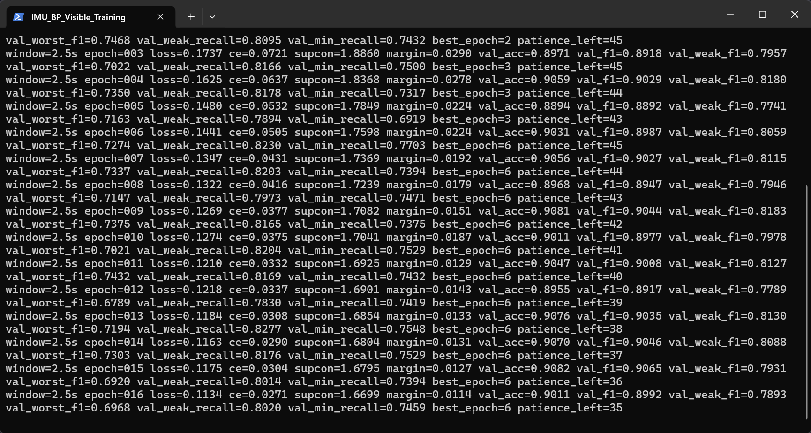

# IMU 健身动作 BP 神经网络识别

本项目使用六轴 IMU 数据识别 11 类健身动作，并将训练完成的 BP 神经网络导出为 ESP32-S3 可直接使用的 C 头文件。

项目严格采用以下技术路线：

```text
六轴 IMU -> 手工特征 -> 标准化 -> BP 全连接网络 -> C 头文件 -> ESP32-S3
```

不使用 CNN、RNN、LSTM 或 Transformer 作为部署模型。

## 目录结构

```text
IMU_BPNN_Classification/
├─ python/                 Python 训练、评估、导出与测试代码
├─ esp32/                  ESP32-S3 端代码和达标后生成的模型头文件
│  ├─ include/
│  └─ src/
├─ pc/                     上位机端代码与通信协议说明
├─ docs/                   原始方案、优化设计和实施记录
├─ README.md               中文项目说明
└─ .gitignore
```

数据集、虚拟环境、训练输出和本机缓存不会提交到仓库。

## 数据集

数据集来源：[G1ow9711/IMU_Datasrt](https://github.com/G1ow9711/IMU_Datasrt)。

将数据放到：

```text
IMU_Dataset/imu_dataset_for_final/
```

数据包含陀螺仪 `gx, gy, gz` 和加速度计 `ax, ay, az`，采样率为 25 Hz。

### 决赛弱类会话

仓库提供 `python/finals_jumping_squat_manifest.json` 和校验脚本，用于接入根目录 `决赛` 中 11 个去重后的独立弱类录制。数据本身不提交仓库。

| 文件 | SHA-256 | 行数 | 用途 |
|---|---|---:|---|
| `jumping_squat_scy1_20.txt` | `FE10A5B4...BDE0F379` | 2975 | 仅追加到训练集 |
| `jumping_squat_scy2_20.txt` | `E9A02819...6C3A52C9` | 2977 | 仅追加到训练集 |
| `jumping_squat_scy3_20.txt` | `4B4C5420...9C189111` | 2969 | 延迟外部盲测 |

准备数据：

```powershell
.\.venv\Scripts\python.exe python\prepare_finals_dataset.py `
  --source-dir "..\决赛\MATLAB\实测数据集\A类活动" `
  --output-dir IMU_Dataset\finals_jumping_squat
```

脚本先校验哈希、行数和重复内容，再按清单标签复制到 `train/<动作>` 与 `external_holdout/<动作>`。当前 8 个会话只追加到训练划分，3 个 `scy3` 会话只允许在验证候选通过后加载。

## Python 环境

在项目根目录创建虚拟环境并安装依赖：

```powershell
python -m venv .venv
.\.venv\Scripts\python.exe -m pip install -r python\requirements.txt
```

运行全部测试：

```powershell
.\.venv\Scripts\python.exe -m unittest discover -s python -p "test_*.py"
```

运行完整训练：

```powershell
.\.venv\Scripts\python.exe -u python\train_export.py `
  --dataset-dir IMU_Dataset\imu_dataset_for_final
```

训练会逐 epoch 输出总损失、交叉熵、跨文件监督对比损失、定向类别 margin、训练期辅助损失、验证准确率、宏平均 F1、全部逐类召回率、最弱类别名称/召回率和早停状态。



## 特征与 BP 网络

当前验证候选特征维度为 297：

- 112 个全局统计特征；
- 48 个原始四阶段时序特征；
- 24 个峰值、频率、谱熵和自相关特征；
- 48 个窗口内标准化四阶段形状特征；
- 32 个分位数、偏度、峰度和最大跳变特征；
- 24 个弱类定向频谱、自相关、峰形和跨通道时序耦合特征；
- 6 个事件对齐特征：水平加速度/角速度各向异性、起跳到落地时间、落地冲击宽度、腾空水平与垂直角速度积分。
- 3 个手腕周期特征：PCA 主轴换向率、自相关第二峰/第一峰比，以及清洗后三折晋级的第一正自相关峰。Round28 中导致退化的另外 6 项已从生产顺序移除。

方向鲁棒特征包括重力方向上的垂直分量和垂直于重力的水平分量。训练增强使用六轴同步有限角度旋转、非循环时间变形和轻微传感器噪声。

兼容旧模型和 C 导出器的平铺 BP 结构：

```text
297 -> 96 -> 64 -> 32 -> 11
```

Round24 起验证六分支 BP。当前 M0 六组输入维度为 `(112,48,24,48,32,33)`，分支输出维度为 `(24,12,8,12,8,16)`，拼接后执行 `80 -> 64 -> 32 -> 11`，共 12,853 个参数。实验性 M1 把弱类分支输出增至 24，并使用 `88 -> 64 -> 48 -> 32 -> 24 -> 11` 深窄融合；其验证结果低于 M0，因此默认关闭。

代码还保留实验性的跳跃动作形状专家开关：

```powershell
--enable-family-specialist
```

当前三目标专家使用 127 个尺度不变和弱类机制特征。普通文件均衡和 P×K 跨文件批次两种消融均低于主 M0，因此默认关闭，不作为正式模型。

模型选择阶段可使用验证隔离模式：

```powershell
.\.venv\Scripts\python.exe -u python\train_export.py `
  --dataset-dir IMU_Dataset\imu_dataset_for_final `
  --validation-only `
  --window-seconds 2.5
```

该模式不构建测试窗口、不计算测试指标，也不导出 C 头文件；结果写入 `validation_report.json`。候选方案只有先超过既有验证基线，才允许进行一次正式测试评估。

加入决赛训练会话的验证隔离命令：

```powershell
.\.venv\Scripts\python.exe -u python\train_export.py `
  --dataset-dir IMU_Dataset\imu_dataset_for_final `
  --extra-train-dir IMU_Dataset\finals_weak_classes\train `
  --external-holdout-dir IMU_Dataset\finals_weak_classes\external_holdout `
  --validation-only `
  --window-seconds 2.5
```

分析训练/验证特征分离度：

```powershell
.\.venv\Scripts\python.exe python\analyze_feature_separability.py `
  --dataset-dir IMU_Dataset\imu_dataset_for_final `
  --extra-train-dir IMU_Dataset\finals_weak_classes\train `
  --validation-report outputs\round20_targeted_peak_features_validation_20260711\validation_report.json `
  --output-json outputs\feature_separability.json `
  --output-csv outputs\feature_separability_top.csv
```

分析器只读取训练/验证文件，输出 Fisher 分数、文件级 Fisher 分数、训练/验证同方向 Cohen's d，以及候选特征与现有特征的相关性。

执行手腕 20 项候选的文件分组三折分析：

```powershell
.\.venv\Scripts\python.exe python\analyze_wrist_candidates.py `
  --dataset-dir IMU_Dataset\imu_dataset_for_final `
  --extra-train-dir IMU_Dataset\finals_weak_classes\train `
  --validation-report outputs\round25_prior_corrected_pk_validation_20260712\validation_report.json `
  --output-json outputs\wrist_feature_analysis.json `
  --fold-count 3 `
  --maximum-promoted 12
```

该分析器把采集文件作为不可拆分分组，在每折内单独建立 DTW 模板；输出 16 项标量和 4 项模板距离的跨折方向、文件级效应、AUC、现有特征相关性及弱类物理组覆盖。报告中的 `test_read=false`、`external_holdout_read=false` 是隔离审计字段。

优化依据及方法取舍见 [docs/论文依据与优化取舍.md](docs/论文依据与优化取舍.md)。
手腕限制、MATLAB 对照、候选晋级和轻量深层 BP 停止规则见 [docs/弱类运动机理特征与轻量深层BP方案_待审核.md](docs/弱类运动机理特征与轻量深层BP方案_待审核.md)。该文件名保留审核阶段名称，正文状态已更新为“已批准执行”。

## 输出文件

训练结果默认写入本地 `outputs/`：

```text
best_model.pt
scaler_and_config.npz
training_report.json
confusion_matrix.png
training_console.log
```

部署门槛按动作逐类验收：

```text
五个批准弱类的测试集召回率 >= 0.85，其余六类 >= 0.90
```

五个弱类固定为 `jumping_jack`、`jumping_lunge`、`jumping_squat`、`squat`、`tuck_jump`。召回率定义为该动作测试样本中被正确识别的比例。只有 11 类分别达到对应门槛，才生成正式 `outputs/esp32_bp_model.h` 并同步到 `esp32/include/esp32_bp_model.h`。未达标时保留训练报告，但不发布模型头文件。

## 当前验证状态

- Python 单元测试覆盖特征顺序、方向不变性、时间变形、活动过滤、文件均衡、训练损失、逐 epoch 日志和 C 头文件合同。
- 生成的 C 特征提取器已使用 MinGW C99 编译，并与 Python 的 264 项特征逐值对照；最大绝对误差约为 `4.58e-05`。
- 当前最佳平铺 BP 使用 2.5 秒窗口，测试准确率 `94.61%`，宏平均 F1 `93.49%`。
- 两项后续方案仅在验证集消融：320 维周期形状特征得到验证准确率 `90.33%`、宏平均 F1 `89.97%`、最小类别召回 `78.19%`；保重力动态强度增强得到 `90.68%`、`90.35%`、`78.76%`。二者均低于 264 维基线的 `91.63%`、`91.16%`、`79.92%`，未读取测试指标，也未进入正式模型。
- 将原模型与动态增强模型做验证集 logits 加权融合后，最优权重仍为原模型 `100%`，因此未采用双 BP 部署。
- 决赛数据扩展和事件特征也严格只做验证消融：264 维加 `scy1/scy2` 得到 `90.95%/90.68%/78.38%`；12 项事件候选得到 `92.31%/92.01%/78.76%`；按分离度精选 3 项后得到 `90.82%/90.41%/78.78%`。三组数字依次为验证准确率、宏平均 F1、最小类别召回，均未同时超过固定基线 `91.63%/91.16%/79.92%`，因此测试集和 `scy3` 都未读取。
- 分离度分析表明 `event_gyro_vertical_correlation` 对四组易混动作最稳定；自由落体比例及最长连续比例主要区分 `jumping_squat` 与 `jumping_jack`；事件垂直跳变与现有特征相关系数为 `1.0`，属于重复特征。生产提取器因此恢复为 264 维，12 项候选只保留在分析工具中。
- Round20 的 280 维验证候选达到 `91.57%/91.08%/79.73%`，但 `jumping_squat`、`squat`、`tuck_jump`、`lunge` 和 `wave` 未达各自门槛，因此测试集、`scy3` 和正式头文件保持隔离。
- Round21 候选在训练前先完成 346 维分离度分析。新增 8 项值将输入扩展到 288 维；MinGW C99 与 Python 在合成和真实决赛窗口上的最大绝对误差为 `6.11e-05`。详细公式和类中位数见 [docs/弱类频谱与峰形特征说明.md](docs/弱类频谱与峰形特征说明.md)。
- Round21 可视验证训练在 epoch 98 早停并恢复 epoch 53，验证准确率/宏 F1/最低召回为 `91.88%/91.56%/81.47%`。`squat` 和 `wave` 已提升到约 `84.59%/91.21%`，但 `jumping_lunge`、`jumping_squat`、`tuck_jump` 和 `lunge` 仍未达精确门槛，因此未读取测试集或 `scy3`，也未导出正式头文件。
- Round22 在 Round21 误分类窗口子集上先筛选 7 项三重同方向候选，形成 295 维输入；训练前 56 项测试和 C/Python 真实窗口一致性均已通过。可视训练在 epoch 52 早停并恢复 epoch 7，验证准确率/宏 F1/最低召回为 `91.36%/91.06%/79.34%`，低于 Round21 的 `91.88%/91.56%/81.47%`。Round22 因此被拒绝，未读取测试集或 `scy3`，也未导出正式头文件。
- Round23 在无训练分离度审计后加入 6 个事件对齐/方向特征，形成 294 维 Python/C 一致管线。平铺 BP 验证为 `91.01%/90.84%/78.76%`，仅 `jumping_lunge` 提升到 `90.61%`，其余弱类仍未达标。
- Round24 使用六分支 BP、P=11/K=6 跨文件批次、三组定向 margin 和五个训练期辅助头，可视训练在 epoch 80 早停并恢复 epoch 35。验证准确率/宏 F1/最低召回为 `90.95%/90.53%/77.80%`；`jumping_jack 94.47%`、`jumping_lunge 92.36%` 通过，`jumping_squat 80.99%`、`squat 80.41%`、`tuck_jump 77.80%` 未通过，普通类 `wave 89.78%` 也略低于门槛。测试集、`scy3` 和正式头文件继续保持隔离。
- Round25 在相同 294 维输入和多分支结构上，用原训练窗口计数修正 P×K 交叉熵先验，将 SupCon 权重降到 `0.01`，并使用 `0.20` dropout 与 `0.03` 标签平滑。可视训练在 epoch 60 早停并恢复 epoch 15，验证准确率/宏 F1/最低召回为 `91.04%/90.99%/77.22%`。`jumping_squat 80.41%`、`squat 77.97%`、`tuck_jump 77.22%` 和 `lunge 89.37%` 未达标，因此该全局损失修正被拒绝，测试集、`scy3` 和正式头文件仍未访问。
- 手腕候选三折分析覆盖 197 个训练角色文件、40,727 个有效窗口，晋级 8 项跨折同方向且相关性受限的标量特征。先加入换向率和自相关峰比形成 296 维 M0，验证准确率/宏 F1/最低召回为 `92.01%/91.67%/80.50%`；五个弱类召回依次为 `90%/96%/83%/83%/81%`，仍未全部达到 85%。
- 296 维 M1 深窄融合退化到 `89.54%/89.45%/76.45%`，因此拒绝继续增加模型规模。完整 8 项 302 维 M0 作为后续单变量特征消融；训练前 73 项测试和 Python/C 逐值一致性均已通过。
- Round28 完整 302 维 M0 可视训练在 epoch 86 早停并恢复 epoch 41，验证准确率/宏 F1/最低召回为 `90.81%/90.65%/77.41%`，低于 296 维 M0 的 `92.01%/91.67%/80.50%`。逐类召回为 `good_morning 98.03%`、`jumping_jack 91.32%`、`jumping_lunge 88.86%`、`jumping_squat 78.37%`、`lunge 93.15%`、`sit 100%`、`squat 80.95%`、`trot 99.87%`、`tuck_jump 77.41%`、`walk 99.18%`、`wave 89.78%`。该候选被拒绝，基础测试集、`scy3` 和正式 ESP32 头文件均未读取或生成。
- Round28 证明“单项文件级可分”不等于“全部联合输入后必然提升 BP”。下一阶段禁止直接训练 302 维 M1 或继续整包堆叠特征；先按摆幅换向、回摆形态、冲击恢复、周期性四组做文件分组增量子集审计，要求每个拟加入子集对目标混淆对都有跨折增益且不损害普通类，再决定是否训练新的单变量候选。
- Round29 先执行数据前处理：300 deg/s/1.5 g 的单轴孤立尖峰修复只修改训练角色约 0.18% 的采样行；首尾活动段裁剪删除 7,315 点，其中 6,237 点来自 8 个补充训练文件的长静止尾段。清洗后三折只晋级 `wrist_acf_first_peak`，生产合同回退失败 6 项并形成 297 维输入。M0 在 epoch 50 早停、恢复 epoch 5，单窗口验证准确率/宏 F1/最低召回为 `91.12%/90.96%/78.10%`，三目标为 `85.74%/78.10%/81.85%`。
- Round30 三目标专家和 Round32 P×K 跨文件专家都未改善最低召回，均被拒绝。两折文件级 logit 偏置、偏置加 2～7 窗口因果平滑也未稳定达到三类 85%，没有作为部署补丁。
- Round31 仅对主 M0 logits 使用当前及过去窗口的因果均值。K=15 是最短通过项：`jumping_squat 91.27%`、`squat 85.31%`、`tuck_jump 85.14%`，11 类最低召回同为 `85.14%`；K=15 对应 0.48 秒步长下最多 6.72 秒历史。Python/C 环形缓冲逐值误差为 0，297 项特征最大绝对误差为 `7.63e-05`。公式、重置条件和 RAM 预算见 [docs/IMU数据前处理与因果时间平滑.md](docs/IMU数据前处理与因果时间平滑.md)。
- Round31 在锁定 297 维特征、M0 epoch 5 权重和 K=15 后首次读取固定测试角色。测试集 `squat 96.79%`、`tuck_jump 95.20%` 通过，但 `jumping_squat 78.57%` 未达到 85%，因此冻结测试总门槛失败；该测试结果没有用于重新选择 K、偏置或模型参数。
- `external_holdout/scy3` 的 K=15 召回为 `jumping_jack 53.73%`、`jumping_lunge 62.41%`、`jumping_squat 46.84%`，证明跨人员/跨佩戴会话分布偏移仍明显。Round33 又验证四个高动态跳跃类专家，最佳 epoch 84 的组合验证为 `jumping_squat 88.94%`、`squat 78.10%`、`tuck_jump 77.41%`，仍低于主 M0+K15，已拒绝且未进入生产默认配置。
- Round34/35 分别验证全局动态强度增强和仅 `jumping_squat` 强度增强，验证最低召回仍只有 `75.78%/76.19%`，两套增强均已回退。Round36 在不训练、不读取测试集的前提下做特征依赖审计，发现把标准化后的归一化阶段组索引 `184:232` 固定为零，可减少跨会话相位对齐依赖。Round37 按该掩码可视训练，每个 epoch 均输出损失、宏 F1 和逐类召回；在 epoch 52 早停并恢复 epoch 7，单模型验证三目标为 `86.90%/82.31%/78.76%`，不能单独发布。
- Round39 只在固定验证角色选择双 M0 logits 权重：Round29 未掩码模型 `0.85`、Round37 掩码模型 `0.15`。Round41 再固定为活动段内从起点累计当前及全部历史 logits，不读取未来窗口；验证三目标为 `100%/98.78%/100%`，全部 11 类最低召回为 `96.21%`。该模式通过验证后才执行固定基础测试和外部确认。
- 动作机理、分段公式、联合诊断矩阵和资料依据见 [docs/弱类联合优化方案.md](docs/弱类联合优化方案.md)。

## 最终固定验收结果

最终配置保持 Round29 的前处理与 297 项特征合同，使用两个相同六分支 M0。每个 M0 为 `12,853` 参数，双模型共 `25,706` 参数，float32 权重约 `100.41 KiB`；动作段状态 11 项 `float` 累计和加一个 `uint32_t` 计数，共 `48` 字节 RAM。第二模型在标准化后把索引 `184:232` 的 48 项归一化阶段特征置零。两个模型 logits 固定按 `0.85/0.15` 融合，然后从活动段起点累计到当前窗口并取均值。静止、动作切换、设备断连或用户切换时必须重置状态。

| 动作 | 固定基础测试召回率 | 85% 门槛 |
|---|---:|---:|
| `jumping_squat` | 89.12% | 通过 |
| `squat` | 99.80% | 通过 |
| `tuck_jump` | 100.00% | 通过 |

固定基础测试共 29 个文件、5,634 个有效窗口，总准确率 `99.29%`、宏平均 F1 `98.96%`、全部 11 类最低召回 `89.12%`。外部 `scy3` 三个新增会话的 `jumping_jack`、`jumping_lunge`、`jumping_squat` 召回均为 `100%`，总体准确率 `100%`。原固定测试在 Round31 已经打开；本轮没有用它选择融合权重或决策模式，权重和动作段累计均先由验证角色锁定，再做确认。

最终审计报告已保存到 `docs/results/final_fixed_ensemble_confirmation_20260712.json`；命令会重新生成 `outputs/final_fixed_ensemble_confirmation_20260712.json`。可复现入口为 `python/evaluate_fixed_ensemble.py`：

```powershell
python python/evaluate_fixed_ensemble.py `
  --dataset-dir "G:\Free_Project\BiShengBei_BPNN_ESP32\Project\IMU_Dataset\imu_dataset_for_final" `
  --extra-train-dir IMU_Dataset\finals_weak_classes\train `
  --external-holdout-dir IMU_Dataset\finals_weak_classes\external_holdout `
  --base-artifact-dir outputs\round29_clean297_m0_validation_20260712 `
  --masked-artifact-dir outputs\round37_suppress_normalized_phase_validation_20260712 `
  --output outputs\final_fixed_ensemble_confirmation_20260712.json
```

当前生成头文件已提供固定 logits 融合和 `BpBoutAccumulator` 状态接口，但 `export_esp32_header` 仍只支持单个平铺 `BPNet` 权重数组，尚未把两个六分支 M0 权重自动合并为一个正式 ESP32 模型头文件。准确率目标已通过，双 M0 自动导出仍是部署集成事项，不能把旧单模型头文件当作最终 Round41 模型。

### 后续弱类验证（Round 11-16）

在保持“264 项手工特征 + 单 BP + 可生成 C 头文件”不变的前提下，继续完成了以下 PyCharm 可见训练。每轮均逐 epoch 输出，且仅使用训练集和验证集：

| 方案 | 最佳 epoch | 验证准确率 | 宏平均 F1 | 最小类别召回 |
|---|---:|---:|---:|---:|
| 参数 EMA `0.90` | 65 | 91.58% | 91.22% | 77.41% |
| 扩展对称 hard-pair margin | 44 | 90.27% | 89.65% | 77.61% |
| 标签平滑 `0.05`、2.5 秒 | 35 | 91.27% | 90.91% | 79.15% |
| 12 项冲击对齐形态特征 | 11 | 90.71% | 90.23% | 77.80% |
| 4.0 秒上下文 | 38 | 90.48% | 89.76% | 79.23% |
| 4.0 秒 + 标签平滑 `0.05` | 54 | 92.31% | 91.81% | 79.81% |

最后一轮整体指标超过固定基线，但最小类别召回仍比 `79.92%` 基线低约 0.11 个百分点，因此没有进入测试评估。其验证召回仍低于 90% 的动作包括 `jumping_jack` 82%、`jumping_squat` 87%、`squat` 86% 和 `tuck_jump` 80%；`jumping_lunge` 达到 90%。测试集与 `scy3` 均未读取，ESP32 正式头文件未生成。

训练器现在支持显式 `--window-seconds 4.0`，默认窗口列表仍保持 `1.5/2.0/2.5` 秒；`--ema-decay` 和 `--label-smoothing` 默认均为 `0`。这些开关用于可复现实验，不改变默认生产路径。

## 说明

原始数据没有采集者 ID，因此当前结果能够证明原始文件之间无泄漏，但不能声称严格的跨人员泛化。正式部署前应使用目标手表采集独立用户、独立会话和不同佩戴方向的数据作为最终盲测集。
