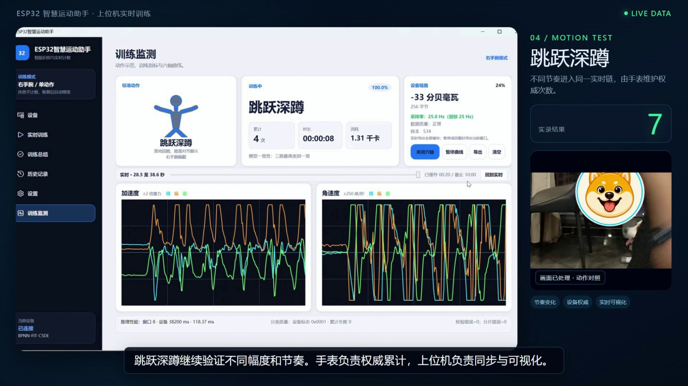
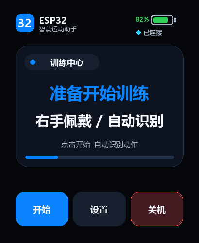
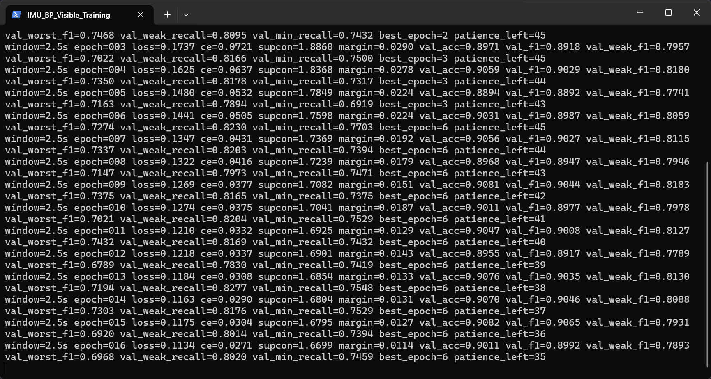
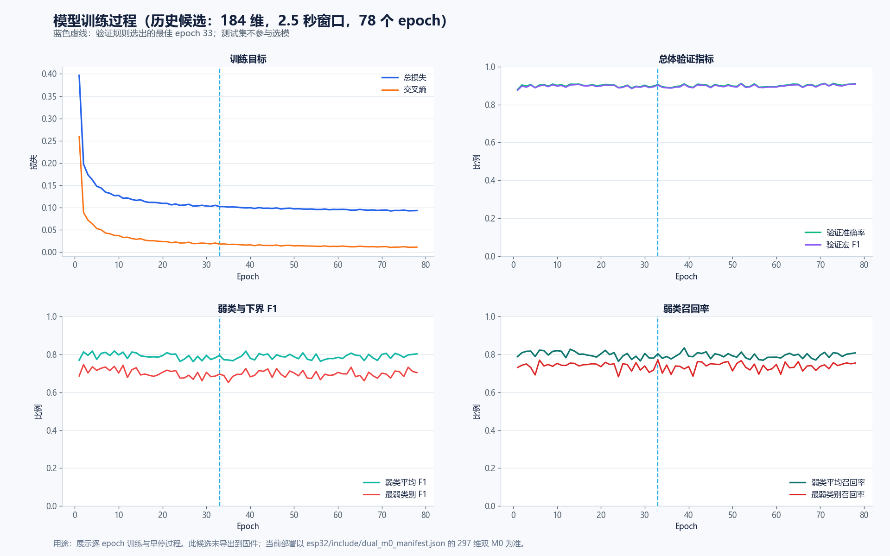
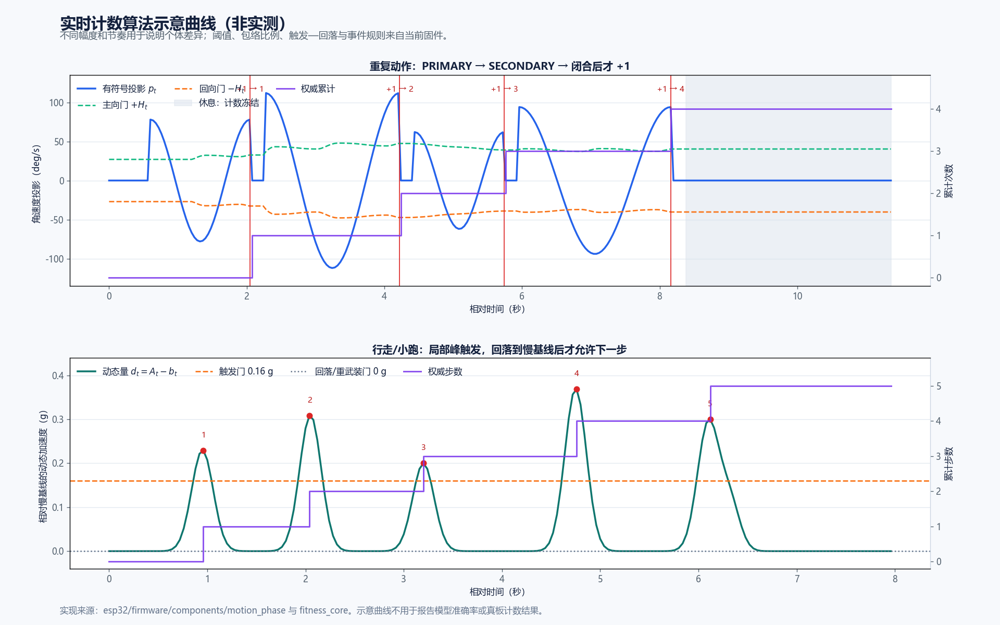
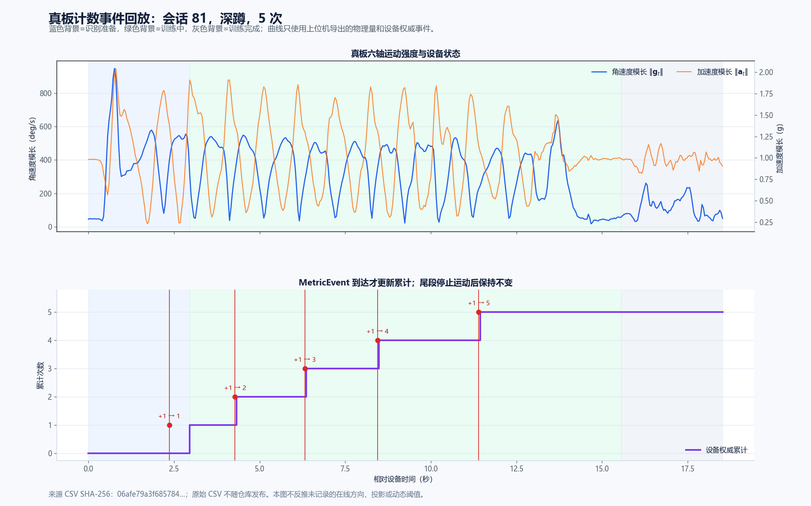

# 手腕 IMU 健身动作识别与实时计数教程

[查看教程工程持续集成状态](https://github.com/G1ow9711/IMU_BPNN_Classification/actions/workflows/ci.yml)

## 实际运行演示

[](https://github.com/G1ow9711/IMU_BPNN_Classification/blob/main/docs/assets/video/ESP32%20智慧运动助手.mp4)

**点击封面观看完整视频：[`ESP32 智慧运动助手.mp4`](https://github.com/G1ow9711/IMU_BPNN_Classification/blob/main/docs/assets/video/ESP32%20智慧运动助手.mp4)。** 这段 2 分 57 秒实拍演示覆盖模型训练与导出、双 BP 融合、BLE 连接、手表启动训练、上位机实时曲线、动作识别和逐次计数。

本项目展示一条可落到 ESP32-S3 智能手表的完整机器学习链路：从六轴 IMU 原始数据出发，完成数据清洗、297 项可解释特征、双轻量 BP 分类、单动作会话确认、实时计数、BLE 同步和 Windows 上位机展示。

```text
QMI8658 六轴 IMU
  -> 25 Hz 统一采样
  -> 62 点滑动窗口
  -> 清洗与重力相对序列
  -> 297 项可解释特征
  -> 双六分支 BP 与固定 logits 融合
  -> 会话主动作 + 实时计数许可
  -> 次数 / 步数 / 时长 / 热量
  -> AMOLED + BLE + Windows 上位机
```

部署模型不使用 CNN、RNN、LSTM 或 Transformer。教程关注数据合同、可解释特征、验证隔离、嵌入式数值一致性和产品状态机怎样共同闭环。

## 导航

- [实际运行演示](#实际运行演示)：先看真实手表、上位机、实时曲线与动作计数怎样协作。
- [公开训练数据集](#数据合同)：查看根 [`Dataset/`](Dataset/) 中的 11 类、189 个动作记录及完整性清单。
- [项目现有功能](#项目现有功能)：先了解手表、算法和上位机已经能做什么。
- [技术栈](#技术栈)：查看 TinyML、ESP32-S3、FreeRTOS、LVGL、BLE 和 C# 怎样协作。
- [模型训练过程](#模型训练过程)：阅读真实终端截图、训练曲线和最佳 epoch 选择。
- [仓库结构](#仓库结构)：找到 Python、ESP32、PC、共享协议和文档入口。
- [10 分钟快速开始](#10-分钟快速开始)：按“Mock 上位机、数据与训练、真表烧录”选择路径。
- [数据与算法合同](#数据合同)：核对六轴顺序、单位、窗口、297 维特征和双 M0。
- [文档学习路线](#文档学习路线)：进入完整教程或按算法、系统、通信、硬件、测试专题阅读。
- [测试](#测试)：运行公开源码、固件主机替身和上位机回归。
- [许可证与第三方边界](#许可证与第三方边界)：确认 Apache-2.0 及外部资源的授权范围。

## 技术栈

这个仓库不是单一模型示例。训练、端侧推理、实时系统、图形界面和桌面应用共同组成产品闭环。

**TinyML 与模型工程**

- Python 3、NumPy、scikit-learn、PyTorch：文件级数据划分、窗口清洗、297 项特征、双轻量 BP 训练和验证。
- Matplotlib：生成特征对比图与逐 epoch 训练曲线；图片同时保存数据或日志 SHA-256 清单。
- TinyML 部署：把标准化参数、类别顺序、两套 M0 权重和纯 C 前向函数冻结为 ESP32 可编译工件，不在手表上运行 Python 或训练框架。

**ESP32-S3 固件**

- ESP32-S3 双核 Xtensa LX7：32 位 RISC 处理器。这里的 RISC 指 Xtensa 指令集，不是 RISC-V。
- ESP-IDF 5.5.4 与 C11：构建固件、驱动硬件、链接模型和生成四段可烧录镜像。
- FreeRTOS：分离 25 Hz 采样、应用状态所有者、BLE 发布、LVGL 界面和存储任务；通过有界队列传递事件。
- LVGL 9.5 与 Waveshare BSP：驱动 410×502 AMOLED、触摸、页面生命周期和中文字体子集。
- QMI8658、AXP2101、PCF85063：分别提供六轴 IMU、电源/电量和 RTC 能力。
- ESP-NimBLE / BLE GATT：传输能力清单、实时指标、分类诊断、控制响应、历史摘要和断线补传。
- LittleFS：保存会话摘要、配置和断线待补数据。

**Windows 上位机**

- C# 12、.NET 8、WPF 与 XAML：实现设备、实时训练、总结、历史、设置和诊断页面。
- Windows.Devices.Bluetooth：发现、配对和连接真表 BLE GATT；Mock 会话允许没有硬件时复现 UI 与业务流程。
- 分层工程：Domain 保存业务合同，Bluetooth 处理协议与传输，Infrastructure 管理本地持久化，App 负责 MVVM 状态和界面。

**质量与发布**

- PowerShell 主机测试：在不接真表时覆盖固件领域算法、BLE 帧、状态机、存储和 LVGL 运行边界。
- GitHub Actions：在 Linux 检查 Python 公共源码，在 Windows 构建并运行 ESP32 主机测试和 WPF 回归。
- Markdown、Mermaid 与 GitHub 数学公式：教程直接在仓库中阅读、审查和维护，不提交重复的 PDF 副本。

## 项目现有功能

- 手表点击开始后，自动确认本轮主动作并保持该动作类型。
- 计数器确认一个完整周期后，设备权威累计立即加一；行走和小跑按步数统计，静坐按时长统计。
- 对次数和步数动作，中途休息、静止或无效数据由活动门和质量门冻结；低置信度或异类分类只作诊断，不切换主动作。`sit` 是持续时长动作，在 `RUNNING` 的合法单调 tick 中累计，`PAUSE` 或 `STOP` 后停止。
- Windows 上位机可用 Mock 无硬件演示，也可通过 Windows BLE 连接真表。
- Python 与 ESP32 共用固定通道、特征顺序、标准化、类别顺序和模型导出合同。
- 数据、图表和结论均有可复现入口；正式图按固定文件级划分和聚合规则生成。

当前产品口径固定为右手腕、一次会话只做一种动作。真表没有振动马达，反馈只通过 AMOLED 数字和 BLE 事件呈现。10 次动作的计数验收允许误差为 ±2 次。

### 产品界面


上位机把连接状态、主动作、实时次数、训练时长、热量和动作示范集中在同一训练页。图片使用固定 Mock 数据生成，不包含用户设备标识或真实训练记录。



手表主页显示“ESP32智慧运动助手”、电池、BLE 和训练入口。教程界面资产的生成方式与哈希见 [`docs/assets/ui/README.md`](docs/assets/ui/README.md)。

## 学习目标

完成教程后，你应能回答这些问题：

1. 原始整数 IMU 如何换算为 `deg/s` 和 `g`，为什么通道顺序不能漂移？
2. 为什么直接比较 `gx/gy/gz` 容易受佩戴姿态影响，重力相对序列如何降低影响？
3. 297 项特征分别描述强度、阶段、周期、频谱、冲击和手腕换向的哪些差异？
4. 如何按采集文件划分训练、验证和测试，避免同一长记录的重叠窗口泄漏？
5. 如何把两个轻量 BP、标准化参数和类别表安全导出到 ESP32？
6. 为什么“主动作保持不变”和“休息时冻结计数”必须是两个独立状态？
7. 如何用 C/Python 逐值一致性、主机测试和真板测试构成发布门？

## 阅读顺序

第一次复刻可直接阅读[从零开始完整复刻教程](docs/从0复刻完整教程.md)。需要定位某个领域时，再从 [`docs/README.md`](docs/README.md) 进入算法、系统、通信、硬件或验收文档。阅读时可用下面五个问题检查理解是否完整，不要求每一节机械套用同一模板：

1. **为什么做**：它消除的是单位漂移、数据泄漏、佩戴差异、瞬态误判、重复计数还是通信丢失？
2. **怎样做**：输入、公式、状态和输出分别是什么？
3. **有什么效果**：准确率、实时性、稳定性、资源或可解释性具体在哪一层改善？
4. **怎样证明**：应看曲线、中间量、数值一致性测试、主机状态机测试还是真板现象？
5. **失败会怎样**：系统会出现误分类、漏计、多计、显示延迟、重复历史还是无法恢复？

这也是修改项目时的检查顺序。不要先调最后一个阈值，再回头猜前面的单位、窗口或时间轴是否正确。

## 模型训练过程

训练脚本把每个 epoch 的复合损失、交叉熵、验证准确率、宏平均 F1、弱类指标、最弱类别召回率、最佳 epoch 和剩余早停耐心值写到控制台。终端日志让训练进行到哪一步可见；曲线用于判断损失是否收敛、总体指标是否掩盖弱类，以及最佳检查点是否早于最后一轮。





两张图来自同一份真实历史候选日志：184 维特征、2.5 秒窗口、78 个 epoch，验证规则选择第 33 个 epoch。候选结束时记录的验证准确率为 `0.9054`、宏平均 F1 为 `0.9033`；测试集准确率为 `0.9314`、宏平均 F1 为 `0.9182`。该轮没有达到弱类发布门，日志明确记录 `target_reached=false` 和 `header_export_skipped=true`，因此没有导出到手表。

这组资产只用来讲解训练过程，不代表当前固件性能。当前部署以 [`dual_m0_manifest.json`](esp32/include/dual_m0_manifest.json) 为准：297 维特征、11 类、25 Hz、62 点窗口，以及基础 M0 `0.85` / 掩码 M0 `0.15` 的固定融合。曲线的输入日志 SHA-256、字段和候选摘要见 [`training_curve_manifest.json`](docs/assets/training/training_curve_manifest.json)；通用生成器位于 [`python/visualize_training_history.py`](python/visualize_training_history.py)。

## 用真实数据直观看特征

生成器使用固定文件级验证划分中的全部记录。每个采集文件先聚合，再进行类别统计，使长记录不会因窗口更多而获得更高权重。图中分位区间保留动作幅度、节奏和执行差异。


六种常用动作使用重力方向上的垂直加速度和角速度模长对比。原始单轴没有直接跨文件平均，因为数据中的佩戴姿态变化会改变传感器坐标轴方向。


相对功率谱展示不同动作的节奏与频率能量分布；它对窗口内相位偏移比原始时域曲线更稳健。


图表的数据集指纹、文件划分、窗口参数、阈值、文件级聚合方法和限制记录在[图表可复现清单](docs/assets/algorithm/figure_manifest.json)。生成代码位于 [`python/visualize_action_features.py`](python/visualize_action_features.py)。

### 从数据集曲线到实时计数

上面的六类时域图直接来自公开项目数据集 [`Dataset/`](Dataset/) 的固定文件级验证划分。实线是同类文件的中位数，阴影是文件间四分位区间，不是人工挑选的“标准动作模板”。开合跳、深蹲、跳跃深蹲、跳跃弓步、挥手和行走在幅度、节奏和冲击上有差异，同一类别内部也有明显变化；这正是固件使用在线方向学习、自适应幅度门和时间迟滞，而不依赖单一固定波形的原因。



上图把生产固件中的计数状态画成曲线。上半部分说明重复动作必须依次越过正、负自适应端点并完成闭合，休息尾段即使有微小噪声也不会增加累计值；下半部分说明行走和小跑只有在动态加速度越过触发门、随后回落并重新武装后才接受下一步。该图由固件常量确定，是算法示意，不冒充实测数据。



真板回放只使用上位机导出的物理量、设备状态和设备权威 `MetricEvent`。图中的五条红线分别对应五次真实加一；停止运动后的尾段累计保持为 5。项目数据集没有逐次计数标签，因此数据集曲线用于解释动作形态与个体差异，真板日志用于验证事件时刻，两者不能互相替代。生成器位于 [`python/visualize_counting_process.py`](python/visualize_counting_process.py)，参数、源数据哈希和不发布原始现场 CSV 的约束见[计数曲线清单](docs/assets/algorithm/counting_curve_manifest.json)。

## 仓库结构

```text
IMU_BPNN_Classification/
├─ Dataset/                    公开训练数据、格式说明与 SHA-256 清单
├─ python/                     数据、特征、训练、模型导出与可视化
├─ esp32/                      ESP32-S3 固件、模型包、主机测试与烧录入口
├─ pc/                         .NET 8 WPF 上位机、BLE、Mock、历史与测试
├─ docs/
│  ├─ assets/algorithm/        正式算法图和可复现清单
│  ├─ assets/training/         训练终端截图、曲线和来源清单
│  ├─ assets/ui/               PC 与手表界面截图及生成清单
│  └─ *.md                     领域文档、索引与完整复刻教程
├─ shared/                     跨端共享协议与合同
├─ README.md                   教程入口
├─ LICENSE                     Apache License 2.0
└─ .gitignore                  本地扩展数据、环境、缓存和构建输出规则
```

基础训练数据已公开在 [`Dataset/`](Dataset/)；本地扩展数据仍放在被忽略的 `IMU_Dataset/`。虚拟环境、训练输出、ESP-IDF 构建目录和本机缓存不提交 Git。正式源码、数据、文档图和清单都使用上述固定目录，不依赖临时文件。

公开教程以 Markdown 为唯一文档来源。仓库不提交 PDF 副本，避免同一内容形成两套版本；需要离线阅读时可在 GitHub 下载 Markdown，或由读者自行打印为 PDF。

## 10 分钟快速开始

以下命令均从仓库根目录执行。

### 路径 A：没有手表，先运行 Mock 上位机

要求 Windows 10/11 和 .NET 8 SDK。

```powershell
dotnet build pc\FitnessCoach.sln -c Release --nologo --verbosity minimal
powershell -NoProfile -ExecutionPolicy Bypass -File pc\tools\run.ps1
```

上位机默认使用 `MockDeviceSession`。进入实时训练页即可体验连接、开始、暂停、恢复、计数、步数、热量、电量、断线恢复和历史记录。切换真 BLE 的方法见 [`pc/README.md`](pc/README.md)。

### 路径 B：有数据，复现特征图

要求 Python 3.10 以上。仓库已包含 [`Dataset/`](Dataset/)；目录下每个动作一个子目录，无需另行下载或复制。

```powershell
python -m venv .venv
.\.venv\Scripts\python.exe -m pip install -r python\requirements.txt

.\.venv\Scripts\python.exe -m python.visualize_action_features `
  --dataset-dir Dataset `
  --output-dir docs\assets\algorithm
```

脚本只读取数据，不训练模型；输出四张正式 PNG 和一个稳定 JSON 清单。运行后用 `git diff -- docs/assets/algorithm` 检查数据或算法是否改变了图表。

完整训练：

```powershell
.\.venv\Scripts\python.exe -u python\train_export.py `
  --dataset-dir Dataset
```

训练逐 epoch 输出损失、验证准确率、宏平均 F1、逐类召回率、最弱类别和早停状态。详细学习路线见 [`python/README.md`](python/README.md)。

训练完成后可把日志转换为四联图：

```powershell
.\.venv\Scripts\python.exe python\visualize_training_history.py `
  --log outputs\training_console.log `
  --output outputs\training_curve.png `
  --manifest outputs\training_curve_manifest.json
```

生成器接受 PowerShell 常见的 UTF-8 或带 BOM 的 UTF-16 日志。它不重新训练、不平滑或补齐指标，只把日志中的逐 epoch 数值画出来。

### 路径 C：有手表，构建并烧录

目标硬件为 Waveshare `ESP32-S3-Touch-AMOLED-2.06`。先准备项目锁定的 ESP-IDF 5.5.4 工具链，再执行主机测试和真构建：

```powershell
powershell -NoProfile -ExecutionPolicy Bypass -File `
  esp32\host_tests\run_all.ps1

powershell -NoProfile -ExecutionPolicy Bypass -File `
  esp32\firmware\tools\idf_project.ps1 -Action build
```

确认设备管理器中的目标串口后烧录；`COM7` 必须替换为实际端口：

```powershell
powershell -NoProfile -ExecutionPolicy Bypass -File `
  esp32\firmware\tools\idf_project.ps1 `
  -Action flash-monitor `
  -Port COM7
```

脚本不会自动猜串口。烧录后仍需验证 AMOLED、触摸、QMI8658、AXP2101、RTC、BLE 配对、会话存储、任务栈、功耗和长时间稳定性。完整步骤见 [`esp32/README.md`](esp32/README.md)。

## 数据合同

基础数据已经保存在根 [`Dataset/`](Dataset/)；格式、类别统计、限制和文件级 SHA-256 见 [`Dataset/README.md`](Dataset/README.md) 与 [`Dataset/manifest.json`](Dataset/manifest.json)。原始来源为 [G1ow9711/IMU_Datasrt](https://github.com/G1ow9711/IMU_Datasrt)。

每个 TXT 文件包含 `N×8` 数据：

| 列 | 含义 | 换算后单位 |
|---:|---|---|
| 0–2 | `gx、gy、gz` | `deg/s` |
| 3–5 | `ax、ay、az` | `g` |
| 6–7 | 原始时间戳字段，当前基础数据中为 0 | 不用于采样时间 |

采样率固定为 25 Hz；陀螺仪原始值除以 `16.4`，加速度原始值除以 `4096`。训练、图表和 ESP32 均固定使用 `gx、gy、gz、ax、ay、az` 顺序。

基础数据当前包含 11 类动作和 189 个动作文件。部分高动态文件包含“动作—休息—动作”，因此休息不是异常数据；训练窗口筛选和产品计数状态机都必须显式处理它。

## 当前算法合同

- 输入：清洗后的 62 点、六通道窗口，约 2.5 秒。
- 特征：297 项，覆盖全局统计、阶段形状、周期/频谱、自相关、冲击分布和手腕机制。
- 分类：两个六分支 M0，第二模型屏蔽一组相位敏感特征，logits 固定融合。
- 会话：开始后确认一个 `selected_action`；本轮不因静坐或异类噪声切换主动作。
- 计数：次数和步数由独立的活动/休息许可控制；休息清除未完成半周期，恢复后从新完整周期继续。`sit` 按运行时长累计，不使用动态活动门。
- 一致性：Python 和 C 共用特征名称、顺序、标准化、类别和导出清单。

部署产物位于 `esp32/include/`：

```text
esp32_bp_features.h
esp32_dual_m0_model.h
dual_m0_manifest.json
dual_m0_bundle.npz
```

算法公式、物理解释、资源预算和当前验证数据见[算法原理、训练与实时计数](docs/算法原理、训练与实时计数.md)。

## 验证边界

已经具备的验证能力：

- 文件级训练/验证/测试划分，避免同一采集文件窗口跨集合；
- Python 单元测试和异常输入测试；
- 297 项特征、双 M0 logits、融合和类别的 C/Python 逐值核对；
- ESP32 领域、协议、计数、传感器替身和协调器主机测试；
- WPF、BLE 编解码、Mock、存储和会话补传测试；
- 真板烧录、串口和逐轮动作测试流程。

不能从当前数据直接推出的结论：

- 数据集没有完整受试者 ID，文件级隔离不等于严格跨人员盲测；
- 数据集没有可靠佩戴侧元数据，当前产品只承诺右手腕，不承诺左右手等价；
- 文档图用于解释差异，不用于选择模型、阈值或宣称跨人泛化；
- Mock、主机测试和构建成功不能替代射频、触摸、传感器、功耗与长稳真板验收；
- 一次真板测试通过只说明该轮场景，不代表所有用户、速度和动作幅度均已覆盖。

当前版本的发布门、实机验收方法和已知限制见[测试验收与故障排查](docs/测试验收与故障排查.md)。

## 文档学习路线

1. [从零开始完整复刻教程](docs/从0复刻完整教程.md)
2. [项目文档索引](docs/README.md)
3. [算法原理、训练与实时计数](docs/算法原理、训练与实时计数.md)
4. [系统架构与业务流程](docs/系统架构与业务流程.md)
5. [BLE 通信、设备配置与会话存储](docs/BLE通信、设备配置与会话存储.md)
6. [硬件平台、手表界面与低功耗](docs/硬件平台、手表界面与低功耗.md)
7. [测试验收与故障排查](docs/测试验收与故障排查.md)

## 测试

Python 公开源码语法检查：

```powershell
.\.venv\Scripts\python.exe -m compileall -q python
```

项目按发布规则不提交本地 Python 测试、候选评估和现场日志分析脚本。维护者发布模型时仍须在本地完成 297 维特征、双 M0 和 C/Python 数值一致性门；公开读者可复现数据准备、训练、导出和图表入口。

Windows 上位机：

```powershell
dotnet build pc\FitnessCoach.sln -c Release --nologo --verbosity minimal
dotnet run --project pc\FitnessCoach.Tests\FitnessCoach.Tests.csproj `
  -c Release --no-build --nologo
```

ESP32 主机替身：

```powershell
powershell -NoProfile -ExecutionPolicy Bypass -File `
  esp32\host_tests\run_all.ps1
```

测试通过后仍需按硬件发布门进行真板验证。

GitHub Actions 在每次 `main` 更新和拉取请求中执行 Python 公开语法门、ESP32 十二组自包含主机测试、上位机 Release 构建与两组运行测试。Actions 不能替代 ESP-IDF 真链接、四段烧录或真板长稳验收。

## 参与开发

提交改动时保持单一事实来源：

- 算法和特征修改：同步 Python、生成 C、测试、算法总文档和图表；
- 协议修改：同步 ESP32、PC、共享合同、测试和通信文档；
- UI 或硬件修改：遵守 Waveshare 官方 BSP/LVGL 锁与真板 A/B 规则；
- 数据不提交仓库；正式图和清单提交到 `docs/assets/algorithm/`；
- 不把 `.codex-local/`、`outputs/`、`build/`、虚拟环境或临时日志加入 Git。

## 许可证与第三方边界

仓库自有代码、文档和项目生成资产采用 [Apache License 2.0](LICENSE)。使用、修改或再分发时以 `LICENSE` 正文为准。

Apache-2.0 不会自动改变外部资源的授权：

- Waveshare BSP、ESP-IDF、LVGL、NimBLE、Python 和 .NET 依赖保留各自许可证；
- 字体、图标或其它第三方素材按其来源文件和上游说明使用；
- 训练数据来自独立数据仓库，不随本仓库发布，也不因本仓库采用 Apache-2.0 而改变授权；
- 再分发固件、上位机包、模型或教程资产前，应同时保留适用的第三方版权、专利、商标和归属声明。

发布版本还应记录模型清单、固件 SHA-256、上位机版本和已完成的真板验收范围。安全问题、贡献规范和版本发布说明可随社区协作继续补充，但不影响当前 Apache-2.0 授权生效。
