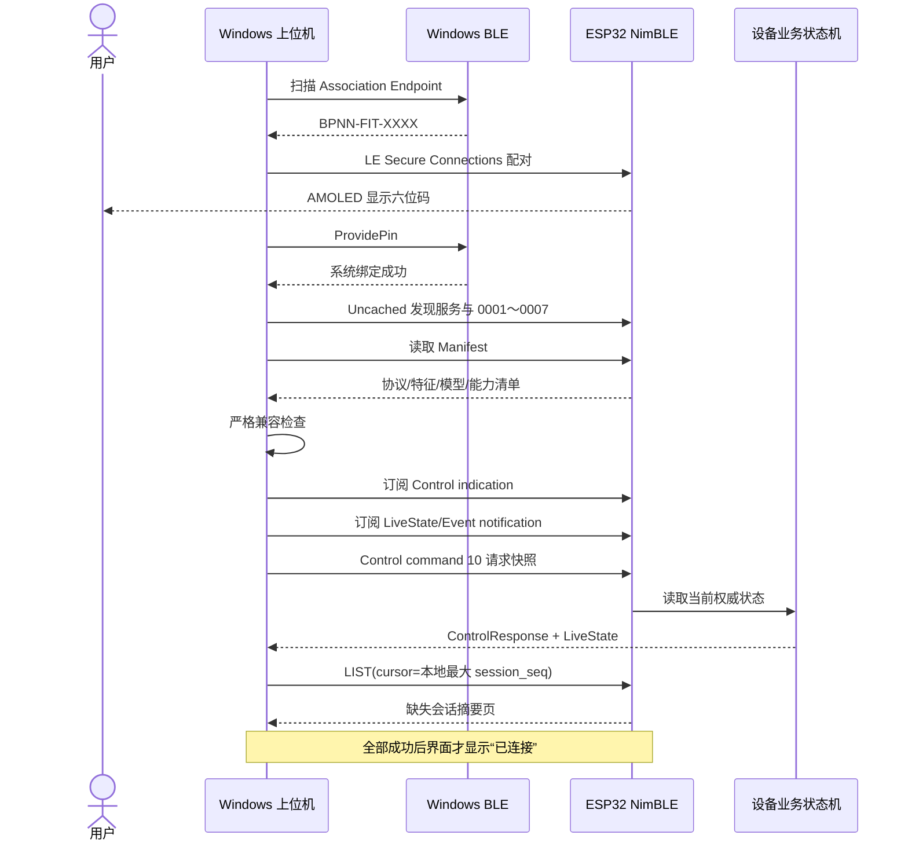
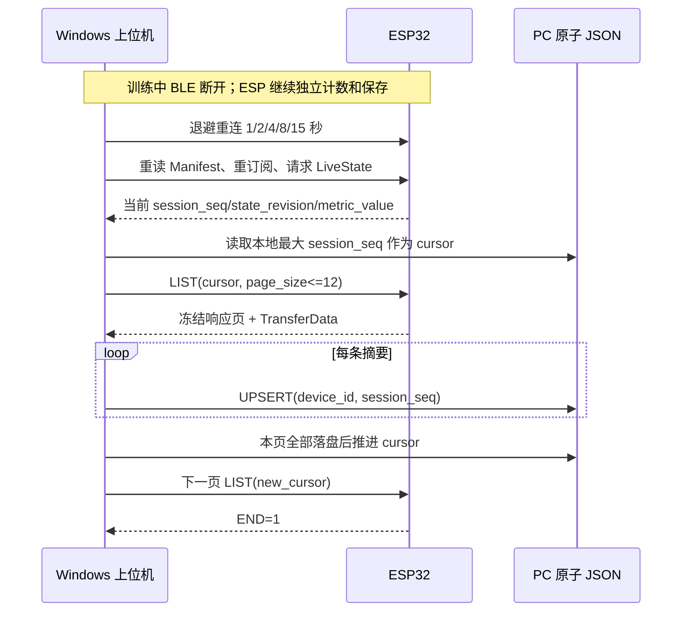
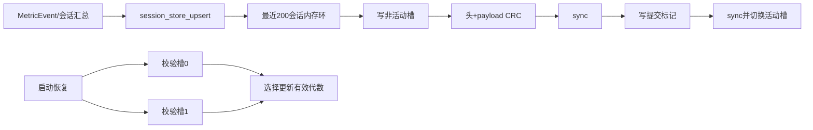

# BLE 通信、设备配置与会话存储

> 产品边界：右手腕佩戴；一次会话只做一种主动作；次数和步数动作在休息、静止和无效数据时由活动门与质量门冻结；低置信度或异类分类只作诊断，不切换主动作；`sit` 在运行态按合法单调 tick 累计时长；实体无振动马达；10 次动作的计数验收容差为 ±2 次。本文、当前源码和自动化测试共同构成实现依据。

## 1. 文档范围

本文说明 GATT、逻辑帧、控制点、安全配对、配置 TLV、会话快照和断线补传怎样组成一条可恢复链路。

## 2. 阅读导航

| 章节 | 用途 |
|---:|---|
| 开源教程 | 从首次配对、逻辑帧、MTU 分片到断线补传 |
| 3 | 端到端 BLE 协议、消息、CRC 和恢复 |
| 4 | ESP32 NimBLE 服务、线程、权限和生命周期 |
| 5 | 配置命令、TLV、稳定 blob 和事务应用 |
| 6 | 双槽快照、CRC、幂等、轮转和原始块 |

## 开源教程：从首次配对到断线补传

第一次接触 BLE 的读者可先跟完这一节的连接主线。后续正文保留逐字段规范；实现协议时以固定表、黄金向量和自动测试为准，教程中的示意值只用于解释关系。

### 0. 通信链为什么不能只写一个“发送 JSON”

BLE 链路会断开、重试、缩小 MTU、重复投递，也会在应用重启后失去内存状态。协议必须让两端对三件事得到同一答案：命令是否执行、当前权威状态是什么、哪些历史已经持久化。

| 步骤 | 要解决的问题 | 当前做法 | 做完后的效果 | 验证；省略后的表现 |
|---:|---|---|---|---|
| 1. 广播与身份过滤 | Windows 附近可能有很多 BLE 设备，名称也可能重复 | 扫描 Association Endpoint，并结合服务、设备标识和 Manifest 判断目标 | 上位机不会把“发现名字”误当“连接成功” | 同名设备/缺服务测试；只按名称会选错设备 |
| 2. 安全配对 | 控制命令和训练数据不应被未绑定客户端写入或读取 | LE Secure Connections、六位码、加密/认证权限和系统绑定 | GATT 控制点只对已认证链路开放 | 未配对读写必须失败；无权限会允许旁路控制 |
| 3. Manifest 握手 | PC 与固件可能使用不同协议、类别顺序、特征或能力 | 连接后先读取版本、CRC、模型摘要和 capability，再决定是否继续 | 不兼容版本在控制前明确拒绝 | 构造 CRC/版本不匹配；跳过会把错误字节解释成合法状态 |
| 4. 逻辑帧与 CRC | GATT characteristic 本身不提供项目级消息类型、序号和完整性语义 | 固定小端头、长度、sequence、单调时间和 CRC16 | 每条消息可定界、排序和校验 | 共享黄金向量双端逐字节一致；无 CRC 时位翻转可能静默入库 |
| 5. MTU 分片 | 默认 MTU 23 的有效 Value 只有 20 字节，完整帧常放不下 | 以 `MTU-11` 计算片数据，使用 sequence/index/count 包络严格重组 | 同一逻辑帧可在不同协商 MTU 下传输 | MTU 23、乱序、重复、缺片测试；硬编码 244 会在真实链路失败 |
| 6. 命令幂等 | indication 超时后客户端必须重试，但 START 不能执行两次 | `request_id` + sequence + 原始帧缓存；重试复用完全相同字节 | 丢响应时可安全重发，业务只执行一次 | 丢弃首个响应再重试；使用新 ID 会创建第二次业务操作 |
| 7. 快照与事件分工 | notification 可能丢失，不能用收到的事件数重建累计值 | LiveState/会话快照携带权威累计；Event 只提示新事实 | 重连后直接恢复当前状态，漏一条 Event 也不漏最终次数 | 人为丢 Event 后请求快照；把 Event 当账本会少计 |
| 8. 分页补传与本地幂等 | 设备离线训练、PC 中途崩溃或重复拉取都会影响历史 | 以 `(device_id, session_seq)` UPSERT，整页落盘后推进 cursor | 重试不重复，崩溃恢复不制造永久缺口 | 页中途故障后重拉；先推进 cursor 会丢历史 |

选择二进制固定帧而不是 JSON 的主要原因是：低 MTU 下开销更小、字段偏移可测试、C/C# 双端无需动态解析器、错误输入的边界更清楚。代价是协议演进必须更纪律化，所以可选配置使用 TLV，固定结构使用版本和保留位，任何改变都要同步黄金向量。

连接状态也因此分成多个事实：

```text
发现广播
  != 系统已配对
  != GATT 服务可用
  != Manifest 兼容
  != 通知已订阅
  != 权威快照已恢复
```

只有最后一项完成，界面才显示“已连接”。这样虽然握手步骤更多，但每个失败都能给出准确恢复动作，而不是只显示一个无法定位的 `Failed`。

### 1. 首次连接为什么不是“发现设备就成功”



广播只证明“附近存在一个名字匹配的设备”。系统配对、GATT 完整性、Manifest 兼容、订阅和权威快照任一失败，上位机都必须保持“未连接”，并显示失败发生在哪一层。

### 2. 一条逻辑帧怎样逐字节解释

共享黄金帧为：

```text
7E B1 01 00 03 01 34 12 04 03 02 01 05 00 10 20 30 40 50 92 F9
```

| 字节范围 | 值 | 解释 |
|---|---|---|
| 0～1 | `7E B1` | 小端魔数 `0xB17E` |
| 2 | `01` | 协议主版本 1 |
| 3 | `00` | 协议次版本 0 |
| 4 | `03` | `LiveState` 消息类型 |
| 5 | `01` | 标志位 |
| 6～7 | `34 12` | 逻辑序号 `0x1234` |
| 8～11 | `04 03 02 01` | 单调毫秒 `0x01020304` |
| 12～13 | `05 00` | payload 长度 5 |
| 14～18 | `10 20 30 40 50` | 示例 payload |
| 19～20 | `92 F9` | 小端 CRC `0xF992` |

CRC 只覆盖偏移 2 到 payload 末尾，不覆盖魔数和 CRC 自身。修改任一字段后必须由 codec 重新计算 CRC，不能沿用示例末尾两字节。

### 3. MTU 23 时为什么会变成两片

MTU 23 可承载的 ATT Value 为 20 字节；减去 8 字节分片包络后，每片只有 12 字节逻辑帧数据。上面的 21 字节黄金帧因此拆成：

```text
# 第 0 片：sequence=0x1234, index=0, count=2, data_length=12
34 12 00 00 02 00 0C 00  7E B1 01 00 03 01 34 12 04 03 02 01

# 第 1 片：sequence=0x1234, index=1, count=2, data_length=9
34 12 01 00 02 00 09 00  05 00 10 20 30 40 50 92 F9
```

接收端先验证 8 字节包络，再按 `index=0,1,...` 严格拼接，最后才验证完整帧长度和 CRC。不能对每片分别做逻辑帧 CRC，也不能缓存乱序片等待补齐。

### 4. START 命令的完整业务追踪

假设上位机分配 `request_id=0x01020304`，无 TLV 的 START payload 为：

```text
04 03 02 01  01  01
| request_id |cmd |ver
```

完整路径如下：

1. `ControlPointCodec` 生成 6 字节请求 payload。
2. `BleFrameCodec` 包装为 `message_type=1` 的逻辑帧并计算 CRC。
3. `BleFragmentCodec` 按实际 ATT MTU 分片；MTU 23 时该 22 字节逻辑帧需要两片。
4. Windows 对 `0001` 执行加密写入。
5. ESP32 严格重组、验 CRC，并按 `request_id` 查最近 16 项幂等缓存。
6. 新请求只执行业务回调一次，设备进入 Preparing，并把响应缓存。
7. 设备通过 `0001` indication 返回同一 `request_id`、命令号、状态、错误码和新 `state_revision`。
8. 设备随后用 LiveState 通知发布权威状态；Event 只用于及时动画或提示，不能由 PC 自行 `+1`。
9. 两秒没有 indication 时，PC 只能重发**同一 request_id、同一 sequence、同一完整帧字节**一次。若改用新 ID，设备会把它视为第二条命令。

### 5. 断线后如何恢复状态



PC 不按断线秒数推算次数，也不把 Event 缺口换算成动作。实时结果由新 LiveState 恢复；历史结果按 `(device_id, session_seq)` 幂等补传。必须先成功落盘整页再推进游标，否则应用崩溃会制造永久缺口。

### 6. 增加新字段时怎样保持兼容

1. 先判断字段是否可选。可选配置优先新增 TLV tag；解码器遇到完整且未知的 tag 必须安全跳过。
2. 固定长度结构只能使用已有 `reserved` 位或发布新结构版本；不得在中间插入字段、改变现有偏移。
3. 新能力用 Manifest capability bit 宣告。发送新字段前先确认对端能力，不能以固件版本字符串猜测。
4. 小端整数、范围、默认值、缺失语义和重复 tag 策略必须写入本文件的权威表。
5. 同步修改 ESP32 C codec、Windows C# codec、共享黄金向量和异常输入测试。
6. 可安全忽略的兼容变化递增 minor；无法安全忽略的语义变化递增 major，并让不兼容客户端拒绝控制。
7. 真表没有振动马达。执行器 capability、偏好和质量保留位固定为 0，不能把保留位重新解释成其它功能。

### 7. 常见连接与同步故障

| 现象 | 优先检查 | 正确恢复 |
|---|---|---|
| 扫描到设备但配对失败 | Windows 是否保留旧绑定；手表六位码是否仍有效 | 手表“忘记电脑”与 PC“忘记设备”分别清理各自绑定，再重新扫描 |
| 配对成功但找不到 0001～0007 | Windows GATT 缓存或固件服务表不一致 | 释放旧 GATT 对象，使用 Uncached 重新发现；不要跳过 Manifest |
| Manifest 后立即断开 | 协议主版本、297 维、类别 CRC、模型摘要或能力位不匹配 | 烧录/启动匹配版本；禁止忽略兼容错误继续控制 |
| 显示连接但没有实时状态 | indication/notification 订阅顺序、快照命令和 CCCD 结果 | 重新按握手顺序订阅并读取权威快照 |
| MTU 23 下 CRC 或分片错误 | 是否错误假定 244 字节；包络长度、索引和 sequence 是否一致 | 使用 `MTU-11` 计算片容量，并运行共享黄金向量 |
| 点击开始后执行两次 | 超时重试是否换了 request ID 或重新编码了帧 | 复用同一 request ID、sequence 和帧字节；只重试一次 |
| 重连后历史重复 | 本地主键是否缺少 device ID；是否在落盘前推进 cursor | 按 `(device_id, session_seq)` UPSERT，整页成功后再推进 |
| 重连后历史缺口 | 是否从最后“收到”而非最后“已持久化”序号续传 | cursor 只取本地成功落盘最大序号 |
| Raw Stream 没有数据 | 开发者模式、命令 11、0007 订阅是否全部成立 | 显式启用；普通连接默认不占用诊断带宽 |

### 8. 源码、黄金向量与测试入口

- 共享 C 帧/CRC/分片：[imu_ble_protocol.c](../shared/protocol/imu_ble_protocol.c)
- 共享黄金向量：[golden_vectors.json](../shared/protocol/golden_vectors.json)
- ESP32 业务协议：[ble_service_core.c](../esp32/firmware/components/ble_service/src/ble_service_core.c)
- ESP32 NimBLE 适配：[ble_service_nimble.c](../esp32/firmware/components/ble_service/src/ble_service_nimble.c)
- ESP32 会话传输：[session_transfer.c](../esp32/firmware/components/session_transfer/session_transfer.c)
- C# 逻辑帧：[BleFrameCodec.cs](../pc/FitnessCoach.Bluetooth/BleFrameCodec.cs)
- C# 分片与重组：[BleFragmentCodec.cs](../pc/FitnessCoach.Bluetooth/BleFragmentCodec.cs)、[BleFrameReassembler.cs](../pc/FitnessCoach.Bluetooth/BleFrameReassembler.cs)
- C# 控制点：[ControlPointCodec.cs](../pc/FitnessCoach.Bluetooth/ControlPointCodec.cs)
- Windows 会话状态机：[WindowsBleDeviceSession.cs](../pc/FitnessCoach.Bluetooth/WindowsBleDeviceSession.cs)
- WinRT 扫描/配对/GATT：[WinRtBleTransport.cs](../pc/FitnessCoach.Bluetooth.Windows/WinRtBleTransport.cs)
- ESP32 BLE 主机测试：[run_tests.ps1](../esp32/host_tests/ble_service/run_tests.ps1)
- ESP32 会话传输测试：[run_tests.ps1](../esp32/host_tests/session_transfer/run_tests.ps1)
- Windows BLE 状态机测试：[WindowsBleDeviceSessionTests.cs](../pc/FitnessCoach.Tests/WindowsBleDeviceSessionTests.cs)
- Windows 会话同步测试：[SessionTransferContractTests.cs](../pc/FitnessCoach.Tests/SessionTransferContractTests.cs)

## 3. 端到端 BLE 协议、消息、分片、CRC 和恢复

### 1. 文档目的

本文定义 ESP32-S3 健身手柄与 Windows 上位机之间的 BLE 应用层协议 v1。协议目标：

- ESP32 断开 PC 后仍能独立识别、计数、累计卡路里并保存会话；
- PC 连接后实时显示动作动画、次数、卡路里、电量和设备状态；
- 断线重连后恢复同一会话，不重复开始、清零或保存；
- 会话摘要始终可同步，25 Hz 六轴诊断流按用户开关选择；
- C 与 C# 使用完全一致的端序、CRC、分片和字段定义；
- ATT MTU 23、185、247 都能工作；
- 异常长度、CRC 错误、缺片和乱序不得进入业务状态机。

协议不负责训练模型，也不在 PC 端重新计算动作、次数或卡路里。ESP32 是实时状态和累计值的唯一权威源。

---

### 2. 传输层约定

#### 2.1 蓝牙模式

- 只使用 Bluetooth Low Energy，不使用经典蓝牙串口。
- ESP32-S3 使用 ESP-NimBLE。
- Windows 使用 `Windows.Devices.Bluetooth` 原生 API。
- 设备最多同时连接一个 PC。
- 广播名为 `BPNN-FIT-XXXX`，`XXXX` 是设备 MAC 低四位十六进制字符。

#### 2.2 安全

- 首次配对使用 LE Secure Connections 和绑定。
- 设备屏幕显示六位码，Windows 端要求用户确认。
- 未绑定客户端只能读取 Manifest 和标准设备信息，不能启停会话、修改资料或下载日志。
- ESP32 的 NVS 与 Windows 系统分别保存绑定信息。
- 用户在设备端执行“忘记电脑”后，必须同时清除 ESP32 绑定记录；PC 端也提供“忘记设备”。

六位码生命周期固定如下：NimBLE 生成码后通过无阻塞邮箱交给 LVGL；配对成功、配对失败、BLE 断线、60 秒显示超时、BLE 服务停止或用户忘记电脑时，设备都必须清除 UI 码和邮箱中的旧值。设备“忘记电脑”会先断开当前连接再删除设备侧全部绑定；PC“忘记设备”会取消 Windows 系统配对并清除本地固定设备 ID。两端各自只管理自己的密钥存储，完整解除绑定建议两端都执行。

#### 2.3 字节序与整数

- 所有多字节整数使用小端序。
- 线上结构只使用 `uint8`、`uint16`、`uint32`、`uint64` 和 `int16` 等固定宽度整数。
- 协议主路径不直接传输 C/C# `bool`、枚举内存布局、结构体填充或浮点数。
- 卡路里使用千分之一千卡整数，置信度使用 Q15，避免跨语言浮点舍入差异。

---

### 3. GATT 服务

自定义服务 UUID：

```text
7B2E0000-6D57-4A51-9E43-494D5542504E
```

| 尾号 | 名称 | 属性 | 方向 | 用途 |
|---|---|---|---|---|
| `0001` | Control Point | Write、Indicate | 双向 | 启停、暂停、配置、时间同步及 ACK/NACK |
| `0002` | Manifest | Read | 设备到 PC | 协议、固件、模型、类别表、能力清单 |
| `0003` | Live State | Read、Notify | 设备到 PC | 当前动作、次数、卡路里、会话状态、电量 |
| `0004` | Event | Notify | 设备到 PC | 计数、动作切换、目标完成、低电量和故障事件 |
| `0005` | Transfer Control | Write、Indicate | 双向 | 会话列表、摘要、日志下载和断点续传控制 |
| `0006` | Transfer Data | Notify | 设备到 PC | 会话摘要和原始日志数据块 |
| `0007` | Raw Stream | Notify | 设备到 PC | 开发者模式实时六轴同步诊断样本，默认关闭 |

同时启用标准服务：

- Battery Service：`0x180F`；
- Device Information Service：`0x180A`；
- Generic Attribute Service 的 Service Changed，用于 GATT 数据库升级。

PC 连接顺序固定为：

1. 使用 Uncached 模式重新枚举自定义服务；
2. 读取 Manifest 并执行版本、类别表和能力检查；
3. 订阅 Control Point indication；
4. 订阅 Live State 和 Event notification；
5. 有日志下载需求时再订阅 Transfer Data；
6. 开发者明确启用时才订阅 Raw Stream；
7. 请求一次权威状态快照；
8. 同步缺失会话摘要。

---

### 4. 逻辑帧

#### 4.1 固定结构

| 偏移 | 长度 | 字段 | 说明 |
|---:|---:|---|---|
| 0 | 2 | `magic` | 固定 `0xB17E`，线上字节 `7E B1` |
| 2 | 1 | `protocol_major` | 当前为 1 |
| 3 | 1 | `protocol_minor` | 当前为 0 |
| 4 | 1 | `message_type` | 控制、状态、事件或传输类型 |
| 5 | 1 | `flags` | 响应、错误、快照、结束等标志 |
| 6 | 2 | `sequence` | 逻辑帧序号，按 65536 回绕 |
| 8 | 4 | `monotonic_ms` | 设备开机后单调毫秒时间，约 49.7 天回绕 |
| 12 | 2 | `payload_length` | payload 字节数，范围 0～1024 |
| 14 | P | `payload` | 上层消息内容 |
| 14+P | 2 | `crc16` | 小端 CRC-16/CCITT-FALSE |

设 payload 长度为 $P$，完整逻辑帧长度为：

$$
L = 14 + P + 2
$$

因此：

$$
16 \le L \le 1040
$$

解码时要求实际输入长度严格等于 $L$。不接受尾随垃圾、两帧拼接或截断帧。

#### 4.2 sequence

`sequence` 用于发现通知缺口，不作为会话主键。每个通知类特征维护独立序号。PC 按模 $2^{16}$ 比较：

$$
\Delta = (s_{new}-s_{old}) \bmod 65536
$$

- $\Delta=1$：连续；
- $\Delta=0$：重复帧；
- $\Delta>1$：存在缺口。

Event 缺口不得由 PC 自行补算次数。PC 应读取 Live State 快照恢复权威累计值。

#### 4.3 单调时间

`monotonic_ms` 只表示设备开机后的相对时间，不受 UTC 校时影响。会话时长、事件排序和超时判断均使用单调时间。UTC 只用于历史记录的墙钟时间。

---

### 5. CRC-16/CCITT-FALSE

#### 5.1 参数

| 参数 | 数值 |
|---|---|
| 宽度 | 16 bit |
| 多项式 | `0x1021` |
| 初值 | `0xFFFF` |
| 输入反射 | false |
| 输出反射 | false |
| 最终异或 | `0x0000` |
| 标准检查值 | ASCII `123456789` → `0x29B1` |

CRC 覆盖范围从偏移 2 的 `protocol_major` 开始，到 payload 最后一个字节结束。魔数和 CRC 自身不参与计算。

#### 5.2 逐位公式

设当前 16 位寄存器为 $R$，输入字节为 $b$。先执行：

$$
R \leftarrow R \oplus (b \ll 8)
$$

随后对每个字节执行 8 轮：

$$
R \leftarrow
\begin{cases}
(R \ll 1) \oplus 0x1021, & R_{15}=1 \\
R \ll 1, & R_{15}=0
\end{cases}
$$

每轮只保留低 16 位。最终数值按小端序写入逻辑帧。

#### 5.3 数值与资源

- 每帧执行 $O(8L)$ 次逐位运算；
- 因为 8 是常数，渐近时间复杂度为 $O(L)$；
- 额外空间为 $O(1)$；
- ESP32 可先使用逐位参考实现，后续若使用查表优化，必须保持黄金向量完全一致；
- CRC 错误帧不得进入状态机，也不得只跳过单个损坏字段。

---

### 6. GATT 分片

#### 6.1 为什么需要分片

BLE ATT Value 的可用长度由协商 MTU 决定：

$$
V = MTU - 3
$$

最小常见 MTU 为 23，此时 $V=20$。30 字节实时状态加逻辑帧头后超过 20 字节，因此协议必须支持分片，不能假定 Windows 始终协商到 185 或 247。

#### 6.2 分片包络

每个 GATT Value 都使用相同 8 字节包络：

| 偏移 | 长度 | 字段 |
|---:|---:|---|
| 0 | 2 | `logical_sequence` |
| 2 | 2 | `fragment_index`，从 0 开始 |
| 4 | 2 | `fragment_count`，至少为 1 |
| 6 | 2 | `fragment_data_length` |
| 8 | F | 完整逻辑帧的一段连续字节 |

单片数据容量为：

$$
C = MTU - 3 - 8
$$

完整帧需要的分片数为：

$$
N_f = \left\lceil \frac{L}{C} \right\rceil
$$

例如 MTU 23：

$$
C=23-3-8=12
$$

21 字节黄金逻辑帧会拆成 2 片。

#### 6.3 重组规则

BLE 同一连接、同一特征的通知保持发送顺序。本实现采用严格顺序重组：

1. 只有 `fragment_index=0` 可以开始新帧；
2. 后续 sequence、fragment_count 必须与第一片一致；
3. 后续索引必须严格等于上一索引加一；
4. 包络数据长度必须等于 GATT Value 剩余长度；
5. 累计长度不得超过 1040 字节；
6. 最后一片到达后必须再执行完整逻辑帧长度和 CRC 校验；
7. 缺片、乱序、超时、跨帧混入或 CRC 错误时清空当前状态。

严格顺序策略不缓存乱序片，可把 ESP32 重组 RAM 固定为约 1040 字节。实时状态缺片后由状态快照恢复；会话日志由偏移续传恢复。

#### 6.4 超时

- 控制、状态和事件重组：1 秒；
- 会话传输数据块重组：5 秒；
- 超时后调用 `imu_ble_reassembler_reset` 或 C# `Reset()`；
- 超时状态不得与下一帧继续拼接。

---

### 7. 消息类型

| 数值 | 名称 | 方向 |
|---:|---|---|
| 1 | `ControlRequest` | PC → ESP32 |
| 2 | `ControlResponse` | ESP32 → PC |
| 3 | `LiveState` | ESP32 → PC |
| 4 | `Event` | ESP32 → PC |
| 5 | `TransferRequest` | PC → ESP32 |
| 6 | `TransferResponse` | ESP32 → PC |
| 7 | `TransferData` | ESP32 → PC |
| 8 | `RawStream` | ESP32 → PC |

未知消息类型处理：

- 主版本相同：记录诊断并忽略；
- 主版本不同：禁止训练控制，只允许读取设备信息和导出可识别数据；
- 不得把未知消息解析为最接近的旧类型。

---

### 8. LiveStateV1

Live State payload 固定 30 字节：

| 偏移 | 长度 | 字段 | 单位或范围 |
|---:|---:|---|---|
| 0 | 4 | `session_seq` | 设备持久化序号 |
| 4 | 4 | `state_revision` | 权威状态修订号 |
| 8 | 4 | `elapsed_ms` | 毫秒 |
| 12 | 1 | `device_state` | 0～7 |
| 13 | 1 | `action_id` | 0～10，255 未知 |
| 14 | 1 | `metric_kind` | 0 无、1 次、2 步、3 秒 |
| 15 | 1 | `battery_percent` | 0～100，255 未知 |
| 16 | 4 | `metric_value` | 次数、步数或秒数 |
| 20 | 2 | `confidence_q15` | 0～65535 |
| 22 | 4 | `calories_mcal` | 千分之一千卡 |
| 26 | 2 | `quality_flags` | 位集合 |
| 28 | 1 | `power_flags` | 位集合 |
| 29 | 1 | `goal_percent` | 0～100，255 未设置 |

Q15 置信度转换公式：

$$
c = \frac{q}{65535}
$$

符号含义如下：

- $q$ 是 `confidence_q15`；
- $c$ 是解码后的置信度；
- $[0,1]$ 是置信度值域。

卡路里转换公式：

$$
E_{kcal}=\frac{E_{mcal}}{1000}
$$

PC 不根据通知事件增加次数，只显示 `metric_value`。Event 用于立即触发动画反馈；即使 Event 丢失，下一条 Live State 仍恢复正确累计值。

#### 8.1 状态修订号

设备每次发生权威状态变化时递增 `state_revision`。PC 规则：

- 新 revision 大于当前值：接受；
- 相同 revision：重复帧，忽略；
- 更小 revision：旧通知，忽略；
- 设备重新开机时结合 boot ID 或重新读取 Manifest 建立新比较基线。

---

### 9. 控制点

#### 9.1 请求

```text
uint32 request_id
uint8  command_id
uint8  command_version
uint8  tlv_data[]
```

#### 9.2 响应

```text
uint32 request_id
uint8  command_id
uint8  status
uint16 error_code
uint32 state_revision
uint8  optional_tlv[]
```

#### 9.3 v1 命令

| command_id | 命令 | 主要约束 |
|---:|---|---|
| 1 | 开始会话 | 只允许 Idle 或 Summary |
| 2 | 暂停会话 | 只允许 Running |
| 3 | 恢复会话 | 只允许 Paused |
| 4 | 停止会话 | Running 或 Paused；先保存摘要 |
| 5 | 清零当前会话 | 只允许 Paused，并要求设备端二次确认配置 |
| 6 | 同步 UTC 和时区 | 不修改单调会话时长 |
| 7 | 设置用户资料 | 至少包含体重克数和资料 revision |
| 8 | 设置训练目标 | 次数、时长或卡路里目标 |
| 9 | 设置设备偏好 | 亮度、声音、熄屏时间；旧 type 2 固定为零 |
| 10 | 获取状态快照 | 任意已绑定连接 |
| 11 | 开关实时原始流 | 仅开发者模式 |

#### 9.4 命令 6、7、8、9、11 的冻结 TLV v1

五条配置命令的 `tlv_data` 均由连续项目组成，每项固定为：

```text
[type:u8][length:u8][value:length bytes]
```

多字节整数全部使用小端序。布尔值长度必须为 1，且只允许 `0` 或 `1`。已知 type 重复、必填项缺失、已知项长度错误、数值越界、截断 value 或尾随不完整 TLV 必须拒绝；未知 type 只能按 `length` 跳过，不能改变已知字段语义。

##### 命令 6：同步 UTC 与时区

| type | length | value | 范围 |
|---:|---:|---|---|
| `0x01` | 8 | `utc_unix_seconds:int64LE` | 946684800～4102444799，即 2000-01-01～2099-12-31 |
| `0x02` | 2 | `timezone_offset_minutes:int16LE` | -840～840 分钟 |

UTC 只用于历史墙钟时间，不允许重写 `monotonic_ms` 或当前会话时长。Windows 公共接口接收 Unix 毫秒，编码命令 6 时使用正数整数除法除以 1000，把 0～999 毫秒尾数截断后发送 Unix 秒；不得四舍五入，也不得把毫秒原值写入该字段。Windows 会话在首次连接和自动重连完成 Manifest、订阅与快照恢复后自动发送一次当前时间。

##### 命令 7：设置用户资料

| type | length | value | 范围 |
|---:|---:|---|---|
| `0x01` | 4 | `weight_g:uint32LE` | 30000～250000 g |
| `0x02` | 4 | `profile_revision:uint32LE` | 单调修订号 |

体重单位固定为克。PC 设置页可选公制千克或英制磅，但内部先统一换算为千克，再按四舍五入发送整数克；设备卡路里链只使用设备确认并持久化的资料。界面单位不进入 TLV，不允许把磅数直接写入 `weight_g`。

##### 命令 8：设置训练目标

| type | length | value | 范围 |
|---:|---:|---|---|
| `0x01` | 1 | `kind:uint8` | 0 无、1 次数、2 时长秒、3 毫千卡 |
| `0x02` | 4 | `value:uint32LE` | 无目标时必须为 0；启用时必须大于 0 |

`kind=3` 的值使用 milli-kcal，即 1000 表示 1 kcal。目标种类与数值组合无效时必须整体拒绝，不能只保留其中一项。

##### 命令 9：设置设备偏好

| type | length | value | 范围 |
|---:|---:|---|---|
| `0x01` | 1 | `brightness_percent:uint8` | 5～100% |
| `0x02` | 1 | `legacy_haptic_reserved:uint8` | 兼容旧 v1，发送端固定为 0，设备忽略输入 |
| `0x03` | 1 | `sound_enabled:bool` | 0 或 1 |
| `0x04` | 2 | `screen_timeout_seconds:uint16LE` | 10～300 s |
| `0x05` | 4 | `preferences_revision:uint32LE` | 单调修订号 |
| `0x06` | 1 | `developer_mode_enabled:bool` | 0 或 1 |

##### 命令 11：开关实时 RawStream

| type | length | value | 范围 |
|---:|---:|---|---|
| `0x01` | 1 | `enabled:bool` | 0 或 1 |

开启命令只有在命令 9 已持久化 `developer_mode_enabled=1` 后才能成功。RawStream 不得自动写入历史或文件；只有用户在诊断页点击导出并在系统对话框确认路径后，PC 才能把当前内存快照写成 CSV。

#### 9.5 PC 设置同步事实

设置页先原子保存 `%LocalAppData%\IMUFitness\preferences.v1.json`，本地成功后才尝试设备同步。设备未连接、不支持配置命令或返回错误时，页面必须显示“本地已保存、设备未同步”及具体原因，不能把本地成功伪装成设备成功。设备连接时固定按以下顺序执行：

1. 命令 6 同步当前 UTC 和时区；
2. 命令 7 同步体重克数和资料 revision；
3. 命令 8 同步目标类型和值；
4. 命令 9 同步亮度、声音、熄屏、偏好 revision 和开发者模式；旧 type 2 保留位固定写零。

每条命令都必须收到成功 ControlResponse，页面才显示“设备同步成功”。C# `DeviceConfigurationCodec` 的黄金字节、边界和畸形测试锁定上述线上格式。

PC 单位选择只保存在本地偏好，旧偏好文件没有该字段时默认为公制。训练总结的目标进度来自设备摘要千卡除以本地每日千卡目标；“设备会话已保存”和“本地历史已保存”是两个独立事实，必须分别由 Stop ACK/摘要和本地仓储成功确认。

每个连接缓存最近 16 个 `request_id` 和对应响应。PC 在 2 秒内没有收到 indication 时，只能用同一 `request_id` 重试一次。重复请求返回缓存响应，不重复创建会话、清零或停止。

---

### 10. 事件

Event 负责低延迟提示，不是权威累计存储。v1 事件包括：

- `SESSION_STARTED`；
- `SESSION_PAUSED`；
- `SESSION_RESUMED`；
- `SESSION_STOPPED`；
- `ACTION_CHANGED`；
- `REPETITION_COUNTED`；
- `GOAL_REACHED`；
- `LOW_BATTERY`；
- `SENSOR_FAULT`；
- `STORAGE_FAULT`；
- `POWER_OFF_PENDING`。

#### 10.1 EventV1 固定载荷

Event 逻辑帧的 payload 固定为 36 字节、小端序。它用于立即更新次数动画和故障提示；PC 不能用事件自行累加次数或卡路里。

| 偏移 | 长度 | 字段 | 单位/范围 |
|---:|---:|---|---|
| 0 | 1 | `event_version` | 固定为 1 |
| 1 | 1 | `event_type` | 1～11，对应本节事件顺序 |
| 2 | 1 | `device_state` | 0～7 |
| 3 | 1 | `action_id` | 0～10，255 表示未知 |
| 4 | 1 | `metric_kind` | 0 无、1 次、2 步、3 秒 |
| 5 | 1 | `battery_percent` | 0～100，255 表示未知 |
| 6 | 2 | `quality_flags` | 数据质量位集合 |
| 8 | 4 | `session_sequence` | 持久化会话序号 |
| 12 | 4 | `event_sequence` | 会话内事件序号 |
| 16 | 4 | `state_revision` | 事件提交后的权威状态修订号 |
| 20 | 4 | `metric_delta` | 本次次数、步数或秒增量 |
| 24 | 4 | `metric_total` | 事件时刻累计值；掉包后由 Live State 恢复 |
| 28 | 4 | `calories_mcal` | 千分之一千卡 |
| 32 | 2 | `confidence_q15` | 0～65535 对应 0～1 |
| 34 | 2 | `detail_code` | 低电量门槛、故障或关机子码；普通事件为 0 |

事件编号固定为：1 开始、2 暂停、3 恢复、4 停止、5 动作改变、6 计数、7 目标完成、8 低电量、9 传感器故障、10 存储故障、11 准备关机。未知版本、事件、动作、状态、电量或指标单位必须拒绝，不能猜测解释。

设备端 `ble_service_encode_event_v1` 与 PC 端 `EventV1Codec` 必须逐字节一致。编解码时间和空间复杂度均为 $O(1)$；36 字节 payload 在 ATT MTU 23 下由统一 8 字节包络自动分片，PC 重组完成并验证逻辑帧 CRC 后才解释字段。

事件丢失时：

- 不重传普通计数事件；
- PC 用 Live State 的权威累计值恢复；
- 会话停止后通过摘要同步恢复最终结果；
- 控制命令结果必须走 indication，不使用易丢失 notification。

---

### 11. 会话同步与原始日志

#### 11.1 唯一键

会话唯一键为：

```text
(device_id, session_seq)
```

`device_id` 来源于 Manifest。PC 当前原子 JSON 仓储以该组合作为幂等主键，重复同步不得产生第二条会话。

#### 11.2 摘要

每条摘要至少包含：

- 开始和结束 UTC；
- 单调持续时间；
- 总卡路里；
- 11 类各自的指标单位和值；
- 11 类活动毫秒数；
- 固件、协议、模型和类别表版本；
- 用户资料 revision；
- 结束原因和质量标志；
- 是否存在原始日志。

摘要必须保存在 NVS 或其它非易失存储中。microSD 缺失不得阻止摘要保存。

#### 11.3 TransferRequestV1

会话摘要同步只使用 `LIST` 和 `GET` 两种固定操作。TransferRequest 逻辑帧 payload 固定为 12 字节、小端序：

| 偏移 | 长度 | 字段 | 说明 |
|---:|---:|---|---|
| 0 | 1 | `transfer_version` | 固定为 1 |
| 1 | 1 | `operation` | 1=`LIST`，2=`GET` |
| 2 | 2 | `page_size` | `LIST` 为 1～12；`GET` 固定为 0 |
| 4 | 4 | `request_id` | PC 生成的非零幂等请求号 |
| 8 | 4 | `cursor_session_seq` | `LIST` 为 PC 已持久化最大序号；`GET` 为目标序号 |

`LIST` 返回满足下式的摘要：

$$
session\_seq > cursor\_session\_seq
$$

结果按 `session_seq` 从小到大，即从旧到新排列；PC 每成功 UPSERT 一条才推进本地游标。页大小上限 12 对应设备端固定队列：

$$
12\times80=960\ \mathrm{bytes}
$$

因此设备不需要动态内存。`GET` 只用于精确补取或诊断，目标序号为 0 时必须拒绝。

同一 `request_id` 与完全相同的 12 字节请求重试时，设备必须重放相同响应和冻结数据页，不重新读取变化中的仓储。同一 `request_id` 携带不同字节时返回 `REQUEST_CONFLICT`，不得执行第二个查询。

#### 11.4 TransferResponseV1

Transfer Control indication 的逻辑帧类型为 6，payload 固定 16 字节：

| 偏移 | 长度 | 字段 | 说明 |
|---:|---:|---|---|
| 0 | 1 | `transfer_version` | 固定为 1 |
| 1 | 1 | `operation` | 回显 1=`LIST` 或 2=`GET` |
| 2 | 1 | `status` | 见下表 |
| 3 | 1 | `flags` | bit0=`HAS_DATA`，bit1=`END` |
| 4 | 4 | `request_id` | 回显请求号 |
| 8 | 4 | `next_cursor_session_seq` | 本页最后摘要序号；空页保持输入游标 |
| 12 | 2 | `total_count` | 生成响应时设备持有的全部摘要数，0～200 |
| 14 | 2 | `item_count` | 本页 TransferData 数量，0～12 |

状态值固定为：

| 数值 | 名称 | 含义 |
|---:|---|---|
| 0 | `OK` | 请求成功，允许空页 |
| 1 | `UNSUPPORTED_VERSION` | payload 版本不支持 |
| 2 | `INVALID_OPERATION` | 未知操作码 |
| 3 | `INVALID_REQUEST` | 请求号、页大小或游标非法 |
| 4 | `NOT_FOUND` | `GET` 目标不存在 |
| 5 | `BUSY` | 上一页尚未从设备固定队列取完 |
| 6 | `STORAGE_ERROR` | 摘要仓储未初始化、读取失败或记录损坏 |
| 7 | `REQUEST_CONFLICT` | 同一请求号对应不同请求字节 |

必须满足：

$$
HAS\_DATA \iff item\_count>0
$$

`END=1` 表示当前游标已经追平设备快照。PC 仍须先成功持久化本页全部摘要，再把 `next_cursor_session_seq` 保存为新的同步游标。

#### 11.5 TransferDataV1 与 64 字节摘要

Transfer Data notification 的逻辑帧类型为 7。每条 payload 固定 80 字节，由 16 字节页头和一条 64 字节摘要组成：

| 偏移 | 长度 | 字段 | 说明 |
|---:|---:|---|---|
| 0 | 1 | `transfer_version` | 固定为 1 |
| 1 | 1 | `data_kind` | 固定为 1=`SessionSummaryV1` |
| 2 | 1 | `flags` | bit0=`LAST_IN_PAGE`，bit1=`END` |
| 3 | 1 | `reserved` | 固定为 0 |
| 4 | 4 | `request_id` | 对应请求号 |
| 8 | 2 | `item_index` | 本页索引 0～`item_count-1` |
| 10 | 2 | `item_count` | 本页总数，1～12 |
| 12 | 2 | `total_count` | 与响应一致的设备摘要总数 |
| 14 | 2 | `reserved2` | 固定为 0 |
| 16 | 64 | `summary` | 下表固定摘要 |

`SessionSummaryV1` 与设备 `session_store` 落盘记录逐字节一致：

| 摘要内偏移 | 长度 | 字段 | 单位/范围 |
|---:|---:|---|---|
| 0 | 2 | `summary_version` | 固定为 1 |
| 2 | 2 | `summary_length` | 固定为 64 |
| 4 | 4 | `session_seq` | 非零持久化序号 |
| 8 | 4 | `last_event_seq` | 已吸收最大事件序号 |
| 12 | 1 | `action_id` | 0～10 |
| 13 | 1 | `metric_kind` | 0 次、1 步、2 持续毫秒 |
| 14 | 2 | `flags` | 完成、异常、UTC 有效等位集合 |
| 16 | 8 | `start_unix_ms` | UTC Unix 毫秒；0 表示未校时 |
| 24 | 8 | `duration_ms` | 单调持续毫秒 |
| 32 | 8 | `metric_total` | 单位由 `metric_kind` 决定 |
| 40 | 8 | `gross_microkcal` | 毛热量，百万分之一千卡 |
| 48 | 8 | `active_microkcal` | 活动热量，百万分之一千卡 |
| 56 | 2 | `average_stability_q15` | 0～32767 |
| 58 | 2 | `minimum_stability_q15` | 0～32767 |
| 60 | 4 | `event_count` | 摘要吸收的事件数 |

PC 把毛热量转换为千分之一千卡：

$$
calories\_mcal=\mathrm{round}\left(\frac{gross\_microkcal}{1000}\right)
$$

持续型动作把 `metric_total` 毫秒整除 1000 后显示为秒。所有 `uint64` 字段在转换到 PC v1 的 `uint32` 前必须检查上界，禁止静默截断。

#### 11.6 同步时序、幂等与资源

固定页时序：

```text
PC 写 TransferRequest(0005)
    -> ESP32 冻结最多12条摘要
    -> ESP32 indication TransferResponse(0005)
    -> indication 全部分片确认
    -> ESP32 notification 0..N-1 条 TransferData(0006)
    -> PC 按 item_index 去重并排序
    -> PC 原子幂等写入 (device_id,session_seq)
    -> PC 仅在整页落盘成功后保存 next_cursor
```

设备端 GATT 写回调只做解码和固定内存快照，不在 NimBLE 主机任务内阻塞发送 0006。应用 BLE 任务在类型 6 indication 确认后，调用 `session_transfer_service_pop_data`，再调用 `ble_service_nimble_publish_transfer_data`。

PC 订阅 0005 indication 和 0006 notification，两个特征使用独立分片重组器。2 秒没有响应或 5 秒没有收齐数据时，最多使用相同请求号和完全相同帧重试一次。重复 `item_index` 可忽略；最终仓储仍以：

```text
(device_id, session_seq)
```

执行当前原子 JSON 仓储的主键替换。重复同步不能增加第二条记录；若未来更换数据库，也必须保持同一幂等语义。

Windows 产品入口把 `ISessionHistorySyncSource` 注入历史页。应用启动后的手动刷新和每次连接/重连成功都会：

1. 从本地 JSON 查询当前 `device_id` 的最大 `session_seq` 作为 cursor；
2. 每页最多请求 12 条，最多连续处理 32 页，防止异常设备造成无限循环；
3. 校验摘要 `device_id`、页内顺序和 `next_cursor` 必须前进；
4. 以 `(device_id, session_seq)` 原子幂等写入 JSON；
5. 只有整页写入成功才继续下一 cursor；
6. 同步失败时保留本地历史可读，并显示设备补传错误。

单页编解码时间复杂度为 $O(P)$，其中 $P\le12$；设备队列空间为 $O(P)$ 且上限 960 字节。PC 页内字典最多 12 项。逻辑帧 CRC16 已覆盖完整 16/80 字节 payload，所以本层不再叠加摘要 CRC；设备双槽存储自身仍由 CRC32 和提交标记保护。

#### 11.7 同步诊断样本记录

RawStream v1 是开发诊断接口，不是 QMI8658 FIFO 原样转发。固件先把芯片采样经过抗混叠滤波和严格 25 Hz 重采样，得到 `deg/s` 与 `g` 物理量，再按 QMI8658 当前量程比例重新量化为 `int16LE` 固定点诊断码。该设计保持 22 字节协议稳定，便于 PC 低成本显示和定位丢样，同时明确禁止把诊断码解释为未经处理的 ADC/FIFO 原始值。

记录格式：

```text
uint32 sample_index
uint32 monotonic_ms
int16  gx_raw
int16  gy_raw
int16  gz_raw
int16  ax_raw
int16  ay_raw
int16  az_raw
uint16 quality_flags
```

元数据固定声明：

- 采样率：25 Hz；
- 通道顺序：`gx, gy, gz, ax, ay, az`；
- 陀螺仪诊断码：`code / 16.4 = filtered_dps`；
- 加速度计诊断码：`code / 4096 = filtered_g`；
- `code` 按 `round(physical_value / units_per_lsb)` 生成，并饱和到 `[-32768, 32767]`；
- `quality_flags` 描述滤波、重采样、采样连续性重置或丢样等设备端质量事实；协议版本 1 的执行器保留位固定为 0。

因此，字段名中的 `_raw` 只为保持已经冻结的 v1 线上字段和 PC API 兼容；它表示“未在 PC 端换算的固定点码”，不表示“未经过设备端处理的 FIFO 原始码”。后续协议版本若要传输芯片 FIFO 原始样本，必须使用新的版本或特征，不得静默改变本记录语义。

单条记录 22 字节，理论数据率：

$$
22\times25=550\ \mathrm{bytes/s}
$$

一小时约：

$$
550\times3600=1{,}980{,}000\ \mathrm{bytes}
$$

不含文件头和块校验时约 1.89 MiB。

特征 `0007` 的实时 RawStream 使用上述固定 22 字节 payload，并套用统一逻辑帧、CRC16 与分片重组。Windows 会话始终订阅 `0007`，但只有诊断页显式发送命令 11 且设备成功 ACK 后才把合法样本发布给 UI。诊断页仅保存最近样本和进程内计数：

- 开发者模式默认关闭；
- 开启失败必须显示设备错误，不能显示虚假开启；
- 固定长度不是 22 字节、CRC 错误或分片错误的记录必须丢弃；
- 关闭或断线后停止发布，迟到回调不更新页面；
- UI 提供显式“导出”按钮，但不写会话 JSON、诊断日志或本地二进制文件；用户确认路径后只写带中文表头的 CSV 快照；
- 实时模式导出最近十分钟全部内存缓存，暂停或回看模式只导出当前可见最多 250 点；
- CSV 固定 44 列：原设备时间、PC 接收 UTC、六轴 int16 诊断码、六轴物理量和质量位之外，追加会话序号、固定右手腕佩戴域、设备状态、稳定动作、类型 9 基础/掩码/融合类别与置信度、三模型一致性、推理耗时、分类质量、窗口末点标记，以及 EventV1 权威计数事件序号、动作、指标、增量、累计、原始设备时刻和质量位；通道顺序保持 `gx、gy、gz、ax、ay、az`；
- 分类列只向前关联同一会话中 `窗口末点时间≤当前 IMU 时间` 的最新类型 9，禁止把未来窗口结果回填到过去样本；计数标记只在 EventV1 原始设备毫秒与 IMU 点精确相等时写入；
- 如以后实现设备 TF 离线原始文件下载，应使用独立授权和 CRC32 续传流程，不能复用实时诊断开关。

#### 11.8 下载与续传

- 每个逻辑数据块 payload 最多 1024 字节；
- 每 4 块由 PC 确认下一期望文件偏移；
- 断线后从最后已经 CRC 验证的偏移继续；
- 单个逻辑帧使用 CRC16；
- 完整文件使用 CRC32；
- 实时 Raw Stream 尽力而为，不重传，丢包通过 sample_index 缺口记录；
- SD 离线文件下载必须最终 CRC32 一致。

---

### 12. 版本与 Manifest

#### 12.1 Manifest v1 外层编码

特征 `0002` 的值直接是连续 TLV，不套用第 4 节逻辑帧，不附加 CRC16。每项格式固定为：

```text
[tag:u8][length:u8][value:length bytes]
```

- `tag` 和 `length` 均为一字节；单项 value 最长 255 字节；
- 多字节整数全部使用小端序；
- 字符串使用 UTF-8 原始字节，不包含 C 字符串结尾 NUL；
- SHA-256 使用摘要显示顺序的 32 个原始字节，不按整数翻转，也不发送 64 字节十六进制文本；
- 未知 tag 必须按 `length` 跳过；重复已知 tag、截断 value 或尾随不完整 TLV 必须拒绝；
- 当前设备 Manifest 约 132 字节，超过 MTU 23 的单次 ATT Value；客户端必须支持 GATT Long Read/Read Blob，不能只读首 20 字节；
- 设备启动时先完整构建和校验，再交给 NimBLE 深拷贝；任一必填字段无效时不允许退回空 Manifest。

#### 12.2 固定标签表

| tag | length | value | 当前来源 |
|---:|---:|---|---|
| `0x01` | 可变 | `device_id` UTF-8 | 完整 48 位蓝牙 MAC，例如 `A1B2C3D4E5F6` |
| `0x02` | 可变 | 板卡修订 UTF-8 | `2.06` |
| `0x03` | 2 | `[protocol_major:u8, protocol_minor:u8]` | 共享协议宏，当前 `1,0` |
| `0x04` | 可变 | 固件语义版本 UTF-8 | 当前 `0.1.0` |
| `0x05` | 4 | `[feature_dim:u16LE, feature_version:u16LE]` | 当前 `297,1` |
| `0x06` | 32 | 基础 M0 SHA-256 原始摘要 | 自动生成 `BP_BASE_MODEL_SHA256` |
| `0x07` | 32 | 掩码 M0 SHA-256 原始摘要 | 自动生成 `BP_MASKED_MODEL_SHA256` |
| `0x08` | 5 | `[class_count:u8, class_table_crc32:u32LE]` | 当前 `11,0xD8193927` |
| `0x09` | 2 | 卡路里 milliMET 表版本 `u16LE` | 当前 `1` |
| `0x0A` | 4 | 能力位 `u32LE` | 见 12.4 节 |
| `0x0B` | 8 | Manifest 构建时 LittleFS 可用字节 `u64LE` | `total_bytes-used_bytes`，异常下溢钳制为 0 |

Manifest v1 发布实际部署的基础 M0 与掩码 M0 两个 SHA。`dual_m0_manifest.json` 组合清单没有独立编译期常量，因此 v1 不把“组合清单 SHA”列为必填 tag；若协议增加该摘要，必须分配新 tag，并由解码器按未知 TLV 规则跳过，不能复用 `0x06` 或 `0x07`。

`0x0B` 只是启动/Manifest 构建时快照。后续保存会话会减少剩余容量，PC 只能把它当诊断提示，不能当作写入承诺。`esp_littlefs_info` 失败时设备不发布缺字段 Manifest，BLE 保持离线，设备仍可独立训练。

#### 12.3 类别表 CRC32

类别 CRC 使用 CRC-32/ISO-HDLC：

| 参数 | 数值 |
|---|---|
| 宽度 | 32 bit |
| 正向多项式 | `0x04C11DB7` |
| 反射实现多项式 | `0xEDB88320` |
| 初值 | `0xFFFFFFFF` |
| 输入/输出反射 | true |
| 最终异或 | `0xFFFFFFFF` |

设模型输出顺序中的 UTF-8 类名为 $n_0,\ldots,n_{C-1}$。规范输入字节串为：

$$
B=\mathrm{UTF8}(n_0)\Vert 0x00\Vert
\mathrm{UTF8}(n_1)\Vert 0x00\Vert\cdots\Vert
0x00\Vert\mathrm{UTF8}(n_{C-1})
$$

相邻类名之间恰好一个 `0x00`，最后一个类名末尾不加 `0x00`。当前 11 类固定顺序为：

```text
good_morning, jumping_jack, jumping_lunge, jumping_squat, lunge,
sit, squat, trot, tuck_jump, walk, wave
```

该规范字节串的黄金结果为：

```text
class_table_crc32 = 0xD8193927
```

类别名内容或索引顺序任一变化都必须改变 CRC。PC 只有 CRC 相同才允许把 logits/action ID 映射为本地动作名称和动画。

CRC 时间复杂度为 $O(S)$。

$S$ 表示全部类名的 UTF-8 字节数。

额外空间为 $O(1)$。设备只在启动构建 Manifest 时计算一次。

#### 12.4 能力位

| bit | 掩码 | 语义 | 当前发布 |
|---:|---:|---|---|
| 0 | `0x00000001` | 执行器能力保留位 | 否，真表没有马达，固定为 0 |
| 1 | `0x00000002` | LittleFS 最近会话摘要 LIST/GET 分页补传 | 是 |
| 2 | `0x00000004` | 内部 Flash LittleFS 双槽会话持久化 | 是 |
| 3 | `0x00000008` | 开发者 25 Hz 六轴同步诊断流已接入主应用 | 是 |
| 4 | `0x00000010` | TF 离线原始日志和续传闭环 | 否 |
| 5 | `0x00000020` | 音频提示闭环 | 否 |
| 6～31 | - | 保留，必须为 0 | 否 |

“板上存在硬件”或“GATT 已预留特征”不等于能力已实现。当前发布值严格为：

```text
capabilities = 0x0000000E
```

SD、Raw Stream 和音频在主应用没有端到端闭环，因此不得置位。

#### 12.5 构建安全与资源

Manifest builder 先验证全部字符串、SHA、类表和所需容量，随后一次写入：

- 空指针、空必填字符串、超过 255 字节字符串、非 64 位十六进制 SHA 均拒绝；
- 容量不足时 `output_length=0`，输出缓冲区保持不变；
- 时间复杂度为 $O(M+S)$；
- $M$ 表示 Manifest 字节数；
- $S$ 表示类名总字节数；
- 固定临时空间为两个 32 字节 SHA、少量整数 value 和调用方 512 字节静态输出；
- LittleFS 可用字节采用 `u64LE`，从 `size_t` 转换前先检查 `used<=total`，防止无符号下溢。

兼容规则：

- 主版本不同：禁止训练控制，允许读取设备信息和导出仍可识别的数据；
- 次版本更高：忽略未知 TLV 和未知消息；
- 类别表 CRC 不同：禁止动作名称和动画映射，提示升级 PC；
- 模型哈希变化但类别表相同：允许使用，并把哈希保存到会话；
- GATT 数据库变化：设备发送 Service Changed，PC 使用 Uncached 重新枚举。

---

### 13. 断线、超时与恢复

#### 13.1 实时状态

- Running 状态约每 480 ms 发布一次 Live State；
- 计数、状态或故障变化立即发布 Event；
- 3 秒没有新状态：PC 显示“数据延迟”；
- 10 秒没有新状态：PC 释放旧 GATT 对象并开始重连；
- 重连退避：1、2、4、8、15 秒，之后保持 15 秒。

#### 13.2 重连同步

重连后固定执行：

1. 读取 Manifest；
2. 检查协议主版本和类别 CRC；
3. 重新订阅 indication/notification；
4. 获取完整状态快照；
5. 使用 `(device_id, session_seq)` 恢复当前会话；
6. 根据本地 `sync_cursor` 请求缺失摘要；
7. 有未完成文件下载时从最后确认偏移继续。

ESP32 在 PC 断开期间继续识别、计数和累计卡路里。PC 不根据断线时长猜测结果。

---

### 14. Windows 上位机边界

#### 14.1 项目层次

- `FitnessCoach.Domain`：动作、设备状态、指标单位和实时状态；
- `FitnessCoach.Bluetooth`：帧、CRC、分片、重组、payload codec、Mock 与 WinRT BLE 会话；
- `FitnessCoach.Infrastructure`：原子 JSON 会话/偏好仓储、路径和导出边界；
- `FitnessCoach.SessionTransfer`：设备历史分页、幂等写入和同步游标；
- `FitnessCoach.App`：六页 WPF、11 类本地矢量动画、实时状态和历史页面。

BLE 回调不得直接更新 WPF 控件。正式程序采用：

```text
GattCharacteristic.ValueChanged
    -> Channel<byte[]>
    -> 后台重组和解码
    -> 权威状态库
    -> Dispatcher 更新 UI
```

#### 14.2 本地存储

当前位置：

```text
%LocalAppData%\IMUFitness\sessions.v1.json
%LocalAppData%\IMUFitness\preferences.v1.json
```

`JsonSessionRepository` 和 `JsonUserPreferencesStore` 使用同目录临时文件完成原子替换，不依赖 SQLite。会话以 `(device_id, session_seq)` 幂等更新。当前实时 RawStream 默认只在诊断页内存显示，不创建 `raw` 目录、不写二进制文件，也不把样本嵌入 JSON。用户可通过系统保存对话框显式导出当前内存快照为中文 CSV；该文件不进入历史仓储。未来若增加设备 TF 离线文件下载，必须另行设计用户授权、路径、元数据、CRC32 和续传状态。

---

### 15. 黄金向量

共享黄金文件：`shared/protocol/golden_vectors.json`。

标准 CRC：

```text
ASCII: 123456789
CRC:   29B1
```

逻辑帧：

```text
7EB1010003013412040302010500102030405092F9
```

MTU23 第一片：

```text
3412000002000C007EB101000301341204030201
```

MTU23 第二片：

```text
34120100020009000500102030405092F9
```

C 与 C# 必须同时通过上述向量，任何一个字节不同都视为协议不兼容。

---

### 16. 测试与验收

#### 16.1 C 参考实现

```powershell
gcc -std=c11 -Wall -Wextra -Werror -pedantic `
  shared\protocol\imu_ble_protocol.c `
  shared\protocol\test_imu_ble_protocol.c `
  -Ishared\protocol `
  -o .codex-local\tmp\imu_ble_protocol_test.exe

.\.codex-local\tmp\imu_ble_protocol_test.exe
```

预期唯一成功标志：

```text
C_PROTOCOL_TESTS_OK
```

#### 16.2 C# 离线测试

```powershell
dotnet run --project pc\FitnessCoach.Tests\FitnessCoach.Tests.csproj
```

预期唯一成功标志：

```text
CSHARP_PROTOCOL_TESTS_OK
```

#### 16.3 必测场景

- CRC 标准向量；
- C/C# 完整帧逐字节一致；
- MTU23、185、247 分片；
- CRC 错误、截断、尾随垃圾；
- 缺少索引 0、乱序、重复片和跨 sequence；
- LiveState 全字段往返；
- 非法动作、电量、目标和指标单位；
- 断线重连后的状态快照；
- 重复控制请求幂等；
- 会话重复同步不产生重复记录；
- 文件下载中断和 CRC32 续传；
- 网络完全断开时上位机仍可运行；
- 协议主版本和类别表 CRC 不兼容时禁止错误控制和动画。

---

### 17. 发布验证范围

自动化门必须覆盖：

- C 与 C# 逻辑帧、CRC-16/CCITT-FALSE、MTU 自适应分片和严格顺序重组；
- LiveStateV1、Control、Manifest、Event、Transfer 和 RawStream 编解码；
- C/C# 共用黄金向量、异常长度、坏 CRC、缺片、乱序和重复请求；
- ESP-NimBLE GATT 服务、broker、安全权限、命令幂等和连接生命周期；
- LittleFS 最近 200 条双槽会话摘要、分页传输和重复同步；
- Windows 扫描、WinRT 连接、订阅、同 ID 重试、退避重连和会话幂等保存；
- 六位码生命周期、设备端忘记电脑和 Windows 端忘记设备；
- ESP-IDF 5.5.4 整机构建，并从当次构建记录镜像大小、分区余量和 SHA-256。

真板发布门必须覆盖：

- AMOLED 六位码安全配对、绑定重连和双端绑定删除；
- MTU 23 和协商 MTU 下的分片、notification 与 indication；
- 弱信号、断线重连、会话补传和一小时持续通信；
- 分别在 LittleFS 写头、payload、sync 和提交标记时断电，检查有效槽恢复；
- TF 拔卡、可选原始日志续传，以及 BLE、UI、存储并发时的栈、堆、功耗和长时间稳定性。

## 4. ESP32 NimBLE 服务、线程、权限和生命周期

### 1. 目的与边界

本组件把健身手柄的设备状态、控制命令、计数事件、会话摘要和可选原始 IMU 数据暴露给 Windows 上位机。ESP32 始终是动作、次数、步数、时长和卡路里的唯一权威源；PC 只显示设备给出的累计值，不在断线期间自行猜测。

实现分两层：

```text
共享帧层 shared/protocol
    ├─ 逻辑帧 14 字节固定头
    ├─ CRC-16/CCITT-FALSE
    └─ 8 字节 ATT 分片包络与严格重组

设备服务层 esp32/firmware/components/ble_service
    ├─ ble_service_core.c：纯 C、无 FreeRTOS/NimBLE 依赖
    └─ ble_service_nimble.c：ESP-IDF 5.5.4 GATT、安全、广播和通知
```

纯 C 核心可在 Windows 使用 GCC 验证；硬件层由 ESP-NimBLE 编译并在烧录后验证射频、配对和 Windows 兼容性。

### 2. GATT 数据库

自定义主服务 UUID：

```text
7B2E0000-6D57-4A51-9E43-494D5542504E
```

| 尾号 | 名称 | 权限 | 消息 |
|---|---|---|---|
| `0001` | Control Point | 加密 Write、Indicate | 1 `ControlRequest` / 2 `ControlResponse` |
| `0002` | Manifest | Read | 原始 Manifest TLV，不占用消息类型 |
| `0003` | Live State | Read、Notify | 3 `LiveState` |
| `0004` | Event | Notify | 4 `Event` |
| `0005` | Transfer Control | 加密 Write、Indicate | 5 `TransferRequest` / 6 `TransferResponse` |
| `0006` | Transfer Data | Notify | 7 `TransferData` |
| `0007` | Raw Stream | Notify | 8 `RawStream` |

同时注册：

- Battery Service `0x180F`，Battery Level `0x2A19`，支持 Read/Notify；
- Device Information Service `0x180A`；
- Manufacturer `0x2A29`、Model `0x2A24`、Serial `0x2A25`、Hardware Revision `0x2A27`、Firmware Revision `0x2A26`；
- 标准 GATT Service Changed，供数据库升级后 Windows 重新枚举。

`0002` 和 `0003` 的 Read 返回完整属性值，ATT Long Read 的分包由协议栈负责；Write、Indicate 和 Notify 使用本文第 4 节的 8 字节应用分片包络。

### 3. 逻辑帧与消息类型

逻辑帧总长度：

$$
L = 14 + P + 2
$$

其中：

- $P$：payload 长度，范围 0～1024 字节；
- 14：固定头长度；
- 2：CRC16 长度；
- $16\le L\le1040$。

固定头、端序和 CRC 算法只由 `shared/protocol/imu_ble_protocol.c` 实现。BLE 服务不能复制另一套 CRC 或长度解释。八种消息固定为：

| 数值 | 消息 | 方向 |
|---:|---|---|
| 1 | ControlRequest | PC → ESP32 |
| 2 | ControlResponse | ESP32 → PC |
| 3 | LiveState | ESP32 → PC |
| 4 | Event | ESP32 → PC |
| 5 | TransferRequest | PC → ESP32 |
| 6 | TransferResponse | ESP32 → PC |
| 7 | TransferData | ESP32 → PC |
| 8 | RawStream | ESP32 → PC |

类型 0 或大于 8 的逻辑帧不得进入 v1 业务回调。

### 4. ATT 分片和重组

协商 ATT MTU 为 $M$ 时，一个 GATT Value 的可用长度为：

$$
V=M-3
$$

应用分片包络占 8 字节，单片逻辑帧数据容量为：

$$
C=M-3-8=M-11
$$

完整帧所需片数：

$$
N_f=\left\lceil\frac{L}{C}\right\rceil
$$

MTU 23 时， $C=12$。因此即使 30 字节 LiveState payload，也会产生多片。设备端规则：

1. 只有索引 0 可以开始新帧；
2. sequence 和 fragment_count 必须与首片一致；
3. 索引严格递增，不缓存乱序片；
4. 累计长度不得超过 1040；
5. 最后一片到达后重新校验完整帧长度和 CRC；
6. 错片、坏 CRC、断连或 NimBLE 主机复位立即清空半帧。

Control Point 与 Transfer Control 各有独立重组器，不能把 `0001` 的前半帧与 `0005` 的后半帧拼接。

### 5. 控制请求和响应

#### 5.1 请求

```text
uint32 request_id        // 小端
uint8  command_id        // 1..11
uint8  command_version   // 当前为 1
uint8  tlv[]             // 可选，最多 250 字节
```

v1 命令：

| ID | 含义 |
|---:|---|
| 1 | 开始会话 |
| 2 | 暂停会话 |
| 3 | 恢复会话 |
| 4 | 停止并保存会话 |
| 5 | 清零当前会话 |
| 6 | 同步 UTC 与时区 |
| 7 | 设置用户资料 |
| 8 | 设置训练目标 |
| 9 | 设置设备偏好 |
| 10 | 获取状态快照 |
| 11 | 开关开发者原始流 |

#### 5.2 响应

```text
uint32 request_id
uint8  command_id
uint8  status
uint16 error_code
uint32 state_revision
uint8  tlv[]
```

控制响应必须使用 indication。它是命令提交结果，不能使用可能静默丢失的 notification。

#### 5.3 16 项幂等缓存

Windows 在 2 秒内未收到 indication 时，会用同一 `request_id` 重试。若“开始”“停止”或“清零”被重复执行，会造成重复会话或数据丢失。因此每个连接缓存最近 16 项：

```text
request_id
完整请求 payload，最大 256 字节
完整响应 payload，最大 256 字节
```

判定规则：

$$
same = (L_{new}=L_{cache}) \land
\bigwedge_{i=0}^{L-1}(b_{new,i}=b_{cache,i})
$$

- `request_id` 相同且全部请求字节相同：直接返回缓存响应，业务回调执行次数不增加；
- `request_id` 相同但任一字节不同：返回 `REQUEST_CONFLICT / 0x0103`，不执行回调，也不覆盖原缓存；
- 新 `request_id`：执行一次回调，保存请求和响应；
- 第 17 个新请求覆盖最旧的第 1 个请求；
- 断连后整个缓存清零，新连接重新建立幂等范围。

本实现选择保存完整字节，而不是 CRC32 或哈希。这样不存在哈希碰撞把不同命令误判为合法重试的可能。

资源上限约为：

$$
16\times(256+256+\text{元数据})\approx 8.4\,\mathrm{KiB}
$$

加两个 1040 字节重组器后，每连接核心约 10.5 KiB。设备只允许一个 PC 连接，内存固定且没有动态分配。

### 6. LiveStateV1

实时状态固定 30 字节：

| 偏移 | 长度 | 字段 | 单位/范围 |
|---:|---:|---|---|
| 0 | 4 | `session_sequence` | 持久化序号 |
| 4 | 4 | `state_revision` | 权威修订号 |
| 8 | 4 | `elapsed_ms` | ms |
| 12 | 1 | `device_state` | 0～7 |
| 13 | 1 | `action_id` | 0～10 或 255 |
| 14 | 1 | `metric_kind` | 0无、1次、2步、3秒 |
| 15 | 1 | `battery_percent` | 0～100 或 255 |
| 16 | 4 | `metric_value` | 次、步或秒 |
| 20 | 2 | `confidence_q15` | 0～65535 |
| 22 | 4 | `calories_mcal` | 千分之一千卡 |
| 26 | 2 | `quality_flags` | 位集合 |
| 28 | 1 | `power_flags` | 位集合 |
| 29 | 1 | `goal_percent` | 0～100 或 255 |

置信度换算：

$$
c=\frac{q}{65535}
$$

卡路里换算：

$$
E_{kcal}=\frac{E_{mcal}}{1000}
$$

设备每次发布前检查状态、动作、指标、电量和目标范围。PC 只显示 `metric_value`，Event 只触发动画和提示。

### 7. Notification 与 Indication

#### 7.1 Notification

Live State、Event、Transfer Data 和 Raw Stream 使用 notification：

- 逻辑帧先编码 CRC；
- 按当前 MTU 拆成 8 字节包络分片；
- 只有 PC 已订阅对应 CCCD 才发送；
- Live State 即使未连接也保存最新完整帧，重连后 Read 可恢复；
- Event 丢失不补算次数；
- Transfer Data 用文件偏移和最终 CRC32 恢复；
- Raw Stream 尽力而为，不重传。

#### 7.2 Indication

NimBLE 同一连接一次只能有一个未确认 indication。设备使用单槽状态机：

```text
复制完整响应帧
    -> 发送分片 0
    -> 等 BLE_GAP_EVENT_NOTIFY_TX 确认
    -> 发送分片 1
    -> ...
    -> 最后一片确认后释放槽
```

若槽忙，新的控制写返回资源不足。业务若已经执行，其响应已进入 16 项缓存；PC 用同一 `request_id` 重试只会返回缓存，不会重复执行。

### 8. 配对与权限

安全设置：

- Bluetooth Low Energy only；
- LE Secure Connections；
- bonding；
- MITM；
- Display Only 六位随机码；
- Control Point 与 Transfer Control 使用 `WRITE_ENC`；
- 未绑定客户端可读取 Manifest 和标准设备信息；
- 重复配对不会自动删除旧密钥，必须由设备设置页执行“忘记电脑”。

六位码由 `esp_random()` 产生，范围 000000～999999，并通过 `passkey_display` 回调交给应用的原子邮箱。该回调在 NimBLE 主机任务中执行，只写固定大小邮箱并快速返回，不能直接调用 LVGL、等待触摸或分配动态内存；UI 任务再把事件渲染为中文六位码提示。

`passkey_clear` 按稳定原因清除 UI：安全绑定成功、握手失败、物理断线、用户忘记电脑或 BLE 服务停止。UI 自己还在显示满 60 秒时产生超时清除。每条清除路径都把保存码改为 0，防止旧码泄漏到后续页面或重连。

设备设置页调用 `ble_service_nimble_forget_all_bonds()`。该函数先终止当前连接，再调用 NimBLE 官方绑定存储清理；任一步失败都返回错误，UI 不能伪装成功。删除绑定不清除会话历史、用户资料或设备偏好。

当前 Numeric Comparison 路径自动接受双方相同数字。正式硬件若把确认按钮加入配对页，应改为用户确认后再调用 `ble_sm_inject_io`。

### 9. 线程和生命周期

- 配置字符串和 Manifest 在 `ble_service_nimble_start` 内深拷贝；调用者返回后可释放原字节缓冲区；
- command、transfer、passkey 显示/清除和 connection_changed 回调指针及 context 必须保持到 `ble_service_nimble_stop` 返回；
- Control 回调只会在完整帧 CRC 通过、命令 ID/版本检查之后调用；
- 回调不得阻塞 NimBLE 主机任务；耗时存储应投递到产品事件队列并返回可追踪状态；
- 断连清空两个重组器、16 项幂等缓存、订阅标志、未完成 indication 和屏幕配对码；
- 发布 API 应由单一产品 BLE/状态发布任务串行调用，避免多个业务任务竞争通知顺序。

`connection_changed(connected, att_mtu, context)` 在 PC 建连后上报 `true`，在远端断连或主动停止 BLE 前上报 `false`。回调运行在 NimBLE 主机上下文，只能把小型事件投递到应用队列；UI 图标、电源状态和重连策略由应用任务更新。`ble_service_nimble_is_connected()` 只供诊断快照读取，不能用轮询替代连接事件，否则可能漏掉短连接和断连原因。

### 10. 复杂度与功耗

| 操作 | 时间复杂度 | 固定内存 |
|---|---:|---:|
| CRC | $O(L)$ | $O(1)$ |
| 分片编码 | $O(L)$ | 最多约 1048 B 栈缓冲 |
| 严格重组 | $O(L)$ | 每特征 1040 B |
| 16 项 request_id 查找 | $O(16)$ | 约 8.4 KiB 缓存 |
| LiveState 编码 | $O(30)$ | 30 B |

运行中 Live State 建议约每 480 ms 一次，与 IMU 窗口步长一致。待机或熄屏时应降低状态通知频率并增加连接间隔；原始流默认关闭。厂家原配 400 mAh 电池预算下，BLE 不应持续以开发者原始流和最短连接间隔运行。

### 11. 主机测试

执行：

```powershell
& .\esp32\host_tests\ble_service\run_tests.ps1
```

测试使用 C11、`-Wall -Wextra -Wpedantic -Werror -fanalyzer`，覆盖：

- 消息类型 1～8；
- 控制命令 1～11；
- LiveStateV1 固定 30 字节和非法范围；
- 正常控制请求与响应；
- CRC、消息类型和控制长度错误；
- 精确重复请求不重复执行；
- 相同 `request_id` 不同 payload 冲突；
- 最近 16 项缓存轮转；
- MTU23 多分片；
- 断连清除半帧和 request_id 缓存。
- 六位码显示/成功/失败/断线/停服清除，以及忘记电脑时先断开再清绑定。

成功标志：

```text
BLE_SERVICE_TESTS_OK assertions=254
```

### 12. ESP-IDF 5.5.4 构建要求

组件 `CMakeLists.txt` 依赖：

```text
bt
esp_timer
esp_hw_support
```

必须启用：

```text
CONFIG_BT_ENABLED=y
CONFIG_BT_NIMBLE_ENABLED=y
CONFIG_BT_NIMBLE_ROLE_PERIPHERAL=y
CONFIG_BT_NIMBLE_GATT_SERVER=y
CONFIG_BT_NIMBLE_MAX_CONNECTIONS=1
```

NimBLE API 以 ESP-IDF v5.5.4 为准。每个发布镜像必须在目标手表上验证：

1. Windows 枚举自定义 0001～0007、Battery 和 Device Information；
2. 六位配对码、成功/失败/断线/超时清除、绑定重连和忘记电脑；
3. MTU 23、185、247 分片；
4. 连续 100 次 indication 无队列耗尽；
5. 断连中有半帧时，重连后旧数据不续接；
6. 30 分钟 LiveState 通知无内存下降；
7. 熄屏、待机和低电量模式的连接间隔与平均电流。

## 5. 配置命令、TLV、稳定 blob 和事务应用

### 1. 目的与边界

本组件把 BLE 控制命令 6、7、8、9、11 的可变参数转换为固定宽度纯 C 对象，并把完整设备配置编码为带 CRC32 的稳定 44 字节 blob。它解决三个问题：

1. PC 与 ESP32 对字段类型、长度、单位和范围有唯一解释；
2. 任一字段错误时整条命令失败，不留下“只改了一半”的配置；
3. 配置写入 NVS 或 LittleFS 后，可在重启时检测截断、翻转和版本不兼容。

组件位置：

```text
esp32/firmware/components/device_config/
  include/device_config.h
  device_config.c
```

组件为纯 C11，不依赖 NimBLE、FreeRTOS、NVS、LittleFS 或动态内存。传输层负责从完整 BLE 控制帧取得 `command_id`、`command_version` 和 TLV 字节；本组件只负责确定性解码、范围验证、配置事务和 blob 编解码。

生产 `main.c` 负责解码 BLE 配置命令、在候选副本上事务应用、持久化配置，并把 RTC、显示亮度、目标、用户资料和 Raw Stream 开关投影到对应运行组件。任一解码、范围检查或持久化步骤失败时，当前配置保持不变并返回明确错误码。

### 2. 通用 TLV 布局

每一项固定为：

```text
+--------+--------+-------------------+
| type   | len    | value             |
| u8     | u8     | len bytes         |
+--------+--------+-------------------+
```

- `type`：命令内部字段编号；
- `len`：紧随其后的 value 字节数，范围 0～255；
- `value`：整数使用小端序；布尔只允许单字节 `0` 或 `1`；
- 多项可按任意顺序出现；
- 未知 type 在 item 完整落入输入边界时跳过，保证向前兼容；
- 已知 type 重复、缺少必填项、长度错误或值越界时，拒绝整条命令；
- 未知项若声明长度超过剩余输入，同样按畸形 TLV 拒绝，不能越界跳过。

解码器先写局部 `device_command_v1_t`，全部检查通过后才复制到调用者输出。设 TLV 总长为 $n$ 字节，扫描时间复杂度为：

$$
T(n)=O(n)
$$

除固定命令对象外不分配额外内存，因此额外空间复杂度为：

$$
S(n)=O(1)
$$

### 3. Cmd6：同步时间

命令号为 `6`，版本为 `1`。两个字段均为必填。

| type | len | 类型 | 单位 | 合法范围 |
|---:|---:|---|---|---|
| 1 | 8 | `int64` | UTC Unix 秒 | 946684800～4102444799，即 2000-01-01 到 2099-12-31 |
| 2 | 2 | `int16` | 相对 UTC 的分钟 | -720～840，即 UTC-12:00 到 UTC+14:00 |

Unix 秒只表示绝对 UTC。时区分钟只用于本地显示：

$$
t_{local}=t_{utc}+60\Delta_{tz}
$$

其中：

- $t_{utc}$：Unix 秒；
- $\Delta_{tz}$：时区分钟；
- $t_{local}$：本地显示秒。

会话耗时必须继续使用单调时钟，不能因 Cmd6 校时发生跳变。

### 4. Cmd7：设置用户资料

命令号为 `7`，版本为 `1`。两个字段均为必填。

| type | len | 类型 | 单位 | 合法范围 |
|---:|---:|---|---|---|
| 1 | 4 | `uint32` | g | 30000～250000 |
| 2 | 4 | `uint32` | 无 | `profile_revision > 0` |

体重在配置、协调器、训练引擎和卡路里核心中统一使用克。换算为千克：

$$
W_{kg}=\frac{W_g}{1000}
$$

Windows 设置页可选公制或英制。英制只影响输入框和标签，先按 $W_{kg}=W_{lb}/2.2046226218487757$ 换回千克，再四舍五入为 `weight_g`。单位枚举保存在 PC 本地偏好，不新增 TLV 字段，也不改变设备侧卡路里单位。

运行中修改体重只更新 `device_coordinator_t.weight_g`，作为下一会话的启动值。正在进行的 `workout_engine_t.weight_g` 保持不变，避免已经累计的热量因中途改体重而改变含义。

设备配置默认体重为 `70000 g`，即 70 kg。底层健身核心仍可用 `0` 表示未知体重并让热量保持 0，但设备配置和 coordinator 公共设置入口不接受 0。

### 5. Cmd8：设置训练目标

命令号为 `8`，版本为 `1`。两个字段均为必填。

| type | len | 类型 | 含义 |
|---:|---:|---|---|
| 1 | 1 | `uint8` | `goal_kind` |
| 2 | 4 | `uint32` | `goal_value` |

目标种类：

| `goal_kind` | 目标 | `goal_value` 单位 | 组合约束 |
|---:|---|---|---|
| 0 | 无目标 | 无 | 必须为 0 |
| 1 | 次数 | 次 | 必须大于 0 |
| 2 | 活动时长 | 秒 | 必须大于 0 |
| 3 | 热量 | mcal | 必须大于 0 |

`1 mcal = 0.001 kcal`。LiveState 目标百分比使用整数向下取整并饱和到 100：

$$
P=\min\left(100,\left\lfloor\frac{100C}{G}\right\rfloor\right)
$$

其中：

- $C$：当前次数、排除暂停后的活动整秒或累计 mcal；
- $G$：大于 0 的目标值；
- $P$：`goal_percent`，范围 0～100。

无目标时不返回 0，而返回协议哨兵 `255`。次数目标只读取 `FITNESS_METRIC_REPETITION`，不会把 `walk/trot` 步数误算成次数。时长目标使用：

$$
C_s=\left\lfloor\frac{t_{active,ms}}{1000}\right\rfloor
$$

热量目标使用：

$$
C_{mcal}=\left\lfloor\frac{E_{\mu kcal}}{1000}\right\rfloor
$$

当 $C<G\le2^{32}-1$ 时，`100C` 小于 $100(2^{32}-1)$，安全落入 `uint64_t`；达到目标后直接返回 100，避免乘法溢出。

### 6. Cmd9：设置设备偏好

命令号为 `9`，版本为 `1`。六个字段均为必填，保证一次命令产生完整偏好快照。

| type | len | 类型 | 单位/含义 | 合法范围 |
|---:|---:|---|---|---|
| 1 | 1 | `uint8` | AMOLED 亮度百分比 | 5～100 |
| 2 | 1 | `uint8` | 执行器保留位 | 发送端固定为 0；设备忽略输入 |
| 3 | 1 | `bool` | 声音开关 | 0 或 1 |
| 4 | 2 | `uint16` | 自动熄屏秒数 | 10～600 |
| 5 | 4 | `uint32` | 偏好 revision | 大于 0 |
| 6 | 1 | `bool` | 开发者模式 | 0 或 1 |

默认值：亮度 35%、执行器保留位 0、声音关、30 秒熄屏、revision 1、开发者模式关。

### 7. Cmd11：原始流开关

命令号为 `11`，版本为 `1`。字段为必填。

| type | len | 类型 | 含义 | 合法范围 |
|---:|---:|---|---|---|
| 1 | 1 | `bool` | 是否发布开发者六轴原始流 | 0 或 1 |

默认关闭。codec 只验证和保存开关，不负责启动 BLE notification。生产层应结合开发者模式、连接权限、MTU、发送速率和功耗策略决定是否真正发布。

### 8. 配置对象与事务应用

`device_config_t` 保存：

- UTC 是否有效、UTC Unix 秒、时区分钟；
- 体重克和资料 revision；
- 目标种类和值；
- 亮度、执行器保留位、声音、熄屏秒、偏好 revision、开发者模式；保留位解码后固定为 false；
- 原始流开关。

`device_config_apply_command()` 先复制原配置：

```text
candidate = current
candidate 对应字段 = command 字段
验证 candidate 全部语义
成功：current = candidate
失败：current 保持逐字节不变
```

因此，单条命令不会留下部分配置。时间和空间复杂度均为常数：

$$
T=O(1),\qquad S=O(1)
$$

### 9. 44 字节稳定 blob

#### 9.1 总布局

| 偏移 | 长度 | 字段 | 编码 |
|---:|---:|---|---|
| 0 | 4 | magic | ASCII `DCFG` |
| 4 | 2 | format_version | u16 little-endian，固定 1 |
| 6 | 2 | payload_length | u16 little-endian，固定 32 |
| 8 | 32 | payload | 下表 |
| 40 | 4 | crc32 | 前 40 字节 CRC32/IEEE，小端 |

#### 9.2 payload 布局

| blob 偏移 | 长度 | 字段 |
|---:|---:|---|
| 8 | 1 | flags：bit0 UTC有效、bit1执行器保留（必须为0）、bit2声音、bit3开发者、bit4原始流 |
| 9 | 1 | brightness_percent |
| 10 | 1 | goal_kind |
| 11 | 1 | 保留，必须为 0 |
| 12 | 2 | timezone_minutes，int16 little-endian |
| 14 | 2 | screen_timeout_seconds |
| 16 | 4 | weight_g |
| 20 | 4 | profile_revision |
| 24 | 4 | goal_value |
| 28 | 4 | preferences_revision |
| 32 | 8 | utc_unix_seconds，int64 little-endian |

只接受精确 44 字节。尾随数据、未知 flag、非零保留字节、版本错误、payload 长度错误、CRC 错误和字段语义错误全部拒绝。

#### 9.3 CRC32 公式

实现使用 CRC32/IEEE 反射形式：

```text
initial = 0xFFFFFFFF
polynomial = 0xEDB88320
final_xor = 0xFFFFFFFF
```

对每个输入字节 $b_i$：

$$
c\leftarrow c\oplus b_i
$$

随后执行 8 次：

$$
c\leftarrow
\begin{cases}
(c\gg1)\oplus \mathrm{0xEDB88320},&c_0=1\\
c\gg1,&c_0=0
\end{cases}
$$

最后：

$$
CRC=c\oplus\mathrm{0xFFFFFFFF}
$$

编码和解码时间复杂度为 $O(44)$，即固定常数；无需堆内存。默认配置黄金 CRC 为 `0xE03A6746`。

CRC 只能检测意外损坏，不能提供加密或身份认证。BLE 写入仍必须依赖已有加密、绑定和命令幂等机制。

### 10. coordinator 运行时 API

#### 10.1 更新下次会话体重

```c
device_coordinator_set_next_session_weight(...)
```

输入单位为克，范围 30000～250000。API 更新 `coordinator.weight_g`、递增 `state_revision` 并发布 UI/LiveState 快照；已经开始的 `workout.weight_g` 不变。下一次 `DEVICE_CONTROL_START` 才把新值复制到训练引擎。

#### 10.2 保存目标

```c
device_coordinator_set_goal(...)
```

API 复用 `device_config_validate_goal()`，先累加当前活动时长，再保存目标、递增修订并发布含最新 `goal_percent` 的 LiveState。无效 kind/value、空指针或单调时间倒退时，coordinator 和 effect 保持事务语义。

两个 API 均不执行 BLE、文件、NVS、LVGL 或硬件调用。生产总编排应在应用任务中调用，并把返回的 effect 投递到现有任务队列。

### 11. 测试与一致性

主机测试入口：

```powershell
powershell -NoProfile -ExecutionPolicy Bypass -File `
  esp32\host_tests\device_config\run_tests.ps1

powershell -NoProfile -ExecutionPolicy Bypass -File `
  esp32\host_tests\device_coordinator\run_tests.ps1
```

覆盖范围：

- 五条命令正常解码；
- 未知项跳过；
- 重复、缺失、截断和长度错误；
- UTC/时区、体重、目标、亮度、熄屏、revision 和布尔双侧边界；
- 默认配置全部产品值；
- 配置事务应用和错误回滚；
- 44 字节黄金 blob、CRC 翻转和输出回滚；
- 运行中改体重只影响下一会话；
- 无目标 255、次数 0～100、时长和 mcal 目标进度。

纯 C 测试验证编解码、范围和事务回滚；发布验收还必须覆盖真机 RTC 写入、AMOLED 亮度、原始 BLE 流速率和断电恢复。真表没有振动马达。

## 6. 双槽快照、CRC、幂等、轮转和原始块

本文说明 `esp32/firmware/components/session_store` 的版本化持久化格式、CRC32、双槽掉电恢复、最近 200 会话轮转及可选原始 IMU 日志。实现为纯 C；LittleFS、TF 卡、主机内存只需注入统一后端。

主机内存后端验证恢复算法；发布验收必须在目标手表上覆盖 LittleFS/TF 挂载、写入原子性、掉电时序和介质寿命。

### 1. 目标与非目标

目标：

- 保存最近 200 个会话摘要；
- 同一 `session_seq` 的重复/过期 `event_seq` 幂等；
- 更新中断电时保留上一代有效摘要；
- 新槽损坏时自动回退旧槽；
- C 结构体填充、CPU 端序变化不影响文件；
- 可选记录原始六轴 IMU，默认关闭；
- 原始日志尾块被截断时能通过 CRC 识别；
- 不在领域组件内调用 LittleFS、FatFS、SDMMC 或动态内存。

非目标：

- 不负责 RTC 校时；
- 不负责把原始日志上传 PC；
- 不在每个 `MetricEvent` 后保存完整原始 IMU；
- 不把内存后端的结果冒充真实 flash/TF 掉电测试；
- 不对日志加密；若产品需要隐私保护，应在后端层增加密钥和版本。

### 2. 总体结构



摘要和原始 IMU 使用不同后端实例：

- 摘要：建议 LittleFS 固定文件或两个固定区域；
- 原始 IMU：建议 TF/FatFS 顺序文件；
- 主机测试：字节数组 memory backend。

### 3. 后端注入合同

`session_store_backend_t` 包含：

| 字段 | 语义 |
|---|---|
| `context` | 后端私有对象，生命周期覆盖 store/log |
| `capacity` | 可访问总字节数 |
| `read` | 随机读取完整区间 |
| `write` | 随机覆盖完整区间 |
| `erase` | 把区间恢复为空白状态 |
| `sync` | 强制已写入数据进入介质持久层 |

每个回调返回：

- `SESSION_BACKEND_OK`：完整成功；
- `SESSION_BACKEND_IO_ERROR`：介质/文件错误；
- `SESSION_BACKEND_OUT_OF_RANGE`：偏移或长度越界。

重要约束：

1. `write` 成功必须表示全部 `length` 字节已接受；部分写必须返回错误；
2. `sync` 不能用空函数假装持久化，LittleFS/FatFS 后端应调用对应 flush/fsync；
3. `erase` 摘要槽时必须清除槽尾提交标记；
4. 所有 offset/length 先检查：

$$
offset\le capacity
$$

$$
length\le capacity-offset
$$

采用减法而不是直接判断 `offset+length`，避免无符号加法溢出。

### 4. 字节序和编码原则

所有多字节整数固定小端：

$$
b_i=(value>>(8i))\ \&\ 0xFF
$$

其中 $i=0$ 是最低地址字节。

实现不把 `session_summary_t` 直接 `memcpy` 到介质。原因：

- 不同编译器可能插入不同填充；
- 枚举和 `bool` 大小可能不同；
- CPU 端序可能不同；
- 结构以后增加字段会破坏旧文件。

每个线性格式保存版本和固定长度。兼容修改必须遵循：

- 新增可选字段：递增记录版本，解码器按 `record_version` 和 `record_size` 选择确定性解析路径；
- 改变字段单位/语义：视为不兼容版本；
- 只改内存结构顺序：线性偏移不变时可保持版本。

### 5. CRC32

摘要和原始日志均使用 IEEE CRC32：

- 反射多项式：`0xEDB88320`；
- 初值：`0xFFFFFFFF`；
- 最终异或：`0xFFFFFFFF`；
- 输入按介质字节顺序处理。

逐位递推：

$$
c'=c\oplus b
$$

对每个输入字节继续 8 次：

$$
c_{next}=\begin{cases}
(c>>1)\oplus 0xEDB88320,&c\ \&\ 1=1\\
c>>1,&c\ \&\ 1=0
\end{cases}
$$

标准检查向量：

```text
CRC32("123456789") = 0xCBF43926
```

CRC 用途是检测撕裂写入和随机损坏，不是密码学签名，不能防恶意篡改。

### 6. 会话摘要 64 字节布局

每条摘要固定 64 字节：

| 偏移 | 长度 | 字段 | 单位/说明 |
|---:|---:|---|---|
| 0 | 2 | `record_version` | 当前 1 |
| 2 | 2 | `record_size` | 固定 64 |
| 4 | 4 | `session_seq` | 会话主键 |
| 8 | 4 | `last_event_seq` | 幂等水位 |
| 12 | 1 | `action_id` | 0..10 |
| 13 | 1 | `metric_kind` | 0次数/1步数/2毫秒 |
| 14 | 2 | `flags` | 上层按位定义 |
| 16 | 8 | `start_unix_ms` | UTC ms；0 表示未校时 |
| 24 | 8 | `duration_ms` | 会话持续时间 |
| 32 | 8 | `metric_total` | 次数、步数或 ms |
| 40 | 8 | `gross_microkcal` | 毛热量 $10^{-6}$ kcal |
| 48 | 8 | `active_microkcal` | 活动热量 $10^{-6}$ kcal |
| 56 | 2 | `average_stability_q15` | 0..32767 |
| 58 | 2 | `minimum_stability_q15` | 0..32767 |
| 60 | 4 | `event_count` | 已吸收事件数量 |

摘要 payload 不为每条再保存 CRC；整个快照 payload 有一个 CRC。这样固定 200 条时减少 800 字节，并且任一记录损坏都会使整个新槽失效、回退上一槽。

### 7. 双槽快照布局

单槽布局：

```text
offset 0                         32字节快照头
offset 32                        0..200条×64字节摘要
offset 32+200×64                 未使用/擦除区
slot末尾-4                       4字节提交标记
```

固定大小：

$$
S_{slot}=32+200\times64+4=12836\ \mathrm{bytes}
$$

双槽最小后端：

$$
S_{backend}=2\times12836=25672\ \mathrm{bytes}
$$

#### 7.1 32 字节头

| 偏移 | 长度 | 字段 |
|---:|---:|---|
| 0 | 4 | magic=`SSV1` |
| 4 | 2 | snapshot_version=1 |
| 6 | 2 | header_size=32 |
| 8 | 4 | generation |
| 12 | 2 | record_count |
| 14 | 2 | reserved=0 |
| 16 | 4 | payload_length=`count×64` |
| 20 | 4 | payload_crc32 |
| 24 | 4 | header_crc32 |
| 28 | 4 | reserved=0 |

头 CRC 计算时把 offset 24..27 置 0，再对完整 32 字节计算。

#### 7.2 提交标记

槽最后 4 字节固定小端：

```text
0xC01117ED
```

只有头、payload 和第一次同步全部成功后才写标记。没有标记的槽永远不参与恢复。

### 8. 掉电安全提交顺序

设槽 A 是当前活动槽，槽 B 是非活动槽：

1. 在 RAM 环形索引中应用候选更新；
2. 擦除槽 B，首先清掉旧提交标记；
3. 计算 payload CRC 和头 CRC；
4. 写槽 B 的头；
5. 按从旧到新顺序写全部摘要；
6. 调用 `sync`；
7. 写槽 B 末尾提交标记；
8. 再次 `sync`；
9. 只有第 8 步成功，RAM 中才把 B 设为活动槽并增加代数。

失败影响：

| 断电/错误点 | 新槽 | 旧槽 | 恢复结果 |
|---|---|---|---|
| 擦除中 | 无提交标记 | 完整 | 旧槽 |
| 写头中 | 无提交标记 | 完整 | 旧槽 |
| 写 payload 中 | 无提交标记 | 完整 | 旧槽 |
| 第一次 sync 前后 | 无提交标记 | 完整 | 旧槽 |
| 标记部分写 | 标记错误 | 完整 | 旧槽 |
| 新槽完整且标记有效 | 完整 | 完整 | 代数更新槽 |
| 新槽后续随机损坏 | CRC错误 | 完整 | 旧槽 |

写入函数失败时，内存索引也回滚：

- 新增未满：恢复旧 `count` 并清除目标槽；
- 更新已有：写回旧摘要；
- 容量覆盖：恢复旧摘要和旧 `head`。

不需要复制完整 12.8 KiB 索引到栈，回滚最多保存一条 64 字节摘要。

### 9. 启动恢复

每个槽独立验证：

1. 读取并验证提交标记；
2. 验证头 magic/version/length/header CRC；
3. 验证 `count≤200`；
4. 逐条验证记录 version/size/字段范围；
5. 流式重算 payload CRC；
6. 标记该槽有效。

槽选择：

- 只有一个有效：选择它；
- 两个有效：选择更新 generation；
- 两个都为空/无有效提交：建立空索引。

generation 允许 `uint32_t` 回绕，使用模序比较：

$$
newer(a,b)=((int32\_t)(a-b)>0)
$$

它假设两个同时有效槽的代数距离小于 $2^{31}$；双槽每次只相差约 1，满足条件。

恢复后的 RAM 环把介质中“从旧到新”记录放在下标 0..count-1，`head=0`。

### 10. 重复事件幂等

幂等主键：

```text
(session_seq, last_event_seq)
```

当内存索引已有相同 `session_seq`：

$$
event_{new}\le event_{stored}
$$

则返回成功但 `changed=false`：

- 不修改摘要；
- 不增加 generation；
- 不调用任何介质 `write`；
- BLE 重传或任务重试不会重复累计。

只有：

$$
event_{new}>event_{stored}
$$

才更新该会话摘要并提交新快照。

`event_seq` 必须来自 MetricEvent 唯一事实源；存储层不能用“次数相同”猜测重复，因为热量、时长和稳定度仍可能更新。

### 11. 最近 200 会话轮转

RAM 使用固定环：

- `head`：最旧会话物理位置；
- `count`：0..200；
- 新会话未满时写 `(head+count)%200`；
- 已满时覆盖 `head`，再令 `head=(head+1)%200`。

查询：

```text
newest_index=0   最新
newest_index=1   次新
newest_index=199 最旧（满容量时）
```

添加/查找复杂度：

| 操作 | 时间 | 额外空间 |
|---|---:|---:|
| 环形新增 | $O(1)$ | $O(1)$ |
| 按 session_seq 查找 | $O(200)$，常数上限 | $O(1)$ |
| 最近索引查询 | $O(1)$ | $O(1)$ |
| 完整快照提交 | $O(N),\ N\le 200$ | 约 64 B 临时记录 |
| 启动恢复 | $O(N)$ | 约 64 B 临时记录 |

完整提交每次重写最多约 12.8 KiB。若实机 LittleFS 磨损或时延不满足目标，后续可增加事件日志+周期快照版本；不能在不改版本/恢复测试的情况下直接改变格式。

### 12. 可选原始 IMU 块

原始日志默认：

```text
enabled=false
```

关闭时允许不提供后端，`append` 返回 `SESSION_STORE_STATUS_DISABLED`，不会写任何字节。

开启场景仅限开发诊断或用户明确允许。建议写 TF 卡，不写 LittleFS。

#### 12.1 40 字节块头

| 偏移 | 长度 | 字段 | 说明 |
|---:|---:|---|---|
| 0 | 4 | magic=`IMU1` | 块识别 |
| 4 | 2 | version=1 | 格式版本 |
| 6 | 2 | header_size=40 | 固定头长 |
| 8 | 4 | block_seq | 块序号 |
| 12 | 2 | sample_count | 1..64 |
| 14 | 1 | channel_count | 固定 6 |
| 15 | 1 | sample_format | 1=float32 |
| 16 | 8 | start_monotonic_ms | 首点时间 |
| 24 | 4 | sample_period_us | 25 Hz 通常 40000 |
| 28 | 4 | payload_length | `count×6×4` |
| 32 | 4 | payload_crc32 | 负载 CRC |
| 36 | 4 | header_crc32 | 头 CRC |

头 CRC 计算时 offset 36..39 置 0。

#### 12.2 payload

形状：

$$
[sample\_count,6]
$$

通道顺序：

```text
gx, gy, gz, ax, ay, az
```

单位：

- `gx/gy/gz`：deg/s；
- `ax/ay/az`：g。

每个值保存 IEEE754 float32 位模式，再显式按小端输出。单块最多：

$$
64\times6\times4=1536\ \mathrm{bytes}
$$

完整最大块：

$$
40+1536=1576\ \mathrm{bytes}
$$

#### 12.3 尾块恢复

原始块不使用双槽。顺序扫描时：

1. 验证头 CRC；
2. 验证通道、格式、数量和长度；
3. 验证 payload 完整位于文件；
4. 验证 payload CRC；
5. 有效则按 `block_size` 前进；
6. 第一条损坏/截断尾块处停止。

写入中断只损失当前尾块，不影响已验证块。组件提供单块验证；文件扫描、截尾和新文件轮转由 TF 后端/存储任务实现。

### 13. 内存后端与故障注入

`session_memory_backend_t` 由调用方提供字节数组。能力：

- 随机读写；
- `erase` 填 0xFF；
- `write_budget`：只允许再写指定字节，随后返回 I/O 错误；
- 部分写真实留下，模拟撕裂槽；
- `fail_sync`：模拟 flush/fsync 失败；
- `successful_write_calls`：确认重复事件没有写盘。

它不模拟：

- flash 页/扇区限制；
- NAND/TF 控制器缓存；
- 磨损均衡；
- 真实电源下降曲线；
- 文件系统元数据损坏。

因此它是确定性软件验证工具，不替代实物断电测试。

### 14. 文件后端实现与 ESP-IDF 挂载

#### 14.1 LittleFS 摘要后端

项目已实现 `session_file_backend_open()`，用于预分配固定 25672 字节文件，例如：

```text
/littlefs/session_slots.bin
```

后端映射如下：

- `read`：`fseek+fread`，必须完整长度；
- `write`：`fseek+fwrite`，必须完整长度；
- `erase`：向范围写 0xFF，或在保证两槽偏移不变前提下重建文件；
- `sync`：`fflush` 后调用平台可用的文件同步；
- 所有调用由单一 storage task 串行化。

首次创建时，整个文件填充为 `0xFF`；已有文件短于固定容量时，仅把扩展区域填充为 `0xFF`。每次 `sync` 先执行 `fflush`，再在 Windows 主机调用 `_commit`、ESP-IDF/newlib 调用 `fsync`。打开后的 `FILE*` 只由 `session_file_backend_t` 持有，调用 `session_file_backend_close()` 后接口立即失效，避免任务继续使用悬空文件句柄。

时间复杂度：读写为 $O(L)$，其中 $L$ 是本次字节数；擦除为 $O(L)$，以固定小块写入 `0xFF`。文件上下文只保存路径、句柄和容量，额外 RAM 为 $O(1)$。该层不负责挂载 LittleFS；ESP-IDF 主程序必须先把 16 MiB `storage` 分区挂载到 `/littlefs`，再打开摘要文件。

不要在 UI/BLE 回调内直接执行完整快照写入，避免阻塞界面或 NimBLE。

#### 14.2 TF 原始日志后端

建议每次训练会话一个文件：

```text
/sdcard/raw/YYYYMMDD/session_<seq>.imu
```

后台任务批量写入，屏幕关闭和低电量策略可禁用原始日志。介质拔出/写满时：

- 停止 raw append；
- 会话摘要继续写 LittleFS；
- 向 UI/BLE 发布存储质量标志；
- 不让 TF 错误中断动作计数。

### 15. 资源预算

`session_summary_t` 当前字段合计约 64 字节，ABI 可能有少量填充。200 项内存环约：

$$
200\times64\approx12.5\ \mathrm{KiB}
$$

另有 store 元数据和后端函数表。提交和恢复只使用约 64 字节记录缓冲、32 字节头和少量局部变量。

摘要后端 flash 约 25.1 KiB。原始日志容量由 TF 文件后端决定，不分配固定 RAM 大缓冲。

### 16. 主机测试

运行：

```powershell
& esp32\host_tests\session_store\run_tests.ps1
```

编译：

```text
C11 + -Wall -Wextra -Wpedantic -Werror -fanalyzer
```

覆盖：

- CRC32 标准向量；
- 空白介质初始化；
- 摘要完整提交和重启恢复；
- 重复/过期 `event_seq` 不改变代数、不调用 write；
- 新 `event_seq` 更新；
- 写完头后只写 8 字节记录即断电；
- 重启忽略无提交标记槽；
- 最新槽 payload 损坏后回退旧槽；
- 205 个会话轮转为最近 200 个；
- 轮转顺序跨重启保持；
- 原始日志默认关闭；
- 2 点六轴块长度和元数据；
- payload 单字节损坏被 CRC 拒绝。
- 固定容量文件首次创建与 `0xFF` 预分配；
- 关闭后重开并恢复最新双槽摘要；
- 重复 `event_seq` 不产生文件写入；
- 文件后端格式化后恢复空索引；
- 越界读写、过长路径和无效文件合同。

文件后端独立测试：

```powershell
& esp32\host_tests\session_store\run_file_backend_tests.ps1
```

主机测试证明文件读写与恢复逻辑；真实 LittleFS 掉电仍必须通过下列实物验收。

### 17. 实物验收清单

烧录后必须补做：

1. LittleFS 文件首次创建、已有旧文件长度异常和挂载失败；
2. 分别在写头、写 payload、第一次 sync、写提交标记和第二次 sync 时随机断电；
3. 每个断电点重启 100 次，确认始终选择有效更新槽或旧槽；
4. 连续保存超过 200 会话，核对 UI/PC 历史顺序；
5. 重复 BLE/任务事件不增加 generation；
6. TF 拔出、写满、只读、损坏和重新插入；
7. 原始日志关闭时确认 TF 无写流量；
8. 开启原始日志连续一小时，检查块序号、CRC 和掉帧；
9. 统计一次快照写入耗时和 storage task 栈高水位；
10. 评估 LittleFS 擦写频率，必要时再设计版本化增量日志。

没有上述实物结果前，只能声明“软件恢复算法和内存故障模拟通过”，不能声明“真实断电绝不丢数据”。
