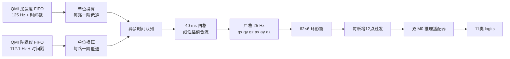

# IMU 采样、重采样与推理链

本文说明手柄固件中从 QMI 六轴原始采样到双 M0 推理窗口的完整数据合同。目标是把板载加速度计与陀螺仪的异步数据，稳定转换为训练模型要求的严格 25 Hz、`[62,6]` 输入。

对应代码：

- `esp32/firmware/components/imu_pipeline/include/imu_pipeline.h`
- `esp32/firmware/components/imu_pipeline/imu_pipeline.c`
- `esp32/firmware/components/imu_pipeline/include/imu_pipeline_dual_m0.h`
- `esp32/firmware/components/imu_pipeline/imu_pipeline_dual_m0_adapter.c`
- `esp32/host_tests/imu_pipeline/test_imu_pipeline.c`

## 1. 当前实现边界

本组件已经实现：

- 带单调微秒时间戳的 QMI 三轴原始样本接口；
- 125 Hz 加速度与约 112.1 Hz 陀螺仪异步合流；
- 每路独立的一阶低通抗混叠预处理；
- 严格 25 Hz 线性重采样；
- 固定 `gx、gy、gz、ax、ay、az` 六轴顺序与物理单位；
- `[62,6]` 环形窗口，每新增 12 点触发一次；
- 丢样、乱序、队列溢出、振动污染和推理失败质量标志；
- 双 M0 推理适配边界；
- 不依赖 ESP-IDF 的纯 C 主机测试。

本组件暂不负责：

- QMI 寄存器初始化、FIFO 中断读取和具体量程配置；
- 创建 FreeRTOS 任务或跨任务加锁；
- 控制马达，只接收马达实际导通时间区间；
- 动作计数、卡路里、BLE、UI 和低功耗状态机；
- 重新保存模型权重。生产适配器直接引用 `esp32/include` 中已有双 M0 头文件。

因此，板级 QMI 驱动需要把真实原始帧转换成本文定义的输入结构，再按时间顺序调用本组件。

## 2. 总体数据流



组件只使用当前与过去已到达的 QMI 样本。线性插值需要目标时刻右侧端点，因此每个 25 Hz 点会等待两路数据都到达该时刻之后；这是固定、很短的数据准备延迟，不使用未来动作窗口。

## 3. QMI 原始样本接口

### 3.1 输入结构

每个加速度或陀螺仪帧使用：

```c
typedef struct {
    uint64_t timestamp_us;
    int16_t raw_xyz[3];
    uint32_t quality_flags;
} imu_qmi_raw_sample_t;
```

字段含义：

- `timestamp_us`：采样对应的单调微秒时刻；推荐由 `esp_timer_get_time()` 或与它同域的 FIFO 时间映射产生；不得使用会校时或跳变的 RTC 时间。
- `raw_xyz[3]`：QMI x、y、z 三轴有符号原始整数。
- `quality_flags`：驱动已知的质量位；正常值为 `IMU_QUALITY_OK`。

加速度与陀螺仪分别调用：

```c
imu_pipeline_push_accel_raw(...);
imu_pipeline_push_gyro_raw(...);
```

### 3.2 时间戳约束

每一路时间戳必须严格递增：

$$
t_i > t_{i-1}
$$

重复或倒退样本会被拒绝，并设置 `IMU_QUALITY_OUT_OF_ORDER`。拒绝点不参与滤波、插值和窗口构建。

若 FIFO 一次读出多帧，不能给全部帧使用同一个中断到达时间。驱动应根据 ODR 反推每帧采样时刻，或使用器件硬件时间戳。否则多个样本会被当作重复时间戳。

### 3.3 单位换算

初始化配置提供当前量程对应比例：

$$
a_g = a_{raw}\,S_a
$$

$$
g_{dps} = g_{raw}\,S_g
$$

其中：

- $S_a$ 为 `accel_g_per_lsb`，单位 `g/LSB`；
- $S_g$ 为 `gyro_dps_per_lsb`，单位 `(deg/s)/LSB`；
- 两个比例必须为有限正数。

最终模型物理单位固定为：

| 下标 | 信号 | 单位 |
|---:|---|---|
| 0 | `gx` | deg/s |
| 1 | `gy` | deg/s |
| 2 | `gz` | deg/s |
| 3 | `ax` | g |
| 4 | `ay` | g |
| 5 | `az` | g |

量程寄存器改变后，必须同步更新比例。不能把原始整数直接送入训练时使用物理单位的模型。

## 4. 异步采样率为什么必须合流

当前设计假设：

- 加速度名义 ODR：125 Hz，名义周期 8,000 µs；
- 陀螺仪名义 ODR：112.1 Hz，名义周期约 8,912 µs；
- 模型目标采样率：25 Hz，目标周期 40,000 µs。

两路传感器不会在完全相同时刻给出数据。若直接按“第 n 个加速度配第 n 个陀螺仪”，时间错位会不断累积：

$$
n\left(\frac{1}{112.1}-\frac{1}{125}\right)
$$

因此必须以时间戳为基准，而不是以数组下标为基准。

每路都有独立低通状态和 32 点时间队列。只有当两路都覆盖目标时刻时，才产生一个六轴点。

## 5. 一阶低通抗混叠

### 5.1 目的

从 125/112.1 Hz 降到 25 Hz 后，输出 Nyquist 频率为：

$$
f_N = \frac{25}{2}=12.5\ \mathrm{Hz}
$$

高于 12.5 Hz 的传感器噪声若不衰减，会折叠到低频。组件在每路原始流上使用截止频率 8 Hz 的一阶 RC 低通，作为轻量抗混叠保护。

### 5.2 公式

连续 RC 时间常数：

$$
RC=\frac{1}{2\pi f_c}
$$

对实际相邻采样间隔 $\Delta t$，滤波系数为：

$$
\alpha=\frac{\Delta t}{RC+\Delta t}
$$

离散更新：

$$
y_i=y_{i-1}+\alpha(x_i-y_{i-1})
$$

其中：

- $x_i$：当前换算后的三轴物理量；
- $y_i$：当前滤波输出；
- $f_c=8$ Hz；
- $\Delta t$ 使用真实时间戳差，不假定永远等于名义 ODR。

每轴独立计算，但三个轴共享同一时间间隔。

### 5.3 边界处理

- 第一个点直接作为滤波初值，避免从零缓慢爬升。
- 时间戳重复或倒退的点在滤波前拒绝。
- 计算结果若不是有限数，拒绝该点并重置连续链。
- 数据间断后清空滤波器，防止间断前状态污染新连续段。

### 5.4 局限

一阶低通只提供简化抗混叠，不等价于陡峭 FIR。板级 QMI 驱动仍应优先启用芯片内合适的数字低通；若实机频谱证明 8 Hz 一阶滤波不够，再替换为系数固定、Python/C 可对照的多阶 FIR。

时间复杂度为每原始点 $O(3)$，状态空间为每路 3 个 `float`。

## 6. 严格 25 Hz 时间网格

### 6.1 首个目标时刻

设两路最早可用时间分别为 $t_{a,0}$ 与 $t_{g,0}$，起点取较晚者：

$$
t_0^*=\max(t_{a,0},t_{g,0})
$$

向上对齐到 40,000 µs 网格：

$$
t_0=\left\lceil\frac{t_0^*}{40000}\right\rceil\times40000
$$

之后：

$$
t_k=t_0+k\times40000
$$

因此输出间隔严格为 40,000 µs，不会因原始 ODR 抖动而漂移。

### 6.2 线性插值

对任意一路三轴信号，若目标时刻 $t$ 被两个滤波点 $(t_L,\mathbf{x}_L)$ 和 $(t_R,\mathbf{x}_R)$ 包围：

$$
t_L\le t\le t_R
$$

插值比例：

$$
r=\frac{t-t_L}{t_R-t_L}
$$

三轴输出：

$$
\mathbf{x}(t)=\mathbf{x}_L+r(\mathbf{x}_R-\mathbf{x}_L)
$$

实现先计算局部时间差，再转换为 `float`，不把绝对 64 位微秒时间戳直接转成浮点，避免设备长时间运行后的有效位损失。

常量信号和线性斜坡可被精确保持。插值的两个端点质量位会按位或传播到输出点。

### 6.3 合并六轴顺序

同一个目标时刻上：

$$
\mathbf{s}_k=
[g_x(t_k),g_y(t_k),g_z(t_k),a_x(t_k),a_y(t_k),a_z(t_k)]
$$

输出形状为 `[6]`，前三项 deg/s，后三项 g。该顺序与训练端、297 维特征头和双 M0 模型完全一致。

每个输出点的插值和合并时间复杂度为 $O(6)$。

## 7. 间断、乱序和队列溢出

### 7.1 自动间断判断

若相邻原始间隔大于名义周期的 1.5 倍：

$$
\Delta t > 1.5T_{nominal}
$$

则认为至少丢失一个原始点。组件估算丢点数，设置对应 `ACCEL_GAP` 或 `GYRO_GAP`，并重新建立连续段。

板级驱动若从 FIFO 状态得知精确丢点数，应调用：

```c
imu_pipeline_report_source_drop(...);
```

### 7.2 连续性重置

发生以下情况时清空 62 点环形窗并重新对齐 25 Hz 网格：

- 原始流显著间断；
- 驱动显式报告丢样；
- 32 点异步队列溢出；
- 当前目标时刻已经早于队列最早点，无法可靠恢复。

间断前和间断后的点绝不拼成同一模型窗口。新连续段首个输出带 `IMU_QUALITY_RESAMPLER_RESET`。

### 7.3 为什么队列只有 32 点

加速度 32 点约覆盖 256 ms，陀螺仪约覆盖 285 ms，远高于正常异步合流所需的一个采样周期。若仍填满，通常说明另一数据源停滞或消费任务长时间阻塞。此时继续保留旧点没有意义，重置比静默使用失配数据更安全。

## 8. 质量标志

| 标志 | 含义 | 建议处理 |
|---|---|---|
| `ACCEL_GAP` | 加速度疑似丢样 | 记录诊断，等待新连续窗 |
| `GYRO_GAP` | 陀螺仪疑似丢样 | 记录诊断，等待新连续窗 |
| `OUT_OF_ORDER` | 重复或倒退时间戳 | 检查 FIFO 时间映射 |
| `QUEUE_OVERFLOW` | 异步队列溢出 | 检查任务阻塞和源停滞 |
| `HAPTIC_CONTAMINATED` | 马达振动可能污染 | 不用于计数确认，等干净窗 |
| `DRIVER_DROP` | 驱动明确报告丢样 | 检查 QMI FIFO/中断负载 |
| `RESAMPLER_RESET` | 连续链已重置 | UI 可保持上次结果但不计数 |
| `INFERENCE_FAILED` | 双 M0 回调失败 | 不显示新动作，不累计次数 |

单点质量进入 62 点窗口时按位或汇总。只要窗口任一点受马达保护区影响，整个窗口都会带振动污染位。

## 9. 计数振动污染保护

系统设计为每确认一次动作计数，马达振动 30 ms。腕部 IMU 与马达位于同一设备，机械振动会制造高频加速度和角速度，因此马达实际导通区间必须注册：

```c
imu_pipeline_mark_haptic_interval(pipeline, start_us, end_us);
```

组件在区间前后各扩 20 ms：

$$
[t_s-20\mathrm{ms},\ t_e+20\mathrm{ms}]
$$

若 30 ms 计数振动从 $t_s$ 开始，名义保护宽度约为：

$$
20+30+20=70\ \mathrm{ms}
$$

保护只打质量标志，不擅自改写六轴数值。上层计数器必须遵循：

1. 先用干净推理结果确认一次动作；
2. 增加次数；
3. 记录并启动 30 ms 马达脉冲；
4. 带 `HAPTIC_CONTAMINATED` 的窗口不得再次触发计数；
5. 马达停止并离开保护区后再恢复计数确认。

这样避免“计数一次 → 马达振动 → IMU 把振动误认为新动作 → 再计数”的正反馈。

若马达驱动因调度延迟导致实际起止时刻变化，必须记录实际 GPIO 导通时间，而不是只记录计划时间。

## 10. 62×6 环形窗口

### 10.1 窗口规格

模型固定输入：

$$
N=62\ \text{points},\qquad C=6\ \text{axes}
$$

对应时间：

$$
T_w=\frac{62}{25}=2.48\ \mathrm{s}
$$

相邻窗口新增 12 点：

$$
T_s=\frac{12}{25}=0.48\ \mathrm{s}
$$

首个窗口在累计 62 个连续点后触发。之后每新增 12 个连续点触发一次，旧点通过环形覆盖，不移动整个数组。

### 10.2 展开与生命周期

环形数组内部不是时间顺序。触发时从最旧槽开始展开到连续 scratch：

```text
[62][6]，时间从旧到新，轴顺序 gx gy gz ax ay az
```

窗口回调和推理回调为同步调用。回调返回后 scratch 会被下一窗口复用，调用方不得长期保存其指针；若要异步处理，必须复制数据或只发送窗口序号与推理结果。

### 10.3 复杂度

- 每个 25 Hz 点写环形区：$O(6)$；
- 每 12 点展开窗口：$O(62\times6)$；
- 窗口样本 RAM：$62\times6\times4=1488$ B；
- 窗口时间戳 RAM：$62\times8=496$ B；
- 窗口质量 RAM：$62\times4=248$ B。

## 11. 双 M0 推理适配边界

### 11.1 设计目的

纯流水线通过函数指针调用模型：

```c
typedef int (*imu_pipeline_infer_fn)(
    void *context,
    const float window[62][6],
    float logits[11]);
```

好处：

- 主机测试可注入 mock，不编译、复制或链接真实权重；
- QMI、滤波、重采样和窗口测试不依赖神经网络；
- 生产固件只需把 `imu_pipeline_dual_m0_infer` 写入配置；
- 模型失败可通过返回码和质量位向上传播。

### 11.2 生产适配器

`imu_pipeline_dual_m0_adapter.c` 直接包含：

```c
#include "esp32_dual_m0_model.h"
```

然后调用已有：

```c
bp_dual_m0_forward_from_window(window, base_logits, masked_logits, combined_logits);
```

适配器不复制权重，不重新定义特征顺序。编译期静态断言检查：

- `WINDOW_LEN == 62`；
- `AXIS_NUM == 6`；
- `CLASS_NUM == 11`。

维度不一致时直接编译失败，禁止带错模型继续运行。

### 11.3 调用示例

```c
static imu_pipeline_t s_imu_pipeline;

static const imu_pipeline_config_t s_config = {
    .accel_g_per_lsb = 1.0F / 4096.0F,
    .gyro_dps_per_lsb = 1.0F / 16.4F,
    .infer = imu_pipeline_dual_m0_infer,
    .inference_context = NULL,
    .on_sample = NULL,
    .on_window = NULL,
    .on_inference = app_on_inference,
    .callback_context = NULL,
};
```

上述比例只是量程示例。正式值必须来自实际 QMI 配置。

## 12. RAM、Flash 与 CPU 影响

流水线不调用 `malloc`，全部状态由调用方提供的 `imu_pipeline_t` 保存。主机测试通过 `_Static_assert` 限制该结构不超过 8 KiB。

主要静态 RAM 构成：

| 项目 | 约占用 |
|---|---:|
| 两路 32 点异步队列 | 约 1.5 KiB |
| 62×6 环形样本 | 1,488 B |
| 62 点时间戳 | 496 B |
| 62 点质量位 | 248 B |
| 连续窗口 scratch | 约 1.5 KiB |
| 滤波、配置、统计和索引 | 数百字节 |

建议把 `imu_pipeline_t` 放在静态区或组件对象中，不放在 FreeRTOS 任务栈。

计算复杂度：

| 阶段 | 单次复杂度 |
|---|---:|
| 原始点换算与低通 | $O(3)$ |
| 队列入队/弹出 | 均摊 $O(1)$ |
| 单路插值 | $O(3)$ |
| 六轴点写环形区 | $O(6)$ |
| 窗口展开 | $O(62\times6)$，每 12 点一次 |
| 双 M0 + 297 维特征 | 由已有模型头实现，远高于重采样本身 |

输出更新周期为 480 ms，重采样链的计算余量充分。实机重点测量 297 维特征与双 M0 的总耗时，而不是线性插值。

## 13. FreeRTOS 集成建议

公开 push 接口不是线程安全的。推荐架构：

1. QMI 中断只通知读取任务，不在 ISR 中做浮点计算。
2. QMI 读取任务把 FIFO 帧按采样时间顺序送入一个流水线消费者。
3. 同一个消费者串行调用加速度与陀螺仪 push 接口。
4. 推理回调只写无锁快照或短队列，不直接刷新 LVGL。
5. UI 任务读取最新动作结果，计数任务决定是否触发 30 ms 振动。
6. 马达驱动在实际导通与关闭时记录时间，并注册污染区间。

如果加速度与陀螺仪由两个独立任务读取，必须先汇入同一个按时间排序的消息队列；不能并发修改同一个 `imu_pipeline_t`。

低功耗唤醒后应调用 `imu_pipeline_reset_session()`，重新积累完整 62 点连续窗。睡眠前的滤波和窗口状态不能跨长时间间断复用。

## 14. 主机测试

运行：

```powershell
& .\esp32\host_tests\imu_pipeline\run_tests.ps1
```

脚本执行：

- `-std=c11 -Wall -Wextra -Werror -Wmissing-prototypes` 严格编译；
- 生产双 M0 适配器语法检查，确认可引用现有模型头；
- 纯 C 流水线与 mock 模型链接；
- 常量异步输入的时间网格、轴顺序和单位测试；
- 125 Hz 交替高频信号低通衰减测试；
- 首窗与 12 点步长测试；
- 振动污染传播测试；
- 乱序、显式丢样、会话重置和队列溢出测试；
- 静态 RAM 上限检查。

主机 mock 只验证推理边界调用次数、窗口形状和 logits 传播，不复制真实双 M0 权重。

## 15. 实机验收清单

接入 QMI 与 ESP-IDF 后，至少完成：

1. 示波器或日志确认实际加速度约 125 Hz、陀螺仪约 112.1 Hz。
2. 连续运行时 25 Hz 输出间隔始终为 40,000 µs。
3. 静止平放时加速度模长接近 1 g，角速度接近 0 deg/s。
4. 六轴正负方向与 Python 数据集定义一致。
5. 10 分钟内无持续 `OUT_OF_ORDER`、`QUEUE_OVERFLOW` 或 `DRIVER_DROP`。
6. 第一个窗口在 62 点后出现，之后每 12 点一次。
7. 30 ms 计数振动对应窗口带 `HAPTIC_CONTAMINATED`，且不会二次计数。
8. 睡眠唤醒、QMI 重启和 BLE 断连恢复时重置连续链。
9. 双 M0 输入严格 `[62,6]`，输出严格 11 类 logits。
10. 记录“读取 FIFO + 重采样 + 特征 + 双 M0”最坏耗时，必须小于 480 ms。
11. 使用 `uxTaskGetStackHighWaterMark()` 验证实际任务栈余量。
12. 连续运行一小时无内存下降、NaN、看门狗复位和窗口序号异常。

## 16. 一致性合同

下列任一项改变都必须同时更新 Python、ESP32、测试和文档：

- QMI 量程比例；
- 六轴顺序；
- 物理单位；
- 输出采样率 25 Hz；
- 窗口长度 62；
- 步长 12；
- 特征维度 297；
- 类别数和类别顺序 11；
- 双 M0 融合实现；
- 马达污染保护规则。

允许的 Python/C 数值误差应继续沿用模型工程现有逐值测试口径。重采样主机测试对常量输入要求精确到 `1e-5` 量级；最终模型仍需以真实窗口做 Python/C logits 对照。
