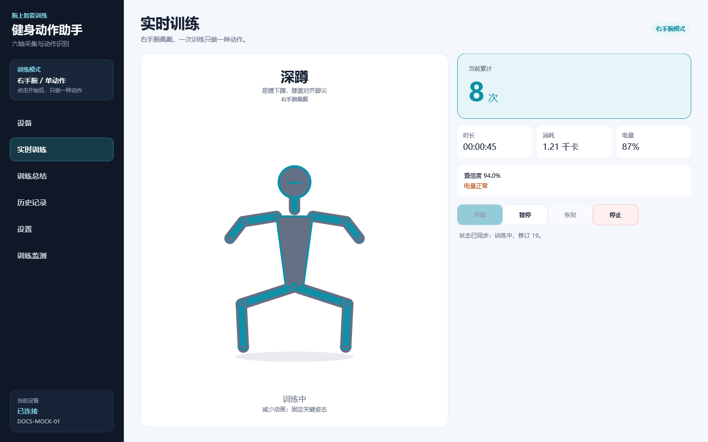
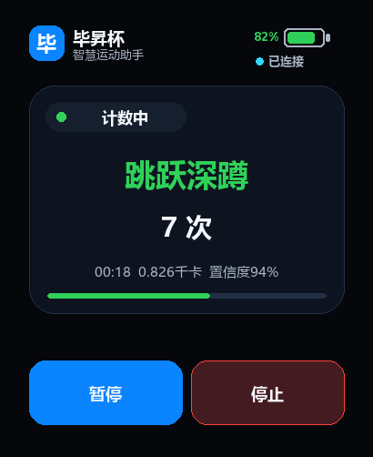

# 界面图片资产

本目录只保存可复现、可审计的教程界面图片。所有训练指标、设备标识和会话记录均为固定模拟数据，不是用户日志，也不代表某次真板测试结果。

## 目录

- `pc/`：生产 WPF 视图的离屏截图，尺寸固定为 `1440×900`。
- `watch/`：手表生产语义预览图，尺寸固定为 `410×502`。

每个子目录包含独立 `README.md` 和 `manifest.json`。清单记录生成方式、页面、尺寸及图片 SHA-256；不写 Git HEAD、生成时间或用户目录，避免提交后出现无意义漂移。

## 引用原则

文档直接引用稳定文件名，不复制带日期的临时截图。例如：

```markdown


```

禁止把以下内容放入本目录：

- 桌面截屏、窗口边框、鼠标指针或个人桌面背景；
- 真机蓝牙名称、MAC 地址、配对信息或用户历史记录；
- `.codex-local/`、`bin/`、`obj/` 或系统临时目录中的图片；
- 无生成入口、无尺寸合同或无法解释来源的设计稿。

界面源码变化后，应重新运行对应生成器并同时提交图片、清单和相关源码。提交前至少核对两次连续生成的文件摘要相同。
