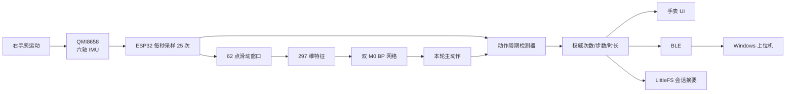
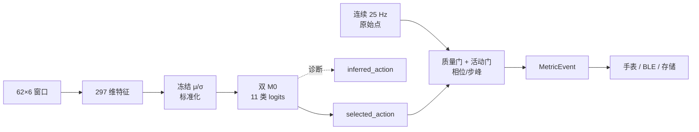
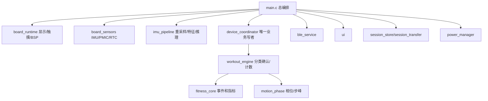
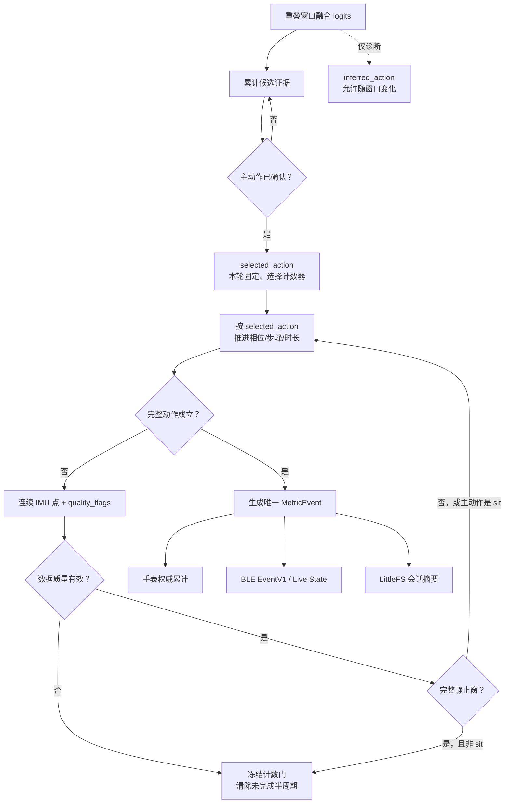
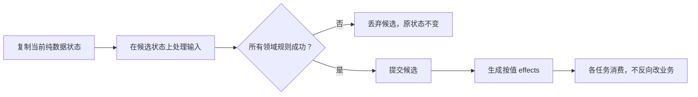
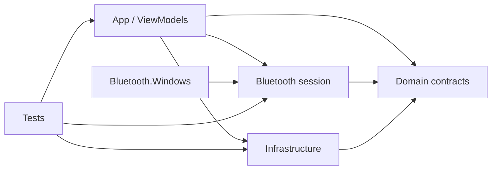
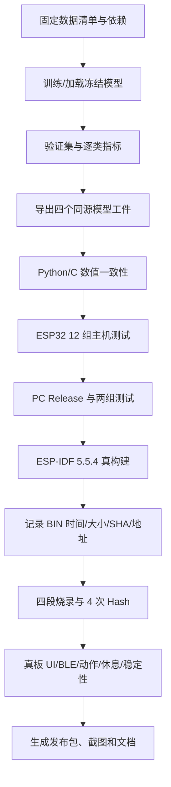

# ESP32 智慧运动助手：从零开始完整复刻教程

> 适用对象：第一次接触 Python、C、C#、机器学习、ESP32 或蓝牙开发的读者。
>
> 教程目标：不要求读者先会算法或嵌入式开发。跟随章节完成后，能够在 Windows 电脑上准备数据、训练 BP 神经网络、导出 ESP32 模型、构建并烧录手表固件、运行上位机，并理解动作识别和实时计数为什么能工作。
>
> 教程中的 `ProjectRoot` 表示你克隆或解压后的项目根目录；磁盘盘符和上级文件夹可以自由选择。
> 本文件是公开仓库的主教程；领域文档提供更精确的公式、字段表和发布边界。

## 教程地图

不必第一次就从头背到尾。可以按目标阅读：

- **先把项目跑起来**：第 0～5 章；
- **理解 IMU、特征和数学**：第 6～10 章；
- **复现 Python 训练和模型导出**：第 11～21 章；
- **理解 ESP32 实时分类与计数**：第 22～30 章；
- **理解手表 UI、存储和 BLE**：第 31～34 章；
- **理解 Windows 上位机**：第 35～40 章；
- **从干净电脑构建、烧录和真板验收**：第 41～47 章；
- **按源码继续学习和二次开发**：第 48～53 章。

遇到故障时，可以先跳到第 47 章按现象找层级，再回到对应原理章。

教程用三种醒目标识区分内容：

- **可执行命令**：可以在满足前置条件后复制到 PowerShell。
- **阅读版**：只保留关键关系，帮助理解，不可直接覆盖正式源码。
- **正式源码位置**：链接到当前实现；源码和教程冲突时，以经过测试的当前源码为准。

### 最短成功路径：第一次复刻沿这条主线走

这条路线只回答“现在先做什么”。数学推导和源码细节仍保留在后续章节，等对应阶段跑通后再深入。

**第一站：电脑端先亮起来。** 完成第 1～2 章、4.1～4.4 节和第 5 章；暂时跳过硬件第 3 章与 ESP-IDF 第 4.5 节。目标是创建 Python 虚拟环境、成功构建 WPF，并看到 Mock 上位机。此时不要训练模型、不要烧录、不要排查 BLE。Mock 只能证明桌面程序和界面主流程能运行。

**第二站：验证算法工件。** 完成第 6～21 章。只想运行当前版本时，直接核对仓库内冻结模型工件，不必先重训；想学习训练时，再从文件级划分走到双 M0 导出。完成标志是 297 维合同、类别顺序、工件哈希和 Python/C 数值边界都说得清。

**第三站：得到全新的固件。** 完成第 22～42 章，先过十二组 ESP32 主机测试，再用锁定的 ESP-IDF 5.5.4 真构建。成功证据是本次重新生成的 BIN、时间、长度和 SHA-256；旧 BIN 不能充当构建结果。

**第四站：真板闭环。** 完成第 43～47 章，核对目标 USB 身份后烧录，依次验收显示、触摸、BLE、动作识别、逐次计数、休息冻结和多轮稳定性。真板结果不能由 Mock、主机测试或一次日志替代。

每一站都只进入下一层，不同时改数据、模型、固件和 UI。这样失败时能确定故障属于哪一层。

---

## 0. 开始之前：先理解“复刻”是什么意思

完整复刻包含四个层次：

1. **能运行**：上位机能打开，手表能启动。
2. **能构建**：修改一行代码后，能重新生成 EXE 或 ESP32 固件。
3. **能解释**：知道数据从哪里来、经过什么处理、为什么得到某个动作和次数。
4. **能验证**：知道怎样证明 Python 模型与 ESP32 模型一致，怎样区分分类错误、计数错误、蓝牙错误和界面错误。

本教程按这四层逐步推进。前面的步骤看似慢，但会避免一种常见情况：程序“偶尔能跑”，一改代码就完全不知道哪里出了问题。

### 0.1 你最终会得到什么

完成教程后，系统的数据流如下：



这里最重要的是分清两件事：

- **动作识别**回答“正在做哪一种运动”。
- **实时计数**回答“这一次动作是否已经完整完成”。

神经网络不直接输出“第 8 次完成”。它先判断动作类别，随后对应动作的周期检测器再根据手腕完整往返或局部步峰判断次数。把两个问题混成一个问题，会导致分类窗口、计数时刻和显示时刻都很难调准。

### 0.2 当前产品规则

这套工程采用以下产品规则：

- 手表佩戴在右手腕。
- 一次训练会话只做一种主动作。
- 主动作确认后，本轮不会因为休息或短暂噪声切换为其它动作。
- 次数/步数动作在完整静止窗或坏质量数据时关闭计数门；最新窗口偶尔识别成异类或低置信类别，只写诊断，不直接切类或开关计数。
- 关闭计数门时，已经完成的次数保留，未完成的半个周期清除。
- 恢复主动作后，必须从一个新的完整周期开始计数。
- 10 次动作允许 `±2` 次误差，但算法设计目标仍是尽量逐次实时累加。

这组规则解决了“深蹲中途站立却显示静坐 3 次”一类问题：休息是计数暂停条件，不是让整轮训练改名的理由。

---

## 1. 完全零基础需要先认识的几个词

### 1.1 文件、文件夹和路径

Windows 中的下面这段文字叫作路径：

```text
D:\Code\IMU_BPNN_Classification
```

可以从右向左理解：

- `D:` 是示例磁盘。
- `Code` 是示例上级文件夹。
- `IMU_BPNN_Classification` 是克隆得到的项目文件夹。

本教程把这个位置统一称为 `ProjectRoot`。它不是必须创建的固定目录名，也不要求放在某个盘符。作者电脑、你的电脑和 CI 服务器可以使用不同绝对路径，只要目录内部结构相同。

> 类型：可执行命令

先把下面的示例路径替换成你自己的项目根目录，再执行：

```powershell
$ProjectRoot = 'D:\Code\IMU_BPNN_Classification'
Set-Location -LiteralPath $ProjectRoot
```

逐段解释：

- `$ProjectRoot` 保存本次 PowerShell 会话使用的项目绝对路径。
- `Set-Location` 切换当前工作目录。
- `-LiteralPath` 按原样读取路径，不把方括号等字符误当通配符。
- 单引号把整个路径包起来，路径中有空格时也不会被拆开。

检查当前位置和 Git 根：

```powershell
Get-Location
git rev-parse --show-toplevel
```

两条命令应指向同一个项目根。若第二条提示“不是 Git 仓库”，说明你进入了错误目录或使用的是不含 `.git` 的压缩包；运行源码不一定受影响，但不能进行版本核对。

以后命令中出现 `python\train_export.py`，实际含义是：

```text
<ProjectRoot>\python\train_export.py
```

后文所有相对命令都默认已经位于 `ProjectRoot`。若 `Get-Location` 不在这里，先不要执行训练、构建或烧录命令。

### 1.2 源代码、构建产物和运行数据

这三种文件的用途不同：

- **源代码**是人写的规则，例如 `.py`、`.c`、`.h`、`.cs`、`.xaml`。
- **构建产物**是工具根据源代码生成的文件，例如 `.bin`、`.elf`、`.exe`。
- **运行数据**是程序运行后产生的内容，例如 IMU CSV、历史 JSON、日志。

源代码应当长期保存。构建产物通常可以重新生成。现场 CSV 则是诊断真实动作问题的重要证据，不能只因为“可以再测”就随意删除。

### 1.3 命令行不是另一种编程语言

PowerShell 是 Windows 的命令执行环境。教程会给出可以复制的命令，但不要一次粘贴很多行后不看结果。

推荐习惯：

1. 复制一段命令。
2. 按 Enter。
3. 看命令是否正常退出。
4. 对照教程中的成功标志。
5. 成功后再执行下一段。

命令返回红字不一定都是项目错误。例如“找不到文件”可能只是当前目录不对。先看错误中出现的路径，再判断代码。

### 1.4 函数、参数、返回值

下面是一段最小 Python 函数：

```python
def add(left: float, right: float) -> float:
    result = left + right
    return result
```

逐行阅读：

1. `def` 表示定义一个函数。
2. `add` 是函数名。
3. `left` 和 `right` 是调用者传入的两个数。
4. `: float` 说明预期传入浮点数。
5. `-> float` 说明函数会返回浮点数。
6. `result = left + right` 把两数相加的结果保存到变量。
7. `return result` 把结果交回调用者。

调用：

```python
total = add(2.0, 3.0)
```

执行后 `total` 等于 `5.0`。

C 和 C# 语法不同，但“输入参数进入函数，函数处理状态，最后返回结果”这一思路相同。

### 1.5 数组、形状和六轴数据

IMU 每个时间点产生 6 个数：

```text
gx, gy, gz, ax, ay, az
```

含义如下：

- `gx、gy、gz`：绕 X、Y、Z 轴旋转的角速度，单位 `deg/s`。
- `ax、ay、az`：沿 X、Y、Z 轴的加速度，单位 `g`。

如果连续采样 62 个点，Python 中的数据形状写成：

```text
[62, 6]
```

第一维 62 是时间点数，第二维 6 是通道数。可以把它想成一个 Excel 表：62 行、6 列。

### 1.6 什么是“模型”

这里的 BP 神经网络是一组按训练参数执行的矩阵乘法：

$$
\mathbf{y}=f(\mathbf{W}\mathbf{x}+\mathbf{b})
$$

先不急着记公式。逐个理解：

- $\mathbf{x}$ 是输入，本项目中是 297 个标准化特征。
- $\mathbf{W}$ 是许多训练得到的权重。
- $\mathbf{b}$ 是偏置。
- $f$ 是激活函数，它让网络能表达非线性差异。
- $\mathbf{y}$ 是输出分数，11 个动作各有一个分数。

训练就是不断调整 $\mathbf{W}$ 和 $\mathbf{b}$，让正确动作的分数更高。ESP32 推理则只读取已经训练好的权重，不在手表上重新训练。

---

## 2. 整个项目由哪些部分组成

工程根目录的主要结构是：

```text
Project/
├─ IMU_Dataset/              原始和整理后的 IMU 数据
├─ python/                   数据处理、特征、训练、评估、模型导出
├─ outputs/                  Python 训练生成的本地工件
├─ esp32/                    ESP32-S3 手表固件
│  ├─ firmware/              ESP-IDF 工程
│  ├─ host_tests/            不接手表也能运行的 C 测试
│  └─ include/               已发布模型头文件和双 M0 清单
├─ shared/protocol/          ESP32 与 PC 共用的 BLE 帧合同
├─ pc/                       .NET 8 WPF 上位机
├─ docs/                     教程、原理、协议、硬件与验收文档
└─ README.md                 项目入口
```

### 2.1 为什么不能把所有代码塞进一个程序

Python 擅长训练和画图，但不适合直接作为手表固件。ESP32 资源有限，需要静态内存、确定的执行时间和 C 数组。Windows 上位机需要 BLE、窗口、按钮、文件选择器和历史查询，使用 C#/WPF 更合适。

因此分成三种语言：

- Python 负责“从数据学到参数”。
- C 负责“在手表上快速、稳定地执行参数”。
- C# 负责“在 Windows 上与用户交互”。

它们依靠两类合同连接：

1. **模型合同**：特征顺序、均值、标准差、权重、偏置、类别顺序必须一致。
2. **通信合同**：BLE 帧头、字段长度、字节序、CRC、消息编号必须一致。

任何一端私自改变顺序，系统都可能“运行正常但结果完全错误”。这比直接崩溃更危险，所以工程中有大量一致性测试。

### 2.2 手写文件与自动生成文件

以下文件主要由人设计：

- `python/train_export.py`
- `python/dual_m0_export.py`
- `esp32/firmware/components/**`
- `esp32/firmware/main/main.c`
- `shared/protocol/imu_ble_protocol.c/.h`
- `pc/FitnessCoach.*`

以下文件由工具生成或由训练结果导出：

- `esp32/include/esp32_bp_features.h`
- `esp32/include/esp32_dual_m0_model.h`
- `esp32/include/dual_m0_bundle.npz`
- `esp32/firmware/components/ui/fonts/ui_font_noto_sans_sc_*.c`
- `esp32/firmware/build/**`
- `pc/**/bin/**`
- `pc/**/obj/**`

自动生成文件仍然需要理解，但不要逐个改权重或字形字节。正确做法是修改生成器或输入，然后重新生成，再比较哈希和数值。

---

## 3. 准备硬件

> **阶段检查点：先认清板子，不做业务调试。** 本章完成时，你应能确认板型、显示/触摸控制器版本和 `VID_303A&PID_1001` USB 身份。端口未枚举或硬件版本仍有冲突时，停在本章；不要靠修改 UI、BLE 或算法绕过硬件身份问题。

### 3.1 核心硬件

目标板是 Waveshare `ESP32-S3-Touch-AMOLED-2.06` 智能手表板。板上主要器件：

- ESP32-S3：运行分类、计数、BLE、存储和 UI。
- QMI8658：六轴 IMU。
- AMOLED：显示训练页面。
- 触摸控制器：接收点击和滑动。
- AXP2101：电源管理和电池状态。
- PCF85063：RTC 实时时钟。
- USB：供电、烧录和串口日志。

还需要：

- 一条能传数据的 USB 线。只有充电功能的线无法烧录。
- Windows 10 或 Windows 11 电脑。
- 右手佩戴表带。

### 3.2 为什么硬件版本必须先确认

同一外观的板卡可能在不同批次使用不同显示或触摸控制器。工程当前锁定 Waveshare BSP `2.0.0`、LVGL `9.5.0`。不要看到网上另一个例程可以点亮屏幕，就复制其中一半驱动代码进来。

显示链最容易出现“屏幕亮了但颜色错”“触摸坐标反了”“多刷新几次后死机”。复刻时必须保留同一套：

- BSP 版本；
- 显示驱动；
- 触摸驱动；
- LVGL 版本；
- 颜色格式；
- 缓冲策略；
- flush 完成回调。

### 3.3 接入 USB 后先看设备身份

打开 PowerShell：

```powershell
Get-PnpDevice -PresentOnly |
    Where-Object { $_.InstanceId -like '*VID_303A&PID_1001*' } |
    Select-Object Status, FriendlyName, InstanceId
```

这段命令做三件事：

1. `Get-PnpDevice -PresentOnly` 只读取当前连接的硬件。
2. `Where-Object` 只保留 ESP32-S3 USB JTAG/Serial 设备。
3. `Select-Object` 显示状态、名称和硬件身份。

如果没有输出：

- 换 USB 数据线；
- 换电脑 USB 口；
- 等待 Windows 安装驱动；
- 查看设备管理器中是否出现未知设备。

不要因为没有 COM10 就认定设备坏了。COM 号会变化，真正稳定的身份是 `VID_303A&PID_1001`。

---

## 4. 准备软件环境

### 4.1 为什么要固定版本

“安装最新版”不适合可复现工程。库升级可能改变：

- NumPy 数值行为；
- PyTorch 模型保存格式；
- LVGL API；
- ESP-IDF 构建参数；
- Windows BLE SDK 接口。

本项目的关键版本：

- Python 3.10～3.12 的项目兼容版本；
- NumPy `1.26.4`；
- scikit-learn `1.5.2`；
- Matplotlib `3.9.2`；
- PyTorch `2.5.1`；
- ESP-IDF `5.5.4`；
- .NET SDK `8.x`，或能构建 `net8.0-windows` 的更新 SDK；
- Waveshare BSP `2.0.0`；
- LVGL `9.5.0`；
- LittleFS `1.22.2`。

### 4.2 先做干净电脑预检

> 类型：可执行命令

在安装项目依赖前，先确认基础命令来自正常 Windows 环境：

```powershell
git --version
python --version
dotnet --info
```

以下条件同时成立才算环境预检成功：

- `git --version` 返回 Git 版本，没有“找不到命令”。
- `python --version` 位于 3.10～3.12；过旧版本先升级，不创建错误虚拟环境。
- `dotnet --info` 能看到可用 SDK，并能支持 `net8.0-windows`。

任何一项找不到时，先安装对应官方工具、关闭并重新打开 PowerShell，再复查。此时不要修改源码。ESP-IDF 使用项目本地隔离工具链，放在 4.5 节单独准备。

### 4.3 创建 Python 虚拟环境

虚拟环境的作用是把本项目依赖与电脑其它 Python 项目隔离。

在项目根目录执行：

```powershell
python -m venv .venv
```

解释：

- `python` 启动 Python。
- `-m venv` 调用 Python 自带的虚拟环境模块。
- `.venv` 是环境目录名。

激活：

```powershell
.\.venv\Scripts\Activate.ps1
```

成功后，PowerShell 提示符左侧通常出现 `(.venv)`。

安装固定依赖：

```powershell
python -m pip install --upgrade pip
python -m pip install -r .\python\requirements.txt
```

第一行只升级当前虚拟环境的 `pip`。第二行读取：

```text
numpy==1.26.4
scikit-learn==1.5.2
matplotlib==3.9.2
torch==2.5.1
```

两个等号表示锁定精确版本。

检查：

```powershell
python -c "import numpy, sklearn, matplotlib, torch; print(numpy.__version__, sklearn.__version__, matplotlib.__version__, torch.__version__)"
```

输出中应出现上述版本。末尾可能带 `+cpu`，表示使用 CPU 版 PyTorch，不影响本项目的小型全连接网络训练。

### 4.4 安装 .NET 8

执行：

```powershell
dotnet --info
```

关注输出中是否存在能构建 `net8.0-windows` 的 SDK 和 Windows Desktop 目标包。优先使用 `8.x`；更新 SDK 只有在实际构建通过时才算兼容。WPF 只能在 Windows 上运行。

项目文件中的关键配置：

```xml
<TargetFramework>net8.0-windows10.0.26100.0</TargetFramework>
<SupportedOSPlatformVersion>10.0.19041.0</SupportedOSPlatformVersion>
<UseWPF>true</UseWPF>
<Nullable>enable</Nullable>
<TreatWarningsAsErrors>true</TreatWarningsAsErrors>
```

逐项理解：

- `TargetFramework`：使用 .NET 8 和 Windows API。
- `SupportedOSPlatformVersion`：运行系统最低支持 Windows 10 2004。
- `UseWPF`：启用 XAML 和 WPF 构建。
- `Nullable`：让编译器检查可能为空的对象，减少断连时空引用。
- `TreatWarningsAsErrors`：警告也会阻止构建，避免把潜在错误带到现场。

### 4.5 准备项目本地 ESP-IDF 5.5.4

本工程的包装脚本不会静默使用系统里任意版本的 IDF。它只接受：

```text
<ProjectRoot>\.codex-local\cache\esp-idf-v5.5.4
<ProjectRoot>\.codex-local\cache\espressif-tools
```

这样做能避免另一项目的 IDF、Python、Ninja 或编译器混入固件。`.codex-local` 是可再生的本地工具目录，不进入 Git。

第一次准备时，在 `ProjectRoot` 执行下面的官方来源安装流程。下载体积较大，先确认磁盘空间和网络：

> 类型：可执行命令

```powershell
$IdfRoot = Join-Path $ProjectRoot '.codex-local\cache\esp-idf-v5.5.4'
$IdfToolsRoot = Join-Path $ProjectRoot '.codex-local\cache\espressif-tools'
$LocalTemp = Join-Path $ProjectRoot '.codex-local\tmp'
$LocalDirectories = @(
  (Split-Path $IdfRoot -Parent),
  $IdfToolsRoot,
  $LocalTemp
)

New-Item -ItemType Directory -Force -Path $LocalDirectories | Out-Null

git -c core.longpaths=true clone `
  --branch v5.5.4 --recursive `
  https://github.com/espressif/esp-idf.git `
  $IdfRoot

$env:IDF_TOOLS_PATH = $IdfToolsRoot
$env:TEMP = $LocalTemp
$env:TMP = $LocalTemp
& (Join-Path $IdfRoot 'install.ps1') esp32s3
```

若 `IdfRoot` 已存在，不要再次 clone 覆盖。先检查它是否真的是 `v5.5.4`，再决定恢复缺失子模块或重新准备缓存。

安装后在当前 PowerShell 做只读版本探针：

```powershell
$env:IDF_TOOLS_PATH = $IdfToolsRoot
& (Join-Path $IdfRoot 'export.ps1')
idf.py --version
```

输出必须包含 `ESP-IDF v5.5.4`。安装后还必须能找到：

- Python；
- CMake；
- Ninja；
- Xtensa ESP32-S3 编译器；
- `idf.py`；
- `esptool.py`。

工程提供包装入口：

> 类型：可执行命令

```powershell
.\esp32\firmware\tools\idf_project.ps1 -Action build
```

这是第一次权威固件环境验证，也会执行真实构建。成功时应生成 `esp32\firmware\build\imu_fitness_handheld.bin` 并返回退出码 0。若提示“缺少项目本地 ESP-IDF”或“缺少项目本地 ESP-IDF 工具链”，停在这里修环境；不要改源码，也不要回退到版本未知的系统 `idf.py`。

包装脚本固定项目使用的工具路径、编码、目标芯片和构建目录。在没有正确导出环境的普通 PowerShell 中直接运行 `idf.py`，常见结果是找不到 Python 包、Ninja 或编译器。

第一次学习时先不要烧录。等第 41～42 章完成主机测试、真构建和镜像核对后再连接 Flash。

---

## 5. 第一次运行：不接手表也能看懂产品

先运行 Mock 上位机，可以把“界面逻辑错误”和“蓝牙/硬件错误”分开。

> **第一次成功目标：看到无需硬件的运动助手界面。** 完成本章证明 Windows 上位机能够还原依赖、构建、启动并执行 Mock 主流程；它不证明 ESP32、真实 BLE、IMU 单位、模型准确率或真板计数正常。若 Mock 失败，先修 PC 环境，不进入烧录。

### 5.1 构建上位机

> 类型：可执行命令。前置条件：当前目录为 `ProjectRoot`。

第一次构建先还原 NuGet 依赖：

```powershell
dotnet restore .\pc\FitnessCoach.sln
```

还原成功后执行 Release 构建：

```powershell
dotnet build .\pc\FitnessCoach.sln -c Release --nologo --no-restore --disable-build-servers -m:1
```

参数解释：

- `dotnet build`：编译解决方案。
- `.\pc\FitnessCoach.sln`：包含上位机七个工程的解决方案。
- `-c Release`：使用发布配置。
- `--nologo`：不打印无关启动标志。
- `--no-restore`：已有依赖时不重复联网还原。
- `--disable-build-servers`：避免旧编译节点持有文件。
- `-m:1`：单节点构建，降低这台 Windows 机器上多节点死锁概率。

成功标志：

```text
0 Warning(s)
0 Error(s)
```

### 5.2 启动 Mock

> 类型：可执行命令

```powershell
powershell -NoProfile -ExecutionPolicy Bypass -File .\pc\tools\run.ps1
```

首次启动默认使用 Mock。Mock 是一个在内存里模拟手表的对象：

- 会产生连接状态；
- 会产生动作、次数、时长和电量；
- 会产生历史；
- 不会扫描真实蓝牙；
- 不能证明真板采样和分类正确。

当设备页、实时训练页、总结页、历史页、设置页和诊断页均能打开，且窗口没有未处理异常时，本阶段完成。无需为了“看起来更真实”连接手表；下一阶段先理解数据和模型合同。

你现在可以依次打开：

1. 设备；
2. 实时训练；
3. 训练总结；
4. 历史记录；
5. 设置；
6. 训练监测。


### 5.3 上位机启动代码怎样工作

入口是 `pc/FitnessCoach.App/App.xaml.cs`。先看核心结构：

```csharp
protected override async void OnStartup(StartupEventArgs eventArgs)
{
    base.OnStartup(eventArgs);

    LocalAppDataPaths paths = LocalAppDataPaths.CreateDefault();
    paths.EnsureDirectories();

    _sessionRepository = new JsonSessionRepository(paths.SessionsFile);
    await _sessionRepository.InitializeAsync().ConfigureAwait(true);

    _preferencesStore = new JsonUserPreferencesStore(paths.PreferencesFile);
    UserPreferences startupPreferences =
        await _preferencesStore.LoadAsync().ConfigureAwait(true);

    _deviceSession = startupPreferences.UseRealBleDevice
        ? new WindowsBleDeviceSession(
            new WinRtBleTransport(new FirstFitnessDeviceSelector()))
        : new MockDeviceSession();
}
```

按执行顺序理解：

1. WPF 调用 `OnStartup`，应用开始启动。
2. `base.OnStartup` 先让 WPF 完成自己的初始化。
3. `LocalAppDataPaths.CreateDefault()` 计算当前 Windows 用户的本地数据目录。
4. `EnsureDirectories()` 创建设置、历史和日志目录。
5. `JsonSessionRepository` 管理历史会话文件。
6. `InitializeAsync()` 检查或创建历史文件。
7. `JsonUserPreferencesStore` 管理用户设置。
8. `LoadAsync()` 读取“下次使用真 BLE 还是 Mock”等选项。
9. 三元表达式 `条件 ? A : B` 根据设置创建一种设备会话。
10. 真 BLE 使用 `WindowsBleDeviceSession`，Mock 使用 `MockDeviceSession`。

为什么启动时决定 Mock/真 BLE，而不是运行中直接替换？因为六个页面都订阅同一个 `IDeviceSession`。运行中替换对象容易留下旧事件订阅、后台任务和 GATT 资源。保存设置后下次启动生效，生命周期更清楚。

### 5.4 MVVM 是什么

WPF 页面没有直接写蓝牙逻辑。工程把职责分为：

- **Model**：动作、状态、会话摘要等领域数据。
- **View**：XAML 界面。
- **ViewModel**：把设备状态转换成界面能绑定的属性和命令。

例如按钮绑定 `StartCommand`。用户点击按钮后，ViewModel 调用 `IDeviceSession.StartAsync()`，设备返回新状态后，ViewModel 更新属性，XAML 自动刷新。这样测试可以直接调用 ViewModel，不需要真的点击窗口。

---

## 6. IMU 数据：机器究竟看到了什么

### 6.1 六轴不是六种动作

六轴表示三个角速度和三个加速度：

```text
gx, gy, gz, ax, ay, az
```

以开合跳为例：

- 手臂上下摆动会改变角速度；
- 起跳和落地会改变加速度；
- 每次动作形成近似周期；
- 不同人幅度不同，但“重复、方向变化、能量分布”仍有相似结构。

模型从多份记录的统计特征中学习组合规律，不要求输入与某一条标准曲线逐点重合。

**贯穿案例：一段开合跳如何走到一次权威计数。**

先把第 6～10 章放进同一条数据生命周期。某个时刻凑齐 62 个六轴点，分类链会把它压缩成 297 维特征，再标准化并送入双 M0；与此同时，原始 25 Hz 数据仍逐点进入活动门和周期检测器。网络只提供本轮主动作，不直接制造次数：



这张图中的形状变化是本阶段的主线：

```text
[62, 6] 原始窗口
  -> [297] 原始特征
  -> [297] 标准化特征
  -> [11] 融合 logits
  -> 1 个主动作类别
```

但最后的 `MetricEvent` 还需要原始点形成完整周期。即使当前窗口高置信识别为开合跳，手臂只抬到一半也不能加一。后面每个公式都可以回到这条案例上：它是在改变数值单位、窗口表示、特征表达，还是计数状态。

### 6.2 原始整数如何变成物理量

传感器通过寄存器返回整数。若陀螺仪量程换算系数为 `16.4 LSB/(deg/s)`，则：

$$
g_c=\frac{g_{\text{raw}}}{16.4}
$$

若加速度换算系数为 `4096 LSB/g`，则：

$$
a_c=\frac{a_{\text{raw}}}{4096}
$$

例如原始角速度为 `164`：

```text
164 / 16.4 = 10 deg/s
```

如果 Python 按 `16.4` 换算，而 ESP32 按另一个量程换算，相同动作会进入完全不同的特征范围。因此单位合同是第一道硬门。

### 6.3 采样率为什么是 25 Hz

25 Hz 表示每秒 25 个六轴点，相邻点间隔约：

$$
\Delta t=\frac{1}{25}=0.04\text{ s}=40\text{ ms}
$$

健身动作通常不会快到需要几百 Hz。25 Hz 的好处：

- 一个动作周期仍有足够点数；
- ESP32 计算量低；
- BLE 和存储数据量小；
- 电池消耗更低。

代价是时间戳必须稳定。若中间突然缺少很多点，不能把缺口两侧拼成一个动作周期。

### 6.4 CSV 是什么

CSV 是用逗号分列的文本。最小示例：

```csv
time_ms,gx,gy,gz,ax,ay,az
0,1.2,-0.5,3.1,0.02,0.91,-0.12
40,1.8,-0.7,4.0,0.03,0.89,-0.11
80,2.5,-1.0,5.2,0.05,0.87,-0.09
```

表头说明每列含义。后续每行是一个采样点。

训练数据目录是：

```text
IMU_Dataset\imu_dataset_for_final
```

训练脚本默认会先找这个目录。如果不存在，再尝试兼容旧目录 `imu_dataset_for_final`。

### 6.5 为什么按“文件”划分训练、验证和测试

连续窗口高度相似。如果把同一段动作的前半窗口放进训练集、后半窗口放进测试集，测试准确率会虚高，因为模型已经见过几乎相同的动作轨迹。

正确做法是至少按独立文件划分：

- 训练集：用于调整权重。
- 验证集：用于选择配置和早停。
- 测试集：最终只读评估。

更严格的泛化验证应按人划分。若同一个人的数据同时出现在训练和测试中，仍不能证明换一个人也能工作。

### 6.6 当前数据边界

现有数据能够支持项目复现，但没有完整记录：

- `subject_id`；
- 左右手；
- 佩戴角度；
- 表带松紧；
- 动作质量；
- 每轮真实次数。

所以教程中的准确率是当前数据和当前测试协议下的结果，不等于所有用户都能达到相同准确率。真正开源扩展数据集时，建议每条记录至少包含：

```text
subject_id
session_id
action
true_count
wrist_side
strap_tightness
wear_angle
quality_note
```

---

## 7. 从连续信号切出模型窗口

### 7.1 为什么不能一次只看一个采样点

单个 IMU 点没有完整动作含义。例如加速度突然增大，可能是起跳、落地、甩手或碰撞。模型需要一段上下文。

当前窗口长度为 62 点：

$$
T=\frac{62}{25}=2.48\text{ s}
$$

2.48 秒通常能覆盖一个较慢动作或一个以上较快动作周期。

### 7.2 滑动窗口

假设有 100 个点，窗口为 62 点，步长为 12 点：

```text
窗口 1：点 0  到点 61
窗口 2：点 12 到点 73
窗口 3：点 24 到点 85
窗口 4：点 36 到点 97
```

窗口互相重叠。优点是模型不用等完整 2.48 秒后再等另一整窗，约每 0.5 秒可以产生一次新判断。

Python 中的核心生成方式可写成：

```python
def iter_windows(data, window_len, step_len):
    start = 0
    while start + window_len <= len(data):
        end = start + window_len
        yield data[start:end]
        start += step_len
```

逐行理解：

- `start = 0`：第一个窗口从第 0 个点开始。
- `while start + window_len <= len(data)`：只有剩余点数足够一个完整窗口才继续。
- `end = start + window_len`：计算右边界。
- `yield data[start:end]`：交出当前窗口，但保留函数状态，下一次从这里继续。
- `start += step_len`：窗口向后移动一个步长。

使用 `yield` 而不是一次创建全部窗口，可以减少内存峰值。

### 7.3 不足一个窗口怎么办

最后剩余不足 62 点时，不应用零填充伪造动作。训练和实时推理都等待完整窗口。零填充会制造突然回到 0 的假信号，模型可能把它当成落地或停止。

### 7.4 质量位和时间缺口

每个点除了六轴值，还需要知道：

- 时间戳是否连续；
- 传感器是否刚重置；
- 数据是否溢出；
- 是否发生丢点。

发现时间缺口时：

1. 已经完成的次数不能回滚。
2. 正在形成的半个周期必须清除。
3. 缺口之后从新周期重新检测。
4. 不能把缺口前的峰和缺口后的谷拼成一次。

这也是为什么数据质量不只是“日志字段”，而会直接影响计数器状态。

---

## 8. 特征：把 62×6 的曲线变成 297 个可比较的数

### 8.1 为什么需要特征

直接把 372 个原始点送入一个大网络也可以尝试，但小型 ESP32 项目更关注：

- 模型体积；
- 推理时间；
- 内存；
- 可解释性；
- Python/C 一致性。

统计特征把曲线压缩成固定长度。297 个特征概括：

- 大小；
- 波动；
- 形状；
- 变化速度；
- 周期；
- 频谱；
- 轴间关系；
- 重力与运动方向。

### 8.2 从最简单的均值开始

一列数据 $x_1,x_2,\dots,x_N$ 的均值：

$$
\mu=\frac{1}{N}\sum_{i=1}^{N}x_i
$$

生活化理解：把所有值相加，再平均分给每个点。

Python：

```python
mean_value = float(np.mean(values))
```

- `np.mean` 计算均值。
- `float` 把 NumPy 标量变为普通 Python 浮点数，便于导出。

均值能描述重力方向和姿态偏置，但不能单独区分所有动作。左右手、佩戴角度和站姿都可能改变均值，所以还需要相对特征和增强。

### 8.3 标准差

标准差描述数据围绕均值的波动：

$$
\sigma=\sqrt{\frac{1}{N}\sum_{i=1}^{N}(x_i-\mu)^2}
$$

理解过程：

1. 每个点减均值，得到偏离量。
2. 平方，避免正负抵消。
3. 求平均。
4. 开平方，回到原单位。

静坐的加速度和角速度波动通常较小；跳跃动作通常更大。标准差因此有区分价值。

### 8.4 极差、均方根和能量

极差：

$$
R=\max(x)-\min(x)
$$

它描述最大摆幅。

均方根：

$$
\operatorname{RMS}(x)=\sqrt{\frac{1}{N}\sum_{i=1}^{N}x_i^2}
$$

它同时保留正负方向运动的总体强度。

能量通常与平方和有关。幅度越大、持续越久，能量特征越高。但不同人动作幅度不同，所以不能使用一个固定能量阈值代替全部分类。

### 8.5 差分

一阶差分：

$$
\Delta x_i=x_i-x_{i-1}
$$

它描述变化速度。两个人都完成深蹲，最低位置可能不同，但“下降—转向—上升”的差分结构仍可能相似。

### 8.6 相关系数

两个通道的相关系数：

$$
\rho_{xy}=
\frac{\sum_i(x_i-\bar{x})(y_i-\bar{y})}
{\sqrt{\sum_i(x_i-\bar{x})^2}\sqrt{\sum_i(y_i-\bar{y})^2}}
$$

取值接近：

- `+1`：两个通道大致同向变化；
- `0`：线性关系弱；
- `-1`：一个升高时另一个降低。

开合跳的手臂和身体运动存在稳定配合，轴间相关有助于区分只挥手或行走。

当某一列几乎不变时，分母接近 0。实现必须加保护，否则结果会变成 NaN：

```python
if left_std < epsilon or right_std < epsilon:
    correlation = 0.0
else:
    correlation = float(np.corrcoef(left, right)[0, 1])
```

### 8.7 频谱

重复动作在频域中会出现节奏峰。离散傅里叶变换把“随时间变化”转换为“不同频率包含多少能量”。

不要求新手手算 FFT。先记住：

- 横轴 Hz 表示每秒重复多少次；
- 低频通常对应较慢的人体动作；
- 峰的位置描述节奏；
- 峰的宽度描述动作节奏是否稳定。


图中不同动作的频谱不是完全分离，但能与时域、姿态和轴间特征共同工作。

### 8.8 为什么是 297 维

297 不是随意选择的“越多越好”。它来自固定特征组和固定顺序。模型权重的第一层每一列都对应一个具体特征。

如果 Python 把第 20 个特征改成新含义，而 ESP32 仍按旧方法计算，第 20 列权重会乘错数据。即使数组长度仍是 297，编译也不会报错。因此工程同时导出特征实现和清单，并运行 Python/C 逐值对照。

### 8.9 不要为了某次测试无限加特征

某一次开合跳失败，不代表应该加入“只识别这次开合跳”的特征。通用特征应满足：

- 对动作结构有物理意义；
- 不依赖单个人的绝对幅度；
- 不依赖一只手表的固定偏置；
- Python 和 C 都能稳定计算；
- 在独立验证集上改善，而不只是在训练集上改善。

---

## 9. 标准化：让不同量纲进入同一个网络

角速度可能达到几百或上千 `deg/s`，相关系数却只在 `-1` 到 `1`。直接输入网络，大数值特征会主导梯度。

对第 $i$ 个特征：

$$
z_i=\frac{x_i-\mu_i}{\sigma_i}
$$

- $x_i$：当前窗口的原始特征。
- $\mu_i$：训练集第 $i$ 个特征的均值。
- $\sigma_i$：训练集第 $i$ 个特征的标准差。
- $z_i$：网络实际输入。

标准化不是对每个窗口临时计算自己的均值和标准差。训练结束后必须冻结训练集的 $\mu_i$ 和 $\sigma_i$，并把同一数组导出到 ESP32。

保护写法：

```python
safe_std = np.where(feature_std < 1.0e-6, 1.0, feature_std)
standardized = (features - feature_mean) / safe_std
```

若某一特征在训练集中几乎不变，标准差接近 0。把分母替换为 1，避免除零。该特征标准化后接近 0，不会制造无限大值。

---

## 10. 读完本阶段后应能回答的问题

暂停向后阅读，先尝试回答：

1. 为什么分类和计数不能当作同一个算法？
2. 为什么训练窗口不能随机打散到训练集和测试集？
3. `62×6` 表示什么？
4. 为什么时间缺口必须清除半个周期？
5. 为什么 297 个特征的顺序不能改变？
6. 为什么标准化参数必须从 Python 导出到 ESP32？
7. Mock 上位机能证明什么，不能证明什么？

如果某一题答不上来，回到对应章节。下一部分将真正进入 Python 代码：从扫描 CSV 开始，一直走到双 M0 头文件。

---

## 11. Python 训练主程序的阅读顺序

> **阶段检查点：先决定你要复现“运行”还是“训练”。** 两条路线最终都必须使用同一份 297 维、类别顺序、标准化和双 M0 合同；区别只是是否重新拟合权重。

**路线 A：先运行仓库当前冻结模型。** 适合第一次完整复刻。仓库已经提供以下四件正式工件：

```text
esp32\include\dual_m0_bundle.npz
esp32\include\dual_m0_manifest.json
esp32\include\esp32_bp_features.h
esp32\include\esp32_dual_m0_model.h
```

> 类型：可执行命令，只读核对，不生成或替换模型。

```powershell
$ModelFiles = @(
  '.\esp32\include\dual_m0_bundle.npz',
  '.\esp32\include\dual_m0_manifest.json',
  '.\esp32\include\esp32_bp_features.h',
  '.\esp32\include\esp32_dual_m0_model.h'
)

$ModelFiles | ForEach-Object {
  if (-not (Test-Path -LiteralPath $_)) {
    throw "缺少冻结模型工件：$_"
  }
}

Get-Content -LiteralPath '.\esp32\include\dual_m0_manifest.json'
Get-FileHash -Algorithm SHA256 -LiteralPath $ModelFiles
```

清单应显示 `feature_dim=297`、`class_count=11`、`sample_rate_hz=25`、`window_len=62`、`step_len=12` 和融合权重 `0.85/0.15`。生成文件哈希必须与同目录实际文件一致。完成后可直接进入固件主机测试和构建，不需要先重新训练，也不要重新导出覆盖正式工件。

这条捷径只复用当前模型，不能证明你已经复现训练过程，也不能把清单中的导出状态解释成新的跨用户或真板验证结论。

**路线 B：完整复现训练与导出。** 继续阅读第 11～21 章，使用冻结的文件级划分完成训练、验证、独立测试、双模型导出和 Python/C 数值对照。只有所有硬门通过，候选工件才有资格替换路线 A 的四个正式文件。

`python/train_export.py` 很长。新手不要从第一行一直滚到最后一行。先沿着主流程阅读：

> 类型：正式源码阅读路线；下方是调用关系摘要，不是可执行 Python。

```text
main
  -> resolve_dataset_dir
  -> scan_dataset
  -> split_records_by_file
  -> load_imu_file
  -> preprocess_imu_window
  -> build_feature_series
  -> extract_features
  -> train_model
  -> deployment_gate_status
  -> save_outputs
```

这和阅读一座工厂相似：先看原料从哪扇门进入、经过哪些车间、产品从哪扇门出来，再进入每台机器内部。

### 11.1 导入区

主程序开头：

```python
import argparse
import copy
import json
import math
import os
import random
import shutil
from dataclasses import dataclass
from pathlib import Path
from typing import Dict, Iterable, List, Optional, Sequence, Tuple
```

这些是 Python 标准库：

- `argparse` 读取命令行参数。
- `copy` 复制模型状态，避免最佳权重被后续 epoch 覆盖。
- `json` 生成清单和报告。
- `math` 提供平方根、对数等数学函数。
- `os` 读取运行环境。
- `random` 产生可控随机增强。
- `shutil` 复制发布文件。
- `dataclass` 用较少代码声明数据对象。
- `Path` 用对象方式处理路径。
- `typing` 只帮助读者和检查工具理解参数类型，不直接改变计算。

第三方库：

```python
import matplotlib
matplotlib.use("Agg")
import matplotlib.pyplot as plt
import numpy as np
import torch
from sklearn.metrics import accuracy_score, classification_report
from torch import nn
```

`matplotlib.use("Agg")` 很重要。它让训练脚本在没有桌面窗口的环境中也能保存图片，而不会弹出绘图窗口阻塞训练。

### 11.2 常量不是“随便写死”

```python
SEED = 20260709
SAMPLE_RATE = 25
STEP_SECONDS = 0.5
ENSEMBLE_BASE_LOGIT_WEIGHT = 0.85
ENSEMBLE_MASKED_LOGIT_WEIGHT = 0.15
TRAIN_RATIO = 0.70
VAL_RATIO = 0.15
TEST_RATIO = 0.15
```

这些值是运行合同：

- `SEED` 固定随机数起点，让相同数据和配置尽量复现相同划分与初始化。
- `SAMPLE_RATE` 必须和传感器端一致。
- `STEP_SECONDS` 决定相邻推理窗口的更新间隔。
- 两个融合权重之和必须为 1。
- 三个数据比例之和必须为 1。

修改采样率不只是改一行。还必须同步：

1. 传感器输出数据率；
2. 窗口点数；
3. 频谱频率轴；
4. 周期和时间特征；
5. 模型清单；
6. ESP32 静态断言；
7. 回放测试。

### 11.3 `ImuRecord` 为什么只保存路径

```python
@dataclass(frozen=True)
class ImuRecord:
    path: Path
    label: str
    label_idx: int
```

`@dataclass` 自动生成初始化和比较方法。`frozen=True` 表示对象创建后不能随意改字段。

对象没有直接保存全部 IMU 数组，原因是：

- 扫描阶段只需要知道文件属于哪个动作；
- 大量文件同时读入会占内存；
- 不把增强结果写回原始记录；
- 文件是数据划分的最小单位。

例如：

```python
record = ImuRecord(
    Path("IMU_Dataset/imu_dataset_for_final/squat/001.txt"),
    "squat",
    6,
)
```

它表示一个深蹲文件，类别索引为 6。索引必须和 ESP32、BLE、PC 三端一致。

---

## 12. 从动作文件夹建立类别表

### 12.1 `resolve_dataset_dir`

```python
def resolve_dataset_dir(dataset_dir):
    candidates = []
    if dataset_dir is not None:
        candidates.append(dataset_dir)
    candidates.extend([DEFAULT_DATASET_DIR, FALLBACK_DATASET_DIR])

    for candidate in candidates:
        if candidate.exists() and candidate.is_dir():
            return candidate

    raise FileNotFoundError(...)
```

执行思路：

1. 用户显式传入路径时，优先尝试它。
2. 再尝试项目标准路径。
3. 最后兼容旧路径。
4. 都不存在就明确失败。

为什么不自动在整个磁盘搜索数据？因为自动搜索可能找到旧数据副本，训练成功却使用了错误数据。明确失败比悄悄选错更安全。

### 12.2 `scan_dataset`

简化后的核心：

```python
class_dirs = sorted(
    [
        path
        for path in dataset_dir.iterdir()
        if path.is_dir() and list(path.glob("*.txt"))
    ]
)

class_names = [path.name for path in class_dirs]
label_to_idx = {
    name: idx
    for idx, name in enumerate(class_names)
}
```

阅读列表推导式：

- `dataset_dir.iterdir()` 逐个查看数据目录下一层。
- `path.is_dir()` 只接受文件夹。
- `path.glob("*.txt")` 检查里面是否有 TXT。
- `sorted(...)` 固定字典序，避免系统枚举顺序变化。

类别索引由排序后的目录名决定。当前 11 类为：

```text
0  good_morning     早安式
1  jumping_jack     开合跳
2  jumping_lunge    跳跃弓步
3  jumping_squat    跳跃深蹲
4  lunge            弓步
5  sit              静坐
6  squat            深蹲
7  jog              小跑
8  tuck_jump        收腹跳
9  walk             行走
10 wave             挥手
```

新增一个动作目录会改变模型输出维数，不能只把文件夹放进去就结束。至少还要同步：

- Python 类别清单；
- ESP32 `fitness_action_t`；
- BLE `action_id`；
- C# `ActionId`；
- 中文名称；
- 动作示范；
- 计数器种类；
- 测试。

### 12.3 建立记录

```python
records = []
for class_dir in class_dirs:
    for txt_path in sorted(class_dir.glob("*.txt")):
        records.append(
            ImuRecord(
                txt_path,
                class_dir.name,
                label_to_idx[class_dir.name],
            )
        )
```

外层循环遍历动作，内层循环遍历该动作文件。每个文件生成一个 `ImuRecord`。

这里不应把一个文件的多个窗口先展开。先保留文件身份，后面才能按文件划分。

---

## 13. 读取、换算和清洗六轴数据

### 13.1 `load_imu_file`

```python
raw = np.loadtxt(
    path,
    delimiter=",",
    dtype=np.float32,
    usecols=tuple(range(6)),
)
return convert_raw_imu_units(raw)
```

- `np.loadtxt` 把文本加载为二维数组。
- `delimiter=","` 表示逗号分隔。
- `float32` 与 ESP32 单精度浮点更接近，也比 `float64` 节省一半内存。
- `usecols=0..5` 只读六轴，忽略后面的旧时间字段。

### 13.2 `convert_raw_imu_units`

```python
data = np.asarray(raw, dtype=np.float32)

if data.ndim == 1:
    data = data.reshape(1, -1)

if data.shape[1] < 6:
    raise ValueError(...)

converted = data[:, :6].astype(np.float32, copy=True)
converted[:, 0:3] = converted[:, 0:3] / 16.4
converted[:, 3:6] = converted[:, 3:6] / 4096.0
return converted
```

逐步解释：

- `np.asarray` 确保输入是 NumPy 数组。
- 单行文件可能被读取成一维，所以先恢复为 `[1,列数]`。
- 少于六列立即拒绝。
- `copy=True` 防止换算时修改调用者原数组。
- `[:, 0:3]` 表示所有行的前三列。
- `[:, 3:6]` 表示所有行的后三列。

不要用 `converted[:, 0:2]`。Python 切片右端不包含，所以 `0:3` 才是 0、1、2 三列。

### 13.3 孤立尖峰为什么要局部修复

真实落地冲击通常会持续多个点或同时影响多个轴。采集毛刺常表现为：

- 只有一个点；
- 只有一个轴；
- 与前后点都相差很大；
- 前后点彼此接近。

清洗器只替换这种孤立点。若把所有大幅值都削平，跳跃动作最有价值的落地信息会被破坏。

常用判断思想：

```text
当前点与前一点差很多
并且当前点与后一点差很多
并且前一点与后一点接近
=> 当前点更可能是孤立毛刺
```

替换值可以使用前后点平均：

$$
x_i'=\frac{x_{i-1}+x_{i+1}}{2}
$$

首点和末点没有完整邻居，不使用同一判断。

---

## 14. 构建 297 维特征

### 14.1 先构建派生序列

原始六轴之外，代码计算模长：

$$
\lVert\mathbf{g}\rVert=
\sqrt{g_x^2+g_y^2+g_z^2}
$$

$$
\lVert\mathbf{a}\rVert=
\sqrt{a_x^2+a_y^2+a_z^2}
$$

方向发生变化时，单轴值可能换符号，但模长仍反映总体运动强度。

随后计算差分模长、重力相对垂直分量和水平分量。重力相对分解比固定使用 `ax` 或 `ay` 更能容忍有限佩戴角差异。

### 14.2 特征名称必须由程序生成

不要手写一份 297 项名称，再单独手写计算。工程使用 `build_feature_names()` 与 `extract_features()`，并检查：

```python
if len(feature_names) != len(feature_values):
    raise ValueError(...)
```

名称列表是清单和调试依据。值列表是模型输入。两者长度相同还不够，顺序也必须相同。

### 14.3 六个特征组

为便于理解，可把 297 维想成六个连续抽屉：

```text
0   ───────── 111   全局序列统计，112 维
112 ───────── 159   原始四阶段，48 维
160 ───────── 183   时序与周期，24 维
184 ───────── 231   归一化四阶段，48 维
232 ───────── 263   冲击分布，32 维
264 ───────── 296   弱类机制，33 维
```

半开区间 `184:232` 包含 184 到 231，共 48 项。这组会被第二个 M0 掩码。

### 14.4 四阶段特征

把 62 点按时间分成 4 段，每段提取：

- 均值；
- 标准差；
- 最大绝对值。

它粗略描述动作顺序。例如深蹲可能经历准备、下降、最低点、上升。四阶段统计不要求精确检测每个关节，但能保留时间方向。

归一化四阶段先消除平移和尺度，更关注形状。它对幅度差异更稳健，却可能放大相位边界误差，所以部署同时保留基础模型和掩码模型。

### 14.5 时序特征

主要包括：

- 高活动点比例；
- 归一化峰数；
- 主频；
- 频谱熵；
- 自相关峰；
- 自相关峰对应的周期。

频谱熵低，表示能量集中在少数频率；频谱熵高，表示节奏更分散。

### 14.6 冲击分布

分位数不容易被一个极端点完全支配。例如中位数是 50% 分位数：

```text
一半数据不大于它，一半数据不小于它
```

10%、25%、50%、75%、90% 分位数共同描述分布形状。偏度描述左右不对称，峰度描述尾部和尖锐程度。

### 14.7 弱类机制特征

普通统计已经能区分大部分动作，但跳跃深蹲、跳跃弓步、收腹跳等容易混淆。弱类特征进一步描述：

- 不同频带功率；
- 起跳到落地时间；
- 落地冲击宽度；
- 水平/垂直运动耦合；
- 手腕换向速率；
- 水平运动各向异性。

这些特征仍然是通用运动结构，不应编码“某一个测试人的固定峰值”。


---

## 15. 数据增强：允许每个人做得略有不同

### 15.1 增强的目标

同一个动作会因以下因素变化：

- 身高和臂长；
- 力量；
- 疲劳；
- 节奏；
- 动作幅度；
- 手表佩戴角；
- 表带松紧。

若模型只见过一种速度和幅度，就会把“做得不像训练样本”误认为其它动作。

### 15.2 刚体旋转

对三轴向量乘旋转矩阵：

$$
\mathbf{v}'=\mathbf{R}\mathbf{v}
$$

加速度和角速度必须使用同一个空间旋转，不能分别随意翻轴。这样模拟有限佩戴角变化，同时保持物理一致。

基础增强范围约 `±35°`，稳健增强可扩大到 `±60°`。范围不是越大越好；过大的随机旋转会产生不符合右手佩戴方式的样本。

### 15.3 动态幅度缩放

稳健档把动态部分缩放到约 70%～130%。要保留平均重力，不可把整条加速度连同 1 g 重力一起缩放。

概念写法：

```python
gravity = np.mean(acceleration, axis=0, keepdims=True)
dynamic = acceleration - gravity
augmented = gravity + dynamic * scale
```

这表示身体静止时仍约有 1 g，只有运动分量变强或变弱。

### 15.4 时间缩放和局部非匀速

把同一个动作压缩或拉长，再重采样回 62 点，可以模拟快慢差异。稳健档覆盖约 80%～125% 时长。

不能简单删除尾部或补 0。正确做法是用连续插值重采样，保持动作形状。

### 15.5 增强不能代替真实人群

数学旋转无法模拟所有腕部软组织、动作习惯和传感器固定差异。增强是补充，不是证明。

验证跨人泛化的正确方法：

1. 至少 3 人，最好 5 人以上。
2. 每人每类至少 3 个独立会话。
3. 按人划分训练、验证和测试。
4. 测试人员的数据不得参与阈值、增强或模型选择。

---

## 16. BP 网络怎样从 297 维得到 11 类

### 16.1 全连接层

一个全连接层：

$$
\mathbf{h}=f(\mathbf{W}\mathbf{x}+\mathbf{b})
$$

假设输入 112 维、输出 24 维：

- $\mathbf{x}$ 形状 `[112]`；
- $\mathbf{W}$ 形状 `[24,112]`；
- $\mathbf{b}$ 形状 `[24]`；
- $\mathbf{h}$ 形状 `[24]`。

第一个输出：

$$
h_0=f(W_{0,0}x_0+W_{0,1}x_1+\cdots+W_{0,111}x_{111}+b_0)
$$

ESP32 C 代码就是循环完成这件事。

### 16.2 为什么使用六分支

六个特征组的物理意义不同。如果一开始把 297 项全部混合，网络可能过度依赖绝对轴统计。

当前 M0 分别编码：

```text
(112, 48, 24, 48, 32, 33)
```

每个分支产生较小表示，再拼接融合。训练结束后形成：

```text
六组输入
  -> 六个小编码器
  -> 80 维拼接
  -> 64
  -> 32
  -> 11 类 logits
```

`logit` 是未归一化分数，可以为负。不要把它当百分比。

### 16.3 ReLU

常用激活：

$$
\operatorname{ReLU}(x)=\max(0,x)
$$

负数变 0，正数保留。它计算简单，适合 ESP32。

### 16.4 Softmax

为了显示概率：

$$
p_i=\frac{e^{l_i}}{\sum_j e^{l_j}}
$$

$l_i$ 是第 $i$ 类 logit。

数值稳定写法先减最大值：

```python
shifted = logits - np.max(logits)
exp_values = np.exp(shifted)
probabilities = exp_values / np.sum(exp_values)
```

减去同一个常数不会改变概率比例，却能避免 `exp(1000)` 溢出。

### 16.5 交叉熵

正确类别为 $y$：

$$
L_{\text{CE}}=-\log p_y
$$

正确类别概率越高，损失越小。概率为 1 时损失接近 0。

### 16.6 Dropout

训练时随机关闭一小部分神经元，迫使网络不要依赖单一路径。当前比例约 0.10。

注意：

- 只在训练模式启用；
- 验证、测试和 ESP32 推理关闭；
- 导出权重不需要在 ESP32 实现随机 Dropout。

---

## 17. 训练循环不是“运行 350 次”

### 17.1 一个 epoch

一个 epoch 表示训练集样本大致被看过一轮。每个 batch 执行：

```text
读取特征和标签
-> 前向计算 logits
-> 计算损失
-> 反向传播梯度
-> 优化器更新权重
```

### 17.2 为什么每轮都看验证集

训练损失持续下降，不代表新数据表现持续变好。模型可能开始记忆训练细节。

每个 epoch 记录：

- 训练损失；
- 验证准确率；
- 宏平均 F1；
- 11 类召回率；
- 最弱类别；
- 早停计数。


### 17.3 把逐 epoch 日志变成训练曲线

终端截图适合确认训练正在运行和当前 epoch 的完整字段；曲线更适合观察 78 轮或 350 轮的整体趋势。仓库提供通用生成器：

```powershell
.\.venv\Scripts\python.exe python\visualize_training_history.py `
    --log outputs\training_console.log `
    --output outputs\training_curve.png `
    --manifest outputs\training_curve_manifest.json
```

生成器只读取日志，不重新训练、不平滑曲线，也不使用测试集重新挑选最佳 epoch。它会检查 epoch 严格递增、必需字段完整，并在 JSON 清单中记录输入日志 SHA-256。


这张图与上面的终端截图来自同一份真实历史候选日志：184 维特征、2.5 秒窗口、78 个 epoch。蓝色虚线是验证规则选择的最佳 epoch 33。左上角显示总损失和交叉熵先快速下降、再缓慢收敛；右上角显示总体准确率与宏 F1；下排专门保留弱类和最弱类别，防止总体指标掩盖难动作。

该候选最终汇总的验证准确率为 `0.9054`、宏 F1 为 `0.9033`，但 `target_reached=false`、`header_export_skipped=true`，所以没有进入固件。教程用它展示训练、验证、早停和拒绝导出的全过程。当前部署模型是 [`dual_m0_manifest.json`](../esp32/include/dual_m0_manifest.json) 中的 297 维双 M0，不能拿这张历史曲线替代部署清单或真板验证。

### 17.4 准确率、召回率和宏 F1

准确率：

$$
\text{Accuracy}=\frac{\text{预测正确数}}{\text{总样本数}}
$$

某一类召回率：

$$
\text{Recall}_c=
\frac{\text{该类预测正确数}}
{\text{该类真实总数}}
$$

若静坐样本很多，模型全部预测静坐，也可能得到看似不错的总体准确率。逐类召回能暴露弱类。

宏 F1 是先分别计算每类 F1，再平均。每类权重相同，更适合类别不均衡场景。

### 17.5 早停

`PATIENCE = 45` 表示最佳验证表现长时间没有改善时停止。保存的是最佳 epoch，不是最后 epoch。

最佳模型比较顺序优先考虑：

1. 最弱类召回；
2. 宏 F1；
3. 准确率。

这样避免总体准确率掩盖某一个几乎不能识别的动作。

### 17.6 固定随机种子能保证什么

代码同时设置：

```python
random.seed(seed)
np.random.seed(seed)
torch.manual_seed(seed)
torch.cuda.manual_seed_all(seed)
```

它减少随机差异，但不同硬件、线程库和 PyTorch 后端仍可能有微小数值差异。复现应关注：

- 数据划分是否一致；
- 指标是否在合理误差内；
- 导出模型是否通过 C/Python 对照；
- 不是要求每个浮点权重最后一位完全相同。

---

## 18. 实际运行训练

### 18.1 先生成特征图

```powershell
.\.venv\Scripts\python.exe -m python.visualize_action_features `
    --dataset-dir IMU_Dataset\imu_dataset_for_final `
    --output-dir docs\assets\algorithm
```

PowerShell 反引号表示命令继续到下一行。反引号后不要再放空格。

成功后生成：

```text
01_六类派生信号曲线.png
02_十一类功率谱对比.png
03_关键特征分布.png
04_特征中位数热力图.png
figure_manifest.json
```

先看图的理由：若单位、通道或文件标签错误，图中常会出现某类幅值离谱、所有曲线完全相同或某文件支配整类。此时继续训练只会得到“很努力地学习错误数据”的模型。

### 18.2 只运行验证模式

```powershell
.\.venv\Scripts\python.exe -u python\train_export.py `
    --dataset-dir IMU_Dataset\imu_dataset_for_final `
    --validation-only `
    --window-seconds 2.5
```

- `-u` 关闭标准输出缓冲，训练日志及时显示。
- `--validation-only` 不读取最终测试结果，不导出正式固件头。
- `--window-seconds 2.5` 只训练 2.5 秒配置。

验证阶段可用于比较合理候选，但不要不断看测试集再回头改参数。

### 18.3 完整训练

```powershell
.\.venv\Scripts\python.exe -u python\train_export.py `
    --dataset-dir IMU_Dataset\imu_dataset_for_final
```

默认会比较多个窗口候选。输出在 `outputs/`。开始前可以先确认磁盘空间，但不要删除已有输出，除非已经记录对应模型来源和哈希。

### 18.4 如何读训练结束日志

重点不是最后一行“accuracy”。依次检查：

1. 扫描到 11 类；
2. 每类文件数合理；
3. 特征维度为 297；
4. 验证最弱类召回；
5. 测试逐类召回；
6. 外部留出是否真的加载；
7. `target_reached`；
8. 是否允许导出头文件。

若 `target_reached=false`，脚本仍保存诊断报告，但不会把候选伪装成可部署模型。

---

## 19. 双 M0 为什么有两个模型

### 19.1 基础 M0

基础模型读取完整 297 维，保留全部信息。

### 19.2 相位掩码 M0

第二个模型在训练时把特征索引 `184:232` 固定为标准化零值。这等价于“不允许它依赖归一化四阶段组”。

掩码模型从训练开始就遵守该特征屏蔽合同，推理阶段不会临时删列。

### 19.3 固定融合

$$
\mathbf{l}_{fused}
=0.85\mathbf{l}_{base}
+0.15\mathbf{l}_{masked}
$$

融合 logits，而不是先把两个 Top-1 类别投票。logit 保留每类相对证据。

权重由验证阶段选择后冻结。不能看到某次真板错误，就临时把 0.15 改成 0.3 后直接烧录。

---

## 20. 从 Python 工件导出 ESP32 文件

导出入口：

```powershell
.\.venv\Scripts\python.exe python\dual_m0_export.py --help
```

正式命令需要三个目录：

> 类型：可执行命令模板。先把前两行示例路径替换为你冻结的基础 M0 和掩码 M0 工件目录。

```powershell
$BaseArtifactDir = 'D:\ModelArtifacts\base-m0'
$MaskedArtifactDir = 'D:\ModelArtifacts\masked-m0'

.\.venv\Scripts\python.exe python\dual_m0_export.py `
    --base-artifact-dir $BaseArtifactDir `
    --masked-artifact-dir $MaskedArtifactDir `
    --output-dir esp32\include
```

两处目录都必须包含该分支同一次冻结产生的 `best_model.pt`、`scaler_and_config.npz` 和验证报告。缺一项就停止，不要用另一轮文件补齐。

### 20.1 导出器先验证再写文件

核心逻辑：

```python
bundle = load_dual_m0_bundle(base_dir, masked_dir)
output.mkdir(parents=True, exist_ok=True)

np.savez(portable_path, **_portable_arrays(bundle))

feature_header_path.write_text(
    render_feature_runtime_header(bundle, output),
    encoding="utf-8",
)

model_header_path.write_text(
    render_dual_m0_header(bundle),
    encoding="utf-8",
)
```

先执行 `load_dual_m0_bundle` 的原因：类别、特征、标准化、网络拓扑和掩码任何一项不一致时，不应写出一半新文件、一半旧文件。

### 20.2 四个产物

```text
dual_m0_bundle.npz
dual_m0_manifest.json
esp32_bp_features.h
esp32_dual_m0_model.h
```

`NPZ` 便于 Python 再验证。两个头文件供 C 编译。JSON 清单记录：

- 特征维数；
- 类别数和顺序；
- 采样率；
- 窗口和步长；
- 六分支维数；
- 融合权重；
- 掩码范围；
- 源模型哈希；
- 生成文件哈希。

### 20.3 为什么使用 SHA-256

SHA-256 是文件指纹。文件只改一个字节，哈希通常也会完全变化。

PowerShell 检查：

```powershell
Get-FileHash .\esp32\include\esp32_dual_m0_model.h -Algorithm SHA256
```

哈希只能证明“文件相同”，不能证明模型准确，也不能证明真板稳定。

### 20.4 Python/C 数值对照

验证脚本把同一参考窗口交给：

1. Python 特征和模型；
2. 生成的 C 特征和模型。

然后比较：

- 297 个特征；
- 基础 M0 logits；
- 掩码 M0 logits；
- 融合 logits；
- Top-1 类别。

当前误差门：

```text
特征最大绝对误差 <= 1e-4
logit 最大绝对误差 <= 1e-3
Top-1 必须一致
```

这一步通过后，才能说“ESP32 实现了同一个模型”。它仍不能替代真板数据验证。

---

## 21. Python 部分常见错误

### 21.1 `ModuleNotFoundError`

先确认使用项目虚拟环境：

```powershell
.\.venv\Scripts\python.exe -c "import numpy, torch"
```

不要一边用系统 Python 安装依赖，一边用 `.venv` 运行。

### 21.2 数据目录找不到

确认：

```powershell
Test-Path .\IMU_Dataset\imu_dataset_for_final
```

返回 `True` 才存在。

### 21.3 数组列数不足

检查数据首行：

```powershell
Get-Content .\IMU_Dataset\imu_dataset_for_final\<动作>\<文件>.txt -TotalCount 1
```

至少应有六个逗号分列的 IMU 值。不要把 `<动作>` 原样输入。

### 21.4 训练很慢或长时间不输出

使用 `-u` 查看实时日志。Windows 某些数学库线程池可能卡住，可临时限制：

```powershell
$env:OMP_NUM_THREADS = '1'
$env:MKL_NUM_THREADS = '1'
```

这些变量只影响当前 PowerShell 会话。不要把“没有输出”直接当作训练通过。

### 21.5 指标很高但真板差

优先检查：

- 是否按文件或按人划分；
- 训练和真板是否同为右手；
- 原始单位是否一致；
- 传感器量程是否一致；
- 是否把测试集用于调参；
- 真板动作是否超出训练节奏和幅度；
- 分类窗口决策是否与离线评估一致。

不要先调一个置信度阈值把错误藏起来。

---

## 22. 从 Python 走到 ESP32：先补一点 C 语言基础

> **阶段检查点：从离线数组进入实时系统。** 进入本阶段前，至少应能核对四件冻结模型工件及其清单。读完第 22～30 章后，你应能沿着“采样点—分类窗口—主动作—活动门—相位—`MetricEvent`”解释一次加一；若仍把“分类一次”理解成“计数一次”，先不要修改固件阈值。

Python 训练结束后得到的是“模型参数和特征规则”。手表不能直接运行训练脚本，因此项目把它们导出为 C 头文件，由 ESP-IDF 编译进固件。

初学者先认识四种常见 C 写法。

### 22.1 `.h` 和 `.c` 各自做什么

- `.h` 是公开说明书：数据结构、常量、函数签名；
- `.c` 是实现：函数内部如何完成计算；
- `#include "xxx.h"` 表示当前文件需要使用那份说明书；
- 头文件保护宏防止同一声明被重复展开。

例如 [`workout_engine.h`](../esp32/firmware/components/workout_engine/include/workout_engine.h) 声明：

```c
workout_status_t workout_engine_push_sample(
    workout_engine_t *engine,
    const motion_phase_sample_t *sample,
    bool count_input_valid,
    uint16_t quality_flags,
    fitness_metric_event_t *event,
    bool *emitted);
```

这段话可按中文理解为：

> 把一个 25 Hz 六轴点送入训练引擎。引擎会修改自己的状态；若刚好闭合一个完整动作，则把事件写进 `event`，并把 `emitted` 设为真。

星号 `*` 表示指针。这里没有复制整个引擎，而是把已有对象的地址交给函数。`const` 表示函数只能读取当前样本，不能改写它。

### 22.2 `enum`、`struct` 和状态机

`enum` 给有限选项编号。例如动作类别：

```c
typedef enum {
    FITNESS_ACTION_GOOD_MORNING = 0,
    FITNESS_ACTION_JUMPING_JACK = 1,
    /* 中间类别省略 */
    FITNESS_ACTION_WALK = 9,
    FITNESS_ACTION_WAVE = 10,
    FITNESS_ACTION_COUNT = 11
} fitness_action_t;
```

最后的 `COUNT` 不是动作，只用于检查数组边界。Python、ESP32 和 PC 必须保持完全相同的 0～10 顺序。

`struct` 把同一件事的多个字段装在一起。比如一个计数事件同时包含会话号、事件号、时间、动作、增量、累计值、质量位和热量。这样比传十几个散乱参数更安全。

状态机是“当前在哪个状态，收到什么事件，下一步去哪”的规则。训练引擎的主状态为：

```text
IDLE -> PREPARING -> RUNNING -> SUMMARY
                    ↕
                  PAUSED
```

不允许的跳转会返回错误，而不是偷偷改变状态。例如 `IDLE` 时不能直接“恢复”，`SUMMARY` 后的新样本也不能继续加次数。

### 22.3 栈、堆和静态数组

ESP32 内存比 PC 紧张。项目的关键实时状态使用固定大小数组：

```c
workout_prelock_sample_t prelock_samples[160];
```

好处是内存上界在编译时就知道，不会因为运行次数增加而不断申请堆内存。代价是必须提前算清容量。

160 点不是随意选的。最坏准备阶段要覆盖两个 62 点重建窗口，再加三次 12 点步进：

$$
2\times 62 + 3\times 12 = 160
$$

25 Hz 下约为：

$$
\frac{160}{25}=6.4\text{ s}
$$

这段缓存用于动作尚未确认时保存早期运动。确认类别后，固件按原时间顺序补算，避免用户已经做了几次，屏幕却从 0 才开始。

---

## 23. ESP-IDF 工程如何组织

ESP-IDF 把功能拆成“组件”。每个组件通常有自己的 `CMakeLists.txt`、`include/` 和若干 `.c` 文件。

根构建入口 [`esp32/firmware/CMakeLists.txt`](../esp32/firmware/CMakeLists.txt) 做三件事：

1. 要求 CMake 3.16 或更高；
2. 引入 ESP-IDF 官方构建系统；
3. 把工程命名为 `imu_fitness_handheld`。

[`main/CMakeLists.txt`](../esp32/firmware/main/CMakeLists.txt) 明确列出生产入口所依赖的组件。依赖图可以这样理解：



这张图比目录清单更重要：板级组件不知道“深蹲”；计数器不知道 LVGL；UI 不重新计算次数；BLE 不拥有业务状态。

组件职责：

- `board_runtime`：Waveshare BSP、AMOLED、触摸、LVGL 锁；
- `board_sensors`：QMI8658、AXP2101、PCF85063；
- `imu_pipeline`：异步原始帧、抗混叠、25 Hz 重采样、62 点窗、297 特征、双 M0；
- `fitness_core`：动作枚举、完整周期计数、步数、热量和 `MetricEvent`；
- `motion_phase`：把连续六轴曲线解释为主向、回向、稳定闭合或步峰；
- `workout_engine`：准备态确认主动作、活动门、缓存补算、暂停和停止；
- `device_coordinator`：把算法事实转换成 UI、BLE、存储和电源效果；
- `ble_service`：GATT 服务、帧、控制命令、通知和配对；
- `session_store`：LittleFS 会话摘要；
- `session_transfer`：断线后的分页补传；
- `ui`：纯状态机、控件事件和 LVGL 渲染；
- `power_manager`：电量门槛和外设策略。

新增功能前先决定它属于哪一层。把“图标颜色”写进计数器，或让 ViewModel 自己加次数，都会制造第二个事实源。

---

## 24. 模型头文件怎样进入固件

`esp32/include/` 中四个文件来自同一次双模型导出：

```text
dual_m0_bundle.npz
dual_m0_manifest.json
esp32_bp_features.h
esp32_dual_m0_model.h
```

其中两个 `.h` 被固件编译：

- `esp32_bp_features.h`：297 维特征计算、标准化参数、活动阈值；
- `esp32_dual_m0_model.h`：两套六分支网络、权重、偏置、融合推理。

不要手改权重数组。正确修改链为：

```text
训练代码/数据
  -> Python 产出候选模型
  -> dual_m0_export.py
  -> 四个同源工件
  -> Python/C 逐值对照
  -> 再替换正式目录
```

为什么四个文件必须一起换？假设只替换模型权重，却保留旧标准化均值，网络接收到的输入分布已经不同；即使程序能编译，结果也不再是训练时验证的模型。

清单是机器可读合同。它记录采样率、窗口、步长、类别顺序、特征数、分支维数、融合权重和源文件哈希。编译成功只说明 C 语法正确，清单一致才说明组成来自同一个版本。

---

## 25. 从 QMI8658 原始帧到严格 25 Hz

传感器并不保证两种物理量在完全相同的时刻到达。QMI8658 的加速度和陀螺仪可能带有各自时间戳，任务调度也会产生微小抖动。

[`imu_pipeline`](../esp32/firmware/components/imu_pipeline) 按以下顺序建立统一时间轴：

1. 分别接收加速度和角速度原始帧；
2. 按硬件时间排序；
3. 先做抗混叠处理；
4. 重采样到严格的 40 ms 网格；
5. 组成 `gx、gy、gz、ax、ay、az` 六轴点；
6. 标记插值、丢帧、溢出和时间线重置等质量位；
7. 维护 62 点滑窗，每 12 点触发一次特征和推理。

严格 25 Hz 有两个效果：

- Python 与 ESP32 的“第 10 个点”代表同样的时间跨度；
- 计数器的最短周期、不应期和连续点数有稳定物理含义。

若相邻目标点间隔超过 120 ms，`motion_phase` 认为至少丢了两个点。它会丢弃未完成半周期，但保留已经确认的总次数。否则缺口两侧的半个动作可能被拼成一次假动作。

质量位不是“错误就整轮作废”。它让下游知道当前点能否：

- 进入分类；
- 推进相位；
- 用于诊断；
- 触发时间线重置。

这种分级处理比简单删除整段更能保留真实用户动作。

---

## 26. 固件中的实时分类：为什么不是第一窗直接定类

用户点击开始后，训练引擎进入 `PREPARING`。此时马上缓存 IMU，但还不知道本轮该使用哪个计数器。

每个 62 点窗口产生 11 个融合 logits。训练引擎把它们累计，再计算累计 softmax。确认规则是：

- 累计最优类别连续保持 2 个窗口；
- 累计概率至少 50%；
- 最多等待 4 个窗口，避免永远停在准备页。

用伪代码表示：

```text
收到窗口 logits
  累加到 11 类证据
  计算累计最优类别和概率
  若仍是同一候选：连续数 +1
  否则：换候选，连续数回到 1

  若 连续数 >= 2 且 概率 >= 50%
     锁定本轮主动作
  否则若 已到第 4 窗
     用累计最优类别结束准备
```

为什么不能第一窗锁定？动作刚开始时通常只包含起手、抬腕或下蹲的一部分，容易像其它动作。重叠窗口的累计证据能抑制一次瞬态误判。

为什么又不能等太久？健身计数要求实时反馈。当前 12 点步长在 25 Hz 下是 0.48 秒，第二个窗口比第一窗只多等待约半秒。缓存则保证等待期间已经完成的动作可以补算。

锁定后存在两个动作字段：

- `selected_action`：本轮主动作，决定计数器、手表标题和最终摘要；
- `inferred_action`：最新窗口诊断结果，用来分析噪声，不改本轮主动作。

这是项目最关键的产品语义。用户一轮只做一种主动作；休息时模型偶尔报“静坐”或其它类别，不应把屏幕标题改成另一个动作，更不能启动另一个计数器。

把第 26～30 章的状态语义合在一张图里：



这张图刻意不让 `inferred_action` 指向计数器。异类窗口可能是休息、动作过渡或分类噪声；它可以帮助诊断，却没有权力把本轮深蹲改成“静坐 3 次”。真正关闭次数门的是坏质量数据或完整静止窗，恢复后也必须从新的完整周期开始。

---

## 27. 计数不是“分类一次就加一”

分类回答“这段像什么动作”。计数回答“是否刚完成了一个完整物理周期”。两者时间尺度不同。

若每个分类窗都加一，62 点窗口每 12 点滑动一次，同一个动作会被多个重叠窗口重复计算。正确做法是：

```text
模型只选择本轮计数器
连续六轴点进入相位检测器
相位检测器寻找完整周期或步峰
完整周期通过时间和不应期约束
产生唯一 MetricEvent
UI/BLE/存储读取同一事件
```

### 27.1 两相位重复动作

早安式、开合跳、跳跃弓步、跳跃深蹲、弓步、深蹲、收腹跳和挥手，当前生产计数都抽象为右手腕的“主方向—反方向—完成闭合”。手腕 IMU 无法像脚底压力传感器那样可靠区分腾空和落地，因此固件不把跳跃动作强行拆成脚底支持力阶段。

手腕方向可能因佩戴角度略有变化，因此检测器不是永远只看 `gx`。它先从真实运动学习三轴角速度主方向向量：

$$
\mathbf{d}=\frac{\mathbf{g}}{\|\mathbf{g}\|}
$$

以后用点积观察沿主方向的运动：

$$
p_t=\mathbf{g}_t\cdot\mathbf{d}
$$

阈值随本轮运动包络自适应：

$$
T_t=\operatorname{clip}(0.45S_t,27,72)
$$

其中 $S_t$ 是角速度活动幅度估计，单位为 `deg/s`。猛烈动作会抬高门，幅度逐渐变小时门又缓慢回落。这样不要求每个人都做出同样角度和速度。

端点还必须连续出现 2 个真实采样点。单个尖峰不会直接推进状态。


先看上半图。蓝色投影曲线的正负峰代表手腕沿在线学习主方向的往返，虚线是随近期幅度变化的门。较慢、较浅但仍完整的动作可以越过相应自适应门；单边运动、阈值附近抖动或尾部休息不会完成闭合。红色事件点出现时，累计值才依次加一。

这是一张由生产常量生成的状态机示意图，不是从某个人的曲线反推阈值。真实用户差异要回到项目数据集观察，算法内部转移则用本图解释。

### 27.2 不同动作仍有不同时间合同

八类重复动作共享相位逻辑，但最短完整周期不同：

- 开合跳至少 400 ms；
- 挥手至少 300 ms；
- 跳跃深蹲至少 800 ms；
- 其它重复动作至少 600 ms；
- 所有重复动作最长周期为 10 秒；
- 通用计数不应期为 300 ms。

共享方向自适应让算法能容忍姿态和幅度差异；不同时间合同又阻止挥手和深蹲被同一速度假设约束。阈值来自冻结验证与人体可实现范围，修改时必须同时重跑所有动作，不能只让某一份日志变好。

### 27.3 行走和小跑

步数使用加速度模长相对慢基线的局部峰：

$$
a_m(t)=\sqrt{a_x^2+a_y^2+a_z^2}
$$

基线会缓慢适应佩戴姿态。局部峰相对基线至少高 `0.16 g` 才可能成为一步；接受后必须真正回落，才重新允许下一个峰。这是施密特式“触发—复位”结构，可避免一个宽峰被拆成两步。

计数示意图下半部分就是这条链：越过门只触发一步，回到零线以下才重新武装。不同人的步幅和佩戴静态偏置会改变绝对加速度，但慢基线会跟随低频变化，检测器主要观察每一步相对自身基线的局部起伏。

### 27.4 用项目数据集和真板日志读懂计数


这张图直接引用 `IMU_Dataset/imu_dataset_for_final` 的固定文件级验证划分。每个验证文件先选联合形状 medoid 窗口并对齐客观运动峰，同类文件再等权聚合；实线是文件中位数，阴影是文件间四分位区间。它不是挑一条最好看的标准动作：

- 开合跳和跳跃深蹲的垂直冲击更强，但不同文件的峰值并不相同；
- 深蹲和挥手都可能有明显角速度，却在垂直运动、节奏和往返形状上不同；
- 行走表现为更密集的局部波动，适合步峰逻辑，不适合完整大幅往返逻辑；
- 阴影宽度就是执行速度、幅度和佩戴差异的可见证据，说明算法必须容忍正常变体。

项目数据集没有“第 1 次在第几毫秒完成”的标注，所以不能拿它直接画权威计数点。逐次事件要使用固件实际导出的 `MetricEvent`：


该真板会话中，五条红线分别把累计值推进到 1～5；动作停止后的尾段仍有轻微传感器波动，但累计保持为 5。图中只使用上位机导出的物理量、设备状态和权威事件，不反推日志未记录的在线方向或动态阈值。

因此，教程使用三层证据：项目数据集说明真实动作和类内差异，算法示意图说明固件状态转移，真板回放说明事件是否按时到达。数据集指纹与聚合规则见 [`figure_manifest.json`](assets/algorithm/figure_manifest.json)，计数曲线来源见 [`counting_curve_manifest.json`](assets/algorithm/counting_curve_manifest.json)。

### 27.5 静坐

静坐不是次数动作。它按合法单调时间累计持续时长，每完整 1000 ms 产生一次时长事件。暂停、停止或时间倒退时不能继续累计。

---

## 28. 活动门：休息时为什么不会涨次数

模型窗口持续约 2.48 秒，不适合直接控制每个 40 ms 计数点。若等到下一窗才发现用户已经停下，计数器可能把放松、放手或坐下的过渡算进去。

因此固件另有一个 25 点、约 1 秒的活动门。先计算加速度和角速度模长：

$$
A_t=\|\mathbf{a}_t\|,\qquad G_t=\|\mathbf{g}_t\|
$$

整窗运动分数为：

$$
M=\operatorname{std}(A)+\frac{\operatorname{std}(G)}{200}
$$

逐点分数为：

$$
m_t=\|\mathbf{a}_t-\mathbf{a}_{t-1}\|+\frac{G_t}{200}
$$

当前导出模型给出的门限是：

```text
REST_MOTION_THRESHOLD = 0.0841871575
ACTIVE_POINT_THRESHOLD = 0.131654367
```

满 25 点后，只有同时满足：

```text
M >= REST_MOTION_THRESHOLD
且至少 5/25 个点满足 m_t > ACTIVE_POINT_THRESHOLD
```

才确认真实运动。

完整一秒窗中整体分数低于静止门，并且活动点为 0，才确认休息。中间的 1～4 个活动点属于迟滞区，保持旧状态，避免门在边界不停开关。

活动门变化时会清除未完成半周期：

```text
动作做一半 -> 休息 -> 冻结并丢弃半周期
恢复动作 -> 从新的完整周期开始
```

已经累计的次数不会回滚。`selected_action` 也不会变化。最新 `inferred_action` 仍可写入诊断日志，但不接管计数器。

静坐是例外：静坐本身就是目标动作，不能因为“没有运动”而停止计时。

这个设计解决了三个看似矛盾的目标：

1. 休息时不增加动作次数；
2. 模型噪声不改变本轮动作；
3. 恢复同一动作后可以继续累计。

---

## 29. `MetricEvent`：全系统只有一个“加一”来源

当相位检测器确认完整周期，`fitness_core` 生成 `fitness_metric_event_t`。重要字段包括：

```text
session_seq       本轮会话号
event_seq         本轮事件号，从 1 递增
monotonic_ms      动作真正闭合的设备时间
action            本轮主动作
metric_kind       次数、步数或时长
delta_value       本次增加多少
total_value       增加后的权威累计
quality_flags     当前数据质量
gross/active kcal 权威热量
```

“唯一事实源”意味着：

- 手表显示 `total_value`；
- BLE EventV1 携带同一事件；
- Live State 携带同一累计；
- 会话摘要吸收同一事件；
- PC 不因收到 Event 再自己 `+1`。

事件号用于去重。BLE 重试、断线补传或重复停止都不能制造第二次计数。

准备期补算也产生正常 `MetricEvent`，并保留动作真正发生时的单调毫秒，而不是把几次早期动作都伪装成“锁类时刻”。因此诊断 CSV 能精确看到动作波形与计数点的对应关系。

### 29.1 热量怎样累计

项目用 MET 估算热量。1 MET 约表示静息代谢强度。当前动作表使用固定 milliMET，例如静坐 1000、挥手 1500、早安式 3500、弓步/深蹲/行走 3800、小跑 4800、四种跳跃动作 7500。

每个合法时间片按整数公式累计 microkcal：

$$
\Delta E_{\mu kcal}
=
\frac{
MET_{\mathrm{milli}}\times W_g\times \Delta t_{ms}\times 7
}{
24\,000\,000
}
$$

`gross_microkcal` 使用完整 MET；`active_microkcal` 先减去 1 MET 静息部分，低于零时夹到零。

为什么使用整数余数而不是每 40 ms 转成浮点千卡？单次增量很小，直接整数除法会反复截断为零。实现把除法余数保留到下一点，使“25 次 40 ms”和“一次 1000 ms”得到相同累计，并避免不同浮点库造成漂移。

体重为 0 表示未设置，此时不显示伪精确热量。非零体重必须在 30～250 kg。

---

## 30. 协调器、队列和事务式更新

[`device_coordinator`](../esp32/firmware/components/device_coordinator) 是业务状态的唯一写者。它不直接调用 LVGL、NimBLE、LittleFS 或 GPIO，而是返回一组“效果”：

```text
UI_RENDER
BLE_LIVE_STATE
BLE_EVENT
SUMMARY_WRITE
POWER_POLICY
SHUTDOWN_AFTER_PERSIST
```

主程序再把这些值送到对应 FreeRTOS 队列。这样可以在普通 PC 上测试协调器，而不需要真实屏幕和蓝牙。

一次输入采用“候选状态—验证—提交”思路：



这种方式可防止“次数已经加了，但 UI 状态更新失败，于是业务只成功一半”。

队列也隔离了任务：

- 采样任务按节拍产生 IMU 输入；
- 应用所有者任务串行修改业务状态；
- UI 任务持 LVGL 锁渲染；
- BLE 任务发送通知；
- 存储任务写 LittleFS；
- 电池和电源任务处理慢速外设。

后台任务绝不能直接改 LVGL 对象。它只能发数据给 UI 任务，否则多任务同时访问 LVGL 会出现随机卡死、界面不响应或内存破坏。

---

## 31. 固件启动：为什么必须按顺序

生产入口是 [`main.c`](../esp32/firmware/main/main.c) 的 `app_main()`。ESP-IDF 把它作为 FreeRTOS 应用任务入口调用。

启动顺序：

```text
NVS 和设备配置
  -> 队列、互斥锁和推理频率锁
  -> Waveshare BSP、AMOLED、触摸和 LVGL
  -> BOOT / SELF_TEST 页面
  -> QMI8658、AXP2101、PCF85063
  -> LittleFS 与会话恢复
  -> 协调器、IMU pipeline 和双 M0
  -> NimBLE 服务与广播
  -> 业务任务
  -> HOME
```

这个顺序有因果关系。没有 NVS，BLE 绑定和偏好无法恢复；没有 BSP，故障页也显示不出来；没有 LittleFS，自增会话号可能回退；没有 BLE 初始化，PC 会扫描不到设备。

关键故障码：

- `1001`：QMI8658、AXP2101 或 PCF85063 初始化失败；
- `1002`：LittleFS 或会话存储不可安全使用；
- `1003`：协调器、IMU pipeline 或模型初始化失败；
- `1004`：BLE 启动后无法为完整业务任务分配栈。

错误页不是“程序还在正常启动”。它表示启动门已经关闭，继续训练会产生不可信结果。

任务栈也必须按真实调用深度评估。应用所有者任务当前配置为 16 KiB。大型状态不能被编译器反复内联复制到同一调用栈，否则可能出现：

- 点击开始后复位；
- 测试几轮后停在某页面；
- 触摸无响应但屏幕仍亮；
- BLE 突然断开又重新广播。

因此测试不能只看“能编译”。还要检查编译后栈使用、长期运行和多轮开始/停止。

---

## 32. 手表 UI：状态机负责规则，LVGL 负责画面

UI 组件分为三层：

```text
ui_state_machine.c  决定页面能否跳转
ui_presenter.c      把触摸转换为抽象 UI 事件
ui_lvgl_renderer.c  创建控件并把快照画出来
```

页面状态包含：

```text
BOOT
SELF_TEST
HOME
PREPARE
RUNNING
PAUSED
STOP_CONFIRM
SUMMARY
SETTINGS
DIAGNOSTICS
SCREEN_OFF
ERROR
SHUTDOWN
```

为什么页面也要状态机？如果“停止”按钮直接销毁训练页并写文件，触摸连点、BLE 同时停止或存储失败时就容易出现无法返回的半状态。现在第一次点击停止只进入确认页，确认后才结束会话；摘要写入成功后才允许返回主页。

### 32.1 LVGL 锁

Waveshare BSP 提供 LVGL 锁。所有 `lv_` 对象创建、属性修改和页面切换都必须在锁内：

```c
bsp_display_lock(0);
/* 创建或更新 LVGL 对象 */
bsp_display_unlock();
```

异步 QSPI 刷屏期间，不应在持锁更新函数中强制 `lv_refr_now()`。这会破坏官方 flush 链，可能造成黑屏、白屏或看门狗复位。

### 32.2 页面内容为什么只显示用户需要的事实

手表主题是“ESP32 智慧运动助手”。主页显示开始入口、连接、电量和必要状态，不公开“11 类模型”“297 维特征”等内部实现。

训练页保持：

- 本轮主动作；
- 权威次数、步数或时长；
- 会话时长与热量；
- 电池和 BLE 状态；
- 休息时的计数暂停提示。

最新诊断分类不替换主标题。否则一次静坐噪声会让用户看到“静坐 3 次”，这既违背会话规则，也会让人误以为计数器已切换。

设置页固定可访问亮度、诊断、忘记电脑和返回。亮度用离散档位循环，避免圆屏滚动列表在松手后跳过控件。圆角安全区、触摸热区和返回路径都需要真板验证，预览图不能代替触摸。

### 32.3 中文字体

四个字体 C 文件是从字体源和字符清单生成的字形子集。它们很大，但绝大多数字节不是手写业务代码。

新增中文文案时要：

1. 把新字符加入字形生成清单；
2. 重新生成 16、20、28、36 px 字体；
3. 检查 `ui_font_manifest.json`；
4. 运行 UI 主机测试；
5. 真板检查乱码、裁切和刷新。

只改字符串、不更新字体，常见结果是方框或缺字。

---

## 33. 电源、电池和会话保存

AXP2101 提供电池电压、充电状态和电源控制。产品合同以原配 400 mAh 电池为基线：

- 电量不高于 15%：低电提醒；
- 不高于 8% 且未充电：拒绝开始新会话；
- 不高于 5%：先保存活动会话，再进入安全关机。

为什么低电时先保存？电源切断后 RAM 消失，尚未写入 LittleFS 的摘要无法恢复。

当前功能联调配置保持常亮，自动熄屏、Light-sleep 和 Deep-sleep 不是已经验收的最终能力。低功耗应按以下顺序逐级加入：

```text
仅降低亮度
  -> 关闭面板
  -> Light-sleep
  -> Deep-sleep
```

每一级都要单独验证触摸、PWR 唤醒、USB 枚举、BLE 重连和训练状态。不能同时改显示驱动、亮度、睡眠和触摸。

### 33.1 LittleFS 保存什么

`session_store` 保存最近会话摘要，而不是把所有 25 Hz 波形永久写入 Flash。摘要包括会话号、动作、指标、时间、热量、质量统计和最后事件号。

存储使用：

- CRC32 检测损坏；
- 双槽/可恢复布局避免断电留下半文件；
- `session_seq` 和 `last_event_seq` 实现幂等更新；
- 固定最多 200 条摘要，限制 Flash 占用。

分区表把 LittleFS 放在 `0xC30000`，大小 `0x1000000`。地址与容量来自 [`partitions.csv`](../esp32/firmware/partitions.csv)，不能凭教程手工猜写。

PC 断线不会停止手表训练。重连后上位机可按 cursor 分页请求缺失摘要；每页成功落盘后才推进 cursor。

---

## 34. BLE 协议：把字节变成可靠消息

BLE GATT 一次可传的数据受 ATT MTU 限制。协议不能假设每条消息都能装进一包。

项目自定义服务：

```text
7B2E0000-6D57-4A51-9E43-494D5542504E
```

七个特征尾号分别为：

```text
0001  控制请求和 ACK/NACK indication
0002  Manifest 设备/模型能力清单
0003  Live State 权威实时状态
0004  Event 低延迟事件
0005  会话传输控制
0006  会话传输数据
0007  诊断六轴流与分类诊断
```

### 34.1 逻辑帧

公共 C 实现在 [`shared/protocol/imu_ble_protocol.c`](../shared/protocol/imu_ble_protocol.c)，PC 对应常量在 [`ProtocolConstants.cs`](../pc/FitnessCoach.Bluetooth/ProtocolConstants.cs)。

逻辑帧结构：

```text
偏移  长度  内容
0     2     魔数 0xB17E，小端字节 7E B1
2     1     主版本
3     1     次版本
4     1     消息类型
5     1     标志
6     2     sequence
8     4     monotonic_ms
12    2     payload_length
14    N     payload
14+N  2     CRC-16/CCITT-FALSE
```

“小端”表示低有效字节先传。例如 `0xB17E` 在线上是 `7E B1`。

CRC 从初值 `0xFFFF` 开始，使用多项式 `0x1021`。接收端重新计算；不相等时整帧丢弃，不能拿损坏 payload 继续解析。

### 34.2 分片

ATT Value 可用长度约为：

$$
L_{\text{value}}=\text{ATT MTU}-3
$$

每个项目分片还要占 8 字节包络，所以每片数据容量：

$$
L_{\text{data}}=\text{ATT MTU}-3-8
$$

MTU 为 23 时每片只剩 12 字节，MTU 为 185 时可放 174 字节。发送端根据实际协商 MTU计算分片总数，接收端只接受同一 logical sequence 的严格连续索引。

缺片或乱序后重组器清空，等待索引 0 的新帧。它不会把两个逻辑帧拼在一起。

### 34.3 为什么控制使用 indication

Notification 没有链路层确认，适合高频状态；Indication 需要对端确认，适合开始、暂停、停止等控制。

控制请求带 `request_id`。PC 两秒没有响应时只用同一 ID、同一 sequence、同一帧重试一次。设备缓存该 ID 的响应，所以重复请求不会重复开始或重复停止。

版本 1 定义 11 个控制命令：

```text
1  开始会话
2  暂停
3  恢复
4  停止并保存
5  重置已暂停会话
6  同步 UTC 和时区
7  设置体重等用户资料
8  设置次数、时长或热量目标
9  设置亮度、声音保留位和熄屏偏好
10 立即请求权威快照
11 开关开发者诊断六轴流
```

手表没有振动马达。旧协议中的马达/触觉位只为兼容保留，发送值固定为零，界面也不提供虚假振动设置。

### 34.4 Manifest 是兼容门

连接后 PC 先读 Manifest，检查：

- 协议版本；
- 297 维特征合同；
- 两个模型 SHA-256；
- 11 类顺序 CRC；
- 热量表版本；
- 会话历史、LittleFS 等能力位；
- 可用存储容量。

Manifest 不兼容时应断开，而不是“试试看”。否则 PC 可能把动作 3 解释成另一类，或按旧字节布局读取新状态。

---

## 35. 第一次读懂上位机：从 `App.xaml.cs` 开始

> **阶段检查点：上位机是设备事实的观察者，不是第二个计数器。** 本阶段完成时，你应能说明 Manifest 如何阻止错误协议继续连接、Event 如何去重、UI 线程如何接收状态，以及为什么 PC 只能显示设备 `total_value`，不能因收到通知自行 `+1`。

PC 使用 .NET 8、WPF 和 MVVM。三个词先分开：

- WPF：Windows 桌面界面框架；
- XAML：声明页面布局、颜色和绑定；
- MVVM：把页面、状态和业务调用分层。

[`App.xaml.cs`](../pc/FitnessCoach.App/App.xaml.cs) 是组合根。启动时大致执行：

> 类型：阅读版 C#，用于说明依赖关系，不可直接覆盖正式源码。

```csharp
LocalAppDataPaths paths = LocalAppDataPaths.CreateDefault();
paths.EnsureDirectories();

JsonSessionRepository sessions = new(paths.SessionsFile);
JsonPreferencesRepository preferences = new(paths.PreferencesFile);

IDeviceSession deviceSession = useRealBle
    ? new WindowsBleDeviceSession(...)
    : new MockDeviceSession();

MainWindow window = new();
window.DataContext = new MainViewModel(...);
window.Show();
```

下面是保留依赖关系、省略实现细节的阅读版。

“组合根”只负责创建对象和把它们连接起来。页面不应在内部突然 `new WinRtBleTransport()`，否则测试无法替换 Mock，平台代码也会渗入 ViewModel。

关闭应用时，设备会话、仓储和动画控制器都要释放。BLE 通知若未退订，窗口关闭后回调仍可能访问已销毁对象。

---

## 36. 七个 PC 工程为何分开

七个工程按失败边界拆分，使协议、平台、存储和页面能够单独测试。

`FitnessCoach.Domain` 保存动作、状态、会话摘要和 `IDeviceSession` 接口。它不引用 WPF 或 Windows BLE。

`FitnessCoach.Bluetooth` 负责帧、分片、Manifest、Live State、Event、控制重试、自动重连和 Mock 会话。它依赖抽象 transport，不直接调用 WinRT。

`FitnessCoach.Bluetooth.Windows` 实现 Windows 扫描、系统配对、GATT 服务发现、特征读写和资源释放。

`FitnessCoach.Infrastructure` 保存 JSON 会话和偏好，使用线程锁与原子替换。

`FitnessCoach.App` 包含 XAML、ViewModel、图表、动作教练人偶和文件导出对话框。

`FitnessCoach.Tests` 不打开正式窗口，验证领域、协议、仓储、ViewModel 和动画。

`FitnessCoach.UiCapture` 使用固定 Mock 数据生成六张教程截图。它不扫描蓝牙，也不读取用户真实历史。

另有 `FitnessCoach.SessionTransfer.Tests` 单独验证设备历史分页、重连和幂等写入。

依赖方向必须由外向内：



领域层不能反向引用 WPF。否则未来改界面就会迫使算法和协议重新编译、重测。

---

## 37. MVVM 数据怎样到达屏幕

以设备状态通知为例：

```text
WinRT 收到字节
  -> WindowsBleDeviceSession 校验/重组/解码
  -> 发布只读 LiveState
  -> ViewModel 收到事件
  -> IUiDispatcher 切到 UI 线程
  -> 修改可绑定属性
  -> XAML 自动刷新
```

为什么要 `IUiDispatcher`？BLE 回调不保证发生在 WPF UI 线程。后台线程直接改绑定集合，可能抛跨线程异常，也可能偶发卡住。

反向控制链：

```text
用户点击开始
  -> StartCommand
  -> IDeviceSession.StartAsync()
  -> BLE 控制帧
  -> 手表 ACK 和新 revision
  -> PC 再显示权威状态
```

PC 不应点击后先把自己改成“训练中”。若手表因低电拒绝开始，预先乐观更新会制造假状态。

ViewModel 只整理显示信息，不重新分类、不重新计数。动作动画读取设备权威 `action_id`；Event 可触发短反馈，但累计值仍来自 Live State。

六个页面的关系：

- `DeviceViewModel`：扫描、选择、连接、断开、忘记设备和连接详情；
- `LiveTrainingViewModel`：开始、暂停、恢复、停止，保存本地摘要；
- `SummaryViewModel`：展示刚结束会话和双端保存事实；
- `HistoryViewModel`：查询本地历史、连接后补传、筛选和 CSV 导出；
- `SettingsViewModel`：公英制、体重、目标、亮度、熄屏和开发者模式；
- `DiagnosticsViewModel`：连接诊断、六轴曲线、三模型窗口和计数标记导出。

`MainViewModel` 只组合这六页并处理导航。会话停止后，它把摘要交给总结页，并异步刷新历史；导航本身不修改设备状态。

---

## 38. Mock、真实 BLE 与“忘记设备”

`MockDeviceSession` 和 `WindowsBleDeviceSession` 都实现 `IDeviceSession`。所以相同页面可在没有硬件时练习。

Mock 能验证：

- 页面导航；
- 开始、暂停、恢复、停止；
- 本地历史和设置；
- 动画与布局；
- ViewModel 线程边界。

Mock 不能验证：

- Windows 配对；
- 真正 RSSI 和 MTU；
- QMI8658 波形；
- ESP32 分类计数；
- 射频断线和重连。

真实 BLE 首次连接固定执行：

1. 主动扫描；
2. 用户选择 `BPNN-FIT-*`；
3. 用 Association Endpoint 完成 Windows LE 安全配对；
4. Uncached 发现服务和 `0001`～`0007`；
5. 读取并校验 Manifest；
6. 订阅 Control indication；
7. 订阅 Live State 和 Event；
8. 读取权威快照；
9. 校时；
10. 显示已连接。

任何一步失败都不能把界面标为已连接。

“忘记设备”不是普通断开。它需要同时清除：

- 手表保存的电脑绑定；
- 应用保存的首选设备 ID；
- Windows 系统配对记录。

只清一端会留下不同的密钥。典型现象是能扫描到，但配对或 GATT 发现失败。

意外断线后退避 `1、2、4、8、15` 秒重连，随后保持 15 秒。重连重新检查 Manifest 和快照，不能沿用断线前的旧对象。

---

## 39. PC 本地数据、诊断 CSV 和隐私

正式本地目录：

```text
%LOCALAPPDATA%\IMUFitness\
├─ sessions.v1.json
├─ preferences.v1.json
├─ raw\
└─ logs\
```

会话复合键是：

```text
device_id + session_seq
```

收到重复摘要时替换同一记录，不追加副本。JSON 写入先生成临时文件，再原子替换正式文件，避免程序中断留下半段 JSON。

诊断六轴流默认只驻留进程内存，约保存十分钟。只有用户点击导出并确认路径后才写 CSV。当前中文 CSV 包含：

- 六轴同步值；
- 设备单调时间和 PC 时间；
- 质量位；
- 佩戴侧；
- 基础 M0、掩码 M0、融合类别和置信度；
- 稳定主动作；
- 推理耗时和窗口末点；
- `MetricEvent` 权威计数标记。

导出的目的是把“波形—分类窗—计数事件”放在同一时间轴。它不是训练历史数据库，也不会由 PC 再滤波和计数。

公开日志前应移除不需要的设备标识、绝对时间，并取得采集者同意。人体运动波形也属于个人数据。

---

## 40. 界面设计怎样保持产品感而不破坏业务

成熟健康应用先保证状态一眼可读：

- 连接状态放在固定位置；
- 主动作和累计数字是训练页视觉中心；
- 主要按钮只有一个强调色；
- 错误、低电和删除使用明确语义色；
- 诊断信息与普通用户界面分开；
- 空白用于分组，不是无目的地浪费空间。

PC 端使用深色侧栏稳定导航，浅色工作区承载任务，青蓝色表示主操作和连接。手表受小屏限制，采用更少层级和更大的触摸目标。


界面截图由 `FitnessCoach.UiCapture` 使用确定性 Mock 生成。它适合文档回归，但不能证明真板实时数据正确。

动作示范不是分类算法。WPF 的 `ActionPoseLibrary` 保存归一化关节点，`ActionStickFigure` 用填充躯干、胶囊四肢、关节和脚位绘制，再按关键帧插值。它帮助用户理解标准姿态，但计数仍以手表事件为准。

改 UI 时遵守边界：

```text
可以改：布局、颜色、字号、图标、动画节奏、提示语
谨慎改：页面状态和按钮可用条件
不要改：动作编号、协议字段、计数累加、设备 revision
```

“减少动画”打开后应固定代表姿态并停止 30 FPS 计时器。这既尊重 Windows 辅助功能，也减少无意义的 CPU/GPU 占用。

---

## 41. 从一台干净 Windows 电脑开始复刻

这一章把前面的原理变成一条可执行路线。不要一上来同时训练模型、改 UI、烧板。每层先独立通过。

> **执行规则：** 本章 PowerShell 块均为可执行命令。每个小节先确认当前目录和前置工件，再运行命令；没有看到该节写明的成功证据就停止，不用下一层操作掩盖失败。

### 41.1 获取源码

选择有足够空间的目录。下面默认放在当前 Windows 用户的 `source` 文件夹，不依赖特定盘符：

```powershell
$WorkspaceRoot = Join-Path $env:USERPROFILE 'source'
New-Item -ItemType Directory -Force -Path $WorkspaceRoot | Out-Null
Set-Location -LiteralPath $WorkspaceRoot
git clone https://github.com/G1ow9711/IMU_BPNN_Classification.git Project
Set-Location .\Project
$ProjectRoot = (Get-Location).Path
```

若你已经拿到项目压缩包，解压后用：

```powershell
git rev-parse --show-toplevel
```

确认当前命令确实在项目根。教程中的相对路径都从这里计算。

成功证据：`git rev-parse --show-toplevel` 与 `$ProjectRoot` 指向同一目录，且根下能看到 `python`、`esp32`、`pc`、`shared` 和 `docs`。不满足时不要安装依赖。

### 41.2 先只跑 Python 图和 Mock 上位机

创建 `.venv`、安装 Python 依赖后，先复现算法图：

```powershell
.\.venv\Scripts\python.exe -m python.visualize_action_features `
  --dataset-dir .\IMU_Dataset\imu_dataset_for_final `
  --output-dir .\docs\assets\algorithm
```

再构建并启动 Mock：

```powershell
dotnet build .\pc\FitnessCoach.sln -c Release --nologo --verbosity minimal
powershell -NoProfile -ExecutionPolicy Bypass -File .\pc\tools\run.ps1
```

此时尚未使用手表。你应能浏览设备、实时训练、总结、历史、设置和诊断页。若这一步失败，先修桌面环境，不要用烧录掩盖问题。

### 41.3 再运行固件主机测试

```powershell
powershell.exe -NoProfile -ExecutionPolicy Bypass -File `
  .\esp32\host_tests\run_all.ps1 -StopOnFailure
```

完整通过标志：

```text
HOST_TESTS_OK count=12
```

这些测试在 PC 编译纯 C 组件，可以快速覆盖状态机、计数、协议、存储和协调器。它们不会访问 AMOLED、触摸或真实 IMU。动作相位组默认运行仓库内合成回归；维护者设置 `IMU_MOTION_PHASE_DATA_ROOT` 后，还会追加三份人工核数真板数据回放。公开克隆若显示 `MOTION_PHASE_EXTERNAL_REPLAY_SKIPPED`，只是缺少可选受试者数据，合成回归仍已执行。

若没有看到 `HOST_TESTS_OK count=12`，保留第一条失败并回到对应组件；不要因为其它组通过而构建或烧录。

### 41.4 最后构建和烧录

```powershell
powershell.exe -NoProfile -ExecutionPolicy Bypass -File `
  .\esp32\firmware\tools\idf_project.ps1 -Action build
```

构建后检查当前工件：

```powershell
Get-Item .\esp32\firmware\build\imu_fitness_handheld.bin |
  Select-Object FullName, Length, LastWriteTime

Get-FileHash .\esp32\firmware\build\imu_fitness_handheld.bin `
  -Algorithm SHA256

Get-Content .\esp32\firmware\build\flash_args
```

这一步防止误把旧 BIN 当成刚编译的版本。

成功证据：包装脚本退出码为 0，BIN 的 `LastWriteTime` 属于本次构建，SHA-256 与烧录前记录一致，`flash_args` 中的每段文件均存在。任一证据缺失时禁止烧录。

---

## 42. 安全烧录 ESP32

同一电脑可能同时连接串口适配器、开发板和其它设备。项目只允许访问精确 USB 身份 `VID_303A&PID_1001`。

```powershell
$targets = @(
    Get-CimInstance Win32_PnPEntity |
        Where-Object {
            ($_.PNPDeviceID -match 'VID_303A&PID_1001') -and
            ($_.Name -match '\(COM\d+\)')
        }
)

if ($targets.Count -ne 1) {
    throw "目标设备数量不是 1，实际=$($targets.Count)"
}

$targets | Select-Object Name, PNPDeviceID
$targets[0].Name -match '\((COM\d+)\)' | Out-Null
$port = $Matches[1]
```

确认输出确实是手表，再烧录：

```powershell
powershell.exe -NoProfile -ExecutionPolicy Bypass -File `
  .\esp32\firmware\tools\idf_project.ps1 `
  -Action flash `
  -Port $port
```

四段布局：

```text
0x0      bootloader/bootloader.bin
0x8000   partition_table/partition-table.bin
0x10000  ota_data_initial.bin
0x30000  imu_fitness_handheld.bin
```

日志必须出现四次：

```text
Hash of data verified
```

少一次都不能称为完整成功。烧录后先观察 COM 端口是否稳定，不要马上反复开串口导致 DTR/RTS 重置。

需要查看启动日志时：

```powershell
powershell.exe -NoProfile -ExecutionPolicy Bypass -File `
  .\esp32\firmware\tools\idf_project.ps1 `
  -Action monitor `
  -Port $port
```

按 `Ctrl+]` 退出。

---

## 43. 第一次真机联调

### 43.1 先验收硬件，不做动作

上电后逐项确认：

1. BOOT 和 SELF_TEST 能进入 HOME；
2. 屏幕 30 秒无重影、闪烁或反复黑白；
3. 开始、设置、亮度、诊断、忘记电脑、返回都能点击；
4. 电池百分比和充电图标合理；
5. COM 端口不反复消失；
6. 手表能被 Windows 扫描。

若停在故障码页，先按 1001～1004 对应层排查，不要直接测试计数。

### 43.2 配对

在上位机设置中启用真实 Windows BLE，保存并重启应用。随后：

1. 设备页重新扫描；
2. 选择广播名为 `BPNN-FIT-*` 的设备；
3. 点击连接；
4. 保持手表配对页可见；
5. 等待 Manifest、订阅和权威快照全部完成。

若旧绑定不一致，按这个顺序清理：

```text
手表“忘记电脑”
  -> 上位机“忘记设备”
  -> Windows 蓝牙设置删除 BPNN-FIT-*
  -> 重启手表和上位机
  -> 重新扫描配对
```

### 43.3 做第一轮动作

右手佩戴。点击开始后立即做本轮唯一动作，节奏自然，不需故意追求训练样本的标准速度。

观察：

- 准备页在少量窗口后进入训练页；
- 主动作只确定一次；
- 每完成一个完整周期，累计依次加一；
- 休息一秒以上时累计不变；
- 恢复后从新的完整动作继续；
- 停止后累计绝不再增加；
- 手表与 PC 最终权威累计相同。

计数验收采用用户给定容差：做 10 次允许结果 8～12 次。该容差是验收边界，不代表可以忽略明显延迟、停止后增长或噪声切类。

---

## 44. 怎样验证分类和计数不是“只适合一份日志”

一次现场日志只能证明一个具体动作、一个人、一次佩戴和一个节奏。通用修改必须同时过三层数据。

### 44.1 冻结验证集

使用：

```text
<ProjectRoot>\IMU_Dataset\imu_dataset_for_final
```

在已经进入项目根的 PowerShell 中，对应相对路径是 `.\IMU_Dataset\imu_dataset_for_final`。

验证前固定文件列表和角色，不在看到结果后删除困难样本。报告至少包含：

- 总体准确率和宏平均 F1；
- 11 类逐类召回率；
- 混淆矩阵；
- 每个原始文件或会话结果；
- 最弱类别；
- 计数绝对误差；
- 休息段误计；
- 锁定延迟。

### 44.2 本轮真板日志

真板 CSV 必须按会话隔离。每轮记录真实动作、真实次数、佩戴侧和是否包含休息。它既用于复现现场问题，也用于验证修复。

若某份日志参与了调阈值、选模型或写特殊规则，它就不再是独立测试集，只能算开发集。最终还要用未参与修改的新会话复验。

### 44.3 主机重放

同一 CSV 依次进入：

```text
Python 特征/双模型
  -> C 特征/双模型
  -> C workout_engine
  -> C device_coordinator
```

需要逐项对齐：

- 窗口起止点；
- 三路 logits 和 Top-1；
- 主动作锁定时刻；
- 活动门开关；
- 相位或步峰；
- `MetricEvent` 时间和累计；
- 停止后无事件。

这样才能区分“模型错”“单位错”“窗口错”“计数器错”和“UI 显示晚”。

### 44.4 不依赖标准动作的验证

同一动作至少覆盖：

- 偏慢、正常、偏快节奏；
- 略小和略大幅度；
- 自然停顿；
- 手表表带稍紧或稍松；
- 右手腕轻微旋转；
- 不同用户。

算法对差异的适应来自三处：

1. 训练增强覆盖旋转、幅度和速度；
2. 特征同时使用模长、变化、相位和频谱，而非单一绝对轴；
3. 计数器在线学习方向和幅度门。

不能通过删除“做得不标准”的样本获得漂亮指标。只有明显标签错误、传感器损坏或不可恢复时间线错误才应排除，并保留排除理由。

---

## 45. 修改模型或算法的正确顺序

项目最容易出现的错误，是同时改训练、特征、计数阈值、UI 和 BLE，然后不知道哪个变化起作用。

推荐一次只回答一个问题。

### 45.1 分类错误

先保存原始窗口和模型输出。确认单位、轴顺序和窗口一致后，再判断：

- 训练域是否缺少某类用户或姿态；
- 类别本身是否容易混淆；
- 特征是否把无关重力方向当成捷径；
- 累计确认是否与离线评估相同。

如果要重训：

1. 固定训练、验证、测试划分；
2. 只用训练集拟合标准化参数；
3. 记录种子、配置和依赖；
4. 输出逐类指标；
5. 导出四个同源工件；
6. 运行 Python/C 对照；
7. 再做固件重放和真板验证。

### 45.2 分类正确但计数错误

不要先重训分类器。沿时间轴检查：

```text
严格 25 Hz 是否连续
  -> 活动门是否打开
  -> 主方向/主轴是否学到
  -> 相位是否完整
  -> 周期时长是否过短或过长
  -> 不应期是否拒绝
  -> MetricEvent 是否产生
  -> UI/BLE 是否及时显示
```

漏计与多计要分别分析。扩大所有阈值可能减少漏计，却同时增加静止后误计。

### 45.3 显示延迟

确认延迟发生在哪一层：

- 模型首次窗口需要 2.48 秒；
- 第二个确认窗增加约 0.48 秒；
- 准备期事件应在锁定时补发；
- Live State/事件从 BLE 到 ViewModel；
- WPF UI Dispatcher 和渲染。

如果设备事件时间正确、PC 显示晚，修上位机线程或通知链；如果事件本身晚，修固件准备缓存或计数链。不能只加一个“动画提前”掩盖事实。

---

## 46. 自动化验证清单

### 46.1 Python

公开训练入口的最小烟雾检查：

```powershell
.\.venv\Scripts\python.exe -m py_compile `
  .\python\train_export.py `
  .\python\dual_m0_export.py `
  .\python\visualize_action_features.py
```

本地验证脚本按项目规则不进入公开仓库，但发布者仍应保留：

- 数据切分和标签测试；
- 297 维特征测试；
- 增强边界测试；
- 导出清单和哈希测试；
- Python/C 数值一致性；
- 固定验证集和真板重放报告。

### 46.2 公共 BLE C 协议

[`test_imu_ble_protocol.c`](../shared/protocol/test_imu_ble_protocol.c) 与 [`golden_vectors.json`](../shared/protocol/golden_vectors.json) 共同覆盖：

- 空 payload；
- CRC 错误；
- 不同 MTU；
- 多分片；
- 缺片与乱序；
- 最大 payload；
- C 与 C# 同一黄金字节。

### 46.3 ESP32 主机测试

十二组必须全部通过，任何一组失败都保留为失败。不能因为另外十一组通过就烧录。

### 46.4 PC

```powershell
dotnet build .\pc\FitnessCoach.sln -c Release --nologo --verbosity minimal

dotnet run --project `
  .\pc\FitnessCoach.Tests\FitnessCoach.Tests.csproj `
  -c Release --no-build --nologo

dotnet run --project `
  .\pc\FitnessCoach.SessionTransfer.Tests\FitnessCoach.SessionTransfer.Tests.csproj `
  -c Release --nologo
```

发布包：

```powershell
powershell -NoProfile -ExecutionPolicy Bypass -File `
  .\pc\tools\publish.ps1
```

这是 self-contained 多文件目录。复制时要复制整个目录，不能只拿 EXE。

### 46.5 真板

自动化测试之后仍要人工完成：

- 30 秒显示和触摸；
- 设置页全部入口与返回；
- 全新配对和保存绑定重连；
- 20 轮开始/停止；
- 至少六类代表动作；
- 休息、恢复和停止；
- 断线不停止手表训练；
- 一小时 UI/BLE/内存稳定性。

主机测试、Mock 和真板是三类不同证据，不能相互替代。

---

## 47. 常见故障：从现象反推层级

### 手表一直停在启动检查

先看是否显示 1001～1004。若没有故障码，查看串口日志中的最后一个启动阶段。不要先改 UI 动画时长。

### 故障码 1004

业务任务栈分配失败，或启动时内部 RAM 已被 BLE/其它组件占用。检查：

- 任务栈大小和能力内存；
- 大型局部结构是否被内联到同一调用链；
- BLE 是否在任务创建前占用意外内存；
- 当前构建是否真的包含修复后的目标文件。

### 测试几轮后界面卡住

优先检查：

- 所有 LVGL 调用是否持 BSP 锁；
- 是否在持锁更新中调用 `lv_refr_now()`；
- UI 队列是否被高频事件塞满；
- 触摸回调是否执行文件或 BLE 阻塞操作；
- 任务栈高水位；
- 页面销毁后是否仍有定时器回调。

### 设置页看不到亮度或返回

这通常是圆屏布局、滚动容器或固件版本问题，不是 PMIC 问题。确认四个按钮都在固定可见区，触摸热区不被透明对象覆盖。

### 能扫描但蓝牙连不上

先按双端清绑定流程。再检查：

- 选择的是否为 `BPNN-FIT-*`；
- Windows 是否使用 Association Endpoint；
- `0001`～`0007` 是否全部发现；
- Manifest 具体哪项不兼容；
- 是否有第二个程序连接同一手表；
- RSSI 和电量是否过低。

### 动作识别正确但计数晚

检查首个事件的原始 `monotonic_ms`。若早期事件直到锁类后才一次显示，但时间戳正确，说明是准备期补算的可见延迟；若早期事件根本不存在，检查 160 点缓存、质量断层和相位器。

### 休息后还在涨

检查 CSV 中活动门关闭时刻、相位状态和事件时刻。停止命令后的任何新事件都是错误；休息过渡中的完整周期需要结合真实波形判断，不能只看 PC 到达时间。

### 做 10 次只计 7 次

依次查看：

1. 开始后的早期样本是否进入 160 点缓存；
2. 质量边界是否只重置半周期而非清空整段；
3. 活动门是否误关；
4. 主向、回向和完整周期时长是否过门；
5. 不应期是否把相邻真实动作误当重复；
6. 事件已产生但 BLE/UI 是否漏显示。

每一步都有独立证据，避免直接把阈值调低。

---

## 48. 源码阅读地图

零基础读者不需要第一天读完十万行。按数据流阅读，每一轮只解决一个问题。

### 48.1 Python

第一遍：

1. [`python/README.md`](../python/README.md)：命令和边界；
2. [`train_export.py`](../python/train_export.py)：搜索 `scan_dataset`、`load_record`、`extract_features`、训练主入口；
3. [`visualize_action_features.py`](../python/visualize_action_features.py)：看特征怎样变成图；
4. [`dual_m0_export.py`](../python/dual_m0_export.py)：看 Python 工件怎样变成 C。

第二遍再读数据准备、固定融合和候选评估文件。测试/验证脚本用于理解边界，但按仓库规则保持本地，不作为产品运行入口。

### 48.2 ESP32 纯算法

建议顺序：

```text
fitness_core.h/.c
  -> motion_phase.h/.c
  -> workout_engine.h/.c
  -> device_coordinator.h/.c
```

每读一个函数，先写下它允许修改的状态。例如：

```text
motion_phase_push
  可以改：相位检测器内部历史
  可以输出：phase、step_peak、模长
  不可以改：总次数、UI、BLE
```

这种“所有权”笔记比逐行背语法更有用。

### 48.3 ESP32 平台

再读：

```text
imu_pipeline
board_sensors
board_runtime
ui
ble_service
session_store
session_transfer
power_manager
main.c
```

`main.c` 很长，不要从第一行读到最后一行。先搜索 `app_main`，再沿初始化函数和任务入口反向展开。

### 48.4 公共协议

把 [`imu_ble_protocol.h`](../shared/protocol/imu_ble_protocol.h)、C 实现、C 测试和 PC `ProtocolConstants.cs` 放在一起对照。先手算一个空 payload 帧，再看分片。

### 48.5 PC

推荐：

```text
Domain/IDeviceSession.cs
  -> Bluetooth/ProtocolConstants.cs
  -> Bluetooth/WindowsBleDeviceSession.cs
  -> Bluetooth.Windows/WinRtBleTransport.cs
  -> Infrastructure/LocalAppDataPaths.cs
  -> Infrastructure/JsonSessionRepository.cs
  -> App/App.xaml.cs
  -> App/ViewModels/MainViewModel.cs
  -> 其它页面 ViewModel
  -> XAML
  -> 自绘图表和动作人偶
```

先理解状态与命令，再看颜色和布局。否则容易把显示字符串误当成协议。

---

## 49. 各目录“改什么、不要改什么”

`python/` 负责数据、特征、训练和导出。修改类别或特征时，要同步更新 ESP32 工件和协议清单。

`esp32/include/` 是正式模型包。来源必须是导出器；不要在这里直接调权重或标准化值。

`esp32/firmware/components/` 是产品固件。纯算法尽量保持无硬件依赖，板级实现集中在 runtime/sensors。

`esp32/host_tests/` 是公开纯 C 回归入口。新增业务边界应在这里可复现。

`shared/protocol/` 是 C 线上字节合同。任何字段变化都要同步 PC codec、黄金向量和版本。

`pc/` 是 WPF 产品和 Windows BLE。它只能展示设备权威分类、计数和热量。

`docs/` 是教程与公开设计说明。图片放在 `docs/assets/`，可复现截图生成器放在文档工具目录。

`.codex-local/`、`build/`、`bin/`、`obj/`、`.venv/` 和 `output/` 都是本机运行或派生文件，不是源码。

`IMU_Dataset/` 是训练/验证数据根。大数据通常不直接放进公开 Git；发布时应提供采集协议、目录规范、清单、哈希和获取方式。

---

## 50. 一条真正可复现的发布流水线

最终发布不要靠“我记得刚才都通过了”。每次从当前源码重新生成证据：



失败时停在当前层。不要：

- 用测试集调参后仍称其为独立测试；
- 删除失败会话再计算指标；
- 固件未重新链接却烧旧 BIN；
- 四段 Hash 不全却宣称成功；
- 用 Mock 截图证明真机连接；
- 用单次真板通过证明跨用户泛化。

发布记录至少保存：

```text
Git commit
Python、PyTorch、NumPy、scikit-learn 版本
ESP-IDF/BSP/LVGL 版本
.NET SDK 版本
数据清单和哈希
模型清单和哈希
固件 SHA-256 与四段地址
测试结果
真板型号、佩戴侧和验收说明
已知限制
```

---

## 51. 适合初学者的四周学习路线

第一周只理解数据。用现成数据画六轴曲线，手算均值、标准差、模长，观察窗口重叠。

第二周只理解模型。运行验证，不改网络；看混淆矩阵、逐类召回和几个失败窗口。然后对照生成的 C 头文件。

第三周只理解固件纯算法。运行主机测试，给活动门、相位计数和时间缺口各增加一个本地实验。暂不烧板。

第四周联调真板和 PC。先硬件/UI，再 BLE，再单动作分类，最后计数、休息、断线和长时间稳定性。

每周结束时应能回答：

- 数据从哪里来，单位是什么；
- 当前数值由谁计算；
- 哪个状态允许它变化；
- 失败会出现什么证据；
- 下一层为什么不能替代当前验证。

---

## 52. 术语速查

- **IMU**：惯性测量单元，本项目提供三轴角速度和三轴加速度。
- **采样率**：每秒采样次数；25 Hz 表示每 40 ms 一个同步点。
- **窗口**：模型一次观察的连续样本段；当前为 62 点。
- **步长**：相邻窗口起点间距；当前为 12 点。
- **特征**：从曲线提炼出的数字描述；当前为 297 维。
- **logit**：模型归一化前的类别分数。
- **softmax**：把 logits 转成总和为 1 的相对概率。
- **M0**：本项目的六分支轻量全连接模型。
- **Top-1**：分数最高的类别。
- **相位**：一个完整动作中的阶段；当前腕戴计数主要使用主向、回向和稳定闭合。
- **不应期**：事件发生后短时间内拒绝同类新事件，防止重复计数。
- **迟滞**：开启和关闭使用有间隔的条件，防止边界抖动。
- **幂等**：同一请求执行多次，最终效果与执行一次相同。
- **CRC**：检测传输或存储字节是否损坏的校验值。
- **MTU**：BLE 一次 ATT 传输允许的最大单元大小。
- **GATT**：BLE 的服务和特征数据模型。
- **Manifest**：设备公开的版本、模型和能力清单。
- **LVGL**：手表界面图形库。
- **BSP**：厂家提供的板级支持包。
- **FreeRTOS**：ESP32 上的实时任务和队列系统。
- **Mock**：不连接硬件的可控替身。
- **MVVM**：WPF 中分离页面、展示状态和业务调用的架构。
- **权威状态**：全系统认可的唯一真实结果，本项目由手表产生。

---

## 53. 完成复刻后，你应该能解释什么

不要只以“程序能跑”作为终点。完整掌握本项目，意味着你能用自己的话解释：

1. 为什么六轴顺序和单位必须跨 Python、C、CSV 一致；
2. 为什么 62 点窗口分类不能直接等于一次计数；
3. 297 维特征如何描述姿态、幅度、节奏、冲击和相位；
4. 标准化、六分支 M0 和双模型融合分别解决什么；
5. 为什么准备态要累计窗口，又为什么要保存 160 点；
6. `selected_action` 与 `inferred_action` 为什么必须分开；
7. 活动门怎样让休息冻结，但不改变本轮动作；
8. 相位状态机怎样适应不同人的速度、幅度和佩戴角度；
9. `MetricEvent` 为什么是唯一“加一”事实；
10. BLE 帧、CRC、分片、request ID 和 revision 怎样保证可靠；
11. WPF 为什么不直接操作 WinRT 字节，也不自己计数；
12. 为什么主机测试、数值一致性、真构建和真板验收缺一不可。

完成这些问题，并从一台干净电脑按第 41～46 章重新构建和运行，即可证明复刻覆盖了源码、工件和验证链。
