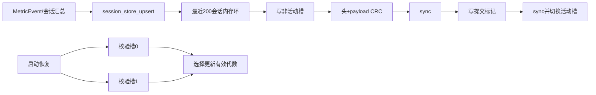

# 会话存储与恢复

本文说明 `esp32/firmware/components/session_store` 的版本化持久化格式、CRC32、双槽掉电恢复、最近 200 会话轮转及可选原始 IMU 日志。实现为纯 C；LittleFS、TF 卡、主机内存只需注入统一后端。

> 当前没有实物板。主机内存后端已验证软件恢复逻辑；LittleFS/TF 的挂载、写入原子性、掉电时序和介质寿命仍需烧录后验证。

## 1. 目标与非目标

目标：

- 保存最近 200 个会话摘要；
- 同一 `session_seq` 的重复/过期 `event_seq` 幂等；
- 更新中断电时保留上一代有效摘要；
- 新槽损坏时自动回退旧槽；
- C 结构体填充、CPU 端序变化不影响文件；
- 可选记录原始六轴 IMU，默认关闭；
- 原始日志尾块被截断时能通过 CRC 识别；
- 不在领域组件内调用 LittleFS、FatFS、SDMMC 或动态内存。

非目标：

- 不负责 RTC 校时；
- 不负责把原始日志上传 PC；
- 不在每个 `MetricEvent` 后保存完整原始 IMU；
- 不把内存后端的结果冒充真实 flash/TF 掉电测试；
- 不对日志加密；若产品需要隐私保护，应在后端层增加密钥和版本。

## 2. 总体结构



摘要和原始 IMU 使用不同后端实例：

- 摘要：建议 LittleFS 固定文件或两个固定区域；
- 原始 IMU：建议 TF/FatFS 顺序文件；
- 主机测试：字节数组 memory backend。

## 3. 后端注入合同

`session_store_backend_t` 包含：

| 字段 | 语义 |
|---|---|
| `context` | 后端私有对象，生命周期覆盖 store/log |
| `capacity` | 可访问总字节数 |
| `read` | 随机读取完整区间 |
| `write` | 随机覆盖完整区间 |
| `erase` | 把区间恢复为空白状态 |
| `sync` | 强制此前写入进入介质持久层 |

每个回调返回：

- `SESSION_BACKEND_OK`：完整成功；
- `SESSION_BACKEND_IO_ERROR`：介质/文件错误；
- `SESSION_BACKEND_OUT_OF_RANGE`：偏移或长度越界。

重要约束：

1. `write` 成功必须表示全部 `length` 字节已接受；部分写必须返回错误；
2. `sync` 不能用空函数假装持久化，LittleFS/FatFS 后端应调用对应 flush/fsync；
3. `erase` 摘要槽时必须清除槽尾提交标记；
4. 所有 offset/length 先检查：

$$
offset\le capacity
$$

$$
length\le capacity-offset
$$

采用减法而不是直接判断 `offset+length`，避免无符号加法溢出。

## 4. 字节序和编码原则

所有多字节整数固定小端：

$$
b_i=(value>>(8i))\ \&\ 0xFF
$$

其中 $i=0$ 是最低地址字节。

实现不把 `session_summary_t` 直接 `memcpy` 到介质。原因：

- 不同编译器可能插入不同填充；
- 枚举和 `bool` 大小可能不同；
- CPU 端序可能不同；
- 结构以后增加字段会破坏旧文件。

每个线性格式保存版本和固定长度。兼容修改必须遵循：

- 新增可选字段：递增版本，保留旧解码器或提供迁移；
- 改变字段单位/语义：视为不兼容版本；
- 只改内存结构顺序：线性偏移不变时可保持版本。

## 5. CRC32

摘要和原始日志均使用 IEEE CRC32：

- 反射多项式：`0xEDB88320`；
- 初值：`0xFFFFFFFF`；
- 最终异或：`0xFFFFFFFF`；
- 输入按介质字节顺序处理。

逐位递推：

$$
c'=c\oplus b
$$

对每个输入字节继续 8 次：

$$
c_{next}=\begin{cases}
(c>>1)\oplus 0xEDB88320,&c\ \&\ 1=1\\
c>>1,&c\ \&\ 1=0
\end{cases}
$$

标准检查向量：

```text
CRC32("123456789") = 0xCBF43926
```

CRC 用途是检测撕裂写入和随机损坏，不是密码学签名，不能防恶意篡改。

## 6. 会话摘要 64 字节布局

每条摘要固定 64 字节：

| 偏移 | 长度 | 字段 | 单位/说明 |
|---:|---:|---|---|
| 0 | 2 | `record_version` | 当前 1 |
| 2 | 2 | `record_size` | 固定 64 |
| 4 | 4 | `session_seq` | 会话主键 |
| 8 | 4 | `last_event_seq` | 幂等水位 |
| 12 | 1 | `action_id` | 0..10 |
| 13 | 1 | `metric_kind` | 0次数/1步数/2毫秒 |
| 14 | 2 | `flags` | 上层按位定义 |
| 16 | 8 | `start_unix_ms` | UTC ms；0 表示未校时 |
| 24 | 8 | `duration_ms` | 会话持续时间 |
| 32 | 8 | `metric_total` | 次数、步数或 ms |
| 40 | 8 | `gross_microkcal` | 毛热量 $10^{-6}$ kcal |
| 48 | 8 | `active_microkcal` | 活动热量 $10^{-6}$ kcal |
| 56 | 2 | `average_stability_q15` | 0..32767 |
| 58 | 2 | `minimum_stability_q15` | 0..32767 |
| 60 | 4 | `event_count` | 已吸收事件数量 |

摘要 payload 不为每条再保存 CRC；整个快照 payload 有一个 CRC。这样固定 200 条时减少 800 字节，并且任一记录损坏都会使整个新槽失效、回退上一槽。

## 7. 双槽快照布局

单槽布局：

```text
offset 0                         32字节快照头
offset 32                        0..200条×64字节摘要
offset 32+200×64                 未使用/擦除区
slot末尾-4                       4字节提交标记
```

固定大小：

$$
S_{slot}=32+200\times64+4=12836\ \mathrm{bytes}
$$

双槽最小后端：

$$
S_{backend}=2\times12836=25672\ \mathrm{bytes}
$$

### 7.1 32 字节头

| 偏移 | 长度 | 字段 |
|---:|---:|---|
| 0 | 4 | magic=`SSV1` |
| 4 | 2 | snapshot_version=1 |
| 6 | 2 | header_size=32 |
| 8 | 4 | generation |
| 12 | 2 | record_count |
| 14 | 2 | reserved=0 |
| 16 | 4 | payload_length=`count×64` |
| 20 | 4 | payload_crc32 |
| 24 | 4 | header_crc32 |
| 28 | 4 | reserved=0 |

头 CRC 计算时把 offset 24..27 置 0，再对完整 32 字节计算。

### 7.2 提交标记

槽最后 4 字节固定小端：

```text
0xC01117ED
```

只有头、payload 和第一次同步全部成功后才写标记。没有标记的槽永远不参与恢复。

## 8. 掉电安全提交顺序

设槽 A 是当前活动槽，槽 B 是非活动槽：

1. 在 RAM 环形索引中应用候选更新；
2. 擦除槽 B，首先清掉旧提交标记；
3. 计算 payload CRC 和头 CRC；
4. 写槽 B 的头；
5. 按从旧到新顺序写全部摘要；
6. 调用 `sync`；
7. 写槽 B 末尾提交标记；
8. 再次 `sync`；
9. 只有第 8 步成功，RAM 中才把 B 设为活动槽并增加代数。

失败影响：

| 断电/错误点 | 新槽 | 旧槽 | 恢复结果 |
|---|---|---|---|
| 擦除中 | 无提交标记 | 完整 | 旧槽 |
| 写头中 | 无提交标记 | 完整 | 旧槽 |
| 写 payload 中 | 无提交标记 | 完整 | 旧槽 |
| 第一次 sync 前后 | 无提交标记 | 完整 | 旧槽 |
| 标记部分写 | 标记错误 | 完整 | 旧槽 |
| 新槽完整且标记有效 | 完整 | 完整 | 代数更新槽 |
| 新槽后续随机损坏 | CRC错误 | 完整 | 旧槽 |

写入函数失败时，内存索引也回滚：

- 新增未满：恢复旧 `count` 并清除目标槽；
- 更新已有：写回旧摘要；
- 容量覆盖：恢复旧摘要和旧 `head`。

不需要复制完整 12.8 KiB 索引到栈，回滚最多保存一条 64 字节摘要。

## 9. 启动恢复

每个槽独立验证：

1. 读取并验证提交标记；
2. 验证头 magic/version/length/header CRC；
3. 验证 `count≤200`；
4. 逐条验证记录 version/size/字段范围；
5. 流式重算 payload CRC；
6. 标记该槽有效。

槽选择：

- 只有一个有效：选择它；
- 两个有效：选择更新 generation；
- 两个都为空/无有效提交：建立空索引。

generation 允许 `uint32_t` 回绕，使用模序比较：

$$
newer(a,b)=((int32\_t)(a-b)>0)
$$

它假设两个同时有效槽的代数距离小于 $2^{31}$；双槽每次只相差约 1，满足条件。

恢复后的 RAM 环把介质中“从旧到新”记录放在下标 0..count-1，`head=0`。

## 10. 重复事件幂等

幂等主键：

```text
(session_seq, last_event_seq)
```

当内存索引已有相同 `session_seq`：

$$
event_{new}\le event_{stored}
$$

则返回成功但 `changed=false`：

- 不修改摘要；
- 不增加 generation；
- 不调用任何介质 `write`；
- BLE 重传或任务重试不会重复累计。

只有：

$$
event_{new}>event_{stored}
$$

才更新该会话摘要并提交新快照。

`event_seq` 必须来自 MetricEvent 唯一事实源；存储层不能用“次数相同”猜测重复，因为热量、时长和稳定度仍可能更新。

## 11. 最近 200 会话轮转

RAM 使用固定环：

- `head`：最旧会话物理位置；
- `count`：0..200；
- 新会话未满时写 `(head+count)%200`；
- 已满时覆盖 `head`，再令 `head=(head+1)%200`。

查询：

```text
newest_index=0   最新
newest_index=1   次新
newest_index=199 最旧（满容量时）
```

添加/查找复杂度：

| 操作 | 时间 | 额外空间 |
|---|---:|---:|
| 环形新增 | $O(1)$ | $O(1)$ |
| 按 session_seq 查找 | $O(200)$，常数上限 | $O(1)$ |
| 最近索引查询 | $O(1)$ | $O(1)$ |
| 完整快照提交 | $O(N)$，$N≤200$ | 约 64 B 临时记录 |
| 启动恢复 | $O(N)$ | 约 64 B 临时记录 |

完整提交每次重写最多约 12.8 KiB。若实机 LittleFS 磨损或时延不满足目标，后续可增加事件日志+周期快照版本；不能在不改版本/恢复测试的情况下直接改变格式。

## 12. 可选原始 IMU 块

原始日志默认：

```text
enabled=false
```

关闭时允许不提供后端，`append` 返回 `SESSION_STORE_STATUS_DISABLED`，不会写任何字节。

开启场景仅限开发诊断或用户明确允许。建议写 TF 卡，不写 LittleFS。

### 12.1 40 字节块头

| 偏移 | 长度 | 字段 | 说明 |
|---:|---:|---|---|
| 0 | 4 | magic=`IMU1` | 块识别 |
| 4 | 2 | version=1 | 格式版本 |
| 6 | 2 | header_size=40 | 固定头长 |
| 8 | 4 | block_seq | 块序号 |
| 12 | 2 | sample_count | 1..64 |
| 14 | 1 | channel_count | 固定 6 |
| 15 | 1 | sample_format | 1=float32 |
| 16 | 8 | start_monotonic_ms | 首点时间 |
| 24 | 4 | sample_period_us | 25 Hz 通常 40000 |
| 28 | 4 | payload_length | `count×6×4` |
| 32 | 4 | payload_crc32 | 负载 CRC |
| 36 | 4 | header_crc32 | 头 CRC |

头 CRC 计算时 offset 36..39 置 0。

### 12.2 payload

形状：

$$
[sample\_count,6]
$$

通道顺序：

```text
gx, gy, gz, ax, ay, az
```

单位：

- `gx/gy/gz`：deg/s；
- `ax/ay/az`：g。

每个值保存 IEEE754 float32 位模式，再显式按小端输出。单块最多：

$$
64\times6\times4=1536\ \mathrm{bytes}
$$

完整最大块：

$$
40+1536=1576\ \mathrm{bytes}
$$

### 12.3 尾块恢复

原始块不使用双槽。顺序扫描时：

1. 验证头 CRC；
2. 验证通道、格式、数量和长度；
3. 验证 payload 完整位于文件；
4. 验证 payload CRC；
5. 有效则按 `block_size` 前进；
6. 第一条损坏/截断尾块处停止。

写入中断只损失当前尾块，不影响此前已验证块。当前组件提供单块验证；文件扫描、截尾和新文件轮转由 TF 后端/存储任务实现。

## 13. 内存后端与故障注入

`session_memory_backend_t` 由调用方提供字节数组。能力：

- 随机读写；
- `erase` 填 0xFF；
- `write_budget`：只允许再写指定字节，随后返回 I/O 错误；
- 部分写真实留下，模拟撕裂槽；
- `fail_sync`：模拟 flush/fsync 失败；
- `successful_write_calls`：确认重复事件没有写盘。

它不模拟：

- flash 页/扇区限制；
- NAND/TF 控制器缓存；
- 磨损均衡；
- 真实电源下降曲线；
- 文件系统元数据损坏。

因此它是确定性软件验证工具，不替代实物断电测试。

## 14. 文件后端实现与 ESP-IDF 挂载

### 14.1 LittleFS 摘要后端

项目已实现 `session_file_backend_open()`，用于预分配固定 25672 字节文件，例如：

```text
/littlefs/session_slots.bin
```

后端映射如下：

- `read`：`fseek+fread`，必须完整长度；
- `write`：`fseek+fwrite`，必须完整长度；
- `erase`：向范围写 0xFF，或在保证两槽偏移不变前提下重建文件；
- `sync`：`fflush` 后调用平台可用的文件同步；
- 所有调用由单一 storage task 串行化。

首次创建时，整个文件填充为 `0xFF`；已有文件短于固定容量时，仅把扩展区域填充为 `0xFF`。每次 `sync` 先执行 `fflush`，再在 Windows 主机调用 `_commit`、ESP-IDF/newlib 调用 `fsync`。打开后的 `FILE*` 只由 `session_file_backend_t` 持有，调用 `session_file_backend_close()` 后接口立即失效，避免任务继续使用悬空文件句柄。

时间复杂度：读写为 $O(L)$，其中 $L$ 是本次字节数；擦除为 $O(L)$，以固定小块写入 `0xFF`。文件上下文只保存路径、句柄和容量，额外 RAM 为 $O(1)$。该层不负责挂载 LittleFS；ESP-IDF 主程序必须先把 16 MiB `storage` 分区挂载到 `/littlefs`，再打开摘要文件。

不要在 UI/BLE 回调内直接执行完整快照写入，避免阻塞界面或 NimBLE。

### 14.2 TF 原始日志后端

建议每次训练会话一个文件：

```text
/sdcard/raw/YYYYMMDD/session_<seq>.imu
```

后台任务批量写入，屏幕关闭和低电量策略可禁用原始日志。介质拔出/写满时：

- 停止 raw append；
- 会话摘要继续写 LittleFS；
- 向 UI/BLE 发布存储质量标志；
- 不让 TF 错误中断动作计数。

## 15. 资源预算

`session_summary_t` 当前字段合计约 64 字节，ABI 可能有少量填充。200 项内存环约：

$$
200\times64\approx12.5\ \mathrm{KiB}
$$

另有 store 元数据和后端函数表。提交和恢复只使用约 64 字节记录缓冲、32 字节头和少量局部变量。

摘要后端 flash 约 25.1 KiB。原始日志容量由 TF 文件后端决定，不分配固定 RAM 大缓冲。

## 16. 主机测试

运行：

```powershell
& esp32\host_tests\session_store\run_tests.ps1
```

编译：

```text
C11 + -Wall -Wextra -Wpedantic -Werror -fanalyzer
```

覆盖：

- CRC32 标准向量；
- 空白介质初始化；
- 摘要完整提交和重启恢复；
- 重复/过期 `event_seq` 不改变代数、不调用 write；
- 新 `event_seq` 更新；
- 写完头后只写 8 字节记录即断电；
- 重启忽略无提交标记槽；
- 最新槽 payload 损坏后回退旧槽；
- 205 个会话轮转为最近 200 个；
- 轮转顺序跨重启保持；
- 原始日志默认关闭；
- 2 点六轴块长度和元数据；
- payload 单字节损坏被 CRC 拒绝。
- 固定容量文件首次创建与 `0xFF` 预分配；
- 关闭后重开并恢复最新双槽摘要；
- 重复 `event_seq` 不产生文件写入；
- 文件后端格式化后恢复空索引；
- 越界读写、过长路径和无效文件合同。

文件后端独立测试：

```powershell
& esp32\host_tests\session_store\run_file_backend_tests.ps1
```

当前主机结果为 18 项断言通过。该结果证明文件读写与恢复逻辑，不等于真实 LittleFS 掉电测试通过。

## 17. 实物验收清单

烧录后必须补做：

1. LittleFS 文件首次创建、已有旧文件长度异常和挂载失败；
2. 在头、payload、第一次 sync、提交标记、第二次 sync 各阶段随机断电；
3. 每个断电点重启 100 次，确认始终选择有效更新槽或旧槽；
4. 连续保存超过 200 会话，核对 UI/PC 历史顺序；
5. 重复 BLE/任务事件不增加 generation；
6. TF 拔出、写满、只读、损坏和重新插入；
7. 原始日志关闭时确认 TF 无写流量；
8. 开启原始日志连续一小时，检查块序号、CRC 和掉帧；
9. 统计一次快照写入耗时和 storage task 栈高水位；
10. 评估 LittleFS 擦写频率，必要时再设计版本化增量日志。

没有上述实物结果前，只能声明“软件恢复算法和内存故障模拟通过”，不能声明“真实断电绝不丢数据”。
