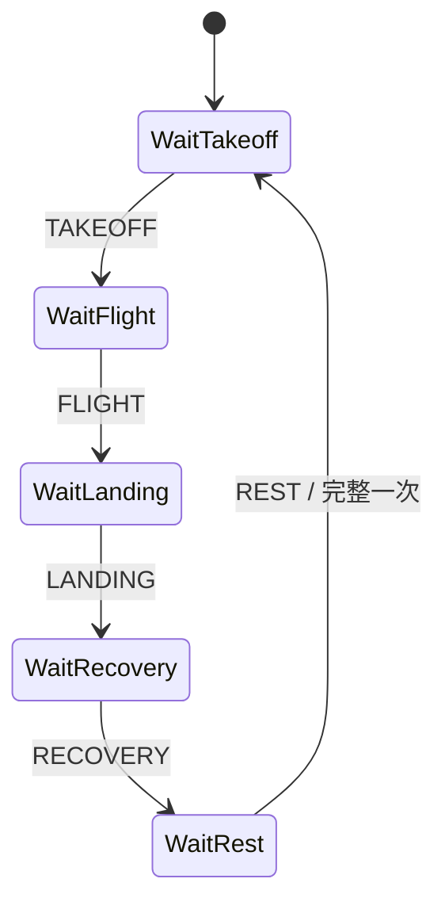

# 动作相位与步峰检测

## 1. 目的

双 M0 分类器回答“当前动作是什么”，但一次动作计数还需判断“动作完成到哪个阶段”。本组件把严格 25 Hz 六轴点转换为：

- `good_morning/lunge/squat/wave`：`PRIMARY → SECONDARY → REST`；
- 四个跳跃类：`TAKEOFF → FLIGHT → LANDING → RECOVERY → REST`；
- `walk/trot`：局部冲击步峰；
- `sit`：只输出稳定状态，不生成重复或步峰。

输出直接送入 `fitness_core`。分类器、相位检测器、完整周期计数器三者职责分开，避免“类别连续出现一次就加一”的重复计数错误。

## 2. 输入、输出与单位

输入：

$$
\mathbf{x}_t=[g_x,g_y,g_z,a_x,a_y,a_z]
$$

- $g_x,g_y,g_z$：角速度，单位 $\mathrm{deg/s}$；
- $a_x,a_y,a_z$：加速度，单位 $g$；
- 采样率 25 Hz，正常相邻时间 40 ms；
- 通道顺序与 Python、297 维特征和双 M0 完全一致。

诊断模长：

$$
G_t=\sqrt{g_x^2+g_y^2+g_z^2},\qquad
A_t=\sqrt{a_x^2+a_y^2+a_z^2}
$$

任一轴为 NaN 或无穷时拒绝整点。时间戳必须严格递增；间隔超过 120 ms 时清空不完整周期，防止把丢样前后的半次动作拼成一次。

## 3. 普通往返动作

### 3.1 学习主旋转方向

当 $G_t\ge45\,\mathrm{deg/s}$ 时，用首次明显手腕运动学习单位方向：

$$
\mathbf{u}=\frac{[g_x,g_y,g_z]}{G_t}
$$

该方向随佩戴坐标系确定，不要求手表固定朝向。当前角速度在主方向上的有符号投影为：

$$
p_t=[g_x,g_y,g_z]\cdot\mathbf{u}
$$

- 首次显著运动定义为 `PRIMARY`；
- $p_t\le-32\,\mathrm{deg/s}$ 定义为反向 `SECONDARY`；
- $|A_t-1|\le0.24g$ 且 $G_t\le22\,\mathrm{deg/s}$ 定义为 `REST`。

完成 `PRIMARY → SECONDARY → REST` 后，下次周期重新学习 $\mathbf{u}$，适应表带缓慢转动。每个离散事件保持两个采样点，满足下游“连续两点确认”抗抖合同。

### 3.2 物理意义

深蹲、弓步和早安式中，手腕通常随身体下行并在起身时反向；挥手则天然往返。只看角速度模长无法区分去程和回程，有符号投影能提供周期方向。

## 4. 跳跃动作

使用加速度模长近似手腕受到的支持力：

1. 起跳：$A_t\ge1.18g$，并且 $G_t\ge28\,\mathrm{deg/s}$ 或 $A_t\ge1.30g$；
2. 腾空：$A_t\le0.78g$；
3. 落地：腾空后 $A_t\ge1.30g$；
4. 恢复：重新满足稳定条件；
5. 基线：恢复事件后继续稳定，输出 `REST`。

完整顺序为：

缺少腾空、落地或恢复任一阶段均不计数。阈值来自物理含义，仍需用户烧录后用真实原配表带、不同松紧和动作强度校准；软件测试只证明状态顺序与边界正确。

## 5. walk/trot 步峰

用慢指数基线去除静态重力偏移：

$$
b_t=b_{t-1}+0.02(A_t-b_{t-1})
$$

动态分量：

$$
d_t=A_t-b_t
$$

中间点满足以下条件时输出一个候选步峰：

$$
d_{t-1}>d_{t-2},\qquad
d_{t-1}\ge d_t,\qquad
d_{t-1}\ge0.16g
$$

峰值需要右侧点确认，因此有一个采样点，即约 40 ms 的确定性延迟。候选峰还要经过 `fitness_step_counter_accept` 的 walk/trot 最短步间隔检查，防止同一脚步冲击重复计数。

## 6. 数值稳定与边界

- 模长小于 45 deg/s 时不做方向归一化，避免除零；
- 六轴非有限值整点拒绝，不更新时间、基线或方向；
- 时间重复/倒退整点拒绝；
- 时间间断超过 120 ms 时重置相位检测器和下游不完整周期；
- 动作类别变化、暂停、停止、设备重连和新用户开始时必须重置；
- 马达振动区间先由 IMU pipeline 与 haptic guard 标记/替代，相位检测器不直接读取污染点。

## 7. 复杂度与 ESP32 资源

- 每点只执行固定次数加、乘、比较和两个三维平方根；时间复杂度 $O(1)$；
- 状态不随会话时长增长；空间复杂度 $O(1)$，约百字节；
- 不分配堆内存；
- 25 Hz 下计算量远低于 297 维特征和双 M0 推理。

## 8. 测试与硬件边界

主机测试覆盖：

- 合成深蹲完整往返只计一次；
- 合成跳跃完整五阶段只计一次；
- walk 三点峰只输出一次；
- 平坦信号不误报；
- NaN、重复时间和长间断安全处理。

主机合成测试不能证明真实人体计数准确率。烧录后必须逐动作采集慢速、正常、快速、半程、抖腕和表带松紧数据，建立人工视频真值，再校准阈值并报告逐动作计数 MAE、漏计率和多计率。
