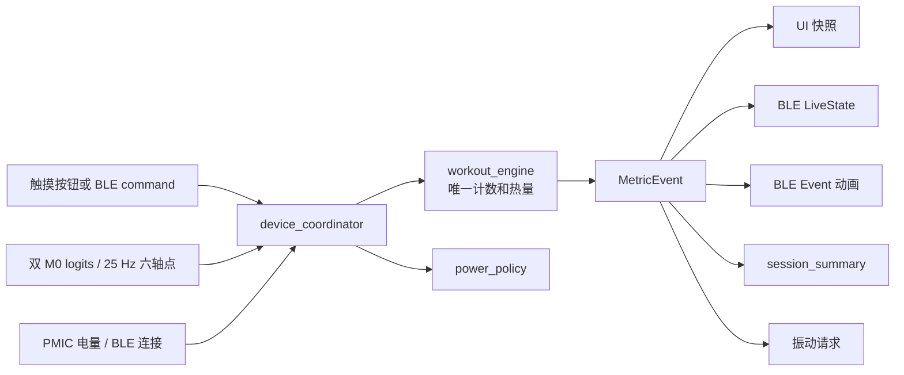
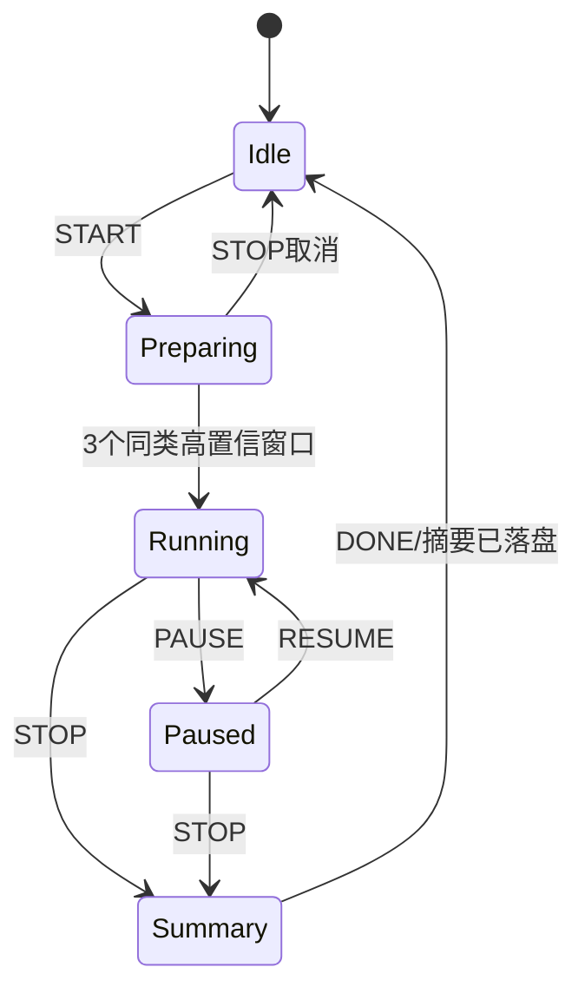

# 应用协调器与事件事实链

## 1. 目的

`device_coordinator` 是训练手柄的纯 C 产品编排层。它不读 GPIO、不调 LVGL、不发 BLE、不直接写文件，只把以下已验证组件组合成单一状态事务：

- `workout_engine`：动作锁类、25 Hz 样本、次数、步数、热量、`MetricEvent` 和振动 FIFO；
- `ui_state_machine`：准备、运行、暂停、总结和关机页；
- `power_manager`：厂家原配 400 mAh 电池的 15%/8%/5% 门槛和外设策略；
- `session_store`：双槽 CRC 会话摘要和 `session_seq + last_event_seq` 幂等更新；
- `ble_service_core`：`LiveStateV1`、控制命令号和稳定线上字段。

该层解决的核心问题是：一次有效深蹲不能被 UI、BLE 和存储各自再加一次；同一个 `MetricEvent` 必须成为全部展示和持久化的唯一事实。

---

## 2. 数据流



协调器输出 `device_effects_t`。该结构是按值拷贝，可放入 FreeRTOS 队列，不含堆内存、回调指针或短命对象。

---

## 3. 唯一指标事实

### 3.1 不重复计算

`device_coordinator_push_sample()` 把一个六轴点交给 `workout_engine_push_sample()`。只有训练引擎能产生：

```c
fitness_metric_event_t
```

协调器不执行以下错误逻辑：

```text
UI_count += delta
BLE_count += delta
stored_count += delta
```

它只复制领域已计算的 `total_value`：

```text
MetricEvent.total_value
        |
        +-> UI count
        +-> LiveState metric_value
        +-> session_summary metric_total
```

因此 BLE Event 重发、UI 队列延迟或存储重试都不会增加次数。

### 3.2 单位投影

`MetricEvent` 的内部单位：

| 指标 | `total_value` 单位 | UI/BLE 单位 | 摘要单位 |
|---|---|---|---|
| 重复动作 | 次 | 次 | 次 |
| `walk/trot` | 步 | 步 | 步 |
| `sit` | ms | 完整秒 | ms |

`sit` 的 UI/BLE 转换为：

$$
T_{s}=\left\lfloor\frac{T_{ms}}{1000}\right\rfloor
$$

这是单位投影，不是重新计时。持久化仍保留毫秒，避免丢失精度。

热量也仅从 `workout_engine` 权威值做单位转换：

$$
E_{mcal}=\left\lfloor\frac{E_{\mu kcal}}{1000}\right\rfloor
$$

其中 $E_{\mu kcal}$ 是 $10^{-6}$ kcal，$E_{mcal}$ 是 $10^{-3}$ kcal。

### 3.3 事件同值规则

对次数和步数事件，同一次 effect 必须满足：

$$
V_{event}=V_{ui}=V_{live}=V_{summary}
$$

对 `sit`，`event` 和 `summary` 同为 ms，UI/LiveState 按上述公式转成秒。

---

## 4. 事务副本与错误回滚

公开函数在修改前先验证指针、枚举、单调时间、logits 和六轴有限性。随后复制一份协调器状态：

$$
C'=C
$$

全部子状态机只修改 $C'$。如果 workout、UI、power 或 effect 生成任一失败，函数直接返回，$C$ 不变。全部成功后才执行：

$$
C\leftarrow C'
$$

主机布局中 `device_coordinator_t` 为 672 B，因此一次事务副本为 $O(672)$ 字节，可视为常数时间。ESP-IDF ABI 可能因对齐产生少量差异，实机应在构建日志中输出 `sizeof`。

错误输入不允许产生任何 effect，`flags` 固定为 0。测试使用整个结构 `memcmp` 检查 NaN logits、NaN 样本和时间倒退后状态逐字节不变。

---

## 5. 控制状态链

### 5.1 正常会话



`START` 使用已持久化的 `next_session_seq`，成功后递增并跳过 0。`workout_engine` 使用三个高置信窗口锁定一种动作，v1 一个会话不自动切换动作。

### 5.2 UI 和 BLE 映射

| 统一命令 | UI 事件 | BLE command |
|---|---|---:|
| START | `UI_EVENT_START_REQUESTED` | 1 |
| PAUSE | `UI_EVENT_PAUSE_REQUESTED` | 2 |
| RESUME | `UI_EVENT_RESUME_REQUESTED` | 3 |
| STOP | `UI_EVENT_STOP_REQUESTED` | 4 |
| RESET | 无直接 UI 按钮 | 5 |
| DONE | `UI_EVENT_SUMMARY_SAVED` | 存储内部确认 |
| SNAPSHOT | 内部或诊断 | 10 |
| SHUTDOWN | `UI_EVENT_POWER_LONG_PRESS` | 本地长按 |

BLE command 6、7、8、9、11 属于时间、用户资料、目标、偏好和原始流组件，不被本协调器错误映射为会话命令。

### 5.3 RESET 和 DONE

- `RESET` 只在 Paused 允许，丢弃当前会话，不生成摘要写入；
- `DONE` 只在 Summary 允许，表示存储任务已成功执行 `session_store_upsert()`；
- 因此主程序不得在拿到 `SUMMARY_WRITE` effect 后立即调用 `DONE`，必须先等待介质 `sync` 成功。

---

## 6. 暂停时间与热量

协调器只维护用于 UI/BLE/摘要的活动时长，热量仍由 `fitness_core` 维护。

对 PREPARING/RUNNING 的新时刻 $t_k$：

$$
T_{active,k}=T_{active,k-1}+\max(0,t_k-t_{k-1})
$$

对 PAUSED/IDLE/SUMMARY：

$$
T_{active,k}=T_{active,k-1}
$$

`RESUME` 把时间基准直接移到当前 $t_k$，不使用暂停两端时间差。`workout_engine_resume()` 同样调用 `fitness_session_rebase_time()`，所以 UI 时长和热量都不包含暂停区间。

主机测试将 9 s 暂停与 0 s 暂停后同样处理 40 ms 样本，两者毛热量和活动时长逐整数相同。

---

## 7. 振动事实链

振动不在协调器里根据数值重新判断。`fitness_core` 根据同一 `MetricEvent` 入队，协调器只按顺序取出。

| 事件 | 振动 |
|---|---|
| 动作锁定/会话开始 | 2 次×20 ms |
| 每次有效 REP | 1 次×30 ms |
| `walk/trot` 每满 10 步 | 1 次×30 ms |
| `sit` 整秒事件 | 无 |
| 暂停或正常结束 | 1 次×40 ms |
| 15% 首次低电提醒 | 2 次×40 ms |
| 5% 临界关机 | 取消振动，优先落盘和断电 |

一个 effect 最多交付 4 个振动请求。马达任务必须非阻塞执行，并把实际通电区间标记给 IMU 抗干扰链。

---

## 8. 400 mAh 电池门槛

本项目已锁定厂家原配 400 mAh 电池。不使用未经电芯曲线校准的固定电压门槛，只使用 PMIC 百分比。

| SOC | 非充电策略 |
|---:|---|
| `>15%` | 正常 |
| `<=15%` | UI/BLE 警告，每次下降区间仅一次低电振动 |
| `<=8%` | 保留当前会话，禁止新 START |
| `<=5%` | 停止活动会话，生成临界摘要，请求落盘后 PMIC 断电 |

充电时，8% 启动限制和 5% 强制关机解除，但 UI/BLE 仍显示真实 SOC。

5% 活动会话的 effect 必须同时包含：

```text
DEVICE_EFFECT_SUMMARY_WRITE
DEVICE_EFFECT_POWER_POLICY
DEVICE_EFFECT_SHUTDOWN_AFTER_PERSIST
```

正确执行顺序：

1. 将 `summary` 交给存储任务；
2. 等待 `session_store_upsert()` 和后端 `sync()` 成功；
3. 应用 `power_policy`；
4. 最后调用已验证的 AXP2101 软关机。

不得先断电再尝试保存。

---

## 9. 会话摘要与幂等

### 9.1 主键和修订键

```text
session_seq    会话主键
last_event_seq 该会话已吸收的最大 MetricEvent 序号
```

`session_store_upsert()` 对相同 `session_seq` 且不更大的 `last_event_seq` 返回 `changed=false`，不写介质。因此 BLE 重试、FreeRTOS 队列重放和断电前重新提交都是幂等的。

### 9.2 指标字段

- `metric_total` 直接复制 `fitness_session` 权威次数、步数或 sit 毫秒；
- `gross_microkcal` 和 `active_microkcal` 直接复制，不重新积分；
- `duration_ms` 使用排除暂停的协调器活动时长；
- `event_count` 是已吸收事件数；
- 稳定度平均为事件等权整数平均：

$$
\bar q=\left\lfloor\frac{\sum_{i=1}^{N}q_i}{N}\right\rfloor
$$

其中 $q_i\in[0,32767]$ 是第 $i$ 个 `MetricEvent` 的 Q15 稳定度。空会话平均和最低值都为 0。

### 9.3 摘要标志

- `COMPLETED`：正常 STOP；
- `INTERRUPTED`：长按关机或系统中断；
- `CRITICAL_BATTERY`：5% 非充电临界关机。

---

## 10. BLE 状态投影

`LiveStateV1` 的状态映射：

| 值 | 状态 |
|---:|---|
| 0 | Booting |
| 1 | Idle |
| 2 | Preparing |
| 3 | Running |
| 4 | Paused |
| 5 | Summary |
| 6 | Error |
| 7 | Shutdown |

修订号 `state_revision` 在每次对外权威快照时增加。PC 显示 `LiveState.metric_value`，不根据 Event 递增。Event 只触发局部动作动画和声效提示。

`power_flags` 位：

| bit | 含义 |
|---:|---|
| 0 | 充电 |
| 1 | `SOC<=15%` |
| 2 | `SOC<=8%` |
| 3 | `SOC<=5%` |

---

## 11. 时间和空间复杂度

| 调用 | 时间复杂度 | 主要空间 |
|---|---|---|
| UI/BLE 控制 | $O(1)$ | 672 B 事务副本 |
| 11 维推理结果 | $O(11)$ | 672 B 事务副本 |
| 25 Hz 六轴点 | $O(6)+$ 下游相位复杂度 | 672 B 事务副本 |
| 摘要构造 | $O(1)$ | 固定 64 B 线性数据 |
| 振动排空 | $O(4)$ 上限 | 最多 4 个请求 |

主机 x64 实测：

```text
sizeof(device_coordinator_t) = 672 B
sizeof(device_effects_t)     = 288 B
```

调用栈上同时存在候选协调器和 effect，建议应用协调任务至少配置 8 KiB 栈，并在 ESP32-S3 上用 `uxTaskGetStackHighWaterMark()` 实测。不允许在 ISR 内调用协调器；ISR 只投递按值采样到单消费任务。

---

## 12. 主程序集成规则

1. 板级自检通过后调用 `device_coordinator_init()`；
2. 首次 START 前必须至少成功读取一次 PMIC SOC，未知电量会安全拒绝启动；
3. UI 任务和 BLE 命令回调都先映射为 `device_control_t`，再串行交给唯一协调任务；
4. IMU 管线将 25 Hz 按值样本交给 `device_coordinator_push_sample()`；
5. 每个 effect 按 flags 分发，未置位的字段不读取；
6. `BLE_EVENT` 不改 PC 指标，`BLE_LIVE_STATE` 才是权威值；
7. `SUMMARY_WRITE` 成功后才发 `DONE`；
8. `SHUTDOWN_AFTER_PERSIST` 必须等摘要同步完成后执行。

---

## 13. 主机测试

执行：

```powershell
.\esp32\host_tests\device_coordinator\run_tests.ps1
```

当前覆盖：

- 完整 `START -> 锁类 -> REP -> STOP -> DONE` 会话；
- 15% 低电只提醒一次；
- 8% 非充电禁止 START，充电时放行；
- 5% 生成临界摘要并请求落盘后关机；
- 暂停时间不计入热量或活动时长；
- 每 REP 一次 30 ms、每 10 步一次 30 ms、sit 无振动；
- `MetricEvent.total_value` 到 UI、LiveState 和摘要同值；
- 相同摘要重试不产生二次介质写入；
- UI/BLE command 1..5/10 映射；
- NaN logits、NaN 样本和倒退时间无状态突变。

该测试是纯主机软件验证。它不代表 QMI8658、AXP2101、AMOLED、马达或 BLE 射频已在真实开发板上通过。实机验收仍需要用视频真值校准次数、检查振动污染隔离、测量功耗与任务栈余量。
