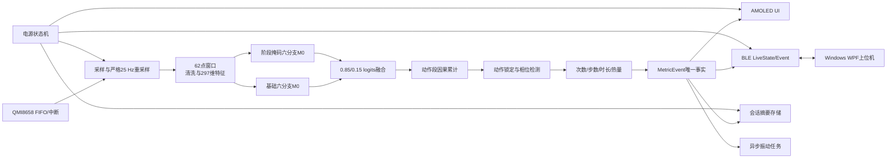
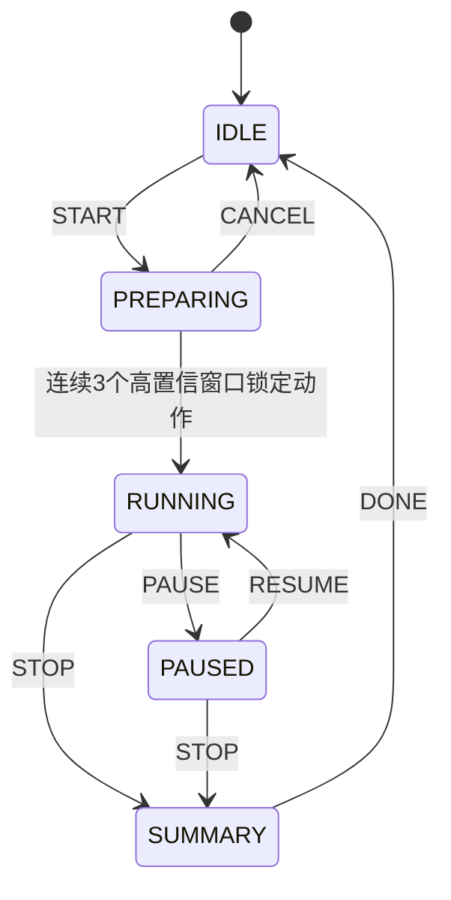
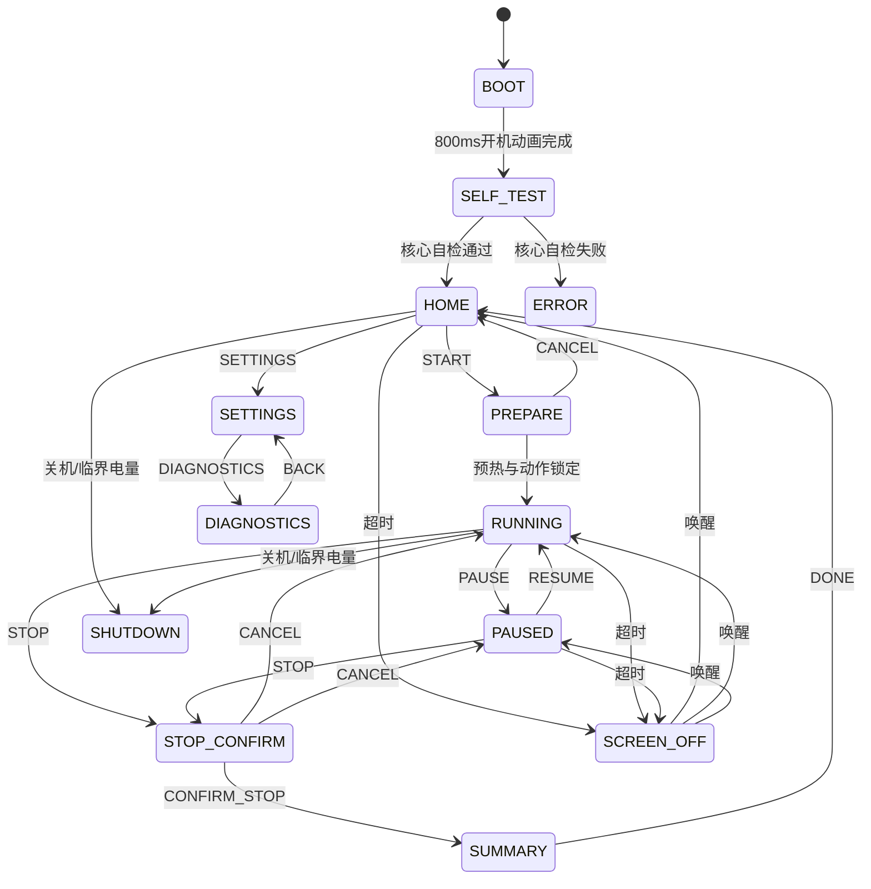

# 手柄与上位机软件详细设计

> 适用工程：手腕六轴 IMU 健身动作识别手柄、ESP32-S3 固件及 Windows 上位机。
> 目标硬件：Waveshare ESP32-S3-Touch-AMOLED-2.06，使用厂家原配 400 mAh 电池。
> 文档性质：依据当前仓库已经实现并完成整机构建的组件给出可落地软件总设计，同时明确尚未完成的真板联调和硬件验收项。

## 1. 文档目的与状态标记

本系统包含两端：

1. **手柄端**：采集手腕六轴 IMU，识别健身动作，计次数或步数，估算热量，通过 AMOLED、振动马达和 BLE 向用户反馈。
2. **Windows 上位机**：连接手柄，实时显示动作动画、次数、步数、时长、热量、电量和数据质量，保存训练历史并提供诊断信息。

本文使用三种状态标记，避免把主机测试结果误写成真机结论：

| 标记 | 含义 |
|---|---|
| **已实现并完成软件验证** | 组件代码已经存在，且对应纯 C、Python 或 .NET 主机测试已经通过 |
| **已实现并完成整机构建** | 生产 `app_main`、ESP-IDF 组件和依赖已经共同编译、链接并生成 ESP32-S3 镜像 |
| **待真板验证** | 软件路径和真实后端已存在，但尚未在厂家原配开发板上烧录、测量或长时间运行 |

当前最重要边界：

- 297 维特征、双 M0 推理、动作相位、计数、卡路里、振动请求、UI 状态机、电源状态机、NimBLE 服务、会话传输、LittleFS 双槽存储及 Windows 六页软件均已有实现和主机测试。
- `esp32/firmware/main/main.c` 已是生产多任务入口：初始化 NVS、板级运行时、QMI8658、AXP2101、PCF85063、LittleFS、UI、BLE、存储、振动和电源管理，并用固定队列串联应用协调器与推理流水线。
- ESP-IDF 5.5.4 整机构建已通过；`imu_fitness_handheld.bin` 为 `0x13def0`，最小 4 MiB 应用分区剩 `0x2c2110`，余量约 69%。
- 尚未完成的是开发板烧录、真屏/真触摸、QMI/PMIC/马达联调、BLE 配对/MTU/弱信号、LittleFS/TF 真掉电、功耗和长时间稳定性测量。
- 本文给出的电流、续航、时延和栈余量是**验收预算**，不是已经测得的硬件结果。

---

## 2. 产品目标与设计原则

### 2.1 用户目标

用户拿起手柄后，应能完成以下闭环：

1. 长按原配电源键开机。
2. 观看简短开机动画和自检结果。
3. 点击大号“开始”按钮。
4. 完成 3、2、1 准备倒计时和 IMU 预热。
5. 连续完成同一种健身动作。
6. 手柄自动显示动作名称、次数或步数、时长和热量。
7. 每确认一次重复动作，手柄振动一次；行走和小跑每 10 步振动一次。
8. Windows 上位机同步播放对应动作动画，并显示设备权威指标。
9. 暂停、继续或停止训练。
10. 查看总结，保存最近训练记录。
11. 长按关机；低电量时自动安全保存并关机。

### 2.2 核心原则

- **ESP32 是唯一权威源**：动作、次数、步数、时长和热量均由设备计算；PC 不重复推理、不自行补计数。
- **一次事件只产生一次副作用**：一个确认计数事件同时驱动 UI、BLE、存储和振动；任何重试不得重复累计。
- **采样优先于界面**：IMU 读取和推理优先级高于动画、日志、BLE 批量传输和存储。
- **不阻塞实时链**：马达、存储、BLE、LVGL 都通过队列或异步驱动，不在采样/推理任务中等待。
- **状态可恢复**：BLE 重连、应用重启和存储掉电恢复都以设备权威快照和版本号为准。
- **低功耗由状态机决定**：屏幕、IMU、BLE、CPU、触摸、TF 和音频不由页面代码随意开关。
- **先保证正确，再做炫酷效果**：动画短、黑底、局部更新，不牺牲采样稳定性和电池续航。

---

## 3. 板载资源分配

### 3.1 资源用途

| 板载资源 | 产品用途 | 默认策略 | 当前状态 |
|---|---|---|---|
| 410×502 AMOLED | 开机动画、训练主界面、总结、设置和诊断 | 黑底；训练亮度 35%；暂停 15%；待机关闭 | UI/LVGL renderer 已接入整机构建；真屏待验 |
| 电容触摸 | START、PAUSE、RESUME、STOP、SETTINGS 等操作 | 活动页连续扫描；待机只保留可行的唤醒监视 | 状态机和真实适配入口已接入；控制器版本和真触摸待验 |
| QMI8658 | 六轴手腕运动采集 | 训练活动模式；暂停/主页使用 WOM；深睡默认开启但严格门控 | ACTIVE/WOM/OFF、CTRL9 握手和 GPIO21 EXT1 已接入整机构建；真采样/误唤醒率待实机验收 |
| 振动马达，GPIO18 | 次数和状态触觉反馈 | 5 kHz LEDC、10 位 PWM；计次 30 ms/75% | 异步板级接口和算法请求已实现；力度待校准 |
| AXP2101 | 电量、充电状态、软关机和电源管理 | 15% 告警、8% 禁止新训练、5% 安全关机 | 驱动、battery/power任务和策略已接入；SOC精度和软关机待验 |
| PCF85063 RTC | 时间保持、会话 UTC 时间和轻睡唤醒候选 | 有效 RTC 时间写入摘要；无效时保存相对时长 | 驱动已接入整机构建；真RTC待验 |
| BLE | 与 Windows 上位机通信 | 单 PC 连接、安全配对、状态通知 | NimBLE、broker、LiveState/Event/Transfer和PC软件已实现；真机连接待验 |
| TF 卡 | 可选原始 IMU 日志和导出 | 默认不挂载；事务性短时启用 | LittleFS摘要主链已完成；真TF掉电/拔卡待验 |
| 扬声器/功放 GPIO46 | 可选短提示音 | v1 默认关闭，避免静态功耗 | 不作为核心验收项 |
| 麦克风 | 本产品 v1 不使用 | 始终关闭 | 明确不进入主链 |
| 原配 400 mAh 电池 | 整机供电 | 80% 可用容量做保守预算 | 容量已固定；实际曲线待测 |

### 3.2 板型版本风险

本工程本地锁定的 BSP 资料与厂家当前仓库可能对应不同物料代次：

- 一类配置为 SH8601 AMOLED 与 FT3168 触摸；
- 另一类配置为 CO5300 AMOLED 与 CST9220 触摸。

当前产品构建只公开厂家受管 BSP 已验证的 SH8601/FT5x06 兼容路径；未实现的 CO5300/CST9220 原生 Kconfig 选项已隐藏，旧兼容符号固定关闭。禁止在未知板上盲写另一控制器寄存器。启动自检读取编译时板型标识，并遵循：

1. 受支持的兼容路径配置有效：继续启动。
2. 旧配置请求未实现原生路径：在配置/编译阶段拒绝，不能生成看似可选但运行失败的镜像。
3. 面板初始化失败：记录串口错误，保持马达、IMU 和 BLE 在安全关闭状态；此时没有可用屏幕，不能显示 ERROR 页。
4. 面板和 LVGL 成功后，先显示开机/自检页，再初始化 QMI、PMIC、RTC、会话存储和业务域；这些后续关键项失败时进入可见中文 ERROR 页。

---

## 4. 系统总体架构



### 4.1 数据权威关系

`MetricEvent` 是一次新业务指标的唯一事实。事件字段至少包含：

- `session_seq`：会话序号；
- `event_seq`：会话内单调事件序号；
- `action_id`：0～10；
- `metric_kind`：次数、步数或持续时间；
- `metric_value`：累计值；
- `gross_microkcal`：毛热量；
- `active_microkcal`：扣除 1.0 MET 静息基线后的活动热量；
- `quality_flags`：采样、振动污染和推理质量位。

UI、BLE、存储和振动只能消费事件，不得各自推导“是否又完成了一次动作”。这样可以避免：

- UI 显示 10 次，而 PC 显示 11 次；
- BLE 重试导致重复计数；
- 振动先发生，后续算法又回滚次数；
- 停止后迟到的推理结果继续增加记录。

---

## 5. 产品状态机

系统同时存在训练、UI、电源和 BLE 四个状态机。它们互相关联，但不能合并成一个巨大枚举。

### 5.1 训练状态机



训练规则：

- `PREPARING` 和 `RUNNING` 共用同一 11 类动作段 logits 累计器，锁定动作时不清零证据。
- 同一候选动作连续出现 3 个窗口，且置信度不低于约 55%，才锁定动作。
- 一个会话只锁定一种动作。用户要切换动作，必须停止后开始新会话。
- `RUNNING` 中累计推断类别与锁定动作不一致时，冻结相位和计数/步数，不修改锁定类别；会话时间和热量仍继续累计。
- START、成功 RESUME、IMU RESET/GAP 或长时间断点会清除动作段证据和不完整相位；RESUME 还会清空 62 点窗口并重新积累连续输入，但保留已锁定动作、历史次数和热量。
- `PAUSED` 不推进相位、计数和热量；恢复时重设积分时间基准，暂停时间不计入热量。
- `STOP` 幂等；重复停止不产生第二份摘要或第二次振动。

### 5.2 UI 状态机



`BOOT`、`RUNNING`、`STOP_CONFIRM` 等英文只作为源码与协议稳定枚举；设备屏幕和 Windows 上位机面向用户统一显示中文。LVGL 产品构建使用项目自带的 16/20/28 px Noto Sans SC 子集，否则 UTF-8 中文会显示为缺字方框。无开发板时，可在 VS Code 工作树旁运行 `tools/watch_ui_preview/watch_ui_preview.py`，通过屏幕外开发导航直接检查 13 个真实页面；该导航不进入固件。

迟到的 `METRIC_UPDATED` 只允许在 `RUNNING` 或由训练页进入的 `SCREEN_OFF` 状态生效。主页、暂停、总结和错误页必须忽略该事件。

### 5.3 电源状态机

电源状态包括：

```text
BOOT
HOME
RUNNING
RUNNING_SCREEN_OFF
PAUSED
CONNECTED_STANDBY
ADVERTISING_STANDBY
DEEP_STANDBY
SAFE_SHUTDOWN
```

充电是状态机的正交属性，不单独建立“CHARGING”页面状态。充电时仍可处于主页、训练或暂停。

| 电源状态 | AMOLED | IMU | BLE | CPU/睡眠 |
|---|---|---|---|---|
| BOOT | 35% | WOM | 关闭 | 240 MHz 完成自检 |
| HOME | 35% | WOM | 快广播或活动连接 | DFS 40～240 MHz |
| RUNNING | 35% | 活动采集 | 快广播或活动连接 | 推理附近锁 240 MHz |
| RUNNING_SCREEN_OFF | 关闭 | 活动采集 | 慢广播或活动连接 | 保持实时链 |
| PAUSED | 15% | WOM | 快广播或活动连接 | DFS |
| CONNECTED_STANDBY | 关闭 | WOM | 已连接 modem-sleep | 自动 Light-sleep |
| ADVERTISING_STANDBY | 关闭 | WOM | 慢广播 | 自动 Light-sleep |
| DEEP_STANDBY | 关闭 | WOM，严格门控 | 关闭 | GPIO21 EXT1 有效才 Deep-sleep，失败拒绝睡眠 |
| SAFE_SHUTDOWN | 关闭 | 关闭 | 关闭 | 刷盘后请求 PMIC 断电 |

### 5.4 BLE 连接状态

设备端 BLE 和 Windows 端连接都应经过以下阶段：

```text
未连接
-> 广播/扫描
-> 系统安全配对
-> GATT服务发现
-> 订阅Control indication
-> 订阅LiveState/Event notification
-> 读取Manifest
-> 读取权威LiveState快照
-> 已连接
```

只有 Manifest、订阅和快照都成功后，上位机才显示“已连接”。仅发现广播名不等于连接完成。

---

## 6. FreeRTOS 任务与队列架构

> 本节记录当前生产 `app_main` 已创建的任务和队列，不再是规划值。栈容量来自源码配置；仍须在真板上用高水位测量确认余量。

### 6.1 已实现任务表

| 任务 | 实际优先级 | 核心 | 栈容量 | 触发方式 | 主要职责 |
|---|---:|---:|---:|---|---|
| `app_owner` | 9 | Core 1 | 20 KiB | 应用事件队列 | 唯一持有协调器、IMU pipeline 和 workout engine；执行 297 特征、双 M0、融合、计数、热量和权威事件分发 |
| `qmi_reader` | 10 | Core 0 | 4 KiB | 约 4 ms 轮询 | 读取 QMI8658 原始加速度/陀螺数据和时间，投递给 `app_owner`；不执行 UI、BLE 或存储 |
| `ui_render` | 5 | 未固定 | 8 KiB | latest-value UI 快照 | presenter、LVGL 加锁渲染、触摸命令和有限动画 |
| `ble_publish` | 6 | 未固定 | 6 KiB | BLE 发布队列和 NimBLE 回调 | 串行发布 LiveState/Event/Transfer，处理业务命令与连接状态 |
| `session_store` | 4 | 未固定 | 6 KiB | 存储队列 | LittleFS 双槽摘要提交、最近 200 条轮转和传输读取 |
| `haptic` | 7 | 未固定 | 3 KiB | 振动 FIFO | 输出 5 kHz、75%、30 ms 马达脉冲，并登记 IMU 污染时段 |
| `battery` | 3 | 未固定 | 3 KiB | 约 30 s 周期 | 读取 AXP2101 SOC/充电状态，向应用投递电池事件 |
| `power` | 4 | 未固定 | 4 KiB | latest-value 电源效果 | 应用 DFS、显示/传感器/BLE策略，执行保存后的睡眠或 PMIC 关机 |

说明：

- 数字越大表示优先级越高；上表是当前源码值，不是后续建议值。
- NimBLE 主机任务由协议栈管理；它的回调只复制数据并投递业务队列，不能直接做存储或 UI。
- LVGL 任务归属需服从厂家 BSP。无论在哪个核心，所有 `lv_...` 调用都必须持有显示锁。
- `imu_pipeline_t` 等较大状态应放静态区或组件对象，不放任务栈。

### 6.2 队列和所有权

| 队列/缓冲 | 容量 | 生产者 | 唯一消费者 | 满时策略 |
|---|---:|---|---|---|
| 应用事件队列 | 48 | QMI、UI、BLE、电池、存储确认 | `app_owner` | 有界发送；失败记录诊断，不允许在回调中无限等待 |
| UI 快照槽 | 1 个 latest-value | `app_owner` | `ui_render` | 覆盖旧快照，只呈现最新权威状态 |
| 电源效果槽 | 1 个 latest-value | `app_owner` | `power` | 覆盖旧策略；消费者总是应用最新电源状态 |
| BLE 发布队列 | 16 | `app_owner` | `ble_publish` | LiveState 可由后续权威快照恢复；关键状态返回错误并记录 |
| 存储队列 | 12 | `app_owner` | `session_store` | STOP/关机摘要优先；关机必须等待持久化确认 |
| 振动 FIFO | 16 | `app_owner` | `haptic` | 丢触觉反馈但不回滚权威计数，并累积丢失诊断 |

加速度和陀螺仪的时间排序、25 Hz 重采样窗口及推理中间状态位于 `app_owner` 独占的 `imu_pipeline_t` 内部，不再通过多个 FreeRTOS 队列拆分所有权。

共享规则：

1. 每个可变状态对象只有一个写任务。
2. 跨任务传递按值快照、事件 ID 或只读指针；指针必须具有覆盖消费周期的生命周期。
3. 不允许两个任务并发修改同一个 `imu_pipeline_t`、`workout_engine_t` 或 LVGL 对象。
4. 队列发送使用有界等待；采样链不因 UI、BLE 或 TF 阻塞。
5. ISR 只记时间、清中断并 `vTaskNotifyGiveFromISR`，不做浮点、日志、BLE 或文件操作。

### 6.3 事件分发顺序

确认一次有效事件后，建议按以下顺序：

```text
1. app_owner产生MetricEvent并更新协调器权威快照
2. app_owner覆盖UI最新快照
3. app_owner给BLE发布任务发送Event/LiveState
4. app_owner给存储任务发送幂等摘要更新
5. 若事件需要反馈，app_owner给haptic FIFO发送请求
```

UI、BLE、存储或振动单项失败不应回滚已经确认的计数。错误通过诊断位和日志暴露。

时间复杂度：每个事件分发为 $O(K)$，其中 $K$ 是固定消费者数量，当前 $K=4$，因此工程上等价于 $O(1)$。空间复杂度由固定队列容量决定，不随训练时长增长。

---

## 7. IMU、模型与实时推理链

### 7.1 输入合同

六轴顺序固定为：

```text
gx, gy, gz, ax, ay, az
```

- 角速度单位：deg/s；
- 加速度单位：g；
- 目标输出采样率：25 Hz；
- 采样周期：

$$
T_s=\frac{1}{25}=0.04\ \mathrm{s}=40000\ \mathrm{us}
$$

QMI8658 加速度和陀螺仪可使用不同原始 ODR。流水线分别做抗混叠低通和带时间戳的插值，再合成为严格 25 Hz 六轴点。每路内部时间队列容量为 32 点。

### 7.2 窗口与推理频率

窗口长度为 62 点：

$$
T_w=\frac{62}{25}=2.48\ \mathrm{s}
$$

步长为 12 点：

$$
T_{step}=\frac{12}{25}=0.48\ \mathrm{s}
$$

窗口形状为 `[62,6]`，约每 0.48 秒产生一次推理。睡眠、长间断、队列溢出或时钟倒退后，必须清空滤波器和窗口，重新积累完整连续窗口。

### 7.3 模型路径

每窗提取 297 项手工特征，然后运行两个六分支 M0：

```text
297维输入
  ├─112 → 24 ┐
  ├─ 48 → 12 │
  ├─ 24 →  8 │
  ├─ 48 → 12 ├─ 拼接80 → 64 → 32 → 11 logits
  ├─ 32 →  8 │
  └─ 33 → 16 ┘
```

两个模型的 logits 融合：

$$
\mathbf z_t=0.85\mathbf z_t^{base}+0.15\mathbf z_t^{masked}
$$

其中第二模型把标准化特征索引 `184:232` 置零。两个模型分别使用训练时保存的均值和标准差。

动作段累计：

$$
\mathbf S_t=\mathbf S_{t-1}+\mathbf z_t
$$

$$
n_t=n_{t-1}+1
$$

$$
\bar{\mathbf z}_t=\frac{\mathbf S_t}{n_t},\qquad
\hat y_t=\arg\max_c\bar z_{t,c}
$$

只使用当前和过去窗口，因此可实时运行。静止、切换动作、断连或换用户时必须重置动作段累计器。

### 7.4 资源预算

| 项目 | 预算 |
|---|---:|
| 单 M0 部署参数 | 12,523 |
| 双 M0 部署参数 | 25,046 |
| 双 M0 MAC/窗口 | 24,672 |
| 双模型 float32 权重 | 100,184 B |
| 两模型标准化参数 | 4,752 B |
| 62×6 float32 原始窗 | 1,488 B |
| 297维特征 | 1,188 B |
| 动作段累计状态 | 48 B |
| 当前 IMU pipeline 静态状态 | 约 5,472 B |

权重和标准化数组必须声明为 `const` 并保存在 Flash 映射区，不能启动时整体复制进内部 SRAM。特征提取含直接 DFT、自相关和排序，计算量高于 BP；推理任务应在该阶段临时获取 240 MHz 电源管理锁。

### 7.5 软件一致性证据

- Python/C 297 项特征最大绝对误差已经控制在约 $3.0518\times10^{-5}$ 的已验证路径内。
- 双 M0 C/Python logits 逐值误差低于约 $6.5\times10^{-5}$。
- 模型、标准化、类别顺序和特征顺序均有导出清单约束。

这些结果证明数值实现一致，不证明板上实时截止期已经满足。真机仍需测量“采样、特征、双模型、事件分发”完整耗时。

---

## 8. 动作计数、热量与振动

### 8.1 三种指标

| 动作类别 | 指标类型 | 计数方式 |
|---|---|---|
| good_morning、lunge、squat、wave | 次数 | 往返相位完整闭合 |
| jumping_jack、jumping_lunge、jumping_squat、tuck_jump | 次数 | 起跳、腾空、落地、恢复完整闭合 |
| walk、trot | 步数 | 去趋势三点步峰加不应期 |
| sit | 秒 | 每完整 1000 ms 发布一次时长事件 |

仅分类标签变化不能直接加一。重复动作必须完成物理相位序列；跳跃动作缺少腾空或落地证据不得计数。

### 8.2 卡路里公式

通用 MET 估算：

$$
E_{kcal/min}=\frac{MET\times3.5\times W_{kg}}{200}
$$

时间区间 $\Delta t_{min}$ 的热量：

$$
\Delta E_{kcal}=\frac{MET\times3.5\times W_{kg}}{200}\times\Delta t_{min}
$$

固件使用整数单位：

- `milliMET = MET × 1000`；
- 体重单位 g；
- 时间单位 ms；
- 输出单位 microkcal，即 $10^{-6}$ kcal。

整数式：

$$
\Delta E_{microkcal}=
\frac{MET_{milli}\times W_g\times\Delta t_{ms}\times7}
{24000000}
$$

固定 MET：

| 动作 | MET |
|---|---:|
| sit | 1.0 |
| wave | 1.5 |
| good_morning | 3.5 |
| lunge、squat、walk | 3.8 |
| trot | 4.8 |
| 四种跳跃动作 | 7.5 |

热量是健身估算，不是医学测量。体重未设置时热量保持 0，并在 UI/PC 设置页提示用户补充资料。

### 8.3 “计数一次，振动一次”合同

重复动作默认反馈：

- 触发源：`MetricEvent` 中新确认的 repetition；
- GPIO：18；
- PWM：建议 5 kHz、10 位；
- 强度：75%；
- 导通时长：30 ms；
- 一个事件只入队一次；
- 暂停、无效相位、重复 BLE 请求、UI 重绘均不振动。

`walk` 和 `trot` 不每步振动，只在：

$$
steps\bmod10=0
$$

时触发一次 30 ms 脉冲。`sit` 每秒更新时长，但不逐秒振动。

其它建议反馈：

| 事件 | 振动模式 | 是否默认开启 |
|---|---|---|
| 有效重复计数 | 30 ms、75%、1 次 | 是 |
| 每 10 步 | 30 ms、75%、1 次 | 是 |
| BLE 连接成功 | 25 ms、50%、1 次 | 可关闭 |
| 15% 低电量 | 40 ms×2，间隔 60 ms | 每会话最多一次 |
| 临界电量 | 200 ms×2 | 是，随后保存关机 |
| 准备倒计时 | 20、20、40 ms | 默认关闭，避免污染预热 |

### 8.4 马达污染隔离

马达与 IMU 位于同一手柄，30 ms 振动会制造假角速度和假冲击。处理流程：

1. haptic 任务记录马达实际开始和结束单调时间。
2. IMU pipeline 对脉冲前后各 20 ms 做污染保护，名义保护宽度约：

$$
20+30+20=70\ \mathrm{ms}
$$

3. fitness 层在电机停止后再保护 80 ms 机械余振。
4. 最多对 3 个受污染采样点做相邻干净点插值。
5. 第 4 个连续污染点到来时，冻结或重置未完成周期，不伪造长段波形。
6. 已确认的当前计数不回滚；污染保护只防止马达再次触发下一次假计数。

复杂度为每点 $O(6)$，固定状态空间 $O(1)$。

---

## 9. 手柄 UI 详细设计

### 9.1 视觉规范

- 接近纯黑背景，降低 AMOLED 发光功耗。
- 主指标使用大字号高对比显示；次要诊断信息使用低亮度灰色。
- 不使用全屏白色、无限循环或长距离滑动动画。
- 页面切换 150 ms 淡入；开机 800 ms；关机 500 ms；动作变化 150 ms；计数变化 180 ms。
- 固定图形每隔一段时间轻微移动 1～2 像素，降低烧屏风险。
- 触摸按钮建议最小有效区 88×64 像素，并提供按下态。
- 中文字体只打包 `ui_presenter.c` 当前实际使用字形和常用全角标点，避免完整字库占用大量 Flash；文案变化后必须重跑 `tools/generate_lvgl_ui_fonts.ps1`。

### 9.2 页面定义

| 页面 | 核心内容 | 按钮/动作 | 异常行为 |
|---|---|---|---|
| BOOT | Logo、固件版本、启动进度 | 无 | 临界电量可跳过动画 |
| SELF_TEST | 显示、触摸、IMU、PMIC、电池、模型、BLE、可选TF | 无 | 核心项失败进入 ERROR |
| HOME | 时间、电量、BLE、最近摘要、大“开始” | 开始、设置、关机 | 电量≤8%且未充电禁用“开始” |
| PREPARE | 3、2、1、IMU预热、动作识别提示 | 取消 | 超时或质量差提示调整佩戴 |
| RUNNING | 动作动画/图标、动作名、超大指标、kcal、时长、质量 | 暂停、停止 | “停止”长按或二次确认 |
| PAUSED | 冻结指标、15%亮度 | 继续、停止 | 不累计热量或相位 |
| SUMMARY | 动作、总指标、时长、毛/活动kcal、保存状态 | 完成 | BLE失败不阻止本地保存 |
| SETTINGS | 亮度、振动、体重、BLE偏好、开发者选项和绑定管理 | 诊断、返回、关机、忘记电脑 | 训练中禁止危险设置 |
| DIAGNOSTICS | 板型、版本、数据质量、栈、堆、BLE、存储错误 | 返回 | 只读，不修改算法状态 |
| SCREEN_OFF | 纯黑 | 触摸/PWR唤醒 | 训练仍继续 |
| ERROR | 错误码、故障资源、恢复建议 | 关机/可用的重试 | 核心故障禁止训练 |
| SHUTDOWN | 保存进度和500 ms收束动画 | 无 | 保存超时后记录未完成标志 |

BLE 六位配对码使用当前页上的高优先级覆盖层，不新增持久页面状态。NimBLE 主机回调只向原子邮箱发布 `{passkey, monotonic_ms}`，UI 任务取出后显示固定六位数字并隐藏普通按钮。配对成功、失败、断线、60 秒超时、BLE 停止或忘记电脑时发布清除事件；清除会同时把内存中的 passkey 置 0，防止旧码残留。

### 9.3 训练页建议布局

```text
┌─────────────────────────────┐
│ 00:03:18      BLE ●   76%   │
│                             │
│        [深蹲动作图标]         │
│          普通深蹲            │
│                             │
│             18              │
│             次              │
│                             │
│  2.46 kcal      数据稳定     │
│                             │
│ [ 暂停 ]          [ 停止 ]   │
└─────────────────────────────┘
```

置信度用于诊断，不向普通用户显示过度精确的小数。建议以“稳定/调整佩戴/数据中断”三档呈现。

### 9.4 LVGL 线程合同

- 只有 UI 任务能调用 `lv_...`。
- 所有初始化、更新和删除都使用 `bsp_display_lock(timeout_ms)` 与 `bsp_display_unlock()`。
- presenter 在锁外把 `ui_context_t` 转换为固定大小页面模型。
- 获取显示锁最多等待 250 ms；超时丢弃本帧，不阻塞 IMU。
- 按钮回调只发送 `ui_command_t`，不能直接停止会话、写 TF 或关 PMIC。
- 所有 screen 和控件启动时一次创建；运行时只更新文本、可见性和页面选择，减少堆碎片。

---

## 10. BLE 与 Windows 上位机

### 10.1 GATT 服务

自定义服务 UUID：

```text
7B2E0000-6D57-4A51-9E43-494D5542504E
```

| 后缀 | 特征 | 属性 | 作用 |
|---|---|---|---|
| 0001 | Control Point | 加密 Write、Indicate | 开始、暂停、恢复、停止、设置和快照命令 |
| 0002 | Manifest | Read | 协议、模型、特征和能力清单 |
| 0003 | Live State | Read、Notify | 当前权威状态和指标 |
| 0004 | Event | Notify | 计数、状态变化和动画触发 |
| 0005 | Transfer Control | 加密 Write、Indicate | 会话/文件传输控制 |
| 0006 | Transfer Data | Notify | 会话和日志数据 |
| 0007 | Raw Stream | Notify | 开发者原始流，默认关闭 |

另提供标准 Battery Service 和 Device Information Service。

### 10.2 帧、分片与 CRC

逻辑帧长度：

$$
L=14+P+2
$$

其中 payload $P$ 为 0～1024 B，完整帧最大 1040 B。尾部使用 CRC16/CCITT-FALSE。

ATT MTU 为 $M$ 时，应用分片包络占 8 B，单片数据容量：

$$
C=M-3-8=M-11
$$

所需片数：

$$
N_f=\left\lceil\frac{L}{C}\right\rceil
$$

当 MTU=23 时，$C=12$ B，LiveState 也必须分片。接收端要求分片索引严格递增；缺片、乱序、CRC 错、断连或超时全部清空半帧。

### 10.3 控制幂等

Windows 发送控制请求后等待 2 秒。若没有 indication，使用**相同 request_id 和相同帧字节**重试一次。

设备缓存最近 16 个请求：

- ID 和请求字节完全相同：返回缓存响应，不重复执行。
- ID 相同但字节不同：返回请求冲突。
- 新 ID：执行一次并缓存。

这保证 BLE 丢包不会导致重复开始、重复停止或重复清零。

### 10.4 LiveState 权威字段

固定 30 B LiveState 包含：

- 会话序号；
- `state_revision`；
- 已用时间 ms；
- 设备状态；
- 动作 ID；
- 指标类型和累计值；
- 电池百分比；
- Q15 置信度；
- milli-kcal；
- 数据质量、电源和目标进度。

运行中建议每 480 ms 发布一次，与窗口步长一致；计数和状态变化立即发 Event。Event 只触发动画或提示，PC 上显示的权威累计值仍来自 LiveState。

### 10.5 Windows 上位机页面

当前 Windows 应用使用 `.NET 8 + WPF + MVVM`，设计六页：

| 页面 | 功能 |
|---|---|
| 设备 | 扫描、配对、连接、设备信息、电量和固件版本 |
| 实时训练 | 动作动画、次数/步数/秒、kcal、时长、质量和控制按钮 |
| 训练总结 | 当前会话汇总、目标完成度和保存状态 |
| 历史记录 | 按日期/动作浏览、查看详情、导出 |
| 设置 | 用户体重、单位、动画、真实/Mock BLE、设备偏好 |
| 诊断 | RSSI、MTU、revision、重连次数、CRC/分片错误、双模型短 SHA、能力位、LittleFS 容量和原始日志状态 |

当前应用已内置 11 类本地矢量动作动画，以 30 FPS 按 `action_id` 映射播放；不依赖网络，也不从动画周期反推次数。

设置页支持公制与英制体重显示并持久化 `MeasurementUnitSystem`。内部规范值始终保存为千克；英制显示使用：

$$
W_{lb}=2.2046226218487757\,W_{kg}
$$

BLE 命令 7 仍发送：

$$
W_g=\operatorname{round}(1000\,W_{kg})
$$

因此单位选择只影响 PC 输入/显示，不改变线上协议、设备卡路里公式或历史千卡语义。旧偏好文件缺少单位字段时默认公制，保证向后兼容。

训练总结页使用设备摘要计算每日千卡目标进度，允许超过 100%；同时分别显示“设备会话已保存”和“本地历史已保存”。设备 Stop ACK 和本地 JSON 保存只有各自成功后才能显示对应成功，任一事实未知时不得用另一个成功状态代替。

### 10.6 Windows 真 BLE 会话

已实现的 `WindowsBleDeviceSession` 与 `WinRtBleTransport` 负责：

- Windows 系统扫描、设备筛选和 LE 安全配对；
- 设备页“忘记设备”：先断开，调用 Windows 取消系统配对，再清除本地固定设备 ID；Mock 只清理模拟固定状态；
- Uncached GATT 服务发现和 0001～0007 完整性检查；
- Manifest 与权威快照读取；订阅前严格检查协议 1.0、297 维、11 类 CRC、热量表版本和能力位，不兼容即断开；
- Control indication、LiveState 和 Event 订阅；
- MTU 分片、2 秒同 ID 单次重试；
- `1、2、4、8、15` 秒退避重连，之后每 15 秒重试；
- 重连后重新读取 Manifest 和快照；
- 释放通知订阅、服务和设备对象。

`state_revision` 正常连接中只接受严格更大的值。设备重启后的首次重连快照可建立新基线，避免旧 revision 阻止恢复。

设备端和 PC 端的“忘记”是对等但独立的本地操作：手柄删除 ESP32 NVS 绑定，PC 删除 Windows 系统配对和本地首选设备。完整解除绑定建议两端都执行；只清一端时，下次连接仍可能由另一端保留的密钥状态触发重新配对或认证失败提示。

### 10.7 PC 本地存储

当前 PC 使用原子 JSON 文件，数据目录：

```text
%LOCALAPPDATA%\IMUFitness
```

会话幂等主键：

```text
device_id + session_seq
```

重复 STOP、BLE 重连或历史同步不得产生重复记录。存储接口已抽象，后续可增加 SQLite 适配器，但当前详细设计不把 SQLite 写成已实现功能。

---

## 11. 设备会话存储与恢复

### 11.1 摘要格式

设备保存最近 200 个会话，每条摘要固定 64 B，包含：

- 版本和大小；
- `session_seq`、`last_event_seq`；
- 动作和指标类型；
- UTC 开始时间、持续时间和指标总值；
- 毛/活动 microkcal；
- 平均/最低稳定度；
- 事件数量。

内存摘要区约：

$$
200\times64=12800\ \mathrm{B}
$$

### 11.2 双槽掉电恢复

每槽大小：

$$
S_{slot}=32+200\times64+4=12836\ \mathrm{B}
$$

双槽最小后端：

$$
S_{backend}=2\times12836=25672\ \mathrm{B}
$$

提交顺序：擦除非活动槽、写头和 payload、同步、最后写提交标记、再次同步。任一步掉电，新槽因缺标记或 CRC 错误被拒绝，启动时回退旧槽。

CRC32 使用 IEEE 参数：

```text
poly=0xEDB88320
init=0xFFFFFFFF
xorout=0xFFFFFFFF
CRC32("123456789")=0xCBF43926
```

### 11.3 幂等更新

同一 `session_seq` 仅接受更大的 `last_event_seq`。重复或更旧事件返回安全忽略，不写新一代槽。

### 11.4 原始 IMU 日志

- 默认关闭，避免耗电、隐私和 TF 磨损。
- 每块最多 64 个 25 Hz 六轴点。
- 每点 6×float32=24 B，最大 payload：

$$
64\times24=1536\ \mathrm{B}
$$

- 块头 40 B，带版本、时间、采样周期和 CRC。
- TF 拔出、写满或块 CRC 错时，只禁用原始记录，不影响实时识别和摘要。

---

## 12. 原配 400 mAh 电池与低功耗设计

### 12.1 续航预算

厂家原配电池额定容量：

$$
C_{rated}=400\ \mathrm{mAh}
$$

只按 80% 可用容量预算，以覆盖老化、温度、转换损耗和截止电压：

$$
C_{usable}=400\times0.8=320\ \mathrm{mAh}
$$

训练期间屏幕大部分熄灭、按需点亮的低功耗活动目标 6 小时，对应最大平均电流：

$$
I_{active,max}=\frac{320}{6}=53.33\ \mathrm{mA}
$$

深待机目标 7 天，即 168 小时：

$$
I_{standby,max}=\frac{320}{168}=1.90\ \mathrm{mA}
$$

实测平均电流 $I_{avg}$ 对应估算续航：

$$
T_{runtime}=\frac{320}{I_{avg}}\ \mathrm{h}
$$

这些是整板平均电流预算，包括 AMOLED、ESP32-S3、QMI8658、触摸、PMIC、BLE、马达和漏电，不是只测芯片电流。[厂家 Wiki](https://www.waveshare.com/wiki/ESP32-S3-Touch-AMOLED-2.06)给出的参考约为连续全亮屏 1 小时、熄屏 3～4 小时、完整低功耗约 6 小时；本项目的 6 小时门槛因此只用于定义明确的低功耗训练占空比，不能宣传为连续亮屏续航。

### 12.2 分状态节能措施

#### 训练亮屏

- AMOLED 默认 35%，黑底和局部更新。
- QMI 保持满足算法的活动采样；采样和推理按固定周期执行。
- ESP32 允许 DFS；只有特征和双模型计算附近锁 240 MHz。
- BLE LiveState 约 480 ms 一次；Raw Stream 默认关闭。
- 扬声器、麦克风和 TF 默认关闭。

#### 训练熄屏

- 先把亮度降为 0，再发送 AMOLED Display Off；这与只写亮度寄存器不同。
- 为让第一下触摸直接唤醒训练页，保持 LVGL 输入和 FT3168 活动，并启用 GPIO38 Light-sleep 唤醒；触摸或 PWR 短按只点亮界面，不重启会话。
- 保留 IMU、推理、计数和 BLE。只有 Deep-sleep/安全关机策略明确关闭触摸时才写 FT3168 hibernate；后续硬件恢复使用 GPIO9 复位、重写冻结阈值，再启用 LVGL 输入。
- 未连接时从快广播降为慢广播。

#### 暂停

- 屏幕 15%；超时后关闭。
- QMI 切 WOM；不运行完整双模型。
- BLE 保持连接或广播，供 PC 恢复/停止。
- 不积分暂停热量。

#### 连接待机

- AMOLED 关闭。
- BLE 使用 modem-sleep 和更长连接间隔。
- ESP32 启用动态频率和自动 Light-sleep。
- QMI WOM；触摸和 RTC 作为可行的 Light-sleep 唤醒候选。

#### 深待机

- 先配置并验证 WOM/RTC/触摸等唤醒前提；任一前提失败时保留 BLE、显示和触摸当前状态，不执行半套关断。
- 前提成功后才关闭 AMOLED、休眠触摸、停止 BLE、卸载 TF、关闭音频和模型任务。
- 默认启用 QMI GPIO21 运动深睡唤醒，但只有 WOM 寄存器握手、板型能力和 EXT1 `ANY_HIGH` 全部成功时才允许睡眠；40 mg/4 样本初值必须通过实机携带误唤醒试验再校准。
- GPIO21 的 IMU 深睡唤醒只有在板上电气和误唤醒测试通过后，才允许用户开启。
- GPIO38 触摸和 GPIO39 RTC 当前只按 Light-sleep 候选设计，不能未经验证写成 Deep-sleep 唤醒源。

### 12.3 电量策略

| 电量 | 未充电行为 | 充电行为 |
|---:|---|---|
| >15% | 正常 | 正常 |
| ≤15% | 图标/振动提示；允许完成当前训练 | 提示但不限制 |
| ≤8% | 禁止开始新会话；允许保存和关机 | 允许开始 |
| ≤5% | 立即停止新采样、提交摘要、短提示后请求 PMIC 关机 | 不强制关机，显示充电状态 |

不使用未经电芯规格确认的固定电压阈值代替 AXP2101 SOC。首次实机应把 SOC、VBAT 和电流同步记录，验证原配电池的放电曲线。

### 12.4 动画功耗限制

- 开机动画最多约 800 ms，关机动画约 500 ms。
- 训练页计数动画约 180 ms，只更新局部对象。
- 不播放常驻高帧率背景动画。
- 低电告警后关闭非必要动画。
- 临界低电跳过关机动画，优先保存。

---

## 13. 故障检测与恢复

| 故障 | 检测 | 设备行为 | PC行为 | 恢复条件 |
|---|---|---|---|---|
| 显示/触摸板型不匹配 | 编译配置和自检 | ERROR，禁止训练 | 显示硬件错误 | 烧录正确板型固件 |
| QMI 不响应 | I2C/WHO_AM_I/FIFO超时 | ERROR 或降级诊断，不产生伪动作 | 显示 IMU 故障 | 重试成功或重启 |
| 原始样本丢失/乱序 | 时间戳检查 | 设置质量位，清空连续窗 | 显示数据中断 | 重新积累62点 |
| IMU队列溢出 | 队列满 | 清滤波/窗口并统计 | 诊断页显示次数 | 消费恢复且新连续窗就绪 |
| 特征或logits为NaN/Inf | 有限值检查 | 丢弃窗口，不写累计器 | 显示推理错误 | 后续有效窗；连续错误进入ERROR |
| 振动污染 | 马达时间区间 | 标质量位、短段插值、冻结不完整周期 | 可显示质量图标 | 干净点恢复 |
| 振动队列满 | FIFO返回失败 | 保留计数，丢本次触觉反馈 | 诊断记录 | 队列排空 |
| BLE坏CRC/乱序片 | 帧验证 | 丢半帧，不进入业务 | 重试/重连 | 新完整帧 |
| 控制响应丢失 | PC 2秒超时 | 相同ID返回缓存，不重执行 | 同ID重试一次 | 收到indication |
| BLE断线 | GATT错误/10秒无状态 | 保持本地训练 | 1/2/4/8/15秒重连 | Manifest+快照恢复 |
| PC应用重启 | 新连接 | 返回最新权威快照 | 恢复页面和历史幂等同步 | 首帧建立revision基线 |
| TF拔出/写满 | 后端I/O错误 | 禁用原始日志，继续识别；摘要走可用后端 | 显示存储降级 | 重新挂载并验证 |
| 摘要写入掉电 | 提交标记/CRC | 启动选择旧有效槽 | 显示上次完整会话 | 下次成功提交 |
| RTC无效 | RTC自检 | `start_unix_ms=0`，仍保存时长 | 标记时间未同步 | PC同步UTC或RTC恢复 |
| 电量≤8% | PMIC SOC | 禁止START | 禁用远程START | 充电或SOC>8% |
| 电量≤5% | PMIC SOC | 保存、关BLE/屏幕、PMIC关机 | 显示设备关机 | 充电/重新开机 |
| LVGL锁超时 | 250ms锁失败 | 丢一帧，不阻塞采样 | 无需处理 | 下一次渲染成功 |
| 任务栈不足 | 高水位告警 | 停止危险功能、记录错误 | 诊断提示 | 增大栈并重烧 |

故障码应包含模块、原因和恢复建议，不能只显示“Error”。建议格式：

```text
IMU-QUEUE-002
原始采样队列溢出
请停止训练并重试；若重复出现，请导出诊断日志
```

---

## 14. 安全、隐私与升级

### 14.1 BLE 安全

- BLE only，不启用经典蓝牙。
- LE Secure Connections、bonding 和 MITM。
- Display Only 六位随机配对码，显示在 AMOLED。
- 配对码由 NimBLE 回调写入无阻塞原子邮箱，LVGL 任务显示；成功、失败、断线、60 秒超时、BLE 停止或忘记电脑时清零。
- Control Point 和 Transfer Control 只接受加密写入。
- 未绑定客户端只允许读取 Manifest 和有限设备信息。
- “忘记电脑”由设备设置页显式断开当前连接并删除全部设备侧绑定；不能因一次普通连接失败自动清空所有密钥。
- Windows 设备页“忘记设备”取消系统配对并清除本地固定设备 ID；两端分别管理自己的密钥存储。

### 14.2 数据隐私

- 默认只保存会话摘要，不保存原始 IMU。
- Raw Stream 和原始日志必须由开发者设置显式开启，并在 UI 显示明显状态。
- PC 导出文件应提示包含动作、时间、体重和热量信息。
- 如果后续产品要求隐私保护，应在存储后端增加加密和密钥版本；CRC 只能检测损坏，不能防篡改。

### 14.3 升级兼容

- Manifest 必须包含协议版本、模型版本、297维特征版本和类别顺序哈希。
- GATT 数据库变化时触发标准 Service Changed。
- 会话摘要保留记录版本和固定字节序。
- PC 遇到不支持的主版本时拒绝控制，只允许显示明确升级提示。

---

## 15. 软件验证状态

| 子系统 | 已验证内容 | 尚未验证 |
|---|---|---|
| 生产 `app_main` | 八个产品任务、六个固定队列、协调器/流水线/存储/BLE/电源串联；ESP-IDF 5.5.4 干净构建成功 | 真板启动、任务高水位、堆、复位和长时间稳定性 |
| 297维特征与双M0 | Python/C 特征和 logits 逐值一致，双 M0 自动导出、清单和模型结构检查 | ESP32-S3 真机耗时、Flash映射和长期数值稳定 |
| IMU pipeline | 异步源、低通、25Hz重采样、窗口、丢点/乱序/污染质量位主机测试 | QMI8658真实FIFO、时间戳和中断抖动 |
| 动作相位/计数 | 准备/运行全动作段累计、分类不一致冻结计数但继续时间/热量、START/RESUME/RESET/GAP 重置、普通往返、跳跃五阶段、步峰、不应期、暂停和幂等测试 | 原配表带松紧、不同用户和真实动作视频校准 |
| 热量/振动 | 整数MET公式、一次事件一次30ms、每10步反馈、污染guard测试 | 马达力度、电流、余振持续时间和用户舒适度 |
| UI/电源 | 可见启动/ERROR、纯状态机、中文 presenter/renderer、Display On/Off、FT3168 hibernate/wake、唤醒前提先验检查和功耗策略主机测试 | 真屏、真触摸、烧屏、亮度、实际休眠电流和唤醒源 |
| BLE设备端 | NimBLE GATT、broker、六位码邮箱/清除、忘记电脑、LiveState/Event、控制幂等和会话摘要传输已接入整机并完成构建 | 真板安全配对、码一致性、绑定删除、MTU23/协商MTU、弱信号和一小时连接 |
| Windows BLE | 六页中文 WPF、11 类矢量动画、公英制、总结目标/双端保存、忘记设备、Mock/WinRT、重试、重连和历史摘要传输已实现并通过 Release 构建 | 与真实开发板配对、系统取消配对、通知和历史同步稳定性 |
| 会话存储 | LittleFS 文件后端、CRC32 双槽、撕裂写、最近200条轮转、幂等和传输读取已实现 | 真板掉电、Flash寿命、TF拔卡和原始日志 |
| BSP/runtime | 真实/Mock后端、QMI8658/AXP2101/PCF85063驱动和整机编译 | 实际物料代次、GPIO、电源时序和所有外设实测 |

Windows 当前可在无硬件下使用 Mock 模式演示完整六页界面。设置页可选择下次启动使用真实 BLE；模式切换在重启后生效，训练中不热替换会话对象。

---

## 16. 硬件烧录与验收矩阵

> 所有“通过阈值”是首轮工程验收要求。若厂家原配电池、马达或板型实测不满足，应记录原始测量并调整设计，不能把预算值改写成已通过。

### 16.1 测试准备

建议工具：

- 可调 USB 电源或稳定充电器；
- USB 电流表或功耗分析仪，分辨率建议优于 0.1 mA；
- 示波器/逻辑分析仪；
- 蓝牙 Windows 10 2004 或更新电脑；
- 固定机位录像设备，用作动作次数真值；
- 原配 400 mAh 电池；
- TF 卡；
- 不同佩戴松紧和至少 3 名测试者。

### 16.2 板级与 UI

| ID | 项目 | 操作 | 通过标准 |
|---|---|---|---|
| HW-01 | 板型确认 | 核对实物丝印、原理图、BSP和控制器配置 | 显示/触摸只启用正确组合，无盲探测写寄存器 |
| HW-02 | 冷启动 | 断电10秒后开机 | 800ms动画、自检、主页完整；无花屏/重启 |
| HW-03 | 触摸 | 连续点击所有按钮各50次，含边缘和运动中触摸 | 无错页、无连击；STOP需确认 |
| HW-04 | 页面切换 | 全状态循环100次 | 无堆持续下降；无LVGL锁死 |
| HW-05 | 熄屏恢复 | HOME/RUNNING/PAUSED分别超时与唤醒 | 恢复原状态；训练指标不清零 |
| HW-06 | 关机 | 正常长按和5%临界电各执行 | 正常动画或临界快速保存；PMIC真正断电 |
| HW-07 | 面板/触摸硬件休眠 | 分别抓取普通熄屏的 Display Off/On，以及 Deep-sleep/关机前 FT3168 PMODE 与 GPIO9 恢复时序 | 普通熄屏真正关面板且保留首击唤醒；深待机触摸进入 hibernate；硬件恢复后坐标和冻结阈值正常 |

### 16.3 IMU、模型与计数

| ID | 项目 | 操作 | 通过标准 |
|---|---|---|---|
| ALG-01 | 原始ODR | 记录加速度/陀螺FIFO时间戳5分钟 | 无持续溢出；实测ODR与配置一致且可重采样 |
| ALG-02 | 25Hz输出 | 导出严格重采样时间戳 | 相邻点 $40000\pm$容差 us；长时无漂移累积 |
| ALG-03 | 推理截止期 | 连续训练1小时统计完整路径耗时 | 平均<100ms，最差<480ms |
| ALG-04 | 任务栈 | 读取各任务高水位 | inference最小余量≥4KiB；其它任务≥1KiB |
| ALG-05 | 内部堆 | 开机、训练1小时、BLE重连100次 | 稳态内部空闲堆>100KiB，且无持续下降 |
| ALG-06 | 11类识别 | 预先固定测试方案，每类至少20个完整动作段 | 每类召回≥85%；结果与录像逐段对齐 |
| ALG-07 | 重复计数 | 8类重复动作各做20次×3人 | 每组绝对误差≤2次；静止30秒无假计数 |
| ALG-08 | 步数 | walk/trot各100步×3人 | 绝对误差≤5步；每10步仅振动一次 |
| ALG-09 | sit时长 | 静坐10分钟，中途暂停2分钟 | 运行时长误差≤1秒/10分钟；暂停不计入 |
| ALG-10 | 动作切换 | 不停顿切换动作，再按规范停止后切换 | 无重置时给出限制提示；新会话不继承旧累计 |

### 16.4 振动与传感器污染

| ID | 项目 | 操作 | 通过标准 |
|---|---|---|---|
| HAP-01 | 脉冲宽度 | 示波器测GPIO18/马达电压100次 | 30ms目标，建议误差≤±3ms |
| HAP-02 | 一次一振 | 录像/逻辑分析仪同步做20次深蹲 | 每个确认次数恰好一脉冲，无双振 |
| HAP-03 | 步数反馈 | 行走35步 | 第10、20、30步各一脉冲，其它步不振 |
| HAP-04 | 污染保护 | 记录IMU、马达区间和质量位 | 脉冲区间被标记；马达不触发额外计数 |
| HAP-05 | 队列压力 | 连续注入超过16个测试反馈请求 | 权威计数不回滚；丢反馈有诊断计数 |
| HAP-06 | 舒适度 | 不同腕带松紧和3名用户体验 | 无明显疼痛/松脱；必要时仅调整PWM，不改事件语义 |

### 16.5 BLE 与 PC

| ID | 项目 | 操作 | 通过标准 |
|---|---|---|---|
| BLE-01 | 安全配对 | 新电脑首次连接 | 六位码正确显示；未确认不能控制 |
| BLE-01A | 配对码生命周期 | 分别执行成功、失败、断线、超时和停止 | 每条路径立即清除码；旧码不跨页面/重连残留 |
| BLE-02 | GATT完整性 | Uncached发现服务 | 0001～0007及标准服务齐全 |
| BLE-03 | MTU分片 | 分别在MTU23和实际协商MTU下控制/通知 | CRC正确、无越界、无乱序业务执行 |
| BLE-04 | 控制重试 | 人为丢弃一次indication | PC同ID只重试一次；设备命令只执行一次 |
| BLE-05 | 断线恢复 | 训练中关电脑蓝牙30秒再开 | 手柄继续本地计数；PC重连后快照一致 |
| BLE-06 | 设备重启 | PC连接时重启手柄 | PC建立新revision基线，不显示旧状态 |
| BLE-07 | 弱信号 | 逐渐远离至断线，再返回 | 无崩溃；按1/2/4/8/15秒策略恢复 |
| BLE-08 | 连续运行 | 一小时实时通知和动画 | 无明显UI延迟、内存增长或历史重复 |
| BLE-09 | 双端忘记绑定 | 设备忘记电脑、PC忘记设备后分别重连 | ESP32 NVS、Windows 配对和本地固定 ID 按端清除；下次走首次配对 |
| PC-01 | 权威一致性 | 对照手柄和PC的动作/次数/kcal | 每次LiveState后完全一致 |
| PC-02 | Mock/真机切换 | 设置模式并重启 | 下次启动生效；训练中不热切换 |
| PC-03 | 历史幂等 | 重复STOP、断线重连、重复同步 | `device_id+session_seq`只有一条记录 |
| PC-04 | 公英制 | 同一体重在千克/磅间切换、保存、重启并同步 | 显示值可逆；偏好保留；线上 `weight_g` 完全一致 |
| PC-05 | 总结事实 | 分别模拟设备保存、本地保存成功或未知 | 目标进度正确；两种保存状态独立显示，不互相冒充 |

### 16.6 存储与掉电

| ID | 项目 | 操作 | 通过标准 |
|---|---|---|---|
| STO-01 | 双槽恢复 | 在写头、payload、sync、提交标记阶段断电 | 重启读取旧完整槽，无半条记录 |
| STO-02 | 200条轮转 | 生成205个会话 | 只保留最近200条，顺序正确 |
| STO-03 | 幂等 | 同一event_seq重复写100次 | generation不因重复事件增长 |
| STO-04 | TF拔卡 | 原始记录中拔卡 | 实时识别继续；原始流报错并停止 |
| STO-05 | CRC损坏 | 修改摘要/原始块一个字节 | 损坏被拒绝，绝不静默读取 |

### 16.7 原配电池和低功耗

| ID | 项目 | 操作 | 通过标准 |
|---|---|---|---|
| PWR-01 | 训练平均电流 | 原配电池或功耗仪，亮屏/熄屏按真实比例训练2小时 | 折算整机平均≤53.33mA |
| PWR-02 | 低功耗活动续航 | 满充后按“训练熄屏为主、按需点亮”标准脚本运行至安全关机 | 保守目标≥6小时；记录屏幕占空比和BLE状态；连续全亮屏单独记录，不套用该门槛 |
| PWR-03 | 深待机电流 | 满充、进入DEEP_STANDBY并测24小时 | 平均≤1.90mA，折算目标≥7天 |
| PWR-04 | 训练熄屏收益 | 同场景分别亮屏与熄屏测电流 | 熄屏电流显著下降，算法输出不变 |
| PWR-04A | 失败安全顺序 | 注入 WOM/唤醒源配置失败 | BLE、显示和触摸保持原状态；不调用 Deep-sleep |
| PWR-05 | 低电门槛 | 通过测试接口模拟15/8/5% | 告警、禁START、安全保存关机顺序正确 |
| PWR-06 | 充电例外 | 5%状态接入充电 | 不强制关机，显示充电并允许受控操作 |
| PWR-07 | WOM误唤醒 | 放包、桌面、行走携带各8小时 | 默认深睡无频繁误唤；开启IMU唤醒需单独验收 |
| PWR-08 | 长稳 | 原配电池连续运行/充电循环 | 无异常发热、反复重启和SOC跳变 |

---

## 17. 软件实施状态与真板验收顺序

### 阶段 A：板型与 BSP

**软件状态：无硬件软件终验通过。** ESP-IDF 工程、真实/Mock board runtime、QMI8658、AXP2101、PCF85063、马达和显示/触摸适配入口已经集成；公开接口注释、低功耗入口、主机替身测试和整机链接均已通过。

**真板顺序：** 根据实物确认显示/触摸物料；依次验收显示、触摸、QMI、AXP2101、RTC、马达和可选 TF；基础外设未通过时不执行动作验收。

### 阶段 B：实时链

**软件状态：主链软件终验通过。** `qmi_reader` 读取数据，`app_owner` 独占串联重采样、62点窗口、297特征、双M0、workout engine、计数和污染保护；Python/C 数值对照、组件主机测试和 ESP-IDF 链接已确认入口与异常路径没有回归。

**真板顺序：** 测 QMI 时间、完整推理时延、任务栈和堆；先关闭马达核对计数，再开启 30 ms/75% 马达并验证污染不产生二次计数。

### 阶段 C：产品界面与电源

**软件状态：界面与电源软件终验通过。** UI 命令/快照、中文 LVGL renderer、先显示自检再初始化外设的 ERROR 路由、六位码覆盖层、开机至关机页面、AXP2101 电池事件、15/8/5% 门槛、AMOLED Display On/Off、FT3168 hibernate/wake、空闲定时、唤醒前提先验检查和电源效果任务已经接入并通过主机回归；真实 PMIC、屏幕、触摸和唤醒电流仍属真板验收。

**真板顺序：** 核对触摸和动画、PMIC关机/唤醒、SOC门槛，再用原配400 mAh电池测活动和睡眠电流。

### 阶段 D：BLE 与 PC

**软件状态：BLE 与 PC 软件终验通过。** 设备 NimBLE 服务/broker、六位码显示/清除、忘记电脑、LiveState/Event/Transfer、命令 1～11、Raw Stream，以及中文 WPF、11 类矢量动画、公英制、总结目标/双端保存、忘记设备、Mock/WinRT、重连、历史传输和诊断字段已经接入；C/C# 黄金帧、异常帧、断线恢复、重复同步和 Release 构建均已通过。

**真板顺序：** 完成首次安全配对，验证 MTU23/协商MTU、弱信号、状态通知、退避重连和一小时持续运行。

### 阶段 E：存储与整机验收

**软件状态：存储软件终验通过。** LittleFS双槽后端、最近200条轮转、CRC/提交标记、BLE历史摘要读取和重复传输幂等逻辑已经接入并通过主机故障注入；PC使用原子JSON文件保存历史，不是SQLite。真实 Flash 掉电和 TF 拔卡仍属真板验收。

**真板顺序：** 执行写入阶段掉电、真实Flash恢复、TF拔卡和可选原始日志；最后按第16节逐项验收，不以“能开机”代替整机通过。

---

## 18. 当前交付结论

当前计划范围内的无硬件软件设计、实现和自动验证已经完成：

- 手腕六轴 IMU 的严格 25 Hz 推理链；
- 297 维特征和双六分支 M0；
- 动作段累计、动作锁定、相位/步峰、计数和热量；
- 运行期分类不一致冻结计数、继续时间/热量，以及 START/RESUME/数据缺口证据重置；
- “确认一次、振动一次”的异步触觉反馈；
- 410×502 AMOLED 的多页面 UI 状态机；
- 可见启动 ERROR、六位码显示/清除、双端忘记绑定和真实面板/触摸休眠调用；
- 原配 400 mAh 电池的功耗状态与低电策略；
- BLE v1 协议、ESP32 NimBLE 服务/broker、LiveState/Event/Transfer 及 Windows 真 BLE 会话；
- LittleFS 最近 200 会话的双槽掉电恢复和历史传输；
- Windows 六页上位机、11 类矢量动画、公英制、总结目标/保存状态、忘记设备、Mock/WinRT、自动重连和原子 JSON 本地历史；
- 生产 `app_main` 八任务/六队列集成，以及 ESP-IDF 5.5.4 整机干净构建。

可以确认：**方案在软件结构、模型规模和 ESP32-S3 资源预算上可行；计划要求的软件组件、中文界面、协议、主机测试和整机链接均已通过。**

构建结果：**应用镜像大小 `0x13def0`；最小 4 MiB 应用分区剩余 `0x2c2110`，余量约 69%。**

不能确认：**尚未完成开发板烧录、真实外设/BLE 射频/存储掉电联调和原配 400 mAh 电池实测；因此不能宣称硬件产品已经验收。**

下一里程碑由用户烧录固定板型并执行第16节矩阵。只有以下硬件关键项全部通过，才可进入真板稳定版：

1. 真实板型、屏幕、触摸、QMI、PMIC和马达通过。
2. 完整推理平均低于100 ms、最差低于480 ms。
3. 每类召回至少85%，计数和步数误差满足验收。
4. 马达不造成二次假计数。
5. 真 BLE 一小时连接稳定，重连后状态一致。
6. 原配400 mAh电池在“训练熄屏为主、按需点亮”脚本下达到6小时预算，深待机达到7天预算；连续全亮屏单独实测。
7. 掉电恢复、低电安全关机和一小时长稳无数据损坏或内存下降。
