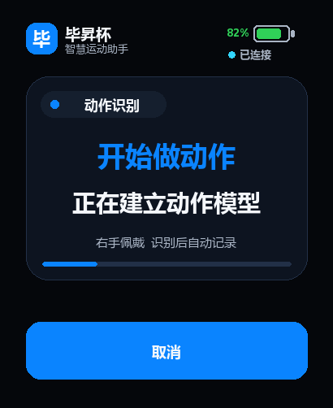
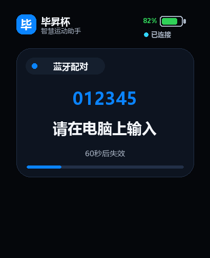
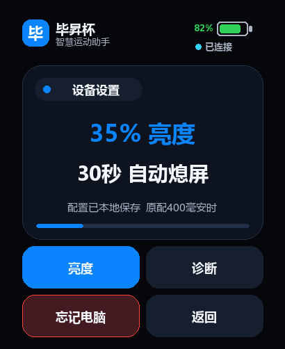
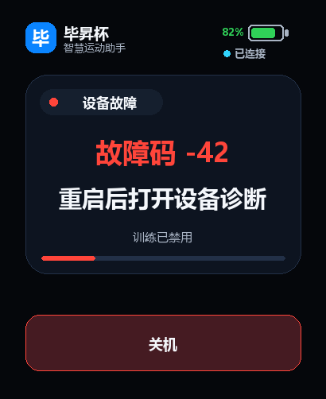

# 硬件平台、手表界面与低功耗

> 产品边界：右手腕佩戴；一次会话只做一种主动作；次数和步数动作在休息、静止和无效数据时由活动门与质量门冻结；低置信度或异类分类只作诊断，不切换主动作；`sit` 在运行态按合法单调 tick 累计时长；实体无振动马达；10 次动作的计数验收容差为 ±2 次。本文、当前源码和自动化测试共同构成实现依据。

## 1. 文档范围

统一说明 Waveshare 板级基线、QMI8658/AXP2101/PCF85063、LVGL 线程安全、智能手表界面、亮度和分级低功耗。

## 2. 阅读导航

| 章节 | 用途 |
|---:|---|
| 3 | 板载传感器、电源和 RTC 驱动 |
| 4 | BSP、资源合同、LVGL 分层和线程锁 |
| 5 | 页面语义、字体、亮度、动画和低功耗顺序 |
| 6 | 手表和上位机的信息层级、风格与验收 |

## 3. 板载传感器、电源和 RTC 驱动

### 1. 状态与边界

本组件为手柄固件提供三个板载器件的独立纯 C 驱动：

- QMI8658 六轴 IMU：身份验证、固定量程/采样率配置、异步数据就绪读取；
- AXP2101 电源管理芯片：SOC、充放电状态和软关机请求；
- PCF85063 RTC：UTC Unix 秒读写、BCD 和日历校验。

组件路径：

```text
esp32/firmware/components/board_sensors/
├─ include/board_sensors.h
├─ board_sensors.c
├─ board_sensors_esp_idf.c
└─ CMakeLists.txt
```

主机 fake 测试路径：

```text
esp32/host_tests/board_sensors/
├─ test_board_sensors.c
└─ run_tests.ps1
```

主机测试只验证驱动算法和 I2C 调用边界。QMI 中断电气特性、AXP 真关机、RTC 晶振保持时间和 ESP-IDF 实机 I2C 时序必须按本章真板清单独立验收，不得用 fake 测试替代。

### 2. 寄存器依据

寄存器值以厂家公开仓库、项目锁定组件版本和本仓库接口三者为依据，不凭经验猜测，也不依赖开发者机器上的缓存目录：

| 器件 | 厂家公开源码 | 项目实现 | 关键值 |
|---|---|---|---|
| QMI8658 | [QMI8658Constants.h](https://github.com/waveshareteam/ESP32-S3-Touch-AMOLED-2.06/blob/main/examples/arduino/libraries/SensorLib/src/REG/QMI8658Constants.h)、[SensorQMI8658.hpp](https://github.com/waveshareteam/ESP32-S3-Touch-AMOLED-2.06/blob/main/examples/arduino/libraries/SensorLib/src/SensorQMI8658.hpp) | [`board_sensors.h`](../esp32/firmware/components/board_sensors/include/board_sensors.h)、[`board_sensors.c`](../esp32/firmware/components/board_sensors/board_sensors.c) | 地址 `0x6B`、WHO_AM_I `0x05`、数据 `0x35~0x40`、时间戳 `0x30~0x32` |
| AXP2101 | [AXP2101Constants.h](https://github.com/waveshareteam/ESP32-S3-Touch-AMOLED-2.06/blob/main/examples/arduino/libraries/XPowersLib/src/REG/AXP2101Constants.h)、[XPowersAXP2101.tpp](https://github.com/waveshareteam/ESP32-S3-Touch-AMOLED-2.06/blob/main/examples/arduino/libraries/XPowersLib/src/XPowersAXP2101.tpp) | [`board_sensors.h`](../esp32/firmware/components/board_sensors/include/board_sensors.h)、[`board_sensors.c`](../esp32/firmware/components/board_sensors/board_sensors.c) | 地址 `0x34`、IC_TYPE `0x03`、SOC `0xA4`、COMMON_CONFIG `0x10`、芯片 ID `0x4A` |
| PCF85063 | [PCF85063Constants.h](https://github.com/waveshareteam/ESP32-S3-Touch-AMOLED-2.06/blob/main/examples/arduino/libraries/SensorLib/src/REG/PCF85063Constants.h)、[SensorPCF85063.hpp](https://github.com/waveshareteam/ESP32-S3-Touch-AMOLED-2.06/blob/main/examples/arduino/libraries/SensorLib/src/SensorPCF85063.hpp) | [`board_sensors.h`](../esp32/firmware/components/board_sensors/include/board_sensors.h)、[`board_sensors.c`](../esp32/firmware/components/board_sensors/board_sensors.c) | 地址 `0x51`、时间寄存器 `0x04~0x0A`、VL 位、BCD 与 24 小时制 |

板级 BSP、面板和触摸组件的精确版本以 [`esp32/firmware/dependencies.lock`](../esp32/firmware/dependencies.lock) 为准。更换组件版本时，必须同时复核厂家 [ESP-IDF 示例](https://github.com/waveshareteam/ESP32-S3-Touch-AMOLED-2.06/tree/main/examples/esp-idf)、本节寄存器合同和主机测试。

PCF85063 没有独立芯片 ID 寄存器。驱动初始化只能验证地址 `0x51` 的 CTRL1/CTRL2 可读，并强制进入运行中的 24 小时制；不能把该 ACK 宣称为不可碰撞的型号证明。

### 3. 可注入 I²C 架构

核心驱动不直接依赖 ESP-IDF。`board_sensors_i2c_t` 接收三个回调：

```c
int read_register(context, address, reg, data, length);
int write_register(context, address, reg, data, length);
void delay_ms(context, delay_ms);
```

好处：

1. 主机用内存寄存器镜像构造正常、边界和故障；
2. ESP-IDF 用 `i2c_master_transmit_receive()` 与 `i2c_master_transmit()`；
3. 芯片算法与 I2C 平台生命周期分离；
4. 后续若厂家 BSP 已持有共享总线，只需把现有 `i2c_master_bus_handle_t` 交给适配器。

ESP-IDF 适配器在同一总线上预注册三个 400 kHz、7 位地址设备。单次事务超时 50 ms。连续写使用 17 字节栈缓冲：1 字节寄存器地址加最多 16 字节数据；当前最长 RTC 写只有 7 字节。

I2C 总线和三个芯片对象的生命周期关系：

```text
调用方创建 i2c_master_bus_handle_t
  -> board_sensors_esp_idf_i2c_init() 添加三个 device handle
  -> 初始化 QMI/AXP/RTC 纯 C 对象
  -> 正常读写
  -> board_sensors_esp_idf_i2c_deinit() 删除三个 device handle
  -> 调用方删除共享 bus handle
```

### 4. QMI8658

#### 4.1 为什么选正负 8 g 和正负 1024 deg/s

训练数据中的加速度峰约为 6～7 g，角速度峰约为 850 deg/s。较小量程会饱和，较大量程会降低每 LSB 分辨率。因此固定为：

| 通道 | 量程 | ODR | 寄存器 |
|---|---:|---:|---:|
| 加速度 | `±8 g` | `125 Hz` | `CTRL2=0x26` |
| 陀螺仪 | `±1024 deg/s` | `112.1 Hz` | `CTRL3=0x66` |

两个 ODR 与现有 `imu_pipeline` 的异步输入合同一致：

- 加速度期望周期约 8,000 µs；
- 陀螺仪期望周期约 8,912 µs；
- 后续严格重采样为 25 Hz，即 40,000 µs 网格。

#### 4.2 初始化序列

1. 读 `WHO_AM_I(0x00)`，必须等于 `0x05`；
2. 向 `RESET(0x60)` 写 `0xB0`；
3. FreeRTOS 延时 20 ms，不忙等；
4. 读 `RESET_RESULT(0x4D)`，必须等于 `0x80`；
5. `CTRL1` 清大端位，打开地址自增和 INT1，最终相关位为 `0x48`；
6. 写 `CTRL2=0x26`；
7. 写 `CTRL3=0x66`；
8. 写 `CTRL5=0x00`，关闭芯片 LPF；
9. 写 `CTRL7=0x03`，启用 accel/gyro 且保持异步模式。

关闭芯片 LPF的原因：现有 `imu_pipeline` 已统一执行 8 Hz 数字低通。双重低通会增加相位延迟并改变训练/部署特征。

#### 4.3 原始值与单位

QMI 输出为小端二补码 `int16`。加速度换算为：

$$
a_g = r_a \times \frac{8}{32768}
$$

其中：

- $r_a$：原始加速度整数，范围 $[-32768,32767]$；
- $a_g$：物理加速度，单位 g；
- 比例为 `0.000244140625 g/LSB`。

角速度换算为：

$$
\omega_{dps} = r_g \times \frac{1024}{32768}
$$

其中：

- $r_g$：原始陀螺整数；
- $\omega_{dps}$：角速度，单位 deg/s；
- 比例为 `0.03125 deg/s/LSB`。

核心驱动返回原始整数，现有 `imu_pipeline_config_t` 使用上述两个比例换算，避免不同层重复量化。

#### 4.4 时间戳合同

`board_qmi8658_frame_t` 同时保存：

- `timestamp_us`：调用方在 GPIO21 数据就绪中断或轮询入口捕获的单调微秒；这是提交给 `imu_pipeline` 的正式时刻；
- `sensor_timestamp_ticks`：QMI `0x30~0x32` 的 24 位原始小端计数；只用于回绕、停滞和丢样诊断。

当前驱动**不把芯片 tick 换算为微秒**。原因是项目现有厂家 C++ 库只返回原始 24 位计数，未在被采用代码路径给出可靠的 tick 到秒换算。强行猜常量会把异步插值时间轴系统性拉伸或压缩。

上层接入示意：

```c
board_qmi8658_frame_t frame;
board_qmi8658_read_available(&qmi, esp_timer_get_time(), &frame);

if (frame.accel_available) {
    imu_qmi_raw_sample_t sample = {
        .timestamp_us = frame.timestamp_us,
        .raw_xyz = {frame.accel_raw[0], frame.accel_raw[1], frame.accel_raw[2]},
        .quality_flags = IMU_QUALITY_OK,
    };
    imu_pipeline_push_raw(&pipeline, IMU_SOURCE_ACCEL, &sample);
}

if (frame.gyro_available) {
    imu_qmi_raw_sample_t sample = {
        .timestamp_us = frame.timestamp_us,
        .raw_xyz = {frame.gyro_raw[0], frame.gyro_raw[1], frame.gyro_raw[2]},
        .quality_flags = IMU_QUALITY_OK,
    };
    imu_pipeline_push_raw(&pipeline, IMU_SOURCE_GYRO, &sample);
}
```

两路同一轮同时就绪时暂用相同主机捕获时刻。现有重采样器通过各自队列和名义 ODR处理。硬件联调时应对比 GPIO21 中断间隔与 `sensor_timestamp_ticks` 增量，再决定是否加入芯片时钟标定。

#### 4.5 WOM、恢复与关闭模式

QMI 电源管理不再只关闭主机轮询，而是实际切换芯片寄存器。三种状态为：

| 模式 | 主要寄存器 | 用途 |
|---|---|---|
| `ACTIVE` | `CTRL2=0x26`、`CTRL3=0x66`、`CTRL7=0x03` | 恢复 8 g/125 Hz 加速度和 1024 deg/s/112.1 Hz 陀螺仪 |
| `WAKE_ON_MOTION` | `CTRL2=0x0D`、`CAL1_L=40`、`CAL1_H=4`、`CTRL7=0x01` | 只保留 2 g/21 Hz 低功耗加速度和 INT1 运动唤醒 |
| `OFF` | `CAL1_L=0`、`CAL1_H=0`、`CTRL7=0x00` | 关闭 WOM、加速度和陀螺仪 |

WOM 顺序固定为：

1. `CTRL7=0x00` 先关闭传感器，避免配置中间态产生假中断；
2. `CTRL2=0x0D` 选择 2 g、21 Hz 低功耗加速度；
3. `CAL1_L=40` 设置 40 mg 运动门限；公开 API 边界为 1～255 mg；
4. `CAL1_H=4` 设置 INT1 初始低、运动后高和 4 样本消隐；消隐参数边界为 0～63；
5. 向 `CTRL9(0x0A)` 写 `0x08` 启动 WOM 配置命令；
6. 每 1 ms 轮询 `STATUSINT(0x2D).bit7`，最多 100 ms 等待命令完成；
7. 向 `CTRL9` 写 `0x00` 确认，再最多 100 ms 等待 `STATUSINT.bit7` 清零；
8. `CTRL7=0x01` 只启用加速度，最后读一次 `STATUS1` 清除可能残留的旧事件。

任一 I2C 事务失败、命令超时或参数越界都不把驱动状态标记为 WOM，上层因此会拒绝 Deep-sleep。QMI 读数任务和模式切换共用一个 FreeRTOS 互斥锁，不允许数据寄存器事务与 CTRL 寄存器事务交叉。

WOM 参数与唤醒时间量级关系为：

$$
T_{blank}=\frac{N_{blank}}{f_{WOM}}
=\frac{4}{21}\ \mathrm{s}\approx 190.5\ \mathrm{ms}
$$

其中 $N_{blank}$ 是消隐样本数，$f_{WOM}=21\ \mathrm{Hz}$ 是 WOM 加速度输出率。该式只给出初始时间量级；芯片内部判定细节、INT1 保持时间、整板误唤醒率和电流必须用实物测量。

#### 4.6 复杂度与资源

- 每次轮询固定读取 1+3 字节；每路就绪再读 6 字节；
- 时间复杂度 $O(1)$；
- 驱动对象只保存端口指针、地址、初始化位和当前 ACTIVE/WOM/OFF 模式；
- 输出帧约几十字节，无动态内存；
- 数据 I2C 最坏阻塞受单事务 50 ms 超时限制；CTRL9 握手额外有“完成 100 ms+确认清零 100 ms”的明确上限。

### 5. AXP2101

#### 5.1 初始化和状态

初始化读取 `IC_TYPE(0x03)`，必须等于 `0x4A`。

状态来自：

- `STATUS1.bit5`：VBUS good；
- `STATUS1.bit3`：battery present；
- `STATUS2.bits7:5`：`001` 充电，`010` 放电，其它为待机/未知；
- `STATUS2.bits2:0`：涓流、预充、恒流、恒压、完成、停止；
- `BAT_PERCENT_DATA(0xA4)`：0~100% SOC。

若电池不存在，不读取燃料计，SOC 输出 0；若电池存在且寄存器大于 100，返回 `BOARD_SENSORS_ERR_RANGE`。UI 不应把 255% 或损坏字节截断成 100%。

厂家原配电池容量为 400 mAh，但 SOC 寄存器本身已是百分比，不应使用电压线性映射重新计算。电池预算和 15%/8%/5% 产品策略由 `power_manager` 处理。

#### 5.2 软关机

关机调用执行：

1. 读 `COMMON_CONFIG(0x10)`；
2. 保留原值所有位；
3. 仅把 bit0 置一；
4. 写回 `COMMON_CONFIG`。

位操作公式：

$$
C_{new} = C_{old} \lor 0x01
$$

厂家 XPowersLib 注释说明：该位关闭全部电源通道，只保留 VRTC。调用成功后系统可能立即掉电，所以业务顺序必须是：

```text
停止采样/推理
-> 保存会话摘要
-> fsync LittleFS/TF
-> 停止 BLE 和 UI
-> 关闭扬声器功放门控
-> 最后调用 board_axp2101_request_shutdown()
```

驱动不替业务层保存数据。直接调用关机而未先刷盘会丢失最近会话。

#### 5.3 复杂度与资源

- 状态读取：连续 2 字节状态，加可选 1 字节 SOC，$O(1)$；
- 关机：1 字节读加 1 字节写，$O(1)$；
- 无动态内存；
- 关机属于不可逆到下一次上电的硬件动作，主机 fake 只验证写序列。

### 6. PCF85063

#### 6.1 初始化边界

PCF85063 地址为 `0x51`，没有独立芯片 ID。初始化连续读取 CTRL1/CTRL2，然后：

- 清 `CTRL1.bit1`，强制 24 小时制；
- 清 `CTRL1.bit5`，启动时钟；
- 只有控制值变化时才写回。

#### 6.2 BCD 格式

十进制 $v$ 转 BCD：

$$
BCD(v) = \left(\left\lfloor\frac{v}{10}\right\rfloor \ll 4\right) \lor (v \bmod 10)
$$

BCD 转十进制：

$$
v = 10\times high + low
$$

其中高、低半字节必须都不大于 9。驱动还检查：

- 秒和分：0~59；
- 小时：0~23；
- 月：1~12；
- 日：1~该月实际天数；
- 星期：0~6；
- 年：2000~2099；
- `SECONDS.bit7(VL)` 必须为 0。

年份限制源于芯片只保存两位年。允许 2100 会把它无声解释成 2000，所以接口主动返回范围错误。

#### 6.3 Unix 秒转换

Unix 时间表示从 1970-01-01 00:00:00 UTC 起的秒数：

$$
t = 86400D + 3600h + 60m + s
$$

其中：

- $D$：日期相对 Unix epoch 的整数天数；
- $h,m,s$：时、分、秒；
- RTC 只保存 UTC，不在芯片层加入北京时间 8 小时。

日期换算使用纯整数 Gregorian 400 年周期算法。闰年规则：

$$
leap(y) = (y\bmod400=0) \lor ((y\bmod4=0) \land (y\bmod100\neq0))
$$

不调用 `mktime()`，因此不会受 PC 时区或 ESP32 环境变量影响。

#### 6.4 复杂度与资源

- 读写固定 7 字节，时间复杂度 $O(1)$；
- 日历转换只用整数常量空间；
- 无动态内存；
- VL 或非法 BCD 时不修改调用方输出 Unix 秒。

### 7. 错误处理

| 错误 | 含义 | 上层建议 |
|---|---|---|
| `BOARD_SENSORS_ERR_ARGUMENT` | 空指针、缺回调、时间超范围 | 记录固件配置错误，禁止启动训练 |
| `BOARD_SENSORS_ERR_IO` | I2C NACK、超时或传输失败 | 计数并限次重试；连续失败转诊断页 |
| `BOARD_SENSORS_ERR_CHIP_ID` | QMI/AXP 身份不符 | 禁止使用对应功能，显示硬件不匹配 |
| `BOARD_SENSORS_ERR_STATE` | 未初始化或 QMI 复位未完成 | 重建总线/设备，不能消费输出 |
| `BOARD_SENSORS_ERR_CLOCK_INVALID` | RTC VL、BCD 或日期无效 | 从 PC/BLE 同步 UTC 后重写 RTC |
| `BOARD_SENSORS_ERR_RANGE` | SOC>100 或 Unix 年份超范围 | 拒绝显示/写入并记录诊断 |

I2C 错误不会把旧缓冲伪装成新数据。QMI 输出在读取前清零；RTC 只有完整校验通过后才写出 Unix 秒。

### 8. 主机测试

运行：

```powershell
& esp32\host_tests\board_sensors\run_tests.ps1
```

当前 69 项断言覆盖：

- QMI/AXP 正确和错误芯片 ID；
- QMI 复位、固定 CTRL 寄存器、量程比例；
- QMI 24 位时间戳、小端 `int16`、正负边界；
- 读失败和初始化写失败；
- AXP 电池、VBUS、充放电状态和 SOC 101% 异常；
- AXP 关机严格读改写 `0xA0 -> 0xA1`；
- PCF85063 2024-02-29 闰日 BCD/Unix 往返；
- 2000/2099 年边界、2100 年拒绝、VL、非法 BCD、非法月日和 I2C 失败；
- 空回调和未初始化保护。

测试不覆盖：真实总线电平、上拉、电源时序、中断抖动、RTC 精度、PMIC 掉电和电池 SOC 准确度。

### 9. 烧录后硬件验收清单

1. I2C SDA=GPIO15、SCL=GPIO14，先确认总线无卡低；
2. 读取 QMI WHO_AM_I=`0x05`、AXP IC_TYPE=`0x4A`；
3. 静止水平放置时，三轴加速度模长约 1 g，角速度接近 0 deg/s；
4. 分别统计 accel 与 gyro 中断周期，检查接近 8,000 µs 与 8,912 µs；
5. 对比 QMI 原始时间戳增量，确认回绕和实际 tick 单位；
6. 接入现有 `imu_pipeline`，检查 25 Hz 点无长期 gap/reset；
7. USB 插拔时核对 AXP VBUS、充电方向和充放电状态变化；
8. 与厂家 UI 对比 SOC，0%、100% 和无电池状态不得越界；
9. 断开主电后等待再上电，检查 RTC UTC 单调和 VL；
10. 先用可恢复测试固件验证刷盘，再调用 AXP 软关机；
11. 真关机后确认 AMOLED、扬声器功放和主 SoC 均掉电，RTC 继续走时；
12. 记录测试固件版本、板卡版本、电池电量和测量日志。

只有上述实机项完成后，才能把本组件状态从“软件/主机测试通过”升级为“板载驱动验收通过”。

## 4. BSP、资源合同、LVGL 分层和线程锁

### 1. 文档范围

本文说明健身识别手柄的软件怎样接入 Waveshare `ESP32-S3-Touch-AMOLED-2.06` 的板载资源，以及 LVGL 9 页面怎样安全运行。

覆盖内容：

- 410×502 AMOLED 与电容触摸；当前厂家 BSP 使用 SH8601/FT5x06 兼容驱动路径；
- 共用 I2C 总线；
- QMI8658、AXP2101、PCF85063 的驱动边界；
- TF 卡；
- GPIO46 扬声器功放门控；当前硬件没有振动马达；
- 开机、主页、准备、训练、暂停、总结、设置、诊断、熄屏、错误和关机页面；
- 真实 BSP/Mock 编译切换；
- LVGL 线程安全、资源、低功耗和后续烧录验收。

相关代码：

- `esp32/firmware/components/board_adapter/`
- `esp32/firmware/components/board_runtime/`
- `esp32/firmware/components/ui/`
- `esp32/host_tests/board_ui_runtime/`

### 2. 厂商 API 事实边界

项目固定使用 managed component：

```yaml
waveshare/esp32_s3_touch_amoled_2_06: "1.0.7"
lvgl/lvgl: "9.5.0"
```

代码核对基准为 Waveshare 官方 `Waveshare-ESP32-components` 与当前产品 ESP-IDF 示例锁文件。产品仓库把物料标为 CO5300+CST9220；受管 BSP 同时依赖 SH8601 与 FT5x06 兼容驱动。因此本文把“物料名”和“驱动路径名”分开描述。

厂商 BSP v1.0.7 已公开且本项目实际调用的接口：

```c
lv_display_t *bsp_display_start(void);
lv_indev_t *bsp_display_get_input_dev(void);
bool bsp_display_lock(uint32_t timeout_ms);
void bsp_display_unlock(void);
esp_err_t bsp_display_brightness_set(int brightness_percent);
esp_err_t bsp_i2c_init(void);
i2c_master_bus_handle_t bsp_i2c_get_handle(void);
esp_err_t bsp_sdcard_mount(void);
esp_err_t bsp_sdcard_unmount(void);
```

重要限制：该 BSP 明确声明 `BSP_CAPS_IMU=0`。它没有提供 QMI8658、AXP2101 或 PCF85063 的高层读写函数。因此 `board_runtime` 不虚构厂商 API，而是：

1. 用 BSP 建立显示、触摸、I2C 和 TF；
2. 启动时只对 QMI8658、AXP2101、PCF85063 做 I2C ACK 探测；
3. 通过 `board_runtime_external_ops_t` 接收独立驱动回调；
4. 独立驱动通过 `board_runtime_i2c_handle()` 复用 BSP 主总线；
5. 未注册独立驱动时返回 `BOARD_RUNTIME_ERR_UNSUPPORTED`，不伪造电量、RTC 或关机成功。

当前真实后端只允许厂家 BSP 已封装的 SH8601/FT5x06 兼容路径。未实现的 `CO5300/CST9220` 原生路径不再作为用户可选 Kconfig 选项；兼容符号只为旧配置文件保留并固定关闭。兼容路径是否对应实物 CO5300/CST9220，由厂家组件内部实现和烧录验收共同确认，固件不能绕过 BSP 盲写另一控制器寄存器。

### 3. 板级资源合同

| 资源 | 接法/接口 | 软件行为 |
|---|---|---|
| AMOLED | 410×502，QSPI；厂家 BSP 内部走 SH8601 兼容驱动 | `bsp_display_start()` 启动显示和 LVGL 任务；`bsp_display_panel_power_set()` 发送真实 Display On/Off；实物物料名按厂家当前资料为 CO5300 |
| AMOLED 亮度 | 面板 `0x51` 命令 | `bsp_display_brightness_set(0..100)` 只调发光亮度；熄屏另用 Display Off，没有独立背光 GPIO |
| 触摸 | 厂家 BSP 内部走 FT5x06 兼容驱动，SDA15/SCL14，RST9，INT38 | BSP 随显示创建 `lv_indev_t`；策略明确停用触摸时写 PMODE hibernate，唤醒时 GPIO9 复位、重新写冻结阈值，再启用 LVGL 输入；实物控制器资料冲突仍须烧录核对 |
| QMI8658 | I2C 0x6A 或 0x6B，INT1 GPIO21 | 运行时探测地址；采样/低功耗由独立驱动回调负责 |
| AXP2101 | I2C 0x34 | 运行时探测；电量与软关机由独立驱动回调负责 |
| PCF85063 | I2C 0x51，INT GPIO39 | 运行时探测；UTC 秒读取由独立驱动回调负责 |
| TF | 1-bit SDMMC：CLK2、CMD1、D0=3 | 使用 `bsp_sdcard_mount/unmount`；按需挂载 |
| 扬声器功放 | GPIO46 | 启动默认低电平；v1 默认关闭，不初始化音频 codec |

本地原理图还给出 TF `CS=GPIO17`，但厂商 ESP-IDF BSP 的 TF 路径是 1-bit SDMMC，不使用 CS。若以后改 SPI 模式，必须另建组件，不能同时驱动同一张卡。

### 4. 真实/Mock 编译切换

`board_runtime/Kconfig`：

```text
CONFIG_BOARD_RUNTIME_REAL=y   使用真实 Waveshare BSP
CONFIG_BOARD_RUNTIME_MOCK=y   不访问硬件
```

默认选择 REAL。无板联调可选择 MOCK。两种后端对上层暴露完全相同的 `board_runtime_t` 和 `board_adapter_t`。

Mock 能验证：

- 显示开关和亮度状态；
- 电池百分比与充电状态；
- TF 挂载状态；
- 触摸逻辑开关；
- QMI、RTC、PMIC 回调边界；
- LVGL 锁端口。

Mock 通过不代表真实屏幕、触摸、电源或 TF 已验收。

#### 4.1 可见启动与错误页顺序

生产入口先初始化板级显示、触摸和 LVGL renderer，立即呈现中文开机页与自检页，然后才初始化 QMI8658、AXP2101、PCF85063、会话存储和业务域。顺序固定为：

```text
board runtime -> LVGL renderer -> BOOT/SELF_TEST 可见
              -> 外部传感器 -> 会话存储 -> 业务域 -> HOME
```

QMI8658、AXP2101、RTC、会话存储或业务域初始化失败时，入口把稳定故障码写入 `ui_context_t`，渲染中文 `ERROR` 页并挂起产品任务。显示本身初始化失败时没有可用像素输出，只能通过串口保留错误；文档不能声称该故障也能显示屏幕错误页。

### 5. 无马达反馈合同

当前手表实体没有振动马达。固件、手表设置页和上位机不得向用户暴露振动开关、强度、测试入口或“已振动”等虚假反馈。BLE 协议版本 1 的兼容保留字段 `haptic_enabled` 只用于保持字节布局，解码和落盘后必须强制为 `false`，发送端固定写零。

一次有效计数只通过以下可验证通道反馈：

1. 设备权威累计在手表主卡中加一；
2. 数字使用短淡入确认状态变化，减少动画模式下立即替换；
3. 同一 `MetricEvent` 和更新后的 Live State 通过 BLE 送往上位机；
4. 上位机只显示设备权威累计，不自行补计或模拟触觉反馈。

没有 BLE 时，手表屏幕仍是完整反馈通道。没有屏幕时，系统不能用扬声器或协议保留位冒充计数确认。相关兼容实现见 [`device_config.c`](../esp32/firmware/components/device_config/device_config.c)，页面合同见 [`ui_presenter.c`](../esp32/firmware/components/ui/ui_presenter.c)，回归测试见 [`test_device_config.c`](../esp32/host_tests/device_config/test_device_config.c)。

### 6. UI 页面

| 状态 | 页面主要内容 | 触摸按钮 |
|---|---|---|
| `BOOT` | 标志、中文启动提示、800 ms 淡入 | 无 |
| `SELF_TEST` | 显示、触摸、IMU、存储中文自检提示 | 无 |
| `HOME` | 就绪、电量、BLE | 开始、设置、关机 |
| `PREPARE` | 已开始采样、提示持续做动作并等待稳定识别 | 取消 |
| `RUNNING` | 动作、次数/步数/秒、kcal、时间、置信度 | 暂停、停止 |
| `PAUSED` | 冻结指标 | 继续、停止 |
| `SUMMARY` | 总指标、kcal、时长 | 完成 |
| `SETTINGS` | 当前亮度、自动熄屏和绑定管理 | 亮度、诊断、忘记电脑、返回 |
| `DIAGNOSTICS` | 设备状态、传感器、数据质量和故障摘要 | 返回 |
| `SCREEN_OFF` | 纯黑页面 | 无 |
| `ERROR` | 错误码、训练阻止提示 | 关机 |
| `SHUTDOWN` | 保存完成、500 ms 淡入 | 无 |

页面采用接近纯黑背景，减少 AMOLED 发光功耗和静态烧屏风险。全部用户可见文案和 11 类动作使用项目生成的 Noto Sans SC 16/20/28 px 中文子集；Montserrat 只用于不含汉字的内部或数值内容。修改中文文案后必须重新生成字体子集，并复核字形 manifest、SHA-256、许可证、Flash 与页面创建 RAM。

BLE Display Only 配对码不是第 14 个独立页面，而是覆盖当前可见页面的高优先级中文提示。六位码使用固定宽度补零显示；提示存在时隐藏当前页按钮，避免用户在配对过程中误启动训练。成功、失败、断线、超时、停止 BLE 或执行“忘记电脑”时立即清除码和到期时间，旧码不能留在下一页快照中。

### 7. presenter 与 renderer 分层

#### 7.1 纯 presenter

`ui_presenter_build()` 输入 `ui_context_t`，输出固定大小 `ui_page_model_t`：

- 标题；
- 主文本；
- 次文本；
- 电池/BLE 状态；
- 页脚；
- 最多三个按钮命令和标签。

它只用栈上固定缓冲和 `snprintf`，时间、空间复杂度均为 $O(1)$。主机测试不需要 LVGL。

#### 7.2 LVGL renderer

`ui_lvgl_renderer_init()` 在启动时一次创建全部 screen 和子对象。运行时只更新标签、按钮显示状态和当前 screen，不反复创建页面，减少堆碎片。

页面切换和反馈动画：

- 页面切换：150 ms 淡入；
- 开机：800 ms 主文本淡入；
- 关机：500 ms 主文本淡入；
- 动作变化：150 ms 动作名淡入；
- 计数变化：180 ms 指标淡入。

不使用全屏白色、长距离滑动或无限动画。

### 8. LVGL 线程安全

LVGL 不是线程安全库。厂商 BSP 文档要求所有 `lv_...` 调用位于：

```c
bsp_display_lock(timeout_ms);
/* 读取或修改 LVGL 对象。 */
bsp_display_unlock();
```

渲染器不直接依赖 BSP，而是接收 `ui_lvgl_port_t`：

```c
const ui_lvgl_port_t port = {
    .context = &board_runtime,
    .lock = board_runtime_lvgl_lock,
    .unlock = board_runtime_lvgl_unlock,
};
```

规则：

- 初始化、更新、删除页面全部加锁；
- presenter 在锁外格式化文本，缩短临界区；
- 加锁 250 ms 超时后丢弃这一帧，不阻塞 IMU/推理任务；
- LVGL 按钮回调只把 `ui_command_t` 放入 FreeRTOS 队列；
- 按钮回调不直接调用存储、BLE、PMIC 或算法；
- UI 任务收到最新 `ui_context_t` 快照后调用 render。

### 9. 集成调用顺序

生产 `app_main` 按下列顺序初始化板级运行时和 UI：

```c
board_runtime_t board_runtime = {0};
board_runtime_config_t board_config = {
    .external_ops = product_external_drivers,
    .initial_brightness_percent = 35,
};

board_runtime_init(&board_runtime, &board_config);

ui_lvgl_renderer_t renderer = {0};
ui_lvgl_port_t lvgl_port = {
    .context = &board_runtime,
    .lock = board_runtime_lvgl_lock,
    .unlock = board_runtime_lvgl_unlock,
};

ui_lvgl_renderer_init(
    &renderer,
    &lvgl_port,
    enqueue_ui_command,
    &ui_command_queue);

ui_lvgl_renderer_render(&renderer, &ui_context);
```

所需组件依赖：

```text
board_runtime -> board_adapter
board_runtime -> waveshare__esp32_s3_touch_amoled_2_06
board_runtime -> lvgl, esp_driver_gpio, esp_driver_i2c
ui -> lvgl
```

QMI8658 采样驱动应把严格时间戳原始点送入 `imu_pipeline`，不应由 UI 或 board_runtime 读取并重采样。

### 10. 原厂电池与低功耗说明

当前硬件使用厂家原配 400 mAh 电池。板级层不根据电压猜百分比，百分比必须来自经过验证的 AXP2101 独立驱动。

现有电源门槛：

- 15%：低电量警告；
- 8%：非充电时禁止开始新会话；
- 5%：保存会话并请求 PMIC 安全关机。

显示熄屏执行两层动作：先把面板亮度降为 0，再通过 `bsp_display_panel_power_set(false)` 发送真实 Display Off。触摸停用先执行 `lv_indev_enable(false)`，再通过 FT5x06/FT3168 驱动把 PMODE 写为 hibernate。唤醒顺序相反：GPIO9 复位触摸、重新初始化并写回冻结阈值，启用 LVGL 输入，最后执行面板 Display On 并恢复目标亮度。

Deep-sleep 入口先验证 QMI8658 WOM、RTC/触摸 Light-sleep 候选和 GPIO21 RTC IO 等唤醒前提，验证成功后才停止 BLE、关闭面板并休眠触摸。若前提失败，电源任务保留当前外设和运行状态，不允许先熄屏再因睡眠失败把设备留在不可交互状态。

主机测试验证调用顺序和失败回滚；发布验收必须在真板上检查面板命令、电容触摸功耗、GPIO9 复位时序和唤醒后首击。

### 11. 发布验证

自动化门：

- `power_ui_tests passed`；
- `board_ui_runtime_tests passed`；
- `board_runtime_esp.c` 对 ESP-IDF/Waveshare v1.0.7 签名桩通过 `-Wall -Wextra -Werror -fsyntax-only`；
- `ui_lvgl_renderer.c` 对厂家仓库 LVGL 9 头通过同等语法编译；
- 设置/诊断状态导航、全部页面 presenter、Mock 电池/TF/QMI/RTC/PMIC 边界有主机测试。
- AMOLED Display On/Off、FT3168 hibernate/wake 和“先验证唤醒源、后关闭外设”的调用合同有源码测试。
- 六位配对码显示/清除、设置页“忘记电脑”和绑定删除边界有纯 C/主机测试。

每次硬件版本或显示驱动升级都必须执行真板门，不能由主机测试替代：

1. SH8601 首帧、Display On/Off、亮度 0/35/100 和烧屏保护；
2. FT3168 坐标、方向、边缘按钮、PMODE hibernate、GPIO9 复位恢复和 GPIO38 唤醒；
3. QMI8658 地址、INT1 GPIO21、ODR、FIFO 与时间戳；
4. AXP2101 电量、充电、5% 安全关机；
5. PCF85063 时间和 GPIO39 中断；
6. TF 插拔、1-bit SDMMC、断电前卸载；
7. GPIO46 默认低电平、开机无爆音；
8. LVGL 页面创建峰值 RAM、任务栈高水位和 1 小时稳定性；
9. 400 mAh 原厂电池的训练电流、熄屏电流和 Deep-sleep 电流；
10. Windows 首次配对时六位码显示、成功/失败/断线清除，以及设备“忘记电脑”后旧密钥不能重连。

## 5. 页面语义、字体、亮度、动画和低功耗顺序

本文对应 Waveshare `ESP32-S3-Touch-AMOLED-2.06` 产品固件。当前主题为：

> 毕昇杯——智慧运动助手

真表没有振动马达。所有反馈通过 AMOLED、触摸、BLE 和上位机完成。

### 1. 官方硬件基线

显示和触摸保持厂家 ESP-IDF/LVGL 9 启动链：

```text
bsp_display_start()
-> bsp_display_lock(0)
-> 创建或更新 LVGL 对象
-> bsp_display_unlock()
```

产品层不得修改厂家 QSPI flush、颜色格式、字节交换、DMA 缓冲、旋转和 flush 完成回调。持有 BSP LVGL 锁时禁止调用 `lv_refr_now()`。

PMIC、电池和充电事实来自 AXP2101。IMU 来自 QMI8658，通道顺序固定 `gx、gy、gz、ax、ay、az`。

### 2. 设计原则

界面遵循以下固定规则：

- 410×502 AMOLED 使用石墨黑背景，降低发光面积；
- 科技蓝只用于主操作和普通产品状态；
- 青色用于 BLE、充电和智能识别；
- 绿色表示正常计数和健康电量；
- 橙色表示休息、低电量或待确认；
- 红色只表示故障和破坏性操作；
- 同屏只有一个最大主指标；
- 用户可见信息不显示模型类别数、窗口数、特征维数或工程参数；
- 页面不依赖网络图片或第三方品牌资源；
- 减少动画模式下关闭文字淡入，页面仍可完整使用。

颜色：

| 用途 | RGB |
|---|---|
| 背景 | `#05070B` |
| 主卡 | `#0D1420` |
| 抬升表面 | `#151F2E` |
| 科技蓝 | `#0A84FF` |
| 青色 | `#32D5FF` |
| 成功绿 | `#30D158` |
| 警告橙 | `#FF9F0A` |
| 危险红 | `#FF453A` |
| 主文字 | `#F5F7FA` |
| 次文字 | `#A9B4C4` |

#### 2.1 设计 token 与信息层级

颜色、尺寸和状态词都使用语义 token，而不是在页面函数中随手写常量。真实定义集中在 [`ui_lvgl_renderer.c`](../esp32/firmware/components/ui/ui_lvgl_renderer.c)，文案和按钮集中在 [`ui_presenter.c`](../esp32/firmware/components/ui/ui_presenter.c)。

| token 组 | 当前值 | 设计目的 |
|---|---|---|
| 画布 | `410×502 px` | 与设备 AMOLED 逻辑分辨率一致 |
| 安全区 | 左右 `32 px`、顶部 `28 px`、底部 `22 px` | 避开玻璃圆角和边缘触摸误差 |
| 主卡 | `346×250 px`、圆角 `28 px` | 聚合单一训练任务，不与顶栏和按钮争抢注意力 |
| 普通按钮 | 高 `54 px`，位于高 `70 px` 的底部按钮行 | 大于常用 44 px 触摸下限，按下时立即出现视觉反馈 |
| 设置按钮 | `166×52 px`，两列两行 | 亮度、诊断、忘记电脑和返回始终同时可见 |
| 字体 | Noto Sans SC `16/20/28/36 px` | 小字解释状态，大字只给动作和权威累计 |
| 动效 | `150-180 ms` 淡入，可完全关闭 | 只确认页面、动作或累计已经变化，不承担导航含义 |

信息层级固定为：

```text
品牌、电量、BLE
  -> 当前状态
     -> 主动作或主任务
        -> 权威累计
           -> 时长、热量、置信度或恢复提示
              -> 当前页主操作
```

任何新页面都必须回答四个问题：我在哪里、当前能否训练、最重要的数值是什么、怎样返回。不能用模型内部类别数、特征维度或调试参数填充界面。

#### 2.2 正式界面截图

以下截图由 [`watch_ui_preview.py`](../tools/watch_ui_preview/watch_ui_preview.py) 根据与固件相同的 410×502 页面语义确定性生成，适合教程讲解和布局回归。它们不是 LVGL 逐像素仿真，也不能替代真板显示、触摸和功耗验收。

在仓库根目录复现全部图片：

```powershell
python .\tools\watch_ui_preview\watch_ui_preview.py `
  --export-all .\docs\assets\ui\watch
```

成功标记为 `WATCH_UI_PNG_EXPORT_OK count=8 size=410x502`。生成条件、单页命令和清单字段见 [`docs/assets/ui/watch/README.md`](assets/ui/watch/README.md)，交互预览器说明见 [`tools/watch_ui_preview/README.md`](../tools/watch_ui_preview/README.md)。

| 首页与蓝牙配对 | 准备与训练 |
|---|---|
|  |  |
|  |  |

| 休息与总结 | 设置与故障 |
|---|---|
|  |  |
|  |  |

### 3. 固定智能手表网格

圆角安全区：

- 左右边距：32 px；
- 顶部起点：28 px；
- 底部保留：22 px；
- 安全内容宽度：346 px。

#### 3.1 品牌顶栏

| 元素 | 坐标/尺寸 |
|---|---|
| “毕”品牌标 | `x=32, y=28, 38×38` |
| “毕昇杯” | `x=80, y=26, 104×26` |
| “智慧运动助手” | `x=80, y=50, 164×22` |
| 电量百分比 | `x=254, y=29, 54×22` |
| 电池外壳 | `x=312, y=31, 44×20` |
| BLE 状态 | 第二行右侧 |

电池图标由外框、动态填充和正极帽组成。填充宽度：

$$
w_\text{fill}
=
36\cdot\frac{\operatorname{clip}(p,0,100)}{100}
$$

其中 $p$ 为 AXP2101 电量百分比。颜色规则：

- 充电：青色；
- $p\ge40\%$：绿色；
- $20\%\le p<40\%$：橙色；
- $p<20\%$：红色。

#### 3.2 训练主卡

主卡位于 `x=32, y=94, 346×250`，圆角 28 px。内部从上到下：

1. 状态胶囊；
2. 主动作或主状态；
3. 权威次数、步数或时长；
4. 时间、卡路里、置信度或恢复提示；
5. 活动轨道。

普通按钮区位于 `y=396`，容器高 70 px，按钮高 54 px。设置页为 2×2 网格，从 `y=354` 开始，总高 126 px，单按钮为 `166×52 px`。交互不得依赖小图标、拖动保持或屏幕边缘热区。

### 4. 页面语义

#### HOME

- 状态：`训练中心`
- 主文案：`准备开始训练`
- 次文案：`右手佩戴 / 自动识别`
- 页脚：`点击开始  自动识别动作`
- 操作：开始、设置、关机

不显示“11 种动作”等内部模型信息。

#### PREPARE

- 状态：`动作识别`
- 主文案：`开始做动作`
- 次文案：`正在建立动作模型`
- 页脚：`右手佩戴  识别后自动记录`

点击开始后 IMU 已经采样。该页面不是倒计时。

#### RUNNING

正常计数：

- 状态：`计数中`
- 主文案：本次会话主动作
- 次文案：大号权威累计
- 页脚：时间、卡路里和置信度

休息或活动门关闭：

- 状态：`休息  计数暂停`
- 主动作保持；
- 累计保持；
- 页脚显示`累计保持  恢复完整动作后继续`。

运行期模型即使短暂诊断成静坐或其它动作，也不改变产品动作名和计数器。

#### PAUSED / STOP_CONFIRM / SUMMARY

三页都保留本次会话动作和累计。停止需要二次确认。总结页只显示已经保存的权威结果。

#### SETTINGS

设置页只有四项：

- 亮度；
- 设备诊断；
- 忘记电脑；
- 返回。

页面显示当前亮度和自动熄屏秒数。不存在振动开关和振动测试。

#### DIAGNOSTICS

显示：

- 启动检查结果；
- 数据质量码；
- BLE 状态；
- 自动熄屏门槛；
- 偏好修订号。

操作只有熄屏时间和返回。

### 5. 字体

中文字体使用项目生成的 Noto Sans SC 子集：

- 16 px：顶栏、页脚、按钮；
- 20 px：状态和次指标；
- 28 px：中等主值；
- 36 px：动作名和权威累计。

修改可见文字后必须运行：

```powershell
powershell -NoProfile -ExecutionPolicy Bypass -File tools\generate_lvgl_ui_fonts.ps1
```

生成清单必须包含“昇”，不能残留错误品牌字。

### 6. 动画

动画只用于状态变化：

- 页面切换：短淡入；
- 主动作变化：短淡入；
- 权威次数变化：数字短淡入。

禁止：

- 循环装饰动画；
- 跳动电量或 BLE 图标；
- 依赖动画才能理解状态；
- 每帧重建页面对象；
- 持锁同步强刷。

### 7. 熄屏与低功耗

当前 UI、IMU、BLE 和计数链稳定前，现场联调宏保持自动休眠关闭。用户主动关机仍可用。

正式恢复低功耗时按以下顺序逐级验收：

1. 降低亮度；
2. AMOLED `Display Off`；
3. 关闭 LVGL 输入并按厂家 API休眠触摸；
4. QMI8658 进入 WOM；
5. Light-sleep；
6. 最后才允许 Deep-sleep。

每一级都要验证 POWER/BOOT 唤醒、触摸首击、BLE 重连、COM 端口稳定和屏幕无重影。

功耗状态不得改变会话事实：

- 熄屏训练仍计数；
- 暂停期间不累计；
- 休息期间计数门关闭；
- 唤醒不重复发布旧 `MetricEvent`；
- 关机前保存摘要。

### 8. 线程与锁

后台任务不能直接调用 LVGL。业务状态经队列进入 UI 任务，UI 任务在 BSP 锁内更新对象。

```text
IMU/模型/训练引擎
  -> UI 快照队列
  -> UI 任务
  -> bsp_display_lock
  -> 更新现有 LVGL 对象
  -> bsp_display_unlock
```

主卡、顶栏和按钮对象只在启动时创建一次。运行期只改文字、颜色、可见性和电池填充宽度。

### 9. 常见故障排查与防回归

| 现象 | 检查 | 恢复步骤 | 当前约束与证据 |
|---|---|---|---|
| 设置页拖动时看到亮度，松手后亮度入口消失 | 检查是否运行包含固定 2×2 设置网格的固件；核对 `SETTINGS` 是否同时输出四个命令 | 重启进入设置页；若四项仍不齐全，停止训练并重新烧录通过 UI 合同测试的完整镜像 | `亮度`、`诊断`、`忘记电脑`、`返回` 必须同屏；亮度按 `15/35/60/100%` 循环并立即显示保存值。见 [`ui_presenter.c`](../esp32/firmware/components/ui/ui_presenter.c) 和 [`test_board_ui_runtime.c`](../esp32/host_tests/board_ui_runtime/test_board_ui_runtime.c) |
| 设置页或诊断页无法返回 | 检查固定返回按钮是否可见、是否落在圆角安全区、触摸坐标是否与显示旋转一致 | 使用实体电源键安全重启；重新验证触摸方向后烧录完整镜像 | 两页都必须提供显式 `UI_COMMAND_BACK`，不依赖边缘滑动。见 [`ui_presenter.h`](../esp32/firmware/components/ui/include/ui_presenter.h) 和 [`ui_state_machine.c`](../esp32/firmware/components/ui/ui_state_machine.c) |
| 开机停在设备检查或显示故障码 1004 | 串口查 `business task allocation blocked startup`、各任务创建结果、片内最大连续块和栈高水位；不要把 1004 当作 IMU 分类错误 | 断电重启一次；若仍出现，保留日志并烧录通过栈边界审计的镜像，禁止反复自动复位掩盖问题 | `1004` 固定表示 `APP_STARTUP_FAULT_TASK_MEMORY`；`app_event_task` 为 16 KiB，深调用使用 `APP_STACK_BOUNDARY` 禁止重新内联。见 [`main.c`](../esp32/firmware/main/main.c) 和 [`test_firmware_source_contract.py`](../tools/test_firmware_source_contract.py) |
| 连续训练后停在总结或训练页，触摸无响应 | 检查 COM 是否仍在线、看门狗或栈溢出日志、LVGL 锁超时、页面对象数量和可用堆是否持续变化 | 保存串口与会话日志；长按电源重启；只烧录通过页面循环、锁和栈审计的镜像 | 所有 `lv_` 调用位于 BSP 锁内；持锁禁止 `lv_refr_now()`；页面对象只创建一次；按钮回调只投递命令。见 [`ui_lvgl_renderer.c`](../esp32/firmware/components/ui/ui_lvgl_renderer.c) 和 [`test_board_ui_runtime.c`](../esp32/host_tests/board_ui_runtime/test_board_ui_runtime.c) |

故障页必须显示稳定故障码、训练已禁用和可执行恢复动作。不能用“设备检查中”无限等待掩盖失败。显示初始化失败时没有可用像素输出，只能依靠串口和烧录日志定位。

### 10. 验收

软件门：

- 字库生成和缺字检查；
- 13 页 presenter 测试；
- LVGL 9 真头文件编译；
- 410×502 预览器语法、冒烟和中文合同；
- `lv_refr_now` 禁止检查；
- ESP-IDF 真链接。

真板门：

- “毕昇杯——智慧运动助手”显示正确；
- 电池图形、百分比和充电色正确；
- BLE 状态随连接变化；
- 圆角安全区无遮挡；
- 触摸按钮坐标正确；
- 训练、休息、暂停、停止、总结状态明确；
- 休息时动作和次数保持；
- 连续 30 秒无重影；
- COM 端口不重枚举；
- 开始、停止和页面切换不重启、不死机。

交互回归至少连续执行 20 轮：

```text
HOME -> SETTINGS -> 调整亮度 -> DIAGNOSTICS -> BACK -> BACK
HOME -> START -> PREPARE -> RUNNING -> STOP_CONFIRM -> SUMMARY -> DONE
```

每轮都要确认亮度与返回按钮始终可见、休息时动作名和累计保持、总结页可完成、下一轮仍能触摸。仅检查一张静态截图不能证明导航、锁和任务栈稳定。

## 6. 手表和上位机的信息层级、风格与验收

### 1. 设计目标

产品定位是右手腕佩戴的实时训练助手：用户点击开始，每次会话只做一种动作；手表负责低干扰训练状态，上位机负责动作示范、实时识别、计数和诊断。界面不得改变 BLE、IMU、分类协议、LVGL 刷新链和低功耗事实。

设计气质采用冷静、专业、低干扰的训练工具。布局变化度为 4，保持可预测导航；动效强度为 2，只使用按钮按压、状态淡入和教练人偶动作；信息密度为 7，一页显示训练关键事实，不显示内部工程信息和重复解释。

### 2. 开源产品参考与授权边界

- [wger](https://github.com/wger-project/wger)：参考动作资料、训练计划和训练记录组织方式。仓库代码为 AGPL，动作数据按条目声明 Creative Commons；本工程不复制其代码或图像。
- [Gadgetbridge](https://github.com/Freeyourgadget/Gadgetbridge)：参考穿戴设备连接、实时活动和诊断信息层级；不复制 Android 实现。
- [InfiniTime](https://github.com/InfiniTimeOrg/InfiniTime)：参考小屏手表的高对比状态、单主操作和简短文案；不复制表盘资产。
- [workout.cool](https://github.com/Snouzy/workout-cool)：参考动作示范与训练指标同屏的信息结构；不复制视频或动作数据库。
- [openWorkout 动画授权讨论](https://github.com/oliexdev/openWorkout/issues/34)：高质量动作动画常来自受限素材库。未经明确授权，不把 Mixamo 或其它第三方源资产带入本工程。

本工程的标准动作示范完全由已有 13 关节点和 11 类确定性关键帧绘制，不需要网络、视频、GIF、Lottie 或第三方人体模型。这样既能离线运行，也能用主机测试验证动作类别、周期和减少动画边界。

### 3. 上位机设计

#### 3.1 版式与状态

- 深色侧栏与浅色工作区的稳定空间关系。
- 单一青蓝强调色、白色卡片、明确连接/错误/禁用状态。
- 训练监测一页内显示动作、累计、时长、热量、BLE、25 Hz 六轴和导出。
- 减少动画设置；实时曲线和分类数字不做补间。

#### 3.2 内容约束

- 导航使用设备、实时训练、训练总结、训练记录、设置和训练监测等任务名称，不加工程编号。
- 侧栏模式卡固定显示用户合同：`右手腕 / 单动作`、`点击开始后，只做一种动作`。
- 页面顶栏只显示 `右手腕模式`，不显示项目进度、模型维度或内部能力总数。
- 标准动作使用教练人偶，每类只显示一条姿态提示，不堆叠长说明。

#### 3.3 教练人偶视觉合同

- 填充躯干展示肩线、腰线和下蹲/前屈角度。
- 双层胶囊四肢展示手臂和腿部方向，肩、肘、髋、膝使用同心关节。
- 手部圆点和横向脚掌展示抬手终点、步幅和落脚位置。
- 头部使用中性填充和方向面罩，不绑定性别、肤色或真实人物身份。
- 地面阴影只帮助区分站立、下蹲和腾空，不循环呼吸、不闪烁。
- 动作只由设备稳定 `action_id` 驱动，不从动画反推分类或计数。

### 4. 手表设计

#### 4.1 技术边界

- 官方 BSP 的 LVGL 锁、QSPI 异步刷新、20 行 DMA 缓冲、字体和固定安全区。
- 首页、准备、训练、暂停、总结、设置的状态机和触摸命令。
- 训练页大动作名、大累计和简短时长/置信度。

#### 4.2 视觉与文案

- 深石墨背景、深蓝灰卡片、单一钴蓝强调色；其它文字只用白色和冷灰。
- 首页主信息为“准备开始训练”，不显示开发标记。
- 首页和识别页明确右手腕佩戴合同。
- 文案短句化：`训练助手`、`准备训练`、`正在识别`、`开始运动`、`识别后自动记录`。

### 5. 验收

1. WPF Release/自包含构建零错误、零警告；1440×900 训练监测页无滚动和裁切。
2. 标准动作教练人偶在 11 类动作与等待态均能绘制；减少动画时固定代表姿态。
3. 中文 CSV 固定 44 列并写入 `佩戴手侧=右手腕`。
4. 手表源码合同、字体覆盖、board UI 主机测试和 ESP-IDF 5.5.4 真链接通过。
5. 真板连续 30 秒无重影、无黑白循环、COM 端口不重枚举；右手腕单动作会话识别和计数满足发布门。
