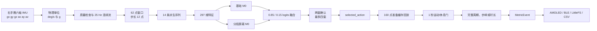
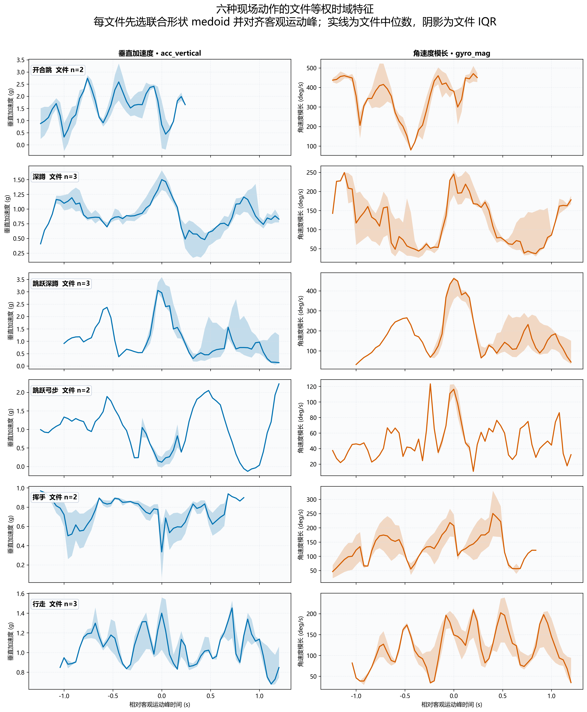
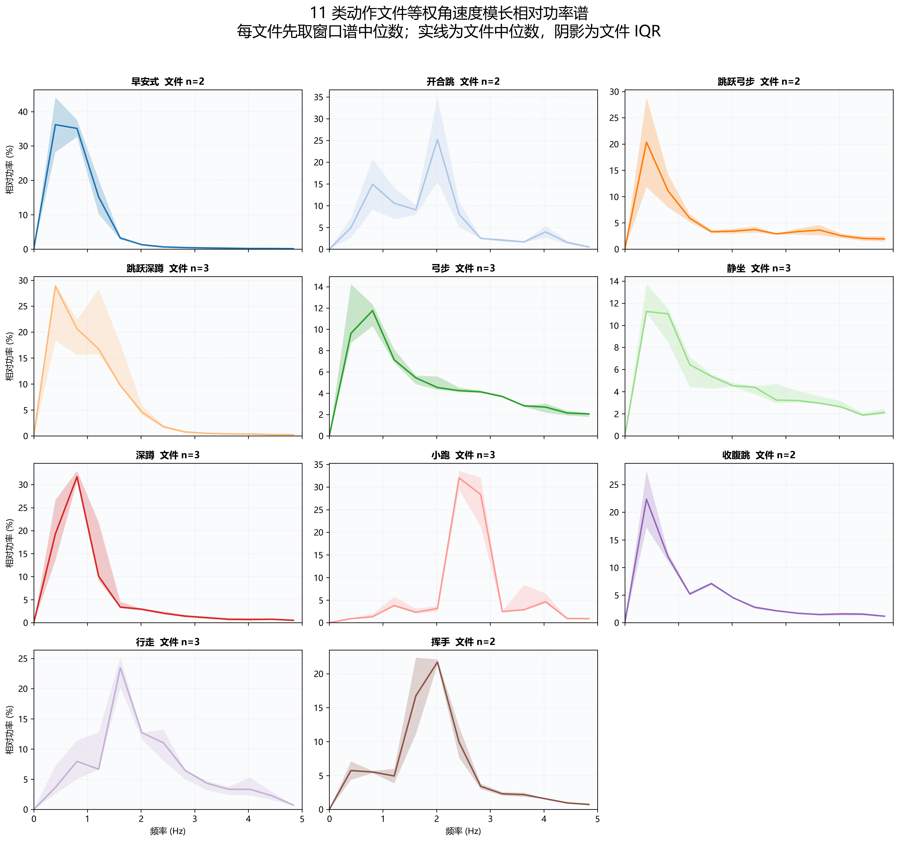
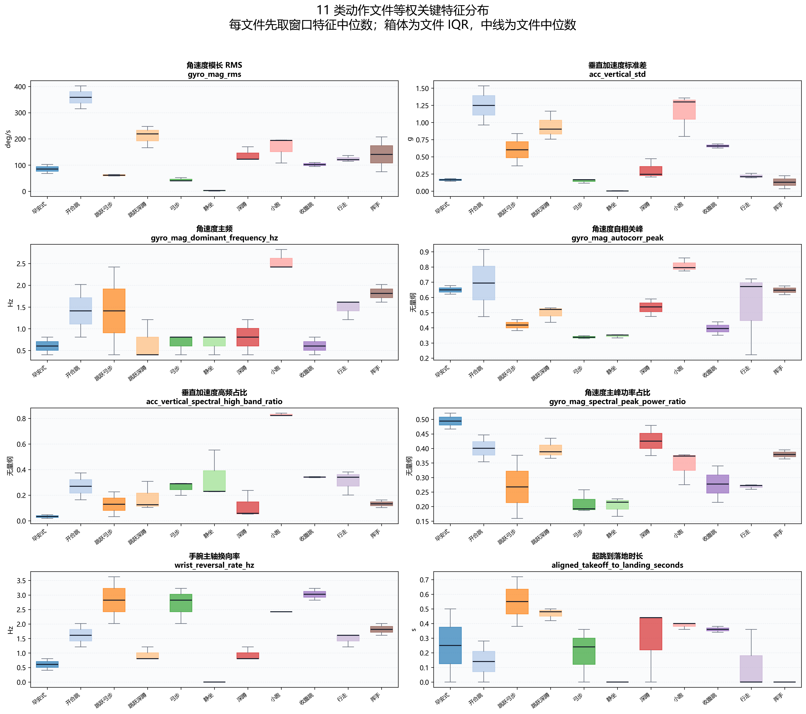
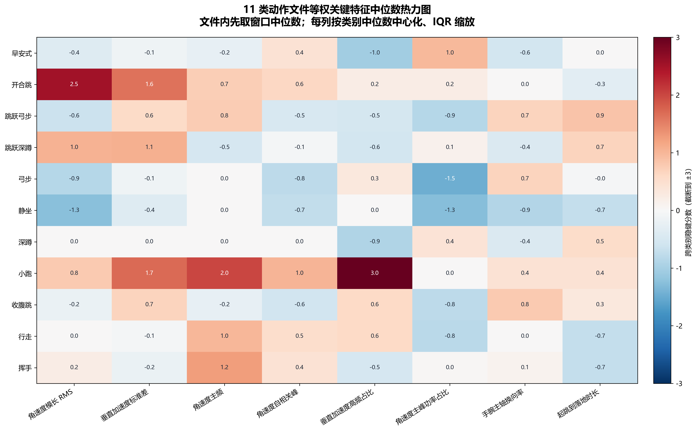

# 算法原理、训练与实时计数

本文记录仓库当前实现的算法合同：右手腕六轴 IMU、297 维特征、双 M0 分类、主动作确认、运动/休息门、实时计数、热量、资源约束和验证方法。

产品合同：

- 手表佩戴在右手腕。
- 一次会话只做一种主动作。
- 准备态自动确认主动作；确认后的 `selected_action` 在本次会话内保持不变。
- 运行态的 `inferred_action` 只用于诊断，不切换动作名、计数器，也不直接产生计数事件。
- 休息和瞬时噪声不能增加动态动作次数；其它类别或低置信分类只记录诊断值。
- 恢复运动后从新的完整周期继续，休息两侧的半个动作不能拼成一次。
- 10 次动作的计数验收范围为 8～12 次；休息尾段必须新增 0 次。
- 实体没有振动马达；`haptic_enabled` 固定为 `false`，BLE 能力位不声明振动，计数事件不触发执行器。

## 开源教程：从一个原始样本到一次权威计数

完整算法由十四个串联步骤组成。BP 网络负责类别证据，计数还要经过主动作确认、准备期回放、活动门、相位闭合和唯一事件投影。分类错、计数慢、休息多计或跨端显示不一致时，可以沿这条链找到首次出错的责任层。

| 步骤 | 输入 → 输出 | 为什么要做 | 做完后的效果 | 如何验证；省略后的典型故障 |
|---:|---|---|---|---|
| 1. 原始量程换算 | 数据集或 QMI8658 原始整数 → `deg/s`、`g` | 模型阈值和物理特征只对确定单位有意义；不同采集源和量程可使用不同 LSB 比例 | 各采集源先进入同一物理单位域，再交给共同算法 | 分别用数据集合同和板载量程逐点核对；省略会造成幅值、能量和计数阈值整体漂移 |
| 2. 时间轴统一 | 异步 accel/gyro → 25 Hz 六轴点 | 两类传感器并非严格同时到达；直接按数组位置拼接会产生伪相位差 | 每 40 ms 得到同一时刻的六轴估计，并带质量位 | 检查单调时间、间隔和缺口位；省略会让相位、相关性和峰谷时刻失真 |
| 3. 孤立毛刺抑制 | 六轴连续流 → 保留动作边沿的干净流 | 单轴电气毛刺会极度放大极值和频谱；真实起跳通常是多轴共同变化，不能一起删掉 | 去掉不具备邻域支持的单轴尖点，同时保留落地冲击 | 对比替换前后曲线和质量位；过度清洗会把跳跃动作变“平” |
| 4. 文件级划分 | 采集文件 → train/val/test 角色 | 重叠窗口相邻点高度重复，随机按窗口划分会把近似副本泄漏到测试集 | 指标衡量对新记录的泛化，而不是对相邻窗口的记忆 | 核对文件 ID 不跨集合；错误划分常表现为离线很高、真板很差 |
| 5. 动作区裁剪与窗口化 | 连续记录 → 62×6 窗口 | 单点没有动作阶段；无限长序列又不适合固定内存 BP | 约 2.48 秒上下文覆盖局部完整动作，12 点步长带来约 0.48 秒更新 | 画出窗口边界；太短会只见半个周期，太长会增加延迟并混入更多休息 |
| 6. 生成重力相对序列 | 三轴 accel/gyro → 14 条派生序列 | 同一动作在手腕坐标中会随佩戴角度改变符号；人体运动更关心沿重力、垂直重力和模长 | 部分姿态差异被转换为相对方向、幅度和转动强度 | 旋转同一窗口并比较派生量；只用原始单轴时模型更容易记住佩戴方向 |
| 7. 提取 297 维特征 | 62×14 序列 → 297 维向量 | 小数据和小 MCU 不适合依赖大型时序网络；统计特征可显式表达幅度、形状、周期和冲击 | 一个固定大小、可解释、可在 Python/C 双端复现的分类输入 | 核对特征名、顺序和图表；错一维顺序也会使正确权重产生错误类别 |
| 8. 标准化 | 原始特征 → 零中心、可比尺度特征 | 角速度能量、相关系数和持续时间的量纲差异很大，大数值维会支配全连接层 | 优化更稳定，每个特征按训练分布的相对偏离参与判断 | Python/C 逐维比较；误用测试均值会数据泄漏，近零标准差未保护会除零 |
| 9. 双 M0 前向与融合 | 297 维 → 11 类融合 logits | 两个轻量分支看到的特征子空间不同，可降低单一特征组偶然失真的影响 | 仍保持固定内存和有界计算，同时获得互补类别证据 | 比较两分支和融合 logits；只看 Top-1 会掩盖分支冲突和低间隔决策 |
| 10. 有界主动作确认 | 连续窗口 logits → `selected_action` | 开始瞬间常包含抬手、点按和起步，首窗锁类风险高；无限等待又破坏实时性 | 连续可信证据优先，最多四窗完成有界决策，动作名在本会话保持稳定 | 记录窗口序号、概率和确认时刻；首窗直锁易把瞬态噪声固定整场 |
| 11. 准备缓存回放 | 确认前原始点 → 对应计数器历史输入 | 等待分类期间用户已经在运动；若从确认时刻才启动计数，会系统性漏掉开头几次 | 最多 160 点按原单调时间回放，分类延迟不等于同等计数损失 | 对齐原始点和前几次 `MetricEvent`；缓存过短或重置整段会造成固定起步漏计 |
| 12. 活动、质量和相位判定 | 每个 25 Hz 点 → 完整周期/步峰候选 | 类别只回答“像什么动作”，不能回答“此刻是否完成一次”；休息也可能被模型归到某类 | 静止、缺口和无效点关闭动态计数许可；恢复后重新建立完整周期 | 在动作—休息—动作记录上检查休息新增为 0；缺少门控会出现站着仍加数 |
| 13. 不应期与权威事件 | 周期候选 → `MetricEvent(total_value)` | 峰附近抖动可能产生多个候选，多个消费者各自加一还会重复累计 | 一个完整动作最多产生一个带原始时刻和累计值的事实事件 | 核对事件间隔与累计单调性；省略会出现一次动作连跳两三次 |
| 14. 跨端投影 | `MetricEvent` → AMOLED/BLE/LittleFS/CSV | 显示、传输和存储是消费者，不应重新解释动作或计数 | 手表、上位机、历史和导出使用同一个累计事实 | 按事件 ID、会话序号和累计值对齐；消费者自行 `+=1` 会在重试后分叉 |

### 为什么不用原始窗口直接训练更大的时序网络

CNN、RNN 和 Transformer 都可用于动作识别。当前项目选择可解释特征加轻量 BP，依据是下面四项工程约束：

1. **数据规模**：当前数据按采集文件计并不大。更复杂的网络参数更多，更容易学习文件、人员或佩戴姿态的偶然模式。
2. **端侧资源**：297 维特征和全连接层拥有固定 RAM、Flash 与运算上界，ESP32 能在其它 UI、BLE 和存储任务同时运行时保持可预算性。
3. **跨语言一致性**：均值、分位数、自相关、FFT 频带和全连接层都能在 Python 与 C 中逐项比较；复杂算子的运行库差异更难定位。
4. **故障解释**：若开合跳漏计，可以区分“分类未确认、准备缓存不足、活动门关闭、周期未闭合或事件未投影”，而不是只得到一个神经网络分数。

代价也必须明确：手工特征和轻量 BP 的表达能力有限，是否优于端到端网络只能由受试者隔离的数据实验决定。教程选择当前结构，是在数据量、端侧资源、可解释性和工程验证之间做出的实现取舍，不是对所有动作识别任务的普遍结论。

### 怎样容纳不同人的轻微动作差异

系统不把“标准姿势模板完全重合”作为计数条件。它通过五层有限泛化机制吸收正常差异：

| 层 | 原理 | 容纳的差异 | 对结果的作用 |
|---|---|---|---|
| 数据层 | 文件级多样本与联合三维旋转、轻微时间伸缩、陀螺/加速度噪声增强 | 手腕角度小幅变化、动作快慢变化、传感器噪声 | 让分类边界看到同类动作的邻域，而非只记一条曲线 |
| 表示层 | 重力方向投影、垂直分量、向量模长、相关性和相对频谱 | 单轴符号变化、幅度差、起始相位差 | 把“绝对姿态”转成更接近人体运动机制的描述 |
| 分类层 | 双分支固定融合与多窗证据确认 | 某组特征偶然失真、起步瞬态和单窗抖动 | 降低一次异常窗口决定整场动作的概率 |
| 计数层 | 在线学习主方向和运动尺度，阈值随近期幅度缓慢更新，并用迟滞确认换向 | 深浅、摆幅和速度的合理个体差异 | 不要求每个人越过同一绝对角速度或完全相同的峰值 |
| 会话层 | `selected_action` 选择本轮计数器；活动门独立判断运动/休息 | 休息、站立、小幅无关摆动和瞬时异类预测 | 主动作名不跳变，休息不增数，恢复后从新周期继续 |

其中“自适应”不是无限放宽。当前可支持的边界是：右手腕、已训练的 11 类、传感器未饱和、动作有可观测的完整往返或步峰、节奏没有快到超过 25 Hz 时间分辨率。以下情况不能靠调低阈值解决：

- 左右手镜像域没有可靠标注；
- 新用户的动作分布完全落在训练范围之外；
- 只做半程动作，却希望系统按完整动作计数；
- 手表松动、旋转或撞击产生与目标动作同量级的伪运动；
- 数据集没有受试者 ID，却把文件级测试结果宣称为严格跨人泛化。

“10 次允许 8～12 次”是产品验收容差，不是允许算法长期固定少计或多计。若多个用户都在同一动作、同一阶段出现同方向偏差，应优先补充带受试者、会话和佩戴侧标签的数据，再做受试者隔离验证；不应围绕一份现场日志硬编码阈值。

### 一次计数为什么能实时显示

分类和计数使用两种时间尺度：

- 分类每 12 点更新一次，即约 `0.48 s`，用于确认“本轮是什么动作”；
- 计数器在主动作确认后接收每个 `40 ms` 采样点，用于确认“一个动作是否刚刚完成”。

因此，网络不需要每做一次动作才重新分类。分类只建立会话语义，计数由连续相位状态机逐点推进。准备期回放补齐确认前的历史；运行期新周期闭合后立即产生 `MetricEvent`。若界面要等多个动作后才更新，应沿“采样时间 → 周期闭合 → 事件产生 → UI 投影”逐层检查，而不是先假定 BP 前向过慢。

## 1. 系统总览

### 1.1 数据流



分类窗口每 0.48 秒更新一次。第一次分类至少需要 62 个 25 Hz 点：

$$
T_w=\frac{62}{25}=2.48\ \mathrm{s}
$$

后续窗口步长为 12 点：

$$
T_s=\frac{12}{25}=0.48\ \mathrm{s}
$$

正常情况下，两个连续可信窗口约在 2.96 秒确认主动作。低置信或类别不稳定时，第四个窗口使用累计平均 logits 完成有界确认，准备态不会无限等待。

### 1.2 关键源码

| 文件 | 责任 |
|---|---|
| [python/train_export.py](../python/train_export.py) | 数据读取、文件级划分、前处理、297 维特征、训练和 C 导出 |
| [python/visualize_action_features.py](../python/visualize_action_features.py) | 使用冻结验证角色生成本文四张正式图 |
| [python/dual_m0_export.py](../python/dual_m0_export.py) | 导出双 M0 便携包、C 头和完整性清单 |
| [esp32/include/esp32_bp_features.h](../esp32/include/esp32_bp_features.h) | ESP32 297 维特征、阈值和分类辅助 |
| [esp32/include/esp32_dual_m0_model.h](../esp32/include/esp32_dual_m0_model.h) | 双 M0 权重、前向和固定融合 |
| [esp32/include/dual_m0_manifest.json](../esp32/include/dual_m0_manifest.json) | 模型维度、类别、掩码、权重和哈希 |
| [esp32/firmware/components/workout_engine/workout_engine.c](../esp32/firmware/components/workout_engine/workout_engine.c) | 主动作确认、准备缓存、活动门和计数编排 |
| [esp32/firmware/components/motion_phase/motion_phase.c](../esp32/firmware/components/motion_phase/motion_phase.c) | 自适应完整周期和步峰 |
| [esp32/firmware/components/fitness_core/src/fitness_core.c](../esp32/firmware/components/fitness_core/src/fitness_core.c) | 次数、步数、时长、事件和热量 |
| [esp32/host_tests/workout_engine/test_workout_engine.c](../esp32/host_tests/workout_engine/test_workout_engine.c) | 单动作、休息、噪声、恢复和准备回放测试 |
| [esp32/host_tests/device_coordinator/test_device_coordinator.c](../esp32/host_tests/device_coordinator/test_device_coordinator.c) | 分类、计数、UI、BLE 和会话跨层测试 |

## 2. 输入合同与类别

### 2.1 六轴顺序和单位

第 $t$ 个样本固定表示为：

$$
\mathbf{x}_t=
[g_{x,t},g_{y,t},g_{z,t},a_{x,t},a_{y,t},a_{z,t}]
$$

- $g_x,g_y,g_z$：三轴角速度，单位 $\mathrm{deg/s}$。
- $a_x,a_y,a_z$：三轴加速度，单位 $g$。
- 形状：`[采样点数, 6]`。
- 采样率：25 Hz。
- 时间戳：设备单调毫秒。

数据文件的原始整数按量程换算：

$$
g_c=\frac{g_{c,\mathrm{raw}}}{16.4},
\qquad
a_c=\frac{a_{c,\mathrm{raw}}}{4096}
$$

单位换算必须先于毛刺判断、活动判断和特征提取。少于六列、非有限值、通道顺序不明或量程不一致的输入必须拒绝。

### 2.2 类别和指标

网络输出顺序由模型清单固定：

| 索引 | 类别键 | 中文名称 | 会话主指标 |
|---:|---|---|---|
| 0 | `good_morning` | 早安式 | 完整往返次数 |
| 1 | `jumping_jack` | 开合跳 | 完整往返次数 |
| 2 | `jumping_lunge` | 跳跃弓步 | 完整往返次数 |
| 3 | `jumping_squat` | 跳跃深蹲 | 完整往返次数 |
| 4 | `lunge` | 弓步 | 完整往返次数 |
| 5 | `sit` | 静坐 | 有效时长 |
| 6 | `squat` | 深蹲 | 完整往返次数 |
| 7 | `trot` | 小跑 | 步数 |
| 8 | `tuck_jump` | 收腹跳 | 完整往返次数 |
| 9 | `walk` | 行走 | 步数 |
| 10 | `wave` | 挥手 | 完整往返次数 |

Python、参数包、C 头文件、ESP32、BLE 和上位机必须使用完全相同的顺序。

## 3. 数据划分与前处理

### 3.1 文件级划分

一个采集文件会产生大量重叠窗口。若按窗口随机划分，几乎相同的相邻窗口会同时进入训练集和测试集，指标会虚高。

数据先按文件分组，再按约 70% / 15% / 15% 划分训练、验证和测试：

- 训练集：拟合网络参数、特征均值和标准差。
- 验证集：选择模型、融合权重和确认规则。
- 测试集：全部参数冻结后计算一次最终指标。
- 外部留出：检查新会话和佩戴差异。

同一个文件的全部窗口只能属于一个角色。

### 3.2 单轴孤立尖峰

对内部点 $t$ 和通道 $c$，计算双侧均值、中心偏差和邻点差异：

$$
m_{t,c}=\frac{x_{t-1,c}+x_{t+1,c}}{2}
$$

$$
r_{t,c}=|x_{t,c}-m_{t,c}|,
\qquad
d_{t,c}=|x_{t-1,c}-x_{t+1,c}|
$$

阈值为：

$$
T_c=
\begin{cases}
300\ \mathrm{deg/s},&c\in\{g_x,g_y,g_z\}\\
1.5g,&c\in\{a_x,a_y,a_z\}
\end{cases}
$$

只有当前时刻恰好一个通道同时满足

$$
r_{t,c}>T_c,
\qquad
d_{t,c}<0.5T_c
$$

才使用

$$
\hat{x}_{t,c}=m_{t,c}
$$

替换中心点。首末点、多轴共同突变和真实变化边沿保持原值，避免把起跳、落地或快速摆腕删除。

### 3.3 离线动作区裁剪

逐点活动分数为：

$$
s_t=
\|\mathbf{a}_t-\mathbf{a}_{t-1}\|_2+
\frac{\|\mathbf{g}_t\|_2}{200}
$$

训练集静坐数据的第 90 百分位给出逐点阈值 $T_\mathrm{active}$，并设 0.005 下限。使用 25 点滑动块；块内至少 20% 的点满足 $s_t>T_\mathrm{active}$ 才视为活动。动态动作文件保留首个活动点前 0.5 秒到末个活动点后 0.5 秒，`sit` 不裁剪。

该裁剪只用于完整离线文件。实时流使用第 7 节的因果运动/休息门。

### 3.4 重叠窗口与静止过滤

窗口长度 $N=62$，步长 $S=12$。第 $k$ 个窗口为：

$$
[kS,kS+N)
$$

长度为 $L$ 的记录可产生：

$$
M=\left\lfloor\frac{L-N}{S}\right\rfloor+1
$$

个窗口。$L<N$ 时不产生窗口。

窗口运动分数为：

$$
S_w=
\operatorname{std}(\|\mathbf{a}_t\|_2)+
\frac{\operatorname{std}(\|\mathbf{g}_t\|_2)}{200}
$$

静止门 $T_\mathrm{rest}$ 由训练集静坐窗口第 85 百分位估计，并设 0.01 下限：

- `sit` 保留 $S_w\le1.6T_\mathrm{rest}$ 的窗口。
- 动态动作去掉 $S_w<T_\mathrm{rest}$ 的窗口。
- 四类跳跃动作还需 $S_w\ge1.25T_\mathrm{rest}$，且逐点活动比例不低于 20%。

### 3.5 训练增强

训练集使用以下物理一致增强：

- 陀螺仪和加速度计同步三维旋转，最大约 $\pm35^\circ$。
- 归一化时间形变不超过 0.03。
- 陀螺高斯噪声标准差约 0.25 $\mathrm{deg/s}$。
- 加速度高斯噪声标准差约 0.003 $g$。

两类传感器必须共享同一旋转矩阵：

$$
\mathbf{g}'_t=\mathbf{R}\mathbf{g}_t,
\qquad
\mathbf{a}'_t=\mathbf{R}\mathbf{a}_t
$$

这些增强允许速度、佩戴角度和传感器噪声出现自然差异，不要求每个人复制完全相同的动作幅度。

### 3.6 实时连续性

板端先对异步加速度和陀螺数据做低通与线性重采样，再形成严格 25 Hz 六轴点。以下事实会切断未完成周期：

- 非有限值。
- 重复或倒退时间戳。
- 加速度或陀螺丢样。
- 队列溢出。
- 驱动明确丢帧。
- 重采样器重置。

边界只清空未完成相位和活动窗，不回滚已发布次数。

## 4. 14 条派生序列与 297 维特征

### 4.1 派生序列

原始六轴：

$$
g_x,g_y,g_z,a_x,a_y,a_z
$$

模长：

$$
g_m(t)=\sqrt{g_x(t)^2+g_y(t)^2+g_z(t)^2}
$$

$$
a_m(t)=\sqrt{a_x(t)^2+a_y(t)^2+a_z(t)^2}
$$

相邻变化模长：

$$
\Delta g_m(t)=\|\mathbf{g}_t-\mathbf{g}_{t-1}\|_2
$$

$$
\Delta a_m(t)=\|\mathbf{a}_t-\mathbf{a}_{t-1}\|_2
$$

窗口平均加速度给出重力单位方向：

$$
\mathbf{u}_g=
\frac{\bar{\mathbf{a}}}{\|\bar{\mathbf{a}}\|_2}
$$

当分母小于 $10^{-6}$ 时使用 $[0,0,1]$。垂直与水平分量为：

$$
a_v(t)=\mathbf{a}_t^\mathsf{T}\mathbf{u}_g
$$

$$
a_h(t)=
\sqrt{\max(\|\mathbf{a}_t\|_2^2-a_v(t)^2,0)}
$$

$$
g_v(t)=\mathbf{g}_t^\mathsf{T}\mathbf{u}_g
$$

$$
g_h(t)=
\sqrt{\max(\|\mathbf{g}_t\|_2^2-g_v(t)^2,0)}
$$

最终序列顺序：

```text
gx, gy, gz, ax, ay, az,
gyro_mag, acc_mag,
gyro_delta_mag, acc_delta_mag,
acc_vertical, acc_horizontal_mag,
gyro_vertical, gyro_horizontal_mag
```

### 4.2 特征分组

| 索引范围 | 维度 | 内容 |
|---|---:|---|
| `0:112` | 112 | 14 条序列的基础统计 |
| `112:160` | 48 | 四等分原始统计 |
| `160:184` | 24 | 时序与频谱 |
| `184:232` | 48 | 四等分归一化统计 |
| `232:264` | 32 | 冲击与分布 |
| `264:297` | 33 | 频带、周期、耦合、腾空、换向 |

$$
112+48+24+48+32+33=297
$$

特征名称和索引以 `build_feature_names()` 与模型清单为准。

### 4.3 112 项基础统计

对每条序列 $x_0,\ldots,x_{N-1}$ 计算八项：

$$
\mu=\frac{1}{N}\sum_{t=0}^{N-1}x_t
$$

$$
\sigma=
\sqrt{\frac{1}{N}\sum_t(x_t-\mu)^2}
$$

$$
\mathrm{RMS}=
\sqrt{\frac{1}{N}\sum_t x_t^2}
$$

$$
D_\mathrm{abs}=
\frac{1}{N-1}\sum_{t=1}^{N-1}|x_t-x_{t-1}|
$$

$$
Z=
\frac{1}{N-1}
\sum_{t=1}^{N-1}
\mathbb{I}[(x_{t-1}-\mu)(x_t-\mu)<0]
$$

$$
\sigma_\Delta=
\operatorname{std}(x_t-x_{t-1})
$$

再加最小值和最大值，共 $14\times8=112$ 项。

### 4.4 四等分统计

选择：

```text
acc_vertical
acc_horizontal_mag
gyro_mag
acc_delta_mag
```

四条关键序列。每条按时间等分为四段，每段计算均值、标准差和最大绝对值：

$$
4\text{ 条序列}\times4\text{ 段}\times3\text{ 项}=48
$$

归一化组先执行：

$$
q_t=\frac{x_t-\mu_x}{\sigma_x}
$$

当 $\sigma_x\le10^{-6}$ 时整条置零，再计算同样的 48 项。原始分段统计保留幅度，归一化分段统计强调形状。

### 4.5 24 项时序与频谱

每条关键序列计算：

1. 高活动比例。
2. 归一化峰数。
3. 主频。
4. 归一化谱熵。
5. 最强自相关峰。
6. 自相关峰延迟。

主频：

$$
f_d=\frac{k_df_s}{N},
\qquad
k_d=\arg\max_{k>0}P[k]
$$

谱熵：

$$
H=
-\frac{\sum_kp_k\ln p_k}{\ln K},
\qquad
p_k=\frac{P[k]}{\sum_jP[j]}
$$

近常量序列的非直流总功率不超过 $10^{-12}$ 时，主频和谱熵返回 0。四条序列共 $4\times6=24$ 项。

### 4.6 32 项冲击与分布

每条关键序列计算 10%、25%、50%、75%、90% 分位数、偏度、超额峰度和最大相邻跳变：

$$
\mathrm{Skew}=
\frac{1}{N}\sum_t
\left(\frac{x_t-\mu}{\sigma}\right)^3
$$

$$
\mathrm{Kurt}_{ex}=
\frac{1}{N}\sum_t
\left(\frac{x_t-\mu}{\sigma}\right)^4-3
$$

$$
J_\mathrm{max}=
\max_t|x_t-x_{t-1}|
$$

当 $\sigma\le10^{-6}$ 时偏度和峰度返回 0。四条序列共 $4\times8=32$ 项。

### 4.7 33 项运动机理特征

#### 4.7.1 频带与谱形

去均值序列乘 Hann 窗：

$$
X[k]=
\sum_{n=0}^{N-1}
(x[n]-\bar{x})w[n]e^{-j2\pi kn/N}
$$

$$
P[k]=|X[k]|^2
$$

频带：

- 低频：$0.35\le f<1.20$ Hz。
- 中频：$1.20\le f<2.40$ Hz。
- 高频：$2.40\le f<5.00$ Hz。

频带比例：

$$
R_{[f_l,f_h)}=
\frac{\sum_{k:f_l\le f_k<f_h}P[k]}
{\sum_{k>0}P[k]+\epsilon},
\qquad
\epsilon=10^{-12}
$$

谱质心：

$$
f_\mathrm{centroid}=
\frac{\sum_{k>0}f_kP[k]}
{\sum_{k>0}P[k]+\epsilon}
$$

主谱峰占比：

$$
R_\mathrm{peak}=
\frac{\max_{k>0}P[k]}
{\sum_{k>0}P[k]+\epsilon}
$$

这些量区分慢速屈伸、稳定重复、快速换向和落地冲击。

#### 4.7.2 自相关

去均值序列 $\tilde{x}$ 的归一化自相关：

$$
R(\ell)=
\frac{\sum_{t=0}^{N-\ell-1}\tilde{x}_t\tilde{x}_{t+\ell}}
{\sum_{t=0}^{N-1}\tilde{x}_t^2+\epsilon}
$$

特征包含首次过零、局部峰值、峰延迟和显著峰数，用于描述重复节奏与稳定性。

#### 4.7.3 通道耦合

在 $\pm1$ 秒内计算垂直加速度与角速度模长、垂直与水平加速度之间的最大有符号互相关：

$$
\rho_{ab}(\ell)=
\frac{\sum_ta_tb_{t+\ell}}
{\sqrt{\sum_ta_t^2}\sqrt{\sum_tb_{t+\ell}^2}+\epsilon}
$$

绝对值最大的相关保留符号。正值表示大体同相，负值表示大体反相。

#### 4.7.4 低支持力、冲击与事件

低支持力标志：

$$
F_t=\mathbb{I}[a_m(t)<0.70g]
$$

总比例和最长连续比例：

$$
R_f=\frac{1}{N}\sum_tF_t
$$

$$
R_{f,\max}=
\frac{\text{最长连续低支持力点数}}{N}
$$

完整起跳—落地片段还提取起跳至落地时间、落地冲击宽度、腾空期水平角速度积分、垂直角速度绝对积分和水平各向异性。

#### 4.7.5 峰值规律与换向

显著正峰门：

$$
T=\bar{x}+0.5\sigma_x
$$

相邻峰间隔 $D_q=p_{q+1}-p_q$ 的变异系数：

$$
CV_D=
\frac{\operatorname{std}(D_q)}
{\operatorname{mean}(D_q)+\epsilon}
$$

还计算峰幅变异、PCA 主轴换向率和回摆形态。峰数量不足时返回 0。

### 4.8 标准化与掩码

第 $i$ 个特征使用训练集统计量标准化：

$$
z_i=\frac{x_i-\mu_i}{\sigma_i}
$$

当 $\sigma_i<10^{-6}$ 时以 1 代替。验证、测试和 ESP32 只能使用导出的 $\mu_i,\sigma_i$。

基础 M0 使用全部 297 项。分段屏蔽 M0 在标准化后把索引 `184:232` 置零：

$$
\tilde{z}_i=
\begin{cases}
0,&184\le i<232\\
z_i,&\text{其它}
\end{cases}
$$

两个模型共享特征顺序，但对窗口内形状位置的依赖不同。

### 4.9 特征合同变更门

任何特征变更必须同时满足：

1. 公式、名称、索引、单位、边界值和复杂度完整。
2. 文件级验证的总体准确率、宏 F1、逐类召回和最弱类均不退化。
3. Python 与 C 对真实窗口逐值一致。
4. 模型参数、均值、标准差、掩码、类别顺序和哈希重新导出。
5. 图表、模型清单、测试和本文同步更新。

## 5. 真实验证集曲线与特征差异

四张图由 [python/visualize_action_features.py](../python/visualize_action_features.py)生成。脚本只读取冻结的文件级验证角色；训练集、测试集和外部留出不混入图表。

同一文件会产生大量重叠窗口，因此每张图都先把一个文件压缩为一份文件级表示，每个文件对所属类别贡献相同权重：

- 时域图：按 `acc_vertical` 与 `gyro_mag` 的联合形状客观选择一个 medoid 窗口，再按固定峰规则平移对齐。
- 功率谱图：对同一文件全部有效窗口逐频点取中位数。
- 特征分布与热力图：对同一文件全部有效窗口逐特征取中位数。

设类别 $c$ 的文件集合为 $\mathcal{F}_c$，文件级表示为 $\phi_{c,f}$。类别中心与四分位区间只在文件维计算：

$$
\tilde{\phi}_{c}=
\operatorname{median}_{f\in\mathcal{F}_{c}}\phi_{c,f}
$$

实线为跨文件中位数，阴影或箱体为 25%～75% 区间。medoid 选择与时间平移只服务于图形展示，不改变训练输入、特征、标签、模型参数或验证指标。

精确数据指纹、文件清单、文件数、窗口数、统计参数和图像哈希见 [figure_manifest.json](assets/algorithm/figure_manifest.json)。

### 5.1 六类派生信号



图中比较开合跳、深蹲、跳跃深蹲、跳跃弓步、挥手和行走。横轴为窗口内时间，单位秒；`acc_vertical` 为 $g$；`gyro_mag` 为 $\mathrm{deg/s}$。

图可用于观察幅值、周期、冲击、垂直运动与手腕转动的关系。阴影重叠表示不同执行方式可能覆盖类别中心差异，因此分类不能依赖单一峰值。

### 5.2 十一类相对功率谱



横轴为 0～5 Hz，纵轴为非直流总功率中的百分比。相对功率消除绝对幅度支配，可比较主要节奏、峰宽和谐波；它不能表示动作力度。

### 5.3 关键特征分布



箱线图覆盖强度、垂直波动、主频、自相关、频带、谱峰、手腕换向和起跳—落地时间。每个子图保留原单位。类别箱体重叠时，不能使用一个固定阈值替代 297 维模型。

### 5.4 特征中位数热力图



每格先计算类别文件级中位数 $M_{c,j}$，再仅为显示做稳健缩放：

$$
H_{c,j}=
\operatorname{clip}
\left(
\frac{M_{c,j}-\operatorname{median}_r(M_{r,j})}
{\operatorname{IQR}_r(M_{r,j})+\epsilon},
-3,3
\right)
$$

该颜色值无量纲，不是模型标准化值。热力图展示多种证据的组合方向，不能展示单文件离散程度，必须和箱线图一起阅读。

图表只能说明当前验证数据中的可见差异，不能单独证明跨人员泛化、真板识别率或计数准确率。数据没有可靠受试者标识时，不宣称严格跨人员盲测。

## 6. 双 M0 分类与主动作确认

### 6.1 六分支网络

297 项特征按六组独立编码：

| 分支 | 输入 | 输出 |
|---:|---:|---:|
| 1 | 112 | 24 |
| 2 | 48 | 12 |
| 3 | 24 | 8 |
| 4 | 48 | 12 |
| 5 | 32 | 8 |
| 6 | 33 | 16 |

第 $j$ 个分支：

$$
\mathbf{h}_j=
\operatorname{ReLU}
(\mathbf{W}_j\mathbf{x}_j+\mathbf{b}_j)
$$

串接后：

$$
\mathbf{h}=
[\mathbf{h}_1;\ldots;\mathbf{h}_6]
\in\mathbb{R}^{80}
$$

融合层：

$$
\mathbf{u}_1=
\operatorname{ReLU}
(\mathbf{W}_{80\rightarrow64}\mathbf{h}+\mathbf{b}_{64})
$$

$$
\mathbf{u}_2=
\operatorname{ReLU}
(\mathbf{W}_{64\rightarrow32}\mathbf{u}_1+\mathbf{b}_{32})
$$

输出：

$$
\mathbf{z}=
\mathbf{W}_{32\rightarrow11}\mathbf{u}_2+\mathbf{b}_{11}
$$

单个部署主路径含 12,523 个参数和 12,336 次 MAC；双模型含 25,046 个参数、24,672 次 MAC，float32 权重与偏置约 100,184 B。

### 6.2 训练目标

softmax：

$$
p_c=
\frac{e^{z_c-z_{\max}}}
{\sum_j e^{z_j-z_{\max}}}
$$

交叉熵：

$$
L_\mathrm{CE}=-\log p_y
$$

跨文件监督对比项对同类不同文件的归一化嵌入计算：

$$
s_{ij}=
\frac{\mathbf{v}_i^\mathsf{T}\mathbf{v}_j}{\tau},
\qquad
\tau=0.15
$$

易混类别间隔项：

$$
L_\mathrm{margin}=
\max(0,m-z_y+z_q)
$$

总损失：

$$
L=
L_\mathrm{CE}
+0.05L_\mathrm{SupCon}
+0.25L_\mathrm{margin}
+0.10L_\mathrm{aux}
$$

其中 $L_\mathrm{aux}$ 汇总“是否跳跃、是否强腾空、是否左右交替、弓步/深蹲、跳跃深蹲/收腹跳”五个训练属性。属性头只约束 32 维嵌入，不进入 ESP32 推理输出。

训练使用 AdamW，学习率 $10^{-3}$、权重衰减 $10^{-4}$、批量 64、最大 350 epoch、早停耐心 45。检查点排序依次考虑最低类别召回、重点类别平均召回、宏 F1 和总体准确率，避免多数类掩盖弱类。

### 6.3 固定融合

基础模型和分段屏蔽模型分别输出 $\mathbf{z}^{(b)}$ 与 $\mathbf{z}^{(m)}$：

$$
\mathbf{z}=
0.85\mathbf{z}^{(b)}
+0.15\mathbf{z}^{(m)}
$$

权重、类别顺序和掩码由模型清单固定。任一 logit 为 NaN 或无穷值时整窗拒绝。

### 6.4 准备态确认

每个窗口先得到独立 Top-1 类别和 softmax 概率：

$$
\hat{y}_t=\arg\max_cz_{t,c}
$$

正常确认条件：

1. 独立窗口概率不低于 50%，对应 Q15 值 32768。
2. 同一独立 Top-1 类别连续出现两个窗口。

同时保留准备态累计和：

$$
\mathbf{S}_t=\mathbf{S}_{t-1}+\mathbf{z}_t,
\qquad
\bar{\mathbf{z}}_t=\frac{\mathbf{S}_t}{t}
$$

若前三个窗口未满足正常条件，第四个窗口使用

$$
\hat{y}_\mathrm{bounded}=
\arg\max_c\bar{z}_{4,c}
$$

确认动作。确认结果写入 `selected_action`，决定本次会话的动作名、计数器和摘要。

### 6.5 准备缓存与运行态诊断

点击开始后立即缓存 25 Hz 六轴点。静态缓存容量为 160 点：

$$
T_\mathrm{cache}=\frac{160}{25}=6.40\ \mathrm{s}
$$

确认动作后，缓存按原设备时间送入计数链，准备态已经完成的完整动作可以产生带原时间戳的 `MetricEvent`。

进入运行态后：

- `selected_action` 保持不变。
- `inferred_action` 保存最新独立窗口类别，只进入 UI/CSV 诊断。
- 其它类别输出不切换动作，不切换计数器，也不直接关闭计数。
- 是否允许计数只由数据质量和第 7 节的运动/休息门决定。

这个分离满足“一次会话只做一种动作”的产品语义，并阻止瞬时分类噪声把界面变成“静坐 3 次”或其它动作。

## 7. 运动/休息门

### 7.1 一秒因果窗

活动门保存最近 25 个干净点，即 1 秒。每点计算：

$$
A_t=\|\mathbf{a}_t\|_2,
\qquad
G_t=\|\mathbf{g}_t\|_2
$$

$$
q_t=
\|\mathbf{a}_t-\mathbf{a}_{t-1}\|_2+
\frac{G_t}{200}
$$

当前导出阈值：

$$
T_\mathrm{point}=0.131654367
$$

窗口分数：

$$
S_\mathrm{motion}=
\operatorname{std}(A)+
\frac{\operatorname{std}(G)}{200}
$$

当前导出静止门：

$$
T_\mathrm{rest}=0.0841871575
$$

### 7.2 开门、关门和迟滞

动态动作打开计数门必须同时满足：

$$
S_\mathrm{motion}\ge T_\mathrm{rest}
$$

且 25 点中至少 5 点满足：

$$
q_t>T_\mathrm{point}
$$

已经观察到真实运动后，只有完整 1 秒窗同时满足

$$
S_\mathrm{motion}<T_\mathrm{rest}
$$

和活动点数为 0，才确认休息并关闭计数门。介于两者之间时保持原门状态，形成迟滞，避免慢动作端点附近反复开关。

`sit` 是目标类别本身，不使用动态门冻结时长。

### 7.3 门状态变化

门状态改变时：

```text
保持 selected_action
保持已发布累计
清空未完成相位或步峰
切换计数许可
```

因此：

- 静止噪声不能增加次数。
- 休息前半个动作不能和恢复后半个动作组合成一次。
- 恢复后第一个完整周期可以正常加一。
- 运行态的其它类别输出不影响主动作和累计值。

## 8. 实时计数

### 8.1 八类完整往返

早安式、开合跳、跳跃弓步、跳跃深蹲、弓步、深蹲、收腹跳和挥手统一使用右腕完整往返。

角速度向量：

$$
\mathbf{g}_t=[g_x,g_y,g_z]^\mathsf{T}
$$

活动点达到 26 $\mathrm{deg/s}$ 后学习单位主方向 $\hat{\mathbf{d}}_t$。新方向与原方向满足

$$
|\mathbf{u}_t^\mathsf{T}\hat{\mathbf{d}}_{t-1}|\ge0.60
$$

才以 0.08 系数更新，避免交叉轴摆腕旋转检测基准。

有符号投影：

$$
p_t=
\mathbf{g}_t^\mathsf{T}\hat{\mathbf{d}}_t
$$

自适应幅度包络：

$$
M_t=
\begin{cases}
0.75M_{t-1}+0.25|p_t|,&|p_t|>M_{t-1}\\
0.99M_{t-1}+0.01|p_t|,&\text{其它}
\end{cases}
$$

端点门：

$$
H_t=\operatorname{clip}(0.45M_t,27,72)
$$

单位为 $\mathrm{deg/s}$。比例门适应不同人的动作幅度和疲劳变化，上下限排除静止抖动与单次极端冲击。

端点判定：

- $p_t\ge H_t$：`PRIMARY`。
- $p_t\le-H_t$：`SECONDARY`。
- 每个端点必须连续两个 25 Hz 真样本确认。

一次有效重复必须闭合：

```text
PRIMARY -> SECONDARY -> REST/返回主向端点
```

角速度模长与加速度模长满足

$$
G_t\le22\ \mathrm{deg/s},
\qquad
|A_t-1|\le0.24g
$$

时可作为稳定返回基线。只有完整闭合才加一，一个动作中的多个冲击不能分别计数。

周期约束：

| 动作 | 最短完整周期 |
|---|---:|
| 挥手 | 300 ms |
| 开合跳 | 400 ms |
| 跳跃深蹲 | 800 ms |
| 其它重复动作 | 600 ms |

最长周期 10 s，计数后不应期 300 ms。阈值只排除不可能的毛刺，不要求用户严格复制教练速度。

### 8.2 行走与小跑

加速度模长慢基线：

$$
b_t=0.98b_{t-1}+0.02A_t
$$

动态量：

$$
d_t=A_t-b_t
$$

局部峰需满足：

$$
d_{t-1}\ge0.16g
$$

接受一个峰后关闭武装，只有 $d_t\le0$ 才重新武装。最短步间隔：

- 行走 240 ms。
- 小跑 150 ms。

慢基线、回落重武装和时间不应期共同允许步幅和步速差异，并防止一个宽峰被拆成两步。

### 8.3 静坐

静坐不使用周期计数器。会话累计有效毫秒，并以整秒作为主指标。运行态其它类别输出不能把本轮主动作改成静坐。

### 8.4 唯一事件事实

完整重复、步峰或整秒时长只在领域层生成一次：

```text
相位 / 步峰 / 整秒确认
  -> fitness_session_record_count
  -> MetricEvent(event_seq, monotonic_ms, action, total)
  -> AMOLED / BLE / LittleFS / CSV
```

`event_seq` 在会话内严格递增。准备缓存回放保留原始 IMU 时间。手表 UI 和上位机只显示事件总值，不自行推测加一。

## 9. 热量

每类动作使用固定 milliMET。体重 $m_g$ 以克计，时间增量 $\Delta t_\mathrm{ms}$ 以毫秒计。毛热量使用整数余数累计：

$$
E_{\mathrm{gross},\mu\mathrm{kcal}}
=
\left\lfloor
\frac{
\mathrm{milliMET}\cdot m_g\cdot\Delta t_\mathrm{ms}\cdot7+r
}
{24\,000\,000}
\right\rfloor
$$

新的余数：

$$
r'=
(\mathrm{milliMET}\cdot m_g\cdot\Delta t_\mathrm{ms}\cdot7+r)
\bmod 24\,000\,000
$$

活动热量使用：

$$
\mathrm{active\ milliMET}=
\max(\mathrm{milliMET}-1000,0)
$$

| 动作 | MET |
|---|---:|
| 静坐 | 1.0 |
| 挥手 | 1.5 |
| 早安式 | 3.5 |
| 弓步、深蹲、行走 | 3.8 |
| 小跑 | 4.8 |
| 开合跳、跳跃弓步、跳跃深蹲、收腹跳 | 7.5 |

运行状态按设备时间积分；暂停、空闲和总结状态不积分。体重为 0 时热量保持 0。单次时间增量超过 60 秒、时间倒退、体重非法或乘法可能溢出时拒绝更新。

## 10. 状态、异常与资源

### 10.1 状态机

```text
IDLE
  -> PREPARING
  -> RUNNING
  -> PAUSED
  -> RUNNING
  -> SUMMARY
```

- `PREPARING`：缓存样本并确认 `selected_action`。
- `RUNNING`：活动门、计数和热量工作。
- `PAUSED`：保留会话但不接收采样、不积分。
- `SUMMARY`：保存最终指标。

新会话、暂停/恢复、时间线断裂、队列溢出和活动门切换都会清空未完成相位，已发布总数不回滚。

### 10.2 数值边界

- 所有模型输入、logits 和物理量必须有限。
- 方差因浮点消减得到负小量时夹紧为 0。
- 所有归一化分母均有 $10^{-6}$ 或 $10^{-12}$ 保护。
- softmax 先减最大 logit。
- 时间戳必须单调。
- 数据质量无效时不推进相位或步峰。

### 10.3 计算与内存

| 模块 | 时间复杂度 | 空间 |
|---|---:|---:|
| 62 点基础统计 | $O(N)$ | $O(N)$ 清洗副本 |
| 分位数、DFT、自相关 | 最坏 $O(N^2)$ | 固定上界 |
| 双 M0 | 24,672 MAC/窗 | 约 100,184 B 参数 |
| 准备缓存回放 | 确认时 $O(160)$ | 160 点静态缓存 |
| 一秒活动门 | 每点 $O(25)$ | 25 点双模长和标志 |
| 相位、步峰、热量 | 每点 $O(1)$ | 固定结构 |

$N=62$，模型窗每 0.48 秒一次。计数链无运行期堆分配、批次 FFT 或阻塞 I/O；一个周期在当前 25 Hz 点闭合时立即发布事件。

## 11. 验证方法与结果边界

### 11.1 分类验证

分类验证必须完整复现固件语义：

1. 使用固定文件级训练、验证和测试划分。
2. 每个窗口执行相同的尖峰处理、297 维特征、训练集标准化、双 M0 和 0.85 / 0.15 融合。
3. 独立窗口达到 50% 概率门后，同一 Top-1 类别连续两窗才确认。
4. 第四窗仍未满足正常条件时，使用四窗平均 logits 的 Top-1。
5. 每个文件开始时清空准备态累计、待确认状态和 160 点缓存。
6. 报告总体准确率、宏 F1、全部 11 类召回、最低类别召回和混淆矩阵。

仓库中的最终机器事实为：

- [dual_m0_manifest.json](../esp32/include/dual_m0_manifest.json) 固定 297 维、11 类、62 点、12 点步长、`184:232` 掩码、0.85 / 0.15 融合和模型哈希。
- Python/C 自动测试验证特征、模型参数、融合 logits 和类别顺序一致。
- workout engine 主机测试验证两窗确认、第四窗有界确认、`selected_action` 固定和运行态诊断隔离。
- 图表清单验证文件级验证角色、每文件等权和正式图像哈希。

本文不发布缺少上述固件决策语义的分类百分比。可发布的总体指标必须由同一提交、同一模型清单和上述六步评估器重新生成。

模型清单中的 `hardware_validation_status` 不编码真板结论。数据缺少可靠受试者标识时，不宣称严格跨人员盲测。

### 11.2 计数验证

算法变更必须同时通过：

1. 带人工真值日志按设备单调时间重放。
2. `imu_dataset_for_final` 文件级验证角色覆盖动作速度、幅度和执行差异。
3. 10 次动作输出 8～12 次。
4. 休息尾段新增 0 次。
5. 休息前后半周期不能组合成一次。
6. 运行态其它类别输出不改变 `selected_action`。
7. Python/C 特征和双 M0 数值一致。
8. ESP32 主机测试、真链接和真板运行使用同一提交。

没有逐次人工标注的数据只能验证分类、活动门覆盖和波形边界，不能用于宣称逐动作计数准确率。

### 11.3 自动测试覆盖

- 单轴孤立尖峰与多轴真实冲击。
- 文件级划分和数据泄漏防护。
- 297 维名称、顺序、边界值与标准化。
- 双 M0 参数、掩码、融合和 Python/C 数值一致性。
- 两窗确认、四窗有界确认和 160 点准备回放。
- 八类完整周期、半周期不计、速度和幅度变化。
- 行走/小跑宽峰去重。
- 休息冻结、恢复、噪声分类和数据断流。
- `MetricEvent` 顺序、时间戳和跨层传播。
- 无振动马达配置：`haptic_enabled=false`，振动对应的 BLE 能力位未设置。

## 12. 复现命令

以下命令均从仓库根目录执行。

### 12.1 Python 环境

```powershell
python -m venv .venv
.\.venv\Scripts\python.exe -m pip install -r python\requirements.txt
```

### 12.2 生成正式图表

```powershell
.\.venv\Scripts\python.exe python\visualize_action_features.py `
  --dataset-dir IMU_Dataset\imu_dataset_for_final `
  --output-dir docs\assets\algorithm
```

输出固定为：

```text
docs/assets/algorithm/01_六类派生信号曲线.png
docs/assets/algorithm/02_十一类功率谱对比.png
docs/assets/algorithm/03_关键特征分布.png
docs/assets/algorithm/04_特征中位数热力图.png
docs/assets/algorithm/figure_manifest.json
```

### 12.3 Python 测试

```powershell
$env:OMP_NUM_THREADS='1'
$env:MKL_NUM_THREADS='1'
.\.venv\Scripts\python.exe -m unittest discover -s python -p "test_*.py"
```

### 12.4 ESP32 主机测试

```powershell
& .\esp32\host_tests\workout_engine\run_tests.ps1
& .\esp32\host_tests\device_coordinator\run_tests.ps1
& .\esp32\host_tests\motion_phase\run_tests.ps1
& .\esp32\host_tests\fitness_core\run_tests.ps1
& .\esp32\host_tests\imu_pipeline\run_tests.ps1
```

### 12.5 文档与模型一致性检查

```powershell
.\.venv\Scripts\python.exe -m unittest `
  python.test_train_export `
  python.test_dual_m0_export `
  python.test_visualize_action_features
```

发布前还需核对：

- [dual_m0_manifest.json](../esp32/include/dual_m0_manifest.json) 中的维度、类别、窗口、掩码、融合权重和 SHA-256。
- [figure_manifest.json](assets/algorithm/figure_manifest.json) 中的数据指纹、文件权重、图像哈希和生成器版本。
- ESP32 构建产物确实由同一提交生成。
