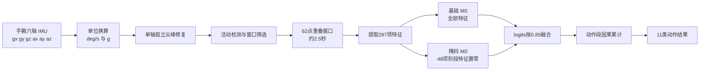
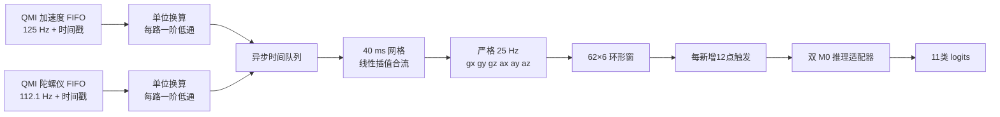

# 算法原理、训练与实时计数

> 本文由原 docs/ 分散文档于 2026-07-25 按主题收敛。原文件名保留在章节来源字段中，旧文件不再单独维护。

> 文档状态约定：**当前规范**可作为实现与测试依据；**当前参考**用于解释设计；**验证证据/验收快照**记录当时结果；**历史基线/历史实验/历史校准/历史路线图**仅保留决策轨迹，不覆盖当前代码、模型清单和测试合同。
>
> 当前产品边界：右手腕佩戴；一次会话只做一种主动作；休息、静坐、低置信度或异类噪声不得切换主动作、不得增加次数；实体无振动马达；10 次动作的计数验收容差为 ±2 次。若文内历史章节与该边界冲突，以本段、当前源码和自动化测试为准。

## 1. 文档范围

统一说明六轴 IMU 数据链、297 维特征、双 M0 分类、训练验证、动作相位、实时计数、热量估算、弱类实验及已否决方案。

## 2. 章节与来源映射

| 章节 | 原文件 | 状态 | 用途 |
|---:|---|---|---|
| 3 | `算法文档.md` | 当前总览 | 现行 297 维特征、双 M0 与部署总览 |
| 4 | `IMU_BP_Training_ESP32_Plan.md` | 历史基线 | 早期训练计划与迁移方法，参数以当前代码为准 |
| 5 | `IMU采样重采样与推理链.md` | 当前规范 | 采样、抗混叠、25 Hz 重采样、质量位和推理窗口 |
| 6 | `IMU数据前处理与因果时间平滑.md` | 当前规范 | 尖峰修复、因果平滑、固定融合与动作段累计 |
| 7 | `手腕换向与周期特征说明.md` | 当前参考 | 换向、周期和冲击恢复候选特征 |
| 8 | `弱类频谱与峰形特征说明.md` | 当前参考 | 频谱、峰形、互相关及 Python/C 一致性 |
| 9 | `弱类运动机理特征与轻量深层BP方案_待审核.md` | 历史实验 | 弱类机理与轻量深层 BP 候选方案 |
| 10 | `弱类联合优化方案.md` | 历史实验 | 弱类诊断矩阵、实验顺序与停止规则 |
| 11 | `论文依据与优化取舍.md` | 决策依据 | 采用、未采用方法与评估边界 |
| 12 | `分类准确率对齐审计.md` | 验证证据 | 分类决策口径、真板复盘和数据域限制 |
| 13 | `动作相位与步峰检测.md` | 当前规范 | 完整周期、步峰、休息冻结和恢复 |
| 14 | `计数与卡路里算法.md` | 当前规范 | 单动作会话、实时计数、热量和断流恢复 |
| 15 | `开合跳StepCounter离线可视校准.md` | 历史校准 | 旧 StepCounter 对照与人工核数方法 |
| 16 | `开合跳峰谷配对离线校准.md` | 历史校准 | 峰谷配对实验和三份数据结论 |
| 17 | `superpowers\specs\2026-07-10-imu-bp-weak-class-optimization-design.md` | 历史设计 | 弱类优化设计 |
| 18 | `superpowers\plans\2026-07-10-imu-bp-weak-class-optimization.md` | 历史实施计划 | 弱类优化实施计划 |
| 19 | `superpowers\specs\2026-07-11-finals-jumping-squat-data-expansion-design.md` | 历史设计 | 跳跃深蹲决赛数据扩展设计 |
| 20 | `superpowers\plans\2026-07-11-finals-jumping-squat-data-expansion.md` | 历史实施计划 | 跳跃深蹲决赛数据扩展实施计划 |

## 3. 现行 297 维特征、双 M0 与部署总览

> 状态：**当前总览**；原始来源：`算法文档.md`。

> 面向第一次接触 IMU、特征工程和神经网络的读者。本文描述的是当前项目已经实际训练、测试并达到验收指标的算法，而不是只停留在设想阶段的方案。

### 阅读建议

- 完全没有基础：依次阅读第 1～5 节，再看第 7、9、11、12 节。
- 只想理解最终精度：直接阅读第 13 节。
- 准备移植 ESP32-S3：重点阅读第 8、9、12、15、16 节。
- 准备复现实验：重点阅读第 5、10、11、12、17 节。
- 排查结果异常：先检查第 18 节列出的常见错误。

### 1. 先用一句话理解整个系统

手腕上的 IMU 每秒采集 25 次三轴角速度和三轴加速度；程序把约 2.5 秒的数据清洗后变成 297 个数字，再交给两个小型 BP 神经网络判断动作，最后综合一段动作中当前和过去的判断，输出 11 个健身动作之一。

完整流程如下：



这条链路包含两个同等重要的部分：

1. **数据前处理和特征工程**：让输入尽量干净，并把动作规律变成模型容易使用的数字。
2. **分类与时间决策**：用轻量 BP 网络识别单个窗口，再利用动作持续性稳定输出。

本项目的经验是：只有模型，没有可靠前处理，容易学到毛刺、静止尾段和佩戴差异；只有特征，没有合适分类器和时间决策，也难以稳定区分 `jumping_squat`、`squat`、`tuck_jump`。

---

### 2. 系统要识别什么

#### 2.1 传感器位置

系统**只使用手腕上的一个六轴 IMU**，不使用腰部、腿部、胸部或其它位置的传感器。

第 $t$ 个采样点表示为：

$$
\mathbf{x}_t=
[g_{x,t},g_{y,t},g_{z,t},a_{x,t},a_{y,t},a_{z,t}]
$$

其中：

- $g_x,g_y,g_z$：绕传感器三个轴的角速度，单位为 $\mathrm{deg/s}$；
- $a_x,a_y,a_z$：传感器三个轴的加速度，单位为 $g$；
- $1g$ 约等于地球表面的重力加速度；
- 通道顺序永远固定为 `gx、gy、gz、ax、ay、az`。

如果 Python 和 ESP32 使用不同通道顺序，即使模型权重完全正确，输出也会失效。因此，通道顺序属于模型合同的一部分。

#### 2.2 11 个动作类别

模型输出顺序固定如下：

| 索引 | 类别名 | 直观含义 |
|---:|---|---|
| 0 | `good_morning` | 早安式体前屈 |
| 1 | `jumping_jack` | 开合跳 |
| 2 | `jumping_lunge` | 跳跃弓步 |
| 3 | `jumping_squat` | 跳跃深蹲 |
| 4 | `lunge` | 普通弓步 |
| 5 | `sit` | 静坐 |
| 6 | `squat` | 普通深蹲 |
| 7 | `trot` | 小跑 |
| 8 | `tuck_jump` | 收腹跳 |
| 9 | `walk` | 行走 |
| 10 | `wave` | 挥手 |

类别索引会直接对应网络输出向量的位置。例如，输出向量第 3 项表示 `jumping_squat` 的分数。Python、模型文件、ESP32 和上位机必须使用同一顺序。

#### 2.3 为什么手腕识别不容易

手腕并不直接测量腿部屈伸。它只能看到身体运动传到手臂后的结果，因此存在几类困难：

- `squat` 和 `jumping_squat` 都有下蹲和起身；区别主要在腾空、落地冲击和节奏。
- `jumping_squat` 和 `tuck_jump` 都有双脚起跳；区别主要在腾空期手臂转动、回收速度和冲击形态。
- `jumping_lunge` 与其它跳跃动作都可能出现低支持力阶段，但左右交替和水平运动不同。
- 同一个人不同速度、不同人、不同佩戴方向，会改变三轴幅值和动作相位。
- 一条采集文件可能含有起始静止、结束静止、传感器毛刺和不完整动作。

因此，本算法不依赖单一峰值，而是同时分析强度、节奏、频谱、方向、相位、腾空、冲击和历史一致性。

---

### 3. 新手需要先知道的六个概念

#### 3.1 采样率

采样率为：

$$
f_s=25\,\mathrm{Hz}
$$

表示每秒产生 25 行六轴数据，相邻采样点间隔为：

$$
\Delta t=\frac{1}{25}=0.04\,\mathrm{s}
$$

#### 3.2 窗口

模型不能只看一个瞬间。它每次读取 $N=62$ 个采样点：

$$
T_w=\frac{62}{25}=2.48\,\mathrm{s}
$$

工程上称为“约 2.5 秒窗口”。窗口形状为：

$$
[62,6]
$$

即 62 个时间点、每点 6 个通道。

相邻窗口向前移动 12 点：

$$
T_s=\frac{12}{25}=0.48\,\mathrm{s}
$$

所以系统在窗口填满后，大约每 0.48 秒产生一次新判断。窗口互相重叠，可以减少动作刚好落在窗口边缘造成的信息丢失。

#### 3.3 特征

“特征”是从一段波形中总结出的数字。例如：

- 角速度标准差：手腕转动幅度是否大；
- 主频：动作每秒大约重复几次；
- 腾空比例：窗口中低支持力时间占多少；
- 起跳与落地间隔：动作的飞行时间代理；
- 自相关峰：波形是否周期性重复。

原窗口有 $62\times6=372$ 个原始值，经过确定性计算后得到 297 个特征。手工特征不是随意压缩，而是把与健身动作有关的物理规律显式提供给小模型。

#### 3.4 BP 神经网络

BP 是 Back Propagation，即反向传播。项目中的模型本质是若干全连接层：

$$
\mathbf{y}=f(\mathbf{W}\mathbf{x}+\mathbf{b})
$$

其中：

- $\mathbf{x}$：输入特征；
- $\mathbf{W}$：训练得到的权重；
- $\mathbf{b}$：偏置；
- $f$：ReLU 激活函数；
- $\mathbf{y}$：下一层输出。

ReLU 定义为：

$$
\operatorname{ReLU}(v)=\max(0,v)
$$

#### 3.5 logits

网络最后输出 11 个尚未归一化的分数，称为 logits：

$$
\mathbf{z}=[z_0,z_1,\ldots,z_{10}]
$$

分数越大，模型越倾向该类别。最终类别通常取：

$$
\hat y=\arg\max_c z_c
$$

本项目直接融合 logits，不必先计算 softmax。这样计算更少，也避免不必要的指数运算。

#### 3.6 准确率、召回率和宏 F1

总体准确率为：

$$
\mathrm{Accuracy}=\frac{\text{全部预测正确窗口数}}{\text{全部窗口数}}
$$

某类别 $c$ 的召回率为：

$$
\mathrm{Recall}_c=\frac{TP_c}{TP_c+FN_c}
$$

$TP_c$ 是该动作被正确识别的窗口数，$FN_c$ 是该动作被错判为其它动作的窗口数。

总体准确率可能被样本多、容易识别的类别拉高。因此项目验收重点看逐类召回率，尤其是 `jumping_squat`、`squat`、`tuck_jump`。

宏 F1 是先对每个类别计算 F1，再做等权平均。它不会让大类别拥有更高权重，适合检查类别是否均衡。

---

### 4. 数据读取与单位换算

#### 4.1 原始数据格式

每行至少包含六列，模型只读取前六列：

```text
gx_raw,gy_raw,gz_raw,ax_raw,ay_raw,az_raw,...
```

原始整数需要换算为物理单位：

$$
g_c=\frac{g_{c,\mathrm{raw}}}{16.4}
$$

$$
a_c=\frac{a_{c,\mathrm{raw}}}{4096}
$$

换算后：

- 陀螺仪单位为 $\mathrm{deg/s}$；
- 加速度计单位为 $g$；
- 输出数组形状为 `[采样点数,6]`，数据类型为 `float32`。

#### 4.2 输入检查

以下输入必须拒绝：

- 少于六列；
- 通道顺序不明；
- 数据无法解析为有限数值；
- Python 与 ESP32 使用不同量程系数。

量程换算必须在毛刺阈值、活动阈值和特征提取之前完成，否则 300 deg/s、1.5 g 等物理阈值将没有意义。

---

### 5. 数据前处理

前处理目标不是把曲线“变得好看”，而是删除明确无效的信息，同时保留真实快速运动。

#### 5.1 单轴孤立尖峰修复

对内部采样点 $t=1,\ldots,N-2$ 和通道 $c$，先计算前后邻点均值：

$$
m_{t,c}=\frac{x_{t-1,c}+x_{t+1,c}}{2}
$$

中心点相对邻点均值的偏差为：

$$
r_{t,c}=|x_{t,c}-m_{t,c}|
$$

前后邻点自身差异为：

$$
d_{t,c}=|x_{t-1,c}-x_{t+1,c}|
$$

候选尖峰需同时满足：

$$
r_{t,c}>T_c
$$

$$
d_{t,c}<0.5T_c
$$

阈值为：

$$
T_c=
\begin{cases}
300\,\mathrm{deg/s}, & c\in\{g_x,g_y,g_z\}\\
1.5g, & c\in\{a_x,a_y,a_z\}
\end{cases}
$$

只有当前时刻**恰好一个通道**满足条件时，才执行：

$$
\hat x_{t,c}=m_{t,c}
$$

为什么要求“恰好一个轴”？因为真实落地、起跳和快速摆腕通常会同时影响多个轴。多轴共同突变更可能是真动作，不能当成噪声删除。

边界处理：

- 首点和末点没有双侧邻点，保持原值；
- 多轴同时超阈值，保持原值；
- 前后邻点差异很大，说明处在真实变化边沿，保持原值；
- Python 始终从原始邻点判断，避免一次修复影响下一点判断。

复杂度：时间 $O(6N)$，空间 $O(6N)$。62 点窗口的清洗副本占：

$$
62\times6\times4=1488\,\mathrm{bytes}
$$

训练角色共 417,970 个采样点，该规则只修改 746 行，约 0.18%。这说明它是保守去毛刺，不是大范围平滑。

#### 5.2 离线首尾静止段裁剪

某些采集文件在动作结束后还有几十秒静止。如果直接切窗，这些静止窗口会继承文件动作标签，形成错误样本。

逐点活动强度定义为：

$$
s_t=\|\mathbf{a}_t-\mathbf{a}_{t-1}\|_2+
\frac{\|\mathbf{g}_t\|_2}{200}
$$

第一项描述加速度变化，第二项把角速度按 200 deg/s 缩放到相近量级。

活动点阈值 $T_{active}$ 由训练角色 `sit` 数据的逐点活动分数第 90 百分位估计，并且不低于 0.005。本轮实测值约为 0.13165。

检测方式：

1. 使用 25 点，即 1 秒滑动块；
2. 块内至少 20% 的点满足 $s_t>T_{active}$，才认为该块包含动作；
3. 从首个活动点前 0.5 秒保留到最后活动点后 0.5 秒；
4. `sit` 类不裁剪；
5. 没有任何活动块时保留整条记录，避免把弱动作裁成空文件。

该步骤只适用于已经完整保存的离线文件。ESP32 连续流看不到“文件末尾”，实时端应使用活动状态机决定何时开始和结束动作段。

#### 5.3 重叠窗口切分

设窗口长度 $N=62$，步长 $S=12$。第 $k$ 个窗口范围为：

$$
[kS,kS+N)
$$

窗口数量为：

$$
M=\left\lfloor\frac{L-N}{S}\right\rfloor+1
$$

其中 $L$ 是裁剪后记录长度。记录短于 62 点时不产生窗口。

#### 5.4 窗口级静止过滤

窗口整体运动分数为：

$$
S_w=\operatorname{std}(\|\mathbf{a}_t\|_2)+
\frac{\operatorname{std}(\|\mathbf{g}_t\|_2)}{200}
$$

静止阈值 $T_{rest}$ 取训练角色 `sit` 窗口分数第 85 百分位，并且不低于 0.01。

保留规则：

- `sit`：保留 $S_w\le1.6T_{rest}$ 的窗口；
- 普通动态动作：去掉 $S_w<T_{rest}$ 的窗口；
- `jumping_jack`、`jumping_lunge`、`jumping_squat`、`tuck_jump`：还要求 $S_w\ge1.25T_{rest}$，并且逐点活动比例至少 20%。

这个规则解决两个问题：

- 防止动作文件中的静止片段被错误标为动作；
- 防止跳跃类只保留一个偶然毛刺，却没有连续活动证据。

#### 5.5 训练期数据增强

数据增强只用于训练，不用于验证、测试和 ESP32 推理。当前训练器支持：

- 三轴同步旋转，最大约 $\pm35^\circ$，模拟佩戴方向变化；
- 小幅时间形变，最大归一化位移 0.03，模拟动作快慢差异；
- 陀螺高斯噪声，标准差约 0.25 deg/s；
- 加速度高斯噪声，标准差约 0.003 g。

陀螺仪和加速度计必须使用同一个旋转矩阵：

$$
\mathbf{g}'_t=\mathbf{R}\mathbf{g}_t,
\qquad
\mathbf{a}'_t=\mathbf{R}\mathbf{a}_t
$$

否则会制造物理上不可能的传感器组合。

强度缩放增强曾被验证，但会损害弱类边界，因此没有保留在最终方案中。数据增强不是越多越好，必须以固定验证集结果决定。

#### 5.6 防止数据泄漏

同一个采集文件会产生大量重叠窗口。如果随机按窗口划分，几乎相同的相邻窗口可能同时进入训练集和测试集，得到虚高成绩。

本项目先按文件分组，再按约 70%/15%/15% 划分训练、验证和测试。决赛补充的 `scy1/scy2` 文件只追加到训练角色，`scy3` 作为外部留出。

基本原则：

- 训练集：拟合权重、均值和标准差；
- 验证集：选择特征、模型、融合权重和时间决策；
- 测试集：参数全部锁定后，只做最终确认；
- 外部留出：检查新增会话和佩戴差异。

---

### 6. 从六轴窗口构造派生信号

297 个特征不是直接从六列分别机械计算。算法先构造 14 条有明确物理意义的序列。

#### 6.1 原始六轴序列

$$
g_x,g_y,g_z,a_x,a_y,a_z
$$

#### 6.2 模长序列

角速度模长：

$$
g_m(t)=\sqrt{g_x(t)^2+g_y(t)^2+g_z(t)^2}
$$

加速度模长：

$$
a_m(t)=\sqrt{a_x(t)^2+a_y(t)^2+a_z(t)^2}
$$

模长对坐标轴旋转更稳定，适合描述总体运动强度。

#### 6.3 相邻变化模长

$$
\Delta g_m(t)=\|\mathbf{g}_t-\mathbf{g}_{t-1}\|_2
$$

$$
\Delta a_m(t)=\|\mathbf{a}_t-\mathbf{a}_{t-1}\|_2
$$

它们突出动作突变、落地冲击和快速换向。

#### 6.4 重力对齐序列

窗口平均加速度作为重力方向估计：

$$
\mathbf{u}_g=
\frac{\bar{\mathbf{a}}}{\|\bar{\mathbf{a}}\|_2}
$$

当 $\|\bar{\mathbf{a}}\|_2<10^{-6}$ 时，回退为传感器 z 轴 $[0,0,1]$，避免除零。

垂直加速度：

$$
a_v(t)=\mathbf{a}_t^T\mathbf{u}_g
$$

水平加速度模长：

$$
a_h(t)=\sqrt{\|\mathbf{a}_t\|_2^2-a_v(t)^2}
$$

垂直角速度和水平角速度模长采用同样投影：

$$
g_v(t)=\mathbf{g}_t^T\mathbf{u}_g
$$

$$
g_h(t)=\sqrt{\|\mathbf{g}_t\|_2^2-g_v(t)^2}
$$

平方根内部使用 $\max(v,0)$，防止浮点误差产生负数。

最终 14 条全局序列为：

```text
gx, gy, gz, ax, ay, az,
gyro_mag, acc_mag,
gyro_delta_mag, acc_delta_mag,
acc_vertical, acc_horizontal_mag,
gyro_vertical, gyro_horizontal_mag
```

---

### 7. 297 项特征怎样组成

#### 7.1 总体分组

| 索引范围 | 维度 | 特征组 | 主要作用 |
|---|---:|---|---|
| `0:112` | 112 | 14条序列的基础统计 | 幅值、波动、范围、变化速度 |
| `112:160` | 48 | 原始四阶段特征 | 动作前中后相位形态 |
| `160:184` | 24 | 时序和频谱特征 | 节奏、主频、周期性 |
| `184:232` | 48 | 归一化四阶段特征 | 去除幅值后的相位形状 |
| `232:264` | 32 | 冲击分布特征 | 分位数、偏度、峰度、跳变 |
| `264:297` | 33 | 弱类机制特征 | 腾空、冲击、频带、耦合、换向 |

六组总维度为：

$$
112+48+24+48+32+33=297
$$

#### 7.2 112 项基础统计

对每条序列 $x_0,\ldots,x_{N-1}$ 计算 8 项：

1. 均值

$$
\mu=\frac{1}{N}\sum_{t=0}^{N-1}x_t
$$

2. 标准差

$$
\sigma=\sqrt{\frac{1}{N}\sum_t(x_t-\mu)^2}
$$

3. 最小值 $\min(x)$；

4. 最大值 $\max(x)$；

5. 均方根

$$
\mathrm{RMS}=\sqrt{\frac{1}{N}\sum_t x_t^2}
$$

6. 相邻绝对差均值

$$
D_{abs}=\frac{1}{N-1}\sum_{t=1}^{N-1}|x_t-x_{t-1}|
$$

7. 围绕均值的过零率

$$
Z=\frac{1}{N-1}\sum_{t=1}^{N-1}
\mathbb{I}[(x_{t-1}-\mu)(x_t-\mu)<0]
$$

8. 一阶差分标准差

$$
\sigma_{\Delta}=\operatorname{std}(x_t-x_{t-1})
$$

14 条序列各 8 项，因此得到 $14\times8=112$ 项。

#### 7.3 48 项原始四阶段特征

选择四条关键序列：

```text
acc_vertical
acc_horizontal_mag
gyro_mag
acc_delta_mag
```

每条序列按时间等分成 4 段，每段计算：

- 均值；
- 标准差；
- 最大绝对值。

维度为：

$$
4\text{条序列}\times4\text{段}\times3\text{项}=48
$$

它们回答“窗口开头、中间和结尾分别发生了什么”。例如，跳跃动作可能在某段出现低支持力，随后在另一段出现落地冲击。

#### 7.4 24 项时序特征

仍对上述四条关键序列，每条计算 6 项：

1. 高活动比例：去均值绝对值超过该序列标准差的点占比；
2. 归一化峰数：显著局部峰数量除以窗口长度；
3. 主频：非直流功率最大的频率，单位 Hz；
4. 归一化谱熵：能量越分散，值越接近 1；
5. 最强自相关峰：0.15～1.20 秒延迟范围内的最大相关；
6. 最强自相关峰延迟：上述峰所在时间，单位秒。

主频为：

$$
f_d=\frac{k_d f_s}{N},
\qquad
k_d=\arg\max_{k>0}P[k]
$$

谱熵为：

$$
H=-\frac{\sum_k p_k\ln p_k}{\ln K},
\qquad
p_k=\frac{P[k]}{\sum_jP[j]}
$$

近静止序列功率小于 $10^{-12}$ 时，主频和谱熵返回 0。

维度为 $4\times6=24$。

#### 7.5 48 项归一化四阶段特征

先对每条关键序列做窗口内标准化：

$$
q_t=\frac{x_t-\mu_x}{\sigma_x}
$$

若 $\sigma_x\le10^{-6}$，整条归一化序列置零。然后按四阶段提取均值、标准差和最大绝对值，得到另一个 48 维组。

该组只强调“波形形状”，弱化绝对幅值。但它也对动作落在窗口中的相位敏感，因此最终第二模型会屏蔽这一组，形成互补判断。注意：屏蔽发生在模型输入端，不会删除原始数据，也不会影响基础模型。

#### 7.6 32 项冲击分布特征

每条关键序列计算：

- 10%、25%、50%、75%、90% 分位数；
- 偏度；
- 超额峰度；
- 最大相邻绝对差。

偏度为：

$$
\mathrm{Skew}=\frac{1}{N}\sum_t
\left(\frac{x_t-\mu}{\sigma}\right)^3
$$

超额峰度为：

$$
\mathrm{Kurt}_{ex}=\frac{1}{N}\sum_t
\left(\frac{x_t-\mu}{\sigma}\right)^4-3
$$

当 $\sigma\le10^{-6}$ 时，两者返回 0。最大相邻绝对差为：

$$
J_{max}=\max_t|x_t-x_{t-1}|
$$

维度为 $4\times8=32$。分位数比单个最大值稳健，偏度和峰度可以描述落地冲击造成的非对称长尾和尖峰。

#### 7.7 33 项弱类机制特征

这 33 项专门针对容易混淆的动作设计，可分为六组：

| 机制 | 典型特征 | 主要区分内容 |
|---|---|---|
| 频带与谱形 | 低/中/高频比例、谱质心、主峰占比 | 深蹲慢周期与跳跃快周期 |
| 自相关 | 首次过零、次峰、显著峰数、第一时间峰 | 重复节奏与周期稳定性 |
| 通道耦合 | Pearson相关、最大有符号互相关 | 垂直冲击与手腕转动是否同步 |
| 峰值规律 | 峰幅变异系数、峰间隔变异系数 | 每次动作是否规律一致 |
| 腾空与落地 | 低支持力比例、完整飞行事件、冲击宽度 | 普通深蹲与跳跃动作 |
| 手腕形态 | 水平各向异性、PCA换向率、回摆形态 | 手腕摆动方向和回收方式 |

##### 7.7.1 频带功率比例

对去均值并乘 Hann 窗的序列计算单边功率谱：

$$
X[k]=\sum_{n=0}^{N-1}
(x[n]-\bar x)w[n]e^{-j2\pi kn/N}
$$

$$
P[k]=|X[k]|^2
$$

三个频带为：

- 低频：$0.35\le f<1.20$ Hz；
- 中频：$1.20\le f<2.40$ Hz；
- 高频：$2.40\le f<5.00$ Hz。

频带比例：

$$
R_{[f_l,f_h)}=
\frac{\sum_{k:f_l\le f_k<f_h}P[k]}
{\sum_{k>0}P[k]}
$$

普通深蹲通常低频能量更多；收腹跳和快速跳跃动作高频、冲击与谐波成分更多。

##### 7.7.2 自相关

去均值序列的归一化自相关为：

$$
R(\ell)=
\frac{\sum_{t=0}^{N-\ell-1}\tilde x_t\tilde x_{t+\ell}}
{\sum_{t=0}^{N-1}\tilde x_t^2}
$$

`wrist_acf_first_peak` 在 0.3～3.0 秒且不超过半窗的范围内，寻找最早的正局部峰。它描述手腕动作在多长时间后再次呈现相似波形。

该特征在文件分组三折分析中，对 `squat` 与 `tuck_jump` 的稳健效应量约为 1.318，AUC 约为 0.80，是最终 297 维合同新增并保留的关键特征。

##### 7.7.3 低支持力与腾空

加速度模长低于 0.70 g 时，认为处于低支持力候选状态：

$$
F_t=\mathbb{I}[a_m(t)<0.70g]
$$

总比例：

$$
R_f=\frac{1}{N}\sum_tF_t
$$

最长连续比例：

$$
R_{f,max}=\frac{\text{最长连续低支持力点数}}{N}
$$

普通深蹲一般没有持续腾空；跳跃深蹲和收腹跳更容易出现连续低支持力区间。

##### 7.7.4 最大有符号互相关

在 $\pm1$ 秒以内搜索垂直加速度与角速度模长、垂直与水平加速度之间的最强相关：

$$
\rho_{ab}(\ell)=
\frac{\sum a_t b_{t+\ell}}
{\sqrt{\sum a_t^2}\sqrt{\sum b_{t+\ell}^2}}
$$

最终保留绝对值最大相关的符号。正值表示大体同相，负值表示大体反相。跳跃深蹲的垂直推进、落地与手腕转动耦合方式，通常不同于开合跳、跳跃弓步和收腹跳。

##### 7.7.5 峰间隔变异系数

显著正峰门槛为：

$$
T=\bar x+0.5\sigma_x
$$

相邻峰间隔为 $D_q=p_{q+1}-p_q$，间隔变异系数为：

$$
CV_D=\frac{\operatorname{std}(D_q)}{\operatorname{mean}(D_q)}
$$

分母不大于 $10^{-12}$ 或峰数量不足时返回 0。规律重复动作的 $CV_D$ 较小，不规则回收和冲击会使其增大。

##### 7.7.6 事件对齐与手腕方向

完整腾空事件要求低支持力区间前后都仍在窗口内。算法在腾空前寻找起跳推进峰，在腾空后寻找落地冲击峰，并计算：

- 起跳峰到落地峰时间，单位秒；
- 落地连续高冲击宽度，单位秒；
- 腾空期水平角速度模长积分，单位度；
- 腾空期垂直角速度绝对积分，单位度；
- 水平加速度和水平角速度各向异性。

没有完整事件时返回 0，多个事件取中位数，降低误检事件影响。

33 项完整名称和进一步推导见本文“频谱、峰形、互相关及 Python/C 一致性”和“换向、周期和冲击恢复候选特征”章节。

#### 7.8 特征提取复杂度

| 模块 | 时间复杂度 | 额外空间 |
|---|---|---|
| 基础统计 | $O(N)$ | $O(1)$ |
| 阶段与分位数 | $O(N^2)$ 最坏 | $O(N)$ |
| 直接 DFT | $O(N^2)$ | $O(1)$ |
| 自相关 | $O(N^2)$ | 最多 $O(N)$ |
| 互相关 | $O(N\min(N,f_s))$ | $O(1)$ |
| 峰检测 | $O(N)$ | $O(N)$ |

当前 $N=62$，每 0.48 秒运行一次。生成 C 的特征提取函数在本机编译测得静态栈约 4.8 KiB；ESP32 实际栈仍需通过 `uxTaskGetStackHighWaterMark` 测量。

---

### 8. 特征标准化与第二模型掩码

#### 8.1 为什么要标准化

297 项特征的单位和数值范围差异很大：

- 角速度可能达到数百 deg/s；
- 频带比例通常位于 $[0,1]$；
- 时间特征单位为秒；
- 峰间隔、积分和统计量具有不同尺度。

如果直接输入网络，大数值特征容易支配梯度。标准化公式为：

$$
z_i=\frac{x_i-\mu_i}{\sigma_i}
$$

其中：

- $x_i$：第 $i$ 个原始特征；
- $\mu_i$：只在训练集上计算的均值；
- $\sigma_i$：只在训练集上计算的标准差；
- $z_i$：送入网络的无量纲标准分。

当 $\sigma_i<10^{-6}$ 时，训练端把该标准差替换为 1，防止除零。验证集、测试集和 ESP32 只能使用训练集保存的 $\mu_i$、$\sigma_i$，不能各自重新统计。

#### 8.2 为什么第二模型把 48 项置零

训练/验证依赖审计发现，归一化阶段特征 `184:232` 对不同动作速度和窗口起点较敏感。完全删除它们会损失部分信息，全部依赖它们又会放大会话差异。

最终使用两个模型：

- 基础模型：保留全部 297 项标准化特征；
- 掩码模型：仅将标准化后的索引 `184:232` 设为 0。

设基础标准化输入为 $\mathbf{z}$，掩码输入为 $\mathbf{z}^{(m)}$：

$$
z_i^{(m)}=
\begin{cases}
0,&184\le i<232\\
z_i,&\text{其它索引}
\end{cases}
$$

标准分 0 等价于“该特征取训练集均值”，不是原始物理量为 0。两套模型分别使用各自训练时保存的均值和标准差。

掩码数组必须是输入副本，不能原地修改基础模型输入，否则两个模型会收到相同数据，融合失去意义。

---

### 9. 六分支 M0 神经网络

#### 9.1 为什么不直接把 297 项放进一个大层

297 项包含六类完全不同的信息。若直接输入同一个大层，112 项基础统计可能在数量上淹没只有 33 项的弱类机制特征。

M0 先让每组特征独立编码，再融合：

| 分支 | 输入维度 | 输出维度 | 内容 |
|---:|---:|---:|---|
| 1 | 112 | 24 | 基础统计 |
| 2 | 48 | 12 | 原始阶段 |
| 3 | 24 | 8 | 时序频谱 |
| 4 | 48 | 12 | 归一化阶段 |
| 5 | 32 | 8 | 冲击分布 |
| 6 | 33 | 16 | 弱类机制 |

每个分支执行：

$$
\mathbf{h}_j=\operatorname{ReLU}
(\mathbf{W}_j\mathbf{x}_j+\mathbf{b}_j)
$$

六个输出拼接为 80 维：

$$
\mathbf{h}=
[\mathbf{h}_1;\mathbf{h}_2;\ldots;\mathbf{h}_6]
\in\mathbb{R}^{80}
$$

融合层为：

$$
\mathbf{u}_1=\operatorname{ReLU}
(\mathbf{W}_{80\to64}\mathbf{h}+\mathbf{b}_{64})
$$

$$
\mathbf{u}_2=\operatorname{ReLU}
(\mathbf{W}_{64\to32}\mathbf{u}_1+\mathbf{b}_{32})
$$

分类层输出 11 类 logits：

$$
\mathbf{z}=\mathbf{W}_{32\to11}\mathbf{u}_2+\mathbf{b}_{11}
$$

#### 9.2 结构总览

```text
297维输入
  ├─112 → 24 ┐
  ├─ 48 → 12 │
  ├─ 24 →  8 │
  ├─ 48 → 12 ├─ 拼接80 → 64 → 32 → 11类logits
  ├─ 32 →  8 │
  └─ 33 → 16 ┘
```

训练时融合层可使用 dropout，推理时自动关闭。最终分类层后不执行 ReLU，因为 logits 需要允许正值和负值。

#### 9.3 参数和运算量

模型类中还定义了 5 个训练期辅助头，但它们不进入 `forward()` 主推理路径。

| 项目 | 单 M0 | 双 M0 |
|---|---:|---:|
| 训练检查点参数，含辅助头 | 12,853 | 25,706 |
| 部署主路径参数，不含辅助头 | 12,523 | 25,046 |
| 部署主路径 MAC | 12,336 | 24,672 |
| float32 主路径权重与偏置 | 50,092 B | 100,184 B |

MAC 表示一次乘法并累加。双模型每 0.48 秒约 24,672 MAC，对 ESP32-S3 的负担很小。实际主要计算量来自 297 项特征中的 DFT、自相关和排序。

---

### 10. 模型怎样训练

#### 10.1 主分类交叉熵

softmax 概率为：

$$
p_c=\frac{e^{z_c}}{\sum_{j=0}^{10}e^{z_j}}
$$

真实类别为 $y$ 时，交叉熵为：

$$
L_{CE}=-\log p_y
$$

实现使用 PyTorch 的数值稳定交叉熵，不在代码中手工先算 softmax，避免指数溢出。

#### 10.2 跨文件监督对比损失

同类重叠窗口可能来自同一文件，彼此非常相似。监督对比损失要求同类但不同文件的嵌入靠近，同时让不同类别远离。

对归一化嵌入 $\mathbf{v}_i$，相似度为：

$$
s_{ij}=\frac{\mathbf{v}_i^T\mathbf{v}_j}{\tau}
$$

$\tau=0.15$ 是温度。只有“同类、不同文件”的样本才作为正样本，减少模型记住单个采集文件风格的风险。

#### 10.3 易混类别间隔损失

对真实类 $y$ 和易混类 $q$，要求真实 logit 至少高出间隔 $m$：

$$
L_{margin}=\max(0,m-z_y+z_q)
$$

当前主要约束：

- `lunge` 与 `squat`；
- `jumping_lunge` 与 `jumping_squat`；
- `jumping_squat` 与 `tuck_jump`。

该损失只处理已知局部边界，不会统一压低所有其它类别。

#### 10.4 训练期辅助任务

训练器支持五个二分类属性头：

- 是否跳跃；
- 是否强腾空；
- 是否左右交替；
- 弓步还是深蹲；
- 跳跃深蹲还是收腹跳。

辅助头只用于约束 32 维嵌入，部署时不需要输出。关闭辅助开关时，该损失严格为 0。

#### 10.5 总损失

统一形式为：

$$
L=L_{CE}
+\lambda_sL_{SupCon}
+\lambda_mL_{margin}
+\lambda_aL_{aux}
$$

默认权重为：

$$
\lambda_s=0.05,
\qquad
\lambda_m=0.25,
\qquad
\lambda_a=0.10
$$

未启用的分支损失取 0。

#### 10.6 优化器与早停

默认训练参数：

| 参数 | 数值 |
|---|---:|
| 优化器 | AdamW |
| 学习率 | $10^{-3}$ |
| 权重衰减 | $10^{-4}$ |
| 批量大小 | 64 |
| 最大 epoch | 350 |
| 早停耐心 | 45 epoch |
| 随机种子 | 固定 |

每个 epoch 都输出：

- 总损失及各分项损失；
- 验证准确率；
- 宏 F1；
- 弱类平均召回；
- 全部 11 类逐类召回；
- 当前最弱类别；
- 最佳 epoch 和剩余耐心。

检查点优先级不是只看总体准确率，而是按以下顺序比较：

1. 最低类别召回；
2. 弱类平均召回；
3. 宏 F1；
4. 总体准确率。

这能防止模型为了提高容易类别而牺牲弱类。

#### 10.7 两个最终模型

- Round29 基础 M0：输入全部 297 项；早停后恢复 epoch 5 权重。
- Round37 掩码 M0：标准化后把 `184:232` 置零；早停后恢复 epoch 7 权重。

掩码 M0 单独并未达到全部弱类门槛。它的价值在于错误模式与基础 M0 不完全相同，因此能通过小权重融合修正边界。

---

### 11. 双模型固定融合

基础模型和掩码模型分别输出：

$$
\mathbf{z}^{(b)}_t,
\mathbf{z}^{(m)}_t\in\mathbb{R}^{11}
$$

最终单窗口融合 logits 为：

$$
\mathbf{z}_t=
0.85\mathbf{z}^{(b)}_t+
0.15\mathbf{z}^{(m)}_t
$$

权重只在固定验证角色选择，测试集不参与调权。

为什么基础模型权重大？因为它整体更稳定；掩码模型只负责提供少量不依赖归一化相位的补充证据。两个权重之和为 1，可以保持 logits 大致尺度。

融合前必须检查：

- 两个向量形状完全一致；
- 类别顺序完全一致；
- 权重有限且位于 $[0,1]$；
- 所有 logits 都是有限值。

出现 NaN 或无穷值时，当前窗口必须丢弃，不能写入后续累计状态。

时间复杂度为 $O(C)$，$C=11$；不增加模型参数。

---

### 12. 动作段因果累计

#### 12.1 为什么单窗口不够

某个 2.5 秒窗口可能只包含半次动作、落在动作边缘，或者被一次不典型摆腕干扰。健身动作通常会连续重复多次，因此前几个窗口已经提供的信息不应立即丢掉。

早期方案只保留最近 15 个窗口。它在验证集通过，但基础测试中的 `jumping_squat` 只有 78.57%，说明固定长度历史仍不够稳。

#### 12.2 累计公式

对一个已经由活动门控划定的动作段，初始化：

$$
\mathbf{S}_0=\mathbf{0},
\qquad n_0=0
$$

第 $t$ 个窗口到来时：

$$
\mathbf{S}_t=\mathbf{S}_{t-1}+\mathbf{z}_t
$$

$$
n_t=n_{t-1}+1
$$

平均 logits 为：

$$
\bar{\mathbf{z}}_t=rac{\mathbf{S}_t}{n_t}
$$

最终输出：

$$
\hat y_t=\arg\max_c\bar z_{t,c}
$$

算法只使用当前和过去窗口，绝不读取未来窗口，因此是“因果”的，可以实时运行。

#### 12.3 什么时候必须重置

以下事件必须把累计和和计数清零：

- 活动门控确认进入静止；
- 用户主动结束当前动作；
- 用户切换到另一动作；
- IMU 或 ESP32 断连后重连；
- 更换用户、佩戴手或设备；
- 开始读取新的离线文件。

如果用户从深蹲直接无停顿切换到挥手，却没有重置，旧深蹲证据会延迟新动作判断。这不是模型错误，而是动作段边界错误。

#### 12.4 数值稳定和资源

状态包含：

- 11 个 `float` 累计和；
- 1 个 `uint32_t` 窗口计数。

RAM：

$$
11\times4+4=48\,\mathrm{bytes}
$$

每窗口时间复杂度 $O(11)$，空间复杂度 $O(11)$。

若 C 端计数达到 `UINT32_MAX`，把所有累计和与计数同时减半，再加入当前窗口，防止整数回绕。正常健身动作段几乎不可能达到该上限，这只是完整边界保护。

---

### 13. 最终评估结果怎样理解

#### 13.1 固定基础测试

最终测试包含 29 个文件、5,634 个有效窗口。指标按动作段累计后的每个窗口预测计算。

| 动作 | 逐类召回率 |
|---|---:|
| `good_morning` | 99.60% |
| `jumping_jack` | 100.00% |
| `jumping_lunge` | 99.81% |
| `jumping_squat` | 89.12% |
| `lunge` | 100.00% |
| `sit` | 100.00% |
| `squat` | 99.80% |
| `trot` | 100.00% |
| `tuck_jump` | 100.00% |
| `walk` | 99.10% |
| `wave` | 99.87% |

总体结果：

- 准确率：**99.29%**；
- 宏 F1：**98.96%**；
- 最低类别召回：**89.12%**；
- `jumping_squat`、`squat`、`tuck_jump` 均达到 85% 要求。

#### 13.2 外部会话

外部 `scy3` 包含 `jumping_jack`、`jumping_lunge`、`jumping_squat` 各一个新会话。三类召回和总体准确率均为 100%。

这个结果说明当前方案对这三个外部会话有效，但不能据此宣称对所有人、所有佩戴方式都达到 100%。原始数据没有可靠采集者 ID，因此还不能称为严格跨人员盲测。

#### 13.3 为什么不能只看 99.29%

如果只看总体准确率，会忽略最难类别。项目真正的验收结论应写成：

> 固定测试总体准确率 99.29%，全部 11 类最低召回 89.12%，三个目标弱类均超过 85%。

完整机器可读报告见[最终固定融合测试报告](results/final_fixed_ensemble_confirmation_20260712.json)。

---

### 14. 从失败方案学到什么

项目不是第一次训练就达到当前结果。对新手最有价值的经验如下。

#### 14.1 更多特征不一定更好

曾经把候选特征从 296 项增加到 302 项，但验证最低召回下降。原因可能包括：

- 新特征与旧特征重复；
- 某些特征只在少量文件上可分；
- 小数据下特征越多越容易学习会话噪声；
- 多项弱特征一起输入后，单项优势可能互相抵消。

最终做法是先做文件分组分离度审计，再训练；不通过审计的特征不进入生产顺序。

#### 14.2 更深网络不一定更好

更深的 M1 六分支模型验证结果退化。当前数据量和手工特征已经适合较小的 M0；继续增加深度只会提高过拟合风险和 ESP32 负担。

#### 14.3 强度增强不一定模拟真实差异

全局强度缩放和只针对 `jumping_squat` 的缩放均未稳定改善弱类。真实跨会话差异不只是“幅值变大或变小”，还包括节奏、相位、佩戴方向和手臂动作习惯。

#### 14.4 前处理必须先于特征和模型

长静止尾段、单轴毛刺和错误动作窗口会污染所有后续特征。先修正样本质量，才能判断某个特征或模型是否真的有效。

#### 14.5 时间信息可以在模型外利用

无需改成大型 RNN 或 Transformer，也能利用动作连续性。动作段累计只需 48 字节状态，却显著提高最弱类别稳定性，适合 MCU。

---

### 15. ESP32-S3 移植评估

#### 15.1 硬件是否放得下

ESP32-S3 官方规格包含最高 240 MHz 双核 LX7、512 KiB 片内 SRAM和神经网络/信号处理向量指令。参考[ESP32-S3 官方页面](https://www.espressif.com/en/products/socs/esp32-s3)和[官方数据手册](https://documentation.espressif.com/esp32-s3_datasheet_en.pdf)。

当前部署主路径预算：

| 资源 | 估算 |
|---|---:|
| 双 M0 float32 权重与偏置 | 100,184 B，约 97.84 KiB |
| 两模型均值和标准差 | 4,752 B，约 4.64 KiB |
| 原始 62×6 窗口 | 1,488 B |
| 297维特征 | 1,188 B |
| 动作段累计状态 | 48 B |
| 双模型主路径运算 | 24,672 MAC/窗口 |
| C特征函数本机静态栈参考 | 约 4.8 KiB |

权重和标准化参数应声明为 `const`，保存在 Flash 映射区，不应启动时整体复制到内部 RAM。无 PSRAM 的 ESP32-S3-N8 也具备可行性；带 PSRAM 的型号余量更大，但不是该模型的硬性要求。

#### 15.2 真正的耗时重点

双 BP 只有约 2.47 万 MAC，计算量很低。主要耗时来自：

- 直接 DFT；
- 自相关和互相关；
- 分位数和中位数排序；
- 297 项特征组织。

系统每 0.48 秒才需要完成一次窗口更新。建议实机目标：

- “清洗+特征+双模型+累计”平均低于 100 ms；
- 最差低于 480 ms；
- 推理任务栈至少配置 16 KiB，并实测高水位；
- 运行时内部剩余堆建议大于 100 KiB；
- 连续运行 1 小时无栈溢出、内存下降和 NaN。

#### 15.3 当前已完成的 C 能力

当前双 M0 自动导出链路已经完成。四项部署产物为：

| 文件 | 用途 |
|---|---|
| `esp32/include/esp32_bp_features.h` | 六轴清洗、297 项特征、标准化辅助和时间决策 |
| `esp32/include/esp32_dual_m0_model.h` | 两个六分支 M0 权重、前向、掩码和固定融合 |
| `esp32/include/dual_m0_manifest.json` | 维度、类别、采样率、掩码范围、融合权重和 SHA-256 清单 |
| `esp32/include/dual_m0_bundle.npz` | Python 侧复核两套模型和标准化参数的参数包 |

生成 C 已具备：

- 六轴清洗；
- 297 项特征提取；
- 标准化阶段掩码；
- 两个 M0 各自的均值、标准差、六组分支层、融合层和分类层前向；
- 固定 `0.85/0.15` logits 融合；
- 15 窗口历史平滑；
- `BpBoutAccumulator` 动作段累计与重置。

Python/C 一致性结果：

- 双 M0 部署包复核中，297 项特征最大绝对误差约为 $3.05\times10^{-5}$；
- 两个六分支模型 logits 最大绝对误差小于 $6.5\times10^{-5}$，最终类别完全一致；
- 较早的前处理边界用例最大特征误差为 $7.63\times10^{-5}$，仍在既定浮点容差内；
- K15 平滑误差：0；
- 双模型融合误差：0；
- 动作段累计和重置误差：0。

#### 15.4 整机固件构建状态

ESP-IDF 5.5.4 整机工程已经完成干净构建，说明模型头、297 项特征、业务逻辑和当前固件依赖可以共同编译、链接并生成镜像：

| 项目 | 构建结果 |
|---|---:|
| 应用镜像 | `esp32/firmware/build/imu_fitness_handheld.bin` |
| 镜像大小 | `0x13def0`，1,302,256 B |
| 最小应用分区 | `0x400000`，4 MiB |
| 应用分区剩余 | `0x2c2110`，约 69% |

这里的“构建通过”只证明软件在当前工具链下可生成 ESP32-S3 固件，不证明显示、触摸、IMU、PMIC、振动马达、BLE 或功耗已经在真板上工作。

#### 15.5 当前还没有完成的硬件验证

设备命令、Raw Stream、公开接口中文注释和统一全量软件回归已经通过。当前只保留下列必须由开发板完成的集成和运行验证：

1. 烧录厂家原配开发板并核对分区、启动日志和异常复位；
2. 验证 AMOLED 显示、触摸坐标与启动/关机界面；
3. 验证 QMI8658 采样率、量程、六轴顺序和中断/轮询稳定性；
4. 验证 AXP2101 电池电量、充电状态、低电关机和唤醒路径；
5. 验证每次有效计数触发一次 30 ms 振动，且振动不污染 IMU 窗口；
6. 验证 BLE 配对、断线重连、弱信号和上位机长时间通信；
7. 测量活动、待机、深睡电流，以及推理时延、任务栈、堆和连续运行稳定性。

旧单平铺 `BPNet` 头文件不能当作最终 Round41 模型；正式路径必须同时使用 `esp32_bp_features.h` 和 `esp32_dual_m0_model.h`。

#### 15.6 是否需要 int8

当前 float32 模型已经能放入 ESP32-S3，优先完成 float32 一致性最稳妥。int8 可把主路径权重缩小到约四分之一，并可使用 ESP-NN 加速，但必须重新校准并验证逐类召回，不能只检查总体准确率。

---

### 16. 实时推理的完整步骤

下面用不依赖具体编程语言的步骤描述 ESP32 应执行的逻辑。

#### 16.1 初始化

1. 配置 IMU 量程和 25 Hz 采样率。
2. 创建容量至少为 62×6 的环形采样缓冲区。
3. 清零动作段累计和与窗口计数。
4. 加载两套模型权重、均值、标准差和类别顺序。
5. 检查所有常量与 Python 导出清单一致。

#### 16.2 每个采样点

1. 读取 `gx、gy、gz、ax、ay、az` 原始值。
2. 换算为 deg/s 和 g。
3. 写入环形缓冲区。
4. 更新实时活动门控。
5. 若确认进入静止，重置动作段累计状态。

#### 16.3 每累计 12 个新点

1. 若缓冲区不足 62 点，不推理。
2. 按时间顺序复制最近 62 点。
3. 执行单轴孤立尖峰修复。
4. 计算窗口运动分数；无效窗口不进入模型。
5. 提取 297 项特征。
6. 用基础模型均值和标准差构造基础输入。
7. 运行基础 M0，得到 11 维 logits。
8. 用掩码模型自己的均值和标准差构造第二输入。
9. 将第二输入索引 `184:232` 置零。
10. 运行掩码 M0，得到 11 维 logits。
11. 按 `0.85/0.15` 融合。
12. 加入当前动作段累计器。
13. 对累计平均 logits 取 `argmax`。
14. 把类别索引、类别名、累计窗口数和必要诊断值发送给上位机。

#### 16.4 异常处理

- 任一特征或 logit 非有限：丢弃当前窗口并记录错误；
- IMU 断连：停止输出并重置动作段；
- 类别表或特征维度不匹配：拒绝启动推理；
- 标准差小于阈值：按导出值 1 处理；
- 活动段过长达到计数上限：累计和与计数共同减半；
- 用户切换动作：先重置，再接受新动作窗口。

---

### 17. 如何复现实验结果

#### 17.1 Python 环境

从仓库根目录安装依赖：

```powershell
python -m venv .venv
.\.venv\Scripts\python.exe -m pip install -r python\requirements.txt
```

#### 17.2 固定双模型评估

评估器不提供融合权重或决策模式调参开关，避免再次利用测试集选择参数：

```powershell
.\.venv\Scripts\python.exe python\evaluate_fixed_ensemble.py `
  --dataset-dir IMU_Dataset\imu_dataset_for_final `
  --extra-train-dir IMU_Dataset\finals_weak_classes\train `
  --external-holdout-dir IMU_Dataset\finals_weak_classes\external_holdout `
  --base-artifact-dir outputs\round29_clean297_m0_validation_20260712 `
  --masked-artifact-dir outputs\round37_suppress_normalized_phase_validation_20260712 `
  --output outputs\final_fixed_ensemble_confirmation_20260712.json
```

#### 17.3 自动测试

```powershell
.\.venv\Scripts\python.exe -m unittest discover -s python -p "test_*.py"
```

当前完整测试共 86 项，覆盖：

- 单轴毛刺与多轴冲击；
- 特征维度和顺序；
- 模型结构；
- 标准化阶段掩码；
- 固定融合；
- 动作段累计和重置；
- 训练逐 epoch 日志；
- C 头文件合同；
- 数据清单与外部留出边界。

---

### 18. 新手最容易犯的错误

#### 18.1 把逐类召回率叫成每类总体准确率

“某动作识别率”在本项目中实际指该动作召回率。总体准确率只有一个，不能给每类分别计算同一种总体准确率后混用。

#### 18.2 在整个数据集上计算均值和标准差

这会让验证集或测试集信息进入训练流程，形成数据泄漏。只能用训练角色统计。

#### 18.3 按窗口随机划分数据

重叠窗口高度相似。必须按原始文件划分，再切窗口。

#### 18.4 在测试集上继续调融合权重

测试集一旦用于选参数，就不再是独立测试。当前权重和动作段模式均由验证角色锁定。

#### 18.5 在 ESP32 上重新排列特征

模型权重绑定固定索引。即使两个特征公式都正确，只要顺序交换，结果就会错误。

#### 18.6 不重置动作段累计器

累计器会记住上一动作。静止、切换、断连和换用户时必须重置。

#### 18.7 只移植网络，不移植前处理

模型训练时看到的是单位换算、去毛刺、窗口过滤和标准化后的输入。ESP32 缺少其中任何一步，都会造成训练与部署分布不一致。

#### 18.8 认为模型越大越准

当前更深 M1 已经验证退化。模型规模应由数据量、验证弱类和部署预算共同决定。

---

### 19. 术语表

| 术语 | 新手解释 |
|---|---|
| IMU | 惯性测量单元，本项目包含三轴陀螺仪和三轴加速度计 |
| 采样率 | 每秒记录多少次数据，本项目为 25 Hz |
| 窗口 | 一次交给特征提取器的连续数据片段 |
| 特征 | 从波形提取、用于分类的数字摘要 |
| 标准化 | 用训练均值和标准差把不同尺度特征变到相近范围 |
| BP | 使用反向传播训练的神经网络 |
| 全连接层 | 每个输出都由全部输入加权求和得到的网络层 |
| ReLU | 把负值变成 0、正值保持不变的激活函数 |
| logits | 模型对各类别输出的未归一化分数 |
| softmax | 把 logits 转换为和为 1 的概率 |
| epoch | 完整遍历一次训练数据 |
| 过拟合 | 记住训练数据，却不能识别新文件 |
| 数据泄漏 | 验证或测试信息提前进入训练和调参 |
| 召回率 | 某动作真实窗口中，被正确识别的比例 |
| 宏 F1 | 各类别 F1 等权平均，避免大类别支配结果 |
| 因果 | 只使用当前和过去，不读取未来数据 |
| MAC | 一次乘法并累加，用于估算神经网络计算量 |
| Flash | 保存程序和常量权重的非易失存储器 |
| SRAM | 程序运行时使用的快速内存 |

---

### 20. 当前结论

当前算法已经完成：

- 手腕六轴数据单位换算和保守前处理；
- 297 项 Python/C 一致特征；
- 两个六分支轻量 M0；
- 固定 `0.85/0.15` logits 融合；
- 48 字节动作段因果累计状态；
- 固定测试全部 11 类召回超过 85%；
- 总体准确率 99.29%，最低类别召回 89.12%；
- ESP32-S3 模型规模与计算预算评估通过。
- 两个六分支 M0 的自动 C 权重导出；
- 六分支 C 前向与 Python 特征、logits、类别逐值一致性；
- ESP-IDF 5.5.4 整机干净构建，应用镜像约 1.24 MiB，4 MiB 应用分区余量约 69%。

仍需完成：

- ESP32-S3 真板烧录，以及屏幕、触摸、QMI8658、AXP2101、振动马达和 BLE 联调；
- ESP32-S3 实机时延、栈、堆、活动/睡眠电流和长时间稳定测试；
- 更多独立用户、不同佩戴方向和连续动作切换数据验证。

算法的核心不是“用一个神经网络猜动作”，而是：先保证数据可靠，再提取可解释的运动证据，用小模型组合这些证据，最后利用动作持续性稳定输出。

## 4. 早期训练计划与迁移方法，参数以当前代码为准

> 状态：**历史基线**；原始来源：`IMU_BP_Training_ESP32_Plan.md`。

> 适用项目：ESP32-S3 可编程手表 + 六轴 IMU + PC 端上位机
> 适用数据集：`G1ow9711/IMU_Datasrt` 仓库中的 `imu_dataset_for_final`
> 目标：训练一个可移植到 ESP32-S3 的轻量级 BP 神经网络模型，独立测试集准确率目标设为 **95% 以上**。
> 重要说明：95% 以上必须以本地实际运行后的 **独立测试集 accuracy** 和 **混淆矩阵** 为准，不能只看训练集或验证集。本文给出的脚本会把 95% 作为部署门槛；未达到时不建议导出 ESP32 头文件。

---

### 1. 数据集现状与建模思路

根据仓库说明，数据集中包含三轴陀螺仪、三轴加速度计数据，共 11 类动作：

| 英文文件夹名 | 中文含义 | 备注 |
|---|---|---|
| `walk` | 行走 | 周期性动作 |
| `trot` | 慢跑 | 周期性动作，运动幅值较大 |
| `sit` | 静坐 | 静态动作，可作为休息段参考 |
| `wave` | 挥手 | 手臂局部动作 |
| `squat` | 深蹲 | 健身计数动作 |
| `jumping_jack` | 开合跳 | 高动态周期动作 |
| `good_morning` | 早安式弯腰 | 躯干屈伸类动作 |
| `lunge` | 箭步蹲 | 单腿动作 |
| `jumping_lunge` | 跳跃箭步蹲 | 高动态动作 |
| `jumping_squat` | 跳跃深蹲 | 高动态动作 |
| `tuck_jump` | 抬高跳 | 高动态动作 |

每个数据文件为 `N 行 × 8 列`。前 3 列是陀螺仪 `gx, gy, gz`，第 4～6 列是加速度计 `ax, ay, az`，最后 2 列是时间戳占位，目前为 0。采样率为 25Hz。加速度计原始值换算方式为 `raw / 4096 = g`，陀螺仪原始值换算方式为 `raw / 16.4 = °/s`。

本项目最终需要在 ESP32-S3 上实时运行，因此不建议直接使用大型 CNN、LSTM 或 Transformer。推荐采用：

```text
原始六轴 IMU 数据 → 固定长度滑动窗口 → 手工特征提取 → 标准化 → 小型 BP 神经网络 → 动作类别 → 状态机计数
```

这样做的优点是：

1. 模型小，适合 ESP32-S3 部署。
2. 推理只需要几千到几万次浮点乘加，实时性足够。
3. 特征提取逻辑可以在 Python 和 ESP32 端保持一致。
4. 比端侧 LSTM/CNN 更容易解释、调试和复现。

---

### 2. 训练目标与验收标准

#### 2.1 最终目标

模型最终目标不是“训练集准确率 95%”，而是：

```text
独立测试集准确率 test_accuracy ≥ 95%
```

同时需要满足：

```text
宏平均 F1-score macro_f1 ≥ 95%
```

原因是本项目有 11 个动作类别，如果只看 overall accuracy，可能会出现某些动作识别很好、某些动作识别很差的问题。宏平均 F1-score 会更关注每个类别的平均表现。

#### 2.2 验收文件

训练完成后至少保存以下文件：

```text
outputs/
├── best_model.pt                 # PyTorch 最佳模型权重
├── scaler_and_config.npz          # 特征标准化均值、标准差、类别名、窗口长度
├── training_report.json           # 训练、验证、测试指标
├── confusion_matrix.png           # 测试集混淆矩阵图片
└── esp32_bp_model.h               # 达到 95% 后导出的 ESP32 头文件
```

#### 2.3 不能使用的数据划分方式

不能把同一个原始 IMU 文件切出来的多个窗口同时放进训练集和测试集。这样会导致数据泄漏，测试准确率虚高。

错误做法：

```text
先把所有文件切成窗口 → 再随机划分窗口
```

正确做法：

```text
先按原始 txt 文件划分训练 / 验证 / 测试 → 再分别切窗口
```

本文代码会按照“原始文件级别”划分，避免同一段采集数据同时出现在训练和测试中。

---

### 3. PyCharm 项目结构设计

为了可复现，同时避免代码文件太多，建议整个训练工程控制在 3 个核心文件以内。

```text
IMU_BP_Project/
├── imu_dataset_for_final/         # 从 GitHub 下载后的数据集文件夹
│   ├── squat/
│   ├── jumping_jack/
│   ├── walk/
│   └── ...
├── train_export.py                # 文件 1：训练、验证、测试、导出全部放这里
├── requirements.txt               # 文件 2：Python 依赖版本
└── esp32_bp_model.h               # 文件 3：训练成功后自动生成，复制到 ESP32 工程
```

其中：

- `train_export.py` 是唯一主要 Python 脚本。
- `requirements.txt` 用来固定依赖版本，保证复现。
- `esp32_bp_model.h` 由训练脚本自动生成，不需要手写权重数组。

---

### 4. PyCharm 操作流程

#### 4.1 新建项目

1. 打开 PyCharm。
2. 选择 `New Project`。
3. 项目类型选择 `Pure Python`。
4. 项目路径建议设置为：

```text
D:\IMU_BP_Project
```

5. Python 解释器建议选择虚拟环境 `venv`。

#### 4.2 放置数据集

将 GitHub 仓库中的 `imu_dataset_for_final` 文件夹复制到项目根目录，使结构变成：

```text
D:\IMU_BP_Project\imu_dataset_for_final
```

不要只复制某几个动作文件夹，否则类别数量会发生变化，训练结果不可复现。

#### 4.3 安装依赖

在 PyCharm 底部 Terminal 中执行：

```bash
pip install -r requirements.txt
```

#### 4.4 运行训练

在 PyCharm 中右键 `train_export.py`，选择：

```text
Run 'train_export'
```

或者在 Terminal 中执行：

```bash
python train_export.py
```

---

### 5. 训练、验证、测试总体方案

#### 5.1 数据预处理

对每个 txt 文件执行以下步骤：

```text
读取 txt → 解析前 6 列 → 原始值单位换算 → 滑动窗口切分 → 休息段过滤 → 特征提取
```

单位换算：

```text
陀螺仪：gx, gy, gz = raw / 16.4，单位 °/s
加速度：ax, ay, az = raw / 4096.0，单位 g
```

#### 5.2 滑动窗口

由于采样率为 25Hz，推荐测试 3 种窗口长度：

| 窗口秒数 | 样本点数 | 说明 |
|---|---:|---|
| 1.5 秒 | 38 点 | 响应快，但动作周期信息略少 |
| 2.0 秒 | 50 点 | 推荐默认值，实时性和稳定性平衡较好 |
| 2.5 秒 | 62 点 | 信息更多，但显示延迟稍大 |

步长统一设置为 0.5 秒，即大约 12 点。这样每 0.5 秒给出一次动作识别结果，适合上位机实时动画显示。

#### 5.3 休息段过滤

数据集中部分高强度动作文件存在：

```text
做动作 → 休息 → 做动作
```

如果把中间休息段也标成该动作，会造成模型混淆。解决方法：

1. 用 `sit` 类训练文件估计静止状态的运动强度阈值。
2. 对非 `sit` 类动作，过滤掉运动强度低于阈值的窗口。
3. 对 `sit` 类动作，保留低运动强度窗口，去掉明显的起身或晃动窗口。

运动强度可以定义为：

```text
motion_score = std(acc_mag) + std(gyro_mag) / 200
```

其中：

```text
acc_mag  = sqrt(ax² + ay² + az²)
gyro_mag = sqrt(gx² + gy² + gz²)
```

#### 5.4 特征提取

为了 ESP32-S3 移植方便，不使用复杂频域特征，优先使用时域特征。

对以下 8 组序列提取特征：

```text
gx, gy, gz, ax, ay, az, gyro_mag, acc_mag
```

每组序列提取 10 个特征：

```text
mean           均值
std            标准差
min            最小值
max            最大值
range          极差
rms            均方根
mean_abs       绝对值均值
energy         平均能量
mean_abs_diff  相邻点平均绝对差
zcr            去均值后的过零率
```

因此总特征维度为：

```text
8 组序列 × 10 个特征 = 80 维
```

#### 5.5 模型结构

推荐 BP 神经网络结构：

```text
80 输入 → 96 隐藏层 → 64 隐藏层 → 32 隐藏层 → 11 输出
```

激活函数使用 ReLU，训练阶段可以使用 Dropout 防止过拟合，导出到 ESP32 时 Dropout 自动失效。

该模型参数规模约为：

```text
80×96 + 96×64 + 64×32 + 32×11 ≈ 16224 个权重
```

使用 float32 存储大约 65KB，ESP32-S3 可以承受；如果后期需要降低存储和功耗，可进一步做 int8 量化。

---

### 6. 95% 以上准确率的实现策略

为了尽可能达到 95% 以上，方案中采用以下策略：

1. **按文件划分数据集**，避免窗口级随机划分造成数据泄漏。
2. **过滤休息段**，减少“动作文件中的静止窗口”污染标签。
3. **统一单位换算**，保证训练数据和 ESP32 实时数据尺度一致。
4. **多窗口长度实验**，自动比较 1.5 秒、2.0 秒、2.5 秒窗口效果。
5. **训练集数据增强**，只对训练集做轻微噪声、缩放、时间平移，验证集和测试集绝不增强。
6. **Early Stopping**，用验证集选择最佳模型，避免过拟合。
7. **独立测试集一次性评估**，最终报告只以测试集结果为准。
8. **低于 95% 不导出 ESP32 部署头文件**，防止把不合格模型移植到硬件端。

如果首次训练没有达到 95%，优先调整顺序如下：

```text
第一步：检查混淆矩阵，找出混淆动作
第二步：增大窗口到 2.5 秒
第三步：增加训练轮数或隐藏层神经元数量
第四步：重新采集混淆严重动作的数据
第五步：把静止段单独作为 rest 类，而不是混入动作类
```

---

### 7. ESP32-S3 移植设计

#### 7.1 Python 端导出内容

训练完成并达到 95% 后，Python 会自动导出：

```text
esp32_bp_model.h
```

该头文件包含：

```text
类别名称
窗口长度
特征均值
特征标准差
BP 网络全部权重和偏置
特征提取函数
前向推理函数
softmax 置信度计算函数
```

#### 7.2 ESP32 端实时流程

ESP32 端程序逻辑如下：

```text
1. 以 25Hz 或更高频率读取 QMI8658 六轴 IMU
2. 如果采样率高于 25Hz，先降采样或重新训练对应采样率模型
3. 保存最近 WINDOW_LEN 个点到环形缓冲区
4. 每隔 0.5 秒取出一个窗口
5. 调用 extract_features_from_window()
6. 调用 bp_predict_from_window()
7. 得到动作类别和置信度
8. 输入状态机计数算法
9. 通过 BLE 发给 PC 上位机
```

#### 7.3 采样率一致性

数据集采样率是 25Hz。ESP32 实际采样时必须注意：

- 最简单方案：ESP32 也固定 25Hz 采样。
- 如果 ESP32 用 50Hz 或 100Hz 采样，需要先重新采集训练数据，或在端侧降采样到 25Hz。
- 不建议训练用 25Hz，实际推理直接用 100Hz，否则窗口内数据分布会变化，准确率会下降。

#### 7.4 输入单位一致性

ESP32 端传入模型前，必须使用和 Python 完全一致的单位：

```cpp
gyro_dps = gyro_raw / 16.4f;
acc_g    = acc_raw  / 4096.0f;
```

如果你在 ESP32 驱动中已经直接拿到了 `g` 和 `°/s`，就不要重复除以比例系数。

---

### 8. 文件 1：`requirements.txt`

```txt
numpy==1.26.4
scikit-learn==1.5.2
matplotlib==3.9.2
torch==2.5.1
```

说明：

- 如果安装 `torch==2.5.1` 失败，可以先到 PyTorch 官网根据系统和 CUDA 情况选择安装命令。
- 仅使用 CPU 训练也可以，本项目模型很小，不依赖 GPU。
- 为了复现，建议不要随意升级依赖版本。

---

### 9. 文件 2：`train_export.py`

> 下面代码尽量采用单文件写法，所有关键步骤都有中文注释。
> 运行前请确认 `imu_dataset_for_final` 文件夹和 `train_export.py` 在同一级目录。

```python
# 导入 os 模块，用于设置环境变量，增强实验复现性
import os

# 导入 random 模块，用于固定 Python 自带随机数
import random

# 导入 json 模块，用于保存训练报告
import json

# 从 pathlib 导入 Path，用于更清晰地处理文件路径
from pathlib import Path

# 导入 numpy，用于数值计算和 IMU 特征提取
import numpy as np

# 导入 torch，用于搭建和训练 BP 神经网络
import torch

# 从 torch 导入神经网络模块 nn
from torch import nn

# 从 torch 导入数据集和数据加载器
from torch.utils.data import TensorDataset, DataLoader

# 从 sklearn 导入训练测试划分函数
from sklearn.model_selection import train_test_split

# 从 sklearn 导入分类评估指标
from sklearn.metrics import accuracy_score, f1_score, classification_report, confusion_matrix

# 导入 matplotlib，用于保存混淆矩阵图片
import matplotlib.pyplot as plt


# =========================
# 1. 全局配置区
# =========================

# 设置随机种子，保证同一环境下尽量复现相同结果
SEED = 20260709

# 设置数据集文件夹名称，要求该文件夹和本脚本在同一级目录
DATASET_DIR = Path("imu_dataset_for_final")

# 设置输出文件夹，训练结果、报告、模型和 ESP32 头文件都会放到这里
OUTPUT_DIR = Path("outputs")

# 设置 IMU 数据采样率，仓库 ReadMe 中说明为 25Hz
SAMPLE_RATE = 25

# 设置窗口步长秒数，0.5 秒输出一次识别结果，适合实时显示
STEP_SECONDS = 0.5

# 设置需要自动尝试的窗口长度，单位为秒
WINDOW_SECONDS_LIST = [1.5, 2.0, 2.5]

# 设置训练集比例，剩余 30% 会继续划分为验证集和测试集
TRAIN_RATIO = 0.70

# 设置验证集比例，占全部原始文件的 15%
VAL_RATIO = 0.15

# 设置测试集比例，占全部原始文件的 15%
TEST_RATIO = 0.15

# 设置静态动作类别名称，用于估计休息段阈值
SIT_CLASS_NAME = "sit"

# 设置目标测试准确率，低于该值不建议部署到 ESP32
TARGET_TEST_ACC = 0.95

# 设置训练轮数上限，Early Stopping 可能会提前停止
MAX_EPOCHS = 350

# 设置 batch size，模型很小，64 通常足够稳定
BATCH_SIZE = 64

# 设置学习率，AdamW 常用初始值为 0.001
LEARNING_RATE = 1e-3

# 设置权重衰减，用于轻微正则化，降低过拟合风险
WEIGHT_DECAY = 1e-4

# 设置 Early Stopping 容忍轮数，如果验证集长期不提升就停止
PATIENCE = 45

# 设置 Dropout 概率，只在训练阶段生效，导出到 ESP32 时不需要 Dropout
DROPOUT = 0.10

# 设置训练集增强次数，1 表示每个训练窗口额外生成 1 个增强样本
AUGMENT_TIMES = 1

# 设置是否在低于 95% 时仍然导出 ESP32 头文件，默认 False 更安全
EXPORT_WHEN_BELOW_TARGET = False

# 设置六轴通道名称，注意顺序必须和数据读取后的顺序一致
CHANNEL_NAMES = ["gx", "gy", "gz", "ax", "ay", "az"]

# 设置单个序列要提取的特征名称
ONE_SERIES_FEATURES = [
    "mean",          # 均值
    "std",           # 标准差
    "min",           # 最小值
    "max",           # 最大值
    "range",         # 极差
    "rms",           # 均方根
    "mean_abs",      # 绝对值均值
    "energy",        # 平均能量
    "mean_abs_diff", # 相邻点平均绝对差
    "zcr",           # 去均值后的过零率
]

# 固定第一隐藏层神经元数量，便于 ESP32 端生成固定结构 C 代码
HIDDEN1 = 96

# 固定第二隐藏层神经元数量
HIDDEN2 = 64

# 固定第三隐藏层神经元数量
HIDDEN3 = 32


# =========================
# 2. 复现性设置函数
# =========================

# 定义固定随机种子的函数
def set_seed(seed: int) -> None:
    # 固定 Python 自带随机数种子
    random.seed(seed)
    # 固定 NumPy 随机数种子
    np.random.seed(seed)
    # 固定 PyTorch CPU 随机数种子
    torch.manual_seed(seed)
    # 如果有 GPU，则固定 PyTorch GPU 随机数种子
    torch.cuda.manual_seed_all(seed)
    # 设置 Python 哈希种子，减少字典等结构导致的随机差异
    os.environ["PYTHONHASHSEED"] = str(seed)
    # 让 PyTorch 尽可能使用确定性算法
    torch.use_deterministic_algorithms(True, warn_only=True)
    # 关闭 cuDNN 自动寻找最快算法，减少非确定性；CPU 训练时不影响
    torch.backends.cudnn.benchmark = False
    # 设置 cuDNN 尽量确定性；CPU 训练时不影响
    torch.backends.cudnn.deterministic = True


# =========================
# 3. 数据读取与单位换算
# =========================

# 定义读取单个 IMU txt 文件的函数
def read_imu_file(file_path: Path) -> np.ndarray:
    # 创建一个空列表，用于保存每一行解析后的数值
    rows = []
    # 以文本方式打开文件，errors="ignore" 可以跳过异常字符
    with open(file_path, "r", encoding="utf-8", errors="ignore") as f:
        # 逐行读取文件内容
        for line in f:
            # 去掉行首尾空白，并把逗号和制表符统一替换成空格
            line = line.strip().replace(",", " ").replace("\t", " ")
            # 如果当前行为空，则跳过
            if not line:
                continue
            # 按空格切分当前行
            parts = line.split()
            # 创建当前行的浮点数列表
            values = []
            # 遍历切分后的每个字符串
            for item in parts:
                # 尝试把字符串转成浮点数
                try:
                    # 转换成功就加入 values
                    values.append(float(item))
                # 如果遇到非数字内容，就跳过
                except ValueError:
                    # 继续处理下一个字段
                    continue
            # 只要当前行至少包含 6 个有效数值，就认为它包含六轴 IMU 数据
            if len(values) >= 6:
                # 如果不足 8 列，就用 0 补齐到 8 列
                while len(values) < 8:
                    # 添加一个 0 作为缺失时间戳占位
                    values.append(0.0)
                # 只保留前 8 列，防止异常多列影响后续处理
                rows.append(values[:8])
    # 如果文件没有任何有效数据，则抛出异常提醒用户检查数据文件
    if len(rows) == 0:
        # 抛出带文件名的错误，方便定位问题
        raise ValueError(f"文件没有读取到有效 IMU 数据: {file_path}")
    # 将列表转换为 float32 类型的 NumPy 数组，减少内存占用
    data = np.asarray(rows, dtype=np.float32)
    # 取前 3 列作为陀螺仪原始值
    gyro_raw = data[:, 0:3]
    # 取第 4 到第 6 列作为加速度计原始值
    acc_raw = data[:, 3:6]
    # 将陀螺仪原始值换算成 °/s
    gyro_dps = gyro_raw / 16.4
    # 将加速度计原始值换算成 g
    acc_g = acc_raw / 4096.0
    # 按顺序拼接为 gx, gy, gz, ax, ay, az
    imu = np.concatenate([gyro_dps, acc_g], axis=1)
    # 返回换算后的六轴 IMU 数据
    return imu.astype(np.float32)


# =========================
# 4. 数据集扫描与划分
# =========================

# 定义扫描数据集文件夹的函数
def scan_dataset(dataset_dir: Path):
    # 如果数据集文件夹不存在，则直接报错
    if not dataset_dir.exists():
        # 抛出错误并提示正确的文件夹位置
        raise FileNotFoundError(f"没有找到数据集文件夹: {dataset_dir.resolve()}")
    # 创建列表，用于保存每个 txt 文件路径和对应类别名
    records = []
    # 遍历数据集根目录下的所有子文件夹
    for class_dir in sorted(dataset_dir.iterdir()):
        # 只处理文件夹，不处理 ReadMe.txt 等普通文件
        if not class_dir.is_dir():
            # 跳过非文件夹
            continue
        # 获取当前文件夹名称作为动作类别名
        class_name = class_dir.name
        # 找到当前类别文件夹下所有 txt 文件
        txt_files = sorted(class_dir.glob("*.txt"))
        # 遍历当前类别下的所有 txt 文件
        for txt_file in txt_files:
            # 将文件路径和类别名保存为一条记录
            records.append((txt_file, class_name))
    # 如果没有扫描到任何数据文件，则报错
    if len(records) == 0:
        # 抛出错误提示用户检查数据集路径
        raise RuntimeError("没有扫描到任何 txt 数据文件，请检查数据集目录结构。")
    # 根据扫描到的类别名生成类别列表，并排序保证复现
    class_names = sorted(list(set(label for _, label in records)))
    # 生成类别名到数字标签的映射
    label_to_idx = {name: idx for idx, name in enumerate(class_names)}
    # 返回文件记录、类别列表和映射表
    return records, class_names, label_to_idx


# 定义安全的数据划分函数，按原始文件划分而不是按窗口划分
def split_records_by_file(records):
    # 取出每条记录的类别名，用于分层抽样
    labels = [label for _, label in records]
    # 第一次划分：70% 文件用于训练，30% 文件临时保留给验证和测试
    train_records, temp_records, train_labels, temp_labels = train_test_split(
        records, labels, test_size=(1.0 - TRAIN_RATIO), random_state=SEED, stratify=labels
    )
    # 第二次划分：临时集合一分为二，分别作为验证集和测试集
    val_records, test_records, val_labels, test_labels = train_test_split(
        temp_records, temp_labels, test_size=(TEST_RATIO / (VAL_RATIO + TEST_RATIO)), random_state=SEED, stratify=temp_labels
    )
    # 返回三个文件级别的数据集合
    return train_records, val_records, test_records


# =========================
# 5. 窗口切分与休息段判断
# =========================

# 定义把连续 IMU 数据切成固定窗口的函数
def slice_windows(imu: np.ndarray, window_len: int, step_len: int):
    # 如果数据长度小于窗口长度，则没有可用窗口
    if len(imu) < window_len:
        # 直接返回空生成器
        return
    # 从 0 开始，按 step_len 滑动窗口
    for start in range(0, len(imu) - window_len + 1, step_len):
        # 计算当前窗口结束位置
        end = start + window_len
        # 取出当前窗口数据
        yield imu[start:end]


# 定义计算窗口运动强度的函数，用于过滤休息段
def compute_motion_score(window: np.ndarray) -> float:
    # 取出三轴陀螺仪数据
    gyro = window[:, 0:3]
    # 取出三轴加速度数据
    acc = window[:, 3:6]
    # 计算每个采样点的加速度模长
    acc_mag = np.sqrt(np.sum(acc * acc, axis=1))
    # 计算每个采样点的陀螺仪模长
    gyro_mag = np.sqrt(np.sum(gyro * gyro, axis=1))
    # 用加速度模长标准差和陀螺仪模长标准差共同衡量运动强度
    score = float(np.std(acc_mag) + np.std(gyro_mag) / 200.0)
    # 返回运动强度分数
    return score


# 定义根据训练集中的 sit 类估计休息段阈值的函数
def estimate_rest_threshold(train_records, window_len: int, step_len: int) -> float:
    # 创建列表，用于保存 sit 类窗口的运动强度
    sit_scores = []
    # 遍历训练集文件记录
    for file_path, label in train_records:
        # 只使用 sit 类来估计静止阈值
        if label != SIT_CLASS_NAME:
            # 非 sit 类直接跳过
            continue
        # 读取当前 sit 文件
        imu = read_imu_file(file_path)
        # 对当前文件切窗口
        for window in slice_windows(imu, window_len, step_len):
            # 计算当前窗口运动强度并保存
            sit_scores.append(compute_motion_score(window))
    # 如果训练集中没有 sit 类窗口，则使用经验阈值
    if len(sit_scores) == 0:
        # 返回一个偏保守的默认阈值
        return 0.06
    # 将列表转换为 NumPy 数组
    sit_scores = np.asarray(sit_scores, dtype=np.float32)
    # 使用 sit 类 95 分位数作为基础阈值，再乘以 1.15 留出余量
    threshold = float(np.percentile(sit_scores, 95) * 1.15)
    # 阈值不宜过小，否则会误保留大量休息段
    threshold = max(threshold, 0.035)
    # 返回最终休息阈值
    return threshold


# =========================
# 6. 特征提取
# =========================

# 定义对单个一维序列提取特征的函数
def extract_one_series_features(x: np.ndarray) -> list:
    # 将输入转换为 float32，保证数值类型一致
    x = x.astype(np.float32)
    # 计算均值
    mean = float(np.mean(x))
    # 计算标准差
    std = float(np.std(x))
    # 计算最小值
    min_v = float(np.min(x))
    # 计算最大值
    max_v = float(np.max(x))
    # 计算极差
    range_v = max_v - min_v
    # 计算均方根
    rms = float(np.sqrt(np.mean(x * x)))
    # 计算绝对值均值
    mean_abs = float(np.mean(np.abs(x)))
    # 计算平均能量
    energy = float(np.mean(x * x))
    # 如果序列长度大于 1，则可以计算相邻点差分
    if len(x) > 1:
        # 计算相邻点平均绝对差
        mean_abs_diff = float(np.mean(np.abs(np.diff(x))))
    # 如果序列长度不够，则差分特征设为 0
    else:
        # 设置差分特征为 0
        mean_abs_diff = 0.0
    # 将序列去均值，便于计算过零率
    x_centered = x - mean
    # 如果序列长度大于 1，则计算相邻点是否发生符号变化
    if len(x_centered) > 1:
        # 计算过零率
        zcr = float(np.mean((x_centered[:-1] * x_centered[1:]) < 0))
    # 如果序列长度不够，则过零率设为 0
    else:
        # 设置过零率为 0
        zcr = 0.0
    # 按固定顺序返回 10 个特征
    return [mean, std, min_v, max_v, range_v, rms, mean_abs, energy, mean_abs_diff, zcr]


# 定义提取单个 IMU 窗口 80 维特征的函数
def extract_features(window: np.ndarray) -> np.ndarray:
    # 创建列表，用于保存所有特征
    features = []
    # 先对原始六轴分别提取特征
    for axis_idx in range(6):
        # 取出当前轴的一维序列
        series = window[:, axis_idx]
        # 提取当前轴的 10 个特征并加入总特征列表
        features.extend(extract_one_series_features(series))
    # 取出三轴陀螺仪数据
    gyro = window[:, 0:3]
    # 取出三轴加速度数据
    acc = window[:, 3:6]
    # 计算陀螺仪模长序列
    gyro_mag = np.sqrt(np.sum(gyro * gyro, axis=1))
    # 计算加速度模长序列
    acc_mag = np.sqrt(np.sum(acc * acc, axis=1))
    # 提取陀螺仪模长的 10 个特征
    features.extend(extract_one_series_features(gyro_mag))
    # 提取加速度模长的 10 个特征
    features.extend(extract_one_series_features(acc_mag))
    # 转换为 float32 数组并返回
    return np.asarray(features, dtype=np.float32)


# 定义生成特征名的函数，便于报告和 ESP32 对齐
def build_feature_names() -> list:
    # 创建特征名列表
    names = []
    # 遍历六轴名称
    for name in CHANNEL_NAMES:
        # 遍历单序列特征名称
        for feat in ONE_SERIES_FEATURES:
            # 拼接成类似 gx_mean 的特征名
            names.append(f"{name}_{feat}")
    # 对陀螺仪模长补充特征名
    for feat in ONE_SERIES_FEATURES:
        # 拼接 gyro_mag 特征名
        names.append(f"gyro_mag_{feat}")
    # 对加速度模长补充特征名
    for feat in ONE_SERIES_FEATURES:
        # 拼接 acc_mag 特征名
        names.append(f"acc_mag_{feat}")
    # 返回全部特征名
    return names


# =========================
# 7. 训练集数据增强
# =========================

# 定义对原始窗口做轻量增强的函数，只用于训练集
def augment_window(window: np.ndarray) -> np.ndarray:
    # 复制窗口，避免修改原始数据
    aug = window.copy()
    # 生成六轴随机缩放系数，模拟佩戴松紧和个体差异
    scale = np.random.uniform(0.96, 1.04, size=(1, 6)).astype(np.float32)
    # 应用随机缩放
    aug = aug * scale
    # 定义六轴噪声标准差，陀螺仪单位为 °/s，加速度单位为 g
    noise_std = np.array([1.0, 1.0, 1.0, 0.01, 0.01, 0.01], dtype=np.float32)
    # 生成高斯噪声
    noise = np.random.normal(0.0, noise_std, size=aug.shape).astype(np.float32)
    # 加入噪声
    aug = aug + noise
    # 随机平移 -2 到 2 个采样点，模拟窗口起点变化
    shift = random.randint(-2, 2)
    # 沿时间轴滚动窗口
    aug = np.roll(aug, shift=shift, axis=0)
    # 返回增强后的窗口
    return aug.astype(np.float32)


# =========================
# 8. 根据文件列表构造特征数据集
# =========================

# 定义从原始文件记录构造 X、y 的函数
def build_xy_from_records(records, label_to_idx, window_len: int, step_len: int, rest_threshold: float, is_train: bool):
    # 创建特征列表
    X = []
    # 创建标签列表
    y = []
    # 创建每个窗口来源文件列表，便于排查问题
    source_files = []
    # 遍历所有文件记录
    for file_path, label_name in records:
        # 将类别名转换为数字标签
        label_idx = label_to_idx[label_name]
        # 读取当前文件的六轴 IMU 数据
        imu = read_imu_file(file_path)
        # 对当前文件进行滑动窗口切分
        for window in slice_windows(imu, window_len, step_len):
            # 计算当前窗口运动强度
            motion_score = compute_motion_score(window)
            # 如果当前类别不是 sit，且运动强度过低，则认为是动作文件中的休息段并过滤
            if label_name != SIT_CLASS_NAME and motion_score < rest_threshold:
                # 跳过当前休息窗口
                continue
            # 如果当前类别是 sit，但运动强度过高，则可能是采集开始或结束时的晃动，也过滤掉
            if label_name == SIT_CLASS_NAME and motion_score > rest_threshold * 4.0:
                # 跳过异常 sit 窗口
                continue
            # 对当前窗口提取 80 维特征
            feat = extract_features(window)
            # 保存特征
            X.append(feat)
            # 保存标签
            y.append(label_idx)
            # 保存来源文件名
            source_files.append(str(file_path))
            # 如果是训练集，则执行数据增强
            if is_train:
                # 按配置重复增强若干次
                for _ in range(AUGMENT_TIMES):
                    # 生成增强窗口
                    aug_win = augment_window(window)
                    # 对增强窗口提取特征
                    aug_feat = extract_features(aug_win)
                    # 保存增强特征
                    X.append(aug_feat)
                    # 保存同样的标签
                    y.append(label_idx)
                    # 保存来源文件名，并标记为增强样本
                    source_files.append(str(file_path) + "::aug")
    # 如果没有得到任何样本，则报错
    if len(X) == 0:
        # 抛出错误提示用户检查阈值或数据路径
        raise RuntimeError("构造数据集失败，没有得到任何窗口样本。")
    # 将特征列表转换为 NumPy 数组
    X = np.asarray(X, dtype=np.float32)
    # 将标签列表转换为 NumPy 数组
    y = np.asarray(y, dtype=np.int64)
    # 返回特征、标签和来源文件
    return X, y, source_files


# =========================
# 9. BP 神经网络模型定义
# =========================

# 定义轻量级 BP 神经网络
class BPNet(nn.Module):
    # 定义初始化函数
    def __init__(self, input_dim: int, num_classes: int):
        # 调用父类初始化函数
        super().__init__()
        # 定义第一全连接层
        self.fc1 = nn.Linear(input_dim, HIDDEN1)
        # 定义第二全连接层
        self.fc2 = nn.Linear(HIDDEN1, HIDDEN2)
        # 定义第三全连接层
        self.fc3 = nn.Linear(HIDDEN2, HIDDEN3)
        # 定义输出层
        self.fc4 = nn.Linear(HIDDEN3, num_classes)
        # 定义 ReLU 激活函数
        self.relu = nn.ReLU()
        # 定义 Dropout，训练时随机丢弃部分神经元，推理时自动关闭
        self.dropout = nn.Dropout(p=DROPOUT)

    # 定义前向传播函数
    def forward(self, x):
        # 第一层线性变换后接 ReLU
        x = self.relu(self.fc1(x))
        # 训练阶段使用 Dropout
        x = self.dropout(x)
        # 第二层线性变换后接 ReLU
        x = self.relu(self.fc2(x))
        # 训练阶段使用 Dropout
        x = self.dropout(x)
        # 第三层线性变换后接 ReLU
        x = self.relu(self.fc3(x))
        # 输出层直接输出 logits，不在这里做 softmax
        x = self.fc4(x)
        # 返回 logits
        return x


# =========================
# 10. 模型训练与评估函数
# =========================

# 定义标准化函数
def standardize_features(X: np.ndarray, mean: np.ndarray, std: np.ndarray) -> np.ndarray:
    # 使用训练集均值和标准差进行标准化
    return ((X - mean) / std).astype(np.float32)


# 定义评估函数
def evaluate_model(model, X: np.ndarray, y: np.ndarray, mean: np.ndarray, std: np.ndarray, device):
    # 将模型设置为评估模式，关闭 Dropout
    model.eval()
    # 对输入特征进行标准化
    X_std = standardize_features(X, mean, std)
    # 将 NumPy 特征转换成 PyTorch 张量
    X_tensor = torch.tensor(X_std, dtype=torch.float32, device=device)
    # 创建空列表保存预测标签
    all_pred = []
    # 创建空列表保存预测概率
    all_prob = []
    # 关闭梯度计算，节省内存和时间
    with torch.no_grad():
        # 前向传播得到 logits
        logits = model(X_tensor)
        # 对 logits 做 softmax 得到概率
        probs = torch.softmax(logits, dim=1)
        # 取最大概率对应的类别作为预测类别
        pred = torch.argmax(probs, dim=1)
        # 将预测类别转回 CPU NumPy 数组
        all_pred = pred.cpu().numpy()
        # 将概率转回 CPU NumPy 数组
        all_prob = probs.cpu().numpy()
    # 计算准确率
    acc = accuracy_score(y, all_pred)
    # 计算宏平均 F1
    macro_f1 = f1_score(y, all_pred, average="macro")
    # 返回准确率、宏平均 F1、预测标签和概率
    return acc, macro_f1, all_pred, all_prob


# 定义训练单个窗口长度实验的函数
def train_one_experiment(window_seconds: float, records, class_names, label_to_idx, device):
    # 将窗口秒数转换为采样点数
    window_len = int(round(window_seconds * SAMPLE_RATE))
    # 将步长秒数转换为采样点数
    step_len = int(round(STEP_SECONDS * SAMPLE_RATE))
    # 打印当前实验窗口长度
    print(f"\n========== 开始实验：窗口 {window_seconds:.1f}s，window_len={window_len}，step_len={step_len} ==========")
    # 按文件级别划分训练集、验证集和测试集
    train_records, val_records, test_records = split_records_by_file(records)
    # 使用训练集中的 sit 类估计休息段阈值
    rest_threshold = estimate_rest_threshold(train_records, window_len, step_len)
    # 打印休息段阈值
    print(f"休息段过滤阈值 rest_threshold = {rest_threshold:.6f}")
    # 构造训练集特征和标签，训练集允许数据增强
    X_train, y_train, train_sources = build_xy_from_records(train_records, label_to_idx, window_len, step_len, rest_threshold, is_train=True)
    # 构造验证集特征和标签，验证集不允许数据增强
    X_val, y_val, val_sources = build_xy_from_records(val_records, label_to_idx, window_len, step_len, rest_threshold, is_train=False)
    # 构造测试集特征和标签，测试集不允许数据增强
    X_test, y_test, test_sources = build_xy_from_records(test_records, label_to_idx, window_len, step_len, rest_threshold, is_train=False)
    # 打印三个集合样本数量
    print(f"训练样本数: {len(X_train)}，验证样本数: {len(X_val)}，测试样本数: {len(X_test)}")
    # 打印特征维度
    print(f"特征维度: {X_train.shape[1]}")
    # 用训练集计算特征均值
    mean = np.mean(X_train, axis=0).astype(np.float32)
    # 用训练集计算特征标准差
    std = np.std(X_train, axis=0).astype(np.float32)
    # 防止标准差过小导致除零
    std = np.where(std < 1e-6, 1.0, std).astype(np.float32)
    # 对训练集特征进行标准化
    X_train_std = standardize_features(X_train, mean, std)
    # 对验证集特征进行标准化
    X_val_std = standardize_features(X_val, mean, std)
    # 创建训练集 TensorDataset
    train_dataset = TensorDataset(torch.tensor(X_train_std, dtype=torch.float32), torch.tensor(y_train, dtype=torch.long))
    # 创建训练集 DataLoader
    train_loader = DataLoader(train_dataset, batch_size=BATCH_SIZE, shuffle=True)
    # 获取输入特征维度
    input_dim = X_train.shape[1]
    # 获取类别数量
    num_classes = len(class_names)
    # 创建 BP 神经网络模型并移动到 device
    model = BPNet(input_dim=input_dim, num_classes=num_classes).to(device)
    # 定义交叉熵损失函数
    criterion = nn.CrossEntropyLoss()
    # 定义 AdamW 优化器
    optimizer = torch.optim.AdamW(model.parameters(), lr=LEARNING_RATE, weight_decay=WEIGHT_DECAY)
    # 定义学习率调度器，当验证损失不下降时自动降低学习率
    scheduler = torch.optim.lr_scheduler.ReduceLROnPlateau(optimizer, mode="min", factor=0.5, patience=15)
    # 初始化最佳验证准确率
    best_val_acc = 0.0
    # 初始化最佳验证 F1
    best_val_f1 = 0.0
    # 初始化最佳验证损失
    best_val_loss = float("inf")
    # 初始化最佳模型参数
    best_state = None
    # 初始化早停计数器
    no_improve_count = 0
    # 将验证集张量提前放到 device
    X_val_tensor = torch.tensor(X_val_std, dtype=torch.float32, device=device)
    # 将验证集标签提前放到 device
    y_val_tensor = torch.tensor(y_val, dtype=torch.long, device=device)
    # 开始训练循环
    for epoch in range(1, MAX_EPOCHS + 1):
        # 设置模型为训练模式，启用 Dropout
        model.train()
        # 初始化当前 epoch 的总损失
        epoch_loss = 0.0
        # 遍历训练 DataLoader 中的每个 batch
        for batch_x, batch_y in train_loader:
            # 将 batch 特征移动到 device
            batch_x = batch_x.to(device)
            # 将 batch 标签移动到 device
            batch_y = batch_y.to(device)
            # 清空优化器中的历史梯度
            optimizer.zero_grad()
            # 前向传播得到 logits
            logits = model(batch_x)
            # 计算交叉熵损失
            loss = criterion(logits, batch_y)
            # 反向传播计算梯度
            loss.backward()
            # 更新模型参数
            optimizer.step()
            # 累加 batch 损失
            epoch_loss += float(loss.item()) * len(batch_x)
        # 计算当前 epoch 的平均训练损失
        epoch_loss = epoch_loss / len(train_dataset)
        # 设置模型为评估模式
        model.eval()
        # 关闭梯度计算，评估验证集
        with torch.no_grad():
            # 计算验证集 logits
            val_logits = model(X_val_tensor)
            # 计算验证集损失
            val_loss = float(criterion(val_logits, y_val_tensor).item())
            # 计算验证集预测标签
            val_pred = torch.argmax(val_logits, dim=1).cpu().numpy()
        # 计算验证集准确率
        val_acc = accuracy_score(y_val, val_pred)
        # 计算验证集宏平均 F1
        val_f1 = f1_score(y_val, val_pred, average="macro")
        # 把验证损失传给学习率调度器
        scheduler.step(val_loss)
        # 每 20 轮打印一次训练状态
        if epoch == 1 or epoch % 20 == 0:
            # 打印当前 epoch 的损失和指标
            print(f"epoch={epoch:03d} train_loss={epoch_loss:.4f} val_loss={val_loss:.4f} val_acc={val_acc:.4f} val_f1={val_f1:.4f}")
        # 判断当前模型是否优于历史最佳模型
        improved = (val_acc > best_val_acc) or (val_acc == best_val_acc and val_f1 > best_val_f1)
        # 如果验证指标提升，则保存当前模型
        if improved:
            # 更新最佳验证准确率
            best_val_acc = val_acc
            # 更新最佳验证 F1
            best_val_f1 = val_f1
            # 更新最佳验证损失
            best_val_loss = val_loss
            # 保存当前模型参数到 CPU，方便后续加载
            best_state = {k: v.cpu().clone() for k, v in model.state_dict().items()}
            # 重置早停计数器
            no_improve_count = 0
        # 如果没有提升，则增加早停计数器
        else:
            # 早停计数加 1
            no_improve_count += 1
        # 如果超过容忍轮数，则提前停止训练
        if no_improve_count >= PATIENCE:
            # 打印早停信息
            print(f"Early Stopping：验证集连续 {PATIENCE} 轮没有提升，停止训练。")
            # 退出训练循环
            break
    # 如果训练过程中保存过最佳模型，则加载最佳模型参数
    if best_state is not None:
        # 加载最佳模型参数
        model.load_state_dict(best_state)
    # 评估最佳模型在验证集上的表现
    val_acc, val_f1, val_pred, val_prob = evaluate_model(model, X_val, y_val, mean, std, device)
    # 评估最佳模型在测试集上的表现
    test_acc, test_f1, test_pred, test_prob = evaluate_model(model, X_test, y_test, mean, std, device)
    # 打印验证和测试结果
    print(f"窗口 {window_seconds:.1f}s 最佳验证 acc={val_acc:.4f}, f1={val_f1:.4f}；测试 acc={test_acc:.4f}, f1={test_f1:.4f}")
    # 把当前实验所有重要结果打包成字典
    result = {
        "window_seconds": window_seconds,
        "window_len": window_len,
        "step_len": step_len,
        "rest_threshold": rest_threshold,
        "model": model,
        "mean": mean,
        "std": std,
        "val_acc": float(val_acc),
        "val_f1": float(val_f1),
        "test_acc": float(test_acc),
        "test_f1": float(test_f1),
        "test_pred": test_pred,
        "test_prob": test_prob,
        "y_test": y_test,
        "train_records": train_records,
        "val_records": val_records,
        "test_records": test_records,
        "train_sample_count": int(len(X_train)),
        "val_sample_count": int(len(X_val)),
        "test_sample_count": int(len(X_test)),
        "input_dim": int(input_dim),
        "num_classes": int(num_classes),
    }
    # 返回当前实验结果
    return result


# =========================
# 11. 混淆矩阵保存
# =========================

# 定义保存混淆矩阵图片的函数
def save_confusion_matrix(y_true, y_pred, class_names, save_path: Path) -> None:
    # 计算混淆矩阵
    cm = confusion_matrix(y_true, y_pred, labels=list(range(len(class_names))))
    # 创建绘图画布
    fig, ax = plt.subplots(figsize=(11, 9))
    # 显示混淆矩阵图像
    im = ax.imshow(cm)
    # 添加颜色条
    fig.colorbar(im, ax=ax)
    # 设置 x 轴刻度
    ax.set_xticks(np.arange(len(class_names)))
    # 设置 y 轴刻度
    ax.set_yticks(np.arange(len(class_names)))
    # 设置 x 轴类别名称
    ax.set_xticklabels(class_names, rotation=45, ha="right")
    # 设置 y 轴类别名称
    ax.set_yticklabels(class_names)
    # 设置 x 轴标题
    ax.set_xlabel("Predicted label")
    # 设置 y 轴标题
    ax.set_ylabel("True label")
    # 设置图片标题
    ax.set_title("Test Confusion Matrix")
    # 遍历混淆矩阵每个格子
    for i in range(cm.shape[0]):
        # 遍历每一列
        for j in range(cm.shape[1]):
            # 在格子中写入数量
            ax.text(j, i, str(cm[i, j]), ha="center", va="center")
    # 自动调整布局，避免标签被遮挡
    fig.tight_layout()
    # 保存图片
    fig.savefig(save_path, dpi=200)
    # 关闭画布，释放内存
    plt.close(fig)


# =========================
# 12. 导出 ESP32 C 头文件
# =========================

# 定义把一维数组转成 C 语言数组字符串的函数
def c_array_1d(name: str, arr: np.ndarray, dtype: str = "float") -> str:
    # 把输入数组转成一维
    flat = arr.reshape(-1)
    # 把每个数格式化为 float 字符串
    values = ", ".join([f"{float(v):.8e}f" for v in flat])
    # 返回 C 语言数组定义
    return f"static const {dtype} {name}[{len(flat)}] = {{{values}}};\n"


# 定义把二维数组转成 C 语言数组字符串的函数
def c_array_2d(name: str, arr: np.ndarray, dtype: str = "float") -> str:
    # 获取二维数组形状
    rows, cols = arr.shape
    # 创建代码行列表
    lines = [f"static const {dtype} {name}[{rows}][{cols}] = {{"]
    # 遍历每一行
    for r in range(rows):
        # 格式化当前行的所有值
        row_values = ", ".join([f"{float(v):.8e}f" for v in arr[r]])
        # 添加当前行到代码列表
        lines.append(f"    {{{row_values}}},")
    # 添加数组结尾
    lines.append("};\n")
    # 返回拼接后的 C 代码字符串
    return "\n".join(lines)


# 定义导出 ESP32 头文件的函数
def export_esp32_header(best_result, class_names, feature_names, save_path: Path) -> None:
    # 从最佳结果中取出模型
    model = best_result["model"]
    # 设置模型为评估模式
    model.eval()
    # 从模型中取出第一层权重
    w1 = model.fc1.weight.detach().cpu().numpy().astype(np.float32)
    # 从模型中取出第一层偏置
    b1 = model.fc1.bias.detach().cpu().numpy().astype(np.float32)
    # 从模型中取出第二层权重
    w2 = model.fc2.weight.detach().cpu().numpy().astype(np.float32)
    # 从模型中取出第二层偏置
    b2 = model.fc2.bias.detach().cpu().numpy().astype(np.float32)
    # 从模型中取出第三层权重
    w3 = model.fc3.weight.detach().cpu().numpy().astype(np.float32)
    # 从模型中取出第三层偏置
    b3 = model.fc3.bias.detach().cpu().numpy().astype(np.float32)
    # 从模型中取出输出层权重
    w4 = model.fc4.weight.detach().cpu().numpy().astype(np.float32)
    # 从模型中取出输出层偏置
    b4 = model.fc4.bias.detach().cpu().numpy().astype(np.float32)
    # 从最佳结果中取出特征均值
    mean = best_result["mean"].astype(np.float32)
    # 从最佳结果中取出特征标准差
    std = best_result["std"].astype(np.float32)
    # 从最佳结果中取出窗口长度
    window_len = int(best_result["window_len"])
    # 从最佳结果中取出输入维度
    feature_dim = int(best_result["input_dim"])
    # 获取类别数量
    class_num = len(class_names)
    # 构造类别名称 C 字符串数组
    class_name_code = "static const char* CLASS_NAMES[CLASS_NUM] = {" + ", ".join([f'"{name}"' for name in class_names]) + "};\n"
    # 构造特征名称 C 字符串数组，主要用于调试，量产时可以删除以节省 Flash
    feature_name_code = "static const char* FEATURE_NAMES[FEATURE_DIM] = {" + ", ".join([f'"{name}"' for name in feature_names]) + "};\n"
    # 创建头文件代码列表
    code = []
    # 添加文件头注释
    code.append("// 本文件由 train_export.py 自动生成，请不要手动修改权重数组。")
    # 添加防重复包含宏开始
    code.append("#ifndef ESP32_BP_MODEL_H")
    # 定义防重复包含宏
    code.append("#define ESP32_BP_MODEL_H")
    # 引入 math.h，用于 sqrtf 和 expf
    code.append("#include <math.h>")
    # 引入 stdint.h，便于 ESP32 工程使用标准整数类型
    code.append("#include <stdint.h>")
    # 定义窗口长度
    code.append(f"#define WINDOW_LEN {window_len}")
    # 定义六轴通道数量
    code.append("#define AXIS_NUM 6")
    # 定义特征维度
    code.append(f"#define FEATURE_DIM {feature_dim}")
    # 定义类别数量
    code.append(f"#define CLASS_NUM {class_num}")
    # 定义第一隐藏层大小
    code.append(f"#define HIDDEN1 {HIDDEN1}")
    # 定义第二隐藏层大小
    code.append(f"#define HIDDEN2 {HIDDEN2}")
    # 定义第三隐藏层大小
    code.append(f"#define HIDDEN3 {HIDDEN3}\n")
    # 添加类别名称数组
    code.append(class_name_code)
    # 添加特征名称数组
    code.append(feature_name_code)
    # 添加特征均值数组
    code.append(c_array_1d("FEATURE_MEAN", mean))
    # 添加特征标准差数组
    code.append(c_array_1d("FEATURE_STD", std))
    # 添加第一层权重数组
    code.append(c_array_2d("W1", w1))
    # 添加第一层偏置数组
    code.append(c_array_1d("B1", b1))
    # 添加第二层权重数组
    code.append(c_array_2d("W2", w2))
    # 添加第二层偏置数组
    code.append(c_array_1d("B2", b2))
    # 添加第三层权重数组
    code.append(c_array_2d("W3", w3))
    # 添加第三层偏置数组
    code.append(c_array_1d("B3", b3))
    # 添加输出层权重数组
    code.append(c_array_2d("W4", w4))
    # 添加输出层偏置数组
    code.append(c_array_1d("B4", b4))
    # 添加 C 端特征提取和推理函数
    code.append(r'''
// 计算单个一维序列的 10 个特征，并追加到 feature 数组中
static inline void append_series_features(const float* x, int n, float* feature, int* idx) {
    float sum = 0.0f;
    float sum2 = 0.0f;
    float min_v = x[0];
    float max_v = x[0];
    for (int i = 0; i < n; i++) {
        float v = x[i];
        sum += v;
        sum2 += v * v;
        if (v < min_v) min_v = v;
        if (v > max_v) max_v = v;
    }
    float mean = sum / (float)n;
    float energy = sum2 / (float)n;
    float var = energy - mean * mean;
    if (var < 0.0f) var = 0.0f;
    float std = sqrtf(var);
    float range_v = max_v - min_v;
    float rms = sqrtf(energy);
    float mean_abs = 0.0f;
    float mean_abs_diff = 0.0f;
    float zcr_count = 0.0f;
    for (int i = 0; i < n; i++) {
        float v = x[i];
        mean_abs += fabsf(v);
        if (i > 0) {
            mean_abs_diff += fabsf(x[i] - x[i - 1]);
            float a = x[i - 1] - mean;
            float b = x[i] - mean;
            if (a * b < 0.0f) zcr_count += 1.0f;
        }
    }
    mean_abs = mean_abs / (float)n;
    if (n > 1) {
        mean_abs_diff = mean_abs_diff / (float)(n - 1);
        zcr_count = zcr_count / (float)(n - 1);
    }
    feature[(*idx)++] = mean;
    feature[(*idx)++] = std;
    feature[(*idx)++] = min_v;
    feature[(*idx)++] = max_v;
    feature[(*idx)++] = range_v;
    feature[(*idx)++] = rms;
    feature[(*idx)++] = mean_abs;
    feature[(*idx)++] = energy;
    feature[(*idx)++] = mean_abs_diff;
    feature[(*idx)++] = zcr_count;
}

// 从一个窗口中提取 80 维特征
// window 的顺序必须是：[采样点][gx, gy, gz, ax, ay, az]
// gx/gy/gz 单位必须是 °/s，ax/ay/az 单位必须是 g
static inline void extract_features_from_window(const float window[WINDOW_LEN][AXIS_NUM], float feature[FEATURE_DIM]) {
    int idx = 0;
    float temp[WINDOW_LEN];
    for (int axis = 0; axis < AXIS_NUM; axis++) {
        for (int i = 0; i < WINDOW_LEN; i++) {
            temp[i] = window[i][axis];
        }
        append_series_features(temp, WINDOW_LEN, feature, &idx);
    }
    for (int i = 0; i < WINDOW_LEN; i++) {
        float gx = window[i][0];
        float gy = window[i][1];
        float gz = window[i][2];
        temp[i] = sqrtf(gx * gx + gy * gy + gz * gz);
    }
    append_series_features(temp, WINDOW_LEN, feature, &idx);
    for (int i = 0; i < WINDOW_LEN; i++) {
        float ax = window[i][3];
        float ay = window[i][4];
        float az = window[i][5];
        temp[i] = sqrtf(ax * ax + ay * ay + az * az);
    }
    append_series_features(temp, WINDOW_LEN, feature, &idx);
}

// ReLU 激活函数
static inline float relu_float(float x) {
    return x > 0.0f ? x : 0.0f;
}

// 根据原始 80 维特征进行 BP 前向推理
static inline int bp_predict_from_features(const float feature_raw[FEATURE_DIM], float* confidence) {
    float x[FEATURE_DIM];
    float h1[HIDDEN1];
    float h2[HIDDEN2];
    float h3[HIDDEN3];
    float out[CLASS_NUM];
    for (int i = 0; i < FEATURE_DIM; i++) {
        x[i] = (feature_raw[i] - FEATURE_MEAN[i]) / FEATURE_STD[i];
    }
    for (int o = 0; o < HIDDEN1; o++) {
        float sum = B1[o];
        for (int i = 0; i < FEATURE_DIM; i++) sum += W1[o][i] * x[i];
        h1[o] = relu_float(sum);
    }
    for (int o = 0; o < HIDDEN2; o++) {
        float sum = B2[o];
        for (int i = 0; i < HIDDEN1; i++) sum += W2[o][i] * h1[i];
        h2[o] = relu_float(sum);
    }
    for (int o = 0; o < HIDDEN3; o++) {
        float sum = B3[o];
        for (int i = 0; i < HIDDEN2; i++) sum += W3[o][i] * h2[i];
        h3[o] = relu_float(sum);
    }
    float max_logit = -3.4028235e38f;
    for (int o = 0; o < CLASS_NUM; o++) {
        float sum = B4[o];
        for (int i = 0; i < HIDDEN3; i++) sum += W4[o][i] * h3[i];
        out[o] = sum;
        if (sum > max_logit) max_logit = sum;
    }
    float exp_sum = 0.0f;
    int best_idx = 0;
    float best_prob = 0.0f;
    for (int o = 0; o < CLASS_NUM; o++) {
        out[o] = expf(out[o] - max_logit);
        exp_sum += out[o];
    }
    for (int o = 0; o < CLASS_NUM; o++) {
        float prob = out[o] / exp_sum;
        if (prob > best_prob) {
            best_prob = prob;
            best_idx = o;
        }
    }
    if (confidence != 0) {
        *confidence = best_prob;
    }
    return best_idx;
}

// 根据一个完整 IMU 窗口直接预测动作类别
static inline int bp_predict_from_window(const float window[WINDOW_LEN][AXIS_NUM], float* confidence) {
    float feature[FEATURE_DIM];
    extract_features_from_window(window, feature);
    return bp_predict_from_features(feature, confidence);
}

#endif
''')
    # 将代码列表拼接成完整字符串
    final_code = "\n".join(code)
    # 写入头文件
    save_path.write_text(final_code, encoding="utf-8")


# =========================
# 13. 主函数
# =========================

# 定义主函数
def main():
    # 固定随机种子
    set_seed(SEED)
    # 创建输出文件夹
    OUTPUT_DIR.mkdir(parents=True, exist_ok=True)
    # 选择训练设备，有 GPU 就用 GPU，没有就用 CPU
    device = torch.device("cuda" if torch.cuda.is_available() else "cpu")
    # 打印训练设备
    print(f"当前训练设备: {device}")
    # 扫描数据集
    records, class_names, label_to_idx = scan_dataset(DATASET_DIR)
    # 打印类别列表
    print("类别列表:", class_names)
    # 打印原始文件数量
    print("原始文件数量:", len(records))
    # 生成特征名
    feature_names = build_feature_names()
    # 打印特征维度
    print("特征维度:", len(feature_names))
    # 创建列表保存所有窗口长度实验的结果
    all_results = []
    # 遍历不同窗口长度
    for window_seconds in WINDOW_SECONDS_LIST:
        # 训练当前窗口长度对应的模型
        result = train_one_experiment(window_seconds, records, class_names, label_to_idx, device)
        # 保存当前实验结果
        all_results.append(result)
    # 按验证集准确率和验证集 F1 选择最佳实验，避免直接用测试集调参
    best_result = sorted(all_results, key=lambda r: (r["val_acc"], r["val_f1"]), reverse=True)[0]
    # 打印最佳窗口长度
    print("\n========== 最佳实验 ==========")
    # 打印最佳窗口长度和指标
    print(f"best_window={best_result['window_seconds']}s val_acc={best_result['val_acc']:.4f} test_acc={best_result['test_acc']:.4f}")
    # 获取测试集真实标签
    y_test = best_result["y_test"]
    # 获取测试集预测标签
    test_pred = best_result["test_pred"]
    # 生成分类报告字典
    cls_report = classification_report(y_test, test_pred, target_names=class_names, output_dict=True, zero_division=0)
    # 生成分类报告文本
    cls_report_text = classification_report(y_test, test_pred, target_names=class_names, zero_division=0)
    # 打印分类报告
    print("\n测试集分类报告:")
    # 打印分类报告文本
    print(cls_report_text)
    # 保存混淆矩阵图片
    save_confusion_matrix(y_test, test_pred, class_names, OUTPUT_DIR / "confusion_matrix.png")
    # 保存最佳模型权重
    torch.save(best_result["model"].state_dict(), OUTPUT_DIR / "best_model.pt")
    # 保存标准化参数和配置
    np.savez(
        OUTPUT_DIR / "scaler_and_config.npz",
        mean=best_result["mean"],
        std=best_result["std"],
        class_names=np.asarray(class_names),
        feature_names=np.asarray(feature_names),
        window_len=np.asarray([best_result["window_len"]]),
        step_len=np.asarray([best_result["step_len"]]),
        sample_rate=np.asarray([SAMPLE_RATE]),
    )
    # 构造训练报告字典
    report = {
        "seed": SEED,
        "sample_rate": SAMPLE_RATE,
        "target_test_acc": TARGET_TEST_ACC,
        "class_names": class_names,
        "feature_names": feature_names,
        "best_window_seconds": best_result["window_seconds"],
        "best_window_len": best_result["window_len"],
        "step_len": best_result["step_len"],
        "rest_threshold": best_result["rest_threshold"],
        "val_acc": best_result["val_acc"],
        "val_f1": best_result["val_f1"],
        "test_acc": best_result["test_acc"],
        "test_f1": best_result["test_f1"],
        "classification_report": cls_report,
        "all_experiments": [
            {
                "window_seconds": r["window_seconds"],
                "window_len": r["window_len"],
                "val_acc": r["val_acc"],
                "val_f1": r["val_f1"],
                "test_acc": r["test_acc"],
                "test_f1": r["test_f1"],
                "train_sample_count": r["train_sample_count"],
                "val_sample_count": r["val_sample_count"],
                "test_sample_count": r["test_sample_count"],
            }
            for r in all_results
        ],
    }
    # 将训练报告保存为 JSON 文件
    with open(OUTPUT_DIR / "training_report.json", "w", encoding="utf-8") as f:
        # 写入 JSON，ensure_ascii=False 保留中文
        json.dump(report, f, ensure_ascii=False, indent=2)
    # 判断是否达到 95% 测试准确率
    reached_target = best_result["test_acc"] >= TARGET_TEST_ACC and best_result["test_f1"] >= TARGET_TEST_ACC
    # 如果达到目标，或者用户允许低于目标也导出，则生成 ESP32 头文件
    if reached_target or EXPORT_WHEN_BELOW_TARGET:
        # 导出 ESP32 头文件
        export_esp32_header(best_result, class_names, feature_names, OUTPUT_DIR / "esp32_bp_model.h")
        # 打印导出成功信息
        print(f"ESP32 头文件已导出: {OUTPUT_DIR / 'esp32_bp_model.h'}")
    # 如果没有达到目标，则不导出部署头文件
    else:
        # 打印提醒信息
        print("未达到 test_acc ≥ 95% 且 macro_f1 ≥ 95% 的部署门槛，暂不导出 ESP32 头文件。")
        # 打印调优建议
        print("建议查看 outputs/confusion_matrix.png，针对混淆严重的动作增加数据或调整窗口长度。")
    # 打印输出目录
    print(f"全部结果已保存到: {OUTPUT_DIR.resolve()}")


# Python 脚本入口，只有直接运行本文件时才会执行 main()
if __name__ == "__main__":
    # 执行主函数
    main()
```

---

### 10. 文件 3：`esp32_bp_model.h`

这个文件由 `train_export.py` 自动生成，不建议手写。

ESP32 工程中只需要：

```cpp
#include "esp32_bp_model.h"
```

然后在采满一个窗口后调用：

```cpp
float confidence = 0.0f;
int action_id = bp_predict_from_window(window, &confidence);
const char* action_name = CLASS_NAMES[action_id];
```

其中 `window` 的格式必须是：

```cpp
float window[WINDOW_LEN][6];
```

每一行数据顺序必须是：

```cpp
gx, gy, gz, ax, ay, az
```

并且单位必须是：

```cpp
gyro: °/s
acc : g
```

如果 ESP32 读取的是原始整数，则需要先换算：

```cpp
window[i][0] = gx_raw / 16.4f;
window[i][1] = gy_raw / 16.4f;
window[i][2] = gz_raw / 16.4f;
window[i][3] = ax_raw / 4096.0f;
window[i][4] = ay_raw / 4096.0f;
window[i][5] = az_raw / 4096.0f;
```

如果 QMI8658 驱动已经输出物理单位，就不要重复换算。

---

### 11. ESP32 主程序调用示例

下面是 ESP32 端的伪代码，实际工程中需要结合你的 QMI8658 驱动、BLE 和屏幕显示代码。

```cpp
#include "esp32_bp_model.h"

float imu_window[WINDOW_LEN][6];
int write_index = 0;
int sample_count = 0;

void on_new_imu_sample(float gx, float gy, float gz, float ax, float ay, float az) {
    imu_window[write_index][0] = gx;
    imu_window[write_index][1] = gy;
    imu_window[write_index][2] = gz;
    imu_window[write_index][3] = ax;
    imu_window[write_index][4] = ay;
    imu_window[write_index][5] = az;

    write_index++;

    if (write_index >= WINDOW_LEN) {
        write_index = 0;
    }

    if (sample_count < WINDOW_LEN) {
        sample_count++;
    }
}

void run_inference_every_500ms() {
    if (sample_count < WINDOW_LEN) {
        return;
    }

    float ordered_window[WINDOW_LEN][6];

    for (int i = 0; i < WINDOW_LEN; i++) {
        int idx = (write_index + i) % WINDOW_LEN;
        for (int j = 0; j < 6; j++) {
            ordered_window[i][j] = imu_window[idx][j];
        }
    }

    float confidence = 0.0f;
    int action_id = bp_predict_from_window(ordered_window, &confidence);
    const char* action_name = CLASS_NAMES[action_id];

    // 后续可以把 action_name、confidence、count、freq 通过 BLE 发给 PC 上位机
}
```

---

### 12. 与 PC 上位机动画联动的数据输出建议

ESP32 端每 0.5 秒给 PC 上位机发送一次识别结果即可：

```json
{
  "action": "squat",
  "confidence": 0.96,
  "count": 12,
  "freq": 0.55,
  "phase": 0.48
}
```

字段含义：

| 字段 | 含义 |
|---|---|
| `action` | 当前识别动作类别 |
| `confidence` | BP 模型 softmax 置信度 |
| `count` | 当前动作计数 |
| `freq` | 当前动作频率，单位 次/秒 |
| `phase` | 当前动作周期进度，0～1 |

上位机动画播放速度可设置为：

```text
动画倍率 = 当前动作频率 / 标准动作频率
```

如果 ESP32 状态机能输出 `phase`，PC 端动画可以直接跳到对应进度，效果会比单纯调速更自然。

---

### 13. 如果准确率低于 95%，具体排查方法

#### 13.1 先看混淆矩阵

训练后打开：

```text
outputs/confusion_matrix.png
```

重点观察哪些动作互相混淆。例如：

```text
squat ↔ good_morning
jumping_squat ↔ tuck_jump
walk ↔ trot
lunge ↔ jumping_lunge
```

如果混淆集中在少数动作，说明整体方案没有问题，应针对混淆动作优化数据或计数逻辑。

#### 13.2 检查休息段过滤是否合理

如果非 `sit` 类中混入大量静止窗口，会导致动作类别之间边界变差。

可以在代码中临时打印每个文件被过滤的窗口数量。如果某类动作被过滤过多，说明阈值太高；如果休息段大量保留，说明阈值太低。

#### 13.3 检查采样率

训练数据是 25Hz。如果后期 ESP32 端用 50Hz 或 100Hz 数据直接推理，准确率会明显变化。

解决方式：

```text
方案 A：ESP32 固定 25Hz 采样
方案 B：ESP32 高采样率采集后降采样到 25Hz
方案 C：重新采集 50Hz 或 100Hz 数据并重新训练
```

#### 13.4 检查佩戴位置

如果训练数据来自某一种佩戴方式，例如手腕方向固定，那么实际使用时手表方向变化会造成分布偏移。

改进方法：

```text
增加不同佩戴松紧、左右手、表盘朝向的数据
或者增加姿态不敏感特征，例如 acc_mag 和 gyro_mag
```

本文已经加入了 `acc_mag` 和 `gyro_mag` 特征，能减轻方向变化影响，但不能完全解决所有佩戴姿态差异。

#### 13.5 必要时增加 rest 类

当前方案把 `sit` 作为静止类，同时过滤其他动作文件中的休息段。如果实际使用时需要识别“无动作/休息”，建议把休息段单独整理成：

```text
rest/
```

这样最终类别会从 11 类变为 12 类。ESP32 端如果识别到 `rest`，就暂停计数，PC 上位机显示休息状态。

---

### 14. 推荐的最终答辩表述

本系统采用 PC 端离线训练、ESP32-S3 端实时推理的轻量化设计。训练阶段基于公开 IMU 数据集，将六轴惯性数据按固定窗口分割，并提取均值、标准差、极值、均方根、能量、过零率等 80 维时域特征；随后构建三隐藏层 BP 神经网络完成 11 类健身动作分类。为了保证模型结果真实可靠，系统采用原始文件级别的数据划分方式，避免同一采集文件中的窗口同时出现在训练集和测试集中，同时针对高强度动作文件中的休息段设计运动强度过滤策略。训练完成后，模型参数、标准化参数和特征提取逻辑自动导出为 C/C++ 头文件，直接用于 ESP32-S3 端部署。端侧仅需完成滑动窗口缓存、特征计算和 BP 前向传播，即可输出动作类别和置信度，再结合动作状态机完成计数，并通过 BLE 发送至 PC 上位机进行动画化实时显示。

---

### 15. 版本管理建议

为了项目可复现，建议把以下内容一起提交到你自己的项目仓库：

```text
train_export.py
requirements.txt
training_report.json
confusion_matrix.png
best_model.pt
scaler_and_config.npz
esp32_bp_model.h
```

每次重新训练后，不要只说“准确率提高了”，而要记录：

```text
随机种子
窗口长度
步长
训练集文件数
验证集文件数
测试集文件数
验证准确率
测试准确率
测试 macro-F1
混淆矩阵
```

这样后期写论文、答辩、参赛材料时，结果更可信。

---

### 16. 参考资料

- 数据集仓库：<https://github.com/G1ow9711/IMU_Datasrt>
- PyTorch 可复现性说明：<https://docs.pytorch.org/docs/stable/notes/randomness.html>
- scikit-learn train_test_split 文档：<https://scikit-learn.org/stable/modules/generated/sklearn.model_selection.train_test_split.html>
- ESP-DL 官方说明：<https://components.espressif.com/components/espressif/esp-dl>
- 微雪 ESP32-S3-Touch-AMOLED-2.06 产品说明：<https://www.waveshare.com/esp32-s3-touch-amoled-2.06.htm>

## 5. 采样、抗混叠、25 Hz 重采样、质量位和推理窗口

> 状态：**当前规范**；原始来源：`IMU采样重采样与推理链.md`。

本文说明手柄固件中从 QMI 六轴原始采样到双 M0 推理窗口的完整数据合同。目标是把板载加速度计与陀螺仪的异步数据，稳定转换为训练模型要求的严格 25 Hz、`[62,6]` 输入。

对应代码：

- `esp32/firmware/components/imu_pipeline/include/imu_pipeline.h`
- `esp32/firmware/components/imu_pipeline/imu_pipeline.c`
- `esp32/firmware/components/imu_pipeline/include/imu_pipeline_dual_m0.h`
- `esp32/firmware/components/imu_pipeline/imu_pipeline_dual_m0_adapter.c`
- `esp32/host_tests/imu_pipeline/test_imu_pipeline.c`

### 1. 当前实现边界

本组件已经实现：

- 带单调微秒时间戳的 QMI 三轴原始样本接口；
- 125 Hz 加速度与约 112.1 Hz 陀螺仪异步合流；
- 每路独立的一阶低通抗混叠预处理；
- 严格 25 Hz 线性重采样；
- 固定 `gx、gy、gz、ax、ay、az` 六轴顺序与物理单位；
- `[62,6]` 环形窗口，每新增 12 点触发一次；
- 丢样、乱序、队列溢出、振动污染和推理失败质量标志；
- 双 M0 推理适配边界；
- 不依赖 ESP-IDF 的纯 C 主机测试。

本组件暂不负责：

- QMI 寄存器初始化、FIFO 中断读取和具体量程配置；
- 创建 FreeRTOS 任务或跨任务加锁；
- 控制马达，只接收马达实际导通时间区间；
- 动作计数、卡路里、BLE、UI 和低功耗状态机；
- 重新保存模型权重。生产适配器直接引用 `esp32/include` 中已有双 M0 头文件。

因此，板级 QMI 驱动需要把真实原始帧转换成本文定义的输入结构，再按时间顺序调用本组件。

### 2. 总体数据流



组件只使用当前与过去已到达的 QMI 样本。线性插值需要目标时刻右侧端点，因此每个 25 Hz 点会等待两路数据都到达该时刻之后；这是固定、很短的数据准备延迟，不使用未来动作窗口。

### 3. QMI 原始样本接口

#### 3.1 输入结构

每个加速度或陀螺仪帧使用：

```c
typedef struct {
    uint64_t timestamp_us;
    int16_t raw_xyz[3];
    uint32_t quality_flags;
} imu_qmi_raw_sample_t;
```

字段含义：

- `timestamp_us`：采样对应的单调微秒时刻；推荐由 `esp_timer_get_time()` 或与它同域的 FIFO 时间映射产生；不得使用会校时或跳变的 RTC 时间。
- `raw_xyz[3]`：QMI x、y、z 三轴有符号原始整数。
- `quality_flags`：驱动已知的质量位；正常值为 `IMU_QUALITY_OK`。

加速度与陀螺仪分别调用：

```c
imu_pipeline_push_accel_raw(...);
imu_pipeline_push_gyro_raw(...);
```

#### 3.2 时间戳约束

每一路时间戳必须严格递增：

$$
t_i > t_{i-1}
$$

重复或倒退样本会被拒绝，并设置 `IMU_QUALITY_OUT_OF_ORDER`。拒绝点不参与滤波、插值和窗口构建。

若 FIFO 一次读出多帧，不能给全部帧使用同一个中断到达时间。驱动应根据 ODR 反推每帧采样时刻，或使用器件硬件时间戳。否则多个样本会被当作重复时间戳。

#### 3.3 单位换算

初始化配置提供当前量程对应比例：

$$
a_g = a_{raw}\,S_a
$$

$$
g_{dps} = g_{raw}\,S_g
$$

其中：

- $S_a$ 为 `accel_g_per_lsb`，单位 `g/LSB`；
- $S_g$ 为 `gyro_dps_per_lsb`，单位 `(deg/s)/LSB`；
- 两个比例必须为有限正数。

最终模型物理单位固定为：

| 下标 | 信号 | 单位 |
|---:|---|---|
| 0 | `gx` | deg/s |
| 1 | `gy` | deg/s |
| 2 | `gz` | deg/s |
| 3 | `ax` | g |
| 4 | `ay` | g |
| 5 | `az` | g |

量程寄存器改变后，必须同步更新比例。不能把原始整数直接送入训练时使用物理单位的模型。

### 4. 异步采样率为什么必须合流

当前设计假设：

- 加速度名义 ODR：125 Hz，名义周期 8,000 µs；
- 陀螺仪名义 ODR：112.1 Hz，名义周期约 8,912 µs；
- 模型目标采样率：25 Hz，目标周期 40,000 µs。

两路传感器不会在完全相同时刻给出数据。若直接按“第 n 个加速度配第 n 个陀螺仪”，时间错位会不断累积：

$$
n\left(\frac{1}{112.1}-\frac{1}{125}\right)
$$

因此必须以时间戳为基准，而不是以数组下标为基准。

每路都有独立低通状态和 32 点时间队列。只有当两路都覆盖目标时刻时，才产生一个六轴点。

### 5. 一阶低通抗混叠

#### 5.1 目的

从 125/112.1 Hz 降到 25 Hz 后，输出 Nyquist 频率为：

$$
f_N = \frac{25}{2}=12.5\ \mathrm{Hz}
$$

高于 12.5 Hz 的传感器噪声若不衰减，会折叠到低频。组件在每路原始流上使用截止频率 8 Hz 的一阶 RC 低通，作为轻量抗混叠保护。

#### 5.2 公式

连续 RC 时间常数：

$$
RC=\frac{1}{2\pi f_c}
$$

对实际相邻采样间隔 $\Delta t$，滤波系数为：

$$
\alpha=\frac{\Delta t}{RC+\Delta t}
$$

离散更新：

$$
y_i=y_{i-1}+\alpha(x_i-y_{i-1})
$$

其中：

- $x_i$：当前换算后的三轴物理量；
- $y_i$：当前滤波输出；
- $f_c=8$ Hz；
- $\Delta t$ 使用真实时间戳差，不假定永远等于名义 ODR。

每轴独立计算，但三个轴共享同一时间间隔。

#### 5.3 边界处理

- 第一个点直接作为滤波初值，避免从零缓慢爬升。
- 时间戳重复或倒退的点在滤波前拒绝。
- 计算结果若不是有限数，拒绝该点并重置连续链。
- 数据间断后清空滤波器，防止间断前状态污染新连续段。

#### 5.4 局限

一阶低通只提供简化抗混叠，不等价于陡峭 FIR。板级 QMI 驱动仍应优先启用芯片内合适的数字低通；若实机频谱证明 8 Hz 一阶滤波不够，再替换为系数固定、Python/C 可对照的多阶 FIR。

时间复杂度为每原始点 $O(3)$，状态空间为每路 3 个 `float`。

### 6. 严格 25 Hz 时间网格

#### 6.1 首个目标时刻

设两路最早可用时间分别为 $t_{a,0}$ 与 $t_{g,0}$，起点取较晚者：

$$
t_0^*=\max(t_{a,0},t_{g,0})
$$

向上对齐到 40,000 µs 网格：

$$
t_0=\left\lceil\frac{t_0^*}{40000}\right\rceil\times40000
$$

之后：

$$
t_k=t_0+k\times40000
$$

因此输出间隔严格为 40,000 µs，不会因原始 ODR 抖动而漂移。

#### 6.2 线性插值

对任意一路三轴信号，若目标时刻 $t$ 被两个滤波点 $(t_L,\mathbf{x}_L)$ 和 $(t_R,\mathbf{x}_R)$ 包围：

$$
t_L\le t\le t_R
$$

插值比例：

$$
r=\frac{t-t_L}{t_R-t_L}
$$

三轴输出：

$$
\mathbf{x}(t)=\mathbf{x}_L+r(\mathbf{x}_R-\mathbf{x}_L)
$$

实现先计算局部时间差，再转换为 `float`，不把绝对 64 位微秒时间戳直接转成浮点，避免设备长时间运行后的有效位损失。

常量信号和线性斜坡可被精确保持。插值的两个端点质量位会按位或传播到输出点。

#### 6.3 合并六轴顺序

同一个目标时刻上：

$$
\mathbf{s}_k=
[g_x(t_k),g_y(t_k),g_z(t_k),a_x(t_k),a_y(t_k),a_z(t_k)]
$$

输出形状为 `[6]`，前三项 deg/s，后三项 g。该顺序与训练端、297 维特征头和双 M0 模型完全一致。

每个输出点的插值和合并时间复杂度为 $O(6)$。

### 7. 间断、乱序和队列溢出

#### 7.1 自动间断判断

若相邻原始间隔大于名义周期的 1.5 倍：

$$
\Delta t > 1.5T_{nominal}
$$

则认为至少丢失一个原始点。组件估算丢点数，设置对应 `ACCEL_GAP` 或 `GYRO_GAP`，并重新建立连续段。

板级驱动若从 FIFO 状态得知精确丢点数，应调用：

```c
imu_pipeline_report_source_drop(...);
```

#### 7.2 连续性重置

发生以下情况时清空 62 点环形窗并重新对齐 25 Hz 网格：

- 原始流显著间断；
- 驱动显式报告丢样；
- 32 点异步队列溢出；
- 当前目标时刻已经早于队列最早点，无法可靠恢复。

间断前和间断后的点绝不拼成同一模型窗口。新连续段首个输出带 `IMU_QUALITY_RESAMPLER_RESET`。

#### 7.3 为什么队列只有 32 点

加速度 32 点约覆盖 256 ms，陀螺仪约覆盖 285 ms，远高于正常异步合流所需的一个采样周期。若仍填满，通常说明另一数据源停滞或消费任务长时间阻塞。此时继续保留旧点没有意义，重置比静默使用失配数据更安全。

### 8. 质量标志

| 标志 | 含义 | 建议处理 |
|---|---|---|
| `ACCEL_GAP` | 加速度疑似丢样 | 记录诊断，等待新连续窗 |
| `GYRO_GAP` | 陀螺仪疑似丢样 | 记录诊断，等待新连续窗 |
| `OUT_OF_ORDER` | 重复或倒退时间戳 | 检查 FIFO 时间映射 |
| `QUEUE_OVERFLOW` | 异步队列溢出 | 检查任务阻塞和源停滞 |
| `HAPTIC_CONTAMINATED` | 马达振动可能污染 | 不用于计数确认，等干净窗 |
| `DRIVER_DROP` | 驱动明确报告丢样 | 检查 QMI FIFO/中断负载 |
| `RESAMPLER_RESET` | 连续链已重置 | UI 可保持上次结果但不计数 |
| `INFERENCE_FAILED` | 双 M0 回调失败 | 不显示新动作，不累计次数 |

单点质量进入 62 点窗口时按位或汇总。只要窗口任一点受马达保护区影响，整个窗口都会带振动污染位。

### 9. 计数振动污染保护

系统设计为每确认一次动作计数，马达振动 30 ms。腕部 IMU 与马达位于同一设备，机械振动会制造高频加速度和角速度，因此马达实际导通区间必须注册：

```c
imu_pipeline_mark_haptic_interval(pipeline, start_us, end_us);
```

组件在区间前后各扩 20 ms：

$$
[t_s-20\mathrm{ms},\ t_e+20\mathrm{ms}]
$$

若 30 ms 计数振动从 $t_s$ 开始，名义保护宽度约为：

$$
20+30+20=70\ \mathrm{ms}
$$

保护只打质量标志，不擅自改写六轴数值。上层计数器必须遵循：

1. 先用干净推理结果确认一次动作；
2. 增加次数；
3. 记录并启动 30 ms 马达脉冲；
4. 带 `HAPTIC_CONTAMINATED` 的窗口不得再次触发计数；
5. 马达停止并离开保护区后再恢复计数确认。

这样避免“计数一次 → 马达振动 → IMU 把振动误认为新动作 → 再计数”的正反馈。

若马达驱动因调度延迟导致实际起止时刻变化，必须记录实际 GPIO 导通时间，而不是只记录计划时间。

### 10. 62×6 环形窗口

#### 10.1 窗口规格

模型固定输入：

$$
N=62\ \text{points},\qquad C=6\ \text{axes}
$$

对应时间：

$$
T_w=\frac{62}{25}=2.48\ \mathrm{s}
$$

相邻窗口新增 12 点：

$$
T_s=\frac{12}{25}=0.48\ \mathrm{s}
$$

首个窗口在累计 62 个连续点后触发。之后每新增 12 个连续点触发一次，旧点通过环形覆盖，不移动整个数组。

#### 10.2 展开与生命周期

环形数组内部不是时间顺序。触发时从最旧槽开始展开到连续 scratch：

```text
[62][6]，时间从旧到新，轴顺序 gx gy gz ax ay az
```

窗口回调和推理回调为同步调用。回调返回后 scratch 会被下一窗口复用，调用方不得长期保存其指针；若要异步处理，必须复制数据或只发送窗口序号与推理结果。

#### 10.3 复杂度

- 每个 25 Hz 点写环形区：$O(6)$；
- 每 12 点展开窗口：$O(62\times6)$；
- 窗口样本 RAM：$62\times6\times4=1488$ B；
- 窗口时间戳 RAM：$62\times8=496$ B；
- 窗口质量 RAM：$62\times4=248$ B。

### 11. 双 M0 推理适配边界

#### 11.1 设计目的

纯流水线通过函数指针调用模型：

```c
typedef int (*imu_pipeline_infer_fn)(
    void *context,
    const float window[62][6],
    float logits[11]);
```

好处：

- 主机测试可注入 mock，不编译、复制或链接真实权重；
- QMI、滤波、重采样和窗口测试不依赖神经网络；
- 生产固件只需把 `imu_pipeline_dual_m0_infer` 写入配置；
- 模型失败可通过返回码和质量位向上传播。

#### 11.2 生产适配器

`imu_pipeline_dual_m0_adapter.c` 直接包含：

```c
#include "esp32_dual_m0_model.h"
```

然后调用已有：

```c
bp_dual_m0_forward_from_window(window, base_logits, masked_logits, combined_logits);
```

适配器不复制权重，不重新定义特征顺序。编译期静态断言检查：

- `WINDOW_LEN == 62`；
- `AXIS_NUM == 6`；
- `CLASS_NUM == 11`。

维度不一致时直接编译失败，禁止带错模型继续运行。

#### 11.3 调用示例

```c
static imu_pipeline_t s_imu_pipeline;

static const imu_pipeline_config_t s_config = {
    .accel_g_per_lsb = 1.0F / 4096.0F,
    .gyro_dps_per_lsb = 1.0F / 16.4F,
    .infer = imu_pipeline_dual_m0_infer,
    .inference_context = NULL,
    .on_sample = NULL,
    .on_window = NULL,
    .on_inference = app_on_inference,
    .callback_context = NULL,
};
```

上述比例只是量程示例。正式值必须来自实际 QMI 配置。

### 12. RAM、Flash 与 CPU 影响

流水线不调用 `malloc`，全部状态由调用方提供的 `imu_pipeline_t` 保存。主机测试通过 `_Static_assert` 限制该结构不超过 8 KiB。

主要静态 RAM 构成：

| 项目 | 约占用 |
|---|---:|
| 两路 32 点异步队列 | 约 1.5 KiB |
| 62×6 环形样本 | 1,488 B |
| 62 点时间戳 | 496 B |
| 62 点质量位 | 248 B |
| 连续窗口 scratch | 约 1.5 KiB |
| 滤波、配置、统计和索引 | 数百字节 |

建议把 `imu_pipeline_t` 放在静态区或组件对象中，不放在 FreeRTOS 任务栈。

计算复杂度：

| 阶段 | 单次复杂度 |
|---|---:|
| 原始点换算与低通 | $O(3)$ |
| 队列入队/弹出 | 均摊 $O(1)$ |
| 单路插值 | $O(3)$ |
| 六轴点写环形区 | $O(6)$ |
| 窗口展开 | $O(62\times6)$，每 12 点一次 |
| 双 M0 + 297 维特征 | 由已有模型头实现，远高于重采样本身 |

输出更新周期为 480 ms，重采样链的计算余量充分。实机重点测量 297 维特征与双 M0 的总耗时，而不是线性插值。

### 13. FreeRTOS 集成建议

公开 push 接口不是线程安全的。推荐架构：

1. QMI 中断只通知读取任务，不在 ISR 中做浮点计算。
2. QMI 读取任务把 FIFO 帧按采样时间顺序送入一个流水线消费者。
3. 同一个消费者串行调用加速度与陀螺仪 push 接口。
4. 推理回调只写无锁快照或短队列，不直接刷新 LVGL。
5. UI 任务读取最新动作结果，计数任务决定是否触发 30 ms 振动。
6. 马达驱动在实际导通与关闭时记录时间，并注册污染区间。

如果加速度与陀螺仪由两个独立任务读取，必须先汇入同一个按时间排序的消息队列；不能并发修改同一个 `imu_pipeline_t`。

低功耗唤醒后应调用 `imu_pipeline_reset_session()`，重新积累完整 62 点连续窗。睡眠前的滤波和窗口状态不能跨长时间间断复用。

### 14. 主机测试

运行：

```powershell
& .\esp32\host_tests\imu_pipeline\run_tests.ps1
```

脚本执行：

- `-std=c11 -Wall -Wextra -Werror -Wmissing-prototypes` 严格编译；
- 生产双 M0 适配器语法检查，确认可引用现有模型头；
- 纯 C 流水线与 mock 模型链接；
- 常量异步输入的时间网格、轴顺序和单位测试；
- 125 Hz 交替高频信号低通衰减测试；
- 首窗与 12 点步长测试；
- 振动污染传播测试；
- 乱序、显式丢样、会话重置和队列溢出测试；
- 静态 RAM 上限检查。

主机 mock 只验证推理边界调用次数、窗口形状和 logits 传播，不复制真实双 M0 权重。

### 15. 实机验收清单

接入 QMI 与 ESP-IDF 后，至少完成：

1. 示波器或日志确认实际加速度约 125 Hz、陀螺仪约 112.1 Hz。
2. 连续运行时 25 Hz 输出间隔始终为 40,000 µs。
3. 静止平放时加速度模长接近 1 g，角速度接近 0 deg/s。
4. 六轴正负方向与 Python 数据集定义一致。
5. 10 分钟内无持续 `OUT_OF_ORDER`、`QUEUE_OVERFLOW` 或 `DRIVER_DROP`。
6. 第一个窗口在 62 点后出现，之后每 12 点一次。
7. 30 ms 计数振动对应窗口带 `HAPTIC_CONTAMINATED`，且不会二次计数。
8. 睡眠唤醒、QMI 重启和 BLE 断连恢复时重置连续链。
9. 双 M0 输入严格 `[62,6]`，输出严格 11 类 logits。
10. 记录“读取 FIFO + 重采样 + 特征 + 双 M0”最坏耗时，必须小于 480 ms。
11. 使用 `uxTaskGetStackHighWaterMark()` 验证实际任务栈余量。
12. 连续运行一小时无内存下降、NaN、看门狗复位和窗口序号异常。

### 16. 一致性合同

下列任一项改变都必须同时更新 Python、ESP32、测试和文档：

- QMI 量程比例；
- 六轴顺序；
- 物理单位；
- 输出采样率 25 Hz；
- 窗口长度 62；
- 步长 12；
- 特征维度 297；
- 类别数和类别顺序 11；
- 双 M0 融合实现；
- 马达污染保护规则。

允许的 Python/C 数值误差应继续沿用模型工程现有逐值测试口径。重采样主机测试对常量输入要求精确到 `1e-5` 量级；最终模型仍需以真实窗口做 Python/C logits 对照。

## 6. 尖峰修复、因果平滑、固定融合与动作段累计

> 状态：**当前规范**；原始来源：`IMU数据前处理与因果时间平滑.md`。

### 1. 适用范围

本文描述当前手腕六轴 IMU 动作识别链路的正式前处理和工程输出稳定策略。传感器通道固定为：

$$
\mathbf{x}_t=[g_x,g_y,g_z,a_x,a_y,a_z]
$$

其中 $g_x,g_y,g_z$ 是手腕陀螺仪角速度，单位为 $\mathrm{deg/s}$；$a_x,a_y,a_z$ 是手腕加速度，单位为 $g$。采样率 $f_s=25\,\mathrm{Hz}$。算法不使用其它身体部位数据。

处理顺序为：

1. 原始量程换算；
2. 单轴孤立尖峰修复；
3. 离线记录首尾长静止段裁剪；
4. 2.5 秒重叠窗口切分；
5. 297 项特征提取和标准化；
6. BP 网络输出 11 类 logits；
7. 15 窗口因果 logit 均值输出工程动作类别。

### 2. 单轴孤立尖峰修复

对内部采样点 $t=1,\ldots,N-2$ 和通道 $c$，定义邻点均值：

$$
m_{t,c}=\frac{x_{t-1,c}+x_{t+1,c}}{2}
$$

中心偏差和邻点差为：

$$
r_{t,c}=|x_{t,c}-m_{t,c}|,
\qquad
d_{t,c}=|x_{t-1,c}-x_{t+1,c}|
$$

当且仅当某一时刻恰好一个通道满足：

$$
r_{t,c}>T_c,
\qquad
d_{t,c}<0.5T_c
$$

才执行：

$$
\hat{x}_{t,c}=m_{t,c}
$$

阈值为：

$$
T_c=
\begin{cases}
300\,\mathrm{deg/s}, & c\in\{g_x,g_y,g_z\}\\
1.5\,g, & c\in\{a_x,a_y,a_z\}
\end{cases}
$$

恰好单轴异常的限制用于保护真实落地冲击。落地和快速摆腕通常会同时改变多个轴；多轴候选点保持原值。首末点缺少双侧证据，也保持原值。算法时间复杂度为 $O(6N)$，Python 返回独立数组；ESP32 使用一个 $N\times6$ 的 `float` 清洗缓冲区。2.5 秒窗口取 62 点时，额外 RAM 约为 $62\times6\times4=1488$ 字节。

训练角色 417,970 个采样点中，该规则只修改 746 行，约占 0.18%，因此属于保守去毛刺而非波形平滑。更低阈值和更严格邻点差的无训练消融未提高三目标类召回，当前阈值保持不变。

### 3. 离线首尾静止段裁剪

逐点活动强度定义为：

$$
s_t=\|\mathbf{a}_t-\mathbf{a}_{t-1}\|_2+
\frac{\|\mathbf{g}_t\|_2}{200}
$$

其中加速度项单位为 $g$，角速度项除以 $200\,\mathrm{deg/s}$ 后无量纲。活动阈值由训练角色 `sit` 文件逐点分数的第 90 百分位估计，本轮为 $0.13165$。

使用 1 秒、25 点滑动块。当块内至少 20% 的点满足 $s_t>T_{active}$ 时，该块属于动作范围。记录边界取首个活动点前 0.5 秒到最后活动点后 0.5 秒。`sit` 类和没有活动触发的记录保留完整数据。

该步骤只用于离线文件构建训练样本。ESP32 连续流不存在预先已知的文件终点，因此不执行离线尾部裁剪。训练角色共删除 7,315 点，其中 6,237 点来自 8 个决赛补充训练文件，主要是 `squat.txt` 的 49.6 秒尾部和 `tuck_jump.txt` 的 45.36 秒尾部。

### 4. 第一自相关峰特征

清洗后角速度模长为：

$$
q_t=\sqrt{g_{x,t}^2+g_{y,t}^2+g_{z,t}^2}
$$

去均值序列 $\tilde{q}_t=q_t-\bar{q}$ 的归一化自相关为：

$$
R(k)=\frac{\sum_{t=0}^{N-k-1}\tilde{q}_t\tilde{q}_{t+k}}
{\sum_{t=0}^{N-1}\tilde{q}_t^2}
$$

在 0.3～3.0 秒且不超过半窗的延迟范围内，取时间最早的正局部峰作为 `wrist_acf_first_peak`。没有内部峰时取范围内最大正相关；近静止能量小于 $10^{-12}$ 时返回 0。

该特征描述手腕重复往返的周期一致性。清洗后文件分组三折中，它对 `squat` 与 `tuck_jump` 的稳健文件级效应量为 $d=1.318$、AUC 为 0.80，并覆盖 `jumping_squat` 的两个主要混淆方向。最终输入由已验证 296 项合同增加为 297 项；Round28 中导致退化的另外 6 项不再进入生产特征顺序。

### 5. 15 窗口因果 logit 均值

BP 网络对第 $t$ 个窗口输出 11 类 logits：

$$
\mathbf{z}_t=[z_{t,0},\ldots,z_{t,10}]
$$

工程输出使用当前和过去最多 $K-1$ 个窗口：

$$
\bar{\mathbf{z}}_t=
\frac{1}{n_t}
\sum_{i=0}^{n_t-1}\mathbf{z}_{t-i},
\qquad
n_t=\min(K,t+1),
\qquad K=15
$$

最终类别为：

$$
\hat{y}_t=\arg\max_c \bar{z}_{t,c}
$$

窗口步长为 12 点，即 $12/25=0.48$ 秒。K=15 覆盖的最大历史范围为 $14\times0.48=6.72$ 秒。算法完全因果，不使用未来窗口。新文件、设备重连、用户切换或明确动作会话结束时必须调用 `reset`，防止跨会话状态污染。

实现使用环形缓冲区和逐类累计和。每次更新先减去被覆盖的最旧 logits，再加入当前 logits。因此时间复杂度为 $O(C)$，$C=11$；空间复杂度为 $O(KC)$。ESP32 上 15×11 历史、11 项累计和和两个整数约占 712 字节 RAM。

固定验证角色结果如下：

| 输出方式 | jumping_squat | squat | tuck_jump | 11 类最低召回 |
|---|---:|---:|---:|---:|
| 单窗口 M0 | 85.74% | 78.10% | 81.85% | 78.10% |
| 因果 K=11 | 90.39% | 84.35% | 83.78% | 83.78% |
| 因果 K=15 | 91.27% | 85.31% | 85.14% | 85.14% |
| 因果 K=21 | 94.03% | 85.31% | 88.80% | 85.31% |

K=15 是 Round31 满足三目标 85% 和全部 11 类最低 85% 的最短验证候选。该轮锁参后读取固定测试角色，`jumping_squat` 只有 78.57%，因此单 M0+K15 没有通过最终验收。该历史失败结果保留为后续方案的固定对照。

### 6. 归一化阶段特征抑制

Round36 在不训练且不读取基础测试和外部留出的条件下，对 297 项标准化特征做分组依赖审计。唯一同时改善弱类近邻可分性且不降低全部类别最低召回的候选，是把归一化四阶段特征组索引 $184$ 到 $231$ 固定为训练均值对应的零标准分。设标准化输入为 $x_i$，第二模型输入为 $x_i^{(m)}$：

$$
x_i^{(m)}=
\begin{cases}
0, & 184\le i<232,\\
x_i, & \text{其他特征}.
\end{cases}
$$

该组包含 4 个重力对齐信号、4 个相位段和每段 3 个统计量，共 $4\times4\times3=48$ 项。零值不是删除原始 IMU 数据，而是让第二 M0 不依赖窗口内归一化相位边界；原始六轴、全局统计、频谱、冲击和手腕周期特征仍全部保留。这样可降低不同动作速度、动作起点和佩戴会话导致的相位错位敏感性。

Round37 使用该固定掩码重新训练相同六分支 M0。训练每个 epoch 输出损失、验证准确率、宏 F1 和全部逐类召回，在 epoch 52 早停并恢复 epoch 7。其单模型验证召回为 `jumping_squat 86.90%`、`squat 82.31%`、`tuck_jump 78.76%`，因此该模型不能独立发布，只作为与原模型误差互补的第二成员。

### 7. 固定双模型融合

设未掩码 Round29 M0 和掩码 Round37 M0 对第 $t$ 个窗口分别输出 $\mathbf{z}_t^{(b)}$、$\mathbf{z}_t^{(m)}\in\mathbb{R}^{11}$。Round39 只在固定验证角色搜索后锁定：

$$
\mathbf{z}_t
=0.85\mathbf{z}_t^{(b)}+0.15\mathbf{z}_t^{(m)}
$$

两个系数之和为 1，保持 logits 总尺度。两个模型必须使用相同类别顺序，但分别使用各自训练角色得到的 297 项均值和标准差；第二模型在标准化后再应用 $184:232$ 掩码。任一输入出现 NaN、无穷值、类别数不一致或类别顺序不一致时，必须丢弃当前窗口，不能写入时间状态。

每个六分支 M0 有 12,853 个参数，双模型共 25,706 个参数。float32 参数主体占 $25,706\times4=102,824$ 字节，约 100.41 KiB。推理时间和只运行一个 M0 相比约增加一倍；融合本身仅需 $O(C)$ 时间和一个 $C$ 维输出缓冲。

### 8. 动作段因果累计

固定长度 K=15 仍会在较长动作段中遗忘早期稳定证据。Round41 改为由活动门控划定动作段，在每段起点重置状态，并从起点累计到当前窗口：

$$
\mathbf{S}_t=\mathbf{S}_{t-1}+\mathbf{z}_t,
\qquad
n_t=n_{t-1}+1
$$

$$
\bar{\mathbf{z}}_t=\frac{\mathbf{S}_t}{n_t},
\qquad
\hat y_t=\arg\max_c \bar z_{t,c}
$$

其中 $\mathbf{S}_t\in\mathbb{R}^{11}$ 是当前动作段逐类累计 logits，$n_t$ 是当前段窗口数。算法只读取当前和历史窗口，完全因果；每窗口时间复杂度 $O(C)$，状态空间复杂度 $O(C)$。ESP32 的 11 项 float 累计和加一个 `uint32_t` 计数共 48 字节 RAM。若计数达到 `UINT32_MAX`，C 实现将累计和与计数同时减半，再加入新窗口，避免整数回绕和浮点量级持续增长。

必须在以下事件调用 `bp_bout_accumulator_reset`：

- 活动门控确认进入静止；
- 上位机或设备确认动作类别切换；
- IMU/ESP32 断连后重连；
- 用户或佩戴手切换；
- 新文件或新一组动作开始。

该策略适用于“一段内重复同一种健身动作”的工程流程。若用户连续无停顿切换动作，必须先由活动门控或上位机命令切分动作段；否则旧动作证据会延迟新动作响应。

固定结果如下：

| 数据角色 | jumping_squat | squat | tuck_jump | 全部类别最低召回 | 总准确率 |
|---|---:|---:|---:|---:|---:|
| 验证角色 | 100.00% | 98.78% | 100.00% | 96.21% | - |
| 基础测试角色 | 89.12% | 99.80% | 100.00% | 89.12% | 99.29% |

外部 `scy3` 包含 `jumping_jack`、`jumping_lunge`、`jumping_squat` 各一个独立会话，三类召回和总准确率均为 100%。原基础测试在 Round31 已经打开，但本轮融合权重和动作段模式均先在验证角色锁定，没有使用测试集重新搜索参数。

### 9. Python/C 一致性

Python 与生成 C 必须保持以下合同：

- 六轴顺序完全一致；
- 尖峰阈值和“恰好单轴”判据一致；
- 297 项特征名称、顺序和标准化参数一致；
- 第二模型只把标准化索引 `184:232` 固定为零；
- 双模型类别顺序和 `0.85/0.15` 融合权重一致；
- 因果历史长度固定为 15；
- 环形覆盖顺序、累计和更新顺序和 `argmax` 平局规则一致；
- 动作段累计器的求和、计数、非有限值拒绝和重置事件一致；
- 新会话在两端均调用 `reset`。

MinGW C99 对合成窗口、单轴尖峰、多轴冲击和真实决赛窗口的 297 项最大绝对误差为 $7.63\times10^{-5}$。双 M0 部署包的当前复核中，297 项特征最大绝对误差约为 $3.05\times10^{-5}$，两个六分支模型 logits 最大绝对误差小于 $6.5\times10^{-5}$，最终类别完全一致。16 组 logits 触发环形淘汰后，Python/C K15 平滑输出最大绝对误差为 0。

双六分支 M0 自动导出已经完成，正式产物为：

- `esp32/include/esp32_bp_features.h`：六轴清洗、297 项特征和时间决策；
- `esp32/include/esp32_dual_m0_model.h`：两套 M0 权重、独立标准化、`184:232` 掩码、前向与 `0.85/0.15` 融合；
- `esp32/include/dual_m0_manifest.json`：固定维度、类别、采样率、掩码、融合权重和 SHA-256 清单；
- `esp32/include/dual_m0_bundle.npz`：Python 侧可复核的模型与标准化参数包。

2026-07-15 无硬件软件终验重新完成 ESP-IDF 5.5.4 整机链接，应用镜像大小为 `0x13def0`，4 MiB 应用分区剩余 `0x2c2110`，余量约 69%。同一入口还通过设备命令、Raw Stream、公开接口中文注释和全量回归，可确认软件链路闭环；该结论不替代真板烧录、屏幕/触摸、QMI8658、AXP2101、振动马达、BLE 射频、功耗和长时间稳定性实测。旧单平铺模型头文件不能当作 Round41 最终模型。

## 7. 换向、周期和冲击恢复候选特征

> 状态：**当前参考**；原始来源：`手腕换向与周期特征说明.md`。

### 1. 适用边界

本轮只使用佩戴在手腕的六轴 IMU。角速度通道顺序为 `gx、gy、gz`，单位为度/秒；加速度通道顺序为 `ax、ay、az`，单位为 g。八个新增特征只描述手腕转动轨迹、冲击响应和周期，不解释为躯干、髋、膝、足部或身体质心运动。

三折文件级分析使用 197 个训练角色采集文件和 40727 个有效窗口。基础测试集和 `external_holdout/scy3` 未读取。晋级结果如下：

| 特征 | 物理组 | 三折方向 | 代表性文件级区分 | 与现有 294 维最大相关 |
|---|---|---:|---:|---:|
| `wrist_reversal_rate_hz` | 摆幅与换向 | 3/3 | `jumping_lunge/jumping_squat`：$d=2.955$，AUC=0.986 | 0.634 |
| `wrist_acf_second_first_ratio` | 周期性 | 3/3 | `jumping_squat/tuck_jump`：$d=1.247$，AUC=0.867 | 0.718 |
| `wrist_out_in_shape_correlation` | 回摆形态 | 3/3 | `lunge/squat`：$d=1.476$，AUC=0.800 | 0.679 |
| `wrist_post_event_jerk_half_width_s` | 冲击响应 | 3/3 | `jumping_squat/squat`：$d=0.866$，AUC=0.667 | 0.316 |
| `wrist_post_pre_log_energy_ratio` | 冲击响应 | 3/3 | `jumping_squat/tuck_jump`：$d=1.455$，AUC=0.867 | 0.343 |
| `wrist_recovery_time_ratio` | 冲击响应 | 3/3 | `squat/tuck_jump`：$d=1.682$，AUC=0.840 | 0.520 |
| `wrist_cycle_interval_cv` | 周期性 | 3/3 | `lunge/squat`：$d=2.693$，AUC=1.000 | 0.615 |
| `wrist_harmonic_ratio` | 周期性 | 3/3 | `jumping_squat/tuck_jump`：$d=1.098$，AUC=0.750 | 0.698 |

八项覆盖摆幅换向、回摆形态、冲击响应和周期性四个物理组。每项均满足三折同方向、至少一个弱类混淆对达到 $|d|\ge0.5$ 或 AUC $\ge0.70$，且与原 294 维特征的最大相关低于预设冗余门槛，因此进入 302 维候选。

### 2. 手腕主轴换向率

#### 2.1 公式

设去均值后的三轴手腕角速度为：

$$
\tilde{\boldsymbol\omega}_n=\boldsymbol\omega_n-\frac{1}{N}\sum_{i=0}^{N-1}\boldsymbol\omega_i
$$

构造二阶矩：

$$
\mathbf M=\sum_{n=0}^{N-1}\tilde{\boldsymbol\omega}_n\tilde{\boldsymbol\omega}_n^\mathsf T
$$

用固定 8 次幂迭代求最大特征方向 $\mathbf p$，再投影：

$$
u_n=\mathbf p^\mathsf T\tilde{\boldsymbol\omega}_n
$$

对 $u_n$ 做三点平均，门槛定义为：

$$
T_\omega=\max\left(10,0.15Q_{0.90}(|u|)\right)\ \text{deg/s}
$$

去掉 $|u_n|<T_\omega$ 的点后，统计相邻有效点符号翻转次数 $C_r$：

$$
f_r=\frac{C_r}{N/f_s}
$$

其中 $f_s=25$ Hz，输出 $f_r$ 单位为次/秒。

#### 2.2 数值与资源

- 近静止窗口的二阶矩范数低于 `1e-12` 时返回 0。
- PCA 轴使用绝对值最大分量固定符号，消除特征向量正负不确定性。
- 90 分位使用线性插值；Python 与 C 均采用相同位置 $0.9(N-1)$。
- 时间复杂度 $O(N)$，但 C 端 90 分位插入排序为 $O(N^2)$；$N=62$ 时开销固定。
- 额外 RAM 主要为三个 `N` 长度数组，约 744 字节 float32。

大幅上举、前后摆臂和胸前小摆幅在主轴换向次数上不同，因此该值有助于区分开合跳、跳跃深蹲和跳跃箭步蹲。

### 3. 自相关第二峰/第一峰比

#### 3.1 公式

令手腕角速度模长为：

$$
x_n=\sqrt{g_{x,n}^2+g_{y,n}^2+g_{z,n}^2}
$$

去均值归一化自相关为：

$$
\rho(k)=\frac{\sum_{n=0}^{N-k-1}(x_n-\bar x)(x_{n+k}-\bar x)}
{\sum_{n=0}^{N-1}(x_n-\bar x)^2}
$$

在 $k\in[\operatorname{round}(0.3f_s),\min(3f_s,N/2)]$ 内按时间先后寻找前两个正局部峰 $p_1,p_2$：

$$
R_{21}=\operatorname{clip}\left(\frac{p_2}{p_1},0,5\right)
$$

该值无量纲。没有两个有效局部峰或 $p_1\le10^{-12}$ 时返回 0。

#### 3.2 数值与资源

- 统一使用零延迟能量作分母，Python/C 不采用不同重叠长度的局部归一化。
- 第一峰和第二峰按时间顺序定义，不按幅值排序。
- 时间复杂度 $O(N^2)$，额外 RAM 不超过 `N` 个 float，$N=62$ 时约 248 字节。
- 第二周期峰反映多个重复是否保持稳定，能补充单一主频或第一自相关峰无法描述的周期衰减。

### 4. 回摆形态相关

角速度模长 $x_n=\lVert\boldsymbol\omega_n\rVert_2$。设 $L=\lfloor N/2\rfloor$，前半窗与时间反转后的后半窗分别为 $u_i=x_i$、$v_i=x_{N-1-i}$，输出皮尔逊相关：

$$
r_{oi}=\frac{\sum_{i=0}^{L-1}(u_i-\bar u)(v_i-\bar v)}
{\sqrt{\sum_i(u_i-\bar u)^2\sum_i(v_i-\bar v)^2}}
$$

$r_{oi}$ 无量纲，理论范围 $[-1,1]$。任一半窗近常量或 $L<2$ 时返回 0。该量比较手腕外摆与回摆是否沿相似速度形状返回，有助于区分规则双向摆臂与非对称动作。时间复杂度 $O(N)$，C 端额外 RAM 为 $N/2$ 个 float。

### 5. 冲击半高宽、能量比与恢复时间

手腕 specific-force 模长及离散 jerk 定义为：

$$
s_n=\lVert\mathbf a_n\rVert_2,\qquad
j_n=f_s|s_n-s_{n-1}|
$$

对 $j_n$ 做边缘复制三点平均，最早最大值位置记为事件 $e$。在 $[e,e+0.4f_s]$ 内取局部峰 $j_p$，从 $e$ 起连续满足 $j_n\ge0.5j_p$ 的点数记为 $C_h$：

$$
w_j=\frac{C_h}{f_s}
$$

$w_j$ 单位为秒；$j_p\le10^{-12}$ 时返回 0。它描述冲击传到手腕后的尖锐或持续响应。

令去窗口三轴均值的动态加速度模长为 $d_n=\lVert\mathbf a_n-\bar{\mathbf a}\rVert_2$。事件前后最多 0.4 秒的平方能量分别为 $E_{pre}$、$E_{post}$：

$$
R_E=\ln\frac{E_{post}+10^{-9}}{E_{pre}+10^{-9}}
$$

$R_E$ 无量纲；极小量保护静止窗口的零分子和零分母。它区分事件前主动摆臂与事件后冲击/回收能量分配。

以动态模长中位数 $m$ 和中位绝对偏差 MAD 构造恢复门槛：

$$
T_r=\max(0.05,m+0.5\operatorname{MAD}(d))
$$

事件后首次连续两点不超过 $T_r$ 的索引记为 $r$；若窗口内未恢复则取 $N-1$：

$$
R_t=\frac{r-e}{\max(N-1-e,1)}
$$

$R_t$ 无量纲，正常范围 $[0,1]$。三项时间复杂度均为 $O(N)$；中位数在 C 端用插入排序，最坏 $O(N^2)$。联合额外 RAM 约为 6 个 `N` 长度 float 数组，`N=62` 时约 1.5 KB。

### 6. 周期间隔 CV 与二次谐波比

角速度模长三点平滑后，局部峰须达到：

$$
T_c=\operatorname{median}(x)+0.5\operatorname{std}(x)
$$

候选峰按幅值降序、索引升序选择，并要求峰距至少 $\operatorname{round}(0.3f_s)$。相邻峰间隔为 $\Delta_i$，至少存在两个间隔时：

$$
CV_\Delta=\frac{\operatorname{std}(\Delta)}{\operatorname{mean}(\Delta)}
$$

否则返回 0。该量无量纲；越小说明手腕活动峰重复更稳定。

令 $X_k$ 为去均值角速度模长经 Hann 窗后的单边 DFT，直流功率清零。主功率频点为 $k^*=\arg\max_{k>0}|X_k|^2$，二次谐波索引限制在单边频谱末端：

$$
R_H=\frac{|X_{\min(2k^*,\lfloor N/2\rfloor)}|^2}{\max(|X_{k^*}|^2,10^{-12})}
$$

总非直流功率不超过 $10^{-12}$ 时返回 0。$R_H$ 无量纲，描述一个重复周期内是否存在明显双峰/非正弦手腕速度结构。峰检测最坏 $O(N^2)$；直接 DFT 为 $O(N^2)$、额外 RAM $O(N)$。ESP32 上 `N=62`，只在窗口触发时计算。

### 7. Python/C 一致性

八项特征固定追加在原 294 维末尾，索引为 294 至 301。完整顺序为：

```text
... -> aligned_flight_vertical_gyro_integral_abs_deg
    -> wrist_reversal_rate_hz
    -> wrist_acf_second_first_ratio
    -> wrist_out_in_shape_correlation
    -> wrist_post_event_jerk_half_width_s
    -> wrist_post_pre_log_energy_ratio
    -> wrist_recovery_time_ratio
    -> wrist_cycle_interval_cv
    -> wrist_harmonic_ratio
```

MinGW C99 编译后，302 维全部特征的最大绝对误差为：

- 合成窗口：`3.8146973e-05`；
- 决赛真实手腕窗口：`6.1035156e-05`。

两者均低于 `1e-4` 一致性门槛。

## 8. 频谱、峰形、互相关及 Python/C 一致性

> 状态：**当前参考**；原始来源：`弱类频谱与峰形特征说明.md`。

### 1. 目的与数据约定

> 状态说明：本节描述弱类特征的历史设计和公式来源。“单 BP”是当轮实验约束；当前部署仍使用这些确定性手工特征，但模型已升级为两个六分支 M0、固定 logits 融合和动作段因果累计。最终 297 维顺序以本文当前总览章节为准。

当轮方案保持“手工特征 + 单 BP 全连接网络 + 自动生成 C 头文件”不变，只补充用于区分弱类的确定性信号特征。输入窗口形状为 `[N, 6]`，六轴顺序固定为 `gx、gy、gz、ax、ay、az`。`gx、gy、gz` 的单位为 `deg/s`，`ax、ay、az` 的单位为 `g`，采样率为 (f_s=25\,\mathrm{Hz})，窗口长度为 (N=62)，约为 2.5 秒。

弱类特征使用以下派生序列：

- (a_v[n])：重力方向上的垂直加速度，单位 `g`。
- (a_h[n])：重力正交平面内的水平加速度模长，单位 `g`。
- (g_m[n])：三轴陀螺模长，单位 `deg/s`。
- (\Delta a_m[n])：相邻采样点三轴加速度差的模长，单位 `g/采样点`。

重力方向由窗口内三轴加速度均值归一化得到。若均值模长小于 (10^{-6})，Python 与 C 均回退到传感器 (z) 轴，避免除零。

### 2. 加窗离散频谱

对任意序列 (x[n])，先去均值并乘 Hann 窗：

$$
\tilde{x}[n] = \left(x[n]-\bar{x}\right)
\left(0.5-0.5\cos\frac{2\pi n}{N-1}\right),
\quad n=0,1,\ldots,N-1
$$

其中，(\bar{x}) 是窗口均值。随后计算单边离散傅里叶功率：

$$
X[k] = \sum_{n=0}^{N-1}\tilde{x}[n]e^{-j2\pi kn/N},
\qquad P[k]=|X[k]|^2
$$

频率坐标为：

$$
f_k=\frac{k f_s}{N},\qquad k=0,1,\ldots,\left\lfloor\frac{N}{2}\right\rfloor
$$

直流功率 (P[0]) 固定清零。若非直流总功率

$$
P_{\mathrm{all}}=\sum_{k=1}^{\lfloor N/2\rfloor}P[k]
$$

不大于 (10^{-12})，所有频谱比例和谱质心返回 0，避免静止窗口产生除零或 NaN。

Python 使用 `numpy.fft.rfft`，ESP32 C 使用直接 DFT。两端 Hann 窗、频率边界、直流清零和 Nyquist 频点完全一致。

### 3. 频带功率比例

频带功率比例定义为：

$$
R_{[f_l,f_h)}=
\frac{\sum_{k:f_l\le f_k<f_h}P[k]}{P_{\mathrm{all}}}
$$

当前使用三个互不重叠的半开频带：

- 低频：$0.35\le f_k<1.20\,\mathrm{Hz}$。
- 中频：(1.20\le f_k<2.40\,\mathrm{Hz})。
- 高频：(2.40\le f_k<5.00\,\mathrm{Hz})。

输出无量纲，理论范围为 ([0,1])。已选特征包括：

- `acc_delta_mag_spectral_mid_band_ratio`：加速度变化中频比例，区分 `jumping_jack` 与跳蹲/深蹲。
- `acc_vertical_spectral_high_band_ratio`：垂直高频比例，区分 `tuck_jump` 与弓步/深蹲。
- `gyro_mag_spectral_high_band_ratio`：陀螺高频比例，区分 `jumping_squat`、`tuck_jump` 和 `jumping_lunge`。
- `acc_delta_mag_spectral_high_band_ratio`：冲击变化高频比例，区分 `jumping_lunge` 与 `tuck_jump`。
- `acc_horizontal_mag_spectral_mid_band_ratio`：水平中频比例，区分 `wave`、`squat` 与跳跃动作。
- `acc_vertical_spectral_mid_band_ratio`：垂直中频比例，区分普通 `lunge` 与 `jumping_squat`。
- `acc_horizontal_mag_spectral_high_band_ratio`：水平高频比例，区分 `squat` 与 `jumping_squat`。
- `acc_vertical_spectral_low_band_ratio`：垂直低频比例；验证文件中位数为 `squat=0.4721`、`tuck_jump=0.1227`、`jumping_squat=0.2194`，用于修复普通深蹲被误判为收腹跳的问题。
- `acc_horizontal_mag_spectral_low_band_ratio`：水平低频比例；验证文件中位数为 `wave=0.0830`、`good_morning=0.7672`、`lunge=0.4480`，用于识别快速手臂挥动。
- `gyro_mag_spectral_low_band_ratio`：转动低频比例；验证文件中位数为 `wave=0.1242`、`good_morning=0.7522`，作为水平加速度低频比的独立陀螺证据。
- `gyro_mag_spectral_mid_band_ratio`：陀螺中频比例；在 Round21 误差子集中，`tuck_jump -> jumping_squat` 错误窗口中位数为 `0.1813`，而正确 `jumping_squat` 为 `0.5012`，三重同方向稳健效应为 `0.950`。

### 4. 谱质心与主谱峰占比

谱质心定义为：

$$
f_c=\frac{\sum_{k=1}^{\lfloor N/2\rfloor}f_kP[k]}{P_{\mathrm{all}}}
$$

输出单位为 `Hz`，范围为 ([0,f_s/2])。`gyro_mag_spectral_centroid_hz` 描述转动能量的频率重心；`acc_horizontal_mag_spectral_centroid_hz` 描述水平身体运动的频率重心。

主谱峰功率占比定义为：

$$
R_{\mathrm{peak}}=
\frac{\max_{k\ge1}P[k]}{P_{\mathrm{all}}}
$$

输出无量纲，范围为 ([0,1])。`acc_vertical_spectral_peak_power_ratio` 描述垂直周期是否集中；`gyro_mag_spectral_peak_power_ratio` 描述转动周期是否集中。验证集中后者的文件中位数约为：`jumping_squat=0.388`、`jumping_lunge=0.268`、`tuck_jump=0.277`、`lunge=0.192`，因此可直接区分跳蹲与三类主要混淆动作。

`acc_horizontal_mag_spectral_peak_power_ratio` 描述水平动作能量是否集中在一个主周期。验证文件中位数为 `wave=0.4538`、`jumping_lunge=0.2082`、`tuck_jump=0.2400` 和 `squat=0.3653`，可补充区分挥手与跳跃/弓步动作。

二次谐波功率比定义为：

$$
R_{2h}=\frac{P[k_{2h}]}{P[k_d]},\qquad
k_d=\arg\max_{k\ge1}P[k],\quad
k_{2h}=\arg\min_k|f_k-2f_{k_d}|
$$

若主谱峰功率不大于 $10^{-12}$，返回 0。`acc_vertical_spectral_second_harmonic_ratio` 在 `jumping_lunge -> tuck_jump` 错误窗口中位数为 `0.1482`，正确 `tuck_jump` 为 `0.2366`；它描述一个动作周期内起跳/落地双峰对主周期的谐波贡献。

### 5. 自相关首次过零与次峰

去均值序列的非归一化自相关为：

$$
C[\ell]=\sum_{n=0}^{N-\ell-1}
\left(x[n]-\bar{x}\right)
\left(x[n+\ell]-\bar{x}\right)
$$

首次过零时间定义为：

$$
t_0=\frac{\min\{\ell\ge1:C[\ell]\le0\}}{f_s}
$$

若在最大搜索延迟内没有过零，返回最大延迟对应的秒数。该特征输出单位为秒，用于区分 `squat` 较慢的垂直周期与 `tuck_jump` 较快的周期。

自相关次峰在 (C[\ell]/C[0]\) 上检测。候选点必须高于左邻点、不低于右邻点且不小于 0.20，最终取最大候选值。输出无量纲；无候选峰时返回 0。水平加速度自相关次峰对 `wave` 与 `lunge/good_morning` 具有明显区分度。

显著自相关峰数量使用相同局部峰条件：

$$
N_{\mathrm{ac}}=\sum_{\ell=2}^{L-1}
\mathbb{I}\left[
\rho[\ell]>\rho[\ell-1],\
\rho[\ell]\ge\rho[\ell+1],\
\rho[\ell]\ge0.20
\right]
$$

其中，$\rho[\ell]=C[\ell]/C[0]$，$L=\min(\lfloor N/2\rfloor,3f_s)$，$\mathbb{I}[\cdot]$ 是条件成立时取 1 的指示函数。`acc_horizontal_mag_autocorr_prominent_peak_count` 输出无量纲峰数；验证文件中位数为 `wave=2.0`、`lunge=0.0`、`jumping_squat=0.0` 和 `good_morning=0.5`，体现挥手的重复水平摆动。`gyro_mag_autocorr_prominent_peak_count` 和 `acc_vertical_autocorr_secondary_peak` 使用相同定义，分别补充收腹跳的重复转动周期和普通弓步/跳跃弓步的垂直周期差异。

### 6. 陀螺-垂直加速度相关性

零延迟 Pearson 相关系数定义为：

$$
\rho_{g,a}=\frac{\sum_n(g_m[n]-\bar{g}_m)(a_v[n]-\bar{a}_v)}
{\sqrt{\sum_n(g_m[n]-\bar{g}_m)^2}
\sqrt{\sum_n(a_v[n]-\bar{a}_v)^2}}
$$

输出无量纲，范围为 ([-1,1])。分母不大于 (10^{-12}) 时返回 0。该值描述身体转动和垂直冲击是否同步。验证集窗口中位数约为：`jumping_squat=0.749`、`squat=0.410`、`jumping_jack=0.173`、`tuck_jump=0.116`、`jumping_lunge=-0.219`，区分方向稳定。

### 7. 最大有符号互相关

对两个已去全窗均值的等长序列 $a[n]$ 和 $b[n]$，延迟 $\ell$ 下的归一化互相关定义为：

$$
\rho_{ab}[\ell]=
\frac{\sum_{n\in\Omega_\ell}a[n]b[n+\ell]}
{\sqrt{\sum_{n\in\Omega_\ell}a[n]^2}
\sqrt{\sum_{n\in\Omega_\ell}b[n+\ell]^2}}
$$

其中，$\Omega_\ell$ 是延迟后仍重叠的采样索引集合。搜索范围为 $-L\le\ell\le L$，$L=\min(\lfloor N/4\rfloor,f_s)$。最终特征保留绝对值最大相关的符号：

$$
\rho_{\max}=\rho_{ab}\!\left[\arg\max_{|\ell|\le L}|\rho_{ab}[\ell]|\right]
$$

若任一重叠区间能量乘积不大于 $10^{-12}$，该延迟相关定义为 0。输出无量纲，范围接近 $[-1,1]$。Python 与 C 均按负延迟到正延迟遍历并使用严格大于更新，因此绝对值平局时保留最早延迟，结果确定。

- `acc_vertical_to_gyro_mag_max_xcorr`：验证文件中位数为 `jumping_squat=0.8359`、`jumping_jack=-0.4669`、`jumping_lunge=-0.0323`、`lunge=-0.3956`、`tuck_jump=0.3192`，直接描述跳蹲垂直冲击与身体转动的同相关系。
- `acc_vertical_to_acc_horizontal_mag_max_xcorr`：验证文件中位数为 `jumping_squat=0.5187`、`jumping_jack=-0.3412`、`jumping_lunge=-0.4196`、`lunge=-0.3784`、`tuck_jump=-0.2373`，描述双脚跳蹲和交替动作的垂直/水平耦合差异。

### 8. 低支持力/腾空比例

三轴加速度模长为：

$$
a_m[n]=\sqrt{a_x[n]^2+a_y[n]^2+a_z[n]^2}
$$

以 $a_m[n]<0.70g$ 作为低支持力候选点。总比例和最长连续比例为：

$$
R_f=\frac{1}{N}\sum_{n=0}^{N-1}\mathbb{I}[a_m[n]<0.70g]
$$

$$
R_{f,\max}=\frac{1}{N}\max\{\text{连续满足 }a_m[n]<0.70g\text{ 的区间长度}\}
$$

两个输出均无量纲且范围为 $[0,1]$。`event_free_flight_ratio` 在 `lunge -> jumping_lunge` 错误窗口中位数为 `0.0161`，正确 `jumping_lunge` 为 `0.2661`，稳健效应 `1.875`；`event_longest_free_flight_run_ratio` 对同一方向为 `0.0161` 对 `0.1290`，稳健效应 `1.400`。普通弓步没有持续腾空，而跳跃弓步和跳蹲存在低支持力阶段。

### 9. 显著正峰及变异系数

正峰门槛为：

$$
T=\bar{x}+0.5\sigma_x
$$

采样点 (i) 同时满足

$$
x[i]>x[i-1],\quad x[i]\ge x[i+1],\quad x[i]\ge T
$$

时记为显著正峰。峰幅以全窗中位数 (m_x) 为稳健基线：

$$
A_q=x[p_q]-m_x
$$

相邻峰间隔为：

$$
D_q=p_{q+1}-p_q
$$

总体变异系数采用：

$$
CV_A=\frac{\sqrt{\frac{1}{Q}\sum_q(A_q-\bar{A})^2}}
{\frac{1}{Q}\sum_q|A_q|}
$$

$$
CV_D=\frac{\sqrt{\frac{1}{Q-1}\sum_q(D_q-\bar{D})^2}}
{\bar{D}}
$$

输出均无量纲，理论范围为 ([0,+\infty))。少于两个有效峰或分母不大于 (10^{-12}) 时返回 0。`gyro_mag_positive_peak_amplitude_cv` 区分转动峰值稳定的跳蹲与弓步/收腹跳；`gyro_mag_positive_peak_interval_cv` 在 `jumping_squat -> tuck_jump` 错误窗口中位数为 `0.5000`、正确 `tuck_jump` 为 `0.6236`；`acc_vertical_positive_peak_interval_cv` 区分 `jumping_lunge` 与 `tuck_jump` 的重复节律；`acc_horizontal_mag_positive_peak_interval_cv` 的验证文件中位数为 `wave=0.2982`、`lunge=0.6571`、`jumping_lunge=0.6810`，用于识别规则挥手节律。

### 10. 训练/验证筛选规则

候选特征不直接进入训练。先在基础训练划分、固定验证划分及 8 个额外训练会话上计算：

1. 窗口级 Cohen's (d)。
2. 文件中位数级 Cohen's (d)。
3. 训练和验证效应方向一致性。
4. 与既有生产特征的最大绝对 Pearson 相关系数。

只有窗口级和文件级都同方向、稳定效应明显且与已有特征相关系数低于 0.90 的候选，才允许进入下一轮训练。测试集和三个 `scy3` 外部会话不参与特征筛选。

### 11. 复杂度与 ESP32 资源影响

- 每个频谱序列使用直接 DFT，时间复杂度为 (O(N^2))，额外空间为 (O(1))。当前最多复用四个派生序列，(N=62)，每 0.5 秒触发一次窗口推理。
- 自相关特征时间复杂度为 (O(N^2))，额外空间最多为 `WINDOW_LEN/2` 个 `float`。
- 每组最大互相关搜索 $2\min(N/4,f_s)+1$ 个延迟，时间复杂度为 $O(N\min(N,f_s))$，额外空间为 $O(1)$；当前两组互相关约执行 31 个延迟乘加。
- 峰检测时间复杂度为 (O(N))；为计算中位数使用插入排序，时间复杂度为 (O(N^2))，额外空间为 `WINDOW_LEN` 个 `float` 和 `WINDOW_LEN` 个峰索引。
- 低支持力比例和最长连续区间只遍历一次窗口，时间复杂度 $O(N)$、额外空间 $O(1)$。
- 所有数组在栈上定长分配，不使用动态内存。函数均包含常量序列、少峰、零功率和浮点负方差保护。

### 12. Python/C 一致性

Python 与生成 C 必须保持：

1. 完全相同的六轴顺序和单位换算。
2. 完全相同的 Hann 窗和频带半开区间。
3. 完全相同的峰值门槛、局部峰判定和总体标准差定义。
4. 完全相同的 288 项生产特征顺序；Round22 的 7 项拒绝候选只保留公式与分析证据，不进入模型输入。
5. 标准化公式一致：

$$
z_i=\frac{x_i-\mu_i}{\sigma_i}
$$

其中，(x_i) 是第 (i) 项原始特征，(\mu_i) 和 (\sigma_i) 来自训练集，(z_i) 是 BP 输入。训练端会把过小的标准差替换为安全值，避免除零。

Round22 验证前的 MinGW C99 对照曾覆盖 295 项候选；回退后的生产合同为 288 项，必须重新编译并确认随机窗口和真实决赛窗口最大绝对误差不超过 $10^{-4}$。后续修改任一公式或顺序后必须重新执行逐值校验。

## 9. 弱类机理与轻量深层 BP 候选方案

> 状态：**历史实验**；原始来源：`弱类运动机理特征与轻量深层BP方案_待审核.md`。

### 1. 目标与约束

本方案原用于审核下一阶段实验。用户已批准执行；下述约束继续作为实现和训练门槛。

- 传感器位置严格限定为手腕，只使用手腕六轴 IMU：`gx、gy、gz、ax、ay、az`。
- 不把手腕加速度解释为身体质心、躯干、髋、膝或足部运动；只解释手腕摆动、手腕姿态变化、全身冲击传到手腕后的响应。
- 五个弱类 `jumping_jack`、`jumping_lunge`、`jumping_squat`、`squat`、`tuck_jump` 的召回率均须达到 85%。
- 其余六类召回率均须达到 90%。
- 新特征未证明能稳定区分弱类前，不允许训练。
- 特征筛选只使用按采集文件分组的训练/验证数据；通过门槛前不读取基础测试集和 `scy3`。
- Python/C 特征最大绝对误差不超过 `1e-4`；未通过最终门槛时不生成正式 ESP32 模型头文件。

### 2. 决赛 MATLAB 版本核验

#### 2.1 原模型和数据口径

`决赛/MATLAB/BPNN_Classification6.m` 的任务不是当前 11 类任务，而是以下 4 类：

1. `jumping_jack`；
2. `jumping_squat`；
3. `jumping_lunge`；
4. 其余 8 个动作合并为一个 `other` 类。

每个 24 点窗口先对六个通道分别做 `[-1, 1]` 归一化，再提取六轴均值和六轴标准差，共 12 个输入。网络为：

```text
12 -> 13 -> 13 -> 13 -> 13 -> 13 -> 13 -> 13 -> 4
```

即 7 个隐藏层，每层 13 个 `logsig` 神经元，输出层为 `purelin`，使用 `trainlm`，最多 1500 epoch。网络约 1317 个参数。

#### 2.2 准确率复核

- 设计文档记录训练准确率 93.63%，测试准确率 88.46%。
- 使用保存的权重和 MATLAB 风格全数据 `mapminmax` 复现为 `45/52 = 86.54%`。
- 复现逐类召回为 `100%、100%、100%、56.25%`；弱点集中在合并后的 `other` 类。
- 若严格只用训练部分拟合 `mapminmax`，复现准确率下降到 80.77%。
- 训练窗口和测试窗口来自同一原始采集文件，只是截取位置不同；`scy3` 也参与其训练/测试切分。因此该评估存在同会话相关性，且全数据归一化会引入验证信息。
- 保存权重未能精确复现文档中的 88.46%，推测文档来自另一次随机训练。

**结论：决赛 MATLAB 准确率不高于当前 11 类模型的 91.04%～91.88%，且任务更简单、切分更宽松，不能作为更优准确率证据。可参考的是“窄而深”的网络形态，不能照搬其评估方式、12 维特征或 4 类输出。**

### 3. 手腕动作差异依据

决赛标准视频的分镜核验得到以下可直接由手腕 IMU 观察的差异：

- `jumping_jack`：双臂从身体两侧大幅上举到头顶，再沿近似路径返回；手腕角速度幅值、角位移代理量和周期性应较强。
- `jumping_squat`：下蹲时双臂前伸，起跳时快速后摆；手腕主运动方向和开合跳不同，前摆/后摆换向明显，落地后又进入下一次下蹲。
- `jumping_lunge`：标准视频中双手长期靠近胸前，手腕局部摆幅较小；主要信号是随身体换步产生的冲击、周期和轻微姿态变化，而不是大幅摆臂。
- `squat` 与 `tuck_jump` 没有对应标准视频，因此不预设其手臂姿态。候选特征必须由现有手腕数据的分组统计证明，不能从下肢生物力学直接推导。

RecoFit 说明腕部 IMU 的周期动作可由自相关峰、RMS、频带功率和稳健统计量描述。ExerSense 说明先分割单次重复，再用 DTW 比较归一化轨迹，可降低执行速度差异。WEAR_3K 的单可穿戴设备方案还使用角度、模长、频谱、高阶差分和传感器旋转增强。这些方法只作为候选来源，是否适用于当前数据仍由文件级统计决定。

### 4. 新候选特征池

候选池共 20 项，训练前最多晋级 12 项。所有事件位置均从手腕信号内部确定，不使用其他身体部位信息。

#### 4.1 摆臂幅度与换向（6 项）

1. `wrist_gyro_path_deg`：角速度模长在单次重复内的积分，作为手腕总转动路程代理。
2. `wrist_acc_path_gs`：去除窗口慢变基线后的加速度模长绝对积分，描述手腕平动活跃度。
3. `wrist_out_in_energy_ratio`：重复前后半段角速度能量之比，描述前摆和回摆不对称性。
4. `wrist_out_in_shape_corr`：前半段与时间反转后半段的轨迹相关系数，描述是否沿相近路径返回。
5. `wrist_reversal_count`：平滑后主角速度序列的有效符号换向次数。
6. `wrist_primary_reversal_phase`：最大换向点在单次重复中的归一化时刻。

角速度路程定义为：

$$
L_{\omega}=\sum_{n=n_0}^{n_1}\|\boldsymbol{\omega}[n]\|_2\Delta t
$$

其中 $\boldsymbol{\omega}[n]$ 为手腕三轴角速度，单位为度/秒，$\Delta t=1/25$ 秒，输出单位为度。该量对设备绕任意轴旋转不敏感，但不能解释为躯干或关节角度。

#### 4.2 手腕冲击与恢复形状（6 项）

7. `wrist_pre_event_gyro_impulse`：主要冲击前手腕角速度模长积分，描述起跳或动作准备阶段的摆臂强度。
8. `wrist_low_motion_ratio`：角速度和动态加速度同时低于各自训练集稳健阈值的时长比例，描述手腕短暂停顿；不解释为腾空时间。
9. `wrist_post_event_jerk_peak`：主要冲击后的手腕加加速度峰值。
10. `wrist_post_event_jerk_width`：上述峰值半高宽，描述冲击传到手腕后的尖锐程度。
11. `wrist_post_pre_energy_ratio`：主要冲击后与冲击前的动态能量比。
12. `wrist_recovery_time_ratio`：主要冲击后恢复到窗口稳健基线所需时间占重复周期的比例。

手腕加加速度采用模长差分：

$$
j_m[n]=\frac{|\|\mathbf a[n]\|_2-\|\mathbf a[n-1]\|_2|}{\Delta t}
$$

$\mathbf a[n]$ 为手腕三轴加速度，单位为 g，$j_m[n]$ 单位为 g/s。先做限幅和平滑，避免单点噪声支配峰值。它表示手腕所受快速变化，不等同于地面反作用力。

#### 4.3 周期与谐波（4 项）

13. `wrist_acf_first_peak`：角速度模长归一化自相关的第一有效峰值。
14. `wrist_acf_second_first_ratio`：第二峰与第一峰之比，描述重复稳定性。
15. `wrist_cycle_interval_cv`：相邻有效重复间隔的变异系数。
16. `wrist_harmonic_ratio`：主频二次谐波能量与基频能量之比，描述轨迹形状是否接近对称周期。

归一化自相关定义为：

$$
\rho[k]=\frac{\sum_{n=0}^{N-k-1}(x[n]-\bar x)(x[n+k]-\bar x)}
{\sum_{n=0}^{N-1}(x[n]-\bar x)^2+\epsilon}
$$

其中 $x[n]=\|\boldsymbol\omega[n]\|_2$，$k$ 为延迟点数，$\epsilon$ 防止静止窗口除零。只在对应 0.3～3.0 秒的延迟范围搜索峰值。

#### 4.4 单次重复模板距离（4 项）

17. `wrist_template_jack_distance`：到 `jumping_jack` 训练模板的归一化 DTW 距离。
18. `wrist_template_jump_squat_distance`：到 `jumping_squat` 训练模板的归一化 DTW 距离。
19. `wrist_template_jump_lunge_distance`：到 `jumping_lunge` 训练模板的归一化 DTW 距离。
20. `wrist_template_nearest_margin`：最近和次近弱类模板距离之差。

每个完整重复把以下四条手腕序列重采样到 32 点：角速度模长、动态加速度模长、局部 PCA 第一主轴角速度、加加速度模长。每类模板只能由训练文件生成 medoid；验证文件禁止参与模板计算。DTW 使用固定窄带约束，避免 ESP32 计算量失控。

### 5. 训练前特征晋级门槛

任何新特征未满足以下条件时，不训练模型：

1. 使用按采集文件分组的 3 折分析，不允许把同一文件的重叠窗口分到两侧。
2. 每个候选特征必须明确对应一个目标混淆对，例如 `jumping_jack` 对 `jumping_squat`，或 `squat` 对 `tuck_jump`。
3. 在至少 2/3 折中效应方向一致，且稳健 Cohen's $|d|\ge 0.50$；模板距离须达到跨折 AUC `>=0.70`。
4. 目标类至少由两个独立采集文件支持，不能由单一会话决定。
5. 与当前 294 维任一特征的最大绝对相关系数不高于 0.85；超过时只保留更稳定、ESP32 代价更低的一项。
6. 需要完整重复的特征，其有效覆盖率须达到 70%；不得用补零伪造有效样本。
7. 对每个目标弱类至少晋级两个互补特征；总晋级数最多 12，最终输入不超过 306 维。
8. 同时报告类内分布、混淆对分布、三折效应量、AUC、缺失率、文件覆盖率和 Python/C 估算代价。

建议分析顺序：摆臂幅度与换向 -> 冲击与恢复 -> 周期性 -> 模板距离。只有前一组不能覆盖目标弱类时才继续增加复杂特征。

### 6. 轻量深层 BP 设计

只有新特征通过晋级门槛后，才允许比较模型规模。

#### M0：当前规模基准

保留当前六分支与浅融合结构，只把晋级特征接入弱类分支。该模型用于隔离“新特征本身”的贡献。

#### M1：推荐的窄而深融合网络

参考 MATLAB 的深层窄网络思想，但不照搬 `logsig + trainlm`：ESP32 端继续使用实现简单、数值稳定的 ReLU。

```text
分支输入: (112, 48, 24, 48, 32, <=42)
分支输出: (24, 12, 8, 12, 8, 24)
concat(88) -> 64 -> 48 -> 32 -> 24 -> 11
```

- 融合部分增加为 4 个隐藏层，宽度逐层收缩，避免先前 `96 -> 64 -> 32` 的明显加宽。
- dropout 仅放在 64 和 48 维层后，初始值 0.10。
- 权重衰减初始值 `3e-4`；不使用 BatchNorm/LayerNorm，降低 Python/C 差异和 ESP32 状态开销。
- 第一轮恢复 Round21 的按文件均衡采样，关闭 P×K、SupCon 和验证集先验校正，避免同时改变过多因素。
- 主损失先保留交叉熵与已验证的定向 margin；只有混淆矩阵证明确有必要，才引入局部弱类头。

按最多增加 12 个输入估算，M1 约 16,835 个参数、67,340 字节 float32 权重，是当前约 12,475 个参数、49,900 字节的 1.35 倍。正式采用前必须实测 ESP32 单次推理时间、峰值 RAM 和堆栈。

#### M2：条件启用的五类局部头

只有 M1 的错误仍主要发生在 `jumping_lunge/jumping_squat/lunge/squat/tuck_jump` 集合内部时，增加：

```text
共享 24 维嵌入 -> 11 类全局头
共享 24 维嵌入 -> 5 类局部头
```

局部头新增 `24*5+5=125` 个参数。推理时仅当全局前两名都属于这五类时参与重排。若错误来自其他类别，禁止启用该头。

### 7. 分阶段实验与停止规则

| 阶段 | 特征 | 模型 | 是否训练 | 通过条件 |
|---|---|---|---|---|
| F1 | 20 项手腕候选 | 无 | 否 | 至少覆盖每个弱类两个互补特征 |
| F2 | 最多 12 项晋级特征 | 无 | 否 | 满足全部文件级稳定性门槛 |
| T1 | 294 + 晋级特征 | M0 | 是 | 最弱召回优于 Round21，普通类不退化 |
| T2 | 同一特征 | M1 | 是 | 证明增加深度带来独立增益 |
| T3 | 同一特征 | M1 + M2 | 条件训练 | 错误确实集中在五类集合内部 |

- F1/F2 未完成前不训练。
- T1/T2/T3 每次只改变一个主要因素；不得同时更换特征、模型、采样和损失后只看单次结果。
- 所有训练在可见 PyCharm 窗口中运行，每个 epoch 输出损失、验证准确率、宏 F1、11 类召回率和最弱类别。
- 若训练准确率接近 100% 而文件级验证最弱召回不升，判定不是容量不足，不再继续加层。
- 任一方向连续两个候选使最弱召回低于 Round21 的 81.47%，停止该方向。
- 三折文件级验证全部满足五弱类 85%、其余六类 90% 后，才允许读取一次基础测试集；通过后再读取 `scy3` 外部会话。

### 8. 执行状态

已批准并执行：

1. F1/F2 已对 20 项候选执行文件分组三折分析；基础测试集和 `scy3` 未读取。
2. 八项手腕标量通过稳定性、弱类覆盖和相关性门槛，生产候选由 294 维扩展到 302 维。
3. 先行 296 维 M0 验证为 `92.01%/91.67%/80.50%`；296 维 M1 退化为 `89.54%/89.45%/76.45%`，因此拒绝继续扩大模型。
4. 八项特征的 302 维 Python/C 最大绝对误差为 `6.1035156e-05`，低于 `1e-4`。
5. 302 维 M0 在 epoch 86 早停并恢复 epoch 41，验证准确率/宏 F1/最低召回为 `90.81%/90.65%/77.41%`，低于 296 维 M0；完整八项联合候选因此被拒绝。

继续禁止：盲调 P×K、SupCon、类别先验，或把网络扩大到 M1 以上。

### 9. 资料与开源项目

- Microsoft RecoFit 项目主页：[Workout/RecoFit](https://www.microsoft.com/en-us/research/project/workout/)
- RecoFit 特征与评估论文副本：[Recognizing Exercises and Counting Repetitions in Real Time](https://device.report/m/87ae5b0afb39bb2f316fbb9ff519c567e43b5a1f3b54b358950e33d7bf3e0111)
- ExerSense 论文：[Physical Exercise Recognition and Counting Using a Smartphone Accelerometer](https://pmc.ncbi.nlm.nih.gov/articles/PMC7795271/)
- ExerSense 出版页：[Sensors 2021, 21, 91](https://www.mdpi.com/1424-8220/21/1/91)
- 单可穿戴设备特征工程论文：[WEAR](https://arxiv.org/abs/2511.23173)
- 对应 GitHub 开源实现：[Khanghcmut/WEAR_3K](https://github.com/Khanghcmut/WEAR_3K)

本地核验依据：

- MATLAB 网络与切分：`决赛/MATLAB/BPNN_Classification6.m`
- MATLAB 特征：`决赛/MATLAB/FeatureExtraction.m`
- 四类标签构造：`决赛/MATLAB/DataCreateTxt.m`
- 标准动作视频：`决赛/VeriHealth_SDK.20230717/.../大赛标准动作示例视频/`

## 10. 弱类诊断矩阵、实验顺序与停止规则

> 状态：**历史实验**；原始来源：`弱类联合优化方案.md`。

> 状态说明：本节是历史优化计划，文中的“单 BP”是当轮约束。当前已经采用 297 维特征、双六分支 M0 固定融合和动作段因果累计；最终实现与指标以本文当前总览章节为准。

### 1. 当前结论

Round21 的 288 维模型是当前固定验证集最佳候选，验证准确率、宏平均 F1、最低类别召回分别为 `91.88%`、`91.56%`、`81.47%`。Round22 增加 7 项误分类子集特征后降为 `91.36%`、`91.06%`、`79.34%`。这说明“单个特征在错误子集上可分”不等于“加入完整多分类 BP 后能改善决策边界”。

Round22 未达到门槛，测试集、`scy3` 外部会话和正式 ESP32 头文件均未读取或生成。下一轮不得继续只堆全窗口统计特征。

Round23 将 6 个先通过无训练审计的事件对齐/方向特征加入平铺 BP，验证为 `91.01%/90.84%/78.76%`。Round24 再联合使用六分支 BP、P×K 跨文件批次、三组定向 margin 和五个训练期辅助头，验证为 `90.95%/90.53%/77.80%`。两轮均未达到逐类门槛，测试集、`scy3` 和正式头文件继续隔离。

### 2. 弱类动作机理

#### 2.1 `squat` 与 `jumping_squat`

二者都有下蹲、髋膝屈曲和随后伸展。主要差异不是全窗幅值，而是 `jumping_squat` 存在双脚离地、低加速度腾空区间、双脚落地冲击，以及落地后再次进入下蹲。腰部 IMU 可观测的代理量包括：

- 起跳前垂直加速度与角速度的先后关系；
- 腾空持续时间和连续低模长区间；
- 落地冲击后的躯干俯仰恢复；
- 双脚动作偏垂直，水平摆动相对受限。

#### 2.2 `jumping_squat` 与 `tuck_jump`

两者均为双脚起跳。`tuck_jump` 在腾空峰值附近把膝抬向胸部，增加髋屈曲和躯干-骨盆相对转动；`jumping_squat` 的主要形态是起跳前和落地后的下蹲。腰部单 IMU 无法直接测膝角，但可从腾空中段的陀螺能量、垂直加速度与角速度相位差、落地前姿态恢复速度构造代理量。

#### 2.3 `jumping_lunge` 与双脚跳

`jumping_lunge` 从分腿弓步起跳，并在每次腾空后交换前后腿。它属于以单侧支撑和窄支撑面为主的交替动作；`jumping_squat` 和 `tuck_jump` 以双侧同步支撑为主。因此更有价值的信号不是单次冲击强度，而是相邻落地之间的水平方向变化、躯干稳定补偿、交替周期和奇偶落地差异。

#### 2.4 `lunge` 与 `jumping_lunge`

普通弓步也具有前后腿不对称和躯干稳定过程，但没有稳定腾空阶段。可靠边界应同时使用“是否腾空”和“是否存在交替单侧着地模式”，不能只用频带能量。

### 3. 领先假设：先分段，再汇总

固定 2.5 秒窗口可能从任意相位开始，也可能包含半次、一次或多次重复。当前四等分相位并不对应真实的下蹲、起跳、腾空和落地阶段。建议用确定性事件检测把窗口转换为动作周期：

1. 对加速度模长或短时能量平滑；
2. 检测满足最小间隔和突出度的冲击峰；
3. 以相邻同类峰之间的区间作为候选重复；
4. 在每个重复内检测低加速度腾空区间；
5. 将重复按“起跳准备、推进、腾空、落地恢复”重采样到固定相位；
6. 对窗口中的完整重复取中位数和重复间离散度。

短时能量定义为：

$$
E[n]=\frac{1}{M}\sum_{k=0}^{M-1}(a_{\mathrm{mag}}[n-k]-g)^2
$$

其中，$a_{\mathrm{mag}}$ 为三轴加速度模长，单位为 $g$；$M$ 为平滑长度；$E[n]$ 用于突出起跳和落地附近的动态变化。窗口边界不足 $M$ 点时只使用已有样本，避免补零制造假峰。

相位耦合可用归一化互相关表示：

$$
\rho_{v,g}[\ell]=\frac{\sum_n(v[n]-\bar v)(\omega[n+\ell]-\bar\omega)}
{\sqrt{\sum_n(v[n]-\bar v)^2\sum_n(\omega[n+\ell]-\bar\omega)^2}+\epsilon}
$$

其中，$v$ 为重力对齐后的垂直加速度，$\omega$ 为陀螺模长，$\ell$ 为事件内延迟，$\epsilon$ 防止除零。与当前全窗口最大互相关不同，后续应分别计算推进、腾空和落地阶段的相关性及峰值延迟。

### 4. 联合诊断矩阵

| 方向 | 先做的无训练检查 | 允许进入训练的条件 |
|---|---|---|
| 相位/窗口 | 比较固定窗、峰到峰周期、起跳到落地周期的文件级效应与周期完整率 | 至少两组文件划分上，同一易混对方向一致，且完整周期覆盖率足够 |
| 标签/数据 | 统计每个文件的静止段、过渡段、周期数、异常峰、饱和和采样间隔 | 异常文件有明确处置，训练/验证不共享会话 |
| 特征 | 只保留具有动作物理含义且不与现有特征高度重复的相位值 | 多折文件中位数效应稳定，错误子集与全类方向一致 |
| BP 表征 | 查看 32 维嵌入的文件内/文件间距离、类中心和易混对 margin | 弱类不是按文件来源聚类；增加容量确有降低欠拟合的证据 |
| 损失/采样 | 比较普通交叉熵、现有 SupCon/margin 在各文件和各类上的梯度贡献 | 修改能提高多折最差召回，且不靠牺牲普通类越过门槛 |
| 数据覆盖 | 比较人员、会话、动作速度、强度和佩戴方向分布 | 弱类训练覆盖验证范围；缺口不能靠重复增强伪造 |

### 5. 模型调整顺序

仍保持单 BP 和 ESP32 可部署约束。调整顺序如下：

1. 先验证事件对齐特征，不改变 BP 和损失；
2. 若事件特征在多折稳定但 BP 欠拟合，再比较 `96-64-32` 与较宽的单 BP；
3. 若嵌入按文件来源聚类，降低或重构跨文件监督对比损失，而不是继续提高权重；
4. 对 `jumping_lunge/tuck_jump/jumping_squat` 使用成对难例采样，但每个批次保持文件多样性；
5. 只在多折验证确认后，运行一次 PyCharm 可视正式候选训练；每个 epoch 继续输出损失、准确率、宏 F1 和逐类召回。

不优先采用两级分类器、时序神经网络或部署时长延迟平滑，因为它们会改变当前单 BP 合同或实时延迟。只有上述单 BP 路线在数据充分后仍无法达到门槛，才重新讨论架构约束。

#### 5.1 Round24 多分支公式与失败诊断

六组输入分别记为 $\mathbf{x}^{(g)}\in\mathbb{R}^{d_g}$，其中 $\mathbf{d}=(112,48,24,48,32,30)$。每组独立编码：

$$
\mathbf{h}^{(g)}=\operatorname{ReLU}(\mathbf{W}^{(g)}\mathbf{x}^{(g)}+\mathbf{b}^{(g)})
$$

六组输出维度为 $(24,12,8,12,8,16)$，拼接成 80 维后执行：

$$
\mathbf{z}=\operatorname{ReLU}\left(\mathbf{W}_2\operatorname{Dropout}\left(\operatorname{ReLU}(\mathbf{W}_1[\mathbf{h}^{(1)};\ldots;\mathbf{h}^{(6)}]+\mathbf{b}_1)\right)+\mathbf{b}_2\right)
$$

其中 $\mathbf{z}\in\mathbb{R}^{32}$ 同时供主分类、监督对比和训练期辅助头使用。主分类 logits 为 $\mathbf{o}=\mathbf{W}_c\mathbf{z}+\mathbf{b}_c$。前向复杂度由各全连接层乘加数决定，空间开销为约 15k 个参数；辅助头仅训练时存在。

P×K 批次固定 $P=11$、$K=6$。它保证监督对比损失存在跨文件同类正样本，但也把交叉熵看到的类别先验强制改成均匀分布。Round24 的 `jumping_jack/jumping_lunge` 呈现高召回、低精度，而样本较多的 `jumping_squat/squat` 呈现较高精度、低召回，符合均匀重采样导致预测先验偏移的表现。

Round24 最佳 epoch 35 的未加权交叉熵为 `0.0162`，监督对比原始损失为 `1.7255`；乘以 `0.05` 后为约 `0.0863`，是交叉熵的 5.3 倍。后期总梯度由监督对比项主导，可能压缩跳跃类内部的腾空姿态和落地子型。下一候选应让 P×K 的交叉熵恢复训练数据先验，并降低监督对比权重；这两项均由 Round24 日志直接支持，不再增加新特征。

#### 5.2 Round25 先验修正结论

P×K 批次中第 $c$ 类的采样概率被固定为 $1/P$。Round25 对主交叉熵使用：

$$
w_c=\frac{N_c}{\frac{1}{C}\sum_{j=1}^{C}N_j}
$$

其中 $N_c$ 是增强后训练集中第 $c$ 类窗口数，$C=11$。$w_c$ 的均值为 1；它只恢复原训练窗口先验，不改变同类内部文件多样性。Round25 同时把 SupCon 权重降为 `0.01`，融合层 dropout 提到 `0.20`，标签平滑设为 `0.03`。

结果为 `91.04%/90.99%/77.22%`，未超过 Round24。精确召回为 `jumping_lunge 93.45%`、`jumping_squat 80.41%`、`lunge 89.37%`、`squat 77.97%`、`tuck_jump 77.22%`。这排除了“仅由 SupCon 权重过大或均匀类别先验造成”的解释。下一步先做按验证文件交叉拟合的类别偏置校准；若跨折仍不能达到门槛，再使用只覆盖这五类的局部条件 BP，避免已稳定六类继续主导统一分类头。

### 6. 评估规则

- 五个弱类 `jumping_jack`、`jumping_lunge`、`jumping_squat`、`squat`、`tuck_jump` 的召回率均需不低于 `85%`；其余六类均需不低于 `90%`。
- 新候选先通过按文件分组的多折验证，避免继续拟合单一固定验证集。
- 测试集和 `scy3` 只供通过验证门槛的单个候选使用。
- 未通过门槛时不生成或覆盖 `esp32/include/esp32_bp_model.h`。
- Python 与 C 的特征顺序必须一致，随机窗口和真实窗口最大绝对误差继续限制在 `1e-4` 内。

### 7. 资料依据

- [ExerSense：单 IMU 动作分段、分类与计数](https://arxiv.org/abs/2004.10026)：使用平滑合成加速度的峰值切分单次动作，并用可处理速度差异的 DTW 比较动作模板。
- [Microsoft RecoFit 项目](https://www.microsoft.com/en-us/research/project/workout/)：将运动段检测、动作识别和重复计数作为三个独立问题，并在 114 名参与者、146 个会话上验证。
- [Microsoft RecoFit 官方数据仓库](https://github.com/microsoft/Exercise-Recognition-from-Wearable-Sensors)：包含 200 多名参与者的加速度和陀螺仪健身动作数据，可用于核对数据组织、跨人员验证和动作覆盖思路。
- [单侧与双侧增强式训练的系统分析](https://pmc.ncbi.nlm.nih.gov/articles/PMC12032719/)：单侧动作具有更窄支撑面和更高多关节稳定要求，双侧训练更适合双脚同步跳，支持使用方向耦合与交替着地代理量。
- [NASM Squat Jump 动作说明](https://www.nasm.org/resource-center/exercise-library/squat-jump)：深蹲跳以双侧髋、膝、踝快速伸展和双脚落地为主；收腹跳在飞行峰值增加抬膝至胸的动作。
- [ACE Jumping Lunges 动作说明](https://www.acefitness.org/resources/pros/expert-articles/5744/15-minute-cardio-workout-using-nontraditional-equipment/)：跳跃弓步从分腿弓步开始，每次跳跃后交换双腿。
- [Perfectly Balanced, ICML 2022](https://proceedings.mlr.press/v162/chen22d.html)：指出监督对比学习可能产生类塌缩并丢失类内子结构，支持先审计动作子型和文件来源嵌入，再调整 SupCon。

## 11. 采用、未采用方法与评估边界

> 状态：**决策依据**；原始来源：`论文依据与优化取舍.md`。

> 状态说明：本节主体按时间记录 264 维单 BP 阶段及其消融结论，属于研究轨迹，不是当前部署规格。后续决赛数据扩充、清洗与文件级审计形成了当前 297 维特征；最终软件使用两个六分支 M0，标准化阶段掩码索引为 `184:232`，两模型 logits 固定按 `0.85/0.15` 融合，并在同一动作活动段内做因果累计。当前部署结构、公式和固定测试结果以本文当前总览章节及[最终固定融合测试报告](results/final_fixed_ensemble_confirmation_20260712.json)为准。

### 问题证据

旧模型的弱类错误集中在少量原始文件，而不是均匀分布：`squat -> jumping_squat`、`tuck_jump -> jumping_lunge` 和 `jumping_squat -> jumping_jack` 是主要混淆。训练窗口由重叠滑窗产生，同一个长文件会产生更多高度相关样本，因此仅按窗口数量做类别权重不能解决文件级偏置。

本项目保持“手工特征 + BP 全连接网络 + C 头文件”部署路线。论文只用于指导增强、特征和训练目标，不引入 CNN、RNN、LSTM 或 Transformer 推理模型。

### 已采用方法

#### 六轴同步旋转与非循环时间变形

Um 等对可穿戴传感器增强进行了系统实验。论文指出，旋转可以模拟佩戴方向变化，时间变形可以扰动事件在窗口中的时间位置；同时提醒幅值缩放可能改变依赖运动强度的类别标签。该结论与本数据中的 `squat` 和 `jumping_squat` 边界直接相关。

实现取舍：

- 陀螺仪和加速度计使用同一个三维旋转矩阵；
- 单轴最大旋转角限制为 35 度；
- 时间变形保持首尾点，不使用循环平移；
- 删除幅值缩放，仅保留轻微传感器噪声。

参考：T. T. Um et al., “Data Augmentation of Wearable Sensor Data for Parkinson's Disease Monitoring using Convolutional Neural Networks,” ICMI 2017, DOI: [10.1145/3136755.3136817](https://doi.org/10.1145/3136755.3136817)，[arXiv 版本](https://arxiv.org/abs/1706.00527)。

#### 重力对齐与方向鲁棒特征

Yurtman 和 Barshan 证明，佩戴方向变化会显著破坏普通活动识别，而在预处理阶段进行方向不变变换可以恢复性能。

实现取舍：不依赖磁力计，使用窗口平均加速度估计重力方向，提取加速度和角速度相对重力的垂直分量与水平模长。该表示对六轴共同旋转保持不变，同时可以在 ESP32 上用基础向量运算实现。

参考：A. Yurtman and B. Barshan, “Activity Recognition Invariant to Sensor Orientation with Wearable Motion Sensors,” Sensors, 2017, 17(8):1838, DOI: [10.3390/s17081838](https://doi.org/10.3390/s17081838)。

#### 跨文件监督对比损失

监督对比学习使用类别标签把同类表示拉近、异类表示推远。本项目将其改成“跨原始文件正样本”：只有标签相同且来源文件不同的样本才互为正样本，避免大量重叠窗口只学习同一录制文件的局部特征。

该损失只约束 BP 网络最后一个 32 维隐藏层，部署时仍是四层全连接 BP，不增加 ESP32 推理开销。

参考：P. Khosla et al., “Supervised Contrastive Learning,” NeurIPS 2020，[论文页面](https://proceedings.neurips.cc/paper/2020/hash/d89a66c7c80a29b1bdbab0f2a1a94af8-Abstract.html)。

#### 分层分类与类相关特征

Wang 等指出，平铺分类器容易把容量花在差异明显的类别上，而忽略相似动作之间的局部边界；分层分类和类相关特征选择可以让局部分类器专注相似类别。本项目据此测试了六类动作族专家，以及只使用幅值不敏感特征的四类跳跃专家。

两项消融均未通过验证：六类专家使测试准确率从 94.61% 降到 93.01%，四类形状专家降到 93.35%，并分别引入新的弱类回归。因此代码保留可选专家导出能力，但默认关闭专家，不把论文结论直接等同于本数据上的有效改进。

参考：A. Wang et al., “Towards Human Activity Recognition: A Hierarchical Feature Selection Framework,” Sensors 2018, 18(11):3629, DOI: [10.3390/s18113629](https://doi.org/10.3390/s18113629)。

#### 时间、频率与物理特征组合

Rosati 等比较了时间、频率、时频和具有物理含义的特征集合，说明特征集合与选择本身会显著影响可穿戴活动识别。本项目在原有统计/阶段特征上增加主频、谱熵、自相关、窗口内标准化阶段形状、分位数、偏度、峰度和最大冲击跳变，将特征维度扩展到 264。

该扩展把测试准确率从 93.14% 提高到 94.61%，并把 `squat` 召回率从 76.71% 提高到 89.56%；但 `jumping_squat` 仍未突破跨会话强度差异。

参考：S. Rosati, G. Balestra, and M. Knaflitz, “Comparison of Different Sets of Features for Human Activity Recognition by Wearable Sensors,” Sensors 2018, 18(12):4189, DOI: [10.3390/s18124189](https://doi.org/10.3390/s18124189)。

#### 测试隔离的后续消融

为避免继续利用已经分析过的测试文件选择模型，训练入口增加了 `--validation-only`。该模式完全跳过测试窗口构建和推理，只保存验证检查点与 `validation_report.json`。后续候选必须先超过 264 维基线的验证准确率 91.63%、宏平均 F1 91.16% 和最小类别召回 79.92%，才允许进入正式测试。

两项后续消融均未达到该条件：

- 新增 56 个归一化频谱功率和固定滞后自相关特征后，输入增至 320 维；可见训练到 epoch 71，最佳验证准确率、宏平均 F1、最小召回分别为 90.33%、89.97%、78.19%。
- 对陀螺仪和去重力动态加速度施加 0.80–1.25 倍同步强度增强；可见训练到 epoch 56，最佳三项指标为 90.68%、90.35%、78.76%。该方案虽把验证 `jumping_squat` 召回从 86.21% 提高到 88.82%，但损害了其他类别平衡。
- 将原模型和动态增强模型按 21 组权重做验证 logits 平均，最优结果仍为原模型权重 100%，没有形成可部署的互补收益。

因此在这一历史轮次中，320 维特征、动态强度增强和当时的双 BP 融合均被拒绝，当轮生产候选保持 264 维单 BP。这些实验没有读取测试指标，不能被用于美化当前测试结果；该结论后来被新增数据、297 维特征和固定双 M0 融合的独立验证结果取代。

#### 决赛会话扩充与事件特征筛选

根目录决赛资料包含三次新的高强度 `jumping_squat` 录制。两处 MATLAB 目录中的同名文件经 SHA-256 比对为逐字节重复，因此只使用 `决赛/MATLAB/实测数据集/A类活动` 作为规范来源。`scy1/scy2` 固定为额外训练，`scy3` 固定为延迟外部盲测，角色写入清单后不可由随机划分改变。

按照“先数据、后特征”的单变量顺序完成三轮 PyCharm 可见训练：

| 阶段 | 输入 | epoch | 验证准确率 | 宏 F1 | 最小召回 | `jumping_squat` 召回 |
|---|---|---:|---:|---:|---:|---:|
| A | 264 维 + `scy1/scy2` | 110 | 90.95% | 90.68% | 78.38% | 约 88% |
| B | A + 12 项事件候选 | 105 | 92.31% | 92.01% | 78.76% | 87.37% |
| C | A + 3 项稳定事件特征 | 63 | 90.82% | 90.41% | 78.78% | 85.78% |

三轮均为 `--validation-only`。阶段 B 虽提高整体指标，但最小召回仍低于 79.92%；阶段 C 的最小类为 `squat`，整体指标也回落。三轮均未读取基础测试集和 `scy3`，也未生成正式 ESP32 头文件。

`analyze_feature_separability.py` 对 27,892 个无增强训练窗口和 6,462 个验证窗口计算 Fisher 分数及训练/验证同方向 Cohen's d。结论如下：

- `event_gyro_vertical_correlation` 对 `jumping_jack`、`jumping_lunge`、`squat`、`tuck_jump` 四组配对均保持稳定方向，其中前三组效应量至少为 0.61，`tuck_jump` 配对为 1.55；
- `event_free_flight_ratio` 与 `event_longest_free_flight_run_ratio` 对 `jumping_jack` 的稳定效应量约为 1.41；
- `event_vertical_diff_max_abs` 的全类 Fisher 分数较高，但与现有 `acc_vertical_max_abs_diff` 的相关系数为 1.0，不能提供新信息；
- 其余起跳/落地位置、峰值比和能量比在训练与验证上的稳定配对效应较弱，全部加入会增加 BP 过拟合空间。

因此“特征可分”是必要条件，但不是充分条件：少数事件特征确实能拉开特定动作，仍无法同时修复 11 类中的最弱边界。该历史轮次把特征恢复为已经通过 C/Python 对照的 264 维；后续只将跨文件稳定且低冗余的候选纳入当前 297 维合同。

### 弱类后续消融结论

验证混淆矩阵表明错误并非单向偏置：`tuck_jump` 会被识别为 `jumping_squat` 或 `jumping_lunge`，`squat` 会被识别为 `tuck_jump`，`jumping_lunge` 也会被识别为 `tuck_jump`。扩大 hard-pair margin 到这些对称方向后，验证准确率、宏平均 F1 和最小召回降至 `90.27%/89.65%/77.61%`，说明统一加大成对间隔会过度约束共享 BP 表示。

40 项循环移位稳定的冲击对齐形态候选先经过训练/验证同方向效应量和冗余度筛选。其中若干配对 Cohen's d 超过 0.5，但精选 12 项进入 276 维 BP 后仅得到 `90.71%/90.23%/77.80%`。这再次证明单特征配对分离度不能替代完整 11 类联合验证。

扩大窗口到 4 秒可以覆盖更完整的重复动作周期。单独使用 4 秒得到 `90.48%/89.76%/79.23%`；与 `0.05` 标签平滑组合后提高到 `92.31%/91.81%/79.81%`。最后一项仅比固定最小召回基线 `79.92%` 低约一个验证窗口，但 `jumping_jack`、`jumping_squat`、`squat`、`tuck_jump` 仍未达到 90%。为避免继续针对同一验证集调参，本轮到此停止，不读取基础测试集和 `scy3`。

因此当前最有价值的下一步不是继续加入训练超参，而是为上述四个弱类补采独立人员和独立会话，尤其增加高强度 `jumping_squat`、完整周期 `tuck_jump`、`squat` 与 `jumping_lunge` 的边界样本。新数据仍应按会话分组，并保留独立外部留出。

### 未直接采用的方法

#### Effective-number 类别重加权

Class-Balanced Loss 面向长尾类别分布，通过有效样本数减弱头部类主导。当前数据各类原始文件数量接近，主要不均衡来自不同文件长度及滑窗数量。因此本项目优先使用“类别和文件双重均衡采样”，不再叠加 inverse-frequency 或 effective-number 类别权重，避免重复补偿。

如果后续扩充数据后出现明显原始文件长尾，再把该损失作为独立消融项。

参考：Y. Cui et al., “Class-Balanced Loss Based on Effective Number of Samples,” CVPR 2019，[CVF 论文页面](https://openaccess.thecvf.com/content_CVPR_2019/html/Cui_Class-Balanced_Loss_Based_on_Effective_Number_of_Samples_CVPR_2019_paper.html)。

### 评估边界

当前数据没有采集者 ID，只能保证原始文件之间无泄漏，不能证明跨人员泛化。现有测试集已经用于多轮误差分析，也不再是完全未触碰的最终盲测集。正式部署结论应基于目标手表采集的独立人员、独立会话和不同佩戴方向数据。

在这一历史阶段，剩余错误集中在高强度 `jumping_squat` 会话。后续补入独立高强度会话、采用 297 维特征、双 M0 固定融合和动作段因果累计后，固定基础测试最低类别召回达到 89.12%。该结果已超过当前产品 85% 软件门槛，但仍需更多独立用户、佩戴方向和真机连续动作验证，不能写成普遍跨人员 100%。

## 12. 分类决策口径、真板复盘和数据域限制

> 状态：**验证证据**；原始来源：`分类准确率对齐审计.md`。

### 1. 审计目标

用户真板反馈“动作识别准确率不高”。本轮先冻结 297 维特征、两个 M0 权重、类别顺序、0.85/0.15 logit 融合、25 Hz 采样和 62 点窗口，只检查训练评估口径与 ESP32 会话决策是否一致。计数、会话历史、显示 BSP、RawStream 协议和低功耗不属于本轮修改范围。

### 2. 数据与工件

| 项目 | 当前合同 |
|---|---|
| 主数据 | `Project/IMU_Dataset/imu_dataset_for_final` |
| 额外训练 | `Project/IMU_Dataset/finals_jumping_squat/train` |
| 外部确认 | scy3 的开合跳、跳跃弓步、跳跃深蹲三个独立动作文件 |
| 采样与窗口 | 25 Hz；62 点；步长 12 点 |
| 特征 | 297 维；顺序由 bundle、Manifest 和生成头共同冻结 |
| 基础 M0 | Round29，完整 297 维标准化输入 |
| 掩码 M0 | Round37，标准化后索引 184:232 固定为零标准分 |
| 融合 | $z=0.85z_{base}+0.15z_{masked}$ |

当前数据文件名没有受试者 ID、佩戴松紧、左右手、表盘朝向和采集批次等元数据。因此，现有文件级验证/测试只能用于复现冻结模型和比较决策策略，不能证明新用户泛化。后续真板补采必须按“用户—会话—佩戴姿态”分组，禁止同一用户相邻会话跨训练和测试角色。

### 3. 离线模型现状

主工程 297 维平面 BP 报告的窗口级 test accuracy 为 0.9461，macro F1 为 0.9349，但最弱类召回只有 0.7264。三个主要弱类为：

| 类别 | 窗口级召回 |
|---|---:|
| jumping_squat | 0.7264 |
| tuck_jump | 0.8443 |
| squat | 0.8956 |

当前端侧冻结双 M0 在基础测试上的单窗 accuracy 为 0.9434，macro F1 为 0.9291。使用训练时锁定的因果动作段累计后，accuracy 提升到 0.9929，macro F1 提升到 0.9896。独立 scy3 跳跃深蹲文件的单窗 accuracy 只有 0.3924，但完整动作段因果累计为 1.0000。

这些结果说明模型并非每个 2.48 秒窗口都可靠，但连续同一动作的 logits 可以互相抵消动作起步、边界姿态和短暂佩戴扰动。

### 4. 根因：模型选择口径与产品锁类口径漂移

训练确认使用从动作段起点累计的平均 logits：

$$
\bar z_c(n)=\frac{1}{n}\sum_{t=1}^{n}z_{t,c}
$$

其中 $z_{t,c}$ 是第 $t$ 个重叠窗口对类别 $c$ 的融合 logit，单位为无量纲分数；$n$ 是当前动作段已经到达的窗口数。累计预测为：

$$
c_n=\arg\max_c\bar z_c(n)
$$

原生产代码虽然保留 `BpBoutAccumulator`，但 PREPARING 最终只读取当前单窗 logits；首个 softmax 概率不低于 55% 的窗口会永久写入 `selected_action`。若动作起步的第一个可信窗口错误，RUNNING 又按“单次训练只做一种动作”禁止切类，后续正确窗口只能作为诊断显示，无法纠正会话动作。

这条决策漂移会把一次窗口错误放大成整场错误，是当前优先级高于重新训练的直接缺口。

### 5. 验证集策略比较

固定双 M0、固定特征和固定融合权重不变，只在验证文件比较首窗与有界累计策略。每个文件视为一次单动作会话，文件等权。首个窗口固有采集时间为：

$$
T_1=\frac{62}{25}=2.48\ \mathrm{s}
$$

后续重叠窗口间隔为：

$$
\Delta T=\frac{12}{25}=0.48\ \mathrm{s}
$$

| 决策策略 | 验证会话 accuracy | 测试会话 confirmation accuracy | 首窗后平均额外等待 |
|---|---:|---:|---:|
| 现网首个单窗概率≥55% | 0.8214 | 0.8621 | 0.069 s |
| 固定累计 2 窗 | 0.7857 | 0.8966 | 0.480 s |
| 固定累计 3 窗 | 0.8571 | 0.8966 | 0.960 s |
| 累计稳定 2 窗、概率≥45%、最多 3 窗 | 0.8571 | 0.8966 | 0.531 s |
| **累计稳定 2 窗、概率≥50%、最多 4 窗** | **0.8571** | **0.9310** | **0.566 s** |
| 累计稳定 2 窗、概率≥55%、最多 5 窗 | 0.8571 | 0.9655 | 0.583 s |
| 累计稳定 3 窗、概率≥45%、最多 5 窗 | 0.8571 | 0.9655 | 1.046 s |

策略只按验证集选择：先比较 accuracy、最弱类召回和是否发生超时强制锁定，再比较平均延迟。“50%、最多 4 窗”在达到相同验证准确率时没有强制锁定，且比更保守的 5 窗策略更快。测试和外部会话只作冻结后的确认，不参与阈值选择。

三份 scy3 外部会话在所选策略下均锁定正确，外部会话 accuracy 为 1.0000。该集合只有三个跳跃类文件，不代表全部 11 类真板泛化。

### 6. 新产品决策合同

PREPARING 每到一个有效窗口执行：

1. 把 11 类融合 logits 加入 `BpBoutAccumulator`；
2. 计算累计平均 $\bar z(n)$、累计最优类 $c_n$ 和稳定 softmax 概率；
3. 立即把 $c_n$ 和概率作为准备态候选诊断；
4. 若 $c_n=c_{n-1}$ 且 $p_{c_n}\ge0.50$，锁定 $c_n$；
5. 若到第四窗仍未过门，按 $c_4$ 锁定，避免永久准备；
6. RUNNING 保持本次唯一 `selected_action` 作为计数器、界面和会话动作；每窗 `inferred_action` 只写诊断。计数许可由冻结验证选择的 25 点运动/静止门及数据质量控制，不再由后续 Top-1 开关。

正常两窗锁定约在 2.96 秒，最迟四窗约在 3.92 秒。算法每窗只累加和比较 11 类，时间复杂度 $O(11)=O(1)$；复用现有累计器，额外 RAM 为 0 字节。

### 7. 已知限制与下一步数据门

- 当前验证集只有 28 个动作文件，部分动作每类仅 2～3 个文件，会话级召回方差大。
- 现有数据无法按用户隔离；窗口级高分不等于新用户准确率。
- 运行期不会自动更换计数器或主动作文字；用户实际换动作必须停止并开始新会话。完整静止窗会冻结，后续分类噪声只记录诊断，不显示成“静坐若干次”。
- 若真板仍错，应从上位机导出每类至少 5 个独立中文 IMU CSV，会话标签由用户在动作前确认；分析必须先复现端侧 25 Hz、62/12 窗口、297 维、双 M0 和累计策略，再决定是否补采或重训。
- 只有按用户/会话隔离的弱类召回改善，才能替换模型权重和更新 Manifest 的硬件验证字段。

### 8. 验收门

1. 主机测试证明首窗瞬态误判不锁类、两个累计正确窗锁类、第四窗低置信兜底。
2. Python/C 297 维特征、双 M0 logits、类别顺序和累计 argmax 保持一致。
3. 冻结验证、测试和外部报告保存到 `artifacts/classification_alignment/20260719_lock_policy_audit.json`。
4. ESP-IDF 5.5.4 真实链接通过后，才允许烧录。
5. 真板每类独立开始至少 5 次；记录锁定动作、锁定耗时、是否正确和中文 IMU CSV。11 类会话准确率和最弱类召回均改善后，分类对齐才算完成。

### 9. 2026-07-19 真板步行误锁复盘

用户导出的 1730 点中文 IMU CSV 包含一段开合跳和一段约 7～8 步正常步行。旧文件没有会话开始、类型 9 分类和 EventV1 计数列，因此只能按活动度自动估计边界并重放冻结 bundle，不能把离线边界冒充设备原始事实。

重放结果显示类别索引、Python bundle、ESP32 枚举和 C# 显示映射完全一致，不存在“walk 索引被翻译成 lunge”的映射漂移。第二段开头四个完整窗口中，基础 M0、掩码 M0 和融合结果持续分歧；四窗累计 Top-1 为 `jumping_lunge`，概率仅约 35.1%。生产策略仍因“第四窗强制兜底”提交该低置信类别，进入 RUNNING 后本次单动作会话禁止切类，后续出现的步行窗口无法纠正稳定动作。

该证据说明当前误判包含两个问题：一是用户步行信号与训练 walk 分布不稳定重合，单窗在跳跃深蹲、深蹲、开合跳和步行间抖动；二是低置信兜底把不确定性错误转成确定类别。当前只凭一份缺少设备分类时间线的混合日志，不修改模型权重；先升级 CSV 为 43 列，直接记录三模型、稳定动作、推理时刻和计数点，再按每个动作独立会话采集至少 5 份真板数据做用户隔离评估。

### 10. 2026-07-22 跨人自然差异增强与冻结选模

本轮目标不是拟合单次六轮真板波形，而是在固定右手腕前提下覆盖合理的佩戴角度、动作幅度、动作速度和同一动作内部非匀速。六轮 CSV 只作为候选冻结后的外部验收，不进入训练、阈值选择或模型组合排序。

一个训练窗口记为 $X\in\mathbb{R}^{62\times6}$，通道顺序固定为 `gx,gy,gz,ax,ay,az`；角速度单位为 deg/s，加速度单位为 g。robust 档依次执行三类物理一致增强：

1. 右腕刚体旋转：

   $$
   \mathbf g'_t=R_z(\gamma)R_y(\beta)R_x(\alpha)\mathbf g_t,
   \qquad
   \mathbf a'_t=R_z(\gamma)R_y(\beta)R_x(\alpha)\mathbf a_t
   $$

   其中 $\alpha,\beta,\gamma\sim U(-60^\circ,60^\circ)$，$R$ 为正交旋转矩阵；陀螺和加速度使用同一矩阵，不做左右手镜像，不改变单位和模长。

2. 保持重力方向的动态幅度缩放：

   $$
   \mathbf g'_t=s\mathbf g_t,
   \qquad
   \mathbf a'_t=\bar{\mathbf a}+s(\mathbf a_t-\bar{\mathbf a}),
   \qquad s\sim U(0.70,1.30)
   $$

   $\bar{\mathbf a}$ 是当前 62 点窗口的三轴平均加速度，近似该窗口右腕重力/姿态基线。该公式只改变动态分量，禁止把静态 1 g 错误缩放成 0.7 g 或 1.3 g。

3. 固定 62 点的动作历时缩放：

   $$
   u_t=\operatorname{clip}\left(0.5+\frac{t-0.5}{d},0,1\right),
   \qquad d\sim U(0.80,1.25)
   $$

   $t\in[0,1]$ 是输出时间，$u_t$ 是在线性插值中读取的原窗口时间；$d<1$ 模拟较快动作，$d>1$ 模拟较慢动作。点数、25 Hz 部署合同和六轴单位不变，越界使用端点保持，避免周期外推振铃。随后加入最大 0.05 的单调局部时间扭曲、0.25 deg/s 陀螺噪声和 0.003 g 加速度噪声。

每个增强窗口的时间复杂度为 $O(62\times6)$，空间复杂度为 $O(62\times6)$；增强只发生在 PC 训练端，不增加 ESP32 RAM、Flash 或推理时延。297 维特征、标准化、六分支 M0、类别顺序和端侧前向均保持原合同。

选模预先固定四个组合：历史基础+历史掩码、robust 基础+历史掩码、历史基础+robust 掩码、robust 基础+robust 掩码。六种验证条件为 clean、固定右腕复合旋转、动态幅度 0.70/1.30、动作历时 0.80/1.25。全部组合复用同一批冻结验证窗口，禁止重复切分。

候选先满足两个硬门：clean 生产锁类准确率不得低于历史组合，clean 最弱类别文件召回不得低于历史组合。合格候选按以下顺序排序：六条件最弱类别召回、六条件最差整体锁类准确率、六条件平均锁类准确率、更少第四窗强制锁定、更少平均确认窗数。完全同分时保留历史权重。只有组合冻结后，才读取一次六轮外部 CSV 验证首次主动作识别；外部结果不得反向修改增强范围、融合权重或锁类阈值。

### 11. 2026-07-22 外部失败与不变轴消融

冻结四组合最终选择 `robust 基础 M0 + 历史掩码 M0`。相对历史组合，clean 生产锁类准确率保持 `85.71%`；六条件最差准确率由 `82.14%` 提升到 `85.71%`，平均准确率由 `85.12%` 提升到 `88.69%`，第四窗强制锁定总数由 5 降到 2。生成 C 与 Python 融合 logits 最大绝对误差为 `1.34\times10^{-5}`，低于 `10^{-3}` 门限。

该组合冻结后首次读取六轮真板 CSV，生产锁类只正确 3/6：开合跳、深蹲、步行正确；跳跃深蹲被锁为开合跳，跳跃弓步和挥手被锁为深蹲。后两轮多数窗口持续落入深蹲，不属于单个起步瞬态，延长当前 logits 累计无法修复。该外部文件自此不再是盲集，只作为必过回归，不能继续选择参数。

为检查绝对传感器坐标依赖，定义首层剪枝：

$$
W^{(1)}_{:,0:48}=0
$$

索引 `0:48` 是六个绝对轴各 8 项统计量；其余 249 项包含模长、窗口重力相对垂直/水平分解、周期、频谱、冲击和换向。训练、验证输入同时把该区间标准分置零，最佳 checkpoint 恢复后永久清零首层权重，所以任意腕角造成的这些列变化对输出贡献严格为零，ESP32 无需增加运行时内存或判断。时间复杂度和网络参数量不变。

不变轴基础 + 历史掩码虽将六条件最差准确率保持在 `85.71%`，但平均准确率仅 `87.50%`，低于 robust 双 M0 的 `88.69%`，且第四窗强制锁定为 11 次。因此它在读取外部数据前被淘汰。进一步固定三模型权重 `42.5%/42.5%/15%` 后，冻结验证仍选择 robust 双 M0；没有为 3 个失败会话增加第三模型或搜索权重。

本数据树文件名只有类别和采集时间，不含受试者、左右手、腕围、佩戴松紧或动作质量标识。按文件随机隔离可阻止同一文件窗口泄漏，却不能构造 subject-independent 验证。现有证据不足以宣称跨人分类已经解决；在获得每类多个独立右腕会话并按人隔离前，不替换 ESP32 模型、不烧录未通过 6/6 外部主动作门的候选。

### 12. 2026-07-24 独立窗口确认策略

最新右腕日志中两轮真值均为挥手。第一轮独立窗口前两次均为挥手；第二轮前四次依次为“深蹲、早安式、挥手、挥手”。旧策略用累计平均 Top-1 维护连续类别，第一窗极强深蹲 logit 在第二窗后仍占累计优势，因此第二窗提前锁定深蹲，后续挥手证据无法更改本轮主动作。

修复不按动作名或日志编号打补丁。第 $n$ 个独立窗口的类别与概率定义为：

$$
w_n=\arg\max_c z_{n,c},
\qquad
q_n=\frac{\exp(z_{n,w_n}-z_{n,\max})}
{\sum_j\exp(z_{n,j}-z_{n,\max})}
$$

当 $w_n=w_{n-1}$ 且 $q_n,q_{n-1}\ge0.50$ 时提交主动作。低置信窗口清空连续候选；到第四窗仍未形成正常门时，才使用 $\arg\max_c\bar z_c(4)$ 兜底。窗口数、模型权重、297 维特征、采样率、右手佩戴合同和 160 点准备回放均不变。

冻结评估使用用户指定的 `IMU_Dataset/imu_dataset_for_final` 原 28 个验证文件，并固定比较旧累计策略和新独立窗口策略。结果如下：

| 条件 | 旧策略 | 新策略 | 新策略平均窗口数 |
|---|---:|---:|---:|
| clean | 85.71% | 85.71% | 2.18 |
| 右腕旋转 | 85.71% | 85.71% | 2.43 |
| 动态幅度 0.70 | 82.14% | 85.71% | 2.39 |
| 动态幅度 1.30 | 82.14% | 85.71% | 2.18 |
| 动作历时 0.80 | 92.86% | 92.86% | 2.43 |
| 动作历时 1.25 | 82.14% | 85.71% | 2.39 |

新策略六个条件无一回退，三个自然差异扰动条件提升 3.57 个百分点；clean 强制兜底为 0，五种压力条件合计 7 次，旧策略为 8 次。真板两轮分别在第 2 窗和第 4 窗锁定挥手。该结果只证明相对旧策略的通用改善；clean 仍为 24/28，弓步文件召回仍偏弱，不能据此宣称跨用户分类已彻底解决。机器可读结果保存在 `.codex-local/tmp/lock_policy_grid_20260724.json`。

## 13. 完整周期、步峰、休息冻结和恢复

> 状态：**当前规范**；原始来源：`动作相位与步峰检测.md`。

本节说明 `motion_phase` 如何把严格 25 Hz 右腕六轴样本转换为重复动作相位或步峰。计数、休息门和卡路里见本文后续“单动作会话、实时计数、热量和断流恢复”章节。

### 1. 输入

每点通道顺序：

$$
\mathbf{x}_t=[g_x,g_y,g_z,a_x,a_y,a_z]
$$

- 角速度：`deg/s`
- 加速度：`g`
- 采样周期：40 ms
- 最大可跨间隔：120 ms

NaN、Inf、重复时间和倒退时间整点拒绝。超过 120 ms 时清空未完成周期，但保留已确认累计。

### 2. 为什么使用腕部完整周期

手表不能稳定观测脚底支持力。不同人的深蹲、弓步和跳跃动作在腕部未必出现固定“腾空—落地”阈值，但通常都具有一次主向旋转和一次反向回摆。

八类重复动作因此统一成：

```text
主向端点 -> 反向端点 -> 回到主向端点或稳定基线
```

该表示不要求用户复制标准教练的绝对角度、幅度或速度。

### 3. 模长与静止

角速度和加速度模长：

$$
G_t=\sqrt{g_x^2+g_y^2+g_z^2}
$$

$$
A_t=\sqrt{a_x^2+a_y^2+a_z^2}
$$

稳定基线候选需同时满足：

$$
G_t\le22\ \mathrm{deg/s}
$$

$$
|A_t-1|\le0.24\ g
$$

该局部条件只用于闭合相位；训练是否处于休息由独立 25 点活动门决定。

### 4. 主方向学习

角速度向量：

$$
\mathbf{g}_t=[g_x,g_y,g_z]^\mathsf{T}
$$

活动点达到 26 `deg/s` 后建立单位主方向：

$$
\hat{\mathbf{d}}_t=\frac{\mathbf{g}_t}{\|\mathbf{g}_t\|}
$$

后续方向向量 $\mathbf{u}_t$ 只有满足：

$$
|\mathbf{u}_t^\mathsf{T}\hat{\mathbf{d}}_{t-1}|\ge0.60
$$

才允许以 0.08 系数缓慢更新方向。绝对余弦允许正反向都被视为同一运动轴，交叉轴摆腕不会快速旋转检测基准。

### 5. 幅度自适应

有符号主轴投影：

$$
p_t=\mathbf{g}_t^\mathsf{T}\hat{\mathbf{d}}_t
$$

活动包络：

$$
M_t=
\begin{cases}
0.75M_{t-1}+0.25|p_t|,& |p_t|>M_{t-1}\\
0.99M_{t-1}+0.01|p_t|,& \text{otherwise}
\end{cases}
$$

端点门：

$$
H_t=\operatorname{clip}(0.45M_t,27,72)
$$

单位为 `deg/s`。快速上升响应用户突然加大动作，缓慢下降适应疲劳；上下界避免静止噪声和一次异常冲击支配整轮。

### 6. 相位确认

当 $p_t\ge H_t$ 时形成 `PRIMARY` 候选；当 $p_t\le-H_t$ 时形成 `SECONDARY` 候选。每个端点必须连续出现两个真实样本：

$$
N_\text{confirm}=2
$$

检测器发布的离散端点还保持两个 25 Hz 点，确保下游计数器获得稳定相位，但单点尖峰不会被复制成事件。

完整状态顺序：

```text
WAIT_PRIMARY
  --PRIMARY--> WAIT_SECONDARY
  --SECONDARY--> WAIT_RETURN
  --REST/返回主向--> 完成一次
```

动作最短周期分别为 300～800 ms，最长为 10 s，计数不应期为 300 ms。超时只清空未完成周期。

### 7. 行走和小跑步峰

使用加速度模长慢基线：

$$
b_t=0.98b_{t-1}+0.02A_t
$$

动态量：

$$
d_t=A_t-b_t
$$

局部峰满足：

$$
d_{t-1}\ge0.16g
$$

峰被接受后关闭武装。只有 $d_t\le0$ 才重新武装，防止一个宽峰内部的次级波纹再次计步。

步峰再经过最短间隔：

- 行走 240 ms；
- 小跑 150 ms。

慢基线、回落重武装和时间不应期共同允许不同人的步幅和步速差异。

### 8. 休息与恢复

运行期模型窗口只写诊断，不能切换主动作。25 点活动门检测到休息时：

```text
selected_action 保持
总次数保持
相位/步峰未完成状态清空
计数门关闭
```

恢复活动时再次清空未完成状态，然后只接受一个全新完整周期。休息前后半个动作不能拼接。

### 9. 数据质量

以下质量事实清空未完成周期：

- 原始加速度或角速度时间缺口；
- 乱序；
- 队列溢出；
- 驱动丢样；
- 重采样器重置。

当前硬件没有振动马达，不存在运行期马达污染链。旧协议执行器位只用于读取历史日志，不由当前固件产生。

### 10. 复杂度

- 模长：固定三轴平方和与平方根，$O(1)$；
- 方向投影：固定三次乘加，$O(1)$；
- 包络和端点状态机：$O(1)$；
- 步峰基线和局部极值：$O(1)$；
- 空间：固定结构，$O(1)$，无堆分配。

25 Hz 下该计算量远小于 297 维特征提取和双 M0 前向。

### 11. 验证

主机测试覆盖：

- 八类完整正反周期；
- 半周期、单点毛刺和跨休息拼接不计；
- 动态幅度和速度缩放；
- 不同主轴与自然方向漂移；
- 开合跳十个完整周期计十次；
- walk/trot 宽峰只计一步；
- NaN、倒退时间和长间断；
- 已确认累计不因重置回滚。

真板验证必须使用视频或明确人工次数作为真值。10 次测试接受范围为 8～12；休息尾段必须为 0 个新增事件。

## 14. 单动作会话、实时计数、热量和断流恢复

> 状态：**当前规范**；原始来源：`计数与卡路里算法.md`。

本文是当前 ESP32 固件计数链的规范。真表没有振动马达；计数事件只更新 AMOLED、BLE、会话存储和上位机日志。

实现位置：

- `esp32/firmware/components/motion_phase`
- `esp32/firmware/components/fitness_core`
- `esp32/firmware/components/workout_engine`
- `esp32/firmware/components/device_coordinator`

### 1. 产品语义

一次训练固定一种主动作。系统分离两种状态：

- `selected_action`：准备阶段确认的本轮主动作，决定计数器、界面动作名和会话摘要；
- `inferred_action`：运行期最新模型窗口的诊断结果，只写日志，不切换主动作。

运行期短暂分类成静坐或其它动作不能改变 `selected_action`。用户休息时关闭计数门、保留主动作和累计；恢复运动后从一个新完整周期继续。

### 2. 输入合同

计数入口接收严格 25 Hz 六轴样本：

$$
\mathbf{x}_t=
[g_x,g_y,g_z,a_x,a_y,a_z]
$$

其中：

- $g_x,g_y,g_z$ 为右手腕角速度，单位 `deg/s`；
- $a_x,a_y,a_z$ 为加速度，单位 `g`；
- $t$ 为设备单调时间，单位 `ms`；
- 相邻目标采样间隔为 40 ms；
- 任一非有限值、倒退时间或不可跨越的质量边界不能进入未完成周期。

每个样本处理时间为 $O(1)$，全部状态静态分配。

### 3. 准备期与实时性

分类窗口为 62 点，步长为 12 点。第一窗至少需要：

$$
T_\text{window}=\frac{62}{25}=2.48\text{ s}
$$

准备期从用户点击开始立即缓存 25 Hz 样本。缓存容量为 160 点：

$$
T_\text{cache}=\frac{160}{25}=6.40\text{ s}
$$

动作确认后，缓存按原始时间顺序送入正式计数链。准备期已经完成的动作可生成带原始时间戳的 `MetricEvent`，不必等到锁类后重新做一次。

短采样抖动由重采样器恢复。只有真实时间线断裂才清除未完成周期；已经闭合的累计绝不回滚。

### 4. 运动/休息门

活动门使用最近 25 点，即 1 秒窗口。每个点先计算：

$$
A_t=\sqrt{a_x^2+a_y^2+a_z^2}
$$

$$
G_t=\sqrt{g_x^2+g_y^2+g_z^2}
$$

窗口活动分数为：

$$
S_\text{motion}
=
\operatorname{std}(A)
+
\frac{\operatorname{std}(G)}{200}
$$

该公式与 Python 训练数据活动过滤同源。打开计数门必须同时满足：

1. $S_\text{motion}$ 达到训练导出的 `REST_MOTION_THRESHOLD`；
2. 25 点中至少 5 点具有逐点活动证据。

已观察到真实运动后，完整窗口同时满足以下条件才判休息：

1. $S_\text{motion}$ 低于静止门；
2. 活动点数为 0。

门状态变化时执行：

```text
保持 selected_action
保持已发布累计
清空未完成相位/步峰
关闭或打开计数许可
```

因此休息前半个动作不能与恢复后的半个动作拼成一次，静止噪声也不能增加次数。

### 5. 八类重复动作

早安式、开合跳、跳跃弓步、跳跃深蹲、弓步、深蹲、收腹跳和挥手统一使用右腕完整往返周期。

#### 5.1 自适应旋转投影

当前角速度向量为：

$$
\mathbf{g}_t=[g_x,g_y,g_z]^\mathsf{T}
$$

检测器学习单位主方向 $\hat{\mathbf{d}}_t$，并计算有符号投影：

$$
p_t=\mathbf{g}_t^\mathsf{T}\hat{\mathbf{d}}_t
$$

首次方向学习要求角速度至少 26 `deg/s`。新方向与已有方向的绝对余弦至少为 0.60 才允许更新，合法同轴运动以 0.08 系数缓慢适应自然佩戴漂移。

角速度包络 $M_t$ 对大幅动作快速上升、对疲劳或幅度变小缓慢下降：

$$
M_t=
\begin{cases}
(1-0.25)M_{t-1}+0.25|p_t|, & |p_t|>M_{t-1}\\
(1-0.01)M_{t-1}+0.01|p_t|, & \text{otherwise}
\end{cases}
$$

方向门为：

$$
H_t=\operatorname{clip}(0.45M_t,27,72)
$$

单位为 `deg/s`。比例门允许不同人的速度和幅度略有差异，固定上下界防止静止抖动或一次猛烈冲击永久改变灵敏度。

#### 5.2 完整周期状态机

一次有效重复必须依次经历：

```text
PRIMARY -> SECONDARY -> REST/返回主向端点
```

每个端点必须由两个真实连续 25 Hz 点确认。状态机只在完整闭合时加一，不能把一个动作的两个冲击各算一次。

周期约束：

| 动作 | 最短完整周期 |
|---|---:|
| 挥手 | 300 ms |
| 开合跳 | 400 ms |
| 跳跃深蹲 | 800 ms |
| 其它重复动作 | 600 ms |

所有动作最长周期为 10 s，计数后不应期为 300 ms。阈值只排除明显不可能的毛刺，不要求用户复制标准教练的精确速度。

### 6. 行走和小跑

步态使用加速度模长的慢基线：

$$
b_t=(1-\alpha)b_{t-1}+\alpha A_t,\quad \alpha=0.02
$$

动态量为：

$$
d_t=A_t-b_t
$$

局部冲击峰超过 0.16 g 后形成候选。只有 $d_t$ 真正回落到基线才重新武装，避免一个宽峰拆成两步。领域去重器再约束：

- 行走最短步间隔 240 ms；
- 小跑最短步间隔 150 ms。

每个接受步峰只产生一个 `FITNESS_METRIC_STEP`。

### 7. 静坐

静坐不使用周期计数器。会话按有效活动时间累计毫秒，并以整秒为 UI 主指标。其它动作误窗不能把本轮主动作改成静坐。

### 8. 唯一事件事实

完整动作或步峰只在一个位置形成 `MetricEvent`：

```text
相位/步峰确认
  -> fitness_session_record_count
  -> MetricEvent(event_seq, monotonic_ms, action, total)
  -> AMOLED / BLE / LittleFS / CSV
```

`event_seq` 在会话内严格递增。准备期回放事件保留原始 IMU 时刻，发送变晚不能改变事件位置。UI 和上位机不得根据收到的数值再次自行加一。

### 9. 卡路里

动作使用固定 milliMET 表。体重 $m$ 以克计，时间增量 $\Delta t$ 以毫秒计，毛热量用整数余数累计：

$$
E_\text{gross,\mu kcal}
=
\frac{\text{milliMET}\times m\times \Delta t\times 7}{25\,200\,000\,000}
$$

活动热量扣除 1.0 MET：

$$
\text{active milliMET}
=
\max(\text{milliMET}-1000,0)
$$

固定表：

| 动作 | MET |
|---|---:|
| 静坐 | 1.0 |
| 挥手 | 1.5 |
| 早安式 | 3.5 |
| 弓步、深蹲、行走 | 3.8 |
| 小跑 | 4.8 |
| 四类跳跃动作 | 7.5 |

整数余数保证同一时段分成不同 tick 后结果一致。单次 tick 超过 60 s、时间倒退、体重非法或溢出风险均拒绝。

### 10. 数据断流与恢复

以下边界会清空未完成周期，但保留动作和累计：

- 新会话开始；
- 暂停与恢复；
- 原始采样时间线断裂；
- 重采样器重置；
- 队列溢出或驱动报告丢样；
- 活动门从运动切为休息或从休息恢复运动。

该重置作为已经成功消费的边界提交，不能因事务回滚反复命中同一旧时间戳。

### 11. 复杂度与资源

| 模块 | 单点时间复杂度 | 额外空间 |
|---|---:|---:|
| 活动门 | $O(25)$，固定上界 | 25 点双模长与活动标志 |
| 相位检测 | $O(1)$ | 约百字节 |
| 重复计数器 | $O(1)$ | 固定结构 |
| 步峰计数器 | $O(1)$ | 固定结构 |
| 准备回放 | 锁类时 $O(160)$ | 160 点静态环形缓存 |
| 卡路里 | $O(1)$ | 两个 64 位余数 |

没有动态内存、批次 FFT 或阻塞 I/O。计数事件在当前 25 Hz 点闭合时立即发布。

### 12. 验证要求

修改算法后至少验证：

1. 本次带真值日志按设备时间重放；
2. 历史独立真板会话不回退；
3. `imu_dataset_for_final` 验证集覆盖速度、幅度和个体差异；
4. 10 次动作允许范围为 8～12；
5. 休息尾段不得产生新事件；
6. Python/C 特征和双 M0 数值一致；
7. ESP32 12 组主机测试、ESP-IDF 真链接和真板烧录均使用同一源码状态。

验证集没有逐次人工标注时，只能证明活动门和相位覆盖，不能伪称逐动作计数准确率。

## 15. 旧 StepCounter 对照与人工核数方法

> 状态：**历史校准**；原始来源：`开合跳StepCounter离线可视校准.md`。

> 状态：历史记录，原“峰数 ×2”候选规则已被用户否决。当前有效口径改为“时间相邻的一峰一谷组成一组，允许峰→谷或谷→峰，一组计 1 次且端点不复用，不乘 2”。新证据见《算法原理、训练与实时计数.md》及 `artifacts/stepcounter_visual_validation/20260719_peak_valley_pairs/`。

### 1. 本轮范围

本轮只验证 `G:\Free_Project\BiShengBei_BPNN_ESP32\StepCounter` 原算法在本地开合跳数据上的计数结果，并生成供人工目测的波形图。未修改、构建或烧录 ESP32 固件。

输入文件：

- `jumping_jack_scy1_20.txt`
- `jumping_jack_scy2_20.txt`
- `jumping_jack_scy3_20.txt`

文件名后缀 `_20` 的业务语义尚未由独立标注文件证明，因此图中写为“文件名后缀 20（待人工核数）”，不把它直接当作真值。

### 2. 权威数据切片与单位

原 MATLAB 文件 `决赛/算法仿真代码/MATLAB/DataCreateTxt.m` 对 A 类动作使用：

```matlab
n_A = 408;
D_A = 25;
jumping_jack1(D_A+1:D_A+n_A, 1:6)
```

因此本轮只取每份文件第 26–433 行，共 408 点。采样率按产品链固定为 25 Hz，对应 16.32 秒。

七列顺序固定为：

$$
[g_x, g_y, g_z, a_x, a_y, a_z, t]
$$

其中：

- $g_x,g_y,g_z$ 为角速度原始值，换算为 $\mathrm{deg/s}$ 时除以 16.4。
- $a_x,a_y,a_z$ 为加速度原始值，换算为 $g$ 时除以 4096。
- 原 StepCounter 只读取 $a_x,a_y,a_z$，输入仍使用 raw 整数。

### 3. 原 StepCounter 算法

#### 3.1 双均值滤波

三轴分别依次执行 11 点和 5 点均值滤波：

$$
y[n] = \frac{1}{L}\sum_{k=0}^{L-1}x[n-k]
$$

其中 $L\in\{11,5\}$。C 实现每层结果保存为 `int16_t`，小数向零截断；Python 复核也在每层后执行相同的整数截断。

#### 3.2 峰谷结构

候选峰 $p$ 必须位于左右谷 $v_l,v_r$ 之间：

$$
v_l < p < v_r
$$

左右峰谷高度为：

$$
h_l = a[p]-a[v_l],\qquad h_r = a[p]-a[v_r]
$$

有效峰需要同时满足：

$$
h_l>\frac{4096}{14},\quad h_r>\frac{4096}{14}
$$

$$
\frac{1}{2}h_r<h_l<2h_r
$$

$$
4\le p-v_l\le40,\qquad4\le v_r-p\le40
$$

动态范围小于 $4096/10$ raw 的窗口不计数。五秒窗口内分别计算 X、Y、Z 接受峰数 $c_x,c_y,c_z$，窗口原计数为三轴中位数：

$$
c_{raw}=\operatorname{median}(c_x,c_y,c_z)
$$

用户提出的候选产品规则为：

$$
c_{product}=2c_{raw}
$$

该乘二规则当前只作为对照项，尚未批准移植到固件。

### 4. 双实现结果

原 `C/main.exe` 在隔离临时目录中读取转换后的三列加速度；原 `Python/step_counter_simulation.py` 提供峰谷坐标。两条实现最终累计完全一致：

| 文件 | 动作段 | 原 C 峰数 | 原 Python 峰数 | 乘二候选 | C/Python 一致 |
|---|---:|---:|---:|---:|---:|
| `jumping_jack_scy1_20.txt` | 408 点 / 16.32 s | 14 | 14 | 28 | 是 |
| `jumping_jack_scy2_20.txt` | 408 点 / 16.32 s | 14 | 14 | 28 | 是 |
| `jumping_jack_scy3_20.txt` | 408 点 / 16.32 s | 13 | 13 | 26 | 是 |

结果说明：原 StepCounter 的实现复现没有歧义，但“原峰数乘二”对这三份波形会得到 26–28。该结果是否等于真实动作次数，必须由人工查看编号峰和实际周期后决定。

### 5. 人工核数方法

每份高分辨率图包含：

1. 原始三轴加速度。
2. X、Y、Z 双均值滤波曲线。
3. 原算法最终接受峰的空心圆和顺序编号。
4. 原始三轴角速度。
5. 每五秒累计的“原峰数乘二”对照线。

建议优先观察 X、Y 两条平滑曲线：一个完整周期从相邻同方向峰之间形成。先独立数完整周期，再比较算法编号峰数，最后决定每个接受峰应映射为 1 次还是其它比例。

输出目录：

`artifacts/stepcounter_visual_validation/20260719_active_408_numbered/`

其中 PNG 可直接查看，SVG 可任意放大，`峰与窗口.csv` 可核对每个峰的时间，`manifest.json` 保存输入、源码和二进制哈希。

### 6. 当前结论与门槛

- C 与 Python 原算法计数一致，复现通过。
- 当前数据不支持直接把原峰数无条件乘二后写入固件。
- 等待人工对三张编号图分别给出视觉周期数。
- 人工确认前，现有真板固件、阈值、显示、BLE 和分类链保持冻结。

算法复杂度：双均值滤波为 $O(N)$ 时间和常数级滤波缓存；五秒峰谷扫描为每轴 $O(WP)$ 的朴素实现，其中 $W=125$ 点、$P\le125$ 个极值，在 25 Hz ESP32 在线场景中资源可控。离线绘图使用 $O(N)$ 数组和图形内存，不进入嵌入式固件。

## 16. 峰谷配对实验和三份数据结论

> 状态：**历史校准**；原始来源：`开合跳峰谷配对离线校准.md`。

### 1. 当前阶段边界

离线阶段先完成计数定义、真实数据复算和可视化；当时未修改 ESP32 固件。用户随后确认视觉数为 16、15、16，离线门关闭。生产 C 继续使用同一无方向峰谷配对和 13 点单轴不应期，但权威融合已从“三轴累计中位数”升级为“560 ms 内至少两轴完成、融合后 560 ms 不应期”。本报告保留旧离线人工证据，不再代表当前跨轴发布算法。

计数规则固定为：

- 时间相邻的一个波峰与一个波谷组成一组，先峰后谷或先谷后峰均可。
- 一组峰谷计 1 次，不再乘 2。
- 末尾只有波峰、没有配对波谷时属于半个动作，不计数。
- 同一个波谷不能被两个波峰重复使用。
- X、Y、Z 三轴分别产生带时间戳的候选；生产端只融合 560 ms 内至少两个不同轴的当前事件，抑制单轴噪声和跨时间拼接。

### 2. 数据与单位

输入来自：

`G:\Free_Project\BiShengBei_BPNN_ESP32\决赛\算法仿真代码\MATLAB\实测数据集\A类活动`

抽取三份数据：

- `jumping_jack_scy1_20.txt`
- `jumping_jack_scy2_20.txt`
- `jumping_jack_scy3_20.txt`

按原 MATLAB `DataCreateTxt.m` 对 A 类动作的合同，每份只取第 26–433 行，共 408 点。采样率 25 Hz，动作段时长为：

$$
T=\frac{408}{25}=16.32\ \mathrm{s}
$$

六轴顺序固定为：

$$
[g_x,g_y,g_z,a_x,a_y,a_z]
$$

其中角速度换算为 `raw/16.4 deg/s`，加速度换算为 `raw/4096 g`。计数只使用三轴加速度；角速度仅绘图供视觉交叉核对。

### 3. 峰谷配对公式

三轴加速度分别执行原 StepCounter 的 11 点与 5 点均值滤波。设某轴滤波信号为 $x[n]$，时间相邻且尚未使用的峰和谷为 $p_k$ 与 $v_k$。一组动作满足：

$$
A_k=x[p_k]-x[v_k]>\frac{4096}{14}
$$

$$
4\le |v_k-p_k|\le40
$$

在 25 Hz 下，峰到谷的允许时长为 0.16–1.60 秒。配对集合为：

$$
\mathcal{C}_a=\{(p_k,v_k)\mid (p_k,v_k)\text{ 满足上述条件}\}
$$

轴 $a$ 的次数为：

$$
c_a=|\mathcal{C}_a|
$$

三轴融合次数为：

$$
c=\operatorname{median}(c_x,c_y,c_z)
$$

不再使用 $2c$。算法扫描每个样本和极值一次，时间复杂度为 $O(3N)$；离线绘图空间复杂度为 $O(N)$。ESP32 在线状态机采用固定 11+5 环形均值、三点极值历史和未配对端点，时间与空间均为 $O(1)$；同轴有效配对还需相隔至少 13 点，即 0.52 秒。

### 4. 三份数据结果

| 数据 | X 轴配对 | Y 轴配对 | Z 轴配对 | 三轴中位数 | 用户视觉数 | 绝对误差 |
|---|---:|---:|---:|---:|---:|---:|
| `jumping_jack_scy1_20` | 16 | 15 | 17 | **16** | **16** | 0 |
| `jumping_jack_scy2_20` | 15 | 15 | 16 | **15** | **15** | 0 |
| `jumping_jack_scy3_20` | 16 | 16 | 26 | **16** | **16** | 0 |

第三份 Z 轴存在明显额外小周期，单轴结果为 26；X/Y 均为 16，三轴中位数正确抑制该单轴噪声。用户逐图视觉数为 16、15、16，三份融合结果全部一致，绝对误差均为 0。文件名后缀 `_20` 没有独立人工标注文件证明，本阶段不把 20 当作真值。

### 5. 图与明细

输出目录：

`artifacts/stepcounter_visual_validation/20260719_peak_valley_pairs/`

每份数据包含：

- `*_峰谷配对计数.png`：240 DPI 总览图。
- `*_峰谷配对计数.svg`：任意放大的矢量图。
- `*_峰谷配对明细.csv`：每组峰、谷、时间、幅值和半周期明细。
- `peak_valley_pair_manifest.json`：算法规则、StepCounter 源码哈希和三份汇总。

图例固定：红圈为波峰 P，蓝色倒三角为配对波谷 V，虚线连接的一组峰谷计 1 次；编号写在每组配对上方。

### 6. 验收门

用户已完成三张图视觉核对：

1. `scy1=16`。
2. `scy2=15`。
3. `scy3=16`。

离线视觉门已通过。生产 C 现已直接读取同三份 408 点数据并通过 `16/15/16` 回归，合成十周期通过 `10/10`。本阶段剩余门为 ESP-IDF 完整构建、可见烧录，以及用户固定做 10 次、设备和上位机均显示 10 次的真板验收。

## 17. 弱类优化设计

> 状态：**历史设计**；原始来源：`superpowers\specs\2026-07-10-imu-bp-weak-class-optimization-design.md`。

> 历史设计说明：本文记录第一轮 180 维方案。后续实现已演进为 264 维特征；当前结构和实测结果以仓库根目录中文 `README.md` 为准。

### Scope

Improve the current IMU action classifier while strictly retaining this deployable path:

```text
six-axis IMU -> hand-crafted features -> standardized BP MLP -> C header -> ESP32-S3
```

No CNN, RNN, Transformer, teacher model, or non-BP inference path is permitted. Training remains visible in PyCharm, writes a persistent console log, and prints every epoch.

### Acceptance Criteria

- Raw files are split before windowing; no source file may cross train/validation/test boundaries.
- Training batches balance classes and original files rather than treating overlapping windows as independent, equally weighted sources.
- High-dynamic rest/transition windows are filtered using thresholds learned from training data only.
- Augmentation uses joint six-axis rotation and smooth time warping; circular wrap and intensity scaling are removed.
- Python and exported C use the same ordered feature vector.
- The classifier remains a dense BP network with ReLU activations.
- Every epoch prints total loss, component losses, validation accuracy, macro-F1, weak-class F1, worst-class F1, best epoch, and patience.
- `esp32_bp_model.h` is generated only when every action has independent-test recall of at least 0.90.
- If the target is missed, model/report artifacts remain available but the deployment header remains absent.

### Data Pipeline

1. Split the current 189 raw files with class stratification.
2. Estimate rest thresholds from training `sit` files only.
3. Generate 1.5 s, 2.0 s, and 2.5 s windows with the existing 0.5 s step.
4. Retain low-motion `sit` windows.
5. For other classes, reject windows below the training-derived motion threshold.
6. For `jumping_jack`, `jumping_lunge`, `jumping_squat`, and `tuck_jump`, also require a minimum active-point ratio and a stronger motion threshold.
7. Track the source-file ID for every original and augmented window.
8. Use sampler weight `1 / (files_in_class * windows_from_file)` so every class has equal expected mass and every file within a class has equal expected mass.

The current fixed split remains available for direct before/after comparison. It is development evidence because its test labels have already been inspected. A future target-device holdout is still required for a pristine deployment claim.

### Augmentation

Each augmented training window applies the same transform to gyroscope and accelerometer vectors:

- bounded 3D rotation, maximum 20 degrees per Euler axis;
- smooth monotonic time warp with at most 3% temporal displacement;
- very small sensor noise after geometric/temporal transforms.

No `np.roll` is used, so no artificial wrap boundary appears. No amplitude scaling is used because intensity distinguishes squat from jumping squat.

### Feature Vector

The new ordered feature vector contains 180 values.

#### Global Series Features: 112

Fourteen series:

```text
gx, gy, gz, ax, ay, az,
gyro_mag, acc_mag, gyro_delta_mag, acc_delta_mag,
acc_vertical, acc_horizontal_mag, gyro_vertical, gyro_horizontal_mag
```

Eight non-redundant statistics per series:

```text
mean, std, min, max, rms, mean_abs_diff, zcr, std_diff
```

The gravity-aligned series use the normalized mean acceleration vector from the window. Vertical components are projections onto gravity; horizontal magnitudes are orthogonal residual magnitudes. They are invariant to a shared rotation of both sensors.

#### Four-Phase Features: 48

Four temporally important series:

```text
acc_vertical, acc_horizontal_mag, gyro_mag, acc_delta_mag
```

Each series is divided into four ordered segments. Each segment contributes mean, standard deviation, and maximum absolute value. These values retain coarse action order and landing/impulse structure.

#### Temporal Descriptors: 20

Each phase source contributes:

```text
argmax_abs_position,
argmin_position,
high_activity_ratio,
first_half_energy_ratio,
peak_count_normalized
```

These distinguish normal squat, jumping squat, tuck jump, jumping lunge, and jumping jack without deploying a temporal neural network.

### BP Model and Loss

Model:

```text
180 -> 96 -> 64 -> 32 -> 11
```

The final 32-dimensional hidden vector is used only during training for representation regularization. Inference remains the same four dense layers.

Training objective:

```text
cross_entropy with class-and-file-balanced sampling
+ 0.05 * cross_file_supervised_contrastive_loss
+ 0.10 * hard_pair_margin_loss
```

The sampler already gives each class equal expected mass, so inverse-window class weights are not applied a second time. Cross-file contrastive positives share a class but come from different raw files. Same-file overlapping windows are excluded as positives. Hard-pair margins cover the observed confusion families:

```text
squat <-> jumping_squat
jumping_squat <-> jumping_jack
tuck_jump <-> jumping_lunge
tuck_jump <-> jumping_squat
```

The early-stopping score combines overall macro-F1, mean weak-class F1, and worst-class F1. The weak set is `jumping_squat`, `squat`, `tuck_jump`, and `jumping_lunge`.

### C Header Contract

`esp32_bp_model.h` contains:

- class names and dimensions;
- scaler mean and standard deviation;
- all BP weights and biases;
- the exact 180-feature extractor;
- gravity alignment, phase features, and temporal descriptors;
- motion-score and active-ratio helpers;
- `bp_predict_from_features()` and `bp_predict_from_window()`.

Training-only contrastive and margin losses are not exported and add no ESP32 inference cost.

### Verification

- Unit tests cover unit conversion, file-level split isolation, feature dimension/order, rotation invariance of derived series, non-circular augmentation, activity filtering, file-balanced weights, contrastive loss, hard-pair loss, and C-header markers.
- A short smoke training run verifies every-epoch output and artifact generation without waiting for convergence.
- Full training runs in a visible PowerShell window launched alongside PyCharm and tees all output to `outputs/training_console.log`.
- Final verification checks report consistency, per-class metrics, confusion matrix totals, header gate behavior, and absence/presence of the C header according to the 0.90 per-class-recall threshold.

### Known Limitation

The source dataset does not provide collector IDs. Results can prove raw-file independence, not subject independence. This limitation must remain in the report until collector metadata or a new target-device holdout exists.

## 18. 弱类优化实施计划

> 状态：**历史实施计划**；原始来源：`superpowers\plans\2026-07-10-imu-bp-weak-class-optimization.md`。

> 历史实施计划：本文保留 180 维阶段的 TDD 过程。最终代码已扩展为 264 维，并增加可选 BP 专家/C 选列导出；当前状态见根目录中文 `README.md`。

> **For agentic workers:** REQUIRED SUB-SKILL: Use superpowers:subagent-driven-development (recommended) or superpowers:executing-plans to implement this plan task-by-task. Steps use checkbox (`- [ ]`) syntax for tracking.

**Goal:** Improve weak-class generalization while preserving a hand-feature BP model, exact C-header inference, visible PyCharm training, and per-epoch logs.

**Architecture:** Replace redundant global statistics with a 180-value orientation/phase-aware feature bank, retain the existing `96 -> 64 -> 32` BP body, and improve training with file-balanced sampling plus training-only contrastive and hard-pair losses. Window filtering and augmentation operate before feature extraction, while export reproduces the same ordered feature pipeline in C.

**Tech Stack:** Python 3.12, NumPy, PyTorch, scikit-learn, matplotlib, `unittest`, PowerShell, PyCharm, C99-compatible generated header.

**Repository Note:** The implementation began before Git initialization. Current tracked paths are `python/train_export.py` and `python/test_train_export.py`; commands run from the repository root with `python.test_train_export`.

---

#### Task 1: Specify Feature and Augmentation Behavior

**Files:**
- Modify: `test_train_export.py`
- Test: `test_train_export.py`

- [x] **Step 1: Add failing feature tests**

```python
def test_extract_features_returns_180_ordered_values(self):
    window = np.arange(62 * 6, dtype=np.float32).reshape(62, 6)
    features = te.extract_features(window)
    self.assertEqual(features.shape, (180,))
    self.assertEqual(features.shape[0], len(te.build_feature_names()))
    self.assertEqual(te.build_feature_names()[112], "acc_vertical_phase0_mean")

def test_gravity_aligned_series_are_rotation_invariant(self):
    rng = np.random.default_rng(12)
    window = rng.normal(size=(62, 6)).astype(np.float32)
    rotation = te.euler_rotation_matrix(0.2, -0.1, 0.15)
    rotated = te.rotate_imu_window(window, rotation)
    original = te.gravity_aligned_series(window)
    transformed = te.gravity_aligned_series(rotated)
    for left, right in zip(original, transformed):
        np.testing.assert_allclose(left, right, atol=1e-5, rtol=1e-5)

def test_time_warp_does_not_wrap_endpoints(self):
    window = np.repeat(np.arange(50, dtype=np.float32)[:, None], 6, axis=1)
    warped = te.time_warp_window(window, np.random.default_rng(7), max_displacement=0.03)
    self.assertLess(abs(float(warped[0, 0] - window[0, 0])), 4.0)
    self.assertLess(abs(float(warped[-1, 0] - window[-1, 0])), 4.0)
```

- [x] **Step 2: Run tests and verify RED**

Run: `\.venv\Scripts\python.exe -m unittest test_train_export.py`

Expected: failures for missing rotation/gravity/time-warp functions and old feature dimension 160.

#### Task 2: Implement the 180-Feature Python Extractor

**Files:**
- Modify: `train_export.py`
- Test: `test_train_export.py`

- [x] **Step 1: Add feature constants and helpers**

```python
SERIES_FEATURES = ["mean", "std", "min", "max", "rms", "mean_abs_diff", "zcr", "std_diff"]
GRAVITY_NAMES = ["acc_vertical", "acc_horizontal_mag", "gyro_vertical", "gyro_horizontal_mag"]
PHASE_SOURCE_NAMES = ["acc_vertical", "acc_horizontal_mag", "gyro_mag", "acc_delta_mag"]
PHASE_FEATURES = ["mean", "std", "max_abs"]
TEMPORAL_FEATURES = [
    "argmax_abs_position", "argmin_position", "high_activity_ratio",
    "first_half_energy_ratio", "peak_count_normalized",
]
PHASE_SEGMENTS = 4
```

- [x] **Step 2: Implement joint rotation and gravity alignment**

```python
def rotate_imu_window(window: np.ndarray, rotation: np.ndarray) -> np.ndarray:
    result = np.asarray(window, dtype=np.float32).copy()
    result[:, :3] = result[:, :3] @ rotation.T
    result[:, 3:6] = result[:, 3:6] @ rotation.T
    return result

def gravity_aligned_series(window: np.ndarray) -> tuple[np.ndarray, ...]:
    gravity = np.mean(window[:, 3:6], axis=0)
    gravity /= max(float(np.linalg.norm(gravity)), 1e-6)
    acc_vertical = window[:, 3:6] @ gravity
    gyro_vertical = window[:, :3] @ gravity
    acc_horizontal = np.sqrt(np.maximum(np.sum(window[:, 3:6] ** 2, axis=1) - acc_vertical ** 2, 0.0))
    gyro_horizontal = np.sqrt(np.maximum(np.sum(window[:, :3] ** 2, axis=1) - gyro_vertical ** 2, 0.0))
    return acc_vertical, acc_horizontal, gyro_vertical, gyro_horizontal
```

- [x] **Step 3: Implement phase and temporal descriptors and return exactly 180 values**

Use integer segment boundaries `(phase * n) // 4` and `((phase + 1) * n) // 4`. Normalize temporal positions and peak count by `max(n - 1, 1)` and `max(n, 1)` respectively.

- [x] **Step 4: Run tests and verify GREEN**

Run: `\.venv\Scripts\python.exe -m unittest test_train_export.py`

Expected: all feature/augmentation tests pass.

#### Task 3: Add Activity Filtering and File-Balanced Sampling

**Files:**
- Modify: `test_train_export.py`
- Modify: `train_export.py`

- [x] **Step 1: Add failing filtering and sampler tests**

```python
def test_dynamic_filter_rejects_low_activity_window(self):
    quiet = np.zeros((62, 6), dtype=np.float32)
    self.assertFalse(te.keep_window_for_label(quiet, "tuck_jump", 0.08, 0.02))

def test_file_balanced_weights_equalize_class_and_file_mass(self):
    labels = np.array([0, 0, 0, 0, 1, 1])
    files = np.array([0, 0, 0, 1, 2, 3])
    weights = te.file_balanced_sample_weights(labels, files)
    self.assertAlmostEqual(float(weights[files == 0].sum()), float(weights[files == 1].sum()))
    self.assertAlmostEqual(float(weights[labels == 0].sum()), float(weights[labels == 1].sum()))
```

- [x] **Step 2: Run tests and verify RED**

Run: `\.venv\Scripts\python.exe -m unittest test_train_export.py`

Expected: missing `keep_window_for_label` and `file_balanced_sample_weights` failures.

- [x] **Step 3: Implement active-point ratio and label-aware filtering**

```python
HIGH_DYNAMIC_CLASSES = {"jumping_jack", "jumping_lunge", "jumping_squat", "tuck_jump"}

def keep_window_for_label(window, label, rest_threshold, active_point_threshold):
    score = motion_score(window)
    if label == SIT_CLASS_NAME:
        return score <= rest_threshold * 1.6
    if score < rest_threshold:
        return False
    if label in HIGH_DYNAMIC_CLASSES:
        return score >= rest_threshold * 1.25 and active_ratio(window, active_point_threshold) >= 0.20
    return True
```

- [x] **Step 4: Return file IDs from `build_samples` and use a weighted sampler**

Each sample receives a local integer source-file ID. Weight each sample by `1 / (files_in_class * samples_from_file)` and use `WeightedRandomSampler(replacement=True, num_samples=len(train_y))`.

- [x] **Step 5: Run tests and verify GREEN**

Run: `\.venv\Scripts\python.exe -m unittest test_train_export.py`

Expected: all tests pass.

#### Task 4: Add Cross-File and Hard-Pair Training Losses

**Files:**
- Modify: `test_train_export.py`
- Modify: `train_export.py`

- [x] **Step 1: Add failing loss tests**

```python
def test_cross_file_supcon_is_finite_and_nonnegative(self):
    z = torch.tensor([[1., 0.], [0.9, 0.1], [0., 1.], [0.1, 0.9]])
    y = torch.tensor([0, 0, 1, 1])
    files = torch.tensor([0, 1, 2, 3])
    loss = te.cross_file_supervised_contrastive_loss(z, y, files)
    self.assertTrue(torch.isfinite(loss))
    self.assertGreaterEqual(float(loss), 0.0)

def test_hard_pair_margin_penalizes_wrong_pair_order(self):
    names = ["jumping_squat", "squat", "tuck_jump"]
    logits = torch.tensor([[2.0, 0.0, 0.0]])
    labels = torch.tensor([1])
    self.assertGreater(float(te.hard_pair_margin_loss(logits, labels, names)), 0.0)
```

- [x] **Step 2: Run tests and verify RED**

Run: `\.venv\Scripts\python.exe -m unittest test_train_export.py`

Expected: missing loss-function failures.

- [x] **Step 3: Expose the final BP embedding and implement losses**

`BPNet.forward_features()` returns the third ReLU output; `forward()` applies only the final linear layer to that embedding. Contrastive positives require equal labels and different file IDs. Hard-pair loss applies `relu(0.5 - true_logit + confusing_logit)` for configured confusion pairs.

- [x] **Step 4: Update epoch output and early stopping**

Print every completed epoch before checking patience exhaustion:

```text
window=2.0s epoch=001 loss=... ce=... supcon=... margin=... val_acc=... val_f1=... val_weak_f1=... val_worst_f1=... best_epoch=... patience_left=...
```

- [x] **Step 5: Run tests and verify GREEN**

Run: `\.venv\Scripts\python.exe -m unittest test_train_export.py`

Expected: all tests pass.

#### Task 5: Update C Header Export

**Files:**
- Modify: `test_train_export.py`
- Modify: `train_export.py`

- [x] **Step 1: Add a failing generated-header contract test**

Create a temporary BP result, call `export_esp32_header`, and assert the output contains `#define FEATURE_DIM 180`, `append_phase_features`, `append_temporal_features`, `gravity_norm`, and `bp_predict_from_window`.

- [x] **Step 2: Run the test and verify RED**

Run: `\.venv\Scripts\python.exe -m unittest test_train_export.py`

Expected: old header lacks 180-dimensional phase/gravity markers.

- [x] **Step 3: Implement C feature parity**

Emit the same 14 global sources, four phase sources, four phase segments, and five temporal descriptors in exactly the Python order. Export training-derived motion thresholds as constants and keep the BP layer order unchanged.

- [x] **Step 4: Run tests and verify GREEN**

Run: `\.venv\Scripts\python.exe -m unittest test_train_export.py`

Expected: all tests pass and the generated header contract is satisfied.

#### Task 6: Smoke-Train and Verify Output

**Files:**
- Modify: `.codex-local/tmp/run_training_visible.ps1`
- Generate: `.codex-local/tmp/smoke_outputs/`

- [x] **Step 1: Add explicit unbuffered arguments and log reset**

The runner invokes:

```powershell
.\.venv\Scripts\python.exe -u train_export.py --dataset-dir "IMU_Dataset\imu_dataset_for_final" 2>&1 |
    Tee-Object -FilePath "outputs\training_console.log"
```

- [x] **Step 2: Run a two-epoch smoke test**

Run: `\.venv\Scripts\python.exe -u train_export.py --dataset-dir IMU_Dataset\imu_dataset_for_final --output-dir .codex-local\tmp\smoke_outputs --max-epochs 2`

Expected: each window prints epochs 001 and 002; report/model/scaler/confusion artifacts exist; no final header is produced below the gate.

- [x] **Step 3: Run the complete test suite**

Run: `\.venv\Scripts\python.exe -m unittest test_train_export.py`

Expected: all tests pass with zero failures.

#### Task 7: Launch Visible Full Training

**Files:**
- Use: `.codex-local/tmp/run_training_visible.ps1`
- Generate: `outputs/training_console.log`
- Generate: `outputs/training_report.json`
- Generate: `outputs/best_model.pt`
- Generate: `outputs/scaler_and_config.npz`
- Generate: `outputs/confusion_matrix.png`
- Conditional generate: `outputs/esp32_bp_model.h`

- [ ] **Step 1: Open PyCharm at the project root**

Run `pycharm64.exe G:\Free_Project\BiShengBei_BPNN_ESP32\Project` and verify a PyCharm process exists.

- [ ] **Step 2: Launch the visible PowerShell training window**

Use `Start-Process powershell.exe -WindowStyle Normal -ArgumentList ...run_training_visible.ps1`. The window remains open after training so the user can inspect every epoch.

- [ ] **Step 3: Monitor without hiding output**

Poll the process and `outputs/training_console.log`; do not start a second training process. Relay material window summaries while leaving the visible terminal intact.

- [ ] **Step 4: Evaluate and iterate inside the BP-only boundary**

Compare macro-F1 and per-class F1 against the prior 0.8599/0.57/0.64/0.72 baseline. If improvement is insufficient, change one BP-compatible factor at a time and repeat the visible run.

- [ ] **Step 5: Enforce the deployment gate**

Generate `esp32_bp_model.h` only when all 11 test-set per-class recalls reach 0.90. Otherwise verify the header is absent and report the remaining weak classes.

## 19. 跳跃深蹲决赛数据扩展设计

> 状态：**历史设计**；原始来源：`superpowers\specs\2026-07-11-finals-jumping-squat-data-expansion-design.md`。

### Goal

Use the three newly discovered finals `jumping_squat` sessions to improve the high-intensity coverage gap without weakening the existing file-level evaluation, BP-only deployment route, or per-class 90% recall export gate.

The deployed route remains:

```text
six-axis IMU -> hand-crafted features -> standardization -> BP MLP -> generated C header -> ESP32-S3
```

Training stays visible in PyCharm and prints every epoch.

### Fixed Data Contract

Canonical source directory:

```text
G:\Free_Project\BiShengBei_BPNN_ESP32\决赛\MATLAB\实测数据集\A类活动
```

Accepted unique inputs:

| File | SHA-256 | Role |
|---|---|---|
| `jumping_squat_scy1_20.txt` | `FE10A5B4D232DDB6D7A7BD791D3F3765008577CAA6CB317C9AF21BD4BDE0F379` | extra training |
| `jumping_squat_scy2_20.txt` | `E9A02819A55DE955B1861B4EB23C992A9873159984BC8E1C6707053A6C3A52C9` | extra training |
| `jumping_squat_scy3_20.txt` | `4B4C5420FEBDF52DCC735BE642E450ED1507C0F10E73CD7CD4B82E6A9C189111` | external holdout |

The duplicate files under `决赛/算法仿真代码/MATLAB/实测数据集/A类活动` are excluded by hash and are never copied a second time.

Local, ignored dataset layout:

```text
IMU_Dataset/
  imu_dataset_for_final/                   # existing 189-file base dataset; unchanged
  finals_jumping_squat/
    train/jumping_squat/
      jumping_squat_scy1_20.txt
      jumping_squat_scy2_20.txt
    external_holdout/jumping_squat/
      jumping_squat_scy3_20.txt
```

Raw data remains ignored by Git, consistent with the repository policy. A tracked manifest records the three source hashes, local relative paths, roles, row counts, and first-six-column format.

### Import and Split Rules

1. `load_imu_file()` reads exactly the first six comma-separated numeric fields, accepting both existing eight-column files and finals rows with a trailing comma.
2. The first three fields remain gyroscope raw values divided by `16.4`; fields four through six remain accelerometer raw values divided by `4096.0`.
3. The timestamp field and any trailing empty field are ignored.
4. The base dataset continues through the existing stratified raw-file split before windowing.
5. Extra-train records are appended only after the base split. They must never enter base validation or base test records.
6. External-holdout records are not constructed, read, or reported during `--validation-only` runs. They are evaluated only once for the validation-selected candidate.
7. Every record carries a unique source ID based on the relative dataset root plus file name, so sampler weights and contrastive positives cannot merge two files with the same base name.

### Experiment Sequence

#### Stage A: Data-only ablation

Keep the production feature bank and BP exactly unchanged:

```text
264 features
264 -> 96 -> 64 -> 32 -> 11
```

Run `--validation-only` with the base dataset plus the two extra training files. Candidate selection remains lexicographic:

1. validation minimum class recall;
2. validation `jumping_squat` recall;
3. validation macro-F1;
4. validation accuracy.

The candidate must exceed the established 264-feature validation reference of accuracy `0.9163`, macro-F1 `0.9116`, and minimum recall `0.7992` before any base-test or external-holdout data is read.

#### Stage B: Compact event-feature ablation, conditional

Run Stage B only if Stage A does not pass the validation reference. Keep the same data assignment and add this 12-value deterministic bank after the current 264 features:

| Source | Feature |
|---|---|
| `acc_vertical` | normalized most-negative peak position |
| `acc_vertical` | normalized post-take-off largest positive peak position |
| `acc_vertical` | normalized take-off-to-landing interval |
| `acc_vertical` | landing-to-take-off peak magnitude ratio |
| `acc_mag` | free-flight sample ratio below `0.70 g` |
| `acc_mag` | longest free-flight run ratio below `0.70 g` |
| `acc_vertical` | maximum absolute first-difference magnitude |
| `acc_vertical` | normalized first-difference peak position |
| `gyro_mag` | normalized absolute peak position |
| `gyro_mag` and `acc_vertical` | normalized gyro-to-landing peak lag |
| `gyro_mag` and `acc_vertical` | Pearson correlation |
| `gyro_mag` and `acc_vertical` | post-take-off gyro energy ratio |

Event positions use the earliest index when extrema tie. If a post-take-off landing peak does not exist, the extractor emits deterministic zeros for all dependent features. No event feature uses timestamps, sensor orientation labels, or a learned threshold.

The generated C extractor must implement the exact same ordered 276-value vector before the Stage-B candidate is eligible for final evaluation.

### Final Evaluation and Export

Only the validation-selected candidate may run full evaluation. It reports, separately:

- the unchanged base test split across all 11 classes;
- the external `scy3` `jumping_squat` windows;
- file counts, source IDs, and all per-class recalls.

Formal ESP32 export still requires all 11 base-test classes to reach recall `>= 0.90`. In addition, report the `scy3` external-holdout `jumping_squat` recall, but do not silently substitute it for the 11-class export gate.

If the model passes the base export gate, generate `outputs/.../esp32_bp_model.h`, synchronize it to `esp32/include/esp32_bp_model.h`, compile it as C99, and compare C/Python feature outputs on both one existing-data window and one finals-data window. If it does not pass, preserve reports and logs while leaving the formal ESP32 header absent.

### Tests and Documentation

Tests must demonstrate:

- trailing-comma finals rows load as the first six numeric channels;
- existing eight-column rows retain their current conversion result;
- SHA-256 manifest validation rejects an unexpected duplicate or altered input;
- extra training files cannot appear in validation or base test partitions;
- external holdout is skipped by validation-only execution;
- the event feature vector has 12 finite deterministic entries and stable zero fallbacks;
- C/Python parity covers the expanded bank if Stage B is implemented.

Update the Chinese root README, `python/README.md`, and `docs/算法原理、训练与实时计数.md` with the source provenance, data split, experiment outcome, external-holdout result, and any final model/header status. Commit and push source, tests, manifests, documentation, and generated header only when the model satisfies the existing export gate.

### Limits

The three finals sessions are additional sessions, not confirmed additional people. Results remain raw-file and session independent, not subject independent. The known base test set has been inspected during earlier diagnosis and remains development evidence rather than a pristine final deployment claim.

## 20. 跳跃深蹲决赛数据扩展实施计划

> 状态：**历史实施计划**；原始来源：`superpowers\plans\2026-07-11-finals-jumping-squat-data-expansion.md`。

> **For agentic workers:** REQUIRED SUB-SKILL: Use superpowers:subagent-driven-development (recommended) or superpowers:executing-plans to implement this plan task-by-task. Steps use checkbox (`- [ ]`) syntax for tracking.

**Goal:** Add two hash-verified finals `jumping_squat` sessions to training, preserve a third session as a delayed external holdout, and run a PyCharm-visible validation-first BP experiment without changing the 264-feature production extractor unless Stage A fails.

**Architecture:** A tracked JSON manifest and a small preparation script copy only verified source files into ignored local train/holdout trees. The trainer scans extra training records with the base class map and appends them after the original file-level split; it does not scan the external holdout in validation-only mode. Stage A changes data coverage only. Stage B conditionally appends 12 deterministic event features in matching Python and generated C implementations.

**Tech Stack:** Python 3, NumPy, PyTorch, scikit-learn, `unittest`, PowerShell, generated C99, Git.

---

#### Task 1: Prepare hash-verified finals data

**Files:**
- Create: `python/finals_jumping_squat_manifest.json`
- Create: `python/prepare_finals_dataset.py`
- Create: `python/test_prepare_finals_dataset.py`

- [ ] **Step 1: Write failing manifest/preparation tests**

Add tests that build temporary source files and assert:

```python
prepared = prepare_dataset(manifest_path, source_dir, output_dir)
self.assertEqual(prepared["extra_train_count"], 2)
self.assertEqual(prepared["external_holdout_count"], 1)
self.assertTrue((output_dir / "train/jumping_squat/scy1.txt").exists())
```

Add separate tests asserting an altered SHA-256 raises `ValueError` and duplicate content assigned to two manifest entries raises `ValueError`.

- [ ] **Step 2: Run tests and verify RED**

Run:

```powershell
G:\Free_Project\BiShengBei_BPNN_ESP32\Project\.venv\Scripts\python.exe -m unittest python.test_prepare_finals_dataset -v
```

Expected: import failure because `python.prepare_finals_dataset` does not exist.

- [ ] **Step 3: Implement manifest validation and copying**

Create a manifest with exactly these files and hashes:

```json
{
  "version": 1,
  "label": "jumping_squat",
  "files": [
    {"name": "jumping_squat_scy1_20.txt", "sha256": "FE10A5B4D232DDB6D7A7BD791D3F3765008577CAA6CB317C9AF21BD4BDE0F379", "rows": 2975, "role": "extra_train"},
    {"name": "jumping_squat_scy2_20.txt", "sha256": "E9A02819A55DE955B1861B4EB23C992A9873159984BC8E1C6707053A6C3A52C9", "rows": 2977, "role": "extra_train"},
    {"name": "jumping_squat_scy3_20.txt", "sha256": "4B4C5420FEBDF52DCC735BE642E450ED1507C0F10E73CD7CD4B82E6A9C189111", "rows": 2969, "role": "external_holdout"}
  ]
}
```

Implement `prepare_dataset(manifest_path, source_dir, output_dir)` with `hashlib.sha256`, nonblank row counting, duplicate-hash rejection, and `shutil.copy2`. Map `extra_train` to `train/jumping_squat/` and `external_holdout` to `external_holdout/jumping_squat/`. Expose CLI arguments `--manifest`, `--source-dir`, and `--output-dir` and print a JSON summary without printing file contents.

- [ ] **Step 4: Run preparation tests and verify GREEN**

Run the Task 1 test command. Expected: all Task 1 tests pass.

- [ ] **Step 5: Prepare the real ignored local data tree**

Run:

```powershell
G:\Free_Project\BiShengBei_BPNN_ESP32\Project\.venv\Scripts\python.exe python\prepare_finals_dataset.py `
  --manifest python\finals_jumping_squat_manifest.json `
  --source-dir "G:\Free_Project\BiShengBei_BPNN_ESP32\决赛\MATLAB\实测数据集\A类活动" `
  --output-dir "G:\Free_Project\BiShengBei_BPNN_ESP32\Project\IMU_Dataset\finals_jumping_squat"
```

Expected: `extra_train_count=2`, `external_holdout_count=1`, no duplicate or hash error.

#### Task 2: Make IMU loading and extra-train partitioning explicit

**Files:**
- Modify: `python/train_export.py`
- Modify: `python/test_train_export.py`

- [ ] **Step 1: Write failing loader tests**

Add one test with a finals-style row `"164,328,-164,4096,0,-4096,1025,\n"` and assert `load_imu_file()` returns shape `(1, 6)` with gyro `[10, 20, -10]` and acceleration `[1, 0, -1]`. Keep the existing eight-column conversion test as the regression guard.

- [ ] **Step 2: Run the targeted loader test and verify RED**

Run:

```powershell
G:\Free_Project\BiShengBei_BPNN_ESP32\Project\.venv\Scripts\python.exe -m unittest python.test_train_export.TrainExportTests.test_load_imu_file_accepts_trailing_comma -v
```

Expected: `ValueError` from the empty trailing field.

- [ ] **Step 3: Implement the six-column loader**

Change `load_imu_file()` to:

```python
raw = np.loadtxt(path, delimiter=",", dtype=np.float32, usecols=tuple(range(6)))
return convert_raw_imu_units(raw)
```

- [ ] **Step 4: Run loader tests and verify GREEN**

Run the targeted test, then the full `python.test_train_export` suite. Expected: all pass.

- [ ] **Step 5: Write failing partition and CLI tests**

Add tests for wished-for APIs:

```python
extra = te.scan_labeled_dataset(extra_root, {"jumping_squat": 3})
train, val, test = te.split_records_for_experiment(base, extra, seed=7)
self.assertTrue(set(extra).issubset(set(train)))
self.assertTrue(set(extra).isdisjoint(set(val + test)))
```

Add a CLI parser test asserting `--extra-train-dir` and `--external-holdout-dir` are accepted. Add a validation-only orchestration test that passes a missing external-holdout path and verifies no attempt is made to scan it.

- [ ] **Step 6: Run partition tests and verify RED**

Expected: missing `scan_labeled_dataset`, `split_records_for_experiment`, and parser options.

- [ ] **Step 7: Implement extra-train scanning and delayed holdout loading**

Implement:

```python
def scan_labeled_dataset(dataset_dir: Path, label_to_idx: Dict[str, int]) -> List[ImuRecord]
def split_records_for_experiment(base_records, extra_train_records, seed=SEED)
```

`scan_labeled_dataset` rejects unknown label directories. `split_records_for_experiment` calls the existing base split and appends extra records only to train. Extend `train_one_experiment()` with `extra_train_records=()` and replace its split call with the new helper.

Add parser options:

```text
--extra-train-dir PATH
--external-holdout-dir PATH
```

In `main()`, scan extra training before experiments. Scan external holdout only after candidate selection and only when `validation_only` is false. Print `extra_train_file_count` and `external_holdout_loaded` states.

- [ ] **Step 8: Run partition and full tests and verify GREEN**

Expected: extra files appear only in train; validation-only does not touch holdout; all tests pass.

#### Task 3: Report the external holdout separately

**Files:**
- Modify: `python/train_export.py`
- Modify: `python/test_train_export.py`

- [ ] **Step 1: Write failing external-evaluation tests**

Add tests for `evaluate_external_holdout(result, records, class_names, device)` using a tiny deterministic BP model and one temporary `jumping_squat` record. Assert the returned dictionary contains `file_count`, `sample_count`, `recall`, `files`, and `skipped=False`. Add a validation-only result test expecting `{"skipped": True, "reason": "validation_only"}`.

- [ ] **Step 2: Run targeted tests and verify RED**

Expected: missing external evaluation helper/result field.

- [ ] **Step 3: Implement separate holdout evaluation**

Use the selected result's `window_len`, `step_len`, thresholds, scaler, and model. Build unaugmented holdout samples, standardize with the selected training mean/std, predict, and calculate recall against the mapped `jumping_squat` label. Store the result under `external_holdout` in `training_report.json`; do not include it in `target_reached`.

- [ ] **Step 4: Run tests and verify GREEN**

Run the full unit suite. Expected: all tests pass and export-gate tests remain unchanged.

#### Task 4: Run Stage A visibly in PyCharm

**Files:**
- Create locally ignored: `.codex-local/tmp/run_finals_stage_a_visible.ps1`
- Create locally ignored: `outputs/round8_finals_data_validation_20260711/`

- [ ] **Step 1: Open the isolated worktree in PyCharm**

Launch PyCharm with the worktree path and `python/train_export.py`, confirming a responsive window title before training.

- [ ] **Step 2: Run a two-epoch smoke check**

Run validation-only with `--max-epochs 2` if the CLI exposes the existing test override; otherwise call the trainer's smoke path used by current tests. Confirm both epochs print and the holdout path is not opened.

- [ ] **Step 3: Launch the full unbuffered Stage-A run**

Run:

```powershell
G:\Free_Project\BiShengBei_BPNN_ESP32\Project\.venv\Scripts\python.exe -u python\train_export.py `
  --dataset-dir "G:\Free_Project\BiShengBei_BPNN_ESP32\Project\IMU_Dataset\imu_dataset_for_final" `
  --extra-train-dir "G:\Free_Project\BiShengBei_BPNN_ESP32\Project\IMU_Dataset\finals_jumping_squat\train" `
  --external-holdout-dir "G:\Free_Project\BiShengBei_BPNN_ESP32\Project\IMU_Dataset\finals_jumping_squat\external_holdout" `
  --validation-only --window-seconds 2.5 `
  --output-dir outputs\round8_finals_data_validation_20260711
```

Use `Tee-Object` to persist `training_console.log`. Every epoch must be visible in the launched PowerShell/PyCharm workflow.

- [ ] **Step 4: Apply the fixed validation gate**

Read `validation_report.json` once. Stage A passes only if accuracy `> 0.9163`, macro-F1 `> 0.9116`, and minimum recall `> 0.7992`. Record `jumping_squat` validation recall separately.

#### Task 5: Conditionally add the 12 event features

**Condition:** Execute only when Stage A fails the fixed validation gate.

**Files:**
- Modify: `python/train_export.py`
- Modify: `python/test_train_export.py`

- [ ] **Step 1: Write failing event-feature tests**

Assert `event_features(window)` returns exactly 12 finite values, extrema ties use the earliest index, no post-take-off segment yields deterministic dependent zeros, `build_feature_names()` ends with the 12 specified names, and total dimension is 276.

- [ ] **Step 2: Run event tests and verify RED**

Expected: missing `event_features` and dimension remains 264.

- [ ] **Step 3: Implement minimal Python event features**

Use `build_feature_series(window)` outputs, `np.argmin`, post-index `np.argmax`, threshold `acc_mag < 0.70`, first differences, `np.corrcoef` with zero-variance fallback, and normalized indices divided by `max(n - 1, 1)`. Append the 12 features and names after the existing bank.

- [ ] **Step 4: Run Python tests and verify GREEN**

Expected: all tests pass with 276 features.

- [ ] **Step 5: Write failing generated-C contract/parity tests**

Require `append_event_features` in the generated header and compile a parity harness that compares all 276 values on a synthetic jump window.

- [ ] **Step 6: Run C tests and verify RED**

Expected: generated header lacks event extraction or returns only 264 values.

- [ ] **Step 7: Implement matching C event extraction**

Add deterministic extrema, free-flight run, first-difference, correlation, lag, and post-take-off energy calculations using fixed loops and zero-denominator guards. Append values in the exact Python order.

- [ ] **Step 8: Verify C/Python parity and run Stage B visibly**

Require maximum absolute parity error `<= 1e-4`, then run a validation-only visible training output under `outputs/round9_finals_event_validation_20260711/`. Apply the same fixed validation gate.

#### Task 6: Final evaluation, documentation, and publication

**Files:**
- Modify: `README.md`
- Modify: `python/README.md`
- Modify: `docs/算法原理、训练与实时计数.md`
- Conditionally create: `esp32/include/esp32_bp_model.h`

- [ ] **Step 1: Select exactly one validation candidate**

Choose Stage A or Stage B only by the fixed validation gate and lexicographic score. If neither passes, stop without loading base test or `scy3`, document the failed validation results, and keep the formal header absent.

- [ ] **Step 2: Run one full visible evaluation when a candidate passes**

Use the selected feature/data configuration without `--validation-only`. Load base test and external holdout once. Save complete epoch logs and `training_report.json`.

- [ ] **Step 3: Enforce export and parity gates**

Require every base-test class recall `>= 0.90` for formal header export. Report external `scy3` recall separately. If exported, compile C99 and compare Python/C features on one base window and one finals window with maximum absolute error `<= 1e-4`.

- [ ] **Step 4: Update Chinese documentation**

Document source hashes, role assignment, validation results, external-holdout result if evaluated, limits, final feature dimension, header status, and exact reproduction commands.

- [ ] **Step 5: Run fresh verification**

Run:

```powershell
G:\Free_Project\BiShengBei_BPNN_ESP32\Project\.venv\Scripts\python.exe -m py_compile python\train_export.py python\prepare_finals_dataset.py
G:\Free_Project\BiShengBei_BPNN_ESP32\Project\.venv\Scripts\python.exe -m unittest discover -s python -p "test_*.py"
git diff --check
git status --short
```

Expected: syntax succeeds, all tests pass, diff check is clean, raw data/output directories remain ignored.

- [ ] **Step 6: Commit and push the feature branch**

Stage only source, tests, manifest, docs, and a gate-qualified header if one exists. Commit with a Chinese message describing finals data integration, push the `codex/finals-jumping-squat` branch, and report the exact final metrics and any unmet gate.
