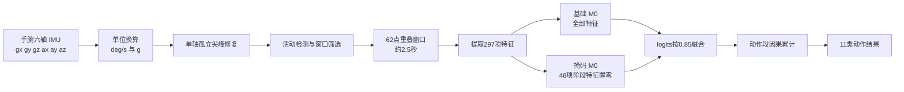

# 手腕六轴 IMU 健身动作识别算法文档

> 面向第一次接触 IMU、特征工程和神经网络的读者。本文描述的是当前项目已经实际训练、测试并达到验收指标的算法，而不是只停留在设想阶段的方案。

## 阅读建议

- 完全没有基础：依次阅读第 1～5 节，再看第 7、9、11、12 节。
- 只想理解最终精度：直接阅读第 13 节。
- 准备移植 ESP32-S3：重点阅读第 8、9、12、15、16 节。
- 准备复现实验：重点阅读第 5、10、11、12、17 节。
- 排查结果异常：先检查第 18 节列出的常见错误。

## 1. 先用一句话理解整个系统

手腕上的 IMU 每秒采集 25 次三轴角速度和三轴加速度；程序把约 2.5 秒的数据清洗后变成 297 个数字，再交给两个小型 BP 神经网络判断动作，最后综合一段动作中当前和过去的判断，输出 11 个健身动作之一。

完整流程如下：



这条链路包含两个同等重要的部分：

1. **数据前处理和特征工程**：让输入尽量干净，并把动作规律变成模型容易使用的数字。
2. **分类与时间决策**：用轻量 BP 网络识别单个窗口，再利用动作持续性稳定输出。

本项目的经验是：只有模型，没有可靠前处理，容易学到毛刺、静止尾段和佩戴差异；只有特征，没有合适分类器和时间决策，也难以稳定区分 `jumping_squat`、`squat`、`tuck_jump`。

---

## 2. 系统要识别什么

### 2.1 传感器位置

系统**只使用手腕上的一个六轴 IMU**，不使用腰部、腿部、胸部或其它位置的传感器。

第 $t$ 个采样点表示为：

$$
\mathbf{x}_t=
[g_{x,t},g_{y,t},g_{z,t},a_{x,t},a_{y,t},a_{z,t}]
$$

其中：

- $g_x,g_y,g_z$：绕传感器三个轴的角速度，单位为 $\mathrm{deg/s}$；
- $a_x,a_y,a_z$：传感器三个轴的加速度，单位为 $g$；
- $1g$ 约等于地球表面的重力加速度；
- 通道顺序永远固定为 `gx、gy、gz、ax、ay、az`。

如果 Python 和 ESP32 使用不同通道顺序，即使模型权重完全正确，输出也会失效。因此，通道顺序属于模型合同的一部分。

### 2.2 11 个动作类别

模型输出顺序固定如下：

| 索引 | 类别名 | 直观含义 |
|---:|---|---|
| 0 | `good_morning` | 早安式体前屈 |
| 1 | `jumping_jack` | 开合跳 |
| 2 | `jumping_lunge` | 跳跃弓步 |
| 3 | `jumping_squat` | 跳跃深蹲 |
| 4 | `lunge` | 普通弓步 |
| 5 | `sit` | 静坐 |
| 6 | `squat` | 普通深蹲 |
| 7 | `trot` | 小跑 |
| 8 | `tuck_jump` | 收腹跳 |
| 9 | `walk` | 行走 |
| 10 | `wave` | 挥手 |

类别索引会直接对应网络输出向量的位置。例如，输出向量第 3 项表示 `jumping_squat` 的分数。Python、模型文件、ESP32 和上位机必须使用同一顺序。

### 2.3 为什么手腕识别不容易

手腕并不直接测量腿部屈伸。它只能看到身体运动传到手臂后的结果，因此存在几类困难：

- `squat` 和 `jumping_squat` 都有下蹲和起身；区别主要在腾空、落地冲击和节奏。
- `jumping_squat` 和 `tuck_jump` 都有双脚起跳；区别主要在腾空期手臂转动、回收速度和冲击形态。
- `jumping_lunge` 与其它跳跃动作都可能出现低支持力阶段，但左右交替和水平运动不同。
- 同一个人不同速度、不同人、不同佩戴方向，会改变三轴幅值和动作相位。
- 一条采集文件可能含有起始静止、结束静止、传感器毛刺和不完整动作。

因此，本算法不依赖单一峰值，而是同时分析强度、节奏、频谱、方向、相位、腾空、冲击和历史一致性。

---

## 3. 新手需要先知道的六个概念

### 3.1 采样率

采样率为：

$$
f_s=25\,\mathrm{Hz}
$$

表示每秒产生 25 行六轴数据，相邻采样点间隔为：

$$
\Delta t=\frac{1}{25}=0.04\,\mathrm{s}
$$

### 3.2 窗口

模型不能只看一个瞬间。它每次读取 $N=62$ 个采样点：

$$
T_w=\frac{62}{25}=2.48\,\mathrm{s}
$$

工程上称为“约 2.5 秒窗口”。窗口形状为：

$$
[62,6]
$$

即 62 个时间点、每点 6 个通道。

相邻窗口向前移动 12 点：

$$
T_s=\frac{12}{25}=0.48\,\mathrm{s}
$$

所以系统在窗口填满后，大约每 0.48 秒产生一次新判断。窗口互相重叠，可以减少动作刚好落在窗口边缘造成的信息丢失。

### 3.3 特征

“特征”是从一段波形中总结出的数字。例如：

- 角速度标准差：手腕转动幅度是否大；
- 主频：动作每秒大约重复几次；
- 腾空比例：窗口中低支持力时间占多少；
- 起跳与落地间隔：动作的飞行时间代理；
- 自相关峰：波形是否周期性重复。

原窗口有 $62\times6=372$ 个原始值，经过确定性计算后得到 297 个特征。手工特征不是随意压缩，而是把与健身动作有关的物理规律显式提供给小模型。

### 3.4 BP 神经网络

BP 是 Back Propagation，即反向传播。项目中的模型本质是若干全连接层：

$$
\mathbf{y}=f(\mathbf{W}\mathbf{x}+\mathbf{b})
$$

其中：

- $\mathbf{x}$：输入特征；
- $\mathbf{W}$：训练得到的权重；
- $\mathbf{b}$：偏置；
- $f$：ReLU 激活函数；
- $\mathbf{y}$：下一层输出。

ReLU 定义为：

$$
\operatorname{ReLU}(v)=\max(0,v)
$$

### 3.5 logits

网络最后输出 11 个尚未归一化的分数，称为 logits：

$$
\mathbf{z}=[z_0,z_1,\ldots,z_{10}]
$$

分数越大，模型越倾向该类别。最终类别通常取：

$$
\hat y=\arg\max_c z_c
$$

本项目直接融合 logits，不必先计算 softmax。这样计算更少，也避免不必要的指数运算。

### 3.6 准确率、召回率和宏 F1

总体准确率为：

$$
\mathrm{Accuracy}=\frac{\text{全部预测正确窗口数}}{\text{全部窗口数}}
$$

某类别 $c$ 的召回率为：

$$
\mathrm{Recall}_c=\frac{TP_c}{TP_c+FN_c}
$$

$TP_c$ 是该动作被正确识别的窗口数，$FN_c$ 是该动作被错判为其它动作的窗口数。

总体准确率可能被样本多、容易识别的类别拉高。因此项目验收重点看逐类召回率，尤其是 `jumping_squat`、`squat`、`tuck_jump`。

宏 F1 是先对每个类别计算 F1，再做等权平均。它不会让大类别拥有更高权重，适合检查类别是否均衡。

---

## 4. 数据读取与单位换算

### 4.1 原始数据格式

每行至少包含六列，模型只读取前六列：

```text
gx_raw,gy_raw,gz_raw,ax_raw,ay_raw,az_raw,...
```

原始整数需要换算为物理单位：

$$
g_c=\frac{g_{c,\mathrm{raw}}}{16.4}
$$

$$
a_c=\frac{a_{c,\mathrm{raw}}}{4096}
$$

换算后：

- 陀螺仪单位为 $\mathrm{deg/s}$；
- 加速度计单位为 $g$；
- 输出数组形状为 `[采样点数,6]`，数据类型为 `float32`。

### 4.2 输入检查

以下输入必须拒绝：

- 少于六列；
- 通道顺序不明；
- 数据无法解析为有限数值；
- Python 与 ESP32 使用不同量程系数。

量程换算必须在毛刺阈值、活动阈值和特征提取之前完成，否则 300 deg/s、1.5 g 等物理阈值将没有意义。

---

## 5. 数据前处理

前处理目标不是把曲线“变得好看”，而是删除明确无效的信息，同时保留真实快速运动。

### 5.1 单轴孤立尖峰修复

对内部采样点 $t=1,\ldots,N-2$ 和通道 $c$，先计算前后邻点均值：

$$
m_{t,c}=\frac{x_{t-1,c}+x_{t+1,c}}{2}
$$

中心点相对邻点均值的偏差为：

$$
r_{t,c}=|x_{t,c}-m_{t,c}|
$$

前后邻点自身差异为：

$$
d_{t,c}=|x_{t-1,c}-x_{t+1,c}|
$$

候选尖峰需同时满足：

$$
r_{t,c}>T_c
$$

$$
d_{t,c}<0.5T_c
$$

阈值为：

$$
T_c=
\begin{cases}
300\,\mathrm{deg/s}, & c\in\{g_x,g_y,g_z\}\\
1.5g, & c\in\{a_x,a_y,a_z\}
\end{cases}
$$

只有当前时刻**恰好一个通道**满足条件时，才执行：

$$
\hat x_{t,c}=m_{t,c}
$$

为什么要求“恰好一个轴”？因为真实落地、起跳和快速摆腕通常会同时影响多个轴。多轴共同突变更可能是真动作，不能当成噪声删除。

边界处理：

- 首点和末点没有双侧邻点，保持原值；
- 多轴同时超阈值，保持原值；
- 前后邻点差异很大，说明处在真实变化边沿，保持原值；
- Python 始终从原始邻点判断，避免一次修复影响下一点判断。

复杂度：时间 $O(6N)$，空间 $O(6N)$。62 点窗口的清洗副本占：

$$
62\times6\times4=1488\,\mathrm{bytes}
$$

训练角色共 417,970 个采样点，该规则只修改 746 行，约 0.18%。这说明它是保守去毛刺，不是大范围平滑。

### 5.2 离线首尾静止段裁剪

某些采集文件在动作结束后还有几十秒静止。如果直接切窗，这些静止窗口会继承文件动作标签，形成错误样本。

逐点活动强度定义为：

$$
s_t=\|\mathbf{a}_t-\mathbf{a}_{t-1}\|_2+
\frac{\|\mathbf{g}_t\|_2}{200}
$$

第一项描述加速度变化，第二项把角速度按 200 deg/s 缩放到相近量级。

活动点阈值 $T_{active}$ 由训练角色 `sit` 数据的逐点活动分数第 90 百分位估计，并且不低于 0.005。本轮实测值约为 0.13165。

检测方式：

1. 使用 25 点，即 1 秒滑动块；
2. 块内至少 20% 的点满足 $s_t>T_{active}$，才认为该块包含动作；
3. 从首个活动点前 0.5 秒保留到最后活动点后 0.5 秒；
4. `sit` 类不裁剪；
5. 没有任何活动块时保留整条记录，避免把弱动作裁成空文件。

该步骤只适用于已经完整保存的离线文件。ESP32 连续流看不到“文件末尾”，实时端应使用活动状态机决定何时开始和结束动作段。

### 5.3 重叠窗口切分

设窗口长度 $N=62$，步长 $S=12$。第 $k$ 个窗口范围为：

$$
[kS,kS+N)
$$

窗口数量为：

$$
M=\left\lfloor\frac{L-N}{S}\right\rfloor+1
$$

其中 $L$ 是裁剪后记录长度。记录短于 62 点时不产生窗口。

### 5.4 窗口级静止过滤

窗口整体运动分数为：

$$
S_w=\operatorname{std}(\|\mathbf{a}_t\|_2)+
\frac{\operatorname{std}(\|\mathbf{g}_t\|_2)}{200}
$$

静止阈值 $T_{rest}$ 取训练角色 `sit` 窗口分数第 85 百分位，并且不低于 0.01。

保留规则：

- `sit`：保留 $S_w\le1.6T_{rest}$ 的窗口；
- 普通动态动作：去掉 $S_w<T_{rest}$ 的窗口；
- `jumping_jack`、`jumping_lunge`、`jumping_squat`、`tuck_jump`：还要求 $S_w\ge1.25T_{rest}$，并且逐点活动比例至少 20%。

这个规则解决两个问题：

- 防止动作文件中的静止片段被错误标为动作；
- 防止跳跃类只保留一个偶然毛刺，却没有连续活动证据。

### 5.5 训练期数据增强

数据增强只用于训练，不用于验证、测试和 ESP32 推理。当前训练器支持：

- 三轴同步旋转，最大约 $\pm35^\circ$，模拟佩戴方向变化；
- 小幅时间形变，最大归一化位移 0.03，模拟动作快慢差异；
- 陀螺高斯噪声，标准差约 0.25 deg/s；
- 加速度高斯噪声，标准差约 0.003 g。

陀螺仪和加速度计必须使用同一个旋转矩阵：

$$
\mathbf{g}'_t=\mathbf{R}\mathbf{g}_t,
\qquad
\mathbf{a}'_t=\mathbf{R}\mathbf{a}_t
$$

否则会制造物理上不可能的传感器组合。

强度缩放增强曾被验证，但会损害弱类边界，因此没有保留在最终方案中。数据增强不是越多越好，必须以固定验证集结果决定。

### 5.6 防止数据泄漏

同一个采集文件会产生大量重叠窗口。如果随机按窗口划分，几乎相同的相邻窗口可能同时进入训练集和测试集，得到虚高成绩。

本项目先按文件分组，再按约 70%/15%/15% 划分训练、验证和测试。决赛补充的 `scy1/scy2` 文件只追加到训练角色，`scy3` 作为外部留出。

基本原则：

- 训练集：拟合权重、均值和标准差；
- 验证集：选择特征、模型、融合权重和时间决策；
- 测试集：参数全部锁定后，只做最终确认；
- 外部留出：检查新增会话和佩戴差异。

---

## 6. 从六轴窗口构造派生信号

297 个特征不是直接从六列分别机械计算。算法先构造 14 条有明确物理意义的序列。

### 6.1 原始六轴序列

$$
g_x,g_y,g_z,a_x,a_y,a_z
$$

### 6.2 模长序列

角速度模长：

$$
g_m(t)=\sqrt{g_x(t)^2+g_y(t)^2+g_z(t)^2}
$$

加速度模长：

$$
a_m(t)=\sqrt{a_x(t)^2+a_y(t)^2+a_z(t)^2}
$$

模长对坐标轴旋转更稳定，适合描述总体运动强度。

### 6.3 相邻变化模长

$$
\Delta g_m(t)=\|\mathbf{g}_t-\mathbf{g}_{t-1}\|_2
$$

$$
\Delta a_m(t)=\|\mathbf{a}_t-\mathbf{a}_{t-1}\|_2
$$

它们突出动作突变、落地冲击和快速换向。

### 6.4 重力对齐序列

窗口平均加速度作为重力方向估计：

$$
\mathbf{u}_g=
\frac{\bar{\mathbf{a}}}{\|\bar{\mathbf{a}}\|_2}
$$

当 $\|\bar{\mathbf{a}}\|_2<10^{-6}$ 时，回退为传感器 z 轴 $[0,0,1]$，避免除零。

垂直加速度：

$$
a_v(t)=\mathbf{a}_t^T\mathbf{u}_g
$$

水平加速度模长：

$$
a_h(t)=\sqrt{\|\mathbf{a}_t\|_2^2-a_v(t)^2}
$$

垂直角速度和水平角速度模长采用同样投影：

$$
g_v(t)=\mathbf{g}_t^T\mathbf{u}_g
$$

$$
g_h(t)=\sqrt{\|\mathbf{g}_t\|_2^2-g_v(t)^2}
$$

平方根内部使用 $\max(v,0)$，防止浮点误差产生负数。

最终 14 条全局序列为：

```text
gx, gy, gz, ax, ay, az,
gyro_mag, acc_mag,
gyro_delta_mag, acc_delta_mag,
acc_vertical, acc_horizontal_mag,
gyro_vertical, gyro_horizontal_mag
```

---

## 7. 297 项特征怎样组成

### 7.1 总体分组

| 索引范围 | 维度 | 特征组 | 主要作用 |
|---|---:|---|---|
| `0:112` | 112 | 14条序列的基础统计 | 幅值、波动、范围、变化速度 |
| `112:160` | 48 | 原始四阶段特征 | 动作前中后相位形态 |
| `160:184` | 24 | 时序和频谱特征 | 节奏、主频、周期性 |
| `184:232` | 48 | 归一化四阶段特征 | 去除幅值后的相位形状 |
| `232:264` | 32 | 冲击分布特征 | 分位数、偏度、峰度、跳变 |
| `264:297` | 33 | 弱类机制特征 | 腾空、冲击、频带、耦合、换向 |

六组总维度为：

$$
112+48+24+48+32+33=297
$$

### 7.2 112 项基础统计

对每条序列 $x_0,\ldots,x_{N-1}$ 计算 8 项：

1. 均值

$$
\mu=\frac{1}{N}\sum_{t=0}^{N-1}x_t
$$

2. 标准差

$$
\sigma=\sqrt{\frac{1}{N}\sum_t(x_t-\mu)^2}
$$

3. 最小值 $\min(x)$；

4. 最大值 $\max(x)$；

5. 均方根

$$
\mathrm{RMS}=\sqrt{\frac{1}{N}\sum_t x_t^2}
$$

6. 相邻绝对差均值

$$
D_{abs}=\frac{1}{N-1}\sum_{t=1}^{N-1}|x_t-x_{t-1}|
$$

7. 围绕均值的过零率

$$
Z=\frac{1}{N-1}\sum_{t=1}^{N-1}
\mathbb{I}[(x_{t-1}-\mu)(x_t-\mu)<0]
$$

8. 一阶差分标准差

$$
\sigma_{\Delta}=\operatorname{std}(x_t-x_{t-1})
$$

14 条序列各 8 项，因此得到 $14\times8=112$ 项。

### 7.3 48 项原始四阶段特征

选择四条关键序列：

```text
acc_vertical
acc_horizontal_mag
gyro_mag
acc_delta_mag
```

每条序列按时间等分成 4 段，每段计算：

- 均值；
- 标准差；
- 最大绝对值。

维度为：

$$
4\text{条序列}\times4\text{段}\times3\text{项}=48
$$

它们回答“窗口开头、中间和结尾分别发生了什么”。例如，跳跃动作可能在某段出现低支持力，随后在另一段出现落地冲击。

### 7.4 24 项时序特征

仍对上述四条关键序列，每条计算 6 项：

1. 高活动比例：去均值绝对值超过该序列标准差的点占比；
2. 归一化峰数：显著局部峰数量除以窗口长度；
3. 主频：非直流功率最大的频率，单位 Hz；
4. 归一化谱熵：能量越分散，值越接近 1；
5. 最强自相关峰：0.15～1.20 秒延迟范围内的最大相关；
6. 最强自相关峰延迟：上述峰所在时间，单位秒。

主频为：

$$
f_d=\frac{k_d f_s}{N},
\qquad
k_d=\arg\max_{k>0}P[k]
$$

谱熵为：

$$
H=-\frac{\sum_k p_k\ln p_k}{\ln K},
\qquad
p_k=\frac{P[k]}{\sum_jP[j]}
$$

近静止序列功率小于 $10^{-12}$ 时，主频和谱熵返回 0。

维度为 $4\times6=24$。

### 7.5 48 项归一化四阶段特征

先对每条关键序列做窗口内标准化：

$$
q_t=\frac{x_t-\mu_x}{\sigma_x}
$$

若 $\sigma_x\le10^{-6}$，整条归一化序列置零。然后按四阶段提取均值、标准差和最大绝对值，得到另一个 48 维组。

该组只强调“波形形状”，弱化绝对幅值。但它也对动作落在窗口中的相位敏感，因此最终第二模型会屏蔽这一组，形成互补判断。注意：屏蔽发生在模型输入端，不会删除原始数据，也不会影响基础模型。

### 7.6 32 项冲击分布特征

每条关键序列计算：

- 10%、25%、50%、75%、90% 分位数；
- 偏度；
- 超额峰度；
- 最大相邻绝对差。

偏度为：

$$
\mathrm{Skew}=\frac{1}{N}\sum_t
\left(\frac{x_t-\mu}{\sigma}\right)^3
$$

超额峰度为：

$$
\mathrm{Kurt}_{ex}=\frac{1}{N}\sum_t
\left(\frac{x_t-\mu}{\sigma}\right)^4-3
$$

当 $\sigma\le10^{-6}$ 时，两者返回 0。最大相邻绝对差为：

$$
J_{max}=\max_t|x_t-x_{t-1}|
$$

维度为 $4\times8=32$。分位数比单个最大值稳健，偏度和峰度可以描述落地冲击造成的非对称长尾和尖峰。

### 7.7 33 项弱类机制特征

这 33 项专门针对容易混淆的动作设计，可分为六组：

| 机制 | 典型特征 | 主要区分内容 |
|---|---|---|
| 频带与谱形 | 低/中/高频比例、谱质心、主峰占比 | 深蹲慢周期与跳跃快周期 |
| 自相关 | 首次过零、次峰、显著峰数、第一时间峰 | 重复节奏与周期稳定性 |
| 通道耦合 | Pearson相关、最大有符号互相关 | 垂直冲击与手腕转动是否同步 |
| 峰值规律 | 峰幅变异系数、峰间隔变异系数 | 每次动作是否规律一致 |
| 腾空与落地 | 低支持力比例、完整飞行事件、冲击宽度 | 普通深蹲与跳跃动作 |
| 手腕形态 | 水平各向异性、PCA换向率、回摆形态 | 手腕摆动方向和回收方式 |

#### 7.7.1 频带功率比例

对去均值并乘 Hann 窗的序列计算单边功率谱：

$$
X[k]=\sum_{n=0}^{N-1}
(x[n]-\bar x)w[n]e^{-j2\pi kn/N}
$$

$$
P[k]=|X[k]|^2
$$

三个频带为：

- 低频：$0.35\le f<1.20$ Hz；
- 中频：$1.20\le f<2.40$ Hz；
- 高频：$2.40\le f<5.00$ Hz。

频带比例：

$$
R_{[f_l,f_h)}=
\frac{\sum_{k:f_l\le f_k<f_h}P[k]}
{\sum_{k>0}P[k]}
$$

普通深蹲通常低频能量更多；收腹跳和快速跳跃动作高频、冲击与谐波成分更多。

#### 7.7.2 自相关

去均值序列的归一化自相关为：

$$
R(\ell)=
\frac{\sum_{t=0}^{N-\ell-1}\tilde x_t\tilde x_{t+\ell}}
{\sum_{t=0}^{N-1}\tilde x_t^2}
$$

`wrist_acf_first_peak` 在 0.3～3.0 秒且不超过半窗的范围内，寻找最早的正局部峰。它描述手腕动作在多长时间后再次呈现相似波形。

该特征在文件分组三折分析中，对 `squat` 与 `tuck_jump` 的稳健效应量约为 1.318，AUC 约为 0.80，是最终 297 维合同新增并保留的关键特征。

#### 7.7.3 低支持力与腾空

加速度模长低于 0.70 g 时，认为处于低支持力候选状态：

$$
F_t=\mathbb{I}[a_m(t)<0.70g]
$$

总比例：

$$
R_f=\frac{1}{N}\sum_tF_t
$$

最长连续比例：

$$
R_{f,max}=\frac{\text{最长连续低支持力点数}}{N}
$$

普通深蹲一般没有持续腾空；跳跃深蹲和收腹跳更容易出现连续低支持力区间。

#### 7.7.4 最大有符号互相关

在 $\pm1$ 秒以内搜索垂直加速度与角速度模长、垂直与水平加速度之间的最强相关：

$$
\rho_{ab}(\ell)=
\frac{\sum a_t b_{t+\ell}}
{\sqrt{\sum a_t^2}\sqrt{\sum b_{t+\ell}^2}}
$$

最终保留绝对值最大相关的符号。正值表示大体同相，负值表示大体反相。跳跃深蹲的垂直推进、落地与手腕转动耦合方式，通常不同于开合跳、跳跃弓步和收腹跳。

#### 7.7.5 峰间隔变异系数

显著正峰门槛为：

$$
T=\bar x+0.5\sigma_x
$$

相邻峰间隔为 $D_q=p_{q+1}-p_q$，间隔变异系数为：

$$
CV_D=\frac{\operatorname{std}(D_q)}{\operatorname{mean}(D_q)}
$$

分母不大于 $10^{-12}$ 或峰数量不足时返回 0。规律重复动作的 $CV_D$ 较小，不规则回收和冲击会使其增大。

#### 7.7.6 事件对齐与手腕方向

完整腾空事件要求低支持力区间前后都仍在窗口内。算法在腾空前寻找起跳推进峰，在腾空后寻找落地冲击峰，并计算：

- 起跳峰到落地峰时间，单位秒；
- 落地连续高冲击宽度，单位秒；
- 腾空期水平角速度模长积分，单位度；
- 腾空期垂直角速度绝对积分，单位度；
- 水平加速度和水平角速度各向异性。

没有完整事件时返回 0，多个事件取中位数，降低误检事件影响。

33 项完整名称和进一步推导见[弱类频谱与峰形特征说明](弱类频谱与峰形特征说明.md)与[手腕换向与周期特征说明](手腕换向与周期特征说明.md)。

### 7.8 特征提取复杂度

| 模块 | 时间复杂度 | 额外空间 |
|---|---|---|
| 基础统计 | $O(N)$ | $O(1)$ |
| 阶段与分位数 | $O(N^2)$ 最坏 | $O(N)$ |
| 直接 DFT | $O(N^2)$ | $O(1)$ |
| 自相关 | $O(N^2)$ | 最多 $O(N)$ |
| 互相关 | $O(N\min(N,f_s))$ | $O(1)$ |
| 峰检测 | $O(N)$ | $O(N)$ |

当前 $N=62$，每 0.48 秒运行一次。生成 C 的特征提取函数在本机编译测得静态栈约 4.8 KiB；ESP32 实际栈仍需通过 `uxTaskGetStackHighWaterMark` 测量。

---

## 8. 特征标准化与第二模型掩码

### 8.1 为什么要标准化

297 项特征的单位和数值范围差异很大：

- 角速度可能达到数百 deg/s；
- 频带比例通常位于 $[0,1]$；
- 时间特征单位为秒；
- 峰间隔、积分和统计量具有不同尺度。

如果直接输入网络，大数值特征容易支配梯度。标准化公式为：

$$
z_i=\frac{x_i-\mu_i}{\sigma_i}
$$

其中：

- $x_i$：第 $i$ 个原始特征；
- $\mu_i$：只在训练集上计算的均值；
- $\sigma_i$：只在训练集上计算的标准差；
- $z_i$：送入网络的无量纲标准分。

当 $\sigma_i<10^{-6}$ 时，训练端把该标准差替换为 1，防止除零。验证集、测试集和 ESP32 只能使用训练集保存的 $\mu_i$、$\sigma_i$，不能各自重新统计。

### 8.2 为什么第二模型把 48 项置零

训练/验证依赖审计发现，归一化阶段特征 `184:232` 对不同动作速度和窗口起点较敏感。完全删除它们会损失部分信息，全部依赖它们又会放大会话差异。

最终使用两个模型：

- 基础模型：保留全部 297 项标准化特征；
- 掩码模型：仅将标准化后的索引 `184:232` 设为 0。

设基础标准化输入为 $\mathbf{z}$，掩码输入为 $\mathbf{z}^{(m)}$：

$$
z_i^{(m)}=
\begin{cases}
0,&184\le i<232\\
z_i,&\text{其它索引}
\end{cases}
$$

标准分 0 等价于“该特征取训练集均值”，不是原始物理量为 0。两套模型分别使用各自训练时保存的均值和标准差。

掩码数组必须是输入副本，不能原地修改基础模型输入，否则两个模型会收到相同数据，融合失去意义。

---

## 9. 六分支 M0 神经网络

### 9.1 为什么不直接把 297 项放进一个大层

297 项包含六类完全不同的信息。若直接输入同一个大层，112 项基础统计可能在数量上淹没只有 33 项的弱类机制特征。

M0 先让每组特征独立编码，再融合：

| 分支 | 输入维度 | 输出维度 | 内容 |
|---:|---:|---:|---|
| 1 | 112 | 24 | 基础统计 |
| 2 | 48 | 12 | 原始阶段 |
| 3 | 24 | 8 | 时序频谱 |
| 4 | 48 | 12 | 归一化阶段 |
| 5 | 32 | 8 | 冲击分布 |
| 6 | 33 | 16 | 弱类机制 |

每个分支执行：

$$
\mathbf{h}_j=\operatorname{ReLU}
(\mathbf{W}_j\mathbf{x}_j+\mathbf{b}_j)
$$

六个输出拼接为 80 维：

$$
\mathbf{h}=
[\mathbf{h}_1;\mathbf{h}_2;\ldots;\mathbf{h}_6]
\in\mathbb{R}^{80}
$$

融合层为：

$$
\mathbf{u}_1=\operatorname{ReLU}
(\mathbf{W}_{80\to64}\mathbf{h}+\mathbf{b}_{64})
$$

$$
\mathbf{u}_2=\operatorname{ReLU}
(\mathbf{W}_{64\to32}\mathbf{u}_1+\mathbf{b}_{32})
$$

分类层输出 11 类 logits：

$$
\mathbf{z}=\mathbf{W}_{32\to11}\mathbf{u}_2+\mathbf{b}_{11}
$$

### 9.2 结构总览

```text
297维输入
  ├─112 → 24 ┐
  ├─ 48 → 12 │
  ├─ 24 →  8 │
  ├─ 48 → 12 ├─ 拼接80 → 64 → 32 → 11类logits
  ├─ 32 →  8 │
  └─ 33 → 16 ┘
```

训练时融合层可使用 dropout，推理时自动关闭。最终分类层后不执行 ReLU，因为 logits 需要允许正值和负值。

### 9.3 参数和运算量

模型类中还定义了 5 个训练期辅助头，但它们不进入 `forward()` 主推理路径。

| 项目 | 单 M0 | 双 M0 |
|---|---:|---:|
| 训练检查点参数，含辅助头 | 12,853 | 25,706 |
| 部署主路径参数，不含辅助头 | 12,523 | 25,046 |
| 部署主路径 MAC | 12,336 | 24,672 |
| float32 主路径权重与偏置 | 50,092 B | 100,184 B |

MAC 表示一次乘法并累加。双模型每 0.48 秒约 24,672 MAC，对 ESP32-S3 的负担很小。实际主要计算量来自 297 项特征中的 DFT、自相关和排序。

---

## 10. 模型怎样训练

### 10.1 主分类交叉熵

softmax 概率为：

$$
p_c=\frac{e^{z_c}}{\sum_{j=0}^{10}e^{z_j}}
$$

真实类别为 $y$ 时，交叉熵为：

$$
L_{CE}=-\log p_y
$$

实现使用 PyTorch 的数值稳定交叉熵，不在代码中手工先算 softmax，避免指数溢出。

### 10.2 跨文件监督对比损失

同类重叠窗口可能来自同一文件，彼此非常相似。监督对比损失要求同类但不同文件的嵌入靠近，同时让不同类别远离。

对归一化嵌入 $\mathbf{v}_i$，相似度为：

$$
s_{ij}=\frac{\mathbf{v}_i^T\mathbf{v}_j}{\tau}
$$

$\tau=0.15$ 是温度。只有“同类、不同文件”的样本才作为正样本，减少模型记住单个采集文件风格的风险。

### 10.3 易混类别间隔损失

对真实类 $y$ 和易混类 $q$，要求真实 logit 至少高出间隔 $m$：

$$
L_{margin}=\max(0,m-z_y+z_q)
$$

当前主要约束：

- `lunge` 与 `squat`；
- `jumping_lunge` 与 `jumping_squat`；
- `jumping_squat` 与 `tuck_jump`。

该损失只处理已知局部边界，不会统一压低所有其它类别。

### 10.4 训练期辅助任务

训练器支持五个二分类属性头：

- 是否跳跃；
- 是否强腾空；
- 是否左右交替；
- 弓步还是深蹲；
- 跳跃深蹲还是收腹跳。

辅助头只用于约束 32 维嵌入，部署时不需要输出。关闭辅助开关时，该损失严格为 0。

### 10.5 总损失

统一形式为：

$$
L=L_{CE}
+\lambda_sL_{SupCon}
+\lambda_mL_{margin}
+\lambda_aL_{aux}
$$

默认权重为：

$$
\lambda_s=0.05,
\qquad
\lambda_m=0.25,
\qquad
\lambda_a=0.10
$$

未启用的分支损失取 0。

### 10.6 优化器与早停

默认训练参数：

| 参数 | 数值 |
|---|---:|
| 优化器 | AdamW |
| 学习率 | $10^{-3}$ |
| 权重衰减 | $10^{-4}$ |
| 批量大小 | 64 |
| 最大 epoch | 350 |
| 早停耐心 | 45 epoch |
| 随机种子 | 固定 |

每个 epoch 都输出：

- 总损失及各分项损失；
- 验证准确率；
- 宏 F1；
- 弱类平均召回；
- 全部 11 类逐类召回；
- 当前最弱类别；
- 最佳 epoch 和剩余耐心。

检查点优先级不是只看总体准确率，而是按以下顺序比较：

1. 最低类别召回；
2. 弱类平均召回；
3. 宏 F1；
4. 总体准确率。

这能防止模型为了提高容易类别而牺牲弱类。

### 10.7 两个最终模型

- Round29 基础 M0：输入全部 297 项；早停后恢复 epoch 5 权重。
- Round37 掩码 M0：标准化后把 `184:232` 置零；早停后恢复 epoch 7 权重。

掩码 M0 单独并未达到全部弱类门槛。它的价值在于错误模式与基础 M0 不完全相同，因此能通过小权重融合修正边界。

---

## 11. 双模型固定融合

基础模型和掩码模型分别输出：

$$
\mathbf{z}^{(b)}_t,
\mathbf{z}^{(m)}_t\in\mathbb{R}^{11}
$$

最终单窗口融合 logits 为：

$$
\mathbf{z}_t=
0.85\mathbf{z}^{(b)}_t+
0.15\mathbf{z}^{(m)}_t
$$

权重只在固定验证角色选择，测试集不参与调权。

为什么基础模型权重大？因为它整体更稳定；掩码模型只负责提供少量不依赖归一化相位的补充证据。两个权重之和为 1，可以保持 logits 大致尺度。

融合前必须检查：

- 两个向量形状完全一致；
- 类别顺序完全一致；
- 权重有限且位于 $[0,1]$；
- 所有 logits 都是有限值。

出现 NaN 或无穷值时，当前窗口必须丢弃，不能写入后续累计状态。

时间复杂度为 $O(C)$，$C=11$；不增加模型参数。

---

## 12. 动作段因果累计

### 12.1 为什么单窗口不够

某个 2.5 秒窗口可能只包含半次动作、落在动作边缘，或者被一次不典型摆腕干扰。健身动作通常会连续重复多次，因此前几个窗口已经提供的信息不应立即丢掉。

早期方案只保留最近 15 个窗口。它在验证集通过，但基础测试中的 `jumping_squat` 只有 78.57%，说明固定长度历史仍不够稳。

### 12.2 累计公式

对一个已经由活动门控划定的动作段，初始化：

$$
\mathbf{S}_0=\mathbf{0},
\qquad n_0=0
$$

第 $t$ 个窗口到来时：

$$
\mathbf{S}_t=\mathbf{S}_{t-1}+\mathbf{z}_t
$$

$$
n_t=n_{t-1}+1
$$

平均 logits 为：

$$
\bar{\mathbf{z}}_t=rac{\mathbf{S}_t}{n_t}
$$

最终输出：

$$
\hat y_t=\arg\max_c\bar z_{t,c}
$$

算法只使用当前和过去窗口，绝不读取未来窗口，因此是“因果”的，可以实时运行。

### 12.3 什么时候必须重置

以下事件必须把累计和和计数清零：

- 活动门控确认进入静止；
- 用户主动结束当前动作；
- 用户切换到另一动作；
- IMU 或 ESP32 断连后重连；
- 更换用户、佩戴手或设备；
- 开始读取新的离线文件。

如果用户从深蹲直接无停顿切换到挥手，却没有重置，旧深蹲证据会延迟新动作判断。这不是模型错误，而是动作段边界错误。

### 12.4 数值稳定和资源

状态包含：

- 11 个 `float` 累计和；
- 1 个 `uint32_t` 窗口计数。

RAM：

$$
11\times4+4=48\,\mathrm{bytes}
$$

每窗口时间复杂度 $O(11)$，空间复杂度 $O(11)$。

若 C 端计数达到 `UINT32_MAX`，把所有累计和与计数同时减半，再加入当前窗口，防止整数回绕。正常健身动作段几乎不可能达到该上限，这只是完整边界保护。

---

## 13. 最终评估结果怎样理解

### 13.1 固定基础测试

最终测试包含 29 个文件、5,634 个有效窗口。指标按动作段累计后的每个窗口预测计算。

| 动作 | 逐类召回率 |
|---|---:|
| `good_morning` | 99.60% |
| `jumping_jack` | 100.00% |
| `jumping_lunge` | 99.81% |
| `jumping_squat` | 89.12% |
| `lunge` | 100.00% |
| `sit` | 100.00% |
| `squat` | 99.80% |
| `trot` | 100.00% |
| `tuck_jump` | 100.00% |
| `walk` | 99.10% |
| `wave` | 99.87% |

总体结果：

- 准确率：**99.29%**；
- 宏 F1：**98.96%**；
- 最低类别召回：**89.12%**；
- `jumping_squat`、`squat`、`tuck_jump` 均达到 85% 要求。

### 13.2 外部会话

外部 `scy3` 包含 `jumping_jack`、`jumping_lunge`、`jumping_squat` 各一个新会话。三类召回和总体准确率均为 100%。

这个结果说明当前方案对这三个外部会话有效，但不能据此宣称对所有人、所有佩戴方式都达到 100%。原始数据没有可靠采集者 ID，因此还不能称为严格跨人员盲测。

### 13.3 为什么不能只看 99.29%

如果只看总体准确率，会忽略最难类别。项目真正的验收结论应写成：

> 固定测试总体准确率 99.29%，全部 11 类最低召回 89.12%，三个目标弱类均超过 85%。

完整机器可读报告见[最终固定融合测试报告](results/final_fixed_ensemble_confirmation_20260712.json)。

---

## 14. 从失败方案学到什么

项目不是第一次训练就达到当前结果。对新手最有价值的经验如下。

### 14.1 更多特征不一定更好

曾经把候选特征从 296 项增加到 302 项，但验证最低召回下降。原因可能包括：

- 新特征与旧特征重复；
- 某些特征只在少量文件上可分；
- 小数据下特征越多越容易学习会话噪声；
- 多项弱特征一起输入后，单项优势可能互相抵消。

最终做法是先做文件分组分离度审计，再训练；不通过审计的特征不进入生产顺序。

### 14.2 更深网络不一定更好

更深的 M1 六分支模型验证结果退化。当前数据量和手工特征已经适合较小的 M0；继续增加深度只会提高过拟合风险和 ESP32 负担。

### 14.3 强度增强不一定模拟真实差异

全局强度缩放和只针对 `jumping_squat` 的缩放均未稳定改善弱类。真实跨会话差异不只是“幅值变大或变小”，还包括节奏、相位、佩戴方向和手臂动作习惯。

### 14.4 前处理必须先于特征和模型

长静止尾段、单轴毛刺和错误动作窗口会污染所有后续特征。先修正样本质量，才能判断某个特征或模型是否真的有效。

### 14.5 时间信息可以在模型外利用

无需改成大型 RNN 或 Transformer，也能利用动作连续性。动作段累计只需 48 字节状态，却显著提高最弱类别稳定性，适合 MCU。

---

## 15. ESP32-S3 移植评估

### 15.1 硬件是否放得下

ESP32-S3 官方规格包含最高 240 MHz 双核 LX7、512 KiB 片内 SRAM和神经网络/信号处理向量指令。参考[ESP32-S3 官方页面](https://www.espressif.com/en/products/socs/esp32-s3)和[官方数据手册](https://documentation.espressif.com/esp32-s3_datasheet_en.pdf)。

当前部署主路径预算：

| 资源 | 估算 |
|---|---:|
| 双 M0 float32 权重与偏置 | 100,184 B，约 97.84 KiB |
| 两模型均值和标准差 | 4,752 B，约 4.64 KiB |
| 原始 62×6 窗口 | 1,488 B |
| 297维特征 | 1,188 B |
| 动作段累计状态 | 48 B |
| 双模型主路径运算 | 24,672 MAC/窗口 |
| C特征函数本机静态栈参考 | 约 4.8 KiB |

权重和标准化参数应声明为 `const`，保存在 Flash 映射区，不应启动时整体复制到内部 RAM。无 PSRAM 的 ESP32-S3-N8 也具备可行性；带 PSRAM 的型号余量更大，但不是该模型的硬性要求。

### 15.2 真正的耗时重点

双 BP 只有约 2.47 万 MAC，计算量很低。主要耗时来自：

- 直接 DFT；
- 自相关和互相关；
- 分位数和中位数排序；
- 297 项特征组织。

系统每 0.48 秒才需要完成一次窗口更新。建议实机目标：

- “清洗+特征+双模型+累计”平均低于 100 ms；
- 最差低于 480 ms；
- 推理任务栈至少配置 16 KiB，并实测高水位；
- 运行时内部剩余堆建议大于 100 KiB；
- 连续运行 1 小时无栈溢出、内存下降和 NaN。

### 15.3 当前已完成的 C 能力

生成 C 已具备：

- 六轴清洗；
- 297 项特征提取；
- 标准化阶段掩码；
- 固定 `0.85/0.15` logits 融合；
- 15 窗口历史平滑；
- `BpBoutAccumulator` 动作段累计与重置。

Python/C 一致性结果：

- 297 项特征最大绝对误差：$7.63\times10^{-5}$；
- K15 平滑误差：0；
- 双模型融合误差：0；
- 动作段累计和重置误差：0。

### 15.4 当前还没有完成什么

当前自动导出器仍只会完整导出单个平铺 `BPNet` 的权重。最终方案使用两个六分支 M0，因此还需要：

1. 导出两个 M0 的六组分支、融合层和分类层数组；
2. 在 C 中实现与 PyTorch 完全一致的六分支前向；
3. 每个模型使用自己的均值和标准差；
4. 第二模型执行 `184:232` 掩码；
5. 对两个 M0 做 Python/C logits 逐值测试；
6. 在 ESP32-S3 实机测量时延、任务栈、堆和连续运行稳定性。

因此，准确率和硬件资源已经通过，但“最终双 M0 可直接烧录头文件”尚未完成。旧单模型头文件不能当作最终 Round41 模型。

### 15.5 是否需要 int8

当前 float32 模型已经能放入 ESP32-S3，优先完成 float32 一致性最稳妥。int8 可把主路径权重缩小到约四分之一，并可使用 ESP-NN 加速，但必须重新校准并验证逐类召回，不能只检查总体准确率。

---

## 16. 实时推理的完整步骤

下面用不依赖具体编程语言的步骤描述 ESP32 应执行的逻辑。

### 16.1 初始化

1. 配置 IMU 量程和 25 Hz 采样率。
2. 创建容量至少为 62×6 的环形采样缓冲区。
3. 清零动作段累计和与窗口计数。
4. 加载两套模型权重、均值、标准差和类别顺序。
5. 检查所有常量与 Python 导出清单一致。

### 16.2 每个采样点

1. 读取 `gx、gy、gz、ax、ay、az` 原始值。
2. 换算为 deg/s 和 g。
3. 写入环形缓冲区。
4. 更新实时活动门控。
5. 若确认进入静止，重置动作段累计状态。

### 16.3 每累计 12 个新点

1. 若缓冲区不足 62 点，不推理。
2. 按时间顺序复制最近 62 点。
3. 执行单轴孤立尖峰修复。
4. 计算窗口运动分数；无效窗口不进入模型。
5. 提取 297 项特征。
6. 用基础模型均值和标准差构造基础输入。
7. 运行基础 M0，得到 11 维 logits。
8. 用掩码模型自己的均值和标准差构造第二输入。
9. 将第二输入索引 `184:232` 置零。
10. 运行掩码 M0，得到 11 维 logits。
11. 按 `0.85/0.15` 融合。
12. 加入当前动作段累计器。
13. 对累计平均 logits 取 `argmax`。
14. 把类别索引、类别名、累计窗口数和必要诊断值发送给上位机。

### 16.4 异常处理

- 任一特征或 logit 非有限：丢弃当前窗口并记录错误；
- IMU 断连：停止输出并重置动作段；
- 类别表或特征维度不匹配：拒绝启动推理；
- 标准差小于阈值：按导出值 1 处理；
- 活动段过长达到计数上限：累计和与计数共同减半；
- 用户切换动作：先重置，再接受新动作窗口。

---

## 17. 如何复现实验结果

### 17.1 Python 环境

从仓库根目录安装依赖：

```powershell
python -m venv .venv
.\.venv\Scripts\python.exe -m pip install -r python\requirements.txt
```

### 17.2 固定双模型评估

评估器不提供融合权重或决策模式调参开关，避免再次利用测试集选择参数：

```powershell
.\.venv\Scripts\python.exe python\evaluate_fixed_ensemble.py `
  --dataset-dir IMU_Dataset\imu_dataset_for_final `
  --extra-train-dir IMU_Dataset\finals_weak_classes\train `
  --external-holdout-dir IMU_Dataset\finals_weak_classes\external_holdout `
  --base-artifact-dir outputs\round29_clean297_m0_validation_20260712 `
  --masked-artifact-dir outputs\round37_suppress_normalized_phase_validation_20260712 `
  --output outputs\final_fixed_ensemble_confirmation_20260712.json
```

### 17.3 自动测试

```powershell
.\.venv\Scripts\python.exe -m unittest discover -s python -p "test_*.py"
```

当前完整测试共 86 项，覆盖：

- 单轴毛刺与多轴冲击；
- 特征维度和顺序；
- 模型结构；
- 标准化阶段掩码；
- 固定融合；
- 动作段累计和重置；
- 训练逐 epoch 日志；
- C 头文件合同；
- 数据清单与外部留出边界。

---

## 18. 新手最容易犯的错误

### 18.1 把逐类召回率叫成每类总体准确率

“某动作识别率”在本项目中实际指该动作召回率。总体准确率只有一个，不能给每类分别计算同一种总体准确率后混用。

### 18.2 在整个数据集上计算均值和标准差

这会让验证集或测试集信息进入训练流程，形成数据泄漏。只能用训练角色统计。

### 18.3 按窗口随机划分数据

重叠窗口高度相似。必须按原始文件划分，再切窗口。

### 18.4 在测试集上继续调融合权重

测试集一旦用于选参数，就不再是独立测试。当前权重和动作段模式均由验证角色锁定。

### 18.5 在 ESP32 上重新排列特征

模型权重绑定固定索引。即使两个特征公式都正确，只要顺序交换，结果就会错误。

### 18.6 不重置动作段累计器

累计器会记住上一动作。静止、切换、断连和换用户时必须重置。

### 18.7 只移植网络，不移植前处理

模型训练时看到的是单位换算、去毛刺、窗口过滤和标准化后的输入。ESP32 缺少其中任何一步，都会造成训练与部署分布不一致。

### 18.8 认为模型越大越准

当前更深 M1 已经验证退化。模型规模应由数据量、验证弱类和部署预算共同决定。

---

## 19. 术语表

| 术语 | 新手解释 |
|---|---|
| IMU | 惯性测量单元，本项目包含三轴陀螺仪和三轴加速度计 |
| 采样率 | 每秒记录多少次数据，本项目为 25 Hz |
| 窗口 | 一次交给特征提取器的连续数据片段 |
| 特征 | 从波形提取、用于分类的数字摘要 |
| 标准化 | 用训练均值和标准差把不同尺度特征变到相近范围 |
| BP | 使用反向传播训练的神经网络 |
| 全连接层 | 每个输出都由全部输入加权求和得到的网络层 |
| ReLU | 把负值变成 0、正值保持不变的激活函数 |
| logits | 模型对各类别输出的未归一化分数 |
| softmax | 把 logits 转换为和为 1 的概率 |
| epoch | 完整遍历一次训练数据 |
| 过拟合 | 记住训练数据，却不能识别新文件 |
| 数据泄漏 | 验证或测试信息提前进入训练和调参 |
| 召回率 | 某动作真实窗口中，被正确识别的比例 |
| 宏 F1 | 各类别 F1 等权平均，避免大类别支配结果 |
| 因果 | 只使用当前和过去，不读取未来数据 |
| MAC | 一次乘法并累加，用于估算神经网络计算量 |
| Flash | 保存程序和常量权重的非易失存储器 |
| SRAM | 程序运行时使用的快速内存 |

---

## 20. 当前结论

当前算法已经完成：

- 手腕六轴数据单位换算和保守前处理；
- 297 项 Python/C 一致特征；
- 两个六分支轻量 M0；
- 固定 `0.85/0.15` logits 融合；
- 48 字节动作段因果累计状态；
- 固定测试全部 11 类召回超过 85%；
- 总体准确率 99.29%，最低类别召回 89.12%；
- ESP32-S3 模型规模与计算预算评估通过。

仍需完成：

- 两个六分支 M0 的自动 C 权重导出；
- 六分支 C 前向与 Python logits 逐值一致性；
- ESP32-S3 实机时延、栈、堆和长时间稳定测试；
- 更多独立用户、不同佩戴方向和连续动作切换数据验证。

算法的核心不是“用一个神经网络猜动作”，而是：先保证数据可靠，再提取可解释的运动证据，用小模型组合这些证据，最后利用动作持续性稳定输出。
