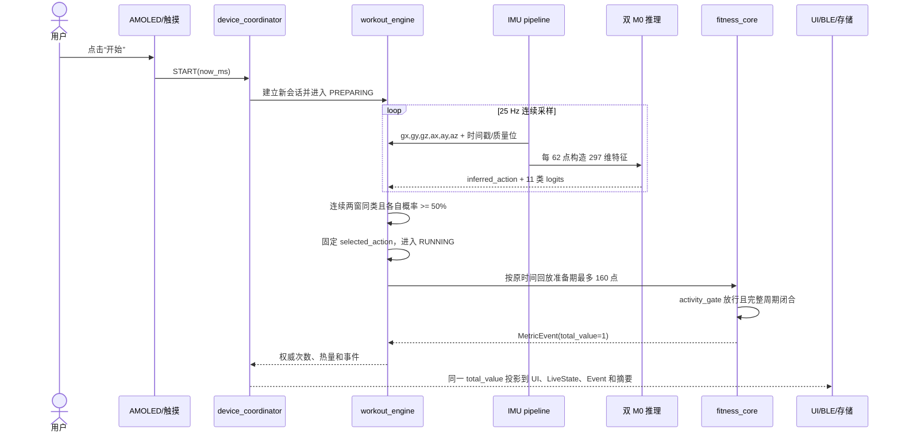
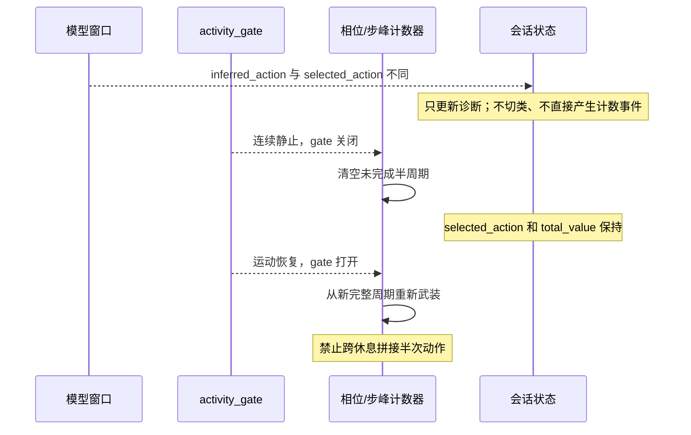
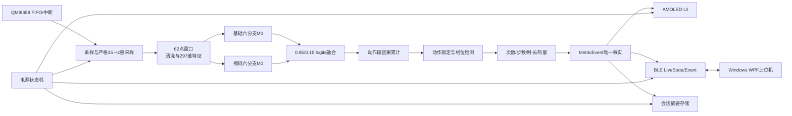
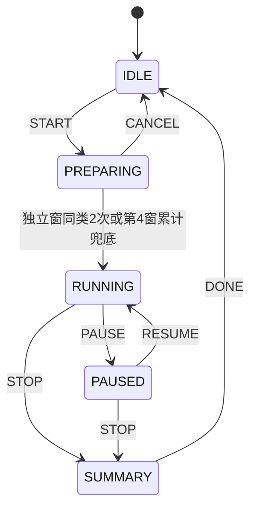
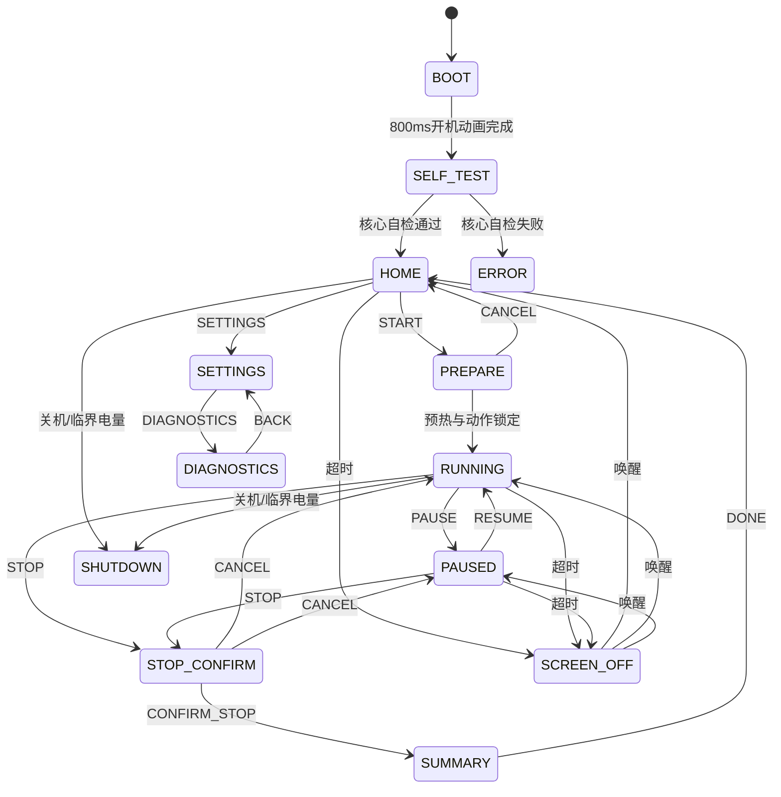
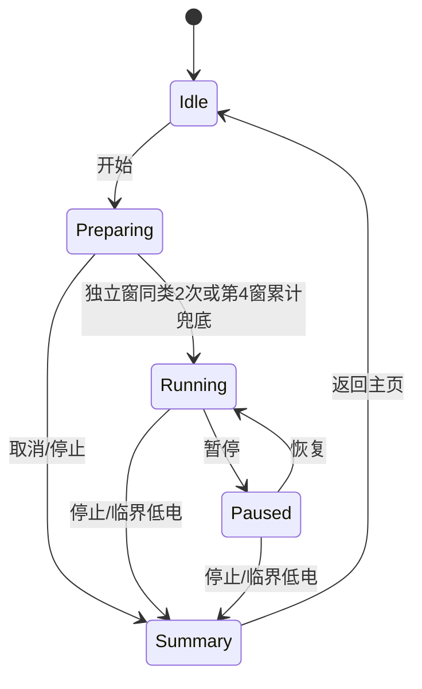
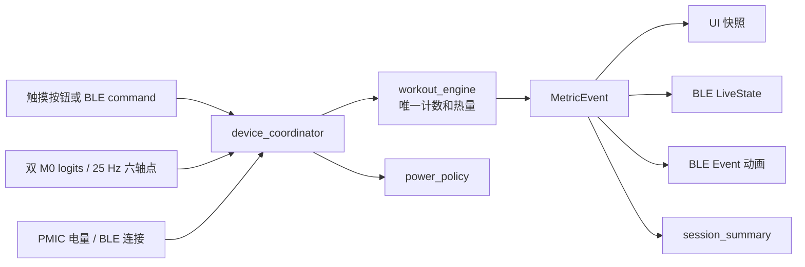
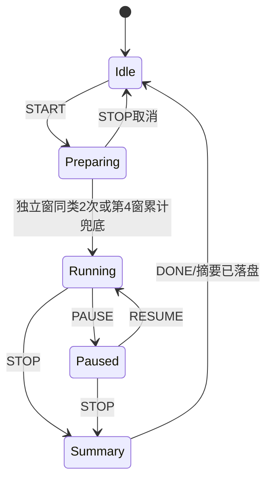

# 系统架构与业务流程

> 产品边界：右手腕佩戴；一次会话只做一种主动作；次数和步数动作在休息、静止和无效数据时由活动门与质量门冻结；低置信度或异类分类只作诊断，不切换主动作；`sit` 在运行态按合法单调 tick 累计时长；实体无振动马达；10 次动作的计数验收容差为 ±2 次。本文、当前源码和自动化测试共同构成实现依据。

## 1. 文档范围

统一说明 ESP32、上位机、任务队列、训练状态机、协调器、指标事实链、故障恢复和发布验收。

## 2. 阅读导航

| 章节 | 用途 |
|---:|---|
| 开源教程 | 从点击开始到第一次权威计数 |
| 3 | 产品目标、总体架构、任务、状态机和上下位机边界 |
| 4 | 主动作确认、运行事实、暂停与热量 |
| 5 | 事务副本、唯一事件、BLE 投影和主程序集成 |

## 开源教程：从点击开始到第一次计数

这一节先把后文的状态机、队列和算法名连成一条可运行链。第一次阅读时先理解这里，再按需要进入后面的协议字段、数学公式和资源预算。

### 1. START 到首个 `MetricEvent`



首个 62 点窗口在 25 Hz 下约需 2.48 秒，后续窗口每 12 点，即约 0.48 秒产生一次。动作名称通常在第二个一致窗口确认；准备期原始点保存在固定环形缓冲中，确认动作后按原时间回放，所以确认前已经完成的完整动作不必全部丢失。计数本身按 25 Hz 点实时推进，不等待下一次分类窗口。

### 2. 四个容易混淆的运行事实

| 名称 | 何时产生 | 能否在会话中变化 | 唯一职责 | 不能做什么 |
|---|---|---|---|---|
| `selected_action` | PREPARING 确认完成时 | 否；换动作必须停止并开始新会话 | 选择本次会话计数器、界面动作名和会话摘要类别 | 不能被静坐、休息或单窗误判替换 |
| `inferred_action` | 每个分类窗口 | 是 | 保存当前窗口模型诊断结果 | 不能直接改累计次数或切换本次会话动作 |
| `activity_gate` | 最近 25 个原始点 | 是，带迟滞 | 判断当前是否存在足够运动；休息时冻结并清空半周期 | 不能决定动作类别，也不能清零历史次数 |
| `MetricEvent` | 完整周期、有效步峰或完整一秒成立时 | 每个新指标产生一次 | 携带唯一权威累计值，驱动 UI、BLE 和存储 | 消费者不得再执行 `+=1` |

这四层分离解决两个产品问题：分类噪声不会把深蹲会话改成“静坐 3 次”；用户中途站立休息时，主动作名称和历史次数保持不变，恢复后必须从新的完整周期继续。

### 3. 休息、噪声和异常时序



| 事件 | 主动作 | 已确认累计 | 未完成周期 | 分类/计数处理 |
|---|---|---|---|---|
| 单个异类或低置信窗口 | 保留 | 保留 | 由活动门和质量位决定 | 只写 `inferred_action` 诊断 |
| 次数/步数动作中站立或静坐休息 | 保留 | 保留 | 清空 | gate 关闭，不发布新计数 |
| 恢复原动作 | 保留 | 保留 | 从头建立 | 新完整周期闭合后继续累计 |
| IMU GAP/RESET/时间倒退 | 保留当前会话语义 | 保留 | 清空 | 重建连续窗口，不能跨断点计数 |
| PAUSE/RESUME | 保留 | 保留 | 恢复时清空 | 暂停时间不积分，恢复后重新武装 |
| STOP | 写入摘要后结束 | 冻结最终值 | 清空 | 迟到样本和事件不得改变摘要 |

### 4. 安全修改状态机的最短路径

1. 先写不可破坏的产品不变量，例如“休息不切换 `selected_action`”“一次 `MetricEvent` 的 `total_value` 在三端同值”。
2. 优先修改纯 C 状态层，不在触摸回调、BLE 回调或 LVGL renderer 内加入业务分支。
3. 对正常路径、重复命令、时间倒退、NaN、暂停恢复、断流和队列失败分别补主机测试。
4. 状态层通过后，再更新 `ui_context_t`、`LiveStateV1` 或摘要投影；消费者只复制权威值。
5. 任何协议字段变化都同时更新 C/C# codec、黄金向量和兼容规则；任何可见文案变化都重生中文字体并跑缺字检查。
6. 最后运行统一软件门和 ESP-IDF 真链接；主机测试通过不能替代真板触摸、BLE、功耗和长稳。

### 5. 源码与测试入口

- 产品入口：[main.c](../esp32/firmware/main/main.c)
- 会话与动作确认：[workout_engine.c](../esp32/firmware/components/workout_engine/workout_engine.c)
- 唯一事务编排：[device_coordinator.c](../esp32/firmware/components/device_coordinator/device_coordinator.c)
- 周期、步峰和 `MetricEvent`：[fitness_core.c](../esp32/firmware/components/fitness_core/src/fitness_core.c)
- UI 状态机：[ui_state_machine.c](../esp32/firmware/components/ui/ui_state_machine.c)
- 中文页面模型：[ui_presenter.c](../esp32/firmware/components/ui/ui_presenter.c)
- 训练引擎测试：[run_tests.ps1](../esp32/host_tests/workout_engine/run_tests.ps1)
- 协调器测试：[run_tests.ps1](../esp32/host_tests/device_coordinator/run_tests.ps1)
- 计数核心测试：[run_tests.ps1](../esp32/host_tests/fitness_core/run_tests.ps1)
- 统一软件验证：[verify_software.ps1](../tools/verify_software.ps1)

## 3. 产品目标、总体架构、任务、状态机和上下位机边界

> 适用工程：手腕六轴 IMU 健身动作识别手柄、ESP32-S3 固件及 Windows 上位机。
> 目标硬件：Waveshare ESP32-S3-Touch-AMOLED-2.06，使用厂家原配 400 mAh 电池。
> 文档性质：依据当前仓库源码给出可落地软件总设计，并明确软件门、真板门和发布门的独立边界。

### 1. 文档目的与验证边界

本系统包含两端：

1. **手表端**：采集手腕六轴 IMU，识别健身动作，计次数或步数，估算热量，通过 AMOLED 和 BLE 向用户反馈。实体没有振动马达。
2. **Windows 上位机**：连接手柄，实时显示动作动画、次数、步数、时长、热量、电量和数据质量，保存训练历史并提供诊断信息。

验证分为三类，不能互相替代：

| 验证门 | 含义 |
|---|---|
| **软件门** | 纯 C、Python 或 .NET 测试验证算法、协议和状态机 |
| **构建门** | 生产 `app_main`、ESP-IDF 组件和依赖共同编译、链接并生成 ESP32-S3 镜像 |
| **真板门** | 在厂家原配开发板上烧录，验证传感器、显示、触摸、BLE、功耗和长时间稳定性 |

当前最重要边界：

- 297 维特征、双 M0 推理、动作相位、计数、卡路里、UI 状态机、电源状态机、NimBLE 服务、会话传输、LittleFS 双槽存储及 Windows 六页软件均已有实现和主机测试。
- `esp32/firmware/main/main.c` 已是生产多任务入口：初始化 NVS、板级运行时、QMI8658、AXP2101、PCF85063、LittleFS、UI、BLE、存储和电源管理，并用固定队列串联应用协调器与推理流水线。
- 每次发布都必须重新执行 ESP-IDF 5.5.4 整机构建，并从当前构建输出记录镜像大小、分区余量和 SHA-256；文档不硬编码易漂移的产物值。
- 不同硬件批次的真屏/真触摸、QMI/PMIC、BLE 配对/MTU/弱信号、LittleFS/TF 掉电、功耗和长时间稳定性必须持续回归。
- 本文给出的电流、续航、时延和栈余量是**验收预算**，不是已经测得的硬件结果。

---

### 2. 产品目标与设计原则

#### 2.1 用户目标

用户拿起手柄后，应能完成以下闭环：

1. 长按原配电源键开机。
2. 观看简短开机动画和自检结果。
3. 点击大号“开始”按钮。
4. 点击开始后立即做本次唯一动作；设备立刻采样，首个完整窗口锁类并补算准备期完整周期。
5. 连续完成同一种健身动作。
6. 手柄自动显示动作名称、次数或步数、时长和热量。
7. 每确认一次重复动作，AMOLED 与 BLE 立即更新同一个设备权威累计值。
8. Windows 上位机同步播放对应动作动画，并显示设备权威指标。
9. 暂停、继续或停止训练。
10. 查看总结，保存最近训练记录。
11. 长按关机；低电量时自动安全保存并关机。

#### 2.2 核心原则

- **ESP32 是唯一权威源**：动作、次数、步数、时长和热量均由设备计算；PC 不重复推理、不自行补计数。
- **一次事件只产生一次事实投影**：一个确认计数事件同时驱动 UI、BLE 和存储；任何重试不得重复累计。
- **采样优先于界面**：IMU 读取和推理优先级高于动画、日志、BLE 批量传输和存储。
- **不阻塞实时链**：存储、BLE、LVGL 都通过队列或异步驱动，不在采样/推理任务中等待。
- **状态可恢复**：BLE 重连、应用重启和存储掉电恢复都以设备权威快照和版本号为准。
- **低功耗由状态机决定**：屏幕、IMU、BLE、CPU、触摸、TF 和音频不由页面代码随意开关。
- **先保证正确，再做炫酷效果**：动画短、黑底、局部更新，不牺牲采样稳定性和电池续航。

---

### 3. 板载资源分配

#### 3.1 资源用途

| 板载资源 | 产品用途 | 默认策略 | 发布验收重点 |
|---|---|---|---|
| 410×502 AMOLED | 开机动画、训练主界面、总结、设置和诊断 | 黑底；训练亮度 35%；暂停 15%；待机关闭 | 文字边缘、圆角安全区、刷新稳定性和亮度 |
| 电容触摸 | START、PAUSE、RESUME、STOP、SETTINGS 等操作 | 活动页连续扫描；待机只保留可行的唤醒监视 | 控制器型号、坐标映射、热区和唤醒 |
| QMI8658 | 六轴手腕运动采集 | 训练活动模式；暂停/主页使用 WOM；深睡默认开启但严格门控 | ODR、时间戳、ACTIVE/WOM/OFF 和误唤醒率 |
| GPIO18 | 当前产品未使用 | 真表无振动马达；不输出 PWM、不建立触觉任务 | 保持高阻，不进入产品运行链 |
| AXP2101 | 电量、充电状态、软关机和电源管理 | 15% 告警、8% 禁止新训练、5% 安全关机 | SOC 精度、充电状态、软关机和低电门槛 |
| PCF85063 RTC | 时间保持、会话 UTC 时间和轻睡唤醒候选 | 有效 RTC 时间写入摘要；无效时保存相对时长 | 走时、掉电保持、校时和唤醒 |
| BLE | 与 Windows 上位机通信 | 单 PC 连接、安全配对、状态通知 | 配对、Manifest、通知、补传、重连和绑定删除 |
| TF 卡 | 可选原始 IMU 日志和导出 | 默认不挂载；事务性短时启用 | 挂载、拔卡、写满、CRC 和实时链隔离 |
| 扬声器/功放 GPIO46 | 可选短提示音 | v1 默认关闭，避免静态功耗 | 不作为核心验收项 |
| 麦克风 | 本产品 v1 不使用 | 始终关闭 | 明确不进入主链 |
| 原配 400 mAh 电池 | 整机供电 | 80% 可用容量做保守预算 | 容量已固定；实际曲线待测 |

#### 3.2 板型版本风险

本工程本地锁定的 BSP 资料与厂家当前仓库可能对应不同物料代次：

- 一类配置为 SH8601 AMOLED 与 FT3168 触摸；
- 另一类配置为 CO5300 AMOLED 与 CST9220 触摸。

当前产品构建只公开厂家受管 BSP 支持的 SH8601/FT5x06 兼容路径；CO5300/CST9220 原生 Kconfig 选项不可选。禁止在未知板上盲写另一控制器寄存器。启动自检读取编译时板型标识，并遵循：

1. 受支持的兼容路径配置有效：继续启动。
2. 不受支持的板型请求：在配置或编译时拒绝，不能生成看似可选但运行失败的镜像。
3. 面板初始化失败：记录串口错误，保持 IMU 和 BLE 在安全关闭状态；此时没有可用屏幕，不能显示 ERROR 页。
4. 面板和 LVGL 成功后，先显示开机/自检页，再初始化 QMI、PMIC、RTC、会话存储和业务域；这些后续关键项失败时进入可见中文 ERROR 页。

---

### 4. 系统总体架构



#### 4.1 数据权威关系

`MetricEvent` 是一次新业务指标的唯一事实。事件字段至少包含：

- `session_seq`：会话序号；
- `event_seq`：会话内单调事件序号；
- `action_id`：0～10；
- `metric_kind`：次数、步数或持续时间；
- `metric_value`：累计值；
- `gross_microkcal`：毛热量；
- `active_microkcal`：扣除 1.0 MET 静息基线后的活动热量；
- `quality_flags`：采样连续性、传感器和推理质量位；协议版本 1 的执行器保留位固定为 0。

UI、BLE 和存储只能消费事件，不得各自推导“是否又完成了一次动作”。这样可以避免：

- UI 显示 10 次，而 PC 显示 11 次；
- BLE 重试导致重复计数；
- 某个消费者先更新，后续算法又回滚次数；
- 停止后迟到的推理结果继续增加记录。

---

### 5. 产品状态机

系统同时存在训练、UI、电源和 BLE 四个状态机。它们互相关联，但不能合并成一个巨大枚举。

#### 5.1 训练状态机



训练规则：

- `PREPARING` 从点击开始立即缓存最近 160 个 25 Hz 点；该容量覆盖一次 62 点窗口重建和三次 12 点步进。当前独立窗口 Top-1 连续两窗一致且每窗概率至少 50% 时锁定；最多观察四窗，仍不稳定时按累计平均 logits 的 argmax 选择本会话主动作。
- 锁定时按原时间顺序回放准备期样本，使分类显示前已经完成的完整动作可以补计。
- `RUNNING` 固定本次会话的主动作、计数器和界面动作；后续窗口类别只写诊断。25 点运动/静止迟滞门冻结或恢复计数，门变化时清空半周期，恢复前后不会拼接一次动作。
- START、成功 RESUME、IMU RESET/GAP 或长时间断点会清除不能跨边界拼接的不完整相位；RESUME 保留已锁定动作、历史次数和热量。
- `PAUSED` 不推进相位、计数和热量；恢复时重设积分时间基准，暂停时间不计入热量。
- `STOP` 幂等；重复停止不产生第二份摘要或第二组状态事件。

#### 5.2 UI 状态机



`BOOT`、`RUNNING`、`STOP_CONFIRM` 等英文只作为源码与协议稳定枚举；设备屏幕和 Windows 上位机面向用户统一显示中文。LVGL 产品构建使用项目自带的 16/20/28 px Noto Sans SC 子集，否则 UTF-8 中文会显示为缺字方框。无开发板时，可在 VS Code 工作树旁运行 `tools/watch_ui_preview/watch_ui_preview.py`，通过屏幕外开发导航直接检查 13 个真实页面；该导航不进入固件。

迟到的 `METRIC_UPDATED` 只允许在 `RUNNING` 或由训练页进入的 `SCREEN_OFF` 状态生效。主页、暂停、总结和错误页必须忽略该事件。

#### 5.3 电源状态机

电源状态包括：

```text
BOOT
HOME
RUNNING
RUNNING_SCREEN_OFF
PAUSED
CONNECTED_STANDBY
ADVERTISING_STANDBY
DEEP_STANDBY
SAFE_SHUTDOWN
```

充电是状态机的正交属性，不单独建立“CHARGING”页面状态。充电时仍可处于主页、训练或暂停。

| 电源状态 | AMOLED | IMU | BLE | CPU/睡眠 |
|---|---|---|---|---|
| BOOT | 35% | WOM | 关闭 | 240 MHz 完成自检 |
| HOME | 35% | WOM | 快广播或活动连接 | DFS 40～240 MHz |
| RUNNING | 35% | 活动采集 | 快广播或活动连接 | 推理附近锁 240 MHz |
| RUNNING_SCREEN_OFF | 关闭 | 活动采集 | 慢广播或活动连接 | 保持实时链 |
| PAUSED | 15% | WOM | 快广播或活动连接 | DFS |
| CONNECTED_STANDBY | 关闭 | WOM | 已连接 modem-sleep | 自动 Light-sleep |
| ADVERTISING_STANDBY | 关闭 | WOM | 慢广播 | 自动 Light-sleep |
| DEEP_STANDBY | 关闭 | WOM，严格门控 | 关闭 | GPIO21 EXT1 有效才 Deep-sleep，失败拒绝睡眠 |
| SAFE_SHUTDOWN | 关闭 | 关闭 | 关闭 | 刷盘后请求 PMIC 断电 |

#### 5.4 BLE 连接状态

设备端 BLE 和 Windows 端按以下顺序建立连接：

```text
未连接
-> 广播/扫描
-> 系统安全配对
-> GATT服务发现
-> 订阅Control indication
-> 订阅LiveState/Event notification
-> 读取Manifest
-> 读取权威LiveState快照
-> 已连接
```

只有 Manifest、订阅和快照都成功后，上位机才显示“已连接”。仅发现广播名不等于连接完成。

---

### 6. FreeRTOS 任务与队列架构

> 本节定义生产 `app_main` 的任务和队列。栈容量来自源码配置；发布验收必须在真板上测量高水位。

#### 6.1 任务表

| 任务 | 实际优先级 | 核心 | 栈容量 | 触发方式 | 主要职责 |
|---|---:|---:|---:|---|---|
| `app_owner` | 9 | Core 1 | 20 KiB | 应用事件队列 | 唯一持有协调器、IMU pipeline 和 workout engine；执行 297 特征、双 M0、融合、计数、热量和权威事件分发 |
| `qmi_reader` | 10 | Core 0 | 4 KiB | 约 4 ms 轮询 | 读取 QMI8658 原始加速度/陀螺数据和时间，投递给 `app_owner`；不执行 UI、BLE 或存储 |
| `ui_render` | 5 | 未固定 | 8 KiB | latest-value UI 快照 | presenter、LVGL 加锁渲染、触摸命令和有限动画 |
| `ble_publish` | 6 | 未固定 | 6 KiB | BLE 发布队列和 NimBLE 回调 | 串行发布 LiveState/Event/Transfer，处理业务命令与连接状态 |
| `session_store` | 4 | 未固定 | 6 KiB | 存储队列 | LittleFS 双槽摘要提交、最近 200 条轮转和传输读取 |
| `battery` | 3 | 未固定 | 3 KiB | 约 30 s 周期 | 读取 AXP2101 SOC/充电状态，向应用投递电池事件 |
| `power` | 4 | 未固定 | 4 KiB | latest-value 电源效果 | 应用 DFS、显示/传感器/BLE策略，执行保存后的睡眠或 PMIC 关机 |

说明：

- 数字越大表示优先级越高；上表是当前源码值，不是后续建议值。
- NimBLE 主机任务由协议栈管理；它的回调只复制数据并投递业务队列，不能直接做存储或 UI。
- LVGL 任务归属需服从厂家 BSP。无论在哪个核心，所有 `lv_...` 调用都必须持有显示锁。
- `imu_pipeline_t` 等较大状态应放静态区或组件对象，不放任务栈。

#### 6.2 队列和所有权

| 队列/缓冲 | 容量 | 生产者 | 唯一消费者 | 满时策略 |
|---|---:|---|---|---|
| 应用事件队列 | 48 | QMI、UI、BLE、电池、存储确认 | `app_owner` | 有界发送；失败记录诊断，不允许在回调中无限等待 |
| UI 快照槽 | 1 个 latest-value | `app_owner` | `ui_render` | 覆盖旧快照，只呈现最新权威状态 |
| 电源效果槽 | 1 个 latest-value | `app_owner` | `power` | 覆盖旧策略；消费者总是应用最新电源状态 |
| BLE 发布队列 | 16 | `app_owner` | `ble_publish` | LiveState 可由后续权威快照恢复；关键状态返回错误并记录 |
| 存储队列 | 12 | `app_owner` | `session_store` | STOP/关机摘要优先；关机必须等待持久化确认 |

加速度和陀螺仪的时间排序、25 Hz 重采样窗口及推理中间状态位于 `app_owner` 独占的 `imu_pipeline_t` 内部，不再通过多个 FreeRTOS 队列拆分所有权。

共享规则：

1. 每个可变状态对象只有一个写任务。
2. 跨任务传递按值快照、事件 ID 或只读指针；指针必须具有覆盖消费周期的生命周期。
3. 不允许两个任务并发修改同一个 `imu_pipeline_t`、`workout_engine_t` 或 LVGL 对象。
4. 队列发送使用有界等待；采样链不因 UI、BLE 或 TF 阻塞。
5. ISR 只记时间、清中断并 `vTaskNotifyGiveFromISR`，不做浮点、日志、BLE 或文件操作。

#### 6.3 事件分发顺序

确认一次有效事件后，建议按以下顺序：

```text
1. app_owner产生MetricEvent并更新协调器权威快照
2. app_owner覆盖UI最新快照
3. app_owner给BLE发布任务发送Event/LiveState
4. app_owner给存储任务发送幂等摘要更新
```

UI、BLE 或存储单项失败不应回滚已经确认的计数。错误通过诊断位和日志暴露。

时间复杂度：每个事件分发为 $O(K)$，其中 $K$ 是固定消费者数量，当前业务消费者为 UI、BLE 和存储，因此 $K=3$，工程上等价于 $O(1)$。空间复杂度由固定队列容量决定，不随训练时长增长。

---

### 7. IMU、模型与实时推理链

#### 7.1 输入合同

六轴顺序固定为：

```text
gx, gy, gz, ax, ay, az
```

- 角速度单位：deg/s；
- 加速度单位：g；
- 目标输出采样率：25 Hz；
- 采样周期：

$$
T_s=\frac{1}{25}=0.04\ \mathrm{s}=40000\ \mathrm{us}
$$

QMI8658 加速度和陀螺仪可使用不同原始 ODR。流水线分别做抗混叠低通和带时间戳的插值，再合成为严格 25 Hz 六轴点。每路内部时间队列容量为 32 点。

#### 7.2 窗口与推理频率

窗口长度为 62 点：

$$
T_w=\frac{62}{25}=2.48\ \mathrm{s}
$$

步长为 12 点：

$$
T_{step}=\frac{12}{25}=0.48\ \mathrm{s}
$$

窗口形状为 `[62,6]`，约每 0.48 秒产生一次推理。睡眠、长间断、队列溢出或时钟倒退后，必须清空滤波器和窗口，重新积累完整连续窗口。

#### 7.3 模型路径

每窗提取 297 项手工特征，然后运行两个六分支 M0：

```text
297维输入
  ├─112 → 24 ┐
  ├─ 48 → 12 │
  ├─ 24 →  8 │
  ├─ 48 → 12 ├─ 拼接80 → 64 → 32 → 11 logits
  ├─ 32 →  8 │
  └─ 33 → 16 ┘
```

两个模型的 logits 融合：

$$
\mathbf z_t=0.85\mathbf z_t^{base}+0.15\mathbf z_t^{masked}
$$

其中第二模型把标准化特征索引 `184:232` 置零。两个模型分别使用训练时保存的均值和标准差。

动作段累计：

$$
\mathbf S_t=\mathbf S_{t-1}+\mathbf z_t
$$

$$
n_t=n_{t-1}+1
$$

$$
\bar{\mathbf z}_t=\frac{\mathbf S_t}{n_t},\qquad
\hat y_t=\arg\max_c\bar z_{t,c}
$$

该累计器只在 `PREPARING` 使用，所需信息全部来自当前和过去窗口，因此可实时运行。新会话开始时清零；暂停会清除已经不再使用的准备证据。进入 `RUNNING` 后，采样缺口只重建活动统计并切断未完成计数周期，不回滚已确认的主动作或累计值。

#### 7.4 资源预算

| 项目 | 预算 |
|---|---:|
| 单 M0 部署参数 | 12,523 |
| 双 M0 部署参数 | 25,046 |
| 双 M0 MAC/窗口 | 24,672 |
| 双模型 float32 权重 | 100,184 B |
| 两模型标准化参数 | 4,752 B |
| 62×6 float32 原始窗 | 1,488 B |
| 297维特征 | 1,188 B |
| 动作段累计状态 | 48 B |
| 当前 IMU pipeline 静态状态 | 约 5,472 B |

权重和标准化数组必须声明为 `const` 并保存在 Flash 映射区，不能启动时整体复制进内部 SRAM。特征提取含直接 DFT、自相关和排序，计算量高于 BP；推理任务应在特征提取和前向传播期间临时获取 240 MHz 电源管理锁。

#### 7.5 软件一致性证据

- Python/C 297 项特征最大绝对误差已经控制在约 $3.0518\times10^{-5}$ 的已验证路径内。
- 双 M0 C/Python logits 逐值误差低于约 $6.5\times10^{-5}$。
- 模型、标准化、类别顺序和特征顺序均有导出清单约束。

这些结果证明数值实现一致，不证明板上实时截止期已经满足。真机仍需测量“采样、特征、双模型、事件分发”完整耗时。

---

### 8. 动作计数、热量与无马达反馈

#### 8.1 三种指标

| 动作类别 | 指标类型 | 计数方式 |
|---|---|---|
| good_morning、jumping_jack、lunge、squat、wave | 次数 | 腕部主向、回向、稳定返回完整闭合 |
| jumping_lunge、jumping_squat、tuck_jump | 次数 | 起跳、腾空、落地、恢复完整闭合 |
| walk、trot | 步数 | 去趋势三点步峰加不应期 |
| sit | 秒 | 每完整 1000 ms 发布一次时长事件 |

仅分类标签变化不能直接加一。重复动作必须完成物理周期证据；三个高动态跳跃动作缺少腾空或落地证据不得计数。开合跳三轴加速度分别执行 11+5 均值和相邻峰谷一对一配对，一峰一谷直接计一次，最终采用三个轴累计的中位数，不乘二。

#### 8.2 卡路里公式

通用 MET 估算：

$$
E_{kcal/min}=\frac{MET\times3.5\times W_{kg}}{200}
$$

时间区间 $\Delta t_{min}$ 的热量：

$$
\Delta E_{kcal}=\frac{MET\times3.5\times W_{kg}}{200}\times\Delta t_{min}
$$

固件使用整数单位：

- `milliMET = MET × 1000`；
- 体重单位 g；
- 时间单位 ms；
- 输出单位 microkcal，即 $10^{-6}$ kcal。

整数式：

$$
\Delta E_{microkcal}=
\frac{MET_{milli}\times W_g\times\Delta t_{ms}\times7}
{24000000}
$$

固定 MET：

| 动作 | MET |
|---|---:|
| sit | 1.0 |
| wave | 1.5 |
| good_morning | 3.5 |
| lunge、squat、walk | 3.8 |
| trot | 4.8 |
| 四种跳跃动作 | 7.5 |

热量是健身估算，不是医学测量。体重未设置时热量保持 0，并在 UI/PC 设置页提示用户补充资料。

#### 8.3 当前反馈合同

真表没有振动马达。新 `MetricEvent` 的反馈只包含：

- AMOLED 权威累计值和局部计数动画；
- BLE Event 的即时提示；
- LiveState 的权威累计快照；
- 会话摘要的幂等更新。

重复 BLE 请求、UI 重绘、断线重连和历史补传只能重放已有累计值，不能产生新的次数。`walk`、`trot` 和 `sit` 同样不产生硬件脉冲。

#### 8.4 无马达协议约束

实体硬件没有振动马达，产品运行链遵循：

- 不创建触觉任务或 FIFO；
- 不输出 GPIO18 PWM；
- 不登记马达污染区间；
- 协议版本 1 的执行器能力位、偏好字段和质量保留位固定为 0；
- 上位机不得显示振动设置或把保留位解释为现行能力。

保留位仅维持固定帧布局，不得据此启用触觉功能。IMU 质量处理只覆盖真实丢样、乱序、时间间断、队列溢出和非有限数值。

---

### 9. 手柄 UI 详细设计

#### 9.1 视觉规范

- 接近纯黑背景，降低 AMOLED 发光功耗。
- 主指标使用大字号高对比显示；次要诊断信息使用低亮度灰色。
- 不使用全屏白色、无限循环或长距离滑动动画。
- 页面切换 150 ms 淡入；开机 800 ms；关机 500 ms；动作变化 150 ms；计数变化 180 ms。
- 固定图形每隔一段时间轻微移动 1～2 像素，降低烧屏风险。
- 触摸按钮建议最小有效区 88×64 像素，并提供按下态。
- 中文字体只打包 `ui_presenter.c` 当前实际使用字形和常用全角标点，避免完整字库占用大量 Flash；文案变化后必须重跑 `tools/generate_lvgl_ui_fonts.ps1`。

#### 9.2 页面定义

| 页面 | 核心内容 | 按钮/动作 | 异常行为 |
|---|---|---|---|
| BOOT | Logo、固件版本、启动进度 | 无 | 临界电量可跳过动画 |
| SELF_TEST | 显示、触摸、IMU、PMIC、电池、模型、BLE、可选TF | 无 | 核心项失败进入 ERROR |
| HOME | 时间、电量、BLE、最近摘要、大“开始” | 开始、设置、关机 | 电量≤8%且未充电禁用“开始” |
| PREPARE | 3、2、1、IMU预热、动作识别提示 | 取消 | 超时或质量差提示调整佩戴 |
| RUNNING | 动作动画/图标、动作名、超大指标、kcal、时长、质量 | 暂停、停止 | “停止”长按或二次确认 |
| PAUSED | 冻结指标、15%亮度 | 继续、停止 | 不累计热量或相位 |
| SUMMARY | 动作、总指标、时长、毛/活动kcal、保存状态 | 完成 | BLE失败不阻止本地保存 |
| SETTINGS | 亮度、体重、BLE偏好、开发者选项和绑定管理 | 诊断、返回、关机、忘记电脑 | 训练中禁止危险设置；不存在振动开关 |
| DIAGNOSTICS | 板型、版本、数据质量、栈、堆、BLE、存储错误 | 返回 | 只读，不修改算法状态 |
| SCREEN_OFF | 纯黑 | 触摸/PWR唤醒 | 训练仍继续 |
| ERROR | 错误码、故障资源、恢复建议 | 关机/可用的重试 | 核心故障禁止训练 |
| SHUTDOWN | 保存进度和500 ms收束动画 | 无 | 保存超时后记录未完成标志 |

BLE 六位配对码使用当前页上的高优先级覆盖层，不新增持久页面状态。NimBLE 主机回调只向原子邮箱发布 `{passkey, monotonic_ms}`，UI 任务取出后显示固定六位数字并隐藏普通按钮。配对成功、失败、断线、60 秒超时、BLE 停止或忘记电脑时发布清除事件；清除会同时把内存中的 passkey 置 0，防止旧码残留。

#### 9.3 训练页建议布局

```text
┌─────────────────────────────┐
│ 00:03:18      BLE ●   76%   │
│                             │
│        [深蹲动作图标]         │
│          普通深蹲            │
│                             │
│             18              │
│             次              │
│                             │
│  2.46 kcal      数据稳定     │
│                             │
│ [ 暂停 ]          [ 停止 ]   │
└─────────────────────────────┘
```

置信度用于诊断，不向普通用户显示过度精确的小数。建议以“稳定/调整佩戴/数据中断”三档呈现。

#### 9.4 LVGL 线程合同

- 只有 UI 任务能调用 `lv_...`。
- 所有初始化、更新和删除都使用 `bsp_display_lock(timeout_ms)` 与 `bsp_display_unlock()`。
- presenter 在锁外把 `ui_context_t` 转换为固定大小页面模型。
- 获取显示锁最多等待 250 ms；超时丢弃本帧，不阻塞 IMU。
- 按钮回调只发送 `ui_command_t`，不能直接停止会话、写 TF 或关 PMIC。
- 所有 screen 和控件启动时一次创建；运行时只更新文本、可见性和页面选择，减少堆碎片。

---

### 10. BLE 与 Windows 上位机

#### 10.1 GATT 服务

自定义服务 UUID：

```text
7B2E0000-6D57-4A51-9E43-494D5542504E
```

| 后缀 | 特征 | 属性 | 作用 |
|---|---|---|---|
| 0001 | Control Point | 加密 Write、Indicate | 开始、暂停、恢复、停止、设置和快照命令 |
| 0002 | Manifest | Read | 协议、模型、特征和能力清单 |
| 0003 | Live State | Read、Notify | 当前权威状态和指标 |
| 0004 | Event | Notify | 计数、状态变化和动画触发 |
| 0005 | Transfer Control | 加密 Write、Indicate | 会话/文件传输控制 |
| 0006 | Transfer Data | Notify | 会话和日志数据 |
| 0007 | Raw Stream | Notify | 开发者原始流，默认关闭 |

另提供标准 Battery Service 和 Device Information Service。

#### 10.2 帧、分片与 CRC

逻辑帧长度：

$$
L=14+P+2
$$

其中 payload $P$ 为 0～1024 B，完整帧最大 1040 B。尾部使用 CRC16/CCITT-FALSE。

ATT MTU 为 $M$ 时，应用分片包络占 8 B，单片数据容量：

$$
C=M-3-8=M-11
$$

所需片数：

$$
N_f=\left\lceil\frac{L}{C}\right\rceil
$$

当 MTU=23 时，$C=12$ B，LiveState 也必须分片。接收端要求分片索引严格递增；缺片、乱序、CRC 错、断连或超时全部清空半帧。

#### 10.3 控制幂等

Windows 发送控制请求后等待 2 秒。若没有 indication，使用**相同 request_id 和相同帧字节**重试一次。

设备缓存最近 16 个请求：

- ID 和请求字节完全相同：返回缓存响应，不重复执行。
- ID 相同但字节不同：返回请求冲突。
- 新 ID：执行一次并缓存。

这保证 BLE 丢包不会导致重复开始、重复停止或重复清零。

#### 10.4 LiveState 权威字段

固定 30 B LiveState 包含：

- 会话序号；
- `state_revision`；
- 已用时间 ms；
- 设备状态；
- 动作 ID；
- 指标类型和累计值；
- 电池百分比；
- Q15 置信度；
- milli-kcal；
- 数据质量、电源和目标进度。

运行中建议每 480 ms 发布一次，与窗口步长一致；计数和状态变化立即发 Event。Event 只触发动画或提示，PC 上显示的权威累计值仍来自 LiveState。

#### 10.5 Windows 上位机页面

当前 Windows 应用使用 `.NET 8 + WPF + MVVM`，设计六页：

| 页面 | 功能 |
|---|---|
| 设备 | 扫描、配对、连接、设备信息、电量和固件版本 |
| 实时训练 | 动作动画、次数/步数/秒、kcal、时长、质量和控制按钮 |
| 训练总结 | 当前会话汇总、目标完成度和保存状态 |
| 历史记录 | 按日期/动作浏览、查看详情、导出 |
| 设置 | 用户体重、单位、动画、真实/Mock BLE、设备偏好 |
| 诊断 | RSSI、MTU、revision、重连次数、CRC/分片错误、双模型短 SHA、能力位、LittleFS 容量、十分钟六轴回看和中文 CSV 导出 |

当前应用已内置 11 类本地矢量教练人偶，以填充躯干、双层胶囊四肢、关节、手脚和朝向标记展示标准姿态，并以 30 FPS 按 `action_id` 映射播放；不依赖网络，不复制第三方动作素材，也不从动画周期反推次数。

诊断六轴流默认只保留在进程内存。用户点击“导出”并确认系统保存路径后，实时模式导出最近十分钟全部缓存，暂停或回看模式只导出当前可见十秒窗口。CSV 使用 UTF-8 BOM 和中文表头，固定包含 44 列：样本与双时间、六轴 int16 诊断码、六轴物理量、质量位、会话、固定右手腕佩戴域与稳定动作快照、类型 9 三模型类别/置信度/耗时/窗口末点，以及 EventV1 权威计数标记。分类采用同会话向前时间关联，计数点采用原始设备毫秒精确关联；不写入会话 JSON，也不自动收集用户数据。

设置页支持公制与英制体重显示并持久化 `MeasurementUnitSystem`。内部规范值始终保存为千克；英制显示使用：

$$
W_{lb}=2.2046226218487757\,W_{kg}
$$

BLE 命令 7 仍发送：

$$
W_g=\operatorname{round}(1000\,W_{kg})
$$

因此单位选择只影响 PC 输入/显示，不改变线上协议、设备卡路里公式或历史千卡语义。旧偏好文件缺少单位字段时默认公制，保证向后兼容。

训练总结页使用设备摘要计算每日千卡目标进度，允许超过 100%；同时分别显示“设备会话已保存”和“本地历史已保存”。设备 Stop ACK 和本地 JSON 保存只有各自成功后才能显示对应成功，任一事实未知时不得用另一个成功状态代替。

#### 10.6 Windows 真 BLE 会话

`WindowsBleDeviceSession` 与 `WinRtBleTransport` 负责：

- Windows 系统扫描、设备筛选和 LE 安全配对；
- 设备页“忘记设备”：先断开，调用 Windows 取消系统配对，再清除本地固定设备 ID；Mock 只清理模拟固定状态；
- Uncached GATT 服务发现和 0001～0007 完整性检查；
- Manifest 与权威快照读取；订阅前严格检查协议 1.0、297 维、11 类 CRC、热量表版本和能力位，不兼容即断开；
- Control indication、LiveState 和 Event 订阅；
- MTU 分片、2 秒同 ID 单次重试；
- `1、2、4、8、15` 秒退避重连，之后每 15 秒重试；
- 重连后重新读取 Manifest 和快照；
- 释放通知订阅、服务和设备对象。

`state_revision` 正常连接中只接受严格更大的值。设备重启后的首次重连快照可建立新基线，避免旧 revision 阻止恢复。

设备端和 PC 端的“忘记”是对等但独立的本地操作：手柄删除 ESP32 NVS 绑定，PC 删除 Windows 系统配对和本地首选设备。完整解除绑定建议两端都执行；只清一端时，下次连接仍可能由另一端保留的密钥状态触发重新配对或认证失败提示。

#### 10.7 PC 本地存储

当前 PC 使用原子 JSON 文件，数据目录：

```text
%LOCALAPPDATA%\IMUFitness
```

会话幂等主键：

```text
device_id + session_seq
```

重复 STOP、BLE 重连或历史同步不得产生重复记录。PC 本地持久化使用原子 JSON 文件，不依赖 SQLite。

---

### 11. 设备会话存储与恢复

#### 11.1 摘要格式

设备保存最近 200 个会话，每条摘要固定 64 B，包含：

- 版本和大小；
- `session_seq`、`last_event_seq`；
- 动作和指标类型；
- UTC 开始时间、持续时间和指标总值；
- 毛/活动 microkcal；
- 平均/最低稳定度；
- 事件数量。

内存摘要区约：

$$
200\times64=12800\ \mathrm{B}
$$

#### 11.2 双槽掉电恢复

每槽大小：

$$
S_{slot}=32+200\times64+4=12836\ \mathrm{B}
$$

双槽最小后端：

$$
S_{backend}=2\times12836=25672\ \mathrm{B}
$$

提交顺序：擦除非活动槽、写头和 payload、同步、最后写提交标记、再次同步。任一步掉电，新槽因缺标记或 CRC 错误被拒绝，启动时回退旧槽。

CRC32 使用 IEEE 参数：

```text
poly=0xEDB88320
init=0xFFFFFFFF
xorout=0xFFFFFFFF
CRC32("123456789")=0xCBF43926
```

#### 11.3 幂等更新

同一 `session_seq` 仅接受更大的 `last_event_seq`。重复或更旧事件返回安全忽略，不写新一代槽。

#### 11.4 原始 IMU 日志

- 默认关闭，避免耗电、隐私和 TF 磨损。
- 每块最多 64 个 25 Hz 六轴点。
- 每点 6×float32=24 B，最大 payload：

$$
64\times24=1536\ \mathrm{B}
$$

- 块头 40 B，带版本、时间、采样周期和 CRC。
- TF 拔出、写满或块 CRC 错时，只禁用原始记录，不影响实时识别和摘要。

---

### 12. 原配 400 mAh 电池与低功耗设计

#### 12.1 续航预算

厂家原配电池额定容量：

$$
C_{rated}=400\ \mathrm{mAh}
$$

只按 80% 可用容量预算，以覆盖老化、温度、转换损耗和截止电压：

$$
C_{usable}=400\times0.8=320\ \mathrm{mAh}
$$

训练期间屏幕大部分熄灭、按需点亮的低功耗活动目标 6 小时，对应最大平均电流：

$$
I_{active,max}=\frac{320}{6}=53.33\ \mathrm{mA}
$$

深待机目标 7 天，即 168 小时：

$$
I_{standby,max}=\frac{320}{168}=1.90\ \mathrm{mA}
$$

实测平均电流 $I_{avg}$ 对应估算续航：

$$
T_{runtime}=\frac{320}{I_{avg}}\ \mathrm{h}
$$

这些是整板平均电流预算，包括 AMOLED、ESP32-S3、QMI8658、触摸、PMIC、BLE 和漏电，不是只测芯片电流。[厂家 Wiki](https://www.waveshare.com/wiki/ESP32-S3-Touch-AMOLED-2.06)给出的参考约为连续全亮屏 1 小时、熄屏 3～4 小时、完整低功耗约 6 小时；本项目的 6 小时门槛因此只用于定义明确的低功耗训练占空比，不能宣传为连续亮屏续航。

#### 12.2 分状态节能措施

##### 训练亮屏

- AMOLED 默认 35%，黑底和局部更新。
- QMI 保持满足算法的活动采样；采样和推理按固定周期执行。
- ESP32 允许 DFS；只有特征和双模型计算附近锁 240 MHz。
- BLE LiveState 约 480 ms 一次；Raw Stream 默认关闭。
- 扬声器、麦克风和 TF 默认关闭。

##### 训练熄屏

- 先把亮度降为 0，再发送 AMOLED Display Off；这与只写亮度寄存器不同。
- 为让第一下触摸直接唤醒训练页，保持 LVGL 输入和 FT3168 活动，并启用 GPIO38 Light-sleep 唤醒；触摸或 PWR 短按只点亮界面，不重启会话。
- 保留 IMU、推理、计数和 BLE。只有 Deep-sleep/安全关机策略明确关闭触摸时才写 FT3168 hibernate；后续硬件恢复使用 GPIO9 复位、重写冻结阈值，再启用 LVGL 输入。
- 未连接时从快广播降为慢广播。

##### 暂停

- 屏幕 15%；超时后关闭。
- QMI 切 WOM；不运行完整双模型。
- BLE 保持连接或广播，供 PC 恢复/停止。
- 不积分暂停热量。

##### 连接待机

- AMOLED 关闭。
- BLE 使用 modem-sleep 和更长连接间隔。
- ESP32 启用动态频率和自动 Light-sleep。
- QMI WOM；触摸和 RTC 作为可行的 Light-sleep 唤醒候选。

##### 深待机

- 先配置并验证 WOM/RTC/触摸等唤醒前提；任一前提失败时保留 BLE、显示和触摸当前状态，不执行半套关断。
- 前提成功后才关闭 AMOLED、休眠触摸、停止 BLE、卸载 TF、关闭音频和模型任务。
- 默认启用 QMI GPIO21 运动深睡唤醒，但只有 WOM 寄存器握手、板型能力和 EXT1 `ANY_HIGH` 全部成功时才允许睡眠；40 mg/4 样本初值必须通过实机携带误唤醒试验再校准。
- GPIO21 的 IMU 深睡唤醒只有在板上电气和误唤醒测试通过后，才允许用户开启。
- GPIO38 触摸和 GPIO39 RTC 当前只按 Light-sleep 候选设计，不能未经验证写成 Deep-sleep 唤醒源。

#### 12.3 电量策略

| 电量 | 未充电行为 | 充电行为 |
|---:|---|---|
| >15% | 正常 | 正常 |
| ≤15% | 电池图标转为警告色并发布 UI/BLE 提示；允许完成当前训练 | 提示但不限制 |
| ≤8% | 禁止开始新会话；允许保存和关机 | 允许开始 |
| ≤5% | 立即停止新采样、提交摘要、短提示后请求 PMIC 关机 | 不强制关机，显示充电状态 |

不使用未经电芯规格确认的固定电压阈值代替 AXP2101 SOC。首次实机应把 SOC、VBAT 和电流同步记录，验证原配电池的放电曲线。

#### 12.4 动画功耗限制

- 开机动画最多约 800 ms，关机动画约 500 ms。
- 训练页计数动画约 180 ms，只更新局部对象。
- 不播放常驻高帧率背景动画。
- 低电告警后关闭非必要动画。
- 临界低电跳过关机动画，优先保存。

---

### 13. 故障检测与恢复

| 故障 | 检测 | 设备行为 | PC行为 | 恢复条件 |
|---|---|---|---|---|
| 显示/触摸板型不匹配 | 编译配置和自检 | ERROR，禁止训练 | 显示硬件错误 | 烧录正确板型固件 |
| QMI 不响应 | I2C/WHO_AM_I/FIFO超时 | ERROR 或降级诊断，不产生伪动作 | 显示 IMU 故障 | 重试成功或重启 |
| 原始样本丢失/乱序 | 时间戳检查 | 设置质量位，清空连续窗 | 显示数据中断 | 重新积累62点 |
| IMU队列溢出 | 队列满 | 清滤波/窗口并统计 | 诊断页显示次数 | 消费恢复且新连续窗就绪 |
| 特征或logits为NaN/Inf | 有限值检查 | 丢弃窗口，不写累计器 | 显示推理错误 | 后续有效窗；连续错误进入ERROR |
| BLE坏CRC/乱序片 | 帧验证 | 丢半帧，不进入业务 | 重试/重连 | 新完整帧 |
| 控制响应丢失 | PC 2秒超时 | 相同ID返回缓存，不重执行 | 同ID重试一次 | 收到indication |
| BLE断线 | GATT错误/10秒无状态 | 保持本地训练 | 1/2/4/8/15秒重连 | Manifest+快照恢复 |
| PC应用重启 | 新连接 | 返回最新权威快照 | 恢复页面和历史幂等同步 | 首帧建立revision基线 |
| TF拔出/写满 | 后端I/O错误 | 禁用原始日志，继续识别；摘要走可用后端 | 显示存储降级 | 重新挂载并验证 |
| 摘要写入掉电 | 提交标记/CRC | 启动选择旧有效槽 | 显示上次完整会话 | 下次成功提交 |
| RTC无效 | RTC自检 | `start_unix_ms=0`，仍保存时长 | 标记时间未同步 | PC同步UTC或RTC恢复 |
| 电量≤8% | PMIC SOC | 禁止START | 禁用远程START | 充电或SOC>8% |
| 电量≤5% | PMIC SOC | 保存、关BLE/屏幕、PMIC关机 | 显示设备关机 | 充电/重新开机 |
| LVGL锁超时 | 250ms锁失败 | 丢一帧，不阻塞采样 | 无需处理 | 下一次渲染成功 |
| 任务栈不足 | 高水位告警 | 停止危险功能、记录错误 | 诊断提示 | 增大栈并重烧 |

故障码应包含模块、原因和恢复建议，不能只显示“Error”。建议格式：

```text
IMU-QUEUE-002
原始采样队列溢出
请停止训练并重试；若重复出现，请导出诊断日志
```

---

### 14. 安全、隐私与升级

#### 14.1 BLE 安全

- BLE only，不启用经典蓝牙。
- LE Secure Connections、bonding 和 MITM。
- Display Only 六位随机配对码，显示在 AMOLED。
- 配对码由 NimBLE 回调写入无阻塞原子邮箱，LVGL 任务显示；成功、失败、断线、60 秒超时、BLE 停止或忘记电脑时清零。
- Control Point 和 Transfer Control 只接受加密写入。
- 未绑定客户端只允许读取 Manifest 和有限设备信息。
- “忘记电脑”由设备设置页显式断开当前连接并删除全部设备侧绑定；不能因一次普通连接失败自动清空所有密钥。
- Windows 设备页“忘记设备”取消系统配对并清除本地固定设备 ID；两端分别管理自己的密钥存储。

#### 14.2 数据隐私

- 默认只保存会话摘要，不保存原始 IMU。
- Raw Stream 和原始日志必须由开发者设置显式开启，并在 UI 显示明显状态。
- PC 导出文件应提示包含动作、时间、体重和热量信息。
- 如果后续产品要求隐私保护，应在存储后端增加加密和密钥版本；CRC 只能检测损坏，不能防篡改。

#### 14.3 升级兼容

- Manifest 必须包含协议版本、模型版本、297维特征版本和类别顺序哈希。
- GATT 数据库变化时触发标准 Service Changed。
- 会话摘要保留记录版本和固定字节序。
- PC 遇到不支持的主版本时拒绝控制，只允许显示明确升级提示。

---

### 15. 发布验证矩阵

| 子系统 | 自动化门 | 真板门 |
|---|---|---|
| 生产 `app_main` | 产品任务、固定队列、协调器、流水线、存储、BLE 和电源完成整机链接 | 启动、任务高水位、堆、复位和长时间稳定性 |
| 297 维特征与双 M0 | Python/C 特征和 logits 逐值一致；导出清单、类别和结构匹配 | 推理耗时、Flash 映射和长期数值稳定 |
| IMU pipeline | 异步源、低通、25 Hz 重采样、窗口、丢点、乱序和质量位 | QMI8658 FIFO、时间戳、ODR 和中断抖动 |
| 动作相位与计数 | 160 点回放、主动作固定、活动门冻结/恢复、边界重置、往返周期、跳跃和步峰 | 表带松紧、不同用户、自然动作幅度和录像真值 |
| 热量与反馈 | 整数 MET 公式；同一 `MetricEvent` 投影到 AMOLED、BLE 和摘要 | 累计一致性、显示延迟和长时间运行 |
| UI 与电源 | 状态机、中文 presenter/renderer、Display On/Off、触摸休眠/唤醒和策略边界 | 真屏、真触摸、亮度、休眠电流和唤醒源 |
| BLE 设备端 | GATT、broker、配对码生命周期、控制幂等、LiveState/Event 和摘要传输 | 安全配对、MTU、弱信号、绑定删除和一小时连接 |
| Windows BLE | WPF、Mock/WinRT、重试、重连、会话同步、设置和导出 | 真表配对、取消配对、通知和同步稳定性 |
| 会话存储 | CRC32 双槽、撕裂写、最近 200 条轮转、幂等和传输读取 | 掉电、Flash 寿命、TF 拔卡和原始日志 |
| BSP/runtime | Mock 后端、器件驱动、接口合同和整机编译 | 物料代次、GPIO、电源时序和外设实测 |

Windows 的 Mock 模式用于无需硬件的教程和界面回归；设置页可选择下次启动使用真实 BLE。模式切换在重启后生效，训练中不热替换会话对象。

---

### 16. 硬件烧录与验收矩阵

> 所有“通过阈值”是首轮工程验收要求。若厂家原配电池或板型实测不满足，应记录原始测量并调整设计，不能把预算值改写成已通过。

#### 16.1 测试准备

建议工具：

- 可调 USB 电源或稳定充电器；
- USB 电流表或功耗分析仪，分辨率建议优于 0.1 mA；
- 示波器/逻辑分析仪；
- 蓝牙 Windows 10 2004 或更新电脑；
- 固定机位录像设备，用作动作次数真值；
- 原配 400 mAh 电池；
- TF 卡；
- 不同佩戴松紧和至少 3 名测试者。

#### 16.2 板级与 UI

| ID | 项目 | 操作 | 通过标准 |
|---|---|---|---|
| HW-01 | 板型确认 | 核对实物丝印、原理图、BSP和控制器配置 | 显示/触摸只启用正确组合，无盲探测写寄存器 |
| HW-02 | 冷启动 | 断电10秒后开机 | 800ms动画、自检、主页完整；无花屏/重启 |
| HW-03 | 触摸 | 连续点击所有按钮各50次，含边缘和运动中触摸 | 无错页、无连击；STOP需确认 |
| HW-04 | 页面切换 | 全状态循环100次 | 无堆持续下降；无LVGL锁死 |
| HW-05 | 熄屏恢复 | HOME/RUNNING/PAUSED分别超时与唤醒 | 恢复原状态；训练指标不清零 |
| HW-06 | 关机 | 正常长按和5%临界电各执行 | 正常动画或临界快速保存；PMIC真正断电 |
| HW-07 | 面板/触摸硬件休眠 | 分别抓取普通熄屏的 Display Off/On，以及 Deep-sleep/关机前 FT3168 PMODE 与 GPIO9 恢复时序 | 普通熄屏真正关面板且保留首击唤醒；深待机触摸进入 hibernate；硬件恢复后坐标和冻结阈值正常 |

#### 16.3 IMU、模型与计数

| ID | 项目 | 操作 | 通过标准 |
|---|---|---|---|
| ALG-01 | 原始ODR | 记录加速度/陀螺FIFO时间戳5分钟 | 无持续溢出；实测ODR与配置一致且可重采样 |
| ALG-02 | 25Hz输出 | 导出严格重采样时间戳 | 相邻点 $40000\pm$容差 us；长时无漂移累积 |
| ALG-03 | 推理截止期 | 连续训练1小时统计完整路径耗时 | 平均<100ms，最差<480ms |
| ALG-04 | 任务栈 | 读取各任务高水位 | inference最小余量≥4KiB；其它任务≥1KiB |
| ALG-05 | 内部堆 | 开机、训练1小时、BLE重连100次 | 稳态内部空闲堆>100KiB，且无持续下降 |
| ALG-06 | 11类识别 | 预先固定测试方案，每类至少20个完整动作段 | 每类召回≥85%；结果与录像逐段对齐 |
| ALG-07 | 重复计数 | 8类重复动作各做20次×3人 | 每组绝对误差≤2次；静止30秒无假计数 |
| ALG-08 | 步数 | walk/trot各100步×3人 | 绝对误差≤5步；休息时不增加，LiveState 与屏幕同值 |
| ALG-09 | sit时长 | 静坐10分钟，中途暂停2分钟 | 运行时长误差≤1秒/10分钟；暂停不计入 |
| ALG-10 | 单动作会话边界 | 会话中故意插入另一动作，再停止并开始新动作 | 当前会话不切类；新会话重新累计锁定且不继承旧证据 |

#### 16.4 休息、噪声与事实一致性

| ID | 项目 | 操作 | 通过标准 |
|---|---|---|---|
| ISO-01 | 站立休息 | 主动作完成若干次后站立 30 秒 | 主动作名保持，累计不增加 |
| ISO-02 | 静坐休息 | 主动作中途静坐 30 秒后恢复 | 不切成 `sit`；恢复后从新完整周期计数 |
| ISO-03 | 异类噪声 | 会话中短暂做另一动作或随机摆腕 | 只更新诊断类别，不切计数器、不增加错误动作次数 |
| ISO-04 | 跨休息半周期 | 休息前只做动作前半程，恢复后只做后半程 | 两段不能拼成一次 |
| ISO-05 | 三端同值 | 同步录像、AMOLED、LiveState 和会话摘要 | 每个 `MetricEvent.total_value` 在三端一致 |
| ISO-06 | 无马达合同 | 检查 GPIO18、能力位、设置页和运行日志 | 无 PWM/触觉任务；旧保留位始终为 0 |

#### 16.5 BLE 与 PC

| ID | 项目 | 操作 | 通过标准 |
|---|---|---|---|
| BLE-01 | 安全配对 | 新电脑首次连接 | 六位码正确显示；未确认不能控制 |
| BLE-01A | 配对码生命周期 | 分别执行成功、失败、断线、超时和停止 | 每条路径立即清除码；旧码不跨页面/重连残留 |
| BLE-02 | GATT完整性 | Uncached发现服务 | 0001～0007及标准服务齐全 |
| BLE-03 | MTU分片 | 分别在MTU23和实际协商MTU下控制/通知 | CRC正确、无越界、无乱序业务执行 |
| BLE-04 | 控制重试 | 人为丢弃一次indication | PC同ID只重试一次；设备命令只执行一次 |
| BLE-05 | 断线恢复 | 训练中关电脑蓝牙30秒再开 | 手柄继续本地计数；PC重连后快照一致 |
| BLE-06 | 设备重启 | PC连接时重启手柄 | PC建立新revision基线，不显示旧状态 |
| BLE-07 | 弱信号 | 逐渐远离至断线，再返回 | 无崩溃；按1/2/4/8/15秒策略恢复 |
| BLE-08 | 连续运行 | 一小时实时通知和动画 | 无明显UI延迟、内存增长或历史重复 |
| BLE-09 | 双端忘记绑定 | 设备忘记电脑、PC忘记设备后分别重连 | ESP32 NVS、Windows 配对和本地固定 ID 按端清除；下次走首次配对 |
| PC-01 | 权威一致性 | 对照手柄和PC的动作/次数/kcal | 每次LiveState后完全一致 |
| PC-02 | Mock/真机切换 | 设置模式并重启 | 下次启动生效；训练中不热切换 |
| PC-03 | 历史幂等 | 重复STOP、断线重连、重复同步 | `device_id+session_seq`只有一条记录 |
| PC-04 | 公英制 | 同一体重在千克/磅间切换、保存、重启并同步 | 显示值可逆；偏好保留；线上 `weight_g` 完全一致 |
| PC-05 | 总结事实 | 分别模拟设备保存、本地保存成功或未知 | 目标进度正确；两种保存状态独立显示，不互相冒充 |

#### 16.6 存储与掉电

| ID | 项目 | 操作 | 通过标准 |
|---|---|---|---|
| STO-01 | 双槽恢复 | 分别在写头、payload、sync 和提交标记时断电 | 重启读取另一份完整槽，无半条记录 |
| STO-02 | 200条轮转 | 生成205个会话 | 只保留最近200条，顺序正确 |
| STO-03 | 幂等 | 同一event_seq重复写100次 | generation不因重复事件增长 |
| STO-04 | TF拔卡 | 原始记录中拔卡 | 实时识别继续；原始流报错并停止 |
| STO-05 | CRC损坏 | 修改摘要/原始块一个字节 | 损坏被拒绝，绝不静默读取 |

#### 16.7 原配电池和低功耗

| ID | 项目 | 操作 | 通过标准 |
|---|---|---|---|
| PWR-01 | 训练平均电流 | 原配电池或功耗仪，亮屏/熄屏按真实比例训练2小时 | 折算整机平均≤53.33mA |
| PWR-02 | 低功耗活动续航 | 满充后按“训练熄屏为主、按需点亮”标准脚本运行至安全关机 | 保守目标≥6小时；记录屏幕占空比和BLE状态；连续全亮屏单独记录，不套用该门槛 |
| PWR-03 | 深待机电流 | 满充、进入DEEP_STANDBY并测24小时 | 平均≤1.90mA，折算目标≥7天 |
| PWR-04 | 训练熄屏收益 | 同场景分别亮屏与熄屏测电流 | 熄屏电流显著下降，算法输出不变 |
| PWR-04A | 失败安全顺序 | 注入 WOM/唤醒源配置失败 | BLE、显示和触摸保持原状态；不调用 Deep-sleep |
| PWR-05 | 低电门槛 | 通过测试接口模拟15/8/5% | 告警、禁START、安全保存关机顺序正确 |
| PWR-06 | 充电例外 | 5%状态接入充电 | 不强制关机，显示充电并允许受控操作 |
| PWR-07 | WOM误唤醒 | 放包、桌面、行走携带各8小时 | 默认深睡无频繁误唤；开启IMU唤醒需单独验收 |
| PWR-08 | 长稳 | 原配电池连续运行/充电循环 | 无异常发热、反复重启和SOC跳变 |

---

### 17. 真板发布验收顺序

#### 1. 板型与 BSP

先根据实物、原理图和 `dependencies.lock` 确认显示与触摸控制器组合，再依次验收显示、触摸、QMI8658、AXP2101、PCF85063 和可选 TF 卡。基础外设未通过时，不执行动作验收。真表无马达，GPIO18 不进入产品验收。

#### 2. 实时链

确认 `qmi_reader` 的采样时间连续性，以及 `app_owner` 的 25 Hz 重采样、62 点窗口、297 维特征、双 M0、计数和质量保护。测量完整推理时延、任务栈高水位和内部堆；同步录像真值、AMOLED、LiveState 与会话摘要，验证休息或噪声不增计且三端累计同值。

#### 3. 产品界面与电源

逐页检查中文布局、触摸热区、配对码覆盖层、ERROR 路由和返回路径；再验证 AXP2101 电池事件、15%/8%/5% 门槛、AMOLED Display On/Off、触摸休眠与唤醒。最后用原配 400 mAh 电池测活动、熄屏和深待机电流。

#### 4. BLE 与 PC

完成首次安全配对，核对 Manifest、LiveState、Event、Transfer 和命令幂等；分别验证 MTU 23、协商 MTU、弱信号、状态通知、退避重连、双端忘记绑定和一小时持续运行。PC 必须在重连后恢复权威快照，不能以广播发现代替连接成功。

#### 5. 存储与整机

分别在写头、payload、sync 和提交标记时断电，确认 LittleFS 双槽只恢复完整记录；再验证最近 200 条轮转、TF 拔卡、可选原始日志和 PC 原子 JSON。最后按第 16 节逐项验收，不以“能开机”代替整机通过。

---

### 18. 发布边界

产品实现包括：

- 手腕六轴 IMU 的严格 25 Hz 推理链；
- 297 维特征和双六分支 M0；
- 动作段累计、动作锁定、相位/步峰、计数和热量；
- 运行期保持准备态确认的主动作并继续计数；START/RESUME/真实数据缺口重置未完成证据，休息和异类噪声不切换主动作；
- 真表无马达；计数反馈通过 AMOLED、BLE 和会话摘要呈现，协议版本 1 的执行器保留位固定为 0；
- 410×502 AMOLED 的多页面 UI 状态机；
- 可见启动 ERROR、六位码显示/清除、双端忘记绑定和真实面板/触摸休眠调用；
- 原配 400 mAh 电池的功耗状态与低电策略；
- BLE v1 协议、ESP32 NimBLE 服务/broker、LiveState/Event/Transfer 及 Windows 真 BLE 会话；
- LittleFS 最近 200 会话的双槽掉电恢复和历史传输；
- Windows 六页上位机、11 类矢量动画、公英制、总结目标/保存状态、忘记设备、Mock/WinRT、自动重连和原子 JSON 本地历史；
- 生产 `app_main` 的任务、固定队列和 ESP-IDF 5.5.4 整机集成。

自动化测试用于验证纯逻辑、协议、数值一致性和构建完整性，不能替代不同硬件批次的外设、BLE 射频、存储掉电、电池或长时间稳定性测试。每个发布提交必须重新生成镜像，记录分区余量和 SHA-256，并重复执行真板验收。

发布候选必须烧录固定板型并执行第 16 节矩阵。只有以下硬件关键项全部通过，才可标记真板稳定版：

1. 真实板型、屏幕、触摸、QMI 和 PMIC 通过。
2. 完整推理平均低于100 ms、最差低于480 ms。
3. 每类召回至少85%，计数和步数误差满足验收。
4. 次数和步数动作在休息、静止和无效数据时由活动门与质量门冻结；异类分类只更新诊断字段而不切换主动作；`sit` 只在运行态累计时长，且 AMOLED、LiveState、摘要同值。
5. 真 BLE 一小时连接稳定，重连后状态一致。
6. 原配 400 mAh 电池在“训练熄屏为主、按需点亮”脚本下达到 6 小时预算，深待机达到 7 天预算；连续全亮屏单独实测。
7. 掉电恢复、低电安全关机和一小时长稳无数据损坏或内存下降。

## 4. 主动作确认、运行事实、暂停与热量

### 1. 产品合同

v1 使用“自动识别后锁定单动作会话”：

1. 用户点击开始；
2. 设备立即以 25 Hz 采样，准备页提示用户直接开始本次唯一动作；
3. 第一个 62 点完整窗口开始输出独立窗口候选，后续窗口每 12 点即 0.48 秒更新一次；
4. 独立窗口 Top-1 连续两窗一致且每窗概率至少 50% 时锁定，最迟第四窗按累计平均类别结束准备；
5. 设备按原时间顺序回放最近 160 点准备期样本；
6. 用户若要换动作，先停止当前会话，再开始下一会话。

这样保留自动动作识别，同时把准备态的分类确认限制在一个有界窗口内；进入运行态后，主动作与独立窗口诊断类别分开保存。



### 2. 独立窗口确认与累计有界兜底

训练引擎把当前独立窗口作为正常确认事实，同时保留生成模型头中的 `BpBoutAccumulator` 作为第四窗兜底。START 后立即把最近 160 个 25 Hz 点保存到固定环形缓冲；该容量覆盖一次 62 点窗口重建和三次 12 点步进。锁类时回放这些点，避免在 PREPARING 状态形成计数盲区。

对从当前动作段开始到第 $n$ 个有效窗口，累加 11 类 logits：

$$
\bar z_c(n)=\frac{1}{n}\sum_{t=1}^{n}z_{t,c}
$$

用减最大值的稳定 softmax 计算最佳类概率：

$$
p_c=\frac{\exp(\bar z_c-z_{max})}
{\sum_j\exp(\bar z_j-z_{max})}
$$

第 $n$ 个独立窗口的正常确认类别和概率记为：

$$
w_n=\arg\max_c z_{n,c},
\qquad
q_n=\frac{\exp(z_{n,w_n}-z_{n,\max})}
{\sum_j\exp(z_{n,j}-z_{n,\max})}
$$

正常锁定条件：

- $w_n=w_{n-1}$，即两个独立窗口 Top-1 连续一致；
- $q_n\ge0.50$ 且 $q_{n-1}\ge0.50$；
- logits 全部有限；
- 推理时间不早于开始时间。

累计平均的兜底类别仍定义为 $c_n=\arg\max_c\bar z_c(n)$。若前述门槛到第四窗仍未同时满足，则按 $c_4$ 锁定，避免设备永久停在准备态。这样，连续两个可信独立窗口优先完成正常确认，累计证据只处理四窗内始终摇摆或低置信的会话。

62 点窗口在 25 Hz 下的首个可分类时间约为 $62/25=2.48$ 秒，后续重叠窗间隔为 $12/25=0.48$ 秒。连续两窗最早约在 2.96 秒锁定，第四窗兜底约在 3.92 秒结束准备。界面从点击开始即提示动作并持续采样，用户无需等待锁类文字。

进入 `RUNNING` 后，PREPARING 状态选择的类别保存为 `selected_action`，固定本次会话的计数器、MetricEvent 指标类型、界面动作和会话摘要；每个窗口的融合类别只保存为诊断字段 `inferred_action`。后续 Top-1、静坐或低置信噪声不再切换主动作，也不直接开关计数。

计数许可 $g_t$ 改由最近 25 个原始点的活动门控制。令 $A_t=\|\mathbf a_t\|_2$、$G_t=\|\mathbf g_t\|_2$、$D_t=\|\mathbf a_t-\mathbf a_{t-1}\|_2+G_t/200$，整体活动分数为：

$$
M_t=\operatorname{std}(A_{t-24:t})+\frac{\operatorname{std}(G_{t-24:t})}{200}
$$

$M_t\ge0.0841871575$ 且 25 点中至少 5 点满足 $D_t>0.131654367$ 时打开或保持计数；$M_t$ 低于阈值且活动点为 0 时确认休息并冻结；中间区域保持旧状态。每次门状态变化只清空未完成半周期，主动作、历史次数和热量不清零。真正换动作必须停止并开始新会话；站立或静坐休息不会改名、不会增加次数，恢复活动后从同一主动作的新完整周期继续。

#### 2.1 证据重置边界

重置按状态分层执行：

- 新会话 `START`：初始化分类累计、候选、活动窗、计数相位和会话指标。
- `PAUSE`：清除准备累计、活动窗和未完成计数相位，但保留本会话的 `selected_action`、已确认次数和热量；`RESUME` 再次清除未完成相位并重新建立连续采样。
- IMU `RESET`、`GAP`、时钟倒退或长间断：`PREPARING` 保留已经缓存的样本和分类候选；`RUNNING` 只重建活动窗并切断跨缺口的未完成周期，不清除已确认动作或累计。
- `STOP`：结束会话并拒绝迟到的样本和事件；下一次 `START` 创建全新会话。

这些边界既不把暂停或缺口两侧的半个周期拼接，也不会回滚已经发布的次数。

### 3. 运行事实链

锁定后，每个严格 25 Hz 点执行：

1. `fitness_session_tick` 积分毛热量和活动热量；
2. 后续分类只更新诊断类别；25 点活动门判定真实运动、休息或迟滞区，门变化时清空不完整周期；
3. 只有活动门打开且样本有效时才送入主动作对应的 `motion_phase_push`；采样连续性边界清空未完成周期，但不回滚已发布累计；
4. 重复状态机只在完整周期闭合时输出一次；
5. `fitness_session_record_count` 生成唯一 `MetricEvent`；
6. 同一 `MetricEvent` 同时更新 UI、BLE、存储和 CSV 计数标记。

完整静止窗会冻结领域计数；分类噪声只留在诊断。用户保持站立、静坐或没有形成主动作完整周期时不会增加次数。重新出现活动后从全新完整周期继续，已确认累计和热量保持。该边界同时满足“每轮一种主动作”和“过程中允许休息”。

禁止 UI、PC 或 BLE 事件各自再加一次次数。`MetricEvent.total_value` 是唯一权威累计值。

### 4. 暂停与热量

热量积分依赖相邻单调时间差。暂停和恢复时调用：

```text
fitness_session_rebase_time(session, now_ms)
```

该函数只移动积分基准，不修改次数、步数、sit 时长或热量。恢复后第一个 tick 从恢复时刻开始，因此暂停十分钟不会被误算为十分钟训练。

暂停、恢复、停止和传感器长间断均清除不完整相位周期，不能把暂停前半次深蹲与恢复后半次拼成一次。动作变化要求先停止再开始新会话。

### 5. 置信度量纲

BLE/UI 使用 0..65535 的 Q15 概率显示：

$$
c_{ui}=\operatorname{round}(65535p)
$$

`fitness_core` 的稳定度合同为 0..32767，因此训练引擎使用：

$$
c_{fitness}=c_{ui}\gg1
$$

该转换只改变整数尺度，不把概率解释为医学或生物力学置信区间。

### 6. 复杂度与资源

- 独立窗 softmax、累计兜底与运行诊断：每 0.48 秒 $O(11)$；
- 八类重复动作统一使用右腕主向、回向和闭合完整周期，每个 25 Hz 点为 $O(1)$；
- 每点其余训练协调：$O(1)$；
- 预锁定样本环形缓冲：160 点固定容量；其余状态 $O(11)$，无堆分配。

### 7. 验证要求

主机测试必须覆盖：首窗瞬态误判不锁类、强错误首窗后连续两个独立正确窗锁类、低置信最迟第四窗累计兜底、160 点准备回放、十个合成开合跳完整周期计数 10/10、运行期诊断类别不换计数器、活动门休息冻结与恢复后拒绝跨段拼接半周期、START/RESUME/RESET/GAP 后未完成周期清空且已计累计保留、自适应右腕完整周期、walk 宽峰施密特重武装、暂停热量排除、重复 STOP 幂等和非有限 logits 拒绝。

真板必须验证：

- PREPARING 状态的真实动作锁定时间和误锁率；
- 每个动作慢/正常/快速速度的计数误差；
- 表带松紧、左右手和不同用户；
- 不同表带松紧和自然动作幅度下，休息门与完整周期门是否仍满足 10 次允许 8～12 次；
- 首窗误锁率，以及用户停止后开始下一动作的交互是否符合使用习惯。

## 5. 事务副本、唯一事件、BLE 投影和主程序集成

### 1. 目的

`device_coordinator` 是智能手表的纯 C 产品编排层。它不读 GPIO、不调 LVGL、不发 BLE、不直接写文件，只把以下已验证组件组合成单一状态事务：

- `workout_engine`：动作确认、25 Hz 样本、次数、步数、热量和 `MetricEvent`；
- `ui_state_machine`：准备、运行、暂停、总结和关机页；
- `power_manager`：厂家原配 400 mAh 电池的 15%/8%/5% 门槛和外设策略；
- `session_store`：双槽 CRC 会话摘要和 `session_seq + last_event_seq` 幂等更新；
- `ble_service_core`：`LiveStateV1`、控制命令号和稳定线上字段。

该层解决的核心问题是：一次有效深蹲不能被 UI、BLE 和存储各自再加一次；同一个 `MetricEvent` 必须成为全部展示和持久化的唯一事实。

---

### 2. 数据流



协调器输出 `device_effects_t`。该结构是按值拷贝，可放入 FreeRTOS 队列，不含堆内存、回调指针或短命对象。

---

### 3. 唯一指标事实

#### 3.1 不重复计算

`device_coordinator_push_sample()` 把一个六轴点交给 `workout_engine_push_sample()`。只有训练引擎能产生：

```c
fitness_metric_event_t
```

协调器不执行以下错误逻辑：

```text
UI_count += delta
BLE_count += delta
stored_count += delta
```

它只复制领域已计算的 `total_value`：

```text
MetricEvent.total_value
        |
        +-> UI count
        +-> LiveState metric_value
        +-> session_summary metric_total
```

因此 BLE Event 重发、UI 队列延迟或存储重试都不会增加次数。

#### 3.2 单位投影

`MetricEvent` 的内部单位：

| 指标 | `total_value` 单位 | UI/BLE 单位 | 摘要单位 |
|---|---|---|---|
| 重复动作 | 次 | 次 | 次 |
| `walk/trot` | 步 | 步 | 步 |
| `sit` | ms | 完整秒 | ms |

`sit` 的 UI/BLE 转换为：

$$
T_{s}=\left\lfloor\frac{T_{ms}}{1000}\right\rfloor
$$

这是单位投影，不是重新计时。持久化仍保留毫秒，避免丢失精度。

热量也仅从 `workout_engine` 权威值做单位转换：

$$
E_{mcal}=\left\lfloor\frac{E_{\mu kcal}}{1000}\right\rfloor
$$

其中 $E_{\mu kcal}$ 是 $10^{-6}$ kcal，$E_{mcal}$ 是 $10^{-3}$ kcal。

#### 3.3 事件同值规则

对次数和步数事件，同一次 effect 必须满足：

$$
V_{event}=V_{ui}=V_{live}=V_{summary}
$$

对 `sit`，`event` 和 `summary` 同为 ms，UI/LiveState 按上述公式转成秒。

---

### 4. 事务副本与错误回滚

公开函数在修改前先验证指针、枚举、单调时间、logits 和六轴有限性。随后复制一份协调器状态：

$$
C'=C
$$

全部子状态机只修改 $C'$。如果 workout、UI、power 或 effect 生成任一失败，函数直接返回，$C$ 不变。全部成功后才执行：

$$
C\leftarrow C'
$$

主机布局中 `device_coordinator_t` 为 672 B，因此一次事务副本为 $O(672)$ 字节，可视为常数时间。ESP-IDF ABI 可能因对齐产生少量差异，实机应在构建日志中输出 `sizeof`。

错误输入不允许产生任何 effect，`flags` 固定为 0。测试使用整个结构 `memcmp` 检查 NaN logits、NaN 样本和时间倒退后状态逐字节不变。

---

### 5. 控制状态链

#### 5.1 正常会话



`START` 使用已持久化的 `next_session_seq`，成功后递增并跳过 0。`workout_engine` 从第一完整窗口开始同时维护独立窗口和累计 11 类 logits；独立窗口 Top-1 连续两窗一致且每窗概率至少 50% 时锁定，最迟第四窗按累计平均 argmax 兜底，并回放准备期最近 160 点；一个会话不自动切换动作。

#### 5.2 UI 和 BLE 映射

| 统一命令 | UI 事件 | BLE command |
|---|---|---:|
| START | `UI_EVENT_START_REQUESTED` | 1 |
| PAUSE | `UI_EVENT_PAUSE_REQUESTED` | 2 |
| RESUME | `UI_EVENT_RESUME_REQUESTED` | 3 |
| STOP | `UI_EVENT_STOP_REQUESTED` | 4 |
| RESET | 无直接 UI 按钮 | 5 |
| DONE | `UI_EVENT_SUMMARY_SAVED` | 存储内部确认 |
| SNAPSHOT | 内部或诊断 | 10 |
| SHUTDOWN | `UI_EVENT_POWER_LONG_PRESS` | 本地长按 |

BLE command 6、7、8、9、11 属于时间、用户资料、目标、偏好和原始流组件，不被本协调器错误映射为会话命令。

#### 5.3 RESET 和 DONE

- `RESET` 只在 Paused 允许，丢弃当前会话，不生成摘要写入；
- `DONE` 只在 Summary 允许，表示存储任务已成功执行 `session_store_upsert()`；
- 因此主程序不得在拿到 `SUMMARY_WRITE` effect 后立即调用 `DONE`，必须先等待介质 `sync` 成功。

---

### 6. 暂停时间与热量

协调器只维护用于 UI/BLE/摘要的活动时长，热量仍由 `fitness_core` 维护。

对 PREPARING/RUNNING 的新时刻 $t_k$：

$$
T_{active,k}=T_{active,k-1}+\max(0,t_k-t_{k-1})
$$

对 PAUSED/IDLE/SUMMARY：

$$
T_{active,k}=T_{active,k-1}
$$

`RESUME` 把时间基准直接移到当前 $t_k$，不使用暂停两端时间差。`workout_engine_resume()` 同样调用 `fitness_session_rebase_time()`，所以 UI 时长和热量都不包含暂停区间。

主机测试将 9 s 暂停与 0 s 暂停后同样处理 40 ms 样本，两者毛热量和活动时长逐整数相同。

---

### 7. 无马达产品合同

真表没有振动马达。协调器不创建马达 effect、不维护马达 FIFO，也不把计数事件转换成硬件脉冲。

一次 `MetricEvent` 只分发到 AMOLED、BLE 和会话存储。协议版本 1 的执行器能力位和偏好保留字段固定为零，以维持稳定帧布局。

---

### 8. 400 mAh 电池门槛

本项目已锁定厂家原配 400 mAh 电池。不使用未经电芯曲线校准的固定电压门槛，只使用 PMIC 百分比。

| SOC | 非充电策略 |
|---:|---|
| `>15%` | 正常 |
| `<=15%` | 电池图标转橙色并发送 UI/BLE 警告 |
| `<=8%` | 保留当前会话，禁止新 START |
| `<=5%` | 停止活动会话，生成临界摘要，请求落盘后 PMIC 断电 |

充电时，8% 启动限制和 5% 强制关机解除，但 UI/BLE 仍显示真实 SOC。

5% 活动会话的 effect 必须同时包含：

```text
DEVICE_EFFECT_SUMMARY_WRITE
DEVICE_EFFECT_POWER_POLICY
DEVICE_EFFECT_SHUTDOWN_AFTER_PERSIST
```

正确执行顺序：

1. 将 `summary` 交给存储任务；
2. 等待 `session_store_upsert()` 和后端 `sync()` 成功；
3. 应用 `power_policy`；
4. 最后调用已验证的 AXP2101 软关机。

不得先断电再尝试保存。

---

### 9. 会话摘要与幂等

#### 9.1 主键和修订键

```text
session_seq    会话主键
last_event_seq 该会话已吸收的最大 MetricEvent 序号
```

`session_store_upsert()` 对相同 `session_seq` 且不更大的 `last_event_seq` 返回 `changed=false`，不写介质。因此 BLE 重试、FreeRTOS 队列重放和断电前重新提交都是幂等的。

#### 9.2 指标字段

- `metric_total` 直接复制 `fitness_session` 权威次数、步数或 sit 毫秒；
- `gross_microkcal` 和 `active_microkcal` 直接复制，不重新积分；
- `duration_ms` 使用排除暂停的协调器活动时长；
- `event_count` 是已吸收事件数；
- 稳定度平均为事件等权整数平均：

$$
\bar q=\left\lfloor\frac{\sum_{i=1}^{N}q_i}{N}\right\rfloor
$$

其中 $q_i\in[0,32767]$ 是第 $i$ 个 `MetricEvent` 的 Q15 稳定度。空会话平均和最低值都为 0。

#### 9.3 摘要标志

- `COMPLETED`：正常 STOP；
- `INTERRUPTED`：长按关机或系统中断；
- `CRITICAL_BATTERY`：5% 非充电临界关机。

---

### 10. BLE 状态投影

`LiveStateV1` 的状态映射：

| 值 | 状态 |
|---:|---|
| 0 | Booting |
| 1 | Idle |
| 2 | Preparing |
| 3 | Running |
| 4 | Paused |
| 5 | Summary |
| 6 | Error |
| 7 | Shutdown |

修订号 `state_revision` 在每次对外权威快照时增加。PC 显示 `LiveState.metric_value`，不根据 Event 递增。Event 只触发局部动作动画和声效提示。

`power_flags` 位：

| bit | 含义 |
|---:|---|
| 0 | 充电 |
| 1 | `SOC<=15%` |
| 2 | `SOC<=8%` |
| 3 | `SOC<=5%` |

---

### 11. 时间和空间复杂度

| 调用 | 时间复杂度 | 主要空间 |
|---|---|---|
| UI/BLE 控制 | $O(1)$ | 672 B 事务副本 |
| 11 维推理结果 | $O(11)$ | 672 B 事务副本 |
| 25 Hz 六轴点 | $O(6)+$ 下游相位复杂度 | 672 B 事务副本 |
| 摘要构造 | $O(1)$ | 固定 64 B 线性数据 |

主机 x64 实测：

```text
sizeof(device_coordinator_t) = 7952 B
sizeof(device_effects_t)     = 1040 B
```

调用栈上同时存在候选协调器和 effect。生产入口已通过独立栈边界避免编译器把大对象调用链内联到事件任务；任务使用 20 KiB 栈，并须在 ESP32-S3 上用 `uxTaskGetStackHighWaterMark()` 实测。不允许在 ISR 内调用协调器；ISR 只投递按值采样到单消费任务。

---

### 12. 主程序集成规则

1. 板级自检通过后调用 `device_coordinator_init()`；
2. 首次 START 前必须至少成功读取一次 PMIC SOC，未知电量会安全拒绝启动；
3. UI 任务和 BLE 命令回调都先映射为 `device_control_t`，再串行交给唯一协调任务；
4. IMU 管线将 25 Hz 按值样本交给 `device_coordinator_push_sample()`；
5. 每个 effect 按 flags 分发，未置位的字段不读取；
6. `BLE_EVENT` 不改 PC 指标，`BLE_LIVE_STATE` 才是权威值；
7. `SUMMARY_WRITE` 成功后才发 `DONE`；
8. `SHUTDOWN_AFTER_PERSIST` 必须等摘要同步完成后执行。

---

### 13. 主机测试

执行：

```powershell
.\esp32\host_tests\device_coordinator\run_tests.ps1
```

当前覆盖：

- 完整 `START -> 锁类 -> REP -> STOP -> DONE` 会话；
- 15% 低电只提醒一次；
- 8% 非充电禁止 START，充电时放行；
- 5% 生成临界摘要并请求落盘后关机；
- 暂停时间不计入热量或活动时长；
- 真表无马达，计数和低电事件不产生硬件脉冲；
- `MetricEvent.total_value` 到 UI、LiveState 和摘要同值；
- 相同摘要重试不产生二次介质写入；
- UI/BLE command 1..5/10 映射；
- NaN logits、NaN 样本和倒退时间无状态突变。

该测试是纯主机软件验证。它不代表 QMI8658、AXP2101、AMOLED 或 BLE 射频已在真实开发板上通过。实机验收仍需要用视频真值校准次数，并测量功耗与任务栈余量。
