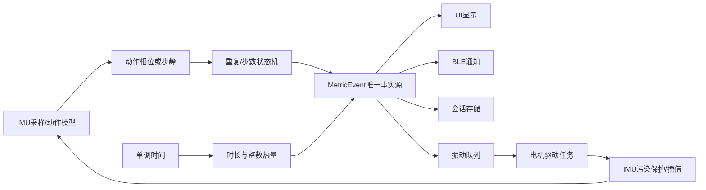
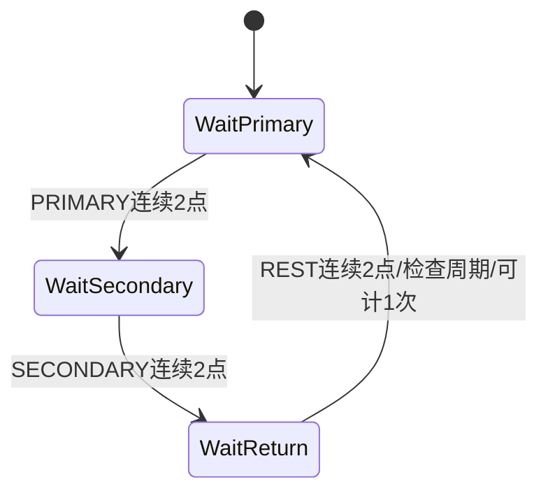
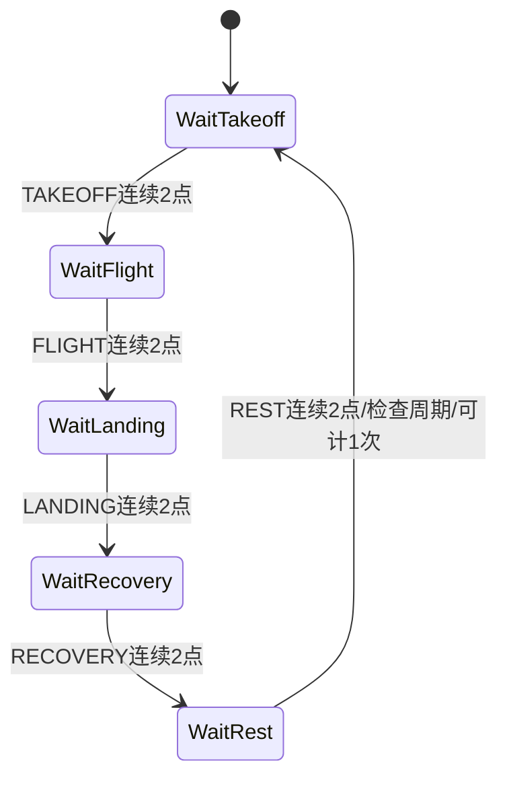

# 计数、卡路里与振动算法

本文说明 `esp32/firmware/components/fitness_core` 的领域算法。目标：把上游 IMU/模型给出的动作相位变成可靠的次数、步数、静坐时长和热量；再由同一个指标事件驱动界面、BLE、存储和振动。组件是纯 C，不依赖 GPIO、FreeRTOS、LVGL 或蓝牙，可先在 PC 上完整测试。

> 当前没有实物板。本文中的 GPIO、电机电气安全、实际功耗和振感均是软件合同或待测项，不是实机测量结论。

## 1. 总体数据流



职责边界：

- 上游算法：根据 IMU 波形产生离散相位、步峰和稳定度；
- `fitness_core`：验证相位顺序和时间，维护领域状态，生成事件；
- UI/BLE/存储：只消费事件，不自行重新计算次数；
- 电机驱动：只消费振动请求，不阻塞计数任务；
- IMU 任务：根据污染保护结果决定补发插值点或重置不完整周期。

这样可避免“屏幕是 10 次、BLE 是 9 次、存储是 11 次”的多事实源问题。

## 2. 动作、指标与单位

动作顺序必须与模型输出完全一致：

| 索引 | 动作 | 领域指标 | 计数方式 |
|---:|---|---|---|
| 0 | `good_morning` | 次数 | 两相位完整周期 |
| 1 | `jumping_jack` | 次数 | 五阶段跳跃周期 |
| 2 | `jumping_lunge` | 次数 | 五阶段跳跃周期 |
| 3 | `jumping_squat` | 次数 | 五阶段跳跃周期 |
| 4 | `lunge` | 次数 | 两相位完整周期 |
| 5 | `sit` | 持续时长 | 单调时间累计 |
| 6 | `squat` | 次数 | 两相位完整周期 |
| 7 | `trot` | 步数 | 上游步峰+最短间隔 |
| 8 | `tuck_jump` | 次数 | 五阶段跳跃周期 |
| 9 | `walk` | 步数 | 上游步峰+最短间隔 |
| 10 | `wave` | 次数 | 两相位完整周期 |

量纲约定：

- 单调时间：毫秒 `ms`，类型 `uint64_t`；
- 次数、步数：无量纲整数；
- 静坐持续时间：毫秒 `ms`；
- 体重：克 `g`，合法范围 30000～250000 g，0 表示未设置；
- MET：代码使用 `milliMET`，例如 3.8 MET 保存为 3800；
- 热量：`microkcal`，即 $10^{-6}$ kcal；
- 稳定度：Q15，范围 0～32767，仅表示时间决策稳定性，不等于概率；
- 六轴顺序：`gx、gy、gz、ax、ay、az`；角速度单位 deg/s，加速度单位 g。

## 3. MetricEvent：唯一指标事实源

每次有效重复、有效步峰或整秒静坐时长，产生一个 `fitness_metric_event_t`。关键字段：

| 字段 | 含义 |
|---|---|
| `session_seq` | 持久化会话序号 |
| `event_seq` | 会话内从 1 递增，用于 BLE 去重 |
| `monotonic_ms` | 设备启动后的单调时间 |
| `action` | 当前动作 |
| `metric_kind` | 次数、步数或时长 |
| `delta_value` | 本事件增量 |
| `total_value` | 当前会话累计值 |
| `stability_q15` | 时间稳定度 |
| `quality_flags` | 污染、插值、冻结等质量位 |
| `gross_microkcal` | 毛热量快照 |
| `active_microkcal` | 活动热量快照 |

事件原则：

1. UI 不直接读取计数状态机内部字段，只处理 `MetricEvent`；
2. BLE 发送同一事件，PC 以 `(session_seq,event_seq)` 去重；
3. 存储层保存同一事件或其汇总；
4. 振动层也依据同一事件，次数不会先振动再因状态机回滚；
5. `sit` 的时长在领域层连续累计，但每满 1000 ms 才发布一次，降低 UI/BLE 频率。

时间复杂度 $O(1)$，事件结构无动态内存。

## 4. 八类重复动作状态机

上游特征/动作算法负责输出相位。领域状态机不再读取原始 IMU，这使相位算法和业务计数可以分别测试。

### 4.1 两相位状态机

用于：

- `good_morning`；
- `lunge`；
- `squat`；
- `wave`。

完整顺序：

$$
REST \rightarrow PRIMARY \rightarrow SECONDARY \rightarrow REST
$$

直观例子：深蹲从站立基线进入下蹲方向，到达最低/反向阶段，再返回站立。只有完整回到基线才计一次，避免半蹲或抖动计数。

状态转移：



最短周期：

- `wave`：300 ms；
- `good_morning/lunge/squat`：600 ms。

最长周期统一为 10000 ms。超时的不完整周期丢弃，避免用户休息后的一次相位和很久以前的相位被拼成一整次。

### 4.2 五阶段跳跃状态机

用于：

- `jumping_jack`；
- `jumping_lunge`；
- `jumping_squat`；
- `tuck_jump`。

完整顺序：

$$
REST \rightarrow TAKEOFF \rightarrow FLIGHT \rightarrow LANDING
\rightarrow RECOVERY \rightarrow REST
$$

物理解释：

- `TAKEOFF`：起跳推进；
- `FLIGHT`：低支持力/腾空；
- `LANDING`：落地冲击；
- `RECOVERY`：冲击衰减、身体恢复；
- `REST`：回到下一次动作起点。



最短完整周期 400 ms，最长 10000 ms。不允许仅凭一个加速度峰计一次；必须同时有腾空、落地和恢复证据。

### 4.3 稳定门槛与不应期

相位必须连续出现 2 个采样点才触发转移。采样率 25 Hz 时，最短稳定证据约为：

$$
T_{stable}=2\times\frac{1}{25}=0.08\ \mathrm{s}
$$

两次计数之间还需满足 300 ms 不应期：

$$
t_n-t_{n-1}\ge300\ \mathrm{ms}
$$

两层约束分别抑制单点相位毛刺和同一完整动作的重复闭合。

### 4.4 边界与异常

- 时间倒退：返回 `FITNESS_STATUS_INVALID_TIME`，不修改状态；
- 错序相位：保持当前状态，等待正确相位或超时；
- 振动污染超过 3 点：调用 `fitness_rep_counter_reset_cycle`，只丢弃当前不完整周期，不清空历史总次数；
- 切换动作、暂停、断连：重置当前周期；
- 计数器未初始化：返回 `FITNESS_STATUS_INVALID_STATE`。

每点处理为 $O(1)$ 时间、$O(1)$ 空间。

## 5. walk/trot 步数与反馈

步峰检测由上游 IMU 算法完成。领域层只验证时间间隔：

$$
t_n-t_{n-1}\ge T_{step}
$$

其中：

| 动作 | $T_{step}$ |
|---|---:|
| `walk` | 240 ms |
| `trot` | 150 ms |

过密峰被视为同一步冲击，不计数，也不报系统故障。时间倒退返回错误。

每接受一个步峰，生成 `FITNESS_METRIC_STEP`。为了减少电机对手腕 IMU 的干扰，不每步振动；仅当：

$$
steps\bmod10=0
$$

时入队一次 30 ms 短振动。`fitness_step_counter_accept` 会返回 `haptic_due` 供实时路径快速检查；正式业务反馈仍推荐由 `MetricEvent` 调用 `fitness_haptic_enqueue_for_metric`，保证唯一事实源。

时间、空间复杂度均为 $O(1)$。

## 6. sit 持续时长

会话用单调时钟计算：

$$
\Delta t=t_{now}-t_{last}
$$

合法 tick 需满足：

$$
0\le\Delta t\le60000\ \mathrm{ms}
$$

超过 60 秒通常表示设备休眠、暂停或任务长时间失联。领域层拒绝自动把断层计为静坐或热量，要求上层明确恢复/新建会话。

`sit_duration_ms` 连续累计。发布策略：每次只发布完整 1000 ms 倍数，剩余不足 1000 ms 保留到下一 tick。例如：先推进 500 ms 不发事件，再推进到 1000 ms 时发布 `delta=1000,total=1000`。

静坐不周期振动，避免长期佩戴时持续干扰。

## 7. 卡路里整数累计

### 7.1 毛热量公式

通用 MET 估算：

$$
E_{kcal/min}=\frac{MET\times3.5\times W_{kg}}{200}
$$

一段 $\Delta t_{ms}$ 的热量：

$$
E_{kcal}=\frac{MET\times3.5\times W_{kg}}{200}
\times\frac{\Delta t_{ms}}{60000}
$$

此结果是群体经验估算，不是医疗或营养测量值。

### 7.2 固定 MET

| 动作 | MET | milliMET |
|---|---:|---:|
| `sit` | 1.0 | 1000 |
| `wave` | 1.5 | 1500 |
| `good_morning` | 3.5 | 3500 |
| `lunge/squat/walk` | 3.8 | 3800 |
| `trot` | 4.8 | 4800 |
| 四个跳跃动作 | 7.5 | 7500 |

### 7.3 为什么不用 float 累加

如果每 40 ms 计算一个很小的 kcal 并立即转整数，结果可能长期被截为 0。组件把体重存为 `weight_g`、MET 存为 `met_milli`、时间存为 `delta_ms`，最终推导：

$$
E_{\mu kcal}=
\frac{MET_{milli}\times W_g\times\Delta t_{ms}\times7}
{24000000}
$$

符号：

- $MET_{milli}$：MET 乘 1000；
- $W_g$：体重，单位 g；
- $\Delta t_{ms}$：时间，单位 ms；
- $E_{\mu kcal}$：单位 microkcal。

整数除法余数 $r$ 被保留：

$$
q=\left\lfloor\frac{n+r_{old}}{24000000}\right\rfloor
$$

$$
r_{new}=(n+r_{old})\bmod24000000
$$

这样把同一秒分为 25 个 40 ms tick，最终结果与一次 1000 ms tick 一致，不会因分段而持续损失小数。

示例：`squat`、70 kg、1 秒：

$$
E_{gross}=77583\ \mu kcal
$$

### 7.4 活动热量

活动热量先扣除 1 MET 静息部分：

$$
MET_{active}=\max(MET-1,0)
$$

同一示例得到：

$$
E_{active}=57166\ \mu kcal
$$

设备可默认显示毛热量；PC 可同时展示毛热量和活动热量，并明确“估算”。

### 7.5 边界、溢出与资源

- 体重 0：表示未设置，热量保持 0，UI 显示 `-- kcal`；
- 非零体重只允许 30～250 kg；
- 单 tick 最大 60 秒；
- 在 20 MET、250 kg、60 秒的更高保护上限下，分子仍小于 `uint64_t`；
- 总热量使用饱和加法，极端溢出固定为 `UINT64_MAX`，不回绕；
- 每 tick 为 $O(1)$ 时间；会话热量状态只需四个 `uint64_t` 保存两种累计和两种余数。

## 8. 振动反馈队列

### 8.1 固定波形

| 原因 | 通电 | 间隔 | 次数 |
|---|---:|---:|---:|
| 会话开始 | 20 ms | 40 ms | 2 |
| 有效重复 | 30 ms | 0 | 1 |
| 每满 10 步 | 30 ms | 0 | 1 |
| 暂停/结束 | 40 ms | 0 | 1 |
| 达成目标 | 25 ms | 35 ms | 3 |
| 低电量 | 40 ms | 60 ms | 2 |

表中 `on_ms/off_ms/repeat_count` 属于领域层波形包络，不在 `fitness_core` 内直接操作 GPIO。正式板级运行时把 GPIO18 配置为 **5 kHz、10 位 LEDC PWM**，最大计数为 $2^{10}-1=1023$；有效重复动作每确认计数一次，就以 **75% 占空比异步输出一次 30 ms 振动**。`walk/trot` 为避免每一步污染 IMU，仅每累计 10 步输出一次 30 ms 振动；`sit` 不振动。

板级 `board_runtime_backend_pulse_motor` 写入占空比后启动一次性 `esp_timer`，定时器回调负责把占空比归零。`haptic` FreeRTOS 任务使用阻塞队列等待请求，并用 `vTaskDelay` 等待脉冲结束或多脉冲间隔；这些等待会让出 CPU，**不是忙等待**。算法/IMU 任务不执行 `delay(30)`，因此 25 Hz 采样和 0.48 秒推理更新不应被马达脉冲同步阻塞。

当前数值是软件设计值，不等于真板电气验收已经完成。上线前仍需用厂家原配电池和实物板测量 GPIO18 驱动级、反向电动势、电源纹波、马达温升、体感强度和振动期间 IMU 污染；若调整 PWM 频率或占空比，必须同步更新固件常量、本文和回归测试。

### 8.2 队列语义

队列为 16 项固定 FIFO：

- 无动态内存；
- 入队和出队均为 $O(1)$；
- 队列满返回 `FITNESS_STATUS_QUEUE_FULL`，不会覆盖尚未执行的请求；
- 电机任务按 `on_ms/off_ms/repeat_count` 异步执行；
- GPIO18、5 kHz/10 位 LEDC、75% 占空比和一次性停止定时器由板级运行时负责，不属于本纯 C 领域组件；

ESP-IDF 多任务集成时，应由外部队列、临界区或单生产者/单消费者约束保护；本纯 C FIFO 自身不声明为多线程安全。

## 9. 振动对 IMU 的污染保护

### 9.1 污染窗口

电机通电区间为：

$$
[t_{start},t_{start}+T_{on}]
$$

软件把尾部再延长 80 ms：

$$
[t_{start},t_{start}+T_{on}+80\ \mathrm{ms}]
$$

原因：电机断电后机械余振和电源纹波不会瞬间消失。重叠脉冲的区间自动合并。

处于保护区的原始六轴值带 `HAPTIC_CONTAMINATED` 语义，不应直接送入计数器。

### 9.2 最多 3 点线性插值

若污染连续不超过 3 点，且前后各有一个干净点，则对每个轴独立插值：

$$
r=\frac{t-t_L}{t_R-t_L}
$$

$$
x(t)=x_L+r(x_R-x_L)
$$

其中：

- $t_L,x_L$：污染前干净点；
- $t_R,x_R$：污染后干净点；
- $t$：待修复点时间；
- $r\in(0,1)$。

插值点标记：

```text
HAPTIC_CONTAMINATED | INTERPOLATED
```

组件只保存污染时间戳，不保存污染轴值，确保插值不会误用受电机影响的数据。

在 25 Hz 下，3 点约 120 ms。短缺口插值可维持窗口采样节奏，又不会构造过长的虚假动作。

### 9.3 超过 3 点冻结

第 4 个连续污染点到来时：

1. 丢弃待插值时间；
2. 设置硬冻结；
3. 上游停止推进计数器；
4. 首个干净点恢复输出并携带 `COUNTER_FROZEN`；
5. 上游调用 `fitness_rep_counter_reset_cycle`，避免把污染前后相位拼成一次动作。

没有前侧干净点（例如开机立刻振动）也直接冻结，因为无法做有物理依据的插值。

每个污染点为 $O(1)$；恢复时最多对 $3\times6=18$ 个轴值运算。状态主要包含一个六轴干净样本和 3 个时间戳，空间固定。

## 10. ESP32 集成顺序

建议调用顺序：

1. 会话开始：
   - `fitness_session_start`；
   - 初始化对应 `rep_counter` 或 `step_counter`；
   - `fitness_haptic_enqueue_reason(START)`。
2. 每个 25 Hz IMU 点：
   - 电机任务每次真实通电调用 `fitness_haptic_guard_mark_pulse`；
   - IMU 任务调用 `fitness_haptic_guard_push_sample`；
   - 输出 0 点时暂不推进动作相位；
   - 输出插值/干净点时按时间顺序送给上游相位算法；
   - 出现 `COUNTER_FROZEN` 时重置不完整周期。
3. 上游确认相位：
   - 8 类重复动作调用 `fitness_rep_counter_update`；
   - `rep_completed=true` 时调用 `fitness_session_record_count(REPETITION)`；
   - 用生成的 `MetricEvent` 调用 `fitness_haptic_enqueue_for_metric`。
4. walk/trot 步峰：
   - `fitness_step_counter_accept`；
   - `step_accepted=true` 时生成 `STEP MetricEvent`；
   - 同一事件决定是否每 10 步振动。
5. 周期 tick：
   - 所有动作调用 `fitness_session_tick` 累计热量；
   - sit 发出整秒时长事件。
6. 暂停/结束：
   - 重置当前动作周期；
   - 入队暂停/结束振动；
   - 保存会话汇总；
   - `fitness_session_stop`。

## 11. 任务与线程安全建议

组件本身无锁。推荐单向所有权：

| 对象 | 建议唯一写入任务 |
|---|---|
| `fitness_rep_counter_t` | 计数任务 |
| `fitness_step_counter_t` | 计数任务 |
| `fitness_session_t` | 会话/计数任务 |
| `fitness_haptic_queue_t` | 用 FreeRTOS Queue 替代或外部临界区保护 |
| `fitness_haptic_guard_t` | IMU 任务；电机任务通过消息登记脉冲 |

不要让 UI、BLE 和存储任务直接修改会话。它们只消费不可变的 `MetricEvent` 副本。

## 12. 主机测试

运行：

```powershell
& esp32\host_tests\fitness_core\run_tests.ps1
```

脚本使用项目本地目录：

```text
.codex-local/tmp/fitness_core_host_tests
```

编译参数：

```text
-std=c11 -Wall -Wextra -Wpedantic -Werror -O2
```

当前覆盖：

- 8 类动作到两种状态机的映射；
- 两相位完整/缺相位周期；
- 五阶段跳跃周期；
- 相位稳定点数、时间倒退和周期重置；
- walk 步峰去重和第 10 步反馈；
- MetricEvent 序号、总值和动作/指标匹配；
- 70 kg、3.8 MET 的整数热量及活动热量；
- sit 整秒事件、未知体重和体重上下限；
- 振动 FIFO 顺序、固定波形和满队列；
- 3 点污染插值、污染值不参与插值；
- 第 4 点冻结和首个干净点恢复。

## 13. 尚需实物验证

软件通过不代表板上电机和 IMU 已完成验收。烧录后至少验证：

1. GPIO18 的有效电平、上电默认态和电机实际通断；
2. 30/40 ms 脉冲的体感、噪声和机械响应；
3. 连续 3 脉冲时驱动器、电池和电机温升；
4. 电机启动/停止时 IMU 六轴波形与 80 ms 尾部是否足够；
5. 振动后插值点数分布，是否频繁超过 3 点；
6. 计数器冻结/恢复是否漏计真实动作；
7. 电池低电量时振动是否导致复位或 AMOLED 闪烁；
8. 实际用户身高、体重和动作强度下，热量文案明确标注“估算”。

若实测余振超过 80 ms，应先记录波形并调整常量与测试，不应在驱动层私自延长、造成 Python/文档/固件合同分裂。
