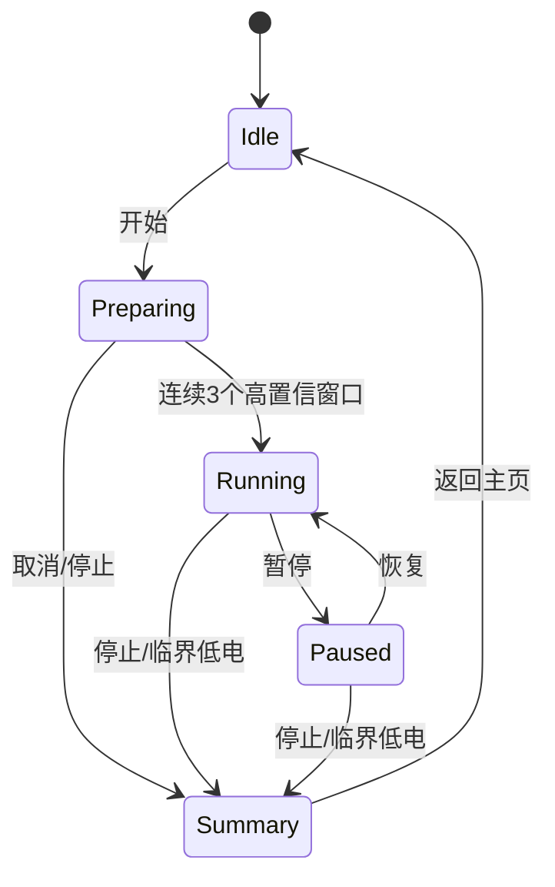

# 训练引擎状态机

## 1. 产品合同

v1 使用“自动识别后锁定单动作会话”：

1. 用户点击开始；
2. 设备进入准备页；
3. 双 M0 连续三个高置信窗口给出同一动作；
4. 设备锁定该动作并开始次数、步数、时长和热量累计；
5. 用户若要换动作，先停止当前会话，再开始下一会话。

这样保留自动动作识别，同时满足最终动作段 logits 累计算法的边界：一个活动段不能把两个动作证据混在一起。



## 2. 全动作段证据累计与准备阶段锁定

训练引擎用生成模型头中的 `BpBoutAccumulator` 保存 11 类累计 logits 和窗口数。START 后第一个有效窗口开始累计；从 `PREPARING` 进入 `RUNNING` 时不清零，因此准备锁定证据和后续运行证据属于同一动作段。

对从当前动作段开始到第 $n$ 个有效窗口，累加 11 类 logits：

$$
\bar z_c(n)=\frac{1}{n}\sum_{t=1}^{n}z_{t,c}
$$

用减最大值的稳定 softmax 计算最佳类概率：

$$
p_c=\frac{\exp(\bar z_c-z_{max})}
{\sum_j\exp(\bar z_j-z_{max})}
$$

锁定条件：

- 最优类别连续三个窗口相同；
- 最优概率不低于 55%；
- logits 全部有限；
- 推理时间不早于开始时间。

三个窗口的最小观察历史约为 $2\times0.48=0.96$ 秒，加上首个 2.48 秒窗口填满，冷开始后约 3.44 秒得到锁定。界面在此期间显示准备动画和候选动作，不提前计数。

进入 `RUNNING` 后，每个新窗口继续写入同一累计器。平均 logits 的最大类保存为 `inferred_action`，准备阶段锁定的类别保存为 `selected_action`：

$$
consistent(n)=\mathbb I[inferred\_action(n)=selected\_action]
$$

其中 $\mathbb I[\cdot]$ 是指示函数。`classification_consistent=true` 才允许相位状态机消费采样点并确认次数；不一致时不修改 `selected_action`，也不把单个异常窗口当作用户已换动作。

### 2.1 证据重置边界

以下事件必须清空累计 logits、窗口数、候选连续计数和未完成相位：

- 新会话 START；
- PAUSED 成功 RESUME；恢复同时清空 IMU pipeline 的 62 点窗口，重新等待完整连续窗口；
- IMU 数据质量报告 RESET、GAP、时钟倒退或长间断；
- STOP、回到 IDLE 或新用户/新动作段。

RESUME 仍保留本会话已锁定 `selected_action`、历史次数和热量，只重新建立恢复后的分类证据。这样既不把暂停前半个窗口拼到暂停后，也不会把已完成计数清零。

## 3. 运行事实链

锁定后，每个严格 25 Hz 点执行：

1. `fitness_session_tick` 积分毛热量和活动热量；
2. 若最新累计分类与锁定动作不一致，或样本落在马达污染区且无法安全插值，只累计会话时间和热量，不推进相位、次数或步数；
3. 分类恢复一致后，从冻结的未完成相位状态继续；只有 START、RESUME、RESET/GAP 等明确边界才重置相位；`motion_phase_push` 输出动作相位或 walk/trot 步峰；
4. 重复状态机只在完整周期闭合时输出一次；
5. `fitness_session_record_count` 生成唯一 `MetricEvent`；
6. 同一 `MetricEvent` 同时更新 UI、BLE、存储和振动队列；
7. 每个 REP 入队一次 30 ms 马达脉冲；walk/trot 每 10 步入队一次 30 ms；sit 不逐秒振动。

冻结分类计数不等于暂停会话。冻结期间 `fitness_session_tick` 继续按已锁定动作累计经过时间和估算热量；只有用户 PAUSE 才同时停止时间、热量和计数。该区分避免短时分类抖动制造假次数，又不会把仍在进行的训练时长静默丢掉。

禁止 UI、PC 或 BLE 事件各自再加一次次数。`MetricEvent.total_value` 是唯一权威累计值。

## 4. 暂停与热量

热量积分依赖相邻单调时间差。暂停和恢复时调用：

```text
fitness_session_rebase_time(session, now_ms)
```

该函数只移动积分基准，不修改次数、步数、sit 时长或热量。恢复后第一个 tick 从恢复时刻开始，因此暂停十分钟不会被误算为十分钟训练。

暂停、恢复、停止、动作切换和传感器长间断均清除不完整相位周期，不能把暂停前半次深蹲与恢复后半次拼成一次。

## 5. 置信度量纲

BLE/UI 使用 0..65535 的 Q15 概率显示：

$$
c_{ui}=\operatorname{round}(65535p)
$$

`fitness_core` 的稳定度合同为 0..32767，因此训练引擎使用：

$$
c_{fitness}=c_{ui}\gg1
$$

该转换只改变整数尺度，不把概率解释为医学或生物力学置信区间。

## 6. 复杂度与资源

- 准备/运行累计与 softmax：每 0.48 秒 $O(11)$；
- 每点训练协调：$O(1)$；
- 固定数组和状态：$O(11)$，无堆分配；
- 振动 FIFO：16 项固定容量；队列满只丢反馈，不回滚权威次数。

## 7. 已验证与待实测

主机测试覆盖：准备/运行共用动作段累计、运行期不一致冻结计数但继续时间/热量、START/RESUME/RESET/GAP 证据重置、动作锁定、深蹲完整周期、一次计数一次 30 ms 振动、walk 步峰、未满 10 步不振、暂停热量排除、重复 stop 幂等、NaN logits 修改前拒绝。

仍需用户烧录后验证：

- 准备阶段真实动作锁定时间和误锁率；
- 每个动作慢/正常/快速速度的计数误差；
- 表带松紧、左右手和不同用户；
- 马达振动后 80 ms 保护是否足够；
- 自动动作段边界和连续切换提示是否符合使用习惯。
