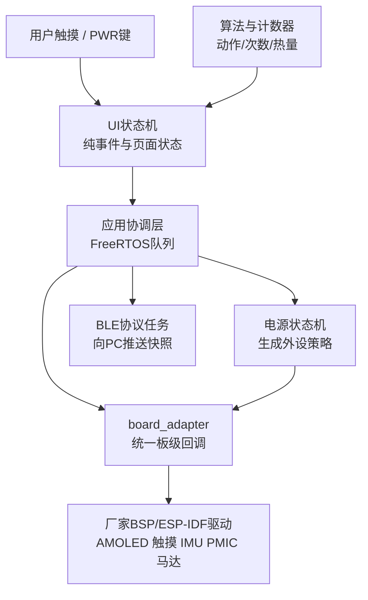
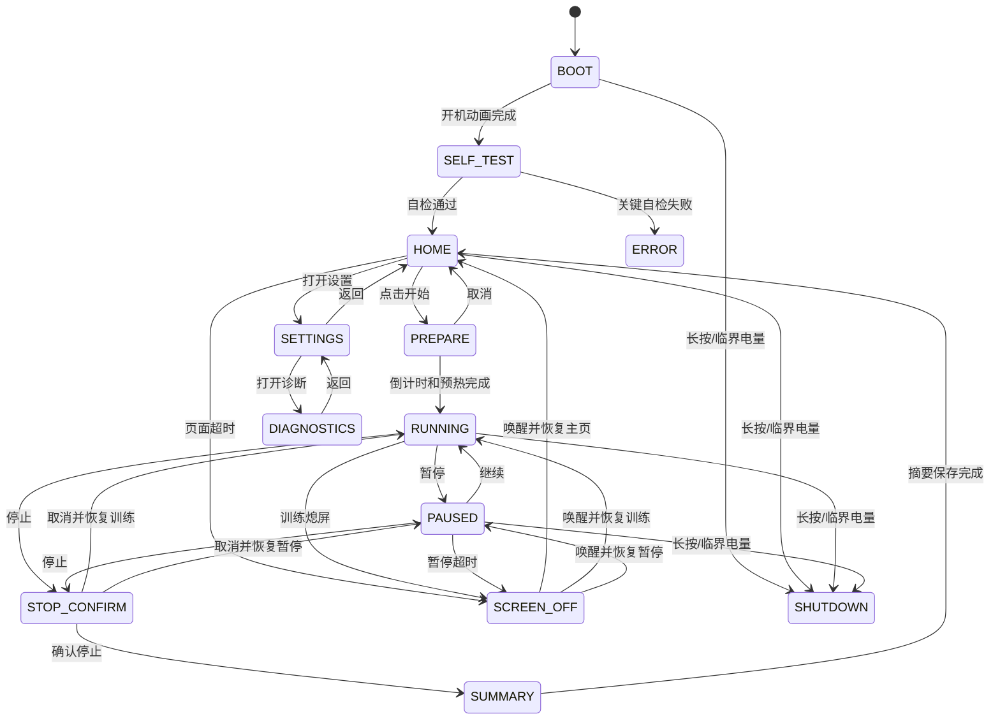
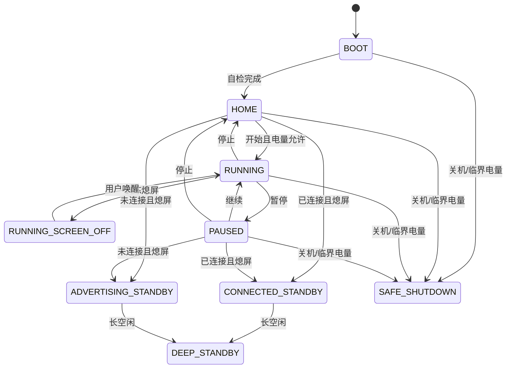

# ESP32-S3 健身手柄 UI 与低功耗方案

> 本文对应 `esp32/firmware/components/board_adapter`、`ui`、`power_manager` 和生产 `main`。真实后端与主机 Mock 均已保留，生产 `app_main` 已完成多任务集成，ESP-IDF 5.5.4 整机干净构建通过；面板、触摸、PMIC、IMU、马达、BLE 和睡眠电流仍须在厂家原配开发板上验证。

## 1. 设计目标

设备面向单手持握和运动中快速查看，核心目标如下：

- 410×502 AMOLED 提供开机、自检、主页、准备、训练、暂停、停止确认、总结、设置、诊断、故障、熄屏和关机页面。
- 主页提供一个高优先级“开始”按钮；训练页提供“暂停/继续”和“停止”。
- 训练页持续显示当前动作、完成次数、会话热量、时长、BLE、电量和数据质量。
- 算法确认一次有效动作后，GPIO18 马达短振一次；振动不得阻塞 25 Hz IMU 采样。
- BLE 连接 PC 上位机时保持低延迟数据流；待机时使用 modem-sleep 和自动 Light-sleep。
- 厂家原配 400 mAh 电池以“训练期间屏幕大部分熄灭的低功耗活动约 6 小时、深待机至少 7 天”为首轮工程预算；连续全亮屏不使用 6 小时门槛。
- 低电量按 15% 提示、8% 禁止新会话、5% 安全保存并关机；充电时允许旁路会话启动限制。

## 2. 硬件资源与板型风险

### 2.1 已从原理图和厂家资料核对的资源

| 资源 | 接口/引脚 | 首版用途 | 默认低功耗策略 |
|---|---|---|---|
| AMOLED | 410×502 | 页面与轻量动画 | 训练 35%，暂停 15%，待机关闭 |
| 触摸 | I2C SDA=15、SCL=14，RST=9，INT=38 | 开始、暂停、停止、唤醒 | 待机只保留中断监视 |
| QMI8658 | INT1=GPIO21 | 25 Hz IMU、WOM 运动唤醒 | 训练 25 Hz，待机 WOM |
| PCF85063 RTC | INT=GPIO39 | 定时提示、会话时间基准 | 仅 Light-sleep GPIO 唤醒候选 |
| 振动马达 | GPIO18，经 NMOS | 计数、告警、连接反馈 | 默认关闭，短脉冲事务 |
| 扬声器功放 | GPIO46 | 可选提示音 | v1 默认关闭，短提示事务 |
| TF 卡 | CLK=2、CMD=1、D0=3、CS=17 | 摘要/调试日志 | 常态卸载，保存时短时挂载 |
| PWR 键 | AXP2101 PWRON | 开机、长按关机 | 由 PMIC 处理，不作为普通 GPIO |
| BOOT 键 | GPIO0 | 开发/恢复 | 不作为用户训练按钮 |

### 2.2 面板与触摸存在两个厂家版本

厂家受管 BSP 的兼容驱动依赖指向：

- 面板：SH8601 驱动族；
- 触摸：FT5x06 兼容驱动族，常用 I2C 地址 `0x38`。

厂家当前产品仓库把实际物料标为：

- 面板：CO5300；
- 触摸：CST9220，I2C 地址 `0x5A`。

这两组名称不一定互斥：厂家板级组件可能用协议兼容驱动服务不同丝印物料。因此固件不能绕过 BSP 盲写寄存器。当前 `board_adapter` 只公开经过厂家受管 BSP 验证的 SH8601/FT5x06 兼容路径；未实现的 CO5300/CST9220 原生 Kconfig 选项已经隐藏，旧兼容符号固定关闭。启动阶段仍只读探测 I2C 设备并记录诊断，面板/触摸真实物料必须由 PCB/BOM、厂家版本和烧录结果共同确认。

## 3. 软件分层



分层原则：

- UI 状态机不调用 LVGL、GPIO、BLE 或算法，便于纯 C 测试。
- 电源状态机只输出策略，不直接执行睡眠或关闭外设。
- `board_adapter` 统一真实 BSP 与主机 mock；控制器未确认时拒绝启动。
- 业务事件使用 FreeRTOS 队列按值传递，渲染任务不得跨线程直接修改模型数据。
- 算法任务优先级高于动画、日志和 BLE 批量传输，确保 25 Hz 采样稳定。

## 4. UI 设计

### 4.1 视觉原则

- AMOLED 使用黑色背景、少量高饱和强调色，减少平均像素功耗和烧屏风险。
- 动作名称、次数和停止按钮必须在运动中一眼可见；避免小字号密集表格。
- 页面固定元素每隔一段时间做 1～2 像素轻微位移，降低长期静态烧屏风险。
- 低电量时关闭非必要动画；临界电量直接保存并关机。
- 所有触摸按钮最小有效区域建议不小于 88×64 像素，并提供按下态。
- 设备端所有用户可见文案和 11 类动作名称使用中文；代码中的 `BOOT`、`RUNNING` 等枚举仅是内部稳定标识，不直接显示给用户。
- LVGL 使用项目自带 Noto Sans SC 中文子集，提供 16/20/28 px 三个字号；Montserrat 仅含西文，不能用“UTF-8 字符串已编译”代替汉字渲染验收。
- 字体由 `tools/generate_lvgl_ui_fonts.ps1` 从 `ui_presenter.c` 提取当前可见字符并生成；manifest、SHA-256、许可证和缺字覆盖由统一合规测试校验。
- 无开发板时使用 `tools/watch_ui_preview/watch_ui_preview.py` 在 VS Code 旁启动交互预览；右侧 13 页直达导航属于开发工具，不属于 410×502 设备界面。

### 4.2 页面布局

#### 开机页

- 黑底 Logo；800 ms 文字淡入。当前实现不做全屏缩放，减少 AMOLED 大面积重绘和启动峰值功耗。
- 下方显示固件版本和自检进度。
- Light-sleep 唤醒不重复播放开机动画。

#### 自检页

- 检查面板/触摸板型、QMI8658、AXP2101、电池、模型头、BLE 和可选 TF。
- 关键项失败进入错误页，显示错误码和恢复建议。
- TF、扬声器、麦克风不是 v1 核心资源，缺失可降级而不阻止训练。

启动顺序保证故障页真的可见：先建立板级显示、触摸和 LVGL renderer，显示开机/自检页；再初始化 QMI8658、AXP2101、RTC、会话存储和业务域。后续关键项失败时渲染 ERROR 并停止进入 HOME。若显示本身初始化失败，屏幕不可用，只能依靠串口错误，不能把这一路写成“屏幕已显示错误”。

#### 主页

- 顶栏：电量、充电图标、BLE 连接图标、当前时间。
- 中部：最近一次动作、次数、热量和时长摘要。
- 底部：大号“开始”按钮；8% 及以下且未充电时按钮禁用并说明原因。

#### 准备页

- 3、2、1 倒计时；同时完成 IMU 预热、62 点窗口填充和动作段累计器重置。
- 倒计时可用三次轻振：20 ms、20 ms、40 ms；该模式应支持关闭。
- “取消”返回主页，不生成空会话摘要。

#### 训练页

- 顶栏：会话时间、BLE、电量和数据质量。
- 中部：当前动作图标与中文名称，动作变化时 150 ms 淡入。
- 视觉中心：超大次数；有效计数时做 180 ms 数字淡入，并同步触发一次 30 ms、75% 马达短振。
- 下方：累计 kcal、置信度或稳定状态；置信度仅作诊断，不建议用伪精确小数误导用户。
- 底部：暂停、停止；停止需长按或二次确认，防止运动中误触。
- 熄屏后算法、计数和 BLE 继续运行；触摸/PWR 短按只负责点亮页面。

#### 暂停页

- 冻结次数和热量；IMU 从 25 Hz 活动模式切到 WOM。
- 亮度降到 15%；提供“继续”和“结束”。
- 超时后进入连接待机或慢广播待机。

#### 停止确认页

- 训练页或暂停页首次点击“停止”只进入二次确认，不立即清零或保存会话。
- 页面保留当前动作、次数和卡路里；“停止”确认后进入总结，“取消”返回进入前的训练或暂停状态。
- BLE 远程停止仍执行幂等停止命令，不依赖本地触摸确认页。

#### 设置页

- 显示并可循环调整亮度 `15% / 35% / 60% / 100%`，可开关计数振动。
- 设置先以带 CRC32 的配置 blob 原子写入 NVS，写入成功后才更新运行态；断电不能留下半份配置。
- 显示厂家原配 400 mAh 电池口径，不提供虚假的电池型号选择分支。
- 提供“忘记电脑”；确认后先断开当前连接，再删除 ESP32 NVS 中全部 BLE 绑定。操作成功不会删除会话历史或用户训练设置，但下次连接必须重新配对。

#### BLE 配对提示

- 首次连接由 NimBLE 生成 `000000～999999` 六位码，经无锁原子邮箱交给 UI 任务，回调本身不直接调用 LVGL。
- 六位码在当前页面上方以中文高优先级提示覆盖显示，并暂时隐藏其它触摸按钮。
- 配对成功、配对失败、BLE 断线、60 秒超时、BLE 停止或“忘记电脑”都会发布清除事件；清除时同时把保存的码写为 0，禁止旧码残留。
- 当前软件采用 Display Only 模式；Windows 负责系统配对交互。真实弹窗、码一致性和绑定重连仍待真板验证。

#### 诊断页

- 显示开机检查、数据质量位、BLE 连接、自动熄屏秒数和配置修订号。
- “测试振动”只发出一次 30 ms 马达测试脉冲，不增加次数、卡路里或历史记录。
- 自动熄屏可在 `15 / 30 / 60 / 120` 秒之间循环；修改后与设置页使用相同 NVS 持久化链。

#### 故障页

- 显示中文故障说明和稳定故障码；关键自检失败时禁止开始训练。
- 本页只允许安全关机；恢复必须重启并重新执行全部自检。

#### 总结页

- 显示总时长、总次数、总 kcal、主要动作及每动作次数。
- 先把摘要写入 RAM，再短时挂载 TF 保存；写入完成后卸载 TF。
- BLE 已连接时把最终摘要可靠发送给 PC，并等待短时 ACK；超时不阻止本地保存。

#### 关机页

- 正常长按关机播放 500 ms 收束动画。
- 临界低电量可以跳过动画，优先保存摘要并请求 AXP2101 软关机。

### 4.3 UI 状态机



`UI_EVENT_METRIC_UPDATED` 只在 `RUNNING` 或“由 RUNNING 熄屏”的状态接受。暂停、总结、主页中的残留算法事件会被忽略，防止停止后次数继续增长。

## 5. 计数、振动和热量

### 5.1 一次确认计数对应一次振动

默认计数反馈：

- 马达：GPIO18；
- 时长：30 ms；
- PWM 强度：75%；
- 触发条件：计数器产生“确认计数”事件，不是每个分类窗口；
- 同一次确认事件只允许一个马达请求；
- 暂停、无效动作、重复 BLE 帧不产生振动。

事件链：

```text
动作段特征/模型 -> 重复次数状态机确认 +1
                  -> 更新 UI 次数和 kcal
                  -> 向 PC 发送 COUNT_EVENT
                  -> 马达任务输出 30 ms 脉冲
```

马达会污染手腕 IMU。真实实现必须：

1. 用独立 FreeRTOS 软件定时器/LEDC 控制脉冲，禁止在算法任务中 `delay(30)`；
2. 记录脉冲起止单调时刻；
3. 与振动区间重叠的 IMU 点设置 `HAPTIC_CONTAMINATED` 质量位；
4. 计数器不使用被明显污染的瞬时冲击重新触发下一次计数；
5. 优先在当前计数确认后的采样间隙启动振动，而不是改变已确认结果。

### 5.2 其它振动模式

| 事件 | 建议模式 | 说明 |
|---|---|---|
| 有效计数 | 30 ms，75%，一次 | 默认反馈 |
| BLE 已连接 | 25 ms，50%，一次 | 避免与计数混淆 |
| 低电量 15% | 40 ms×2，间隔 60 ms | 每个会话最多提示一次 |
| 用户误触/动作不稳定 | 20 ms×2 | 可在设置中关闭 |
| 临界电量 | 200 ms×2 | 保存后立即关机 |

### 5.3 热量估算

首版推荐按 MET 和体重估算，不能宣称医学级测量：

$$
E_{kcal}=\frac{MET\times 3.5\times W_{kg}}{200}\times t_{min}
$$

其中：

- $MET$：动作代谢当量，由动作类别映射表给出；
- $W_{kg}$：用户体重，PC 或设备设置页输入；
- $t_{min}$：稳定识别为该动作的分钟数；
- 输出 $E_{kcal}$：估算热量，单位 kcal。

边界规则：

- 没有体重配置时使用明确标注的默认 60 kg，UI 显示“估算”；
- 体重建议限制 30～200 kg；超范围拒绝保存；
- 每个 0.48 秒更新按动作段稳定结果累计，暂停和静止不累计动作 MET；
- 热量内部使用毫卡 `milli-kcal` 整数累计，避免 MCU 浮点格式化误差；
- PC 端可允许用户修正体重和 MET 表，设备端保存版本号保证结果可追溯。

## 6. 电源状态机



### 6.1 状态资源策略

| 状态 | AMOLED | QMI8658 | BLE | CPU/睡眠 | 典型用途 |
|---|---|---|---|---|---|
| BOOT | 35% | WOM | 关闭 | 240 MHz | 动画和自检 |
| HOME | 35% | WOM | 快广播/连接活动 | DFS 40～240 MHz | 等待开始 |
| RUNNING | 35% | 25 Hz | 连接活动/快广播 | 推理时临时 240 MHz | 正常训练 |
| RUNNING_SCREEN_OFF | 关闭 | 25 Hz | 连接活动/慢广播 | 不手动 Light-sleep | 熄屏继续识别 |
| PAUSED | 15% | WOM | 连接活动/快广播 | DFS | 暂停 |
| CONNECTED_STANDBY | 关闭 | WOM | connected modem-sleep | DFS + 自动 Light-sleep | 保持 PC 连接待机 |
| ADVERTISING_STANDBY | 关闭 | WOM | 慢广播 | DFS + 自动 Light-sleep | 未连接短待机 |
| DEEP_STANDBY | 关闭 | WOM，严格门控 | 关闭 | GPIO21 EXT1 有效才 Deep-sleep，失败保持运行 | 长待机 |
| SAFE_SHUTDOWN | 关闭 | 关闭 | 关闭 | 请求 PMIC 软关机 | 关机 |

关键约束：

- BLE 连接状态下不能调用会破坏链路的手动 Light-sleep；使用 NimBLE modem-sleep、ESP-IDF 电源管理和 Tickless Idle 自动 Light-sleep。
- 训练态存在 25 Hz 周期采样，不以“强行深睡”换取不可控丢样；主要通过熄屏、DFS、短推理和 BLE 参数节能。
- 麦克风/ES7210 在 v1 始终关闭；TF 与功放只做短时事务。
- 熄屏使用面板 Display Off，不只把亮度写成 0。训练熄屏、连接待机和广告待机为保留第一下触摸唤醒而保持触摸活动；Deep-sleep/安全关机等策略明确停用触摸时，真实后端才写 FT3168 hibernate。硬件唤醒时先恢复触摸，再启用 LVGL 输入和面板。
- 进入 Deep-sleep 前先配置并验证 QMI WOM/RTC/触摸唤醒前提；只有成功后才停止 BLE、卸载 TF、关闭功放、关闭面板、休眠触摸、保存摘要并重置动作段。
- 唤醒前提失败时保持当前外设和运行状态，不执行半套“已熄屏但没有进入睡眠”的效果。

## 7. 400 mAh 电池预算

按额定容量的 80% 作为可用能量：

$$
C_{usable}=400\ \mathrm{mAh}\times 0.8=320\ \mathrm{mAh}
$$

目标续航 $T$ 对应最大平均电流：

$$
I_{avg,max}=\frac{C_{usable}}{T}
$$

### 7.1 活动模式

训练期间屏幕大部分熄灭、界面只按需点亮的低功耗活动目标 6 小时：

$$
I_{active,max}=\frac{320}{6}=53.33\ \mathrm{mA}
$$

所以该低功耗活动占空比下，“AMOLED+IMU+BLE+算法”的实测平均电流必须不高于约 53.3 mA。[厂家 Wiki](https://www.waveshare.com/wiki/ESP32-S3-Touch-AMOLED-2.06)给出的参考约为连续全亮屏 1 小时、熄屏 3～4 小时、完整低功耗约 6 小时，因此 53.3 mA 门槛不能套用到连续全亮屏。若实测超过预算，优先降低亮度、缩短亮屏超时和降低 UI 刷新面积，而不是降低 25 Hz 算法采样率。

### 7.2 深待机

目标 7 天，即 168 小时：

$$
I_{deep,max}=\frac{320}{168}=1.905\ \mathrm{mA}
$$

该预算相对宽松，但仍必须实测整板而非只看 ESP32 芯片手册。AMOLED、触摸、PMIC、RTC、QMI、漏电和上拉电阻都可能主导待机电流。

### 7.3 实测续航换算

平均电流测得为 $I_{measured}$ 时：

$$
T_{estimated}=\frac{320}{I_{measured}}
$$

例如活动平均 45 mA，估算为约 7.11 小时。该值不包含低温、电池老化和高峰压降，量产规格仍需多块样机统计。

## 8. 低电量策略

| SOC | 未充电策略 | 充电策略 |
|---:|---|---|
| >15% | 正常 | 正常 |
| 9～15% | 顶栏告警；每会话一次双振 | 显示充电，不告警 |
| 6～8% | 禁止启动新会话；允许保存/结束当前会话 | 允许启动 |
| 0～5% | 保存摘要、停 BLE/IMU、临界振动、PMIC 关机 | 不强制关机，限亮度并提示 |

只使用 AXP2101 SOC 百分比作为首版门槛。未经电芯放电曲线验证，不应把固定电压直接等同于剩余百分比。PMIC 读取失败时显示未知电量并禁止新会话，不可把错误值当成 0% 或 100%。

## 9. 唤醒边界

ESP32-S3 Deep-sleep 的 EXT0/EXT1 只支持 RTC GPIO0～21。因此：

- QMI8658 INT1=GPIO21：用作 Deep-sleep EXT1 `ANY_HIGH` 运动唤醒；编译默认启用，但只有 WOM 握手成功、板型配置允许且运行时确认 GPIO21 为 RTC IO 时才真正进入深睡。
- 触摸 INT=GPIO38：只能用于 Light-sleep GPIO 唤醒，不能作为 Deep-sleep EXT0/EXT1。
- RTC INT=GPIO39：只能用于 Light-sleep GPIO 唤醒，不能作为 Deep-sleep EXT0/EXT1。
- AXP2101 PWRON：作为关机后的可靠物理开机路径，不依赖 ESP32 RTC GPIO。

触摸和 RTC 中断都是低有效；待机策略使用 `gpio_wakeup_enable(..., GPIO_INTR_LOW_LEVEL)`，再调用 `esp_sleep_enable_gpio_wakeup()` 纳入自动 Light-sleep。QMI WOM 则把 INT1 配成初始低电平、检测到运动后高电平，与 EXT1 `ANY_HIGH` 一致。

Deep-sleep 入口采用“先验证唤醒源，再应用外设关断”顺序。任一条件失败时，记录错误并保留 BLE、显示和触摸当前状态，禁止调用 `esp_deep_sleep_start()`；这条失效安全规则同时防止设备“睡死”和半关断后无法交互。

WOM 初始参数为 40 mg 门限和 4 个 21 Hz 样本消隐，对应约：

$$
T_{blank}=\frac{4}{21}\ \mathrm{s}\approx 0.190\ \mathrm{s}
$$

式中 $T_{blank}$ 是运动条件需持续的初始时间量级。40 mg 与 4 样本只是原配 400 mAh 电池样机的软件初值，不是真机已校准参数。必须在安装外壳后实测手持、桌面轻触、包内携带、通勤震动和充电情况，再按误唤醒率与唤醒漏检率校准。

## 10. ESP-IDF 已落地结构

### 10.1 当前任务划分

| 任务 | 优先级 | 核心 | 栈容量 | 周期/触发 | 职责 |
|---|---:|---:|---:|---|---|
| `app_owner` | 9 | Core 1 | 20 KiB | 应用事件队列 | 独占协调器、IMU流水线和workout；执行297特征、双M0、计数、热量和效果分发 |
| `qmi_reader` | 10 | Core 0 | 4 KiB | 约4 ms轮询 | 读取QMI8658并投递带时间信息的六轴数据 |
| `ui_render` | 5 | 未固定 | 8 KiB | latest-value UI快照 | LVGL加锁渲染、触摸命令和有限动画 |
| `ble_publish` | 6 | 未固定 | 6 KiB | BLE队列/回调 | LiveState、Event、Transfer和连接状态 |
| `session_store` | 4 | 未固定 | 6 KiB | 存储队列 | LittleFS双槽、最近200条和历史读取 |
| `haptic` | 7 | 未固定 | 3 KiB | 振动FIFO | 5 kHz、75%、30 ms马达脉冲和污染标记 |
| `battery` | 3 | 未固定 | 3 KiB | 约30 s周期 | 读取AXP2101 SOC和充电状态 |
| `power` | 4 | 未固定 | 4 KiB | latest-value电源效果 | DFS、外设状态、睡眠和PMIC关机 |

当前固定队列容量：应用事件48、UI latest-value 1、电源 latest-value 1、BLE 16、存储12、振动16。所有权威状态只由 `app_owner` 修改；UI、BLE、存储、马达和电源任务只消费效果，避免多任务同时改计数。

### 10.2 配置建议

- 基线 ESP-IDF：5.5.4。
- 启用 `CONFIG_PM_ENABLE`、Tickless Idle 和 DFS；CPU 40～240 MHz。
- BLE 使用 NimBLE，连接间隔首轮建议 30～60 ms，再按 PC 动画流畅度和电流实测校准。
- LVGL 使用局部刷新和有限缓冲，避免每帧全屏 410×502 重绘。
- 所有模型权重、标准化参数、图标和只读字体使用 `const` 留在 Flash 映射区。
- 特征/模型工作缓冲静态分配或任务启动时一次分配，运行中避免频繁堆分配。

## 11. 主机测试

纯 C 测试直接编译三个生产组件，不依赖 ESP-IDF 或真实硬件：

```powershell
& .\esp32\host_tests\power_ui\run_tests.ps1
```

当前覆盖：

- 原理图关键 GPIO 与默认板型；
- FT3168/CST9220 单响应、双响应和无响应；
- 屏幕开关顺序、马达参数和电池范围；
- UI 开机、开始、训练、熄屏、暂停、总结和关机；
- 启动后先显示开机/自检页，再初始化传感器、存储和业务域；后续关键失败进入 ERROR；
- 暂停后残留指标不再增长次数；
- 六位配对码显示/清除、设置页忘记电脑和绑定删除；
- 面板 Display On/Off、FT3168 hibernate/wake 和 Deep-sleep 失效安全顺序；
- 400 mAh 活动/深待机电流预算公式；
- BLE connected modem-sleep、自动 Light-sleep 和 Deep-sleep 唤醒边界；
- 15%/8%/5% 低电量门槛与充电旁路。

## 12. 实机验收清单

### 板级

- [ ] 读取实际 PCB/BOM，确认 SH8601/CO5300 与 FT3168/CST9220。
- [ ] 启动探测只有一个触摸地址应答；触摸坐标方向与 410×502 页面一致。
- [ ] GPIO18 马达脉冲不会导致复位、棕断或持续导通。
- [ ] GPIO46 功放和麦克风在默认状态无静态耗电。
- [ ] TF 卸载后总电流确实下降，文件系统断电前已刷盘。

### UI

- [ ] 开机动画低于 1 秒；Light-sleep 唤醒不重复播放。
- [ ] 运动中开始/暂停/停止按钮可单手操作且不误触。
- [ ] 计数一次只振动一次，暂停后不振动、不增数。
- [ ] 训练熄屏后算法与 BLE 连续，唤醒恢复同一会话。
- [ ] 临界电量能够保存摘要并进入 PMIC 关机。

### 功耗

- [ ] 训练亮屏 35% 的 30 分钟平均电流不高于 53.3 mA 目标。
- [ ] 训练熄屏电流显著低于亮屏状态，且不丢 25 Hz 采样。
- [ ] BLE 连接待机启用 modem-sleep/自动 Light-sleep，连接不掉线。
- [ ] Deep-sleep 整板平均电流低于 1.905 mA，连续 24 小时无异常唤醒风暴。
- [ ] `uxTaskGetStackHighWaterMark` 显示各任务仍有足够栈余量。
- [ ] 400 mAh 电池做完整充放电测试，SOC 门槛与实际截止行为一致。

## 13. 当前完成度

已完成：

- ESP-IDF 组件 CMake/Kconfig；
- 板型和两套面板/触摸选择合同；
- UI 页面状态机、视图模型和动画参数；
- 可见启动/ERROR 路由、六位配对码覆盖层和“忘记电脑”；
- 功耗状态机、400 mAh 预算和低电量门控；
- AMOLED Display On/Off、FT3168 hibernate/wake 和唤醒前提先验检查；
- 一次确认计数对应一次 30 ms、75% 短振动的异步应用链；
- 真实/Mock board runtime、QMI8658、AXP2101和PCF85063驱动；
- 生产 `app_main` 八任务、六队列和LittleFS会话后端；
- NimBLE协议/传输与Windows WPF上位机联动源码；
- 双 M0 权重导出、六分支前向和Python/C一致性；
- 纯 C 主机测试及ESP-IDF 5.5.4整机构建；2026-07-15应用bin为`0x13def0`，4 MiB应用分区余`0x2c2110`，约69%。

尚未完成：

- 真板烧录、面板/触摸物料确认和页面视觉/坐标验证；
- QMI8658、AXP2101、RTC、马达和PMIC关机/唤醒实测；
- BLE安全配对、MTU23/协商MTU、弱信号、重连和一小时通信；
- LittleFS写入掉电、TF拔卡和原始日志实测；
- 活动/深待机电流、推理时延、任务栈/堆、振动污染和长时间稳定性测试。

当前是“无硬件软件设计与自动验证完成”的固件候选；开发板尚未烧录，在上述实机项完成前，不能称为已完成硬件验收或量产固件。
