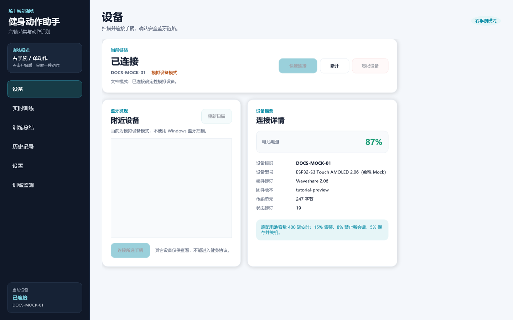
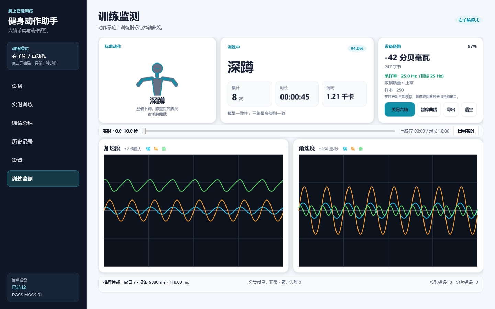
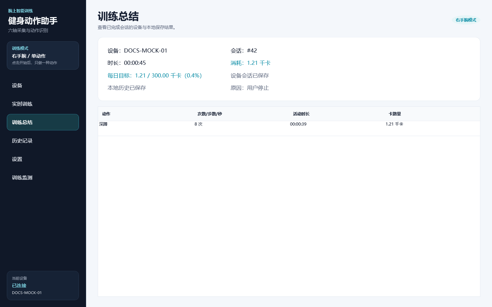
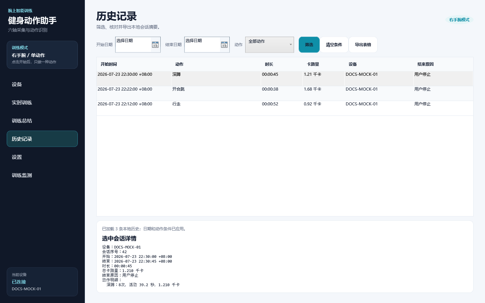
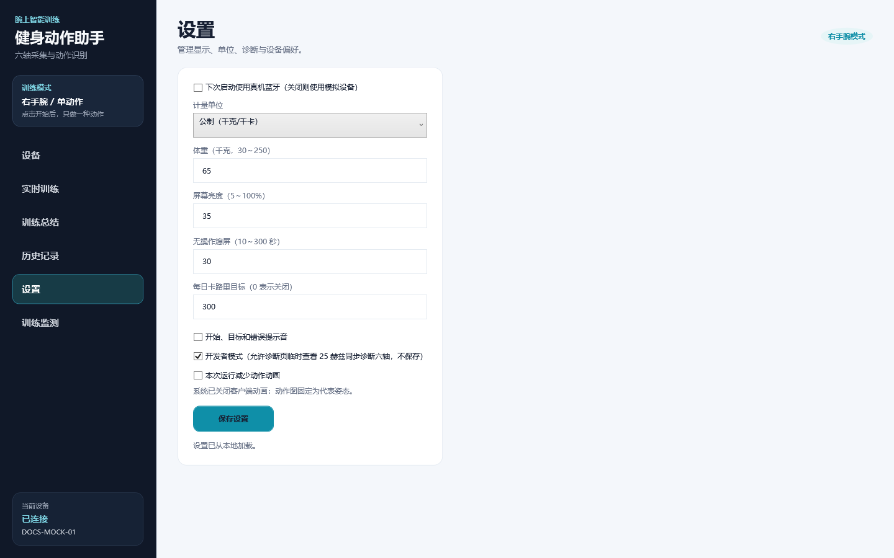

# 健身动作助手 Windows 上位机

## 当前能力

- `.NET 8 + WPF + MVVM` 真黑主题。
- 六个页面：设备、实时训练、训练总结、历史记录、设置、诊断。
- 全部用户可见窗口标题、按钮、标签、状态、错误、单位和历史导出内容使用自然中文；协议类名、枚举、字段名与内部诊断日志保持冻结英文标识。
- 设备页会把尚未扫描的内部占位值显示为“未选择蓝牙设备”，把无硬件演示标识显示为“本机模拟设备”；连接后的真实设备标识保持原样，便于诊断。
- `MockDeviceSession` 无硬件演示：连接、开始、暂停、恢复、停止、计数、步数、时长、卡路里、电量和断线恢复。
- BLE v1 协议编解码、CRC、MTU 23/185/247 分片与重组。
- `WindowsBleDeviceSession` 真机会话状态机：设备筛选、Manifest/快照恢复、控制 indication、LiveState/Event 通知、同 request ID 单次重试和自动重连。
- 正式 Manifest v1 严格解析：连接控制前检查协议 1.0、297 维特征、双 M0 SHA、11 类 CRC、热量表版本、能力位和 LittleFS 容量；缺失、重复、截断或不兼容字段直接断开，未知新 tag 安全跳过。
- `WinRtBleTransport`：使用 `Windows.Devices.Bluetooth` 完成系统扫描、LE 安全配对、Uncached 服务发现、0001～0007 特征完整性检查和 GATT 资源释放；扫描、按 ID 重连与忘记设备均显式使用 `DeviceInformationKind.AssociationEndpoint`，首次绑定再通过 `CustomPairing` 响应 Display Only 手表的 `ProvidePin` 请求，禁止使用 WinRT 默认的不可配对 `DeviceInterface`。
- 11 类纯 WPF 本地矢量教练人偶：每类具有可辨识关键姿态、填充躯干、胶囊四肢、关节和脚位，不依赖网络、GIF、Lottie 或第三方动画包。
- 动画由设备权威 `action_id` 与 `AnimationRevision` 驱动；断线或 Unknown 立即显示等待态，不保留旧动作。
- 遵循 Windows“在 Windows 中显示动画”辅助功能，并提供本次运行“减少动作动画”开关；启用后固定代表姿态并停止 30 FPS 计时器。
- 训练历史与设置采用原子 JSON 文件；接口已按 SQLite 风格设计，后续可新增 SQLite 适配器而不修改页面。
- 设置页本地保存后，已连接设备依次同步 UTC/时区、体重、训练目标、亮度、声音、熄屏和开发者模式；设备失败会明确保留“本地已保存、设备未同步”事实。
- 设置页支持公制和英制。公制输入千克，英制输入磅；选择会写入本地偏好，BLE 命令 7 始终把体重换算为协议规定的整数克，设备端热量单位不随界面切换。
- 训练总结页显示每日卡路里目标进度、设备会话保存状态和本地历史保存状态，避免把“设备已停止”误写成“两端都已保存”。
- 设备页提供中文“忘记设备”：真机先断开并取消 Windows 系统配对，再清除本地固定设备 ID；Mock 模式只清理模拟固定状态，便于无硬件测试。
- 历史页支持连接/重连后按 cursor 补传设备摘要、`device_id + session_seq` 幂等落盘、本地日期区间、11 类动作筛选、逐动作详情和带 UTF-8 BOM 的 CSV 导出。
- 设备页显示设备 ID、型号、硬件修订、固件版本、权威电量、ATT MTU 和最新 `state_revision`。
- 诊断页显示扫描 RSSI、ATT MTU、设备版本、权威电量、`state_revision`、自动重连尝试次数、CRC 与分片错误累计，以及双模型短 SHA、能力位和 LittleFS 可用容量。
- 诊断页提供显式开发者“诊断六轴流”开关；协议内部名称仍为 `RawStream`。页面保留最近十分钟同步样本，滑块可回看任意十秒窗口并一键回到实时。数据默认只驻留内存；用户点击“导出”并确认路径后，实时模式导出全部缓存，暂停/回看模式只导出当前窗口。

## 界面导览

PC 端采用 WPF 与 Fluent 风格产品语义：深色侧栏负责稳定导航，浅色工作区承载任务，青蓝色只用于主操作和链路状态。页面不会用研发编号、模型维度或类别总数占用用户注意力。

以下 1440×900 截图由 [`FitnessCoach.UiCapture`](FitnessCoach.UiCapture/Program.cs) 使用确定性 Mock 数据生成。捕获过程不扫描蓝牙、不读取 `%LOCALAPPDATA%\IMUFitness`，因此适合开源教程、文档回归和隐私安全的持续集成。生成版本、尺寸与 SHA-256 记录在 [`manifest.json`](../docs/assets/ui/pc/manifest.json)；截图中的数值是教程样例，不是真板测量结论。

在仓库根目录复现截图：

```powershell
dotnet run --project .\pc\FitnessCoach.UiCapture\FitnessCoach.UiCapture.csproj `
  -c Release -- --output .\docs\assets\ui\pc
```

成功标记为 `PC_UI_CAPTURE_OK pages=6 size=1440x900 mode=deterministic-mock`。完整资产合同见 [`docs/assets/ui/pc/README.md`](../docs/assets/ui/pc/README.md)。

| 设备与实时训练 |
|---|
|  |
|  |

| 训练监测与总结 |
|---|
|  |
|  |

| 历史与设置 |
|---|
|  |
|  |

## 五分钟 Mock 教程

Mock 与真机实现同一个 `IDeviceSession`，读者可在不连接开发板时先理解完整产品流程。Mock 只能证明界面和业务状态机可运行，不能证明 BLE、IMU、分类或计数达到真板要求。

1. 在仓库根目录执行：

   ```powershell
   powershell -NoProfile -ExecutionPolicy Bypass -File pc\tools\run.ps1
   ```

2. 全新配置默认使用 Mock。若以前启用了真 BLE，在“设置”关闭“下次启动使用真实 Windows BLE”，保存并重启应用。
3. 打开“设备”，点击“快速连接”。设备标识会明确包含 `Mock` 或“模拟设备”，避免把演示数值误当实测。
4. 打开“实时训练”，点击“开始”。观察动作示范、权威累计、时长、热量和电量同步变化。
5. 执行“暂停 -> 恢复 -> 停止”，检查“训练总结”和“历史记录”是否出现同一会话。
6. 需要查看数据链时，先在“设置”启用开发者模式，再到“训练监测”开启诊断六轴流。导出前必须由用户在文件对话框确认路径。

## 工程组成

`FitnessCoach.sln` 固定包含 7 个项目：

- `FitnessCoach.Domain`：领域对象、设备会话和只读诊断快照合同；
- `FitnessCoach.Bluetooth`：协议、Mock、真 BLE 会话状态机；
- `FitnessCoach.Bluetooth.Windows`：WinRT 扫描、配对和 GATT transport；
- `FitnessCoach.Infrastructure`：原子 JSON 会话与设置仓储；
- `FitnessCoach.App`：WPF/MVVM 六页应用；
- `FitnessCoach.Tests`：协议、仓储、ViewModel、动画和 fake BLE 综合测试；
- `FitnessCoach.UiCapture`：使用确定性 Mock 数据离屏生成教程截图和哈希清单，不扫描蓝牙、不读取用户数据。

`FitnessCoach.SessionTransfer.Tests` 是独立会话补传测试项目，不加入 Solution；交付验证时单独运行。

## 架构与线程模型

上位机保持 MVVM 边界，页面不直接访问 WinRT、文件系统或 BLE 字节。

```text
WinRtBleTransport / MockDeviceSession
  -> WindowsBleDeviceSession 解析协议、重组分片、维护权威 revision
     -> IDeviceSession 事件与只读快照
        -> ViewModel
           -> IUiDispatcher
              -> WPF Dispatcher
                 -> XAML 绑定与 DrawingContext 绘制
```

关键规则：

- [`WinRtBleTransport.cs`](FitnessCoach.Bluetooth.Windows/WinRtBleTransport.cs) 只管理 Windows 扫描、配对、GATT 特征和资源释放；
- [`WindowsBleDeviceSession.cs`](FitnessCoach.Bluetooth/WindowsBleDeviceSession.cs) 只管理协议、控制重试、重连和设备权威状态；
- ViewModel 通过 [`IUiDispatcher.cs`](FitnessCoach.App/Services/IUiDispatcher.cs) 切回 UI 线程，BLE 回调不得直接修改绑定属性；
- [`WpfUiDispatcher.cs`](FitnessCoach.App/Services/WpfUiDispatcher.cs) 是生产调度器，[`ImmediateUiDispatcher.cs`](FitnessCoach.App/Services/ImmediateUiDispatcher.cs) 是无窗口测试替身；
- XAML code-behind 只保留控件初始化和平台事件，不承载训练规则；
- 动作示范由 [`ActionStickFigure.cs`](FitnessCoach.App/Controls/ActionStickFigure.cs) 与 [`ActionPoseLibrary.cs`](FitnessCoach.App/Services/ActionPoseLibrary.cs) 绘制，分类和计数仍以设备 Live State 为唯一权威。

这种分层让教程读者可以分别替换蓝牙 transport、会话状态机、仓储或页面，而不需要同时重写整个应用。

## 固定产品合同

- 原配电池容量：400 毫安时（硬件规格写作 `400mAh`）。
- 电量 `≤15%`：低电告警。
- 电量 `≤8%`：禁止开始新会话。
- 电量 `≤5%`：保存当前会话并关机。
- 当前手表硬件没有振动马达；界面和配置不提供振动功能，协议版本 1 的兼容保留位固定写零。
- 上位机只显示设备权威动作、计数和卡路里，不自行重复推理或计数。

## 用户界面中文口径

- “真机蓝牙”表示 Windows 蓝牙低功耗硬件会话；“模拟设备”表示无开发板演示会话。
- “最大传输单元”对应协议内部 `ATT MTU`，“状态修订号”对应冻结字段 `state_revision`。
- “设备能力清单”对应协议内部 `Manifest`，“内部文件系统”对应固件实现 `LittleFS`。
- “诊断六轴流”和“25 赫兹同步诊断码”对应冻结接口 `RawStream` 及带 `Raw` 后缀的字段；字段名和线上字节不改。
- 用户可选公制或英制体重显示：公制为千克，英制为磅；卡路里仍统一显示千卡，协议体重始终使用克。秒、毫秒、毫安时和分贝毫瓦等技术单位不随体重显示制式变化。
- 设备型号、固件版本、十六进制摘要、文件扩展名和可复制内部日志属于技术数据，保持设备或协议原值。

## 构建

```powershell
dotnet build pc\FitnessCoach.sln -c Release --nologo --verbosity minimal
```

真 BLE 项目编译合同为 `net8.0-windows10.0.26100.0`，最低运行系统为 Windows 10 2004（`10.0.19041`）。本机不必安装额外第三方 BLE 包；Windows SDK .NET 投影由目标框架提供。

## 一键运行与发布

推荐使用仓库脚本。脚本把 `DOTNET_CLI_HOME` 和 `NUGET_PACKAGES` 放在项目根 `.codex-local`，不向用户目录写入 Codex 创建的缓存：

```powershell
# Release 构建成功后启动 WPF；Mock/真 BLE 仍由设置页决定。
powershell -NoProfile -ExecutionPolicy Bypass -File pc\tools\run.ps1

# 发布 Windows x64 自包含目录；目标电脑无需安装 .NET 8 Desktop Runtime。
powershell -NoProfile -ExecutionPolicy Bypass -File pc\tools\publish.ps1
```

默认发布目录为 `.codex-local\publish\FitnessCoach-win-x64-时间戳`。需要固定交付目录时可显式指定：

```powershell
powershell -NoProfile -ExecutionPolicy Bypass -File pc\tools\publish.ps1 `
  -OutputDirectory .\release\FitnessCoach-win-x64
```

`publish.ps1` 生成多文件 self-contained 目录，兼容 WPF、WinRT BLE 和本地 JSON 数据。请复制整个目录，不要只复制 `FitnessCoach.App.exe`。

## 运行无硬件测试

```powershell
$env:DOTNET_ROLL_FORWARD = "Major" # 本机仅安装更高主版本桌面运行时时使用
dotnet run --project pc\FitnessCoach.Tests\FitnessCoach.Tests.csproj -c Release --no-build --nologo

# 独立验证 ESP32 LIST/GET 分页、断线恢复和幂等写入。
dotnet run --project pc\FitnessCoach.SessionTransfer.Tests\FitnessCoach.SessionTransfer.Tests.csproj -c Release --nologo
```

## 启动界面

```powershell
$env:DOTNET_ROLL_FORWARD = "Major" # 已安装 .NET 8 Desktop Runtime 时可省略
dotnet run --project pc\FitnessCoach.App\FitnessCoach.App.csproj --no-build
```

应用数据默认位于 `%LOCALAPPDATA%\IMUFitness`。会话复合键为 `device_id + session_seq`，重复停止或重连同步不会制造重复历史。

## Mock 与真实 BLE 切换

1. 默认使用 Mock；Windows 蓝牙关闭或手表未接入时也可演示六页界面。
2. 在“设置”勾选“下次启动使用真实 Windows BLE”，保存后退出并重新打开上位机。训练中不热替换会话，避免丢失通知订阅和历史写入。
3. 如果电脑或手表保存过不可用的绑定，先在手表“设置”点击“忘记电脑”，再在 PC“设备”点击“忘记设备”。若 Windows 系统蓝牙列表仍保留 `BPNN-FIT-*`，也在系统设置中删除该记录。
4. 在“设备”点击“重新扫描”，选择广播名为 `BPNN-FIT-*` 的健身手表，再点击连接。不要选择耳机、鼠标或其它 BLE 设备。
5. 首次绑定会以可配对的 Association Endpoint 进入 Windows LE Secure Connections。手表显示六位码时保持该页可见；上位机只在 WinRT `ProvidePin` 请求中提交同一码，不把配对码写入应用日志。
6. 只有配对、Uncached 服务发现、Manifest 兼容检查、通知订阅和权威快照全部成功，界面才显示“已连接”。
7. 解除绑定时再次执行“手表忘记电脑 -> PC 忘记设备”。两端都清除后，下次连接按首次配对处理。
8. 如需自定义扫描选择器，可实现 `IWindowsBleDeviceSelector` 并注入 `WinRtBleTransport`，无需修改协议或会话状态机。

模式切换在下次启动生效。训练中不热替换 `IDeviceSession`，避免丢失通知订阅、控制响应和历史写入。

## 本地动作动画

实时页不根据 PC 传感器或 Event 自行猜动作。它只读取 Live State 的权威动作 ID：

- `good_morning`：髋部固定、上身前屈；
- `jumping_jack`：手脚同步开合；
- `jumping_lunge`：左右弓步经过腾空帧；
- `jumping_squat`：低蹲、伸展腾空、落地；
- `lunge`：单侧弓步且无腾空；
- `sit`：坐姿和轻微呼吸；
- `squat`：站立与低蹲；
- `trot`：快速交替抬膝；
- `tuck_jump`：腾空时双膝收腹；
- `walk`：慢速交替迈步；
- `wave`：身体固定、单手挥动。

所有姿态由归一化关节点在线插值，绘图只使用 WPF `DrawingContext`。默认约 30 FPS；页面隐藏、设备断线、动作未知或减少动画生效时计时器停止。`AnimationRevision` 变化会重置当前动作周期并产生不超过 220ms 的头部外圈脉冲；减少动画时该脉冲也关闭。

## 真 BLE 连接与恢复顺序

每次首次连接或自动重连固定执行：

1. 扫描并选择同一设备；
2. 完成 Windows 系统配对边界；
3. Uncached 发现自定义服务和 `0001`～`0007` 全部特征；
4. 读取 Manifest；
5. 订阅 Control Point indication；
6. 订阅 Live State 与 Event notification；
7. 读取权威 Live State 快照；
8. 只有以上步骤全部成功，界面才显示“已连接”。

连接成立后，会话自动发送命令 6。PC 接口读取当前 UTC Unix 毫秒，编码时以整数除法截断毫秒尾数，线上发送固件要求的 Unix 秒和本地时区分钟；合法范围为 2000-01-01 到 2099-12-31。自动重连也重复校时。若意外断线前已开启 RawStream，会话在兼容检查和校时完成后恢复显式流状态；用户主动断开则清除恢复意图。

控制请求按实际 ATT MTU 使用 8 字节包络分片。两秒没有收到 indication 时，只使用同一个 `request_id`、同一个逻辑 sequence 和同一帧字节重试一次；设备端据此返回缓存响应，不重复开始、暂停或停止会话。

意外断线后退避为 `1、2、4、8、15` 秒，之后保持 15 秒。重连必须重新读取 Manifest 和快照；首个快照可重建 ESP32 重启后的 revision 基线，随后只接受严格更大的 `state_revision`。Event 仅驱动动画/诊断，次数和卡路里仍以 Live State 为唯一权威。

真 BLE 连接后，WinRT transport 还会读取标准 Device Information 服务的型号、硬件修订和固件修订；RSSI 取 Windows AEP 扫描属性，系统蓝牙栈未提供时界面明确显示“未知”。诊断计数只在当前 PC 进程内累计，不写回设备，也不改变训练状态。

历史页在连接和重连成功后，以当前设备本地最大 `session_seq` 为 cursor 请求缺失摘要。每页成功写入原子 JSON 后才推进 cursor；重复页按 `(device_id, session_seq)` 替换，不会产生重复历史。同步失败只影响设备补传，本地历史仍可查看。历史筛选使用本地自然日，进入仓储前转换为 UTC 半开区间 `[开始日 00:00, 结束日次日 00:00)`。动作条件按领域 `ActionId` 匹配动作指标，不依赖中文显示字符串。CSV 每个动作指标占一行，字段内逗号、双引号和换行按 RFC4180 转义。

设置页先保存 `%LOCALAPPDATA%\IMUFitness\preferences.v1.json`，再在已连接时发送配置命令。体重合法范围按协议统一为 30～250 kg；英制界面只把输入磅换算到该范围，不改变协议。亮度范围为 5～100%；熄屏范围为 10～300 秒。资料和偏好各有独立 revision。任何设备命令失败时，页面显示具体原因并明确本地设置仍已保存，不能把本地成功写成设备成功。

协议内部的 `RawStream` 只用于开发者现场诊断，界面统一称为“诊断六轴流”。先在设置页启用开发者模式并成功同步设备，再到诊断页开启。页面显示样本序号、设备单调毫秒、`gx/gy/gz/ax/ay/az` 六轴 25 赫兹同步诊断码和质量位；这些码由设备端对抗混叠滤波、严格 25 Hz 重采样后的物理量按 QMI8658 比例重新量化，不是未经处理的芯片先进先出缓冲区原始码。字段名保留 `Raw` 后缀仅为兼容冻结的版本 1 接口；上位机不做第二次滤波。两张图使用同一 15000 点进程内有界历史，25 Hz 时约十分钟；可见窗口固定 250 点，滑块偏移按 25 Hz 换算且回看时继续接收新样本。数据不写入历史 JSON，也不自动落盘；用户点击“导出”并在系统对话框确认路径后，生成带 UTF-8 BOM 的 44 列中文 CSV。除原六轴、双时间和质量位外，文件固定写入 `佩戴手侧=右手腕`，并直接记录基础 M0、掩码 M0、融合类别及置信度、稳定动作、推理耗时、分类窗口末点和 EventV1 权威计数标记。实时模式导出全部缓存，暂停或回看模式导出当前可见窗口。

主机 fake 测试覆盖：选择边界、订阅顺序、MTU23 控制分片、非递增 revision 丢弃、Event 非权威、同 ID 重试、断线退避、重读 Manifest/快照及 Dispose 释放。该测试证明软件状态机，不替代真机蓝牙验收。

## 本地数据与隐私

- 应用不包含云服务、遥测或自动上传。会话和偏好只写入 `%LOCALAPPDATA%\IMUFitness`。
- `sessions.v1.json` 保存训练摘要，`preferences.v1.json` 保存本地偏好；两者使用临时文件加原子替换，避免半写文件。
- 诊断六轴样本、分类窗口和计数标记默认只驻留当前进程内存，容量固定为约十分钟；关闭应用后不会自动保存。
- 导出必须由用户点击按钮并在 Windows 文件对话框确认路径。CSV 使用 UTF-8 BOM，便于中文 Excel 直接打开。
- 44 列 IMU CSV 包含动作、时间、设备标识关联信息和人体运动波形。公开分享前应取得采集者同意，并按用途移除设备标识、绝对时间或不需要的诊断列。
- 截图生成器使用独立文档 Mock 和临时内存仓储，不读取本地真实会话、偏好或蓝牙设备。

实现入口：[`LocalAppDataPaths.cs`](FitnessCoach.Infrastructure/LocalAppDataPaths.cs)、[`JsonSessionRepository.cs`](FitnessCoach.Infrastructure/JsonSessionRepository.cs)、[`ImuCsvExporter.cs`](FitnessCoach.App/Services/ImuCsvExporter.cs) 和 [`HistoryCsvExporter.cs`](FitnessCoach.App/Services/HistoryCsvExporter.cs)。

## 真机排错

| 现象 | 检查 | 恢复 |
|---|---|---|
| 扫描不到手表 | Windows 蓝牙是否打开；手表 BLE 是否启用；广播名是否为 `BPNN-FIT-*`；是否被另一台电脑占用 | 让手表回到主页，关闭其它连接端，点击“重新扫描”；仍无设备时重启 Windows 蓝牙适配器和手表 |
| 能看到手表，但提示“Windows BLE 配对失败” | PC、Windows 系统列表和手表是否保存了不一致的绑定；手表六位码是否仍有效 | 按“手表忘记电脑 -> PC 忘记设备 -> Windows 删除设备”顺序清理，重启上位机后重新扫描和配对 |
| 已配对但应用仍显示未连接 | 自定义服务 `0001-0007` 是否完整；Manifest 是否与协议 1.0、297 维特征和模型摘要匹配 | 保留具体错误，重新连接触发 Uncached 发现；若仍不兼容，使用同一发布版本的 PC 与固件，不能跳过 Manifest 门 |
| 连接后反复断开 | RSSI、电量、系统蓝牙开关、休眠状态；是否有第二个程序占用同一 GATT 设备 | 靠近电脑、保持手表供电、关闭其它 BLE 客户端；查看诊断页重连次数和协议错误，再按 1/2/4/8/15 秒退避观察 |
| 设置显示“本地已保存、设备未同步” | 连接状态和设备命令 ACK；资料或偏好 revision 是否推进 | 先重新连接，再打开设置重新保存；本地成功不能当作设备成功 |
| 训练监测没有六轴曲线 | 设置页开发者模式是否已同步；诊断六轴流是否开启；当前固件是否声明 RawStream 能力 | 连接设备并同步开发者模式，再显式开启诊断六轴流；结束诊断后关闭流，确认带宽回到零 |
| 界面卡顿或计数看似延迟 | 诊断页采样率、分片/CRC 错误、UI 线程是否执行文件或 BLE 阻塞调用 | 关闭诊断流验证基础链路；保留日志和 CSV；检查所有设备事件是否经 `IUiDispatcher` 更新 ViewModel |

## 发布验收

每个可分发版本必须独立通过：

1. `dotnet build pc\FitnessCoach.sln -c Release` 零错误、零警告；
2. `FitnessCoach.Tests` 和 `FitnessCoach.SessionTransfer.Tests` 全部通过；
3. 文档截图由 `FitnessCoach.UiCapture` 重新生成，`manifest.json` 中尺寸与 SHA-256 匹配；
4. Windows 首次配对、双端忘记设备、自动重连、Manifest 失败关闭连接均符合本页流程；
5. 实际协商 MTU、弱 RSSI、系统蓝牙开关、休眠唤醒、设备重启和 indication 丢失均能恢复；
6. 命令 6/7/8/9/11 的 ACK、持久化、断电恢复和 RawStream 关闭后带宽归零；
7. 一小时连续通知期间内存有界、UI 可操作、训练历史不重复；
8. 使用 `publish.ps1` 生成全新的自包含目录，并在未安装 .NET Desktop Runtime 的 Windows x64 机器上启动验证。

主机测试、Mock 截图和真机验收是三类独立证据，任何一类不能替代另外两类。
